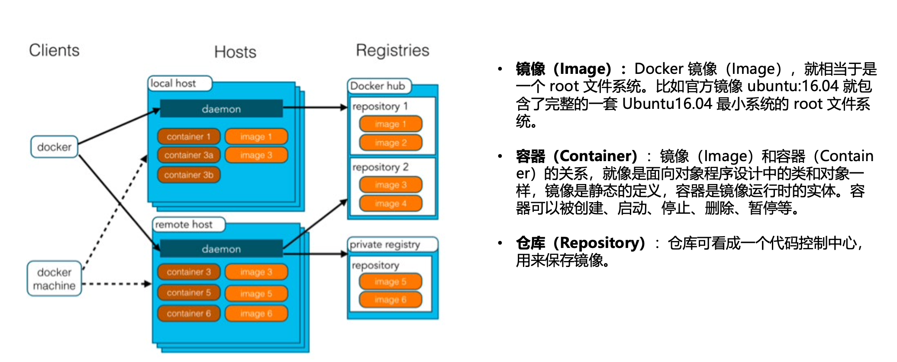
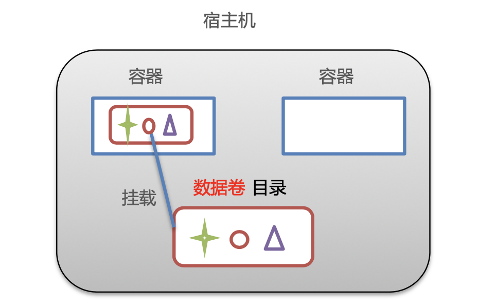
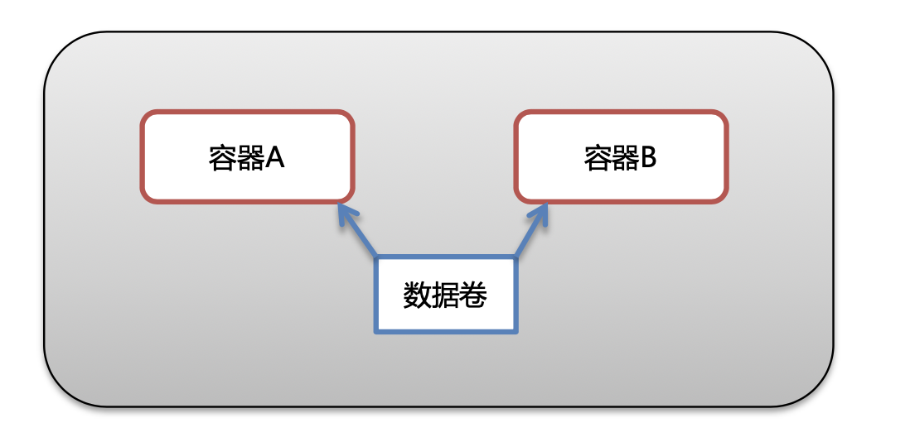
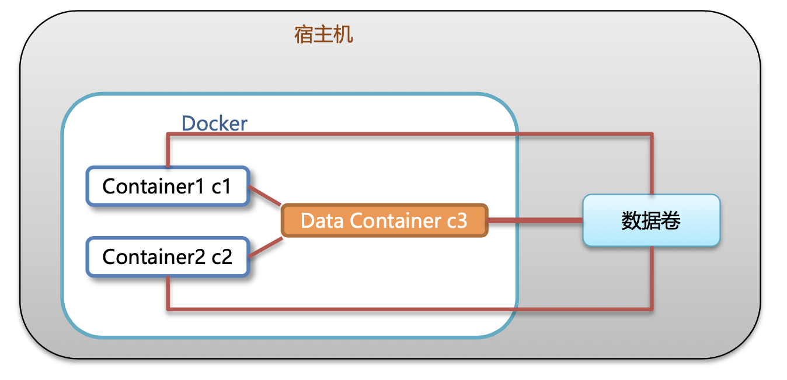
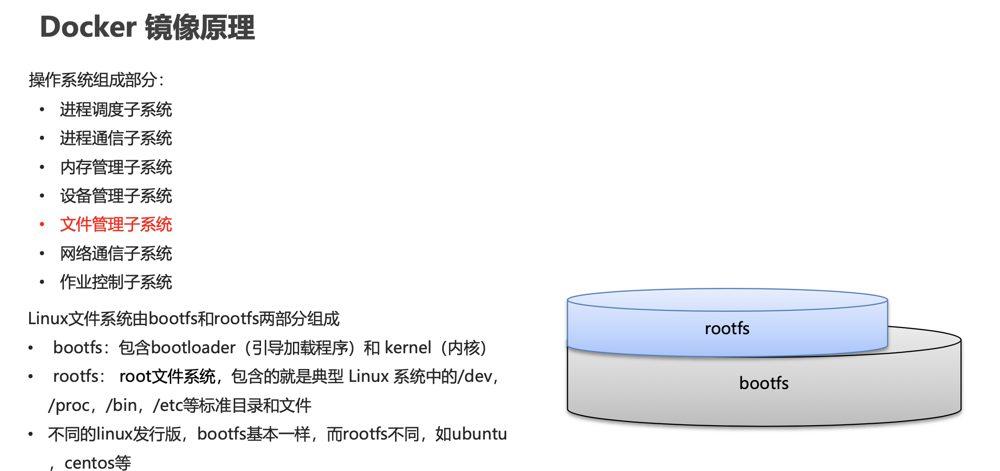
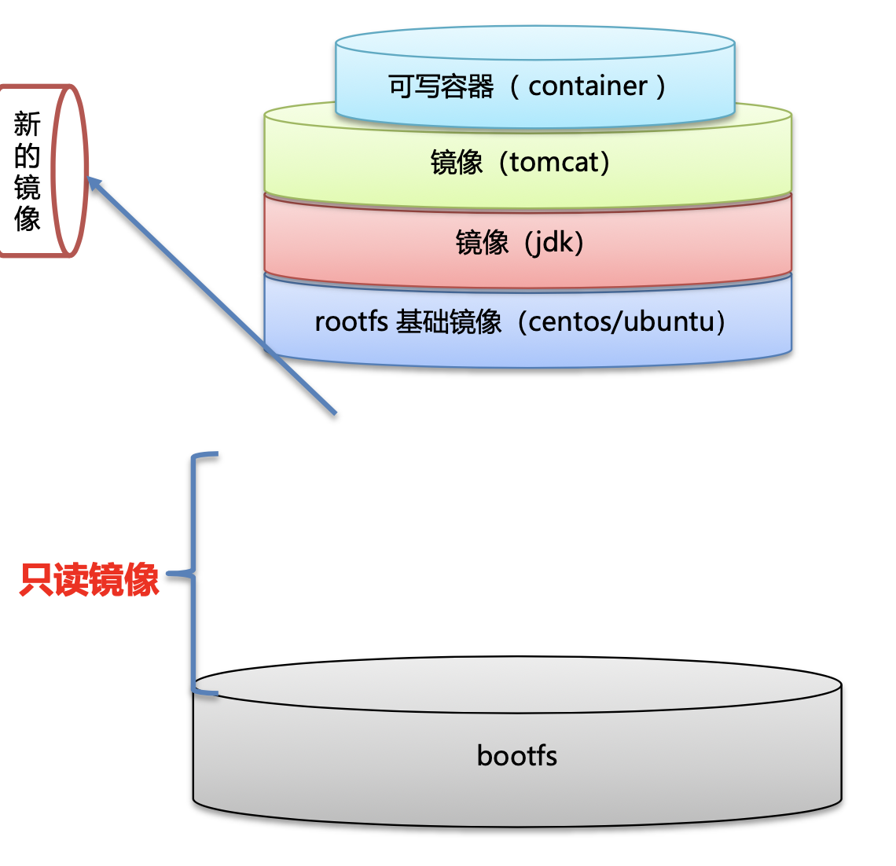
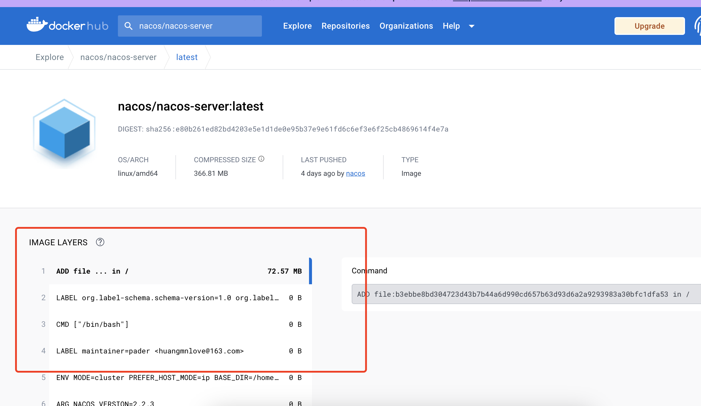

# Docker学习


## 一、初识Docker

### 1、Docker 概念

- Docker 是一个开源的应用容器引擎
- 诞生于 2013 年初，基于 Go 语言实现， dotCloud 公司出品(后改名为Docker Inc)
- Docker 可以让开发者打包他们的应用以及依赖包到一个轻量级、可移植的容器中，然后发布到任何流行的Linux 机器上。
- 容器是完全使用沙箱机制，相互隔离
- 容器性能开销极低。
- Docker 从 17.03 版本之后分为 CE(Community Edition: 社区版) 和 EE(Enterprise Edition: 企业版)


### 2、安装Docker

> 基于Centos安装

```shell
# 1、yum 包更新到最新 
yum update
# 2、安装需要的软件包， yum-util 提供yum-config-manager功能，另外两个是devicemapper驱动依赖的 
yum install -y yum-utils device-mapper-persistent-data lvm2
# 3、 设置yum源
yum-config-manager --add-repo https://download.docker.com/linux/centos/docker-ce.repo
# 4、 安装docker，出现输入的界面都按 y 
yum install -y docker-ce
# 5、 查看docker版本，验证是否验证成功
docker -v
```

### 3、docker架构




## 二、Docker命令

###  1、进程相关命令

**启动docker服务:** 

```
systemctl start docker
```

**停止docker服务:** 

```
systemctl stop docker
```

**重启docker服务:**

```
systemctl restart docker
```

**查看docker服务状态:** 

```shell
systemctl status docker
```

**设置开机启动docker服务:** 

```shell
systemctl enable docker
```


### 2、Docker 镜像相关命令

**查看镜像: 查看本地所有的镜像**

```
docker images
docker images –q # 查看所用镜像的id
```

**搜索镜像:从网络中查找需要的镜像**

```
docker search 镜像名称
```

**拉取镜像:从Docker仓库下载镜像到本地，镜像名称格式为 名称:版本号，如果版本号不指定则是最新的版本。 如果不知道镜像版本，可以去docker hub 搜索对应镜像查看。**

```
docker pull 镜像名称
```

**删除镜像: 删除本地镜像**

```shell
# 删除指定本地镜像
docker rmi 镜像id 
# 删除所有本地镜像
docker rmi `docker images -q` 
```


### **3、Docker 容器相关命令**

**查看容器**

```shell
# 查看正在运行的容器 
docker ps 
# 查看所有容器
docker ps –a 
```

**创建并启动容器**

```shell
docker run 参数
```

**参数说明:**

- -i:保持容器运行。通常与 -t 同时使用。加入it这两个参数后，容器创建后自动进入容器中，退出容器后，容器自动关闭。
- -t:为容器重新分配一个伪输入终端，通常与 -i 同时使用。
- -d:以守护(后台)模式运行容器。创建一个容器在后台运行，需要使用docker exec 进入容器。退出后，容器不会关闭。
- -it 创建的容器一般称为交互式容器，-id 创建的容器一般称为守护式容器
- --name:为创建的容器命名。

**进入容器**

```shell
# 退出容器，容器不会关闭
docker exec 参数 
```

**停止容器**

```shell
docker stop 容器名称
```

**启动容器**

```shell
docker start 容器名称
```

**删除容器:如果容器是运行状态则删除失败，需要停止容器才能删除**

```shell
docker rm 容器名称
```

**查看容器信息**

```shell
docker inspect 容器名称
```


## 三、Docker 容器的数据卷

### 1、数据卷概念



- 数据卷是宿主机中的一个目录或文件
- 当容器目录和数据卷目录绑定后，对方的修改会立即同步 
- 一个数据卷可以被多个容器同时挂载
- 一个容器也可以被挂载多个数据卷

**数据卷作用**

- 容器数据持久化
- 外部机器和容器间接通信 容器之间数据交换


### 2、配置数据卷

创建启动容器时，使用 –v 参数 设置数据卷

```
docker run ... –v 宿主机目录(文件):容器内目录(文件) ...
```

**注意事项:**

1. 目录必须是绝对路径
2. 如果目录不存在，会自动创建 3. 可以挂载多个数据卷



### 3、数据卷容器

**多容器进行数据交换**

1. 多个容器挂载同一个数据卷
2. 数据卷容器



**配置数据卷容器**

**创建启动c3数据卷容器，使用 –v 参数 设置数据卷**

```shell
docker run –it --name=c3 –v /volume centos:7 /bin/bash
```

**创建启动 c1 c2 容器，使用 –-volumes-from 参数 设置数据卷**

```shell
docker run –it --name=c1 --volumes-from c3 centos:7 /bin/bash
docker run –it --name=c2 --volumes-from c3 centos:7 /bin/bash
```

***数据卷小结***

> 1. **数据卷概念**
>
> - 宿主机的一个目录或文件
>
> 2. **数据卷作用**
>
> - 容器数据持久化
> - 客户端和容器数据交换
> - 容器间数据交换 
>
> 3. **数据卷容器**
>
> - 创建一个容器，挂载一个目录，让其他容器继承自该容器( --volume-from )。 
> - 通过简单方式实现数据卷配置

## 四、Dockerfile

### 1、Docker 镜像原理



- Docker镜像是由特殊的文件系统叠加而成
- 最底端是 bootfs，并使用宿主机的bootfs
- 第二层是 root文件系统rootfs,称为base image
- 然后再往上可以叠加其他的镜像文件
- 统一文件系统(Union File System)技术能够将不同的
- 层整合成一个文件系统，为这些层提供了一个统一的视角，这样就隐藏了多层的存在，在用户的角度看来，只存在一个文件系统。
- 一个镜像可以放在另一个镜像的上面。位于下面的镜像称 为父镜像，最底部的镜像成为基础镜像。
- 当从一个镜像启动容器时，Docker会在最顶层加载一个读 写文件系统作为容器




### 2、Docker 镜像如何制作?

**容器转为镜像**

```
docker commit 容器id 镜像名称:版本号
docker save -o 压缩文件名称 镜像名称:版本号
docker load –i 压缩文件名称
```


### 3、Dockerfile 概念

- Dockerfile 是一个文本文件
- 包含了一条条的指令
- 每一条指令构建一层，基于基础镜像，最终构建出一个新的镜像
- 对于开发人员:可以为开发团队提供一个完全一致的开发环境
- 对于测试人员:可以直接拿开发时所构建的镜像或者通过Dockerfile文件
- 构建一个新的镜像开始工作了
- 对于运维人员:在部署时，可以实现应用的无缝移植


**查看公有仓库镜像的dockerfile文件**

> https://hub.docker.com

找到对应的镜像，然后点击对应的tag查看layers信息



### 4、Dockerfile参数

| 关键字      | 作用                     | 备注                                                         |
| ----------- | ------------------------ | ------------------------------------------------------------ |
| FROM        | 指定父镜像               | 指定dockerfile基于那个image构建                              |
| MAINTAINER  | 作者信息                 | 用来标明这个dockerfile谁写的                                 |
| LABEL       | 标签                     | 用来标明dockerfile的标签 可以使用Label代替Maintainer 最终都是在docker image基本信息中可以查看 |
| RUN         | 执行命令                 | 执行一段命令 默认是/bin/sh 格式: RUN command 或者 RUN ["command" , "param1","param2"] |
| CMD         | 容器启动命令             | 提供启动容器时候的默认命令 和ENTRYPOINT配合使用.格式 CMD command param1 param2 或者 CMD ["command" , "param1","param2"] |
| ENTRYPOINT  | 入口                     | 一般在制作一些执行就关闭的容器中会使用                       |
| COPY        | 复制文件                 | build的时候复制文件到image中                                 |
| ADD         | 添加文件                 | build的时候添加文件到image中 不仅仅局限于当前build上下文 可以来源于远程服务 |
| ENV         | 环境变量                 | 指定build时候的环境变量 可以在启动的容器的时候 通过-e覆盖 格式ENV name=value |
| ARG         | 构建参数                 | 构建参数 只在构建的时候使用的参数 如果有ENV 那么ENV的相同名字的值始终覆盖arg的参数 |
| VOLUME      | 定义外部可以挂载的数据卷 | 指定build的image那些目录可以启动的时候挂载到文件系统中 启动容器的时候使用 -v 绑定 格式 VOLUME ["目录"] |
| EXPOSE      | 暴露端口                 | 定义容器运行的时候监听的端口 启动容器的使用-p来绑定暴露端口 格式: EXPOSE 8080 或者 EXPOSE 8080/udp |
| WORKDIR     | 工作目录                 | 指定容器内部的工作目录 如果没有创建则自动创建 如果指定/ 使用的是绝对地址 如果不是/开头那么是在上一条workdir的路径的相对路径 |
| USER        | 指定执行用户             | 指定build或者启动的时候 用户 在RUN CMD ENTRYPONT执行的时候的用户 |
| HEALTHCHECK | 健康检查                 | 指定监测当前容器的健康监测的命令 基本上没用 因为很多时候 应用本身有健康监测机制 |
| ONBUILD     | 触发器                   | 当存在ONBUILD关键字的镜像作为基础镜像的时候 当执行FROM完成之后 会执行 ONBUILD的命令 但是不影响当前镜像 用处也不怎么大 |
| STOPSIGNAL  | 发送信号量到宿主机       | 该STOPSIGNAL指令设置将发送到容器的系统调用信号以退出。       |
| SHELL       | 指定执行脚本的shell      | 指定RUN CMD ENTRYPOINT 执行命令的时候 使用的shell            |


## 5、Docker-Compose

> 官网：https://docs.docker.com/compose/

**服务编排概念**

微服务架构的应用系统中一般包含若干个微服务，每个微服务一般都会部署多个实例，如果每个微服务都要手动启停 ，维护的工作量会很大。

- 要从Dockerfile build image 或者去dockerhub拉取image
- 要创建多个container
- 要管理这些container(启动停止删除)

**Docker Compose**

Docker Compose是一个编排多容器分布式部署的工具，提供命令集管理容器化应用的完整开发周期，包括服务构建 ，启动和停止。使用步骤:

1. 利用 Dockerfile 定义运行环境镜像
2. 使用 docker-compose.yml 定义组成应用的各服务
3. 运行 docker-compose up 启动应用

### 1、安装Docker Compose

```shell
# Compose目前已经完全支持Linux、Mac OS和Windows，在我们安装Compose之前，需要先安装Docker。下面我 们以编译好的二进制包方式安装在Linux系统中。 
curl -L https://github.com/docker/compose/releases/download/1.22.0/docker-compose-`uname -s`-`uname -m` -o /usr/local/bin/docker-compose
# 设置文件可执行权限 
chmod +x /usr/local/bin/docker-compose
# 查看版本信息 
docker-compose -version
```

### 2、卸载Docker Compose

```shell
# 二进制包方式安装的，删除二进制文件即可
rm /usr/local/bin/docker-compose
```


### 3、 使用docker compose编排nginx+springboot项目

1. 创建docker-compose目录

```shell
mkdir ~/docker-compose
cd ~/docker-compose
```

2. 编写 docker-compose.yml 文件

```shell
version: '3'
services:
  nginx:
   image: nginx
   ports:
    - 80:80
   links:
    - app
   volumes:
    - ./nginx/conf.d:/etc/nginx/conf.d
  app:
    image: app
    expose:
      - "8080"
```

3. 创建./nginx/conf.d目录

```shell
mkdir -p ./nginx/conf.d
```


4. 在./nginx/conf.d目录下 编写itheima.conf文件

```shell
server {
    listen 80;
    access_log off;

    location / {
        proxy_pass http://app:8080;
    }
   
}
```

5. 在~/docker-compose 目录下 使用docker-compose 启动容器

```shell
docker-compose up
```

6. 测试访问

```shell
http://192.168.149.135/hello
```


## 6、Docker 私有仓库

> docker 自带的repository
>
> 开源的有harbor

### 1、私有仓库搭建

```shell
# 1、拉取私有仓库镜像 
docker pull registry
# 2、启动私有仓库容器 
docker run -id --name=registry -p 5000:5000 registry
# 3、打开浏览器 输入地址http://私有仓库服务器ip:5000/v2/_catalog，看到{"repositories":[]} 表示私有仓库 搭建成功
# 4、修改daemon.json   
vim /etc/docker/daemon.json    
# 在上述文件中添加一个key，保存退出。此步用于让 docker 信任私有仓库地址；注意将私有仓库服务器ip修改为自己私有仓库服务器真实ip 
{"insecure-registries":["私有仓库服务器ip:5000"]} 
# 5、重启docker 服务 
systemctl restart docker
docker start registry

```

### 2、将镜像上传至私有仓库

```shell
# 1、标记镜像为私有仓库的镜像     
docker tag centos:7 私有仓库服务器IP:5000/centos:7
# 2、上传标记的镜像     
docker push 私有仓库服务器IP:5000/centos:7
```


### 3、 从私有仓库拉取镜像

```shell
#拉取镜像 
docker pull 私有仓库服务器ip:5000/centos:7
```

