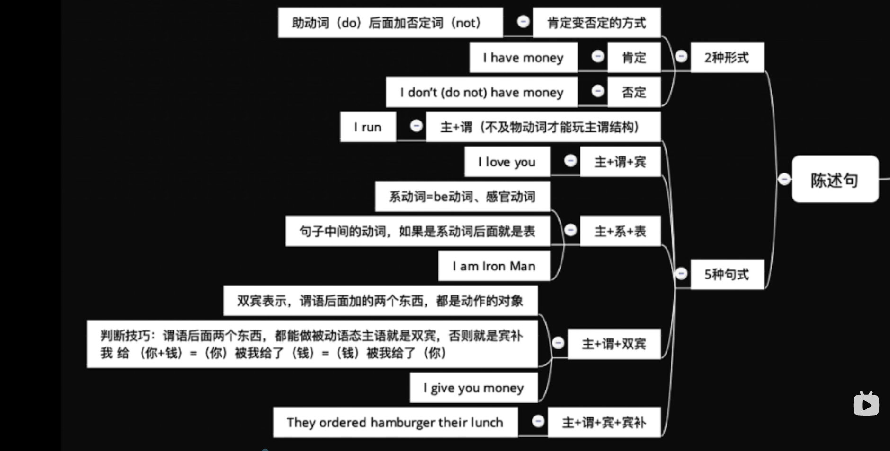
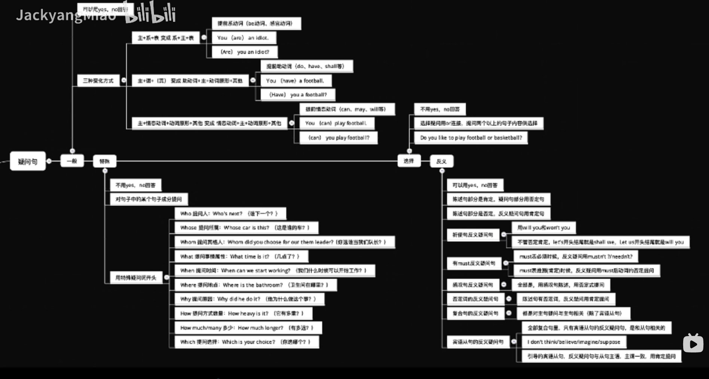
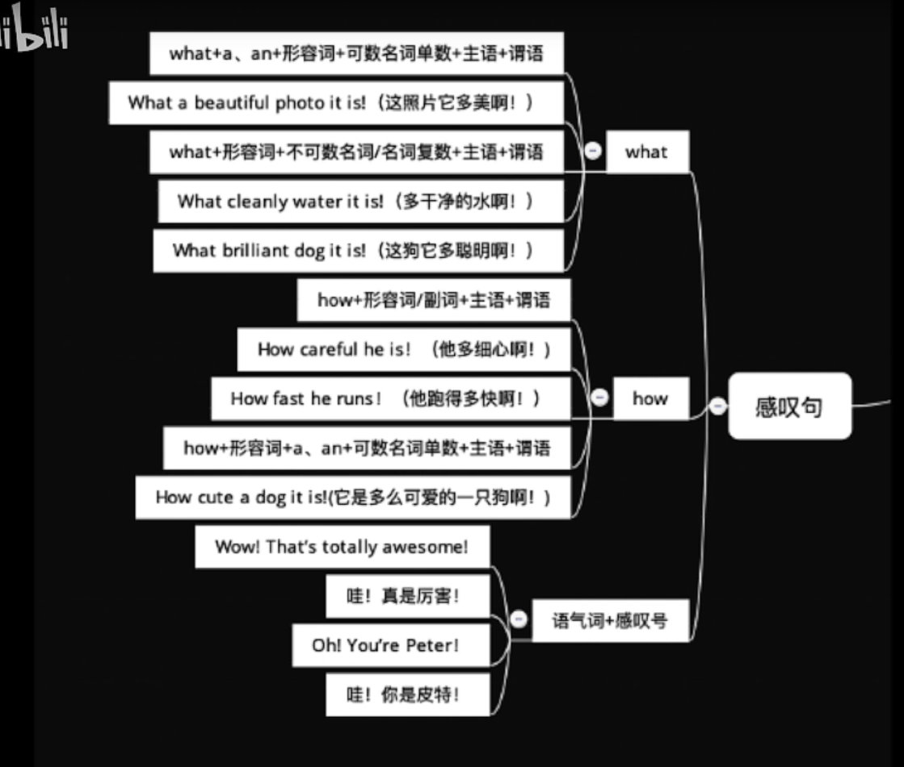
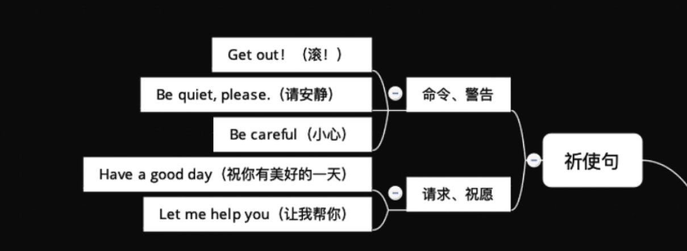
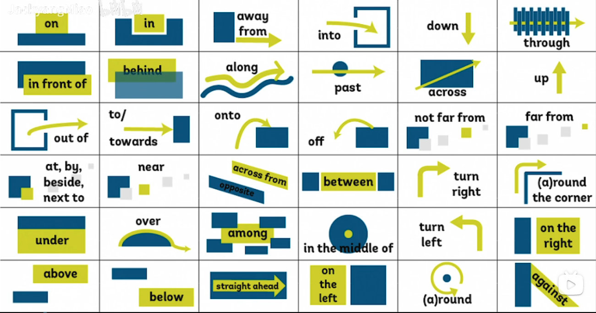
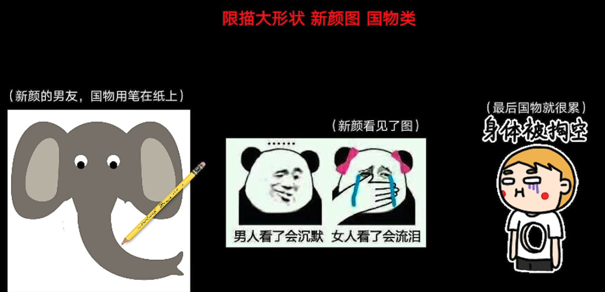

## 英语学习

#### 月份

January（一月），February（二月），March（三月），April（四月），May（五月），June（六月），July（七月），August（八月），September（九月），October（十月），November（十一月），December（十二月）。

Monday、Tuesday、Wednesday、Thursday、Friday、Saturday、Sunday

## 序数词

**使用序数词时，一般前面要加 定冠词the**

I'm in the second  room （我在第二个房间）

**表示时间日期**

The first of September = Sep 1st （九月1号）

**表示楼层**

The first floor.（一楼）

**序数词表示几分之几，分子大于一，分母有复数形式**

one third = 1/3

two thirds =2/3

**序数词前面加a/an表示再一次，序数词前面加the表示顺序**

We read the book a third times  （我们读了三遍这本书）

The second door of the room is closed （房间的第二扇门是关的）

---

## 3、冠词

>**a、an、the 形成特指 或者泛指的作用**

### 1、定冠词 the

> **特指** the
>
> 表示这个，*特指某个名词*，后面跟单数/复数名词，不可数名词

**表示上文提过的人和物：**

This car is popular，but the car isn’t cheap. （这车很热门，但是这车不便宜）

**表示地理位置用：**

We are based in the Beijing. （我们的总部设在北京）

**表示江河湖海用：**

The Yellow River.  （黄河）

**唯一存在的事物用：**

The earth. （地球）

**最高级前用：**

This is the best cup of coffee. （这个是最好的一杯咖啡）

**表示强调时候前用：**

Beijing is the capital of China. （北京是中国的首都）

**乐器之前用：**

I like to play the piano. （我喜欢弹钢琴）

### 2、不定冠词 a/an

> 泛指
>
> 泛指人和物，***表示一个，后面加单数可数名词***，辅音发音前面加a，元音发音前面加an（**aeiou**）

**第一次提到的人和物：**

it's a cat（这是一只猫）

**如果是对唯一事物具体情况说明：**

Their dream is to go on a world tour. （他们的梦想是去全世界巡回演出）

**和名词连用作表语或者同位语，代表职业：**

I am an engineer. （我是一个工程师）

**表示价格、速度、频率：**

80 miles an hour.  （80英里每小时）

**固定短语会用：**

have a good time. （玩得开心）

### 3、零冠词

> 没有冠词
>
> 有情况下可以不需要加任何冠词

**很广泛的概念：**

Sichuan dishes are spicy.  （四川菜很辣）

**书名、人名：**

I am reading "Journey to the West".  （我正在读西游记）

**某些城市、国家：**

China is a big country.  （中国是一个大国）

**某些山河湖海洲：**

Asia （亚洲）

**星球：**

Mars（火星）

**语言、球类、学科、棋牌：**

I have studied English for ten yeas（我学了十年英语）

**三餐、日期、季节（一般不加冠词、如果要特指可以加the）：**

It's September 1th（这是九月1日）

### 4、注意

> **冠词不能和代词（this）连用**

**正确：**

This car is popular. 

**错误：**

This the car is popular

## 4、名词

### 1、专业名词、普通名词

> ***专有名词**（大多数是不可数名词，在某些情况下可以复数使用，或者转换为普通名词，单数/复数使用）：**人命、地名、国家、组织、单位、大型活动、著名事件**等（首字母大写、如果缩写全部字母大写）*

**人名**：JackGao      **单位**：Department of Education

**地名**：Beijing         **大型活动**：Midi Festival

**国家**： China 		**著名事件**：Discovery of America

**组织**：FBI

> ***普通名词：专业名词以外的名词***

**专有名词 复数使用，专业名词 转换 普通名词**

There are two Jacks in our calss （我们班有两个Jack）

Millions of Lei Fengs have emerged（出现） in China（中国出现了数百万的活雷锋）

Hey, Tom，hava a Mars.Carl is waiting for you（嘿，汤姆，有一位卡尔夫人正在等你）

### 2、可数名词、不可数名词

**可数名词（单数复数都可以，可以加数词计算）：**

apple、egg、boy、tree、family、class、police、team等等

**不可数名词（只有单数，不可以加数词计算）：**

water、fire、time、hope、knowledge、intelligence等等

### 3、具体名词、抽象名词

**具体名词（看得见摸得着，可数不可数都有）**

man、Beijing、book、car、water、fire等等

**抽象名词（无形的各种事物，大多数是不可数）**

time、hope、knowledge、love、anger等等

### 4、📢注意⭐️

可数名词**能**计数

可数名词**能**加不定冠词（a/an）和数词（one、two）

可数名词**可以**加定冠词（the）

*不可数名词**不能**计数*

*不可数名词**不能**加不定冠词（a/an）和数次（one、two）*

不可数名词**可以**加定冠词（the）

### 5、规则变化的名词

| 名词                        | 举例                     |
| --------------------------- | ------------------------ |
| 大部分名词，直接加s         | day---days               |
| 以o,s,x,ch,sh结尾，加es     | hero---heroes            |
| **辅音+y，变y为i加es**      | city---cities            |
| **元音+y，加s**             | boy---boys               |
| **f或者fe结尾，变f为v加es** | half---halves            |
| **f或者fe结尾，直接加s**    | roof（屋顶）---roofs     |
| ch结尾发/k/，直接加s        | stomach---stomachs       |
| **辅音+oo结尾加s**          | bamboo（竹子）---bamboos |
| 辅音+o，加es                | echo---echoes            |

volcano（火山）、mango（芒果）、banjo（班卓琴）、grotto（石窟）、halo（光环）、archipelago（群岛）加es和s都可以

volcano---volcanos/volcanoes

### 6、不规则变化的名词

| Source      | Target   |
| ----------- | -------- |
| man         | men      |
| woman       | women    |
| foot（脚）  | feet     |
| goose（鹅） | geese    |
| tooth       | teeth    |
| child       | children |
| mouse       | mice     |
| fish        | fish     |
| sheep（羊） | sheep    |
| deer（鹿）  | Deer     |

**一直是复数的名词**

| scissors 剪刀        |
| -------------------- |
| tweezers 镊子        |
| glasses 眼镜         |
| congratulations 祝贺 |
| clothes 衣服         |
| trousers 裤子        |
| amends 赔偿          |
| shenanigans 恶作剧   |
| cahoots 同伙-勾结    |
| smithereens 碎片     |

### 7、复合名词的变化

**不可数名词结尾，无复数形式：**

homework、newspaper、greenhouse

**man或woman做前缀，前后都要复数：**

man actor----man actors

**两个名词，后面变复数：**

boy friend----boy friends

**可数名词+介词（短语），前面名词复数：**

sister in law--- sisters in low

**动词、过去分词+副词，加s：**

stand by--- stand bys

### 8、名词所有格--什么的

>'s 所有格，中英语序一样

**单数名词/复数名词非s结尾，后面加’s，单数名词s结尾，后加‘s**

Jack’s （捷克的）

The boss‘s car（老板的车）

**复数名词s结尾，后加 ‘**

Boys’ （男孩的）

**用and连接并列名词时候**

**表示各自的所有关系，分别加‘s**

Tom‘s and Jack’s rooms （汤姆的房间和杰克的房间）

**共同所有关系，只在最后一个名词加 ’s**

Tom and JackGao‘s room（汤米和杰克的房间）

**日程时间后**

3 days‘ holiday （三天的假期）

**国家城市后**

Beijing’s policy （北京的政策）

**地方结构后**

The airport‘s service guide （机场的服务指南）

**各种单位后面**

100 kilogram’s weight （100kg的重量）

**天体后面**

The Jupiter‘s aura（木星的光环）

### 9、of 所有格

> **of所有格，中英语序相反**
>
> 修饰前面的名词，表两个名词之间的所属关系

The content of the book = The book‘s content		 这本书的内容

‘s + of 双重所有格

This is a photo of my cat's. 				这是我猫的照片

of + 名词性物主代词

He is a friend of mine = he is my friend. 				他是我的朋友👬

### 10、主谓一致

> 主语的单复数和谓语的单复数要保持一致

I （单数） am（单数） student.  我是学生

They （复数） are （复数） student.   他们是学生

**国家、机构、书名等专有名词的复数形式看作整体，谓语用单数**

The United States was founded in 1776. 美国建立与1776年

“Three Kindoms” is a good story.  三国是个好故事

**many a ...或 more than one + 名词做主语，谓语用单数**

Many a man is smoking （许多男人在抽烟）

More than one man is smoking（不止一个男人在抽烟）

**one and a half + 复数名词做主语，谓语用单数**

One and a half watermelons is in the  fridge （冰箱里有一个半西瓜）

**时间、钱、距离等各种单位看做整体，谓语用单数**

Two dollars is no big deal （两美元没什么大不了）

Four miles is not a long way （四英里的路不远）

**加减乘除运算中，谓语用单数**

Five times five **is** twenty-five = five times（**乘以，multiplied by**） five equals twenty-five（5*5 是25）

One plus one **is** two （1加1 是2）

**each、one、no one 、some（any、no、every） + body （one、thing）作主语或作限定词，谓语用单数**

Each student **is** in the classroom （每个学生都在教室里）

Someone student **is** in the classroom （某个学生在教室里）

**one+of+复数名词结构中，谓语用单数**

One of the students in our school **is** from  the United States （我们学校有一名来自美国的学生）

**含有集体概念的名词，根据上下文判断，整体概念谓语用单数，个体概念谓语用复数**

The family **was** in a poor way （这个家庭生活贫困，整体概念，这个家庭）

The family **goes** to the movies together （这家人一起去看电影，个体概念，这个家的人）

**含有单复数形式一样的赐名主语，根据上下文判断，谓语用单数还是复数**

A fish **was** back in the water 一条鱼回到了水中

Some fish **are** still alive 有些鱼还活着

**a number of（一些） +可数名词复数做主语，泛指许多不一定多少，谓语用复数**

**the number of（什么的数量） +可数名词复数作主语，特指数量是多少，谓语用单数**

A number of scientists **are** single  **许多科学家都是单身**

The number of scientists  **is**  in  the lab is five **实验室里的科学家人数是五人**

**and 活着both...and 连接两个名词做主语，代表复数的概念，大多数情况谓语用复数**

**and 连接两个单数词，指同一人同一事物或同一概念，两个名词共用一个冠词，谓语动词用单数**

**and 连接两个单词数，主语前有every、each、no、many a修饰时，谓语用单数**

He and his families **are** at the funeral --- 他和他的家人在参加葬礼

Both China and the United States **are** big countries --- 中国和美国都是大国

The Youtuber and traveler **is** he friend --- 这位旅行家兼YouTube 视频博主是他的朋友

Each day and night is busy ---  每天从早忙到晚 

**a/an(不定冠词)+ 单数名词 + or two 做主语，谓语用单数**

**one or two + 复数名词做主语 谓语用复数**

An apple or two **is** not enough	 一两个苹果是不够的

One or two apples **are** not enough	 一两个苹果时不够的

**some of （一些）、plenty of（大量的） 、a lot of（很多）、lots of（很多）、most of （大多数）、the rest of（其余的） 、all of（所有的）、half of （一半）、part of（部分） 、分数/百分百+ of+名词短语，做主语，谓语动词与of后的名词，*保持单复数***

Most of the **student was** gone			大多数学生都走了

Most of the **studens were** hone			大多数学生都走了

**few、many、several（一些）、all、some 后面加名词做主语 谓语用复数**

The few words are difficult			这几句话好难

**就近原词（距离谓语近的名词，决定谓语单复数）**

There **is one computer** and two phones			那有一台电脑和两台手机

There **are two computers** and one phone			那有两台电脑和一台手机

Here **is one apple** and two bananas			这里有一个苹果和两个香蕉

Here **are two apples** and one banana		这里有一个苹果和两个香蕉

**or、either...or...(二选一) 、neither..... nor（两个都不选，选另外一个）、not only....but...（also）（不仅而且，两个都）连接并列做主语**

His friends or **he was** dead			他的朋友们或者他已经死了

He or his **friends were** dead			他或者他的朋友们已经死了

Either my brothers or **mother  is** going to the garden			我弟弟或者妈妈要去花园

Either **(任何一个)**  mother or my **brothers are** going to the garden			妈妈或者我弟弟要去花园

Neither two apples nor one **banana is** vegetable			两个苹果和一个香蕉都不是蔬菜

Neither two one apple nor two **bananas are**  vegetables			一个苹果和两个香蕉都不是蔬菜

Not only my friends but also my **girlfriend was** wrong			不仅是我朋友 我女朋友也错了

Not only my girlfriend but also my **friends were** wrong			不仅是我女朋友 我朋友也错了

**就远原则（距离谓语远的名词，决定谓语单复数）**

**四除（but、except（除了）、besides（除了）、in addition to（除了）） 五和（with、along with 、fogether with、combined with，as well as（也、以及）） 包括（including） 而不是（rather than，instead of）**

**Peter**，but his roomates，**is** friendly			皮特人很好，除了他室友

**Peter**，except his roomates，**is** friendly			皮特人很好，除了他室友

**Peter**，beside his roomates，**is** friendly			皮特人很好，除了他室友

**Peter**，in addition to his roomates，**is** friendly			皮特人很好，除了他室友

**Peter**，with his roomates，**is** friendly			皮特和他室友人都很好

**Peter**，along with his roomates，**is** friendly			皮特和他室友人都很好

**Peter**，together with his roomates，**is** friendly			皮特和他室友人都很好

**Peter**，combined with his roomates，**is** friendly			皮特和他室友人都很好

**Peter**，as well as his roomates，**is** friendly			皮特和他室友人都很好

**Peter**，including his roomates，**is** friendly			皮特人好，包括他室友人也很好

**Peter**，rather than his roomates，**is** friendly			皮特人好而不是他室友

**Peter**，instead of his roomates，**is** friendly			皮特人好而不是他室友

## 5、代词分类

### 1、人称代词

**主格：在句子里做主语或者表语**

**They** are students.  他们是学生

**It** is you.  它是你

**宾格：做及物动词或者介词之后的宾语**

I tell her my name. 	 我告诉她我的名字

I should apologize to her 		我应该向她道歉

**顺序：第二人称（你） 第三人称（他） 第一人称（我）**

You and he  你和他

He and me 		他和我

You and he and me are all students			 你和她还有我都是学生

**It的用法**

天气：It is cloudy			多云

时间：It is 6 o'clock		六点整

距离：It is 5 miles			5英里

环境：It is desert			沙漠

***指上文提过的某物：***

I have a cute cat，and it has bule eyes 			我有一只猫，它有蓝色的眼睛

***不知道性别的人：***

She has a cute baby，and is has blue eyes			他有一个可爱的宝宝，宝宝有蓝色的眼睛

***已经发生的、正在发生的：***

Stop it			停下

***打电话分辨人：***

Hello，Peter，it's JackGao Here				你好，皮特，我是Jack

***做形式主语：***

It is confident that he will win the match 			他有信心赢得比赛

***做形式宾语：***

I realized it tough to learn ski well					我意识到学好滑雪很难

### 2、物主代词

**形容词性物主代词，做名词的修饰（的），后面加名词**

She is **my** aunt  			她是我的姑妈

They are **Their** cars			他们是他们的车

***名词性物主代词，相当于名词，表示事物又表明所属***

You're not **mind**. 				你不是我的

You house is huge，but **ours** is rather（相当，rather than 而不是） small 			你的房子很大，但是我们的反正很小

***双重所有格，of+名词性物主代词***

He is a friend of **mind**				他是我的朋友

An old friend of **mind** 			一个我的老朋友

### 3、反身代词

**表示什么........自己 **

***做宾语，指一个动作反馈到动作发出者身上***

Stop！You might burn yourself				停🤚，你可能烧到自己

**做同位语，表示强调，解释说明，强调名词或者代词**

The book itself is interesting				这本书本身很有趣

***人称+形容词性+名词性+反身***

|              |    主格     |     宾格     | 形容词性物主代词 | 名词性物主代词 |         反身代词         |
| :----------: | :---------: | :----------: | :--------------: | :------------: | :----------------------: |
| 第一人称单数 |      I      |      me      |        my        |      mine      |          myself          |
| 第二人称单数 |     you     |     you      |       your       |     yours      |         yourself         |
| 第三人称单数 | he、she、it | him、her、it |  his、hers、its  | his、hers、its | himself、herself、itself |
| 第一人称复数 |     we      |      us      |       our        |      ours      |        ourselves         |
| 第二人称复数 |     you     |     you      |       your       |     yours      |        yourselves        |
| 第三人称复数 |    they     |     them     |      thier       |     theirs     |        themselves        |

### 4、指示代词

| 单复数 |    代词    |           意思           |
| :----- | :--------: | :----------------------: |
| 单     | This 这个  |      较近的某人某物      |
| 单     | That 那个  |      较远的某人某物      |
| 单     | Such 这样  |    上文提到的某人某物    |
| 单     | Same 同样  | 上文提到的相同的某人某物 |
| 单     |   It 这    |     不清楚的某人某物     |
| 复     | These 这些 |      较近的某人某物      |
| 复     | Those 那些 |      较远的某人某物      |

### 5、疑问代词

> 用来提出问题的代词，不分单复数，有修饰的名词决定

 what、who、whose、whom、which、whatever、whichever、whoever、whomever

### 6、不定代词

>代替或者修饰不确定的人或物，可以做主语、宾语、表语、定语、状语

单数：some、any、each、every、either、neither

复数：many、few、ones、both、others等

不可数：much、little、all等

复合：something、someone、nothing、nobody等

**some和any的区别**

**Some**

> Some 肯定句，表示几个、一些、某个
>
> 疑问句：表示建议、请求希望，可以修饰可数名词或者不可数名词

I have some problems			我有一些问题

Do you want to get some drinks？		你想喝点什么？？

**Any**

>Any 肯定句表示任何的 
>
>疑问句或者否定句，表示任何一些、任何一个 可以修饰可数名词或者不可数名词

I don't get any question			我没有遇到任何问题

Do you have any drinks？			你有任何喝的嘛？

**No和None 的区别**

**No**

>No 做定语，表示没有，可以修饰可数名词或者不可数名词

We are no time			我没有时间

I have no answer to these			我没有回答这些

**None**

>做主语宾语表语，表示没有一个人/物
>
>可以修饰可数名词或者不可名词

None escape the tomb（墓）			万物难逃一死

None of them cloud escape			他们谁也跑不掉

**All和Both的区别**

**All**

>指三者或者以上的人或者物，可以修饰可数名词或者不可数名词

I know all of the five Chinese students 		五个中国学生我都认识

**Both**

>指两个人或者物，可以修饰可数名词

They both spoke together			他们两个齐声说

**Every和each的区别**

**Every**

>表示表示每一个，指3个或者3个以上的整体中的每一个，侧重于整体，形容词只能做定于，可以修饰单数名词

I eat vegetables every day 	 我每天都吃蔬菜

**Each**

>表示每个各个，指两个或两个以上中的每一个，强调个别。代词做主语、宾语、定语

Each life is precious。每个生命都是珍贵的

**either和neither的区别**

**either**

>表示两个中间的任何一个

The woman was either drunk or crazy  这个女人要么喝醉了 要么疯了

**Neither**

>表示表示either的否定形式，两个都不

I know neither of them  他们两我都不认识 

---

**other和the other和another的区别**

**other**

>表示不同种类的另一个其余

Do you like other style？你喜欢其他的款式吗

**Another**

>表示同类中的另一个，又一个

I have another story  我有另一个故事

**the other** 

> 表示两个里面的另一个

why not try the other box？为什么不尝试另外一个盒子呢？

---

**others和the others的区别**

**others**

>表示其余的人或物 指大部分

Some students are playing football，and others are watching them 。有些学生在踢球，其他学生在看他们踢

**the others**

> 表示其余的人或物，指全部

John and the others are here 。约翰和其他人都在这里

---

**much和many的区别**

**many**

>表示很多，跟可数名词复数连用

I have many friends 我有许多朋友

**much**

> 表示很多，跟不可数名词连用 water、time

I have much time  我有很多时间

---

something、anything、nothing、everything、somebody、anybody、nobody、everybody、someone、anyone、everyone、no one的区别

合成不定代词谓词用单数

**some- 、every-** 开头的**用在肯定句中**

**any-** 开头的用在**否定句**和**疑问句**和**条件状语从句**中

**no-** 开头的用在**否定句**中

**-thing**结尾指**物**，**-one -body**结尾指**人**

----

**none、no one、nobody的区别**

no one 和nobody 指人，后面不能跟of，谓语用单数

none指人和物，后面能跟of，谓语动词单数复数都行

Almost no one believed him。 几乎没人相信他

None of（取反） us agreed with him 。我们都不同意他的看法

---

**a lot of 、lots of、a number of 、large number of 、a great deal of 、plenty of**的区别

*a lot of 、lots of、plenty of修饰可数名词复数和不可数名词*

*A number of、large number of 修饰**可数名词复数***

*A great deal of 修饰**不可数名词***

A lot of **people** overlook to keep health。 很多人忽视了保持健康

A number of **apples** are green 一些苹果是绿色的

A great deal of **time** can rest 大量的时间可以休息

---

**few 和a few、littles和a little的区别**

few/a few 跟可数名词连用，或者代指可数事务

little/a little 跟不可数名词连用，或者指代不可数事务

否定表达：few很少几个；little少到几乎没有

肯定表达：a few有几个；a little 有一些

I have few apples  我苹果很少（少的几乎没有的程度）

I have little water 我水很少（少的可怜那种）

I have a few apples。我有几个苹果（表示几个，还是有的）---肯定

I have a little water。 我有一点水（表示有一些的）---肯定

### 7、相互代词

> 表示相互关系的代词

**each other 、one another**

You can test each other。 你可以互相考验对方

We're still attracted（吸引） to one another。我们依然喜欢彼此

### 8、关系代词

> **用来引导定语从句的代词，充当定语从句成分**

who 指人，在定语从句中作主语

whom指人，在定语从句作宾语

which指物，在定语从句作主语或者宾语

that 指人，相当于who和whom

that指物，相当于which

在定语从句作主语或者宾语

### 9、连接代词

> 用引导名词性从句（主语、宾语、表语从句）

what 什么、who 谁、which 哪个、whose 谁的等等

## 6、介词

### 1、介词作用

#### **句子中用法**

**定语**：The method **of** success。（成功的方法）

**状语**：She lives **in** Vancouver。（她住在温哥华）

**表语**：It is **in** the right screw。（它是一个正确的螺丝）

**宾补**：He put the cellphone **on** the desk。（他把手机放在桌子上）

**同位语**：**As** a doctor，he is responsible for his patient。（他作为医生，他对他病人负责）

### 2、介词分类

#### 按结构分

**单个介词**：at、in、of、after等

**合成介词**：into、inside、outside等

**分词介词**：including、considering

**短语介词**：in front of、accord to 等

#### 按词义分

地点、方向、时间、方式、涉及、目地、原因、比较、伴随

### 3、介词意思

### 4、介词易混

#### **地点 on、in、at**

at：表示某个具体位置、加小地点

At bus station 在公家车站

At No.12 avenue 在12大街

in：后面跟大地点

in Beijing 在北京

On：表示在上面，后面加楼层

One the 1th floor 在一楼

---

#### **时间 on、in、at**							

at：后面跟具体时刻，一天中的具体时间点，具体的周和节目***-------小于一天的时间***

At midnight 在午夜

On：后面跟具体的时间，某年某月某日星期几***-------等于一天的时间***

On Monday September 2th 2022. 	在2022年9月2日星期一

in：后面跟年、月、早晚、季节、一段时间、将来时中表示一段时间之后***-------大于一天的时间***

In Spring 在春天

We will meet in a few days 我们将在几天后见面

---

#### **方位on、in、to**							

In：是a在b里面

Kunming lies in the southwest of China. 昆明位于中国西南部

On：是a和b连着

Canada lies on the north of American。加拿大位于美国北部

to：是a和b不连着

Japan lies to the east of China。日本位于中国东部

to：表示方向

to the south  向南边

On：表示左右

on the left 向右边

---

#### **时间 after 、in**

**after + 具体时刻或者从句**：表示在什么时刻之后，跟一般时态

I was always playing football after school 		我放学后总是踢足球

**in+一段时间**：表示在多久之后，跟将来时态

We will study math in new semester（学期）。 我们将在新学期学习数学

---

#### **时间 since、for**

**since+ 具体时刻或者从句**：自从什么时候起，一直到现在

Since Ford died，that's  all changed			自从福特死了，这一切都变了

**for+一段时间**：总共有多长之久

The school history for two hundred years 。 我们将在新学期学习数学

---

#### in the front of、in front of

**in front of**：表示在某物范围外的前面

There is a tree in front of the school 学校前面有一棵树

**in the front of**： 表示在某物范围内的前面

We sit in the front of the bus 			我们坐在公交车的前面

---

#### by、in、with

**by**：乘坐交通工具、以什么方式

**I have to go by bus**	 我不得不坐公交车去

**in**：使用某个语言文字

He has a speech in Chinese today		他今天发表了一篇英文演讲

**with**：使用某种工具、方法

Blending with  light 	光合作用

---

#### through、across、over

**through**：穿过、通过森林、人群、门等等

It passes **through** the Alataw Pass into Kazakhstan			它通过阿拉山口进入哈萨克斯坦

**across、over**：跨域、跨越过河流、街道、围墙

I run **across** the street 			我跑过马路

---

#### under、below、beneath

**under**：在。。。之下表示某物接触或覆盖某物时

We finished the project in under a year。		我们在一年内完成了这个项目

**below**：某物低于某物、或者表示温度用

Below freezing 		冰点以下

**beneath**： 在。。。之下（抽象概念） 能力、地位、期望地

The game is beneath my expectation 		这个游戏低于我的预期

---

#### in、into

**in**：在。。。里面

I walk in the school。		我在学校里面走

**into**：朝着。。。里面去

I walk into the  school			我走进了学校

### 5、介词搭配

**介词+名词**：for your car

**介词+代词**：with her

**介词+动名词**：for coming here

**介词+形容词**：from young to old

**介词+副词**：since then

**介词+动词**：of winning

**介词+不定式**：to make him angry

**介词+从句**：at which I fell asleep（睡着了） was very boring

**介词+数词**：over 100 people

**介词+介词**：just before us

## 7、形容词

### 1、形容词分类

#### 按照属性分类

**属性**：（表示人和物具有的属性） 可以加 very 修饰 beautiful 

**类别**：（表示事物的类别）不可以加very 修饰empty、Chinese

**颜色**：浅色前面加light、pale（苍白的）、bright、深色前面加dark、deep

**强调**：absolute、utter、total、entire等

**-ing和-ed**：某人某事某种情况的特点表示令人感觉boring

**复合**：形容词+名词+ed、形容词/副词+过去分词、形容词/副词/名词+现在分词、名词+形容词

### 2、形容词顺序

#### 按照种类顺序使用

>美小圆旧黄，法国木书房
>
>限定描绘大长高，形状年龄和新老，颜色国籍出材料，作用类别往后靠

**限**定词：a、an、the、my、your、our

**描**绘词：beautiful、boring

**大**小长短：big、small、tall、short

**形**状重量：sphere、fat、skinny

**状**态：cold、wet、rich

**新**旧：new、old、ancient

**颜**色：yellow、red、blue、purple

**图**案：spotted、flowery

**国**籍：Chinese、American、Australian

**物**质：wooden、paper、platinum

**类**别：working、sleeping、classic

限描大形状 新颜图 国物类

新颜的男友，国物用笔在纸上画 不可 **限描大形状** 的东西，**新颜** 看了 **图**，**国物类** 了

限定、描绘、大小长短、形状重量、状态、新旧、颜色、图案、国家、物质、类别

This is a beautiful small wooden table		这是一个漂亮的小木头桌子

This is a beautiful big sphere broken old yellow patterned American cupreous classic sculpture 		这是 一个 漂亮的 大球型 坏掉的 老旧 黄色 带 花纹的 美国 铜质 古典 雕塑

### 3、形容词用法

> 所有形容词，只要后面加名词，就是定语
>
> 定语放在名词前面，表语放在系动词后

定语、表语、宾补、状语、一类人

**作表语**：The ship is **huge**	这船好大

**作定语**：The huge ship 这艘大船

**作表语**：The books are **interesting**	这些书有意思

**作宾补**：The music makes me **happy**	这个音乐让我开心

**作状语**：I am off duty now，**tired** and **sleepy** 我现在下班，又累又困

**The+形容词**，代表一类人：The **old** 老人

### 4、比较级

#### **形容词原级、比较级、最高级规则变化**

***单音节词和少数双音节词，比较级加er 最高级加est***

warm-warmer-warmest

***元音加上辅音字母结尾，双写辅音字母，比较级加er最高级加est***

big-bigger-biggest

***如果是e结尾，比较级加r最高级加st***

large-larger-largest

***如果是y结尾，把y变成i，比较级加er最高级加est***

happy-happier-happiest

***如果是多音节词，在单前面加，比较级加more 最高级加most***

fantastic-more fantastic- most fantastic

#### 形容词原级、比较级、最高级不规则变化

|  原级   |  比较级  |  最高级  |
| :-----: | :------: | :------: |
|  good   |  better  |   best   |
|  well   |  better  |   best   |
|   bad   |  worse   |  worst   |
|   ill   |  worse   |  worst   |
|  many   |   more   |   most   |
|  much   |   more   |   most   |
| little  |   less   |  least   |
|   far   | farther  | farthest |
| further | furthest | furthest |
|   old   |  older   |  oldest  |
|   old   |  elder   | eldeest  |

#### 比较级的用法

**原级：没有比较的意思或者原级比较表示和什么一样（as...as/the same as/the identical with）**

That is good 		那很好

**比较级：能单独使用，前面能加修饰词（a lot、much、rather、a little、even等），与than连用比较两者**

You shoule be more patient 			你应该更耐心

I swim faster than you			我游的比你快

**最高级：前面要加the，能单独使用，前面能加修饰词（far、mostly、almost、very、much等），at + 最高级表示处于最什么状态**

That is the best choice			那个最好的选择

The car power will at it best			这车的动力将达到最佳状态

#### 比较级特殊结构

**比较级 and 比较级		表示越来越**

faster and faster		越来越快

**如果是多音节词，单词只需要写一个，放最后面**

more and more fantastic 		越来越了不起

**the 比较级....the 比较级 表示越怎么越怎么**

The  richer，the more badass		越有钱越无法无天

**more than + 名词 = not only	不仅、不只**

We are more than friend 		我们不只是朋友

**more than + 数词 = over  超过**

More than one billion people live in China 		超过十亿人生活在中国

**more + than + 形容词 = very 非常**

We are more than interested in search gold		我们对搜索黄金非常感兴趣

**more....than：第一个意思表示比什么多，第二个意思表示与其什么不如（中英语序相反）**

My video is **more** interesting **than** your video		我的视频比你的视频有趣多了

You are **more** give up **than** painful		你与其痛苦不如放弃

**no more than：只有，仅仅（等于的意思）**

I have no more than four games		我只有四款游戏

**not more than：不超过 （小于的意思）**

I have not more than four games 		我的游戏不超过四款

**no more ... than = neither... nor 表示既不是也不是**

I have no more a PS4 than an XBOX ONE. 我既没有PS4也没有xbox one

**not more....than = not so ... as 表示不如**

I am not more careful than you		我不如你小心

**less than 表示少于**

We leave in less than a week		我们不到一周就走

**no less than 表示多达**

The total amount is no less than 5000 dollars		总金额多达五千美元

**not less than 表示不少于** 

I have not less than four games	 		我有不少于四款游戏

**no less....than 表示和什么一样**

I am no less careful than you 		我和你一样小心

### 5、形容词易混

> 定语修饰名词，状语修饰动词

#### **too much、much too**

**too much 表示太多了，修饰名词表示数量**

I have too much money 		我有太多钱了

**much too表示过分，修饰形容词或者副词**

That is much too expensive 	这贵的过分了

#### good、well

**good 用在定语或者表语**

It is **good** 表语（他很好）

**well 用在状语**

Study **well** and improve every day 	状语 好好学习天天向上

#### nice、fine

**nice 表示令人愉悦，指物外表**

nice kill 		好击杀

**fine 表示身体好，天气好**

I am fine 			我没事

#### lonely、alone

**lonely 表示孤独的，真的孤独**

The lonely student is starving for friendship  			那个孤独的学生渴望友情

**alone 表示独自的，不一定孤独**

I live alone 			我一个人住

#### quick、fast、soon

**quick和fast表示速度快**

He is a quick man 		他是一个快男

**soon表示时间快**

come soon  很快到来

#### interesting、interested

**interesting：令....感兴趣**

The books is very **interesting**		这些书很有兴趣

**interested：对....感兴趣**

They are **interested** in English		他们对英语感兴趣

#### living、alive、live、lively

**living表示或者的存在的、一模一样的、强烈的**

The **living** polymer（聚合物） is high technology 		这高活性聚合物是高科技

**alive 表示活着的人**

John is alive yet （副词 还）		约翰还活着

**live表示活着的东西、现在直播的**

A **live** album		一个现场专辑

**lively 表示活泼的、生动的**

Her **lively** mind 		他灵活的头脑

