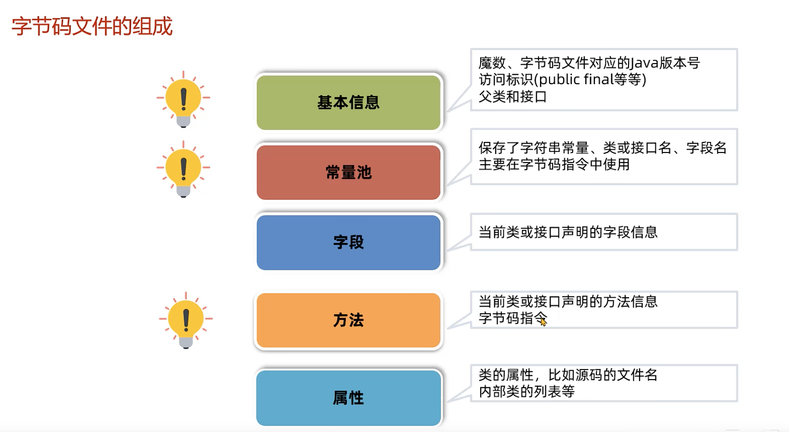

 


# 1、基础篇

## 初始JVM

### 什么是JVM

JVM本质上是一个运行在计算机上的程序，他的职责是运行Java字节码文件。


### JVM的功能

**1、解释和运行**

- 对字节码文件中的指令，实时的解释称机器码，让计算机执行

**2、内存管理**

- 自动为对象、方法等分配内存
- 自动的垃圾回收机制，回收不在使用的对象

**3、即时编译**

对热点代码进行优化，提升执行效率


### 即时编译

Java语言如果不做任何优化，性能不如C++等语言。

> **因为是实时解释为机器码**


而其他的C++语言是打包编译称可执行文件（机器码）

> **直接运行机器码**


**Java需要实时解释的原因？**

> 主要是问了跨平台特性


JVM提供了**即时编译**（Just-In-Time 简称JIT）进行性能优化，最终能够达到接近C++语言的运行性能，甚至在特定的场景下实现了超越。


### 常见的JVM


常见的JVM-HotSpot的发展历程


## 字节码文件详解

### 1.Java虚拟机的组成

主要包括：

- 类加载器
- 运行时数据区域（JVM管理的内存）
- 执行引擎（即时编译器、解释器、垃圾回收器等）


### 2.字节码文件的组成

主要包括：

- 基本信息
- 常量池
- 接口
- 方法
- 属性



**查看字节码常用的工具**

- Javap命令

- Jclasslib软件或者插件

  > 
  >
  > github地址：https://github.com/ingokegel/jclasslib

- Arthus

  > 官网地址：https://arthas.aliyun.com/doc/


#### 1）基本信息

**Magic魔数**

- 文件是无法通过文件扩展名来确定文件类型的，文件扩展名可以随意修改，不影响文件的内容
- 软件使用文件的头几个字节（文件头）去检验文件的类型，如果软件不支持该种类型就会出错。
- Java字节码文件中，该文件头称为Magic魔数


常见的文件头


**主副版本号**

- 主副版本号指的是编译字节码文件的JDK版本号，主版本号是用来识别大版本号，JDK1.0-1.1使用了45.0-45.3，JDK1.2是46之后每升级一个大版本号就加1，副版本号是当主版本号相同时作为区分不同版本的标识，一般只需要关心主版本号。
- 版本号的作用主要是判断当前字节码的版本和运行时的JDK是否兼容

> Tips:
>
> 1.2之后大版本号计算的方式就是主版本号-44 
>
> 例如：主版本号52就是JDK8


| 名称               | 作用                                                         |
| ------------------ | ------------------------------------------------------------ |
| Magic魔数          | 固定为0XCAFEBABE 不会改变                                    |
| 主副版本号         | 编译字节码的JDK版本                                          |
| 访问标识           | 标识是类还是接口、枚举、注解、模块 标识public、final、abstract |
| 类、父类、接口索引 | 通过这些索引可以找到类、父类、接口的信息                     |


#### 2）常量池

字节码文件中常量池的作用：

- 避免相同的内容重复定义、节省空间。

```
    public static String A = "中国";
    public static String B = "中国";
```

> 其他的相同的字段就会去引用到 真正的string字面量


> 如果是常量 那么会指向常量池里面的index 最终找到字面量
>
> 如果是普通的 是存在常量池里面 那么会直接找到对应的字面量值

- 常量池中的数据都有一个编号，编号从1开始。在字段或者字节码指令中通过编号可以快速的找到对应的数据。

- 字节码指令中通过编号引用到常量池的过程称之为符号引用

  > 


#### 3）方法

- 字节码中的方法区域是存放**字节码指令**的核心位置，字节码指令的内容放在方法的code属性中

  > 


**通过字节码指令分析下面三种“加1”的操作性能的高低？**

> 字节码行数越少 效率越高

```java
int i=0,j=0,k=0;
i++;
j=j+1;
k += 1;
```

> i和k一样行数
>
> j的行数最多


**字节码工具**

- javap -v

  > javap是JDK自带的反编译工具，可以通过控制台查看字节码文件的内容。适合在服务器上查看字节码文件内容
  >
  > 直接输入javap 查看所有参数
  >
  > 输入javap -v 字节码文件名称 查看具体的字节码信息（如果是jar包 需要用jar -xvf命令解压）
  >
  > > linux > 符号追加到指定的位置文件内

- Arthas

  > 官网地址：https://arthas.aliyun.com/doc/
  >
  > 
  >
  > - jad类的全限定名：反编译已经加载类的源码
  >
  > - dump类的全限定名：dump已加载类的字节码文件到特定目录
  >
  >   > 全限名：**包名加类名**


### 3.类的生命周期

应用场景：

- 运行时常量池
- 多态的原理
- 类加载器的作用
- 类的加密和解密


#### 0）生命周期概述

**分为下面五个阶段：**

- 1-加载

- 2-连接

  > 重点知识：
  >
  > - 校验
  > - 准备
  > - 解析

- 3-初始化

- 4-使用

  > 距离：new一个对象
  >
  > ```
  > Class class = new Class();
  > Class<Class> clazz = Class.class;
  > Class class1 = clazz.newInstance();
  > ```
  >
  > 

- 5-卸载

  > 类的卸载主要体现在垃圾回收♻️机制


#### 1）加载阶段

- Loading阶段第一步是**类加载器**根据类的全限定名通过不同的渠道以二进制流的方式获取到字节码信息。

  - 本地文件- 磁盘上的字节码文件
  - 动态代理生成-程序运行时使用动态代理生成
  - 通过网络传输的类-早期的Applet技术使用

- 类加载器在加载完类之后，Java虚拟机会将字节码中的信息保存到方法区中

  > 方法区：虚拟的空间
  >
  > Java8以后叫元空间

- 类加载器在加载完类之后，Java虚拟机会将字节码中的信息保存到内存的方法区中。

  > 生成一个InstanceKlass对象，保存类的所有信息，里面还包含实现特定功能比如多态的信息。
  >
  > 

- 同时，Java虚拟机还在堆中生成一份与方法区中数据类似的java.lang.Class 对象

  > 作用：是在Java代码中去获取类的信息以及存储静态字段的字段（JDK8及之后）
  >
  > 
  >
  > 
  >
  > 

  

  

**为什么有两个区？**

> 对于开发者来说，**只需要访问堆中的Class对象**而不需要访问方法区中所有信息
>
> **这样虚拟机就能很好地控制开发者访问数据的范围**
>
> 


**查看内存中的对象**

- 推荐使用JDK自带的hsdb工具查看Java虚拟机内存信息。工具位于JDK安装目录下lib文件夹中的sa-jdi.jar

- 启动命令

  > ```shell
  > java -cp sa-jdi.jar sun.jvm.hotspot.HSDB
  > ```
  >
  > 然后使用对应的java进程端口号连接
  >
  > 
  >
  > 

  

  **Tips💡**

> jps 命令：查看所有的java对象进程
>
> 


#### 2）连接阶段

连接阶段主要包含***三个过程***：

- ***验证-验证内容是否满足《Java虚拟机规范》***

  > Linking阶段不需要程序员参与
  >
  > 主要验证四部分：
  >
  > - 文件格式验证，比如文件是否以0xCAFEBABE开头，主副版本号是否满足当前Java虚拟机版本要求
  > - 元信息验证，例如类必须有父类（super不能为空）
  > - 验证程序执行指令的语义，比如方法内的指令执行到一半强行跳转到其他方法中去
  > - 符号引用验证，例如是否访问了其他类中private的方法等

- ***给静态变量赋初值***

  > 只要讨论JDK8及以后的版本
  >
  > - 虽然赋值为1 但是初始值赋值为0
  >
  > 
  >
  > - **准备阶段只会给静态变量赋初始值，而每一种基本数据类型和引用数据类型都有其初始值**
  >
  > 
  >
  > - **final修饰的基本数据类型的静态变量，准备阶段直接会将代码中的值进行赋值。（因为值不能修改，已经确定了）**
  >
  > 

  

- ***将常量池中的符号引用替换成指向内存的直接引用***

  > - **直接引用不在使用编号，而是使用内存中地址进行访问具体的数据**
  >
  > 

> ***符号引用***是字节码文件中使用**编号**去常量池中找对应的内容，***直接引用***是去找内存地址的引用
>
> 
>
> 类的信息已经加载在内存中


#### 3）初始化阶段

- 初始化阶段会执行**静态代码块中的代码**，并**为静态变量赋值**。执行流程与代码执行流程一致。

- 初始化阶段会执行字节码文件中**cliinit**部分的字节码指令。

  > **clinit**方法中和java执行的顺序一致
  >
  > 


**以下几种方式会导致类的初始化：**

1. 访问一个类的静态变量或者静态方法，注意变量时**final修饰的并且等号右边时常量不会触发初始化**（已经在连接阶段的准备阶段已经初始化了）
2. 调用Class.forName(String className)
3. new 一个该类的对象时
4. 执行Main方法的当前类

**Tips💡**

> VM参数：
>
> ```
> -XX:+TraceClassLoading 参数可以打印出加载并初始化的类
> ```

**案例：**

> 

> 执行main方法的时候 会先初始化clinit 执行当前main方法所在的对象静态代码块（**有且只会执行一次静态代码块**）所以打印D 然后执行main方法自己的A 
>
> **一个类*加载初始化*只会执行一次**
>
> 然后new一个对象的时候（可以创建多个对象 会初始化多次构造方法） **执行顺序：静态代码块-> 代码块-> 构造方法** ，因为main初始化（已经加载了本身）的时候已经执行了静态代码块 ，然后会先初始化该对象的构造方法（如果有局部代码块 那么init的时候会把该代码块放到构造方法里面一起执行）。
>
> ```java
> class Test001{
>     public static void main(String[] args) {
>         System.out.println("A");
>         new Test001();
>         new Test001();
>     }
> 
>     public Test001() {
>         System.out.println("B");
>     }
>     {
>         System.out.println("C");
>     }
>     static {
>         System.out.println("D");
>     }
> }
> ```
>
> **执行结果为：DACBCB**


clinit指令在特定情况下不会出现指令操作

比如：以下几种情况是***不会**进行初始化指令操作的*。

1. 无静态代码块且无静态变量赋值语句的
2. 有静态变量的声明，但是没有赋值语句的
3. 静态变量的定义使用final关键字的，这类变量会在（**连接阶段的准备阶段**）直接进行初始化
4. **直接访问父类的静态变量，不会出发子类的初始化**
5. 子类的初始化clinit调用之前，会先调用父类的clinit初始化方法

**案例1：**

> 
>
> **答案：先执行父类 把值赋值为1 然后执行子类。把值赋值为2 然后打印数据为2**

**案例2:**

> **数组的创建不会导致数组中元素的类进行初始化**
>
> ```java
> class Test001 {
>     public static void main(String[] args) {
>         Test002[] test001s = new Test002[10];
>     }
> }
> 
> class Test002 {
>     static {
>         System.out.println("D");
>     }
> }
> ```
>
> **答案：不会打印静态代码块**

**案例3:**

> **final修饰的变量如果赋值的内容需要执行指令才能得到结果，会执行clinit方法进行初始化**
>
> 
>
> ```java
> class Test001 {
>     public static void main(String[] args) {
>         System.out.println(Test002.a);
>     }
> }
> 
> class Test002 {
>     public static final int a = Integer.valueOf(1);
> 
>     static {
>         System.out.println("静态代码块运行");
>     }
> }
> ```
>
> **答案：是1 然后是打印文字**


### 4.类加载器


##  JVM的内存区域


## JVM的垃圾回收


# 2、实战篇


# 3、高级篇


# 4、原理篇


# 5、面试题
