 


# JVM基础篇

## 1.åˆå§‹JVM

### 什么是JVM

JVM本质上是一个è¿è¡Œåœ¨è®¡ç®—机上的程åºï¼Œä»–çš„èŒè´£æ˜¯è¿è¡ŒJava字节ç æ–‡ä»¶ã€‚


### JVM的功能

**1ã€è§£é‡Šå’Œè¿è¡Œ**

- 对字节ç æ–‡ä»¶ä¸­çš„指令，å®æ—¶çš„解释称机器ç ï¼Œè®©è®¡ç®—机执行

**2ã€å†…存管ç†**

- 自动为对象ã€æ–¹æ³•ç­‰åˆ†é…内存
- 自动的åƒåœ¾å›æ”¶æœºåˆ¶ï¼Œå›æ”¶ä¸åœ¨ä½¿ç”¨çš„对象

**3ã€å³æ—¶ç¼–译**

对热点代ç è¿›è¡Œä¼˜åŒ–，æå‡æ‰§è¡Œæ•ˆç‡


### å³æ—¶ç¼–译

Java语言如æœä¸åšä»»ä½•ä¼˜åŒ–，性能ä¸å¦‚C++等语言。

> **因为是å®æ—¶è§£é‡Šä¸ºæœºå™¨ç **


而其他的C++语言是打包编译称å¯æ‰§è¡Œæ–‡ä»¶ï¼ˆæœºå™¨ç ï¼‰

> **ç›´æ¥è¿è¡Œæœºå™¨ç **


**Java需è¦å®æ—¶è§£é‡Šçš„åŸå› ï¼Ÿ**

> 主è¦æ˜¯é—®äº†è·¨å¹³å°ç‰¹æ€§


JVMæ供了**å³æ—¶ç¼–译**（Just-In-Time 简称JIT）进行性能优化，最终能够达到æ¥è¿‘C++语言的è¿è¡Œæ€§èƒ½ï¼Œç”šè‡³åœ¨ç‰¹å®šçš„场景下å®ç°äº†è¶…越。


### 常è§çš„JVM


常è§çš„JVM-HotSpotçš„å‘展å†ç¨‹


## 2.字节ç æ–‡ä»¶è¯¦è§£

### 1.Java虚拟机的组æˆ

主è¦åŒ…括：

- 类加载器
- è¿è¡Œæ—¶æ•°æ®åŒºåŸŸï¼ˆJVM管ç†çš„内存）
- 执行引æ“（å³æ—¶ç¼–译器ã€è§£é‡Šå™¨ã€åƒåœ¾å›æ”¶å™¨ç­‰ï¼‰


### 2.字节ç æ–‡ä»¶çš„组æˆ

主è¦åŒ…括：

- 基本信æ¯
- 常é‡æ± 
- æ¥å£
- 方法
- å±æ€§


**查看字节ç å¸¸ç”¨çš„工具**

- Javap命令

- Jclasslib软件或者æ’件

  > 
  >
  > github地å€ï¼šhttps://github.com/ingokegel/jclasslib

- Arthus

  > 官网地å€ï¼šhttps://arthas.aliyun.com/doc/


#### 1）基本信æ¯

**Magic魔数**

- 文件是无法通过文件扩展åæ¥ç¡®å®šæ–‡ä»¶ç±»å‹çš„，文件扩展åå¯ä»¥éšæ„修改，ä¸å½±å“文件的内容
- 软件使用文件的头几个字节（文件头）å»æ£€éªŒæ–‡ä»¶çš„ç±»å‹ï¼Œå¦‚æœè½¯ä»¶ä¸æ”¯æŒè¯¥ç§ç±»å‹å°±ä¼šå‡ºé”™ã€‚
- Java字节ç æ–‡ä»¶ä¸­ï¼Œè¯¥æ–‡ä»¶å¤´ç§°ä¸ºMagic魔数

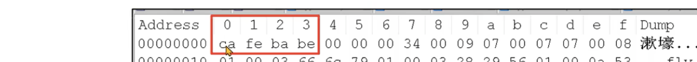

常è§çš„文件头


**主副版本å·**

- 主副版本å·æŒ‡çš„是编译字节ç æ–‡ä»¶çš„JDK版本å·ï¼Œä¸»ç‰ˆæœ¬å·æ˜¯ç”¨æ¥è¯†åˆ«å¤§ç‰ˆæœ¬å·ï¼ŒJDK1.0-1.1使用了45.0-45.3，JDK1.2是46之åæ¯å‡çº§ä¸€ä¸ªå¤§ç‰ˆæœ¬å·å°±åŠ 1，副版本å·æ˜¯å½“主版本å·ç›¸åŒæ—¶ä½œä¸ºåŒºåˆ†ä¸åŒç‰ˆæœ¬çš„标识，一般åªéœ€è¦å…³å¿ƒä¸»ç‰ˆæœ¬å·ã€‚
- 版本å·çš„作用主è¦æ˜¯åˆ¤æ–­å½“å‰å­—节ç çš„版本和è¿è¡Œæ—¶çš„JDK是å¦å…¼å®¹

> Tips:
>
> 1.2之å大版本å·è®¡ç®—çš„æ–¹å¼å°±æ˜¯ä¸»ç‰ˆæœ¬å·-44 
>
> 例如：主版本å·52就是JDK8


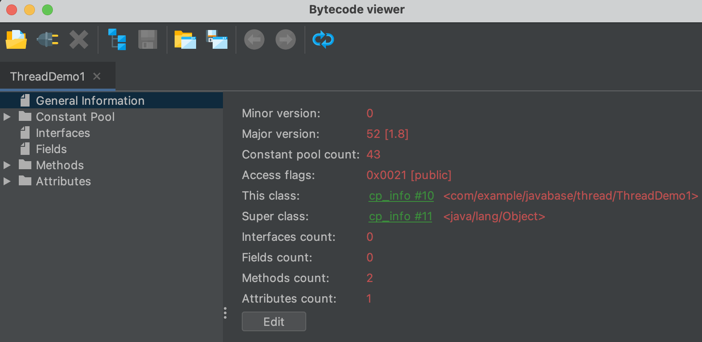

| å称               | 作用                                                         |
| ------------------ | ------------------------------------------------------------ |
| Magic魔数          | 固定为0XCAFEBABE ä¸ä¼šæ”¹å˜                                    |
| ä¸»å‰¯ç‰ˆæœ¬å·         | 编译字节ç çš„JDK版本                                          |
| 访问标识           | 标识是类还是æ¥å£ã€æšä¸¾ã€æ³¨è§£ã€æ¨¡å— 标识publicã€finalã€abstract |
| ç±»ã€çˆ¶ç±»ã€æ¥å£ç´¢å¼• | 通过这些索引å¯ä»¥æ‰¾åˆ°ç±»ã€çˆ¶ç±»ã€æ¥å£çš„ä¿¡æ¯                     |


#### 2）常é‡æ± 

字节ç æ–‡ä»¶ä¸­å¸¸é‡æ± çš„作用：

- é¿å…相åŒçš„内容é‡å¤å®šä¹‰ã€èŠ‚çœç©ºé—´ã€‚

```
    public static String A = "中国";
    public static String B = "中国";
```

> 其他的相åŒçš„字段就会å»å¼•ç”¨åˆ° 真正的stringå­—é¢é‡


> 如æœæ˜¯å¸¸é‡ 那么会指å‘常é‡æ± é‡Œé¢çš„index 最终找到字é¢é‡
>
> 如æœæ˜¯æ™®é€šçš„ 是存在常é‡æ± é‡Œé¢ 那么会直æ¥æ‰¾åˆ°å¯¹åº”çš„å­—é¢é‡å€¼

- 常é‡æ± ä¸­çš„æ•°æ®éƒ½æœ‰ä¸€ä¸ªç¼–å·ï¼Œç¼–å·ä»1开始。在字段或者字节ç æŒ‡ä»¤ä¸­é€šè¿‡ç¼–å·å¯ä»¥å¿«é€Ÿçš„找到对应的数æ®ã€‚

- 字节ç æŒ‡ä»¤ä¸­é€šè¿‡ç¼–å·å¼•ç”¨åˆ°å¸¸é‡æ± çš„过程称之为符å·å¼•ç”¨

  > 


#### 3）方法

- 字节ç ä¸­çš„方法区域是存放**字节ç æŒ‡ä»¤**的核心ä½ç½®ï¼Œå­—节ç æŒ‡ä»¤çš„内容放在方法的codeå±æ€§ä¸­

  > 


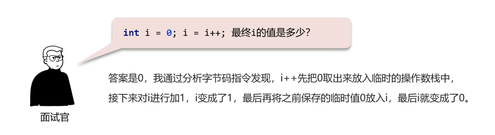


**通过字节ç æŒ‡ä»¤åˆ†æ下é¢ä¸‰ç§â€œåŠ 1â€çš„æ“作性能的高ä½ï¼Ÿ**

> 字节ç è¡Œæ•°è¶Šå°‘ 效ç‡è¶Šé«˜

```java
int i=0,j=0,k=0;
i++;
j=j+1;
k += 1;
```

> i和k一样行数
>
> j的行数最多


**字节ç å·¥å…·**

- javap -v

  > javap是JDK自带的å编译工具，å¯ä»¥é€šè¿‡æ§åˆ¶å°æŸ¥çœ‹å­—节ç æ–‡ä»¶çš„内容。适åˆåœ¨æœåŠ¡å™¨ä¸ŠæŸ¥çœ‹å­—节ç æ–‡ä»¶å†…容
  >
  > ç›´æ¥è¾“å…¥javap 查看所有å‚æ•°
  >
  > 输入javap -v 字节ç æ–‡ä»¶å称 查看具体的字节ç ä¿¡æ¯ï¼ˆå¦‚æœæ˜¯jar包 需è¦ç”¨jar -xvf命令解å‹ï¼‰
  >
  > > linux > 符å·è¿½åŠ åˆ°æŒ‡å®šçš„ä½ç½®æ–‡ä»¶å†…

- Arthas

  > 官网地å€ï¼šhttps://arthas.aliyun.com/doc/
  >
  > 
  >
  > - jad类的全é™å®šå：å编译已ç»åŠ è½½ç±»çš„æºç 
  >
  > - dump类的全é™å®šå：dump已加载类的字节ç æ–‡ä»¶åˆ°ç‰¹å®šç›®å½•
  >
  >   > å…¨é™å：**包å加类å**


### 3.类的生命周期

应用场景：

- è¿è¡Œæ—¶å¸¸é‡æ± 
- 多æ€çš„åŸç†
- 类加载器的作用
- 类的加密和解密


#### 0）生命周期概述

**分为下é¢äº”个阶段：**

- 1-加载

- 2-è¿æ¥

  > é‡ç‚¹çŸ¥è¯†ï¼š
  >
  > - 校验
  > - 准备
  > - 解æ

- 3-åˆå§‹åŒ–

- 4-使用

  > è·ç¦»ï¼šnew一个对象
  >
  > ```
  > Class class = new Class();
  > Class<Class> clazz = Class.class;
  > Class class1 = clazz.newInstance();
  > ```
  >
  > 

- 5-å¸è½½

  > 类的å¸è½½ä¸»è¦ä½“ç°åœ¨åƒåœ¾å›æ”¶â™»ï¸æœºåˆ¶


#### 1）加载阶段

- Loading阶段第一步是**类加载器**æ ¹æ®ç±»çš„å…¨é™å®šå通过ä¸åŒçš„渠é“以二进制æµçš„æ–¹å¼è·å–到字节ç ä¿¡æ¯ã€‚

  - 本地文件- ç£ç›˜ä¸Šçš„字节ç æ–‡ä»¶
  - 动æ€ä»£ç†ç”Ÿæˆ-程åºè¿è¡Œæ—¶ä½¿ç”¨åŠ¨æ€ä»£ç†ç”Ÿæˆ
  - 通过网络传输的类-早期的Applet技术使用

- 类加载器在加载完类之å，Java虚拟机会将字节ç ä¸­çš„ä¿¡æ¯ä¿å­˜åˆ°æ–¹æ³•åŒºä¸­

  > 方法区：虚拟的空间
  >
  > Java8以åå«å…ƒç©ºé—´

- 类加载器在加载完类之å，Java虚拟机会将字节ç ä¸­çš„ä¿¡æ¯ä¿å­˜åˆ°å†…存的方法区中。

  > 生æˆä¸€ä¸ªInstanceKlass对象，ä¿å­˜ç±»çš„所有信æ¯ï¼Œé‡Œé¢è¿˜åŒ…å«å®ç°ç‰¹å®šåŠŸèƒ½æ¯”如多æ€çš„ä¿¡æ¯ã€‚
  >
  > 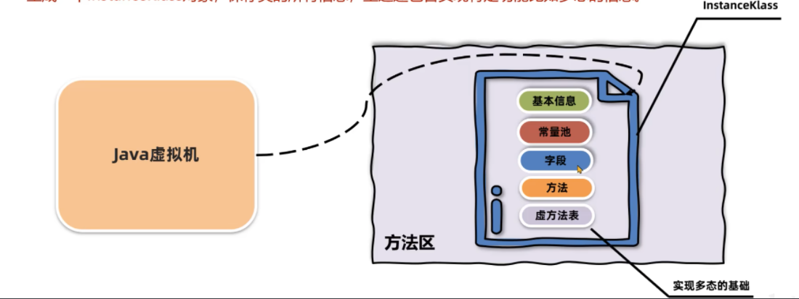

- åŒæ—¶ï¼ŒJava虚拟机还在堆中生æˆä¸€ä»½ä¸æ–¹æ³•åŒºä¸­æ•°æ®ç±»ä¼¼çš„java.lang.Class 对象

  > 作用：是在Java代ç ä¸­å»è·å–类的信æ¯ä»¥åŠå­˜å‚¨é™æ€å­—段的字段（JDK8åŠä¹‹å）
  >
  > 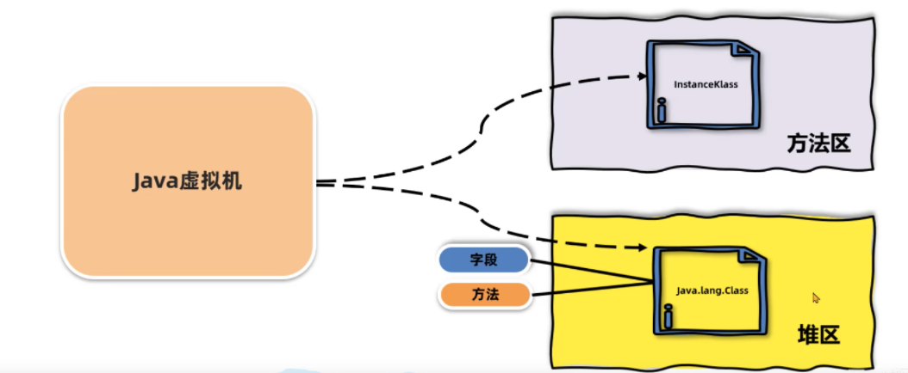
  >
  > 
  >
  > 

  

  

**为什么有两个区？**

> 对äºå¼€å‘者æ¥è¯´ï¼Œ**åªéœ€è¦è®¿é—®å †ä¸­çš„Class对象**而ä¸éœ€è¦è®¿é—®æ–¹æ³•åŒºä¸­æ‰€æœ‰ä¿¡æ¯
>
> **这样虚拟机就能很好地æ§åˆ¶å¼€å‘者访问数æ®çš„范围**
>
> 


**查看内存中的对象**

- æ¨è使用JDK自带的hsdb工具查看Java虚拟机内存信æ¯ã€‚工具ä½äºJDK安装目录下lib文件夹中的sa-jdi.jar

- å¯åŠ¨å‘½ä»¤

  > ```shell
  > java -cp sa-jdi.jar sun.jvm.hotspot.HSDB
  > ```
  >
  > 然å使用对应的java进程端å£å·è¿æ¥
  >
  > 
  >
  > 

  

  **Tips💡**

> jps 命令：查看所有的java对象进程
>
> 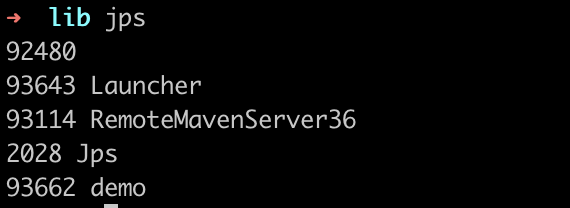


#### 2）è¿æ¥é˜¶æ®µ

è¿æ¥é˜¶æ®µä¸»è¦åŒ…å«***三个过程***：

- ***验è¯-验è¯å†…容是å¦æ»¡è¶³ã€ŠJava虚拟机规范》***

  > Linking阶段ä¸éœ€è¦ç¨‹åºå‘˜å‚ä¸
  >
  > 主è¦éªŒè¯å››éƒ¨åˆ†ï¼š
  >
  > - 文件格å¼éªŒè¯ï¼Œæ¯”如文件是å¦ä»¥0xCAFEBABE开头，主副版本å·æ˜¯å¦æ»¡è¶³å½“å‰Java虚拟机版本è¦æ±‚
  > - 元信æ¯éªŒè¯ï¼Œä¾‹å¦‚类必须有父类（superä¸èƒ½ä¸ºç©ºï¼‰
  > - 验è¯ç¨‹åºæ‰§è¡ŒæŒ‡ä»¤çš„语义，比如方法内的指令执行到一åŠå¼ºè¡Œè·³è½¬åˆ°å…¶ä»–方法中å»
  > - 符å·å¼•ç”¨éªŒè¯ï¼Œä¾‹å¦‚是å¦è®¿é—®äº†å…¶ä»–类中private的方法等

- ***ç»™é™æ€å˜é‡èµ‹åˆå€¼***

  > åªè¦è®¨è®ºJDK8åŠä»¥å的版本
  >
  > - 虽然赋值为1 但是åˆå§‹å€¼èµ‹å€¼ä¸º0
  >
  > 
  >
  > - **准备阶段åªä¼šç»™é™æ€å˜é‡èµ‹åˆå§‹å€¼ï¼Œè€Œæ¯ä¸€ç§åŸºæœ¬æ•°æ®ç±»å‹å’Œå¼•ç”¨æ•°æ®ç±»å‹éƒ½æœ‰å…¶åˆå§‹å€¼**
  >
  > 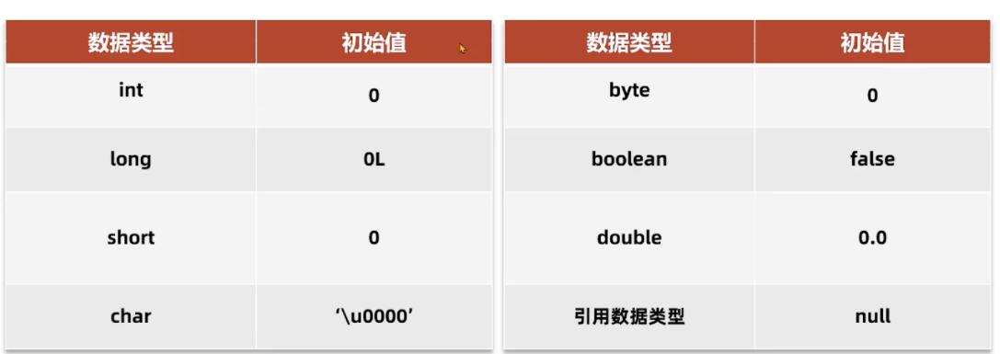
  >
  > - **final修饰的基本数æ®ç±»å‹çš„é™æ€å˜é‡ï¼Œå‡†å¤‡é˜¶æ®µç›´æ¥ä¼šå°†ä»£ç ä¸­çš„值进行赋值。（因为值ä¸èƒ½ä¿®æ”¹ï¼Œå·²ç»ç¡®å®šäº†ï¼‰**
  >
  > 

  

- ***将常é‡æ± ä¸­çš„符å·å¼•ç”¨æ›¿æ¢æˆæŒ‡å‘内存的直æ¥å¼•ç”¨***

  > - **ç›´æ¥å¼•ç”¨ä¸åœ¨ä½¿ç”¨ç¼–å·ï¼Œè€Œæ˜¯ä½¿ç”¨å†…存中地å€è¿›è¡Œè®¿é—®å…·ä½“çš„æ•°æ®**
  >
  > 

> ***符å·å¼•ç”¨***是字节ç æ–‡ä»¶ä¸­ä½¿ç”¨**ç¼–å·**å»å¸¸é‡æ± ä¸­æ‰¾å¯¹åº”的内容，***ç›´æ¥å¼•ç”¨***是å»æ‰¾å†…存地å€çš„引用
>
> 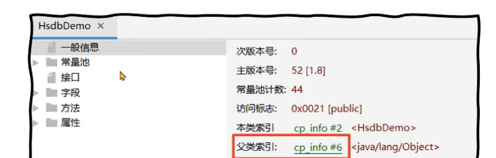
>
> 类的信æ¯å·²ç»åŠ è½½åœ¨å†…存中


#### 3）åˆå§‹åŒ–阶段

- åˆå§‹åŒ–阶段会执行**é™æ€ä»£ç å—中的代ç **，并**为é™æ€å˜é‡èµ‹å€¼**。执行æµç¨‹ä¸ä»£ç æ‰§è¡Œæµç¨‹ä¸€è‡´ã€‚

- åˆå§‹åŒ–阶段会执行字节ç æ–‡ä»¶ä¸­**cliinit**部分的字节ç æŒ‡ä»¤ã€‚

  > **clinit**方法中和java执行的顺åºä¸€è‡´
  >
  > 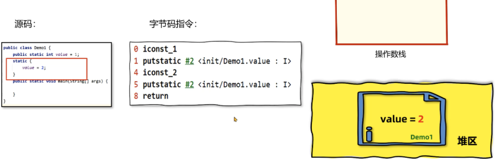


**以下几ç§æ–¹å¼ä¼šå¯¼è‡´ç±»çš„åˆå§‹åŒ–：**

1. 访问一个类的é™æ€å˜é‡æˆ–者é™æ€æ–¹æ³•ï¼Œæ³¨æ„å˜é‡æ—¶**final修饰的并且等å·å³è¾¹æ—¶å¸¸é‡ä¸ä¼šè§¦å‘åˆå§‹åŒ–**（已ç»åœ¨è¿æ¥é˜¶æ®µçš„准备阶段已ç»åˆå§‹åŒ–了）
2. 调用Class.forName(String className)
3. new 一个该类的对象时
4. 执行Main方法的当å‰ç±»

**Tips💡**

> VMå‚数：
>
> ```
> -XX:+TraceClassLoading å‚æ•°å¯ä»¥æ‰“å°å‡ºåŠ è½½å¹¶åˆå§‹åŒ–çš„ç±»
> ```

**案例：**

> 

> 执行main方法的时候 会先åˆå§‹åŒ–clinit 执行当å‰main方法所在的对象é™æ€ä»£ç å—（**有且åªä¼šæ‰§è¡Œä¸€æ¬¡é™æ€ä»£ç å—**）所以打å°D 然å执行main方法自己的A 
>
> **一个类*加载åˆå§‹åŒ–*åªä¼šæ‰§è¡Œä¸€æ¬¡**
>
> 然ånew一个对象的时候（å¯ä»¥åˆ›å»ºå¤šä¸ªå¯¹è±¡ 会åˆå§‹åŒ–多次æ„造方法） **执行顺åºï¼šé™æ€ä»£ç å—-> 代ç å—-> æ„造方法** ，因为mainåˆå§‹åŒ–（已ç»åŠ è½½äº†æœ¬èº«ï¼‰çš„时候已ç»æ‰§è¡Œäº†é™æ€ä»£ç å— ，然å会先åˆå§‹åŒ–该对象的æ„造方法（如æœæœ‰å±€éƒ¨ä»£ç å— 那么init的时候会把该代ç å—放到æ„造方法里é¢ä¸€èµ·æ‰§è¡Œï¼‰ã€‚
>
> ```java
> class Test001{
>     public static void main(String[] args) {
>         System.out.println("A");
>         new Test001();
>         new Test001();
>     }
> 
>     public Test001() {
>         System.out.println("B");
>     }
>     {
>         System.out.println("C");
>     }
>     static {
>         System.out.println("D");
>     }
> }
> ```
>
> **执行结æœä¸ºï¼šDACBCB**


clinit指令在特定情况下ä¸ä¼šå‡ºç°æŒ‡ä»¤æ“作

比如：以下几ç§æƒ…况是***ä¸ä¼š**进行åˆå§‹åŒ–指令æ“作的*。

1. æ— é™æ€ä»£ç å—且无é™æ€å˜é‡èµ‹å€¼è¯­å¥çš„
2. 有é™æ€å˜é‡çš„声æ˜ï¼Œä½†æ˜¯æ²¡æœ‰èµ‹å€¼è¯­å¥çš„
3. é™æ€å˜é‡çš„定义使用final关键字的，这类å˜é‡ä¼šåœ¨ï¼ˆ**è¿æ¥é˜¶æ®µçš„准备阶段**）直æ¥è¿›è¡Œåˆå§‹åŒ–
4. **ç›´æ¥è®¿é—®çˆ¶ç±»çš„é™æ€å˜é‡ï¼Œä¸ä¼šå‡ºå‘å­ç±»çš„åˆå§‹åŒ–**
5. å­ç±»çš„åˆå§‹åŒ–clinit调用之å‰ï¼Œä¼šå…ˆè°ƒç”¨çˆ¶ç±»çš„clinitåˆå§‹åŒ–方法

**案例1：**

> 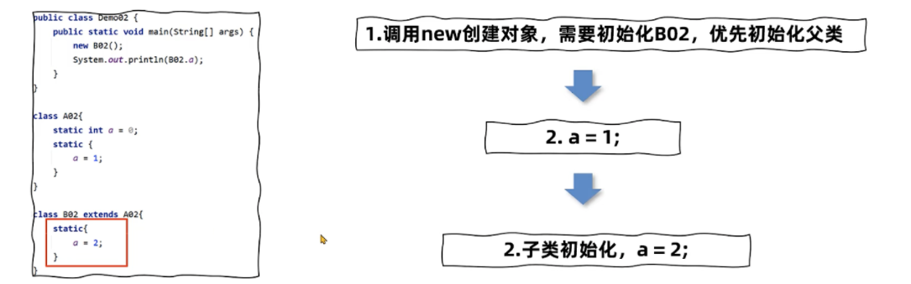
>
> **答案：先执行父类 把值赋值为1 然å执行å­ç±»ã€‚把值赋值为2 然å打å°æ•°æ®ä¸º2**

**案例2:**

> **数组的创建ä¸ä¼šå¯¼è‡´æ•°ç»„中元素的类进行åˆå§‹åŒ–**
>
> ```java
> class Test001 {
>     public static void main(String[] args) {
>         Test002[] test001s = new Test002[10];
>     }
> }
> 
> class Test002 {
>     static {
>         System.out.println("D");
>     }
> }
> ```
>
> **答案：ä¸ä¼šæ‰“å°é™æ€ä»£ç å—**

**案例3:**

> **final修饰的å˜é‡å¦‚æœèµ‹å€¼çš„内容需è¦æ‰§è¡ŒæŒ‡ä»¤æ‰èƒ½å¾—到结æœï¼Œä¼šæ‰§è¡Œclinit方法进行åˆå§‹åŒ–**
>
> 
>
> ```java
> class Test001 {
>     public static void main(String[] args) {
>         System.out.println(Test002.a);
>     }
> }
> 
> class Test002 {
>     public static final int a = Integer.valueOf(1);
> 
>     static {
>         System.out.println("é™æ€ä»£ç å—è¿è¡Œ");
>     }
> }
> ```
>
> **答案：是1 然å是打å°æ–‡å­—**


### 4.类加载器

什么是类加载器？

> 类加载器（classLoader）是Java虚拟机æ供给应用程åºåŒºå®ç°è·å–类和æ¥å£å­—节ç æ•°æ®çš„技术


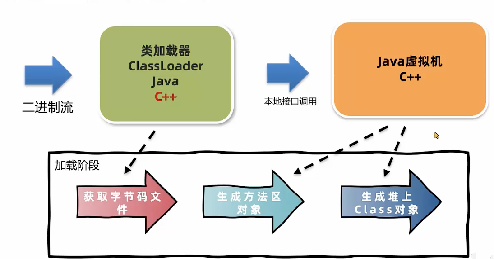


**类加载器的应用场景：**

- ä¼ä¸šçº§åº”用
  1. SPI机制
  2. 类的热部署
  3. Tomcat类的隔离
- 大é‡çš„é¢è¯•é¢˜
  1. 什么是类的åŒäº²å§”派机制
  2. 打破类的åŒäº²å§”派机制
  3. 自定义类加载器
- 解决线上问题
  1. 使用Arthasä¸åœæœºè§£å†³çº¿ä¸Šæ•…éšœ


#### 1）类加载器的分类

类加载器分为两类，一类是Java代ç ä¸­å®ç°çš„，一类是Java虚拟机底层æºç å®ç°çš„

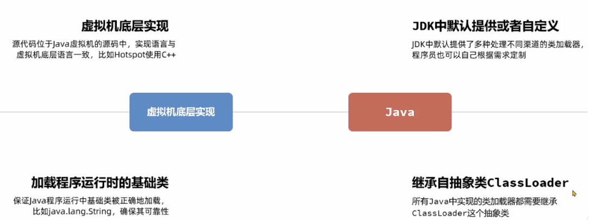

- 类加载器的设计JDK8å’Œ8之å的版本差别较大，JDK8åŠä¹‹å的版本中默认的累积载器有如下几ç§

**虚拟机时å®ç°çš„：**

>**Bootstrap（å¯åŠ¨ç±»åŠ è½½å™¨ï¼‰**
>
>虚拟机底层å®ç°çš„C++，加载Java类中最核心的类

**Javaå®ç°çš„：**

> **Extension（扩展类加载器）**
>
> å…许扩展Java中比较通用的类
>
> **Application（应用程åºç±»åŠ è½½å™¨ï¼‰**
>
> 加载应用使用的类


类加载器的详细信æ¯å¯ä»¥é€šè¿‡classloader命令查

> ```shell
> [arthas@60081]$ classloader
> ```
>
> å¯ä»¥çœ‹åˆ°å±‚级关系为最上层的父类为**BootstrapClassLoader**，其次**sun.misc.LauncherExtClassLoader**，在其次为**sun.misc.LauncherAppClassLoader**
>
> 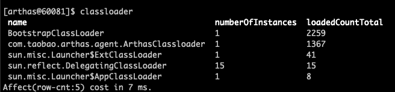


##### **Bootstrap ClassLoader**

- Bootstrap ClassLoader 是由HotSpot虚拟机æä¾›ã€ä½¿ç”¨C++编写的类加载器

- 默认加载Java安装目录下/jre/lib下的类文件

  > 


**如æœæƒ³ç”¨BootStrap ClassLoader 加载用户自己的jar包，有哪些方å¼ï¼Ÿ**

- （ä¸æ¨è）把自己的jar包放入lib目录下，å¯èƒ½ä¼šå‡ºç°æ–‡ä»¶åä¸åŒ¹é…的问题也ä¸ä¼šæ­£å¸¸çš„被加载

- **（æ¨è）**使用VMå‚数进行扩展

  > 使用命令：
  >
  > ```
  > -Xbootclasspath/a:jar包目录/jar包å
  > ```
  >
  > å¯ä»¥è‡ªå·±æ‰‹åŠ¨å†™ä¸€ä¸ªç±» 然å使用vmå‚数把这个类加载进å»ï¼Œè¿™ä¸ªç±»å¯ä»¥å†™äº†static方法 打å°æ—¥å¿—  然å调用的这个 å»æŒ‡å®šå¼•ç”¨è¿™ä¸ªç±» forname 然åçœ‹ç»“æœ ä½†æ˜¯è¿™ä¸ªç±»åŠ è½½å™¨è¿˜æ˜¯null 是å±äºbootstrap加载器


**Java中默认的类加载器**

- **Extension ClassLoader**å’Œ**Application ClassLoader**都是JDK中æ供的，使用Java编写的类加载器
- 它们的æºç éƒ½ä½äºsun.misc,Launcher中，是一个é™æ€å†…部类。继承自URLCLlassLoader。局部通过目录或者指定jar包将字节ç æ–‡ä»¶åŠ è½½åˆ°å†…存中。

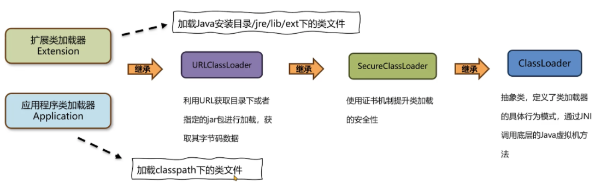


##### Extension ClassLoader

- Extension ClassLoader 是JDK中æ供的ã€ä½¿ç”¨Java编写的类加载器

- 默认加载Java安装目录/jre/lib/ext下的类文件

  > 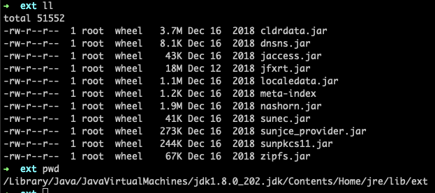

**如æœæƒ³ç”¨Extension ClassLoader 加载用户自己的jar包，有哪些方å¼ï¼Ÿ**

- （ä¸æ¨è）把自己的jar包放入/j re/lib/ext/目录下，尽é‡ä¸è¦å»æ”¹JDK安装目录中的内容

- **（æ¨è）**使用VMå‚数进行扩展

  > 使用命令：
  >
  > ```
  > -Djava.ext.dirs=jar包目录进行扩展，这ç§æ–¹å¼ä¼šè¦†ç›–åŸæ˜¯ç›®å½•ï¼Œæ‰€ä»¥éœ€è¦ç”¨ ; 追加åŸå§‹ç›®å½•
  > ```


##### Application ClassLoader

- 自己写的代ç é»˜è®¤å°±æ˜¯Application ClassLoader


**使用Arthas查看类加载器**

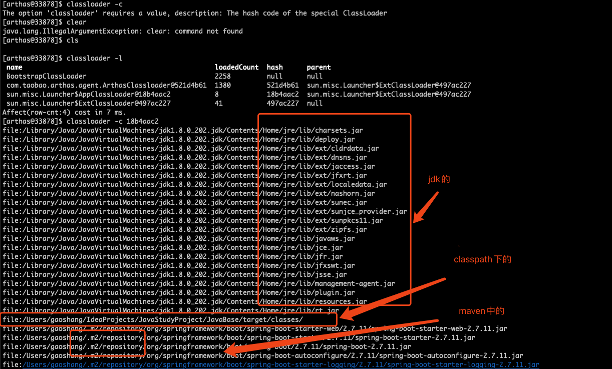


#### 2）åŒäº²å§”派机制

> ç”±äºJava虚拟机中有多个类加载器，åŒäº²å§”派机制的核心是解决一个类到底由è°æ¥åŠ è½½çš„问题

**åŒäº²å§”派机制有什么作用？**

1. ä¿è¯ç±»åŠ è½½çš„安全性

   > 通过åŒäº²å§”派机制é¿å…æ¶æ„代ç æ›¿æ¢JDK的核心类库，比如java.lang.String，确ä¿æ ¸å¿ƒç±»åº“的完整性和安全性

2. é¿å…é‡å¤åŠ è½½

   > å¯ä»¥é¿å…一个类被åå¤å¤šæ¬¡åŠ è½½


**什么是åŒäº²å§”派机制？**

> 当一个类加载器æ¥æ”¶åˆ°åŠ è½½ç±»å½“任务的时候，会**自底å‘上查找**是å¦åŠ è½½è¿‡ï¼Œå†**由顶å‘下进行加载**
>
> å‘下委派加载起到了一个加载优先级的作用
>
> 

æ¯ä¸ªç±»éƒ½æœ‰ä¸€ä¸ªçˆ¶ç±»åŠ è½½å™¨ï¼Œ**Application** 的父类是**Extension** ，**Extension**çš„parent是**Null**

- 在类加载的过程中，æ¯ä¸ªç±»åŠ è½½å™¨éƒ½ä¼šå…ˆæ£€æŸ¥æ˜¯å¦å·²ç»åŠ è½½ç±»è¯¥ç±»ï¼Œå¦‚æœå·²ç»åŠ è½½åˆ™ç›´æ¥è¿”å›ï¼Œå¦åˆ™ä¼šå°†åŠ è½½è¯·æ±‚委派给父类加载器，é€çº§å‘上

> 

- 如æœæ‰€æœ‰çš„父类加载器都没有加载该类，那么就会由最上层的类加载器开始**自顶å‘下**å°è¯•åŠ è½½ç±»ã€‚

> 


**问题：**

1. 如æœä¸€ä¸ªç±»é‡å¤å‡ºç°åœ¨ä¸‰ä¸ªç±»åŠ è½½å™¨çš„加载ä½ç½®ï¼Œåº”该由è°æ¥åŠ è½½ï¼Ÿ

   > 应该由Bootstrap ClassLoaderæ¥åŠ è½½ï¼Œè¯¥Loader优先级最高

2. String类能覆盖嘛？

   > Stringç±»ä¸èƒ½é‡å†™ï¼Œä¸ä¼šï¼Œä¸”String类由Bootstrap ClassLoaderæ¥åŠ è½½

3. 如何在Java中使用代ç çš„æ–¹å¼å»ä¸»åŠ¨åŠ è½½ä¸€ä¸ªç±»ï¼Ÿ

   > - 使用Class.forName方法，使用当å‰çš„类的类加载器å»åŠ è½½æŒ‡å®šçš„ç±»
   >
   >   ```java
   >   
   >           Class<?> aClass = Class.forName("xxxx.xxxx");
   >           aClass.getClassLoader();
   >   ```
   >
   > - è·å–类加载器，通过类加载器的loadClass() 指定æŸä¸ªç±»åŠ è½½å™¨åŠ è½½
   >
   >   ```java
   >   ClassLoader classLoader = Test002.class.getClassLoader();
   >   Class<?> aClass1 = classLoader.loadClass("xxxx.xxx");
   >   ```


**æ¯ä¸ªJavaå®ç°çš„类加载器中ä¿å­˜äº†ä¸€ä¸ªæˆå‘˜å˜é‡ parent类加载器，å¯ä»¥ç†è§£ä¸ºä¸Šä¸€çº§åŠ è½½å™¨ï¼Œä¸æ˜¯Java中继承关系和å«ä¹‰**

> 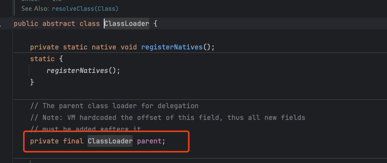


- Application加载器的parent是Extension 加载器，而**Extension加载的parent是Null**，但是在代ç é€»è¾‘上，Extension ClassLoaderä¾ç„¶ä¼šæŠŠBootstrap ClassLoader当æˆçˆ¶ç±»åŠ è½½å™¨å¤„ç†
- Bootstrap ClassLoader使用C++编写，没有parent加载器


使用Arthas查看ClassLoader的父å­å…³ç³»ï¼š

> ```shell
> classloader -t
> ```
>
> 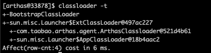


##### **é¢è¯•é¢˜**

**类的åŒäº²å§”派机制是什么？**

1. 当一个类加载器å»åŠ è½½æŸä¸ªç±»çš„时候，会自底å‘上查找是å¦åŠ è½½è¿‡ï¼Œå¦‚æœåŠ è½½è¿‡å°±ç›´æ¥è¿”å›ï¼Œå¦‚æœä¸€ç›´åˆ°æœ€é¡¶å±‚的类加载器都没有加载，å†ç”±é¡¶å‘下进行加载。
2. 应用程åºç±»åŠ è½½å™¨çš„父类加载器是扩展类加载器，扩展类加载器的父类加载器是å¯åŠ¨ç±»åŠ è½½å™¨ï¼ˆ**为Null**）。
3. åŒäº²å§”派机制的好处有两点: 第一是é¿å…æ¶æ„代ç æ›¿æ¢JDK中的核心类库，比如java.lang.String，确ä¿æ ¸å¿ƒç±»åº“的完整性和安全性。第二是é¿å…一个类é‡å¤åœ°è¢«åŠ è½½ã€‚


#### 3）打破åŒäº²å§”派机制

**打破åŒäº²å§”派机制有哪些方å¼ï¼Ÿ**

- 自定义类加载器

  > 自定义类加载器并且é‡å†™loadclass方法，就å¯ä»¥å°†åŒäº²å§”派机制的代ç å»é™¤Tomcat通过这ç§æ–¹å¼å®ç°åº”用之间类隔离，《é¢è¯•ç¯‡ã€‹ä¸­åˆ†äº«å®ƒçš„åšæ³•

- 线程上下文加载器

  > 利用上下文类加载器加载类，比如JDBC和JNDI等

- Osgi框æ¶çš„类加载器

  > å†å²ä¸Šosgi框æ¶å®ç°äº†ä¸€å¥—新的类加载器机制，å…许åŒçº§ä¹‹é—´å§”托进行类的加载


**为什么有打破åŒäº²å§”派机制？**

- 一个Tomcat程åºæ˜¯å¯ä»¥è¿è¡Œå¤šä¸ªWeb应用的，如æœä¸¤ä¸ªåº”用中出ç°äº†æƒ³åçš„é™å®šå的类，比如Servet类，Tomcatè¦ä¿è¯è¿™ä¸¤ä¸ªç±»èƒ½å¤ŸåŠ è½½å¹¶ä¸”它们应该是ä¸åŒçš„ç±»

- 如æœä¸æ‰“ç ´åŒäº²å§”派机制，当应用类加载器加载Web应用1çš„MyServlet之å，Web应用2中相åŒé™å®šåçš„MyServlet类就无法被加载了

  > 


##### 自定义类加载器

- Tomcat使用了自定义类加载器æ¥å®ç°åº”用之间类的隔离。æ¯ä¸€ä¸ªåº”用会有一个独立的类加载器加载相应的类。


- å…ˆæ¥åˆ†æClassLoaderçš„åŸç†ï¼ŒClassLoader中包å«äº†4个核心方法

  > ```java
  > // 类加载的入å£ï¼Œæ供了åŒäº²å§”派机制。内部会调用findClass é‡è¦
  > public Class<?> loadClass(String name) 
  > // 由类加载器å­ç±»å®ç°,è·å–二进制数æ®è°ƒç”¨defineClass ，比如URLClassLoader会根æ®æ–‡ä»¶è·¯å¾„å»è·å–类文件中的二进制数æ®ã€‚é‡è¦
  > protected Class<?> findClass(String name)
  > // åšä¸€äº›ç±»å的校验，然å调用虚拟机底层的方法将字节ç ä¿¡æ¯åŠ è½½åˆ°è™šæ‹Ÿæœºå†…存中
  > protected final Class<?> defineClass(String name, byte[] b, int off, int len)
  > // 执行类生命周期中的è¿æ¥é˜¶æ®µ
  > protected final void resolveClass(Class<?> c)
  > ```
  >
  > 

- åŒäº²å§”派机制的核心代ç å°±æ˜¯ä½äºloadClass方法中

- 打破åŒäº²å§”派机制的核心就是将下é¢loadClass方法的代ç é‡å†™

  > ```java
  > synchronized (getClassLoadingLock(name)) {
  >             // First, check if the class has already been loaded 首先检查该类是å¦å·²ç»åŠ è½½
  >             Class<?> c = findLoadedClass(name);
  >             if (c == null) {
  >                 long t0 = System.nanoTime();
  >                 try {
  >                     if (parent != null) {
  >                       // 调用父类的方法å»åŠ è½½
  >                         c = parent.loadClass(name, false);
  >                     } else {
  >                         c = findBootstrapClassOrNull(name);
  >                     }
  >                 } catch (ClassNotFoundException e) {
  >                     // ClassNotFoundException thrown if class not found
  >                     // from the non-null parent class loader
  >                 }
  >               
  >               if (c == null) {
  >                     // If still not found, then invoke findClass in order
  >                     // to find the class. 如æœçˆ¶ç±»åŠ è½½ä¸äº† 就自己æ¥åŠ è½½
  >                     long t1 = System.nanoTime();
  >                     c = findClass(name);
  > 
  >                     // this is the defining class loader; record the stats
  >                     sun.misc.PerfCounter.getParentDelegationTime().addTime(t1 - t0);
  >                     sun.misc.PerfCounter.getFindClassTime().addElapsedTimeFrom(t1);
  >                     sun.misc.PerfCounter.getFindClasses().increment();
  >                 }
  > ```

自定义类加载器的父类为什么是Application ClassLoader？

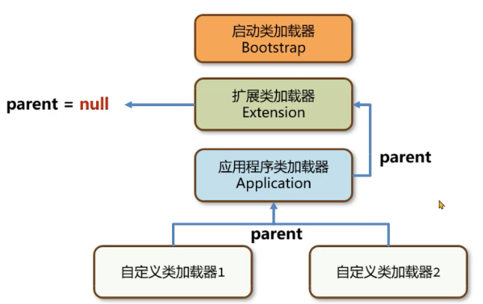

- JDK8为例，ClassLoader类中æ供了æ„造方法设置parent内容：

  > 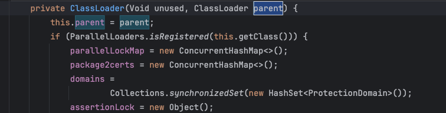
  >
  
- 这个æ„造方法由å¦ä¸€ä¸ªæ„造方法调用，其中父类加载器由get SystemClassLoader方法设置。该方法返å›çš„是Application ClassLoader

> 


**两个自定义类加载器加载相åŒé™å®šçš„类，ä¸ä¼šå†²çªï¼Ÿï¼Ÿ**

- ä¸ä¼šå†²çªï¼Œåœ¨åŒä¸€ä¸ªJava虚拟机中，åªæœ‰**相åŒç±»åŠ è½½å™¨+相åŒçš„ç±»é™å®šå**æ‰ä¼šè¢«è®¤ä¸ºæ˜¯åŒä¸€ä¸ªç±»

- 在Arthas中使用sc -d。classpath å¯ä»¥æŸ¥çœ‹å…·ä½“情况

  > ​	

- 正确的å»å®ç°ä¸€ä¸ªè‡ªå®šä¹‰ç±»åŠ è½½å™¨çš„æ–¹å¼æ˜¯é‡å†™**findClass**方法，这样ä¸ä¼šç ´ååŒäº²å§”派机制。

  > 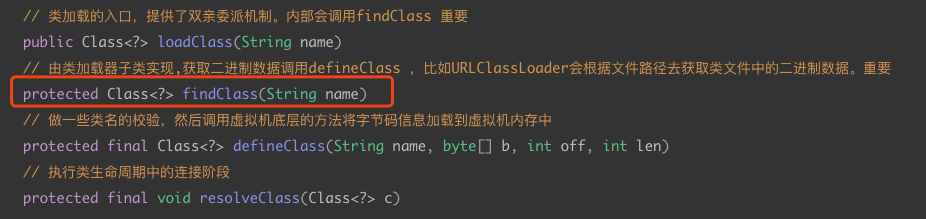


##### 线程上下文加载器

- JDBC使用了DriverManageræ¥ç®¡ç†é¡¹ç›®ä¸­å¼•å…¥çš„ä¸åŒæ•°æ®åº“的驱动，比如mysql驱动ã€oracle驱动

  > 

- DriverManagerä½äºrt.jar包中，由Bootstrap ClassLoader加载的

  > 

- DriverManagerä½äºrt.jar包中，由**Bootstrap ClassLoader**加载。而用户jar包中的驱动需è¦ç”¨**Application ClassLoader**æ¥åŠ è½½ï¼Œè¿™ä¸ªå°±è¿å了åŒäº²å§”派机制。

  > 


###### **SPI机制**

- SPI全称为（Service Provider Interface），是JDK内置的一ç§æœåŠ¡æä¾›å‘ç°æœåŠ¡

- â­ï¸â€¼ï¸SPIçš„**工作åŸç†**：

  > 1. **驱动jar包-------在ClassPath路径下的META-INFO/services文件夹中，以æ¥å£çš„å…¨é™åæ¥å‘½å文件夹，对应的文件里é¢å†™è¯¥æ¥å£çš„å®ç°**
  >
  >    
  >
  > 2. **使用ServiceLoader加载å®ç°ç±»---- DriverManager加载的是有个é™æ€åˆå§‹åŒ–的方法 加载驱动**
  >
  >    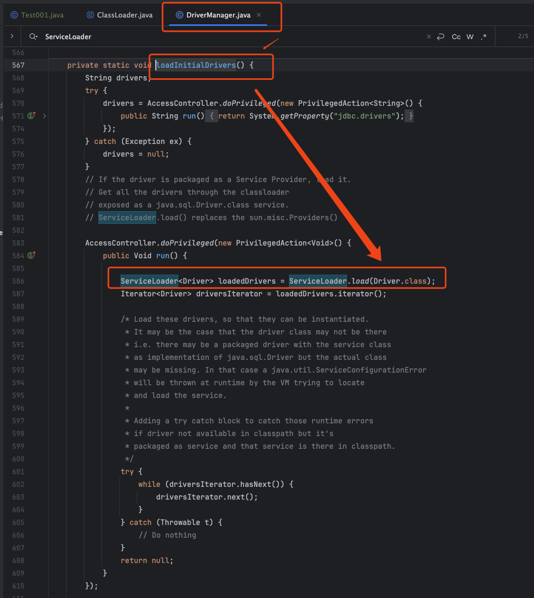

- **DriverManager使用SPI机制，最终加载jar包中对应的驱动类**

  > 


**JDBC案例总结**

- Bootstrap ClassLoader Load DriveManager
- 在åˆå§‹åŒ–DriveManager的时候，通过SPI机制加载jar包中的mysql驱动
- SPI利用了线程上下文类加载器（ThreadContextClassLoader） å»åŠ è½½å¹¶åˆ›å»ºå¯¹è±¡
- è¿™ç§ç”±BootStrap ClassLoader加载的类，委派Application ClassLoaderå»åŠ è½½ç±»çš„æ–¹å¼ï¼Œæ‰“破了åŒäº²å§”派机制

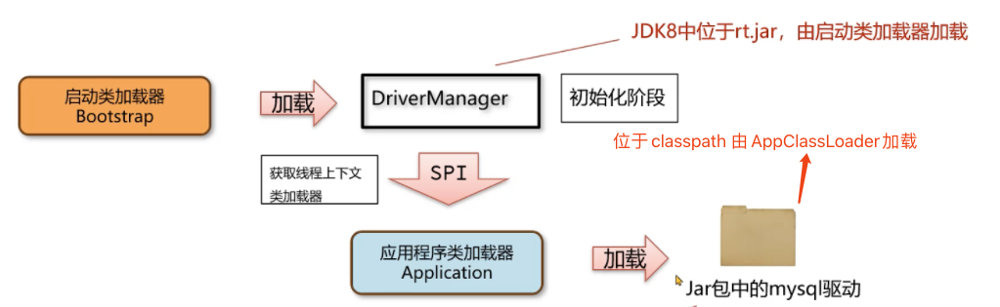

> Java æ供了很多æœåŠ¡æ供者æ¥å£ï¼ˆService Provider Interface，SPI），å…许第三方为这些æ¥å£æä¾›å®ç°ã€‚常è§çš„ SPI 有 JDBCã€JCEã€JNDIã€JAXP å’Œ JBI 等。
>
> 这些 SPI çš„æ¥å£ç”± Java 核心库æ¥æ供，而这些 SPI çš„å®ç°ä»£ç åˆ™æ˜¯ä½œä¸º Java 应用所ä¾èµ–çš„ jar 包被包å«è¿›ç±»è·¯å¾„（CLASSPATH）里。SPIæ¥å£ä¸­çš„代ç ç»å¸¸éœ€è¦åŠ è½½å…·ä½“çš„å®ç°ç±»ã€‚那么问题æ¥äº†ï¼ŒSPIçš„æ¥å£æ˜¯Java核心库的一部分，是由**å¯åŠ¨ç±»åŠ è½½å™¨(Bootstrap Classloader)æ¥åŠ è½½çš„ï¼›SPIçš„å®ç°ç±»æ˜¯ç”±ç³»ç»Ÿç±»åŠ è½½å™¨(System ClassLoader)**æ¥åŠ è½½çš„。引导类加载器是无法找到 SPI çš„å®ç°ç±»çš„，因为ä¾ç…§åŒäº²å§”派模å‹ï¼ŒBootstrapClassloader无法委派AppClassLoaderæ¥åŠ è½½ç±»ã€‚
>
> 而线程上下文类加载器破å了“åŒäº²å§”派模å‹â€ï¼Œå¯ä»¥åœ¨æ‰§è¡Œçº¿ç¨‹ä¸­æŠ›å¼ƒåŒäº²å§”派加载链模å¼ï¼Œä½¿ç¨‹åºå¯ä»¥é€†å‘使用类加载器。


**JDBC案例中真的打破了åŒäº²å§”派机制å—？？**

- **打破了**

  > è¿™ç§ç”±å¯åŠ¨ç±»åŠ è½½å™¨åŠ è½½çš„类，委派应用程åºåŠ è½½å™¨å»åŠ è½½ç±»çš„æ–¹å¼ï¼Œæ‰“破了åŒäº²å§”派机制

- **没有打破åŒäº²å§”派机制**

  > ***JDBCåªæ˜¯åœ¨DriverManager加载完之å，通过åˆå§‹åŒ–阶段触å‘了驱动类的加载，类的加载ä¾ç„¶éµå¾ªåŒäº²å§”派机制***


##### Osgi框æ¶çš„类加载器

- å†å²ä¸Šï¼ŒOSGI模å—化框æ¶ã€‚它存在åŒçº§ä¹‹é—´çš„类加载器的委托加载。OSGI还使用类加载器å®ç°äº†**热部署**的功能

  > 

- 热部署指的是在æœåŠ¡ä¸åœæ­¢çš„情况下，动æ€åœ°æ›´æ–°å­—节ç æ–‡ä»¶åˆ°å†…存中。


**使用Arthasä¸åœæœºè§£å†³çº¿ä¸Šé—®é¢˜**

> åªé€‚åˆæ”¹æ少数代ç ï¼Œå·²ç»ä¸èƒ½åœæœºçš„è¿™ç§æƒ…况

**æ€è·¯:**

- 在出问题的æœåŠ¡å™¨ä¸Šéƒ¨ç½²ä¸€ä¸ª arthas，并å¯åŠ¨ã€‚
- jad --source-only 类全é™å®šå >目录/文件åjavajad 命令å编译，然åå¯ä»¥ç”¨å…¶å®ƒç¼–译器，比如 vim æ¥ä¿®æ”¹æºç 
- mc -c 类加载器的hashcode 目录/文件å.java -d 输出目录mc 命令用æ¥ç¼–译修改过的代ç 
- retransform class文件所在目录/xxx.class用 retransform 命令加载新的字节ç 

**注æ„事项：**

- 程åºé‡å¯ä¹‹å，字节ç æ–‡ä»¶ä¼šæ¢å¤ï¼Œé™¤éå°†class文件放入jar包中进行更新。
- 使用retransformä¸èƒ½æ·»åŠ æ–¹æ³•æˆ–者字段，也ä¸èƒ½æ›´æ–°æ­£åœ¨æ‰§è¡Œä¸­çš„方法


#### 4）JDK9以å的类加载器

- JDK8之å‰çš„版本中，Extension ClassLoader å’ŒApplication ClassLoaderçš„æºç éƒ½æ˜¯ä½äºrt.jar包中的sun.misc.Launcher.java

  > 

- JDK9引入类module打概念，类加载器在设计上å‘生了许多å˜åŒ–

  > 1. Bootstrap ClassLoader使用Java编写，ä½äºjdk.internnal.loader.ClassLoaders类中
  >
  >    Java中的BootClassLoaderå³æˆBuiltinClassLoaderå®ç°ä»æ¨¡å—中找到è¦åŠ è½½çš„字节ç èµ„æºæ–‡ä»¶ã€‚
  >
  >    **Bootstrap ClassLoaderä¾ç„¶æ— æ³•é€šè¿‡java代ç è·å–到，返å›çš„ä»ç„¶æ˜¯null，为了ä¿æŒç»Ÿä¸€ã€‚**
  >
  >    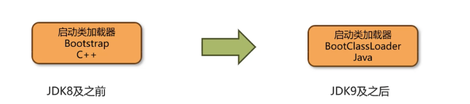
  >
  > 2. Extension ClassLoader 被替æ¢æˆPlatform Class Loader ，Platform ClassLoaderéµå¾ªæ¨¡å—化的方å¼åŠ è½½å­—节ç æ–‡ä»¶ï¼Œæ‰€ä»¥ç»§æ‰¿å…³ç³»ä»URLClassLoaderå˜æˆäº† BuiltinClassLoader，BuiltinClassLoaderå®ç°äº†ä»æ¨¡å—中加载字节ç æ–‡ä»¶ã€‚**Platform Class Loader存在的更多的是ä¸è€ç‰ˆæœ¬çš„设计方案兼容，自身没有特殊的逻辑。**
  >
  >    

- 有几ç§åŠ è½½å™¨ï¼Ÿ

  > 1. å¯åŠ¨ç±»åŠ è½½å™¨(Bootstrap ClassLoader) 加载核心类
  > 2. 扩展类加载器 (Extension ClassLoader) 加载扩展类
  > 3. 应用程åºç±»åŠ è½½å™¨ (Application ClassLoader) 加载应用classpath中的类
  > 4. 自定义类加载器，é‡å†™findClass方法
  > 5. JDK9åŠä¹‹å扩展类加载器(Extension ClassLoader) å˜æˆäº†å¹³å°ç±»åŠ è½½å™¨(Platform ClassLoader)

  > **JDK8** 
  >
  > 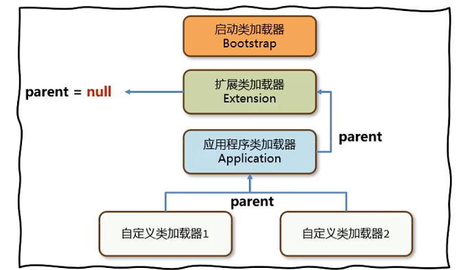
  > 

  

---


##  3.JVM的内存区域

> 就是è¿è¡Œæ—¶æ•°æ®åŒºåŸŸï¼ˆJVM管ç†çš„内存）
>
> 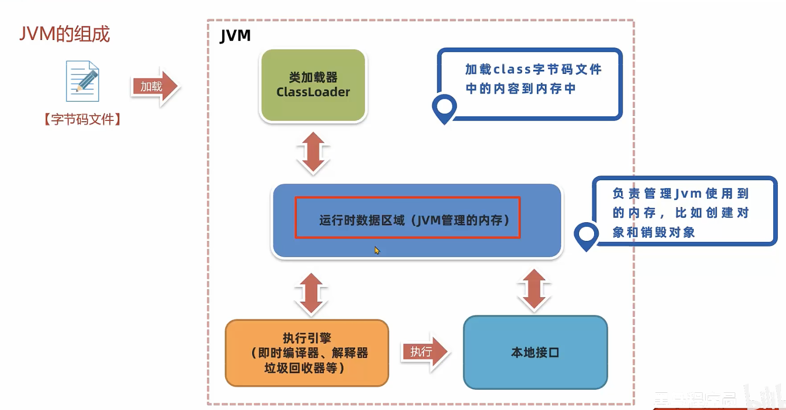

主è¦åˆ†ä¸ºå››éƒ¨åˆ†

- 程åºè®¡æ•°å™¨
- æ ˆ
- å †
- 方法区
- **ç›´æ¥å†…存（ä¸å±äºJVM管ç†çš„）**


### è¿è¡Œæ—¶æ•°æ®åŒº

- Java虚拟机在è¿è¡ŒJava程åºè¿‡ç¨‹ä¸­ç®¡ç†çš„内存区域，称之为è¿è¡Œæ—¶æ•°æ®åŒº
- 《Java虚拟机规范》中规范了æ¯ä¸€éƒ¨åˆ†çš„作用。

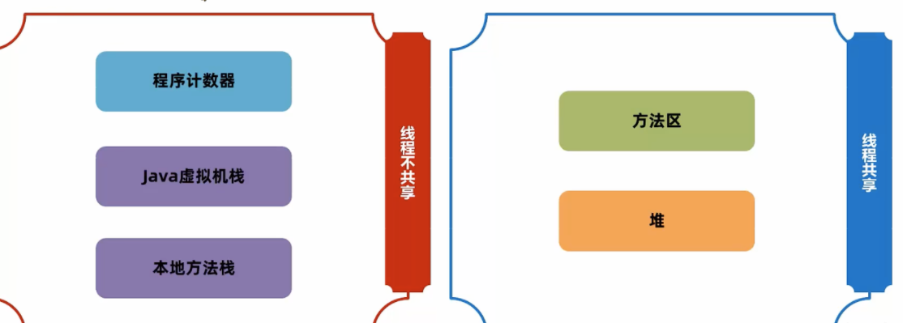


#### 1）程åºè®¡æ•°å™¨-Program Counter

- 程åºè®¡æ•°å™¨ï¼ˆProgram Counter Register ）也å«PC寄存器，æ¯ä¸ªçº¿ç¨‹ä¼šé€šè¿‡ç¨‹åºè®¡æ•°å™¨**记录当å‰è¦æ‰§è¡Œçš„字节ç æŒ‡ä»¤çš„地å€**

  > 

  

- 在代ç æ‰§è¡Œè¿‡ç¨‹ä¸­ï¼Œç¨‹åºè®¡æ•°å™¨**会记录下一行字节ç æŒ‡ä»¤çš„地å€**。执行完当å‰æŒ‡ä»¤ä¹‹å，虚拟机的执行引æ“会根æ®**程åºè®¡æ•°å™¨**执行下一行指令。

**案例：**

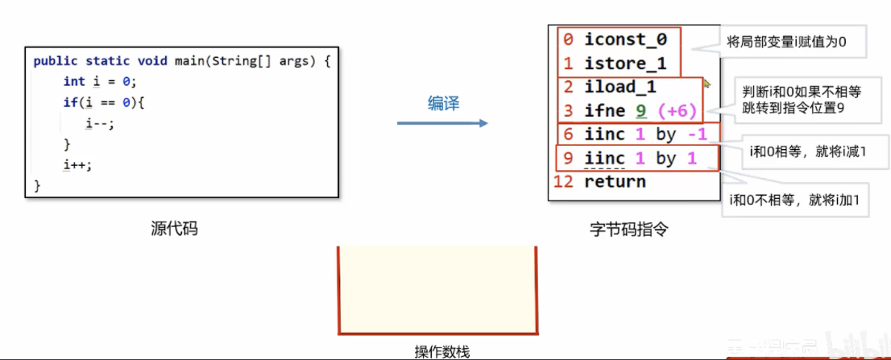


> 🌟🌟**程åºè®¡æ•°å™¨ä¼šè®°ä½ä¸‹ä¸€è¡Œå移é‡çš„内存地å€ï¼Œæ‰§è¡Œå®Œå½“å‰æŒ‡ä»¤çš„时候，å¯ä»¥æ ¹æ®åœ°å€æ‰¾åˆ°ä¸‹ä¸€è¡ŒæŒ‡ä»¤ã€‚**

- 在多线程执行情况下，Java虚拟机需è¦é€šè¿‡ç¨‹åºè®¡æ•°å™¨è®°å½•CPU**切æ¢å‰è§£é‡Šæ‰§è¡Œåˆ°é‚£ä¸€å¥æŒ‡ä»¤**并继续è¿è¡Œ

  > 先执行线程A，å¯åŠ¨ä¸€ä¸ªå¤šçº¿ç¨‹æ‰§è¡Œçº¿ç¨‹B（那么A线程的程åºè®¡æ•°å™¨å°±ä¼šè®°å½•å½“å‰A所执行的内存地å€æˆ–者说å移é‡ï¼‰ï¼Œé‚£ä¹ˆå½“A等待的时候，B执行完的时候，开始执行A了，那么A线程就会称程åºè®¡æ•°å™¨ä¸­æ‰¾åˆ°å†…存地å€ç»§ç»­æ‰§è¡Œã€‚
  >
  > 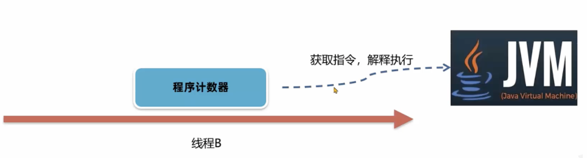


**问题：**

程åºè®¡æ•°å™¨åœ¨è¿è¡Œä¸­ä¼šå‡ºç°å†…存溢出å—？

- 内存溢出指的是程åºåœ¨ä½¿ç”¨æŸä¸€å—内存区域的时，存放的数æ®éœ€è¦å ç”¨çš„内存大å°è¶…过了虚拟机能æ供的内存上é™
- 因为æ¯ä¸ªçº¿ç¨‹åªå­˜å‚¨ä¸€ä¸ªå›ºå®šé•¿åº¦çš„内存地å€ï¼Œ**程åºè®¡æ•°å™¨æ˜¯ä¸ä¼šå‘生内存溢出的。**
- 程åºå‘˜æ— éœ€å¯¹ç¨‹åºè®¡æ•°å™¨åšä»»ä½•å¤„ç†


#### 2）栈-Stack

Java虚拟机栈（Java Virtual Machine Stack）采用**栈的数æ®ç»“æ„æ¥ç®¡ç†è°ƒç”¨ä¸­çš„基本数æ®**，**先进å出**（first in last out），æ¯ä¸€ä¸ªæ–¹æ³•çš„调用使用一个栈帧æ¥ï¼ˆStack Frame）æ¥ä¿å­˜ã€‚

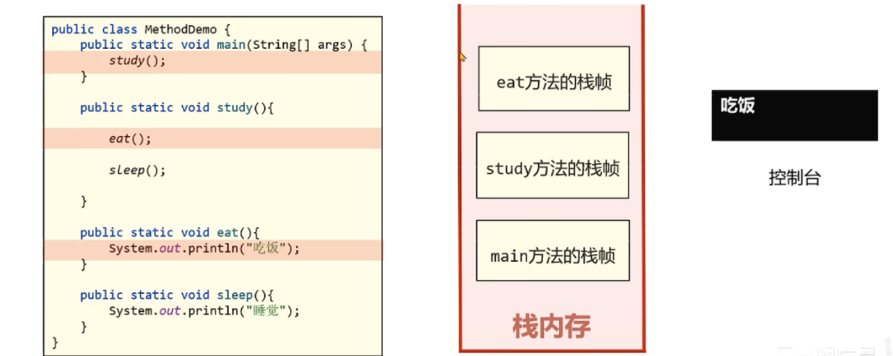

**使用IDEAæ¥debug的时候，打断点å¯ä»¥æŸ¥çœ‹å¯¹åº”的栈帧**


**当抛出一个异常的时候，也会一个个退出栈帧。日志中会显示。**

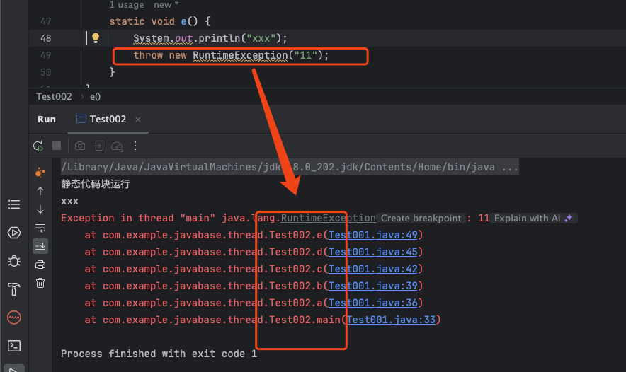


- **Java虚拟机栈éšç€çº¿ç¨‹åˆ›å»ºè€Œåˆ›å»ºï¼Œè€Œå›æ”¶åˆ™ä¼šåœ¨çº¿ç¨‹çš„销æ¯æ—¶è¿›è¡Œ**。由äºæ–¹æ³•å¯èƒ½ä¼šåœ¨ä¸åŒçº¿ç¨‹ä¸­æ‰§è¡Œï¼Œæ¯ä¸ªçº¿ç¨‹éƒ½ä¼šåŒ…å«ä¸€ä¸ªè‡ªå·±çš„虚拟机栈。

  > 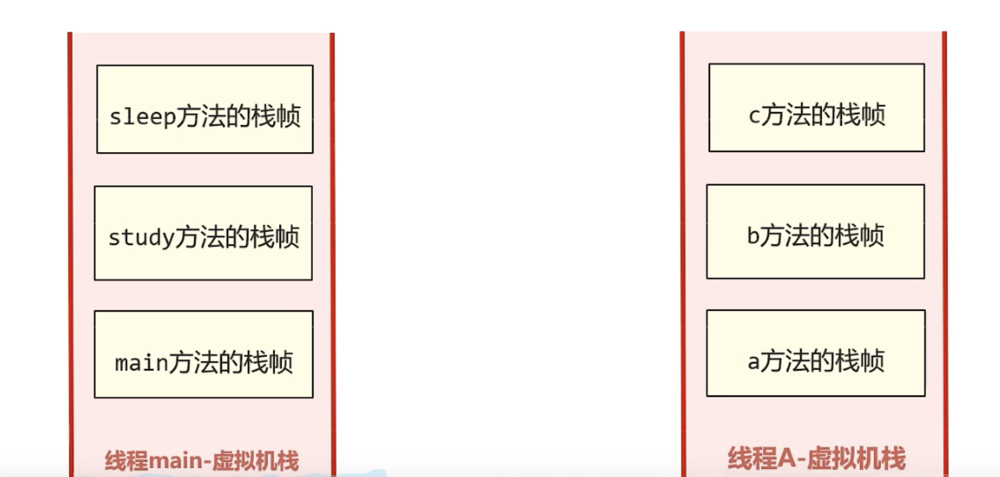


**栈帧的组æˆ**

- **局部å˜é‡è¡¨**

  > 局部å˜é‡è¡¨çš„作用是在è¿è¡Œè¿‡ç¨‹ä¸­**存放所有的局部å˜é‡**

- **æ“作数栈**

  > æ“作数栈时栈帧中虚拟机在执行指令过程中用æ¥**存放临时数æ®**的一å—区域

- **帧数æ®**

  > 帧数æ®ä¸»è¦åŒ…å«åŠ¨æ€é“¾æ¥ã€æ–¹æ³•å‡ºå£ã€å¼‚常表的引用


###### 局部å˜é‡è¡¨

- 局部å˜é‡è¡¨çš„作用是在方法执行过程存放所有的局部å˜é‡ã€‚编译æˆå­—节ç æ–‡ä»¶æ—¶å°±å¯ä»¥ç¡®å®šå±€éƒ¨å˜é‡è¡¨çš„内容

  > ```java
  > public static void test() {
  >         int i = 0;
  >         int j = 1;
  >     }
  > ```
  >
  > 字节ç æŒ‡ä»¤ï¼š
  >
  > ```bytecode
  > 0 iconst_0
  > 1 istore_0
  > 2 iconst_1
  > 3 istore_1
  > 4 return
  > ```
  >
  > 
  >
  > Strat PC ä»ç¬¬ç¬¬ä¸€è¡Œå¼€å§‹ä¾‹å¦‚ i=0 那么就是**1 istore_0**

- 栈帧中的局部å˜é‡è¡¨æ˜¯ä¸€ä¸ªæ•°ç»„，**数组中æ¯ä¸€ä¸ªä½ç½®ç§°ä¹‹ä¸ºæ§½ï¼ˆslot）**，***Long*å’Œ*Double*ç±»å‹å ç”¨ä¸¤ä¸ªæ§½**，其他类å‹å ç”¨ä¸€ä¸ªæ§½ã€‚

  > Code:
  >
  > ```java
  >  public static void test() {
  >         int i = 0;
  >         long j = 1;
  >         int k = 2;
  >     }
  > ```
  >
  > 
  >
  > 

**为什么ä¸èƒ½åœ¨é™æ€æ–¹æ³•ä¸­ä½¿ç”¨this？**

> 🌟‼ï¸**如æœè¯¥æ–¹æ³•æ˜¯static的，那么ä¸èƒ½åœ¨è¯¥æ–¹æ³•ä¸­ä½¿ç”¨this，因为this代表å®ä¾‹å¯¹è±¡ï¼Œé‚£ä¹ˆstaticéšç€ç±»åŠ è½½è€ŒåŠ è½½ï¼Œå…ˆäºå®ä¾‹ä¹‹å‰å°±åˆ›å»ºäº†ï¼Œä¸å­˜åœ¨å±€éƒ¨å˜é‡è¡¨ä¸­ï¼Œæ‰€ä»¥ä¸èƒ½ä½¿ç”¨**	


- 方法å‚数也会ä¿å­˜åœ¨å±€éƒ¨å˜é‡è¡¨ä¸­ï¼Œå…¶é¡ºåºä¸æ–¹æ³•ä¸­å‚数定义的顺åºä¸€è‡´

- 局部å˜é‡è¡¨ä¿å­˜çš„内容有：**å®ä¾‹æ–¹æ³•çš„this对象永远在第一ä½**，方法的å‚数，方法体中声æ˜çš„局部å˜é‡ã€‚

  > 

- 为了节çœç©ºé—´ï¼Œå±€éƒ¨**å˜é‡è¡¨ä¸­çš„槽是å¯ä»¥å¤ç”¨çš„**，一旦æŸä¸ªå±€éƒ¨å˜é‡ä¸å†ç”Ÿæ•ˆï¼Œå½“å‰æ§½å°±å¯ä»¥å†æ¬¡è¢«ä½¿ç”¨

  > ```
  >  0 iconst_0
  >  1 istore_3
  >  2 iconst_1
  >  3 istore 4
  >  5 iconst_1
  >  6 istore_3
  >  7 iconst_0
  >  8 istore_3
  >  9 iconst_1
  > 10 istore 4
  > 12 return
  > ```
  >
  > 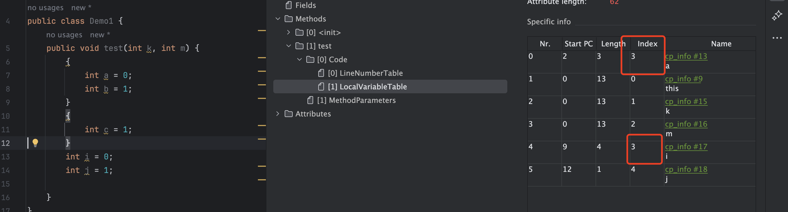
  >
  > **局部å˜é‡è¡¨**
  >
  > | this | k    | m    | 第一次存aã€ç¬¬äºŒæ¬¡çš„时候存了c | 第一次存b 第二次存了i | j    |
  > | ---- | ---- | ---- | ---------------------------- | --------------------- | ---- |
  > | 0    | 1    | 2    | 3                            | 4                     | 5    |


###### **æ“作数栈**

- æ“作数栈是栈帧中虚拟机在执行指令过程中用æ¥å­˜æ”¾ä¸­é—´æ•°æ®çš„一å—区域。他是一ç§æ ˆå¼çš„æ•°æ®ç»“æ„，如æœä¸€æ¡æŒ‡ä»¤å°†ä¸€ä¸ªå€¼å‹å…¥æ“作数栈，则åé¢çš„指令å¯ä»¥å¼¹å‡ºå¹¶ä½¿ç”¨è¯¥å€¼ã€‚

- 在**编译期**å°±å¯ä»¥ç¡®å®šæ“作数栈的最大深度，ä»è€Œåœ¨æ‰§è¡Œæ—¶æ­£ç¡®çš„分é…内存大å°ã€‚

  > 
  >
  > ```
  > 0 iconst_0
  > 1 istore_3
  > 2 iload_3
  > 3 iconst_1
  > 4 iadd
  > 5 istore 4
  > 7 return
  > ```
  >
  > 
  >
  > > 先入栈为0 ，然å在入栈1 然åæ“作数栈直æ¥ç›¸åŠ å˜æˆ1，然å在存储局部å˜é‡è¡¨ä¸­j为1
  >


###### 帧数æ®

> 包å«äº†ä¸‰éƒ¨åˆ†ï¼š
>
> 1. 动æ€é“¾æ¥
> 2. 方法出å£
> 3. 异常表

- **动æ€é“¾æ¥**  当å‰ç±»çš„字节ç æŒ‡ä»¤å¼•ç”¨äº†å…¶ä»–类的å±æ€§æˆ–者方法时，需è¦å°†ç¬¦å·å¼•ç”¨ï¼ˆç¼–å·ï¼‰è½¬æ¢å¯¹åº”çš„è¿è¡Œæ—¶å¸¸é‡æ± ä¸­çš„内存地å€ã€‚**动æ€é“¾æ¥å°±ä¿å­˜äº†ç¼–å·åˆ°å¸¸é‡æ± çš„内存地å€çš„映射关系。**

  > 
  >
  > A类调用B类的方法
  >
  > 

- **方法出å£**指的是方法在正确或者异常结æŸçš„时候。当å‰æ ˆå¸§ä¼šè¢«å¼¹å‡ºï¼ŒåŒæ—¶ç¨‹åºè®¡æ•°å™¨åº”该指å‘上一个栈帧中的下一æ¡æŒ‡ä»¤çš„地å€ã€‚所以在当å‰æ ˆå¸§ä¸­ï¼Œ**需è¦å­˜å‚¨æ­¤æ–¹æ³•å‡ºå£çš„地å€ã€‚**

  > 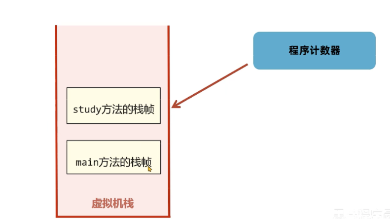

- **异常表存**放的是**代ç ä¸­å¼‚常的处ç†ä¿¡æ¯**，包å«äº†try代ç å—å’Œcatch代ç å—执行å跳转到到字节ç æŒ‡ä»¤ä½ç½®

  > **Code:**
  >
  > ```java
  >  public void test() {
  >         try {
  >             int i = 0;
  >         } catch (Exception e) {
  >             int j = 1;
  >         } finally {
  >             int i = 2;
  >         }
  >     }
  > ```
  >
  > **字节ç ï¼š**
  >
  > ```java
  >  0 iconst_0
  >  1 istore_1
  >  2 iconst_2
  >  3 istore_1
  >  4 goto 21 (+17)
  >  7 astore_1
  >  8 iconst_1
  >  9 istore_2
  > 10 iconst_2
  > 11 istore_1
  > 12 goto 21 (+9)
  > 15 astore_3
  > 16 iconst_2
  > 17 istore 4
  > 19 aload_3
  > 20 athrow
  > 21 return
  > ```
  >
  > 异常的时候， **7 astore_1**
  >
  > 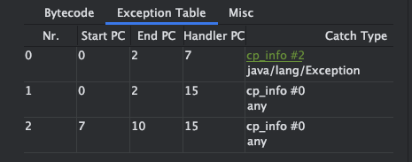


###### 栈内存溢出

- Java虚拟机栈如æœæ ˆå¸§è¿‡å¤šï¼Œå ç”¨å†…存超过栈内存å¯ä»¥åˆ†é…到最大大å°å°±ä¼šå‡ºç°å†…存溢出。

- Java虚拟机栈内存溢出时会åˆé€‰StackOverFlowError到错误

  > **模拟栈内存溢出**
  >
  > ```java
  > public class Demo1 {
  >     private static AtomicInteger atomicInteger = new AtomicInteger();
  >     public static void main(String[] args) {
  >         test();
  >     }
  >     public static void test() {
  >         System.out.println(atomicInteger.incrementAndGet());
  >         test();
  >     }
  > }
  > ```
  >
  > **溢出报错**
  >
  > 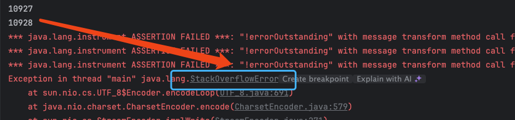

- 如æœæˆ‘们ä¸æŒ‡å®šè™šæ‹Ÿæœºæ ˆçš„大å°ï¼ŒJVM将创建一个具有**默认大å°çš„æ ˆ**。大å°å–决äºæ“作系统和计算机的体系结æ„。

  > 
  >
  > 
  >
  
  - ***修改Java虚拟机栈的大å°***
  
  > - **è¦ä¿®æ”¹Java虚拟机栈的大å°ï¼Œå¯ä»¥ä½¿ç”¨è™šæ‹Ÿæœºå‚æ•° -Xss**
  > - **语法：**-Xss栈大å°
  > - å•ä½ï¼šå­—节（默认，必须时1024çš„å€æ•°ï¼‰ï¼Œk或者K（KB），m或者M（MB），g或者G（GB）
  >
  > 案例：
  >
  > 
  >
  > 

**🌟🌟Tips：**

1. ä¸-Xss类似，也å¯ä»¥ä½¿ç”¨-XX:ThreadStackSize调整标志æ¥é…置堆栈大å°ï¼Œæ ¼å¼-XX:ThreadStackSize=1024

2. HotSpot JVM对栈大å°çš„最大值和最å°å€¼æœ‰è¦æ±‚：

   > 比如测试如下两个å‚æ•° -Xss1k     -Xss1025m。  Windows（64）下的JDK8测试下最å°å€¼ä¸º180k，最大值为1024m

3. 局部å˜é‡è¿‡å¤šã€æ“作数栈深度过大也会影å“栈内存的大å°

   > 一般情况下，工作中å³ä¾¿ä½¿ç”¨äº†é€’归进行æ“作，栈的深度最多也åªèƒ½åˆ°å‡ ç™¾,ä¸ä¼šå‡ºç°æ ˆçš„溢出。所以此å‚æ•°å¯ä»¥æ‰‹åŠ¨æŒ‡å®šä¸º-Xss256k节çœå†…å­˜


###### **本地方法栈**

- Java虚拟机栈存储了Java方法调用时的栈帧，而本地方法栈存储的是**native本地方法的栈帧。**

- 在Hotspot虚拟机中，**Java虚拟机栈和本地方法栈å®ç°ä½¿ç”¨äº†åŒä¸€ä¸ªæ ˆç©ºé—´ã€‚**本地方法栈会在栈内存上生æˆä¸€ä¸ªæ ˆå¸§ï¼Œä¸´æ—¶ä¿å­˜æ–¹æ³•çš„å‚æ•° åŒæ—¶æ–¹ä¾¿å‡ºç°å¼‚常时也把本地方法的栈信æ¯æ‰“å°å‡ºæ¥ã€‚

  > 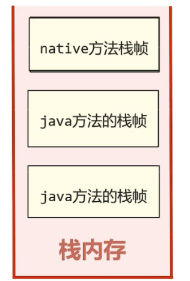


#### 3）堆-Heap

- 一般Java程åºä¸­å †å†…存是空间最大的一å—内存区域。**创建出æ¥çš„对象都存äºå †ä¸Šã€‚****是线程共享的。**

- 栈上的局部å˜é‡è¡¨ä¸­ï¼Œå¯ä»¥å­˜æ”¾å †ä¸Šå¯¹è±¡çš„引用。é™æ€å˜é‡ä¹Ÿå¯ä»¥å­˜æ”¾å †å¯¹è±¡çš„引用，通过é™æ€å˜é‡å°±å¯ä»¥å®ç°å¯¹è±¡åœ¨çº¿ç¨‹ä¹‹é—´å…±äº«ã€‚

  > 


##### **模拟Heap 内存溢出**

> 当heap内存达到上é™çš„时候，就会**OutOfMemoryError**
>
> 

- Heap Space有个三个需è¦å…³æ³¨çš„值，**usedã€totalã€max**

  > **used**指的是当å‰å·²ä½¿ç”¨çš„堆内存，**total**是Java虚拟机已ç»åˆ†é…çš„å¯ç”¨å †å†…存，**max**是Java虚拟机å¯ä»¥åˆ†é…的最大内存。
  >
  > 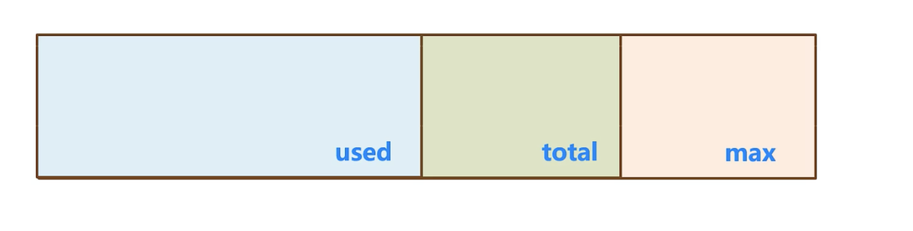

- éšç€å †ä¸­å¯¹è±¡å¢å¤šï¼Œå½“totalå¯ä»¥ä½¿ç”¨çš„内存å³å°†ä¸è¶³æ—¶ï¼Œjava虚拟机会继续分é…内存空间给堆。

  > 

- 如æœheap呢存ä¸è¶³ï¼ŒJava虚拟机就会ä¸æ–­çš„分é…内存，total值会å˜å¤§ã€‚total最多åªèƒ½ä¸max相等。

  > 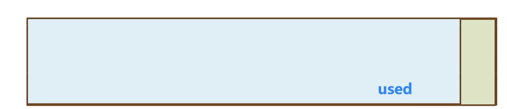

**Arthas观察内存å˜åŒ–**

> dashboard -i 2000
>
> å‘ç°usageé€æ¸å¢åŠ  直至崩溃
>
> 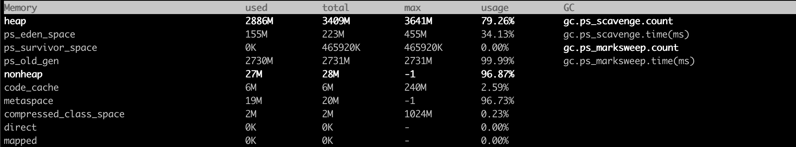

**问题：**

是ä¸æ˜¯å½“used=max=total的时候，堆内存就溢出？

> ä¸æ˜¯ï¼Œå †å†…存溢出的判断æ¡ä»¶æ¯”较å¤æ‚

- Heap设置大å°

  > è¦ä¿®æ”¹heap的大å°ï¼Œå¯ä»¥ä½¿ç”¨è™šæ‹Ÿæœºå‚æ•° **-Xmx（max最大值）和-Xms（åˆå§‹çš„total）**
  >
  > - å•ä½ï¼šå­—节（默认，必须时1024çš„å€æ•°ï¼‰ï¼Œk或者K（KB），m或者M（MB），g或者G（GB）
  > - é™åˆ¶Xmxå¿…é¡»å¤§äº 2MB，Xms必须大äº1MB
  >
  > 
  >
  > JVMå‚数：
  >
  > 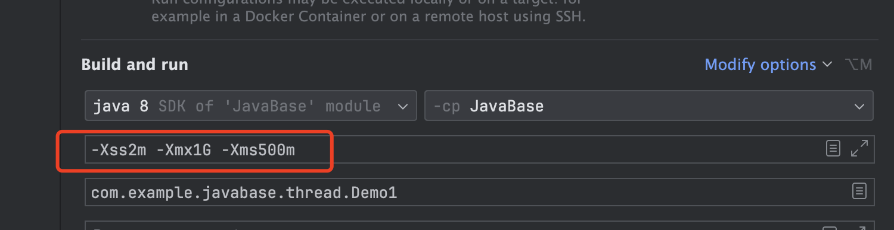
  >
  > Arthas的dashboard：
  >
  > 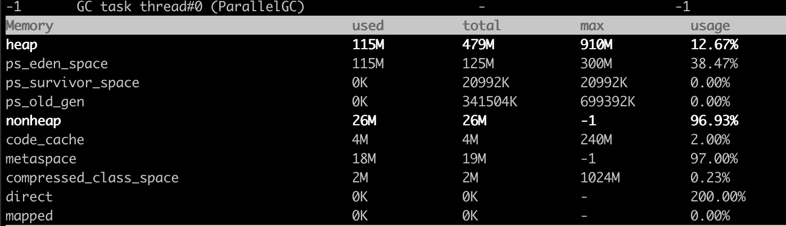

  

  **问题？**

  为什么arthas中显示的heap堆大å°ä¸è®¾ç½®çš„值ä¸ä¸€æ ·å‘¢?

  > arthas中的heap堆内存使用了JMX技术中内存è·å–æ–¹å¼ï¼Œè¿™ç§æ–¹å¼ä¸åƒåœ¾å›æ”¶å™¨æœ‰å…³ï¼Œè®¡ç®—的是å¯ä»¥åˆ†é…对象的内存，而ä¸æ˜¯æ•´ä¸ªå†…存。

- JavaæœåŠ¡ç«¯ç¨‹åºå¼€å‘时，**建议将-Xmxå’Œ-Xms设置为相åŒçš„值**，这样在程åºå¯åŠ¨ä¹‹åå¯ä½¿ç”¨çš„总内存就是最大内存，而无需å‘java虚拟机å†æ¬¡ç”³è¯·ï¼Œå‡å°‘了申请并分é…内存时间上的开销，åŒæ—¶ä¹Ÿä¸ä¼šå‡ºç°å†…存过剩之å堆收缩的情况。

  > 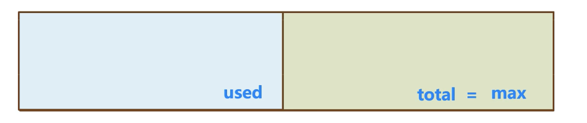


#### 4）方法区-Method Area

方法区是存放**基础信æ¯çš„ä½ç½®ï¼Œæ˜¯çº¿ç¨‹å…±äº«çš„**，主è¦åŒ…å«ä¸‰éƒ¨åˆ†å†…容：

- **类的元信æ¯**--ä¿å­˜äº†æ‰€æœ‰ç±»çš„基本信æ¯
- **è¿è¡Œæ—¶å¸¸é‡æ± **--ä¿å­˜äº†å­—节ç æ–‡ä»¶ä¸­çš„常é‡æ± å†…容
- **字符串常é‡æ± **--ä¿å­˜äº†å­—符串常é‡æ± 


###### 类的元信æ¯

- 方法区是用æ¥å­˜å‚¨**æ¯ä¸ªç±»çš„基本信æ¯ï¼ˆå…ƒä¿¡æ¯ï¼‰**，一般称之为InstanceKlass对象。在类的**加载阶段**完æˆã€‚

  > 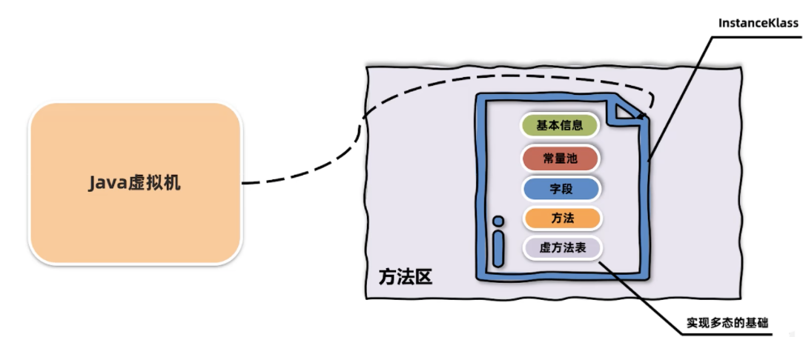


###### è¿è¡Œæ—¶å¸¸é‡æ± 

- 方法区除了存储类的元信æ¯ä¹‹å¤–，还存放了è¿è¡Œæ—¶å¸¸é‡æ± ã€‚**常é‡æ± ä¸­å­˜æ”¾çš„是字节ç ä¸­çš„常é‡æ± å†…容。**

- 字节ç æ–‡ä»¶ä¸­é€šè¿‡ç¼–å·æŸ¥è¡¨çš„方法找到常é‡ï¼Œè¿™ç§å¸¸é‡æ± ç§°ä¸º**é™æ€å¸¸é‡æ± **。当é‡æ± åŠ è½½å†…存中之å，å¯ä»¥é€šè¿‡å†…存地å€å¿«é€Ÿçš„定ä½åˆ°å¸¸é‡æ± ä¸­çš„内容，这ç§å¸¸é‡æ± ç§°ä¸º**è¿è¡Œæ—¶å¸¸é‡æ± **。

  > 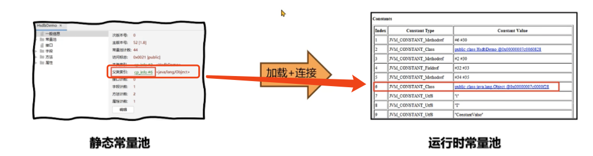

- 方法区是《Java虚拟机规范》中设计的虚拟概念，æ¯æ¬¾Java虚拟机在å®ç°ä¸Šéƒ½å„ä¸ç›¸åŒã€‚Hotspot设计如下：

  - JDK7之å‰çš„版本将方法区存放在堆区域中的永久代空间，堆堆大å°ç”±è™šæ‹Ÿæœºå‚æ•°æ¥æ§åˆ¶ã€‚
  - JDK8之å的版本将方法区存放在**元空间**中，元空间ä½äºæ“作系统维护的直æ¥å†…存中，默认情况下åªè¦ä¸è¶…越æ“作系统承å—的上é™ï¼Œå¯ä»¥ä¸€ç›´åˆ†é…。

  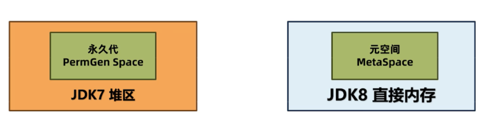


**arthas查看方法区内存**

> JDK7:
>
> 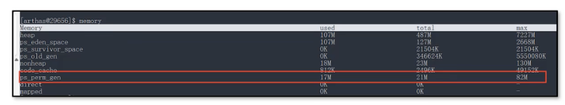
>
> JDK8:
>
> 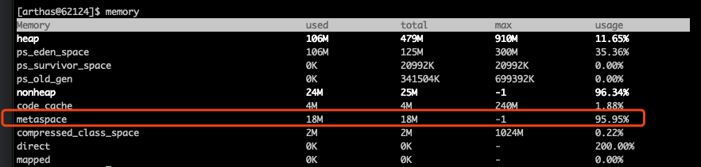


**验è¯æ–¹æ³•åŒºæº¢å‡º**

通过ByteBuddy框æ¶ï¼ŒåŠ¨æ€ç”Ÿæˆå­—节ç æ•°æ®ï¼ŒåŠ è½½åˆ°å†…存中。通过死循ç¯ä¸åœåœ°åŠ è½½åˆ°æ–¹æ³•åŒºï¼Œè§‚察方法区是å¦ä¼šå‡ºç°å†…存溢出的情况。分别在JDK7å’ŒJDK8上è¿è¡Œä¸Šè¿°ä»£ç ã€‚

> ```xml
>  <dependency>
>             <groupId>net.bytebuddy</groupId>
>             <artifactId>byte-buddy</artifactId>
>         </dependency>
> ```
>
> Code:
>
> ```java
> public static void main(String[] args) throws IOException {
>         System.in.read();
>         Demo1 demo1 = new Demo1();
>         int count = 0;
>         while (true) {
>             String name = "Clas" + count;
>             ClassWriter classWriter = new ClassWriter(0);
>             classWriter.visit(Opcodes.V1_8, Opcodes.ACC_PUBLIC, name, null, "java/lang/Object", null);
>             byte[] byteArray = classWriter.toByteArray();
>             demo1.defineClass(name, byteArray, 0, byteArray.length);
>             System.out.println(++count);
>         }
>     }
> ```
>
> å®éªŒå‘ç°ï¼ŒJDK7上è¿è¡Œå¤§æ¦‚å几万次，就出ç°äº†é”™è¯¯ã€‚在JDK8上è¿è¡Œç™¾ä¸‡æ¬¡ï¼Œç¨‹åºéƒ½æ²¡æœ‰å‡ºç°ä»»ä½•é”™è¯¯ï¼Œä½†æ˜¯å†…存会直线å‡é«˜ã€‚这说æ˜JDK7å’ŒJDK8在方法区的存放上，采用了ä¸åŒçš„设计。
>
> - JDK7将方法区存放在堆区域中的永久代空间，堆的大å°ç”±è™šæ‹Ÿæœºå‚æ•°-XX:MaxPermsize=值æ¥æ§åˆ¶
>
> - **JDK8将方法区存放在元空间中**，元空间ä½äºæ“作系统维护的直æ¥å†…存中，默认情况下åªè¦ä¸è¶…过æ“作系统承å—的上é™ï¼Œå¯ä»¥ä¸€ç›´åˆ†é…。å¯ä»¥ä½¿ç”¨**-XX:MaxMetaspacesize=**值将元空间最大大å°è¿›è¡Œé™åˆ¶
>
>   >设置方法区内存大å°
>   >
>   >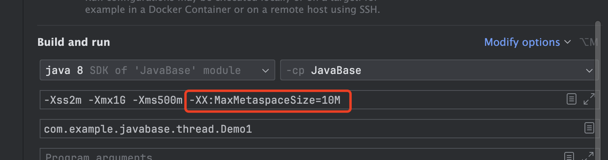
>   >
>   >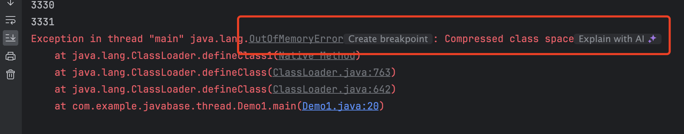


###### 字符串常é‡æ± ï¼ˆStringTable）

- 方法区中除了类的元信æ¯ã€è¿è¡Œæ—¶å¸¸é‡æ± ä¹‹å¤–，还有一å—区域å«**字符串常é‡æ± ï¼ˆStringTable）**

- 字符串常é‡æ± å­˜å‚¨åœ¨ä»£ç ä¸­å®šä¹‰çš„**常é‡å­—符串内容**。比如“123â€è¿™ä¸ª123就会被放到字符串常é‡æ± ä¸­ã€‚

  > ```java
  > public static void main(String[] args) {
  >     // heap内存中
  >     String string = new String("123");
  >     // 字符串常é‡æ± 
  >     String string1 ="123";
  >     // false
  >     System.out.println(string1==string);
  >     // true 比较的是值
  >     System.out.println(string1.equals(string));
  > }
  > ```
  >
  > 

**问题：**

**字符串常é‡æ± å’Œè¿è¡Œæ—¶å¸¸é‡æ± æœ‰ä»€ä¹ˆå…³ç³»ï¼Ÿ**

> 早期设计时，字符串常é‡æ± æ—¶å±äºè¿è¡Œæ—¶å¸¸é‡æ± æ± çš„一部分，他们存储的ä½ç½®ä¹Ÿæ˜¯ä¸€è‡´çš„。åç»­åšå‡ºäº†è°ƒæ•´ï¼Œå°†å­—符串常é‡æ± å’Œè¿è¡Œæ—¶å¸¸é‡æ± åšäº†æ‹†åˆ†ã€‚
>
> 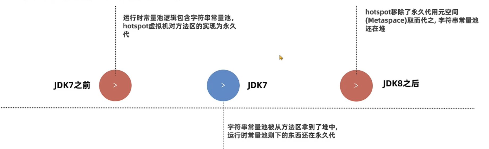


**é¢è¯•é¢˜ï¼š**

**案例1 ：**

> Code：
>
> ```java
> public static void main(String[] args) {
>         // 字符串常é‡æ± 
>         String string1 = "123";
>         String string2 = "456";
>         String string3 = "123456";
>         String string4 = string1 + string2;
>         // false
>         System.out.println(string1 == string4);
>         // true 比较的是值
>         System.out.println(string3.equals(string4));
>     }
> ```
>
> 对应的字节ç ï¼š
>
> > ä»å­—节ç å†…容（ **9 new #5 <java/lang/StringBuilder>**）å¯ä»¥çœ‹åˆ° 字符串相加，**底层是new了一个StringBuilder，然å调用了append方法的**
> >
> > 所以相加的字符串是一个new出æ¥çš„对象存在**Heap内存**中的
> >
> > 而String string3 = "123456";是存放在**方法区的字符串常é‡æ± ä¸­**的。
>
> ```
>  0 ldc #2 <123>
>  2 astore_1
>  3 ldc #3 <456>
>  5 astore_2
>  6 ldc #4 <123456>
>  8 astore_3
>  9 new #5 <java/lang/StringBuilder>
> 12 dup
> 13 invokespecial #6 <java/lang/StringBuilder.<init> : ()V>
> 16 aload_1
> 17 invokevirtual #7 <java/lang/StringBuilder.append : (Ljava/lang/String;)Ljava/lang/StringBuilder;>
> 20 aload_2
> ```

**案例2：**

> 通过字节ç æŒ‡ä»¤åˆ†æ如下代ç çš„è¿è¡Œç»“æœï¼š
>
> ```java
>  public static void main(String[] args) {
>         // 字符串常é‡æ± 
>         String string3 = "123456";
>         String string4 = "123" + "456";
>         // true 常é‡ï¼Œåœ¨ç¼–译的时候就直æ¥è¿æ¥
>         System.out.println(string3 == string4);
>     }
> ```
>
> 字节ç ï¼š
>
> ```
>  0 ldc #2 <123456>
>  2 astore_1
>  3 ldc #2 <123456>
>  5 astore_2
>  6 getstatic #3 <java/lang/System.out : Ljava/io/PrintStream;>
>  9 aload_1
> 10 aload_2
> 11 if_acmpne 18 (+7)
> 14 iconst_1
> 15 goto 19 (+4)
> 18 iconst_0
> 19 invokevirtual #4 <java/io/PrintStream.println : (Z)V>
> 22 return
> ```
>
> **都是存在Method Area中的字符串常é‡æ± ä¸­ã€‚**


###### **Intern学习**

- **String.intern()方法是å¯ä»¥æ‰‹åŠ¨å°†å­—符串放到常é‡æ± ä¸­**

  > JDK7以å
  >
  > ```java
  >   public static void main(String[] args) {
  >         String s1 = new StringBuilder().append("think").append("123").toString();
  >         // 会把对象的引用放到常é‡æ± é‡Œé¢
  >         System.out.println(s1.intern() == s1);
  >         // 内存中有这个关键字是Java
  >         String s2 = new StringBuilder().append("ja").append("va").toString();
  >         System.out.println(s2.intern() == s2);
  >     }
  > ```
  >
  > JDK6的结æœæ˜¯falseã€false，JDK8中是trueã€false（内存中有这个关键字是Java导致ä¸ç›¸ç­‰ï¼‰
  >
  > > JDK7åŠä¹‹å的版本出由äºå­—符串常é‡æ± åœ¨å †ä¸Šï¼Œæ‰€ä»¥**intern() **方法会把第一次é‡åˆ°çš„字符串的引用放到字符串常é‡æ± ä¸­
  > >
  > > **7以å的版本 intern方法ä¿å­˜çš„是对象的引用**
  > >
  > > 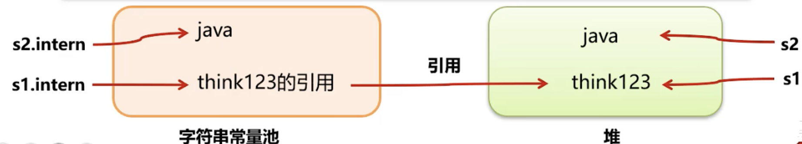

问题

é™æ€å˜é‡å­˜åœ¨å“ªé‡Œï¼Ÿ

- JDK6åŠä¹‹å‰çš„版本中，é™æ€å˜é‡æ—¶å­˜æ”¾åœ¨æ–¹æ³•åŒºä¸­ï¼Œä¹Ÿå°±æ˜¯æ°¸ä¹…代

  > 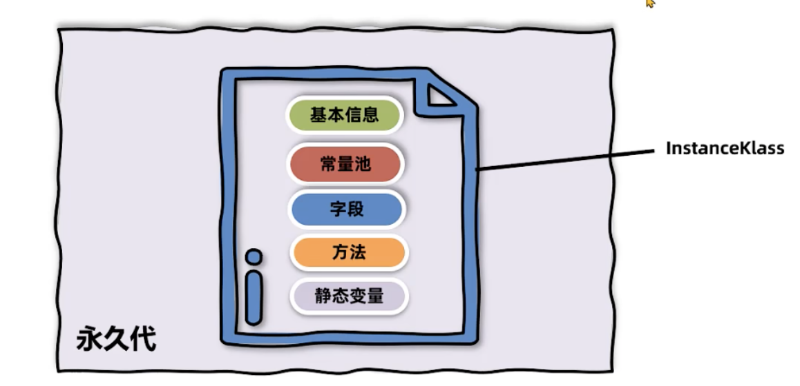

- JDK7åŠä¹‹å的版本中，é™æ€å˜é‡æ—¶å­˜æ”¾Heap中的Class对象中，脱离了永久代。

  > 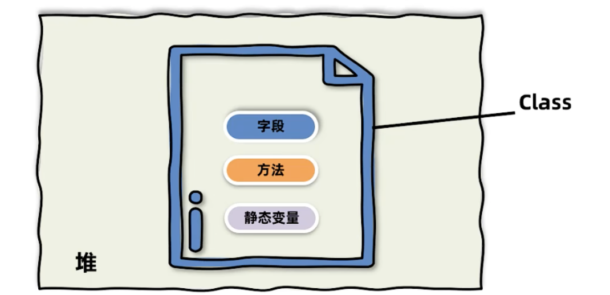


#### 5）直æ¥å†…存（ä¸å±äºJVM）

- ç›´æ¥å†…存（Direct Memory）并ä¸å†ã€ŠJava虚拟机规范》中存在，所以并ä¸å±äºJavaè¿è¡Œæ—¶çš„内存区域。在JDK1.4中引入了NIO机制，使用了直æ¥å†…存，主è¦æ˜¯ä¸ºäº†è§£å†³ä»¥ä¸‹ä¸¤ä¸ªé—®é¢˜ï¼š

  1. Java堆中的对象如æœä¸å†ä½¿ç”¨è¦å›æ”¶ï¼Œå›æ”¶æ—¶ä¼šå½±å“对象的创建和使用。
  2. IOæ“作比如读文件，需è¦å…ˆæŠŠæ–‡ä»¶è¯»å…¥ç›´æ¥å†…存（缓冲区Buffer）å†æŠŠæ•°æ®èµ‹å€¼åˆ°Java堆中。ç°åœ¨ç›´æ¥æ”¾å…¥ç›´æ¥å†…å­˜å³å¯ï¼ŒåŒæ—¶Java堆上维护直æ¥å†…存的引用，å‡å°‘了数æ®èµ‹å€¼çš„开销。写文件也是类似的æ€è·¯ã€‚

  

使用直æ¥å†…存：

> ```java
>   int size = 1024 * 1024 * 9;
>         ByteBuffer bufferAllocator = ByteBuffer.allocateDirect(size);
> ```
>
> 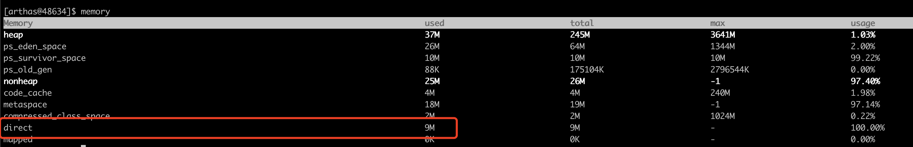

调整直æ¥å†…存：

- 如æœéœ€è¦æ‰‹åŠ¨è°ƒæ•´ç›´æ¥å†…存的大å°ï¼Œå¯ä»¥ä½¿ç”¨-XX:MaxDirectMemorySize= 大å°å•ä½k或K表示干字节，m或M表示兆字节，g或G表示干兆字节。默认ä¸è®¾ç½®è¯¥å‚数情况下，JVM 自动选择最分é…的大å°ã€‚


#### **6）é¢è¯•é¢˜ 总结**

- Java的内存分æˆå‡ éƒ¨åˆ†ï¼Ÿå“ªäº›éƒ¨åˆ†ä¼šå†…存溢出？详细介ç»ä¸€ä¸‹å§

  > **程åºè®¡æ•°å™¨**，内存ä¸ä¼šæº¢å‡ºï¼Œä¿å­˜ç¨‹åºè¿è¡Œä¸‹ä¸€æ­¥æ‰€éœ€æŒ‡ä»¤**----线程独有**
  >
  > **æ ˆStack**，内存会溢出 ä¿å­˜ä¸€äº›æ ˆå¸§æ•°æ®ï¼Œå±€éƒ¨å˜é‡è¡¨**----线程独有**
  >
  > **本地方法栈**，native栈**----线程独有**
  >
  > **å †Heap**，会内存溢出，创建的对象信æ¯éƒ½ä¿å­˜åœ¨å †å°çº¢**----线程共享**
  >
  > **方法区 Method Area**，内存会溢出，有字符串常é‡æ± ï¼Œç±»çš„元信æ¯ï¼Œè¿è¡Œå¸¸é‡æ± **----线程共享**
  >
  > 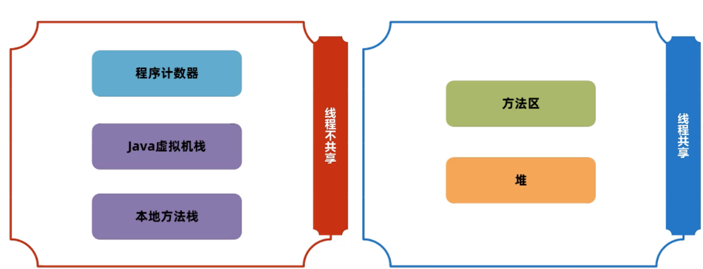

- JDK7å’ŒJDK8在内存结æ„上的区别是什么？


> **JDK8是方法区和堆，JDK7是堆包å«äº†æ–¹æ³•åŒºï¼ˆæ°¸ä¹…代）和字符串常é‡æ± **
>
> 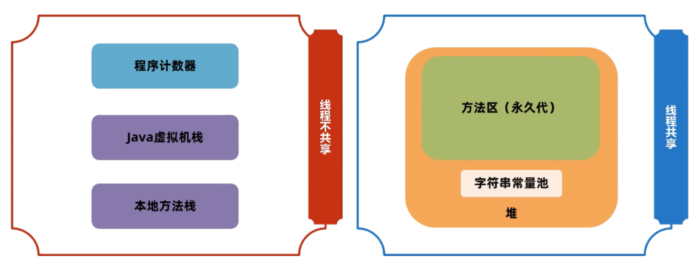


---


## 4.JVMçš„åƒåœ¾å›æ”¶

- Java中为了简化对象的释放，引入了自动的åƒåœ¾å›æ”¶ (Garbage Collection简称GC) 机制。通过åƒåœ¾å›æ”¶å™¨æ¥å¯¹ä¸å†ä½¿ç”¨çš„对象完æˆè‡ªåŠ¨çš„å›æ”¶ï¼Œåƒåœ¾å›æ”¶å™¨ä¸»è¦è´Ÿè´£å¯¹å †ä¸Šçš„内存进行å›æ”¶ã€‚其他很多ç°ä»£è¯­è¨€æ¯”如C#ã€Pythonã€Go都拥有自己的åƒåœ¾å›æ”¶å™¨

  > 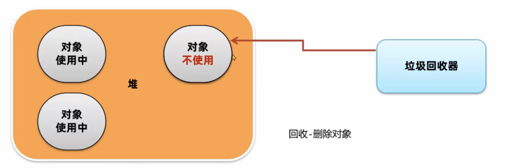
  >
  > 

应用场景：

- 解决系统僵死的问题

  > 大å‚的系统出ç°çš„许多系统僵死问题都ä¸é¢‘ç¹çš„åƒåœ¾å›æ”¶æœ‰å…³

- 性能优化

  > 对åƒåœ¾å›æ”¶å™¨è¿›è¡Œåˆç†çš„设置å¯ä»¥æœ‰æ•ˆåœ°æå‡ç¨‹åºçš„执行性能

- 高频é¢è¯•é¢˜

> - 常è§çš„åƒåœ¾å›æ”¶å™¨
> - 常è§çš„åƒåœ¾å›æ”¶ç®—法
> - å››ç§å¼•ç”¨
> - 项目中用了哪一ç§åƒåœ¾å›æ”¶å™¨


### 方法区的å›æ”¶

- 方法区中能å›æ”¶çš„内容主è¦å°±æ˜¯ä¸å†ä½¿ç”¨çš„类。

判定一个类å¯ä»¥è¢«å¸è½½ã€‚需è¦åŒæ—¶æ»¡è¶³ä¸‹é¢ä¸‰ä¸ªæ¡ä»¶ï¼š

1. **此类所有å®ä¾‹å¯¹è±¡éƒ½å·²ç»è¢«å›æ”¶ï¼Œåœ¨å †ä¸­ä¸å­˜åœ¨ä»»ä½•è¯¥ç±»çš„å®ä¾‹å¯¹è±¡ä»¥åŠå­ç±»å¯¹è±¡ã€‚**

   > ```java
   > Class<?> aClass = classLoader.loadClass("xxxxxxx.xxxx");
   >         Object o = aClass.newInstance();
   >         o=null;
   > ```

2. **加载该类的类加载器已ç»è¢«å›æ”¶**

   > ```java
   > ClassLoader classLoader = XXXX.class.getClassLoader();
   >         classLoader=null;
   > ```

3. **该类对应的java.lang.Class对象没有在任何地方被引用。**

   > ```java
   > 
   >         Class<?> aClass = classLoader.loadClass("xxxxxxx.xxxx");
   >         aClass =null;
   > ```

- 方法区的内存å¯ä»¥æ‰‹åŠ¨è§¦å‘å›æ”¶

  > - 如æœéœ€è¦æ‰‹åŠ¨è§¦å‘åƒåœ¾å›æ”¶ï¼Œå¯ä»¥è°ƒç”¨System.gc()方法
  > - 语法: System.gc()
  > - 注æ„事项:
  >   调用System,gc()方法并ä¸ä¸€å®šä¼šç«‹å³å›æ”¶åƒåœ¾ï¼Œä»…仅是å‘Java虚拟机å‘é€ä¸€ä¸ªåƒåœ¾å›æ”¶çš„请求，具体是å¦éœ€è¦æ‰§è¡Œåƒåœ¾å›æ”¶Java虚拟机会自行判断。

Tips🌟🌟：

> å¼€å‘中此类场景一般很少出ç°ï¼Œä¸»è¦åœ¨å¦‚ OSGiã€JSP 的热部署等应用场景中æ¯ä¸ªjsp文件对应一个唯一的类加载器，当一个jsp文件修改了，就直æ¥å¸è½½è¿™ä¸ªjsp类加载器。é‡æ–°åˆ›å»ºç±»åŠ è½½å™¨ï¼Œé‡æ–°åŠ è½½jsp文件


### å †å›æ”¶

- 如何判断Heap上的对象å¯ä»¥å›æ”¶ï¼Ÿ

  > Java中的对象是å¦èƒ½è¢«å›æ”¶ï¼Œæ˜¯æ ¹æ®å¯¹è±¡æ˜¯å¦è¢«å¼•ç”¨æ¥å†³å®šçš„。如æœå¯¹è±¡è¢«å¼•ç”¨æ¥ï¼Œè¯´æ˜è¯¥å¯¹è±¡è¿˜åœ¨ä½¿ç”¨ï¼Œä¸å…许被å›æ”¶ã€‚
  >
  > 
  >
  > 如æœåœ¨main方法中最å执行a1=null，b1=null，是å¦èƒ½å›æ”¶Aå’ŒB对象呢？
  >
  > å¯ä»¥å›æ”¶ï¼Œæ–¹æ³•ä¸­å·²ç»æ²¡æœ‰åŠæ³•ä½¿ç”¨å¼•ç”¨åŒºè®¿é—®Aå’ŒB对象æ¥ã€‚


#### 引用计数器法和å¯è¾¾æ€§åˆ†æ法

##### **引用计数器法**

**引用计数法**会为æ¯ä¸ªå¯¹è±¡ç»´æŠ¤ä¸€ä¸ªå¼•ç”¨è®¡æ•°å™¨ï¼Œå½“对象被引用时加1，å–消引用时å‡1。


**引用计数器法的缺点-循ç¯å¼•ç”¨**

引用计数器法的优点是å®ç°ç®€å•ï¼ŒC++中的智能指针就采用了引用计数法，但是它也存在缺点，主è¦æœ‰ä¸¤ç‚¹ï¼š

1. æ¯æ¬¡å¼•ç”¨å’Œå–消引用都需è¦ç»´æŠ¤è®¡æ•°å™¨ï¼Œå¯¹ç³»ç»Ÿæ€§èƒ½ä¼šæœ‰ä¸€å®šçš„å½±å“
2. 存在循ç¯å¼•ç”¨é—®é¢˜ï¼Œæ‰€è°“循ç¯å¾ªå¼•ç”¨å°±æ˜¯å½“A引用B，BåŒæ—¶å¼•ç”¨A时会出ç°å¯¹è±¡æ— æ³•å›æ”¶çš„问题。


查看åƒåœ¾å›æ”¶æ—¥å¿—

- å¯ä»¥ä½¿ç”¨verbose:gcå‚æ•°
- 语法：-verbose:gc

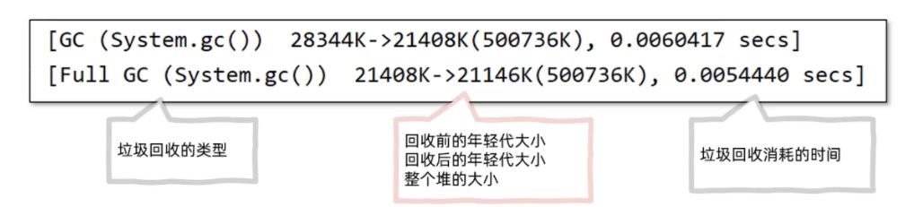


##### å¯è¾¾æ€§åˆ†æ算法

Java使用的是**å¯è¾¾æ€§åˆ†æ算法**æ¥åˆ¤æ–­å¯¹è±¡æ˜¯å¦å¯ä»¥è¢«å›æ”¶ã€‚å¯è¾¾æ€§åˆ†æ将对象分为两类: **åƒåœ¾å›æ”¶çš„根对象(GCRoot)**å’Œ**普通对象**，对象ä¸å¯¹è±¡ä¹‹é—´å­˜åœ¨å¼•ç”¨å…³ç³»

下图A到Bå†åˆ°Cå’ŒD，形æˆäº†ä¸€ä¸ªå¼•ç”¨é“¾ï¼Œå¯è¾¾æ€§åˆ†æ算法指的是如æœä»æŸä¸ªåˆ°æŸä¸ªGC Root对象是å¯è¾¾çš„，对象就ä¸å¯è¢«å›æ”¶ã€‚

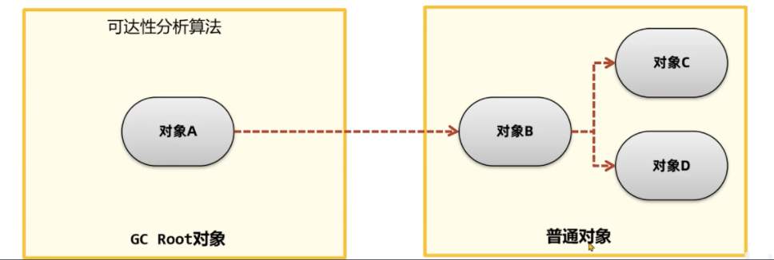

**哪些对象被称之为GC Root对象呢？**

- 线程Thread对象

- 系统类加载器加载的java.lang.Class对象

  > 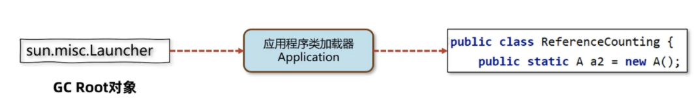

- 监视器对象，用æ¥ä¿å­˜åŒæ­¥é”synchronized关键字æŒæœ‰çš„对象

  > **this当å‰å¯¹è±¡**
  >
  > 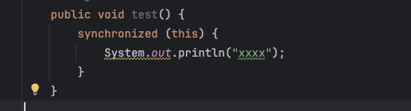

- 本地方法调用时使用的全局对象


> 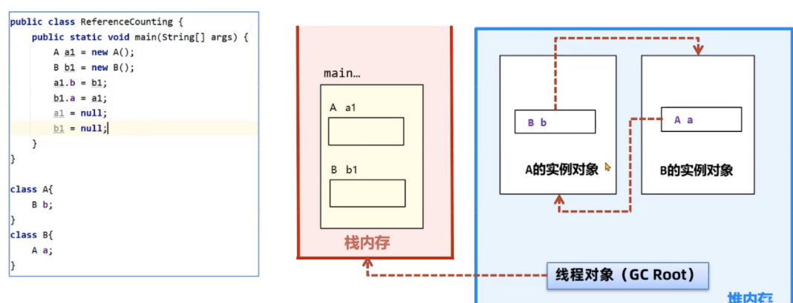
>
> 如æœæŠŠa1å’Œb1都设置为null，那么这些都会被å›æ”¶â™»ï¸


**查看GC Root**

通过arthaså’Œeclipse Memory Analyzer (MAT) 工具å¯ä»¥æŸ¥çœ‹GC Root，MAT具是eclipseæ¨å‡ºçš„Java堆内存检测工具。具体æ“作步骤如下:

1. **使用arthasçš„heapdump命令将堆内存快照ä¿å­˜åˆ°æœ¬åœ°ç£ç›˜ä¸­**

   > 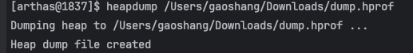

2. **使用MAT工具打开堆内存快照文件。**

   > 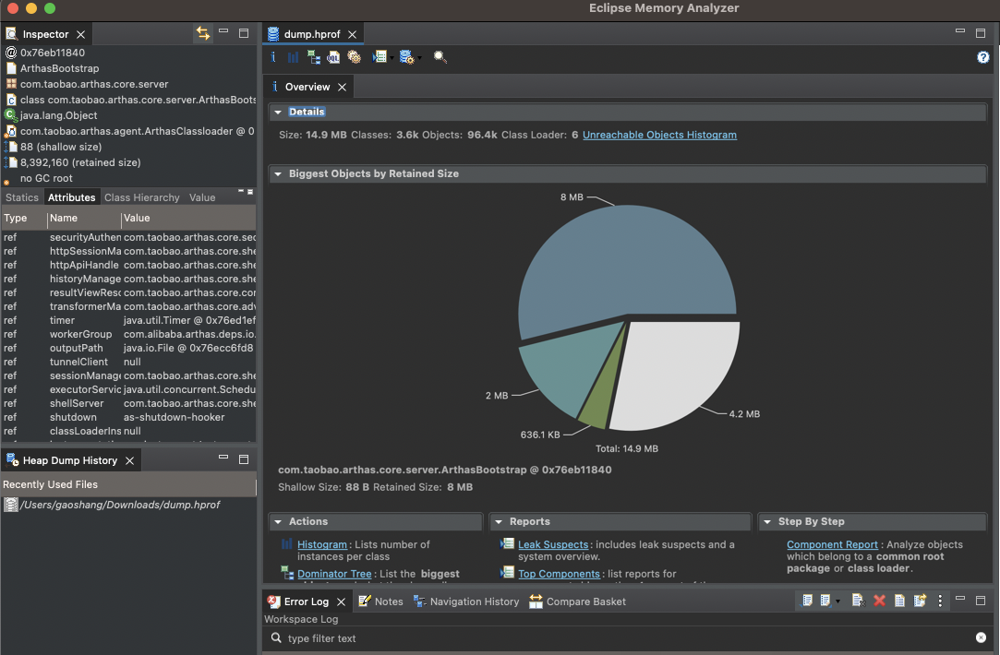
   >
   > 

3. **选择GC Roots功能查看所有的GC Root**

   > 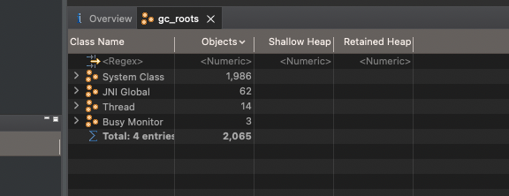
   >
   > 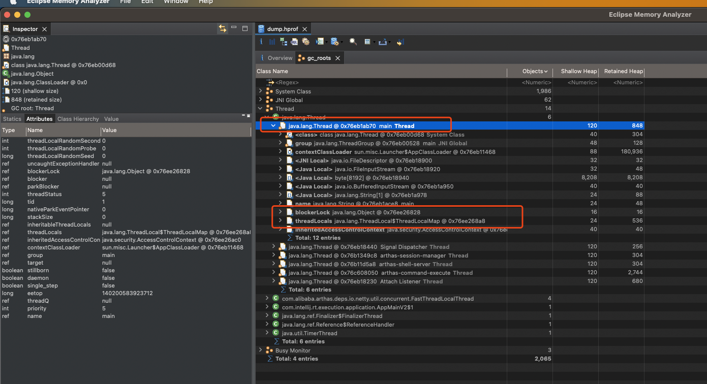


#### 五ç§å¯¹è±¡å¼•ç”¨

å¯è¾¾æ€§ç®—法中æ述的对象引用，一般指的是强引用，å³æ˜¯GCRoot对象对普通对象有引用关系，åªè¦è¿™å±‚关系存在，普通对象就ä¸ä¼šè¢«å›æ”¶ã€‚

##### 强引用

> å¯è¾¾æ€§ç®—法中æ述的对象引用，一般指的是强引用


##### 软引用

>  软引用相对äºå¼ºå¼•ç”¨æ˜¯ä¸€ç§æ¯”较弱的引用关系，如æœä¸€ä¸ªå¯¹è±¡åªæœ‰è½¯å¼•ç”¨å…³è”到它，**当程åºå†…å­˜ä¸è¶³æ—¶ï¼Œå°±ä¼šå°†è½¯å¼•ç”¨ä¸­çš„æ•°æ®è¿›è¡Œå›æ”¶ã€‚**
>
> 在JDK1.2版之åæ供了SoftReferenceç±»æ¥å®ç°è½¯å¼•ç”¨ï¼Œè½¯å¼•ç”¨å¸¸ç”¨äºç¼“存中。
>
> 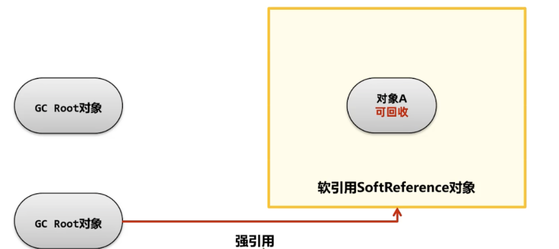

软引用的执行过程：

1. 将对象使用软引用包装起æ¥ï¼Œ**new SoftReference<对象类å‹>(对象);**

   > ```java
   > byte[] byteArray = new byte[1024 * 1024 * 100];
   > SoftReference<byte[]> softReference = new SoftReference<>(byteArray);
   > ```

2. 内存ä¸è¶³æ—¶ï¼Œè™šæ‹Ÿæœºå°è¯•è¿›è¡Œåƒåœ¾å›æ”¶ã€‚

3. 如æœåƒåœ¾å›æ”¶ä»ä¸èƒ½è§£å†³å†…å­˜ä¸è¶³çš„问题，å›æ”¶è½¯å¼•ç”¨ä¸­çš„对象

4. 如æœä¾ç„¶å†…å­˜ä¸è¶³ï¼ŒæŠ›å‡ºOutOfMemory异常。

   > **设置堆最大内存为-Xms400m**

   > ```java
   > public static void main(String[] args) throws IOException {
   >         byte[] byteArray = new byte[1024 * 1024 * 100];
   >         SoftReference<byte[]> softReference = new SoftReference<>(byteArray);
   >         byteArray = null;
   >         // 输出一个对象
   >         System.out.println(softReference.get());
   >         System.in.read();
   >         byte[] bytes1 = new byte[1024 * 1024 * 200];
   >         SoftReference<byte[]> softReference1 = new SoftReference<byte[]>(bytes1);
   >         // 输出null
   >         System.out.println(softReference.get());
   >     }
   > ```

> 执行结æœï¼š
>
> 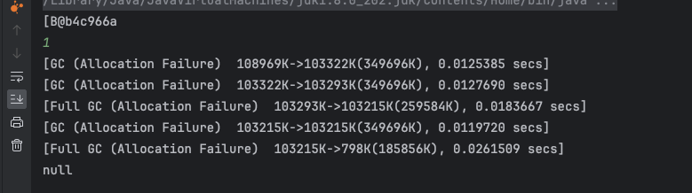

软引用中的对象如æœåœ¨å†…å­˜ä¸è¶³æ—¶å›æ”¶ï¼Œ**SoftReference对象本身也需è¦è¢«å›æ”¶**。如何知é“哪些SoftReference对象需è¦å›æ”¶å‘¢?

**SoftReference**æ供了一套队列机制：

1. 软引用创建时，通过æ„造器传入引用队列

2. 在软引用中包å«çš„对象被å›æ”¶æ—¶ï¼Œè¯¥è½¯å¼•ç”¨å¯¹è±¡ä¼šè¢«æ”¾å…¥å¼•ç”¨é˜Ÿåˆ—中

   > 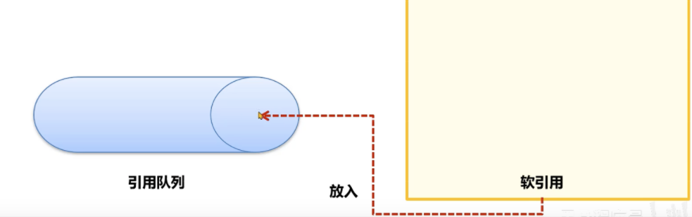

3. 通过代ç ä¾¿åˆ©å¼•ç”¨é˜Ÿåˆ—，将SoftReference的强引用删除

   > **设置堆内存为200m 最大能存放一个100m的byte数组**

   > ```java
   > public static void main(String[] args) throws IOException {
   >     ReferenceQueue<byte[]> referenceQueue = new ReferenceQueue<>();
   >     ArrayList<SoftReference<byte[]>> softReferences = new ArrayList<>();
   >     for (int i = 0; i < 10; i++) {
   >         byte[] byteArray = new byte[1024 * 1024 * 100];
   >         SoftReference<byte[]> softReference = new SoftReference<>(byteArray, referenceQueue);
   >         softReferences.add(softReference);
   >     }
   >     System.in.read();
   >     int count = 0;
   >     while (referenceQueue.poll() != null) {
   >         count++;
   >     }
   >     System.out.println(count);
   > }
   > ```

> 最终打å°çš„结æœä¸º9，æ¯ä¸€æ¬¡é‡Šæ”¾è½¯å¼•ç”¨å†…存，然å在é‡æ–°æ–°å¢ä¸€ä¸ªè¿›å»ï¼Œå¾ªç¯å次，那么最终空的软应用对象为9个，其中一个还没释放内存，软引用对象还是强引用。

软应用也å¯ä»¥ä½¿ç”¨ç»§æ‰¿è‡ªSoftReference类的方å¼æ¥å®ç°ï¼ŒStudentRef类就是一个软引用。通过æ„造器传入软引用包å«çš„对象，已ç»å¼•ç”¨é˜Ÿåˆ—。

> ```java
> class StringRef extends SoftReference<String>{
> 
>     public StringRef(String referent) {
>         super(referent);
>     }
>     public StringRef(String referent, ReferenceQueue<? super String> q) {
>         super(referent, q);
>     }
> }
> ```


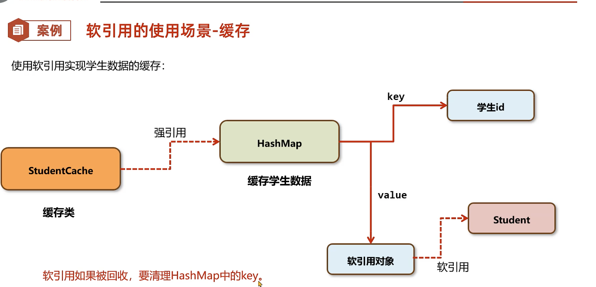

 


##### 弱引用

> 弱引用的整体机制和软引用基本一致，区别在äºå¼±å¼•ç”¨åŒ…å«çš„对象在åƒåœ¾å›æ”¶æ—¶ï¼Œä¸**管内存够ä¸å¤Ÿéƒ½ä¼šç›´æ¥è¢«å›æ”¶ã€‚**
>
> 在JDK 1.2版之åæ供了WeakReferenceç±»æ¥å®ç°å¼±å¼•ç”¨ï¼Œå¼±å¼•ç”¨ä¸»è¦åœ¨ThreadLocal中使用。
>
> 弱引用对象本身也å¯ä»¥ä½¿ç”¨å¼•ç”¨é˜Ÿåˆ—进行å›æ”¶
>
> 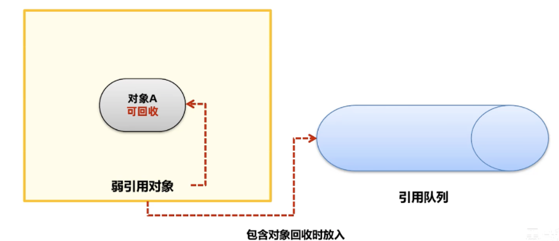

> 设置堆最大内存为200m
>
> ```java
> public static void main(String[] args) throws IOException {
>         byte[] byteArray = new byte[1024 * 1024 * 100];
>         WeakReference<byte[]> reference = new WeakReference<>(byteArray);
>         byteArray = null;
>         System.out.println(reference.get());
>         System.gc();
>         System.out.println(reference.get());
>     }
> ```


##### 虚引用

在常规开å‘中是ä¸ä¼šä½¿ç”¨çš„

> **虚引用**也å«**å¹½çµå¼•ç”¨/幻影引用**，**ä¸èƒ½é€šè¿‡è™šå¼•ç”¨å¯¹è±¡è·å–到包å«çš„对象**。**虚引用唯一的用途是当对象被åƒåœ¾å›æ”¶å™¨å›æ”¶æ—¶å¯ä»¥æ¥æ”¶åˆ°å¯¹åº”的通知**。Java中使用**PhantomReference**å®ç°äº†è™šå¼•ç”¨ï¼Œç›´æ¥å†…存中为了åŠæ—¶çŸ¥é“ç›´æ¥å†…存对象ä¸å†ä½¿ç”¨ï¼Œä»è€Œå›æ”¶å†…存，使用了虚引用æ¥å®ç°ã€‚


##### 终结器引用

在常规开å‘中是ä¸ä¼šä½¿ç”¨çš„

> 终结器引用指的是在对象需è¦è¢«å›æ”¶æ—¶ï¼Œ**对象将会被放置在Finalizer类中的引用队列中，并在ç¨å由一æ¡ç”±FinalizerThread线程ä»é˜Ÿåˆ—中è·å–对象，然å执行对象的finalize方法**。在这个过程中å¯ä»¥åœ¨finalize方法中å†å°†è‡ªèº«å¯¹è±¡ä½¿ç”¨å¼ºå¼•ç”¨å…³è”上，但是ä¸å»ºè®®è¿™æ ·åšï¼Œå¦‚æœè€—时过长会影å“其他对象的å›æ”¶ã€‚
>
> 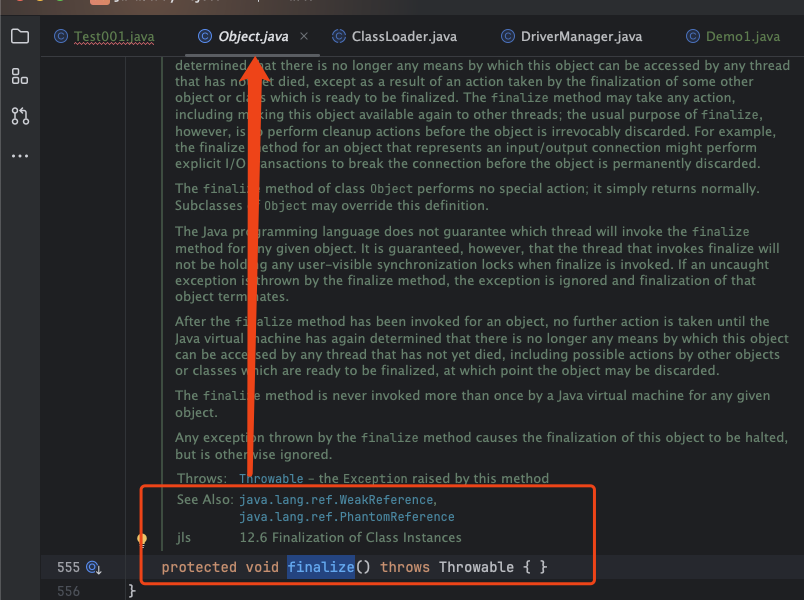

---


#### åƒåœ¾å›æ”¶ç®—法

- Java是如何å®ç°åƒåœ¾å›æ”¶çš„呢？简å•æ¥è¯´ï¼Œåƒåœ¾å›æ”¶è¦åšçš„有两件事情：
  1. 找到内存中存活的对象
  2. 释放ä¸å†å­˜æ´»å¯¹è±¡çš„内存，使得程åºèƒ½å†æ¬¡åˆ©ç”¨è¿™éƒ¨åˆ†ç©ºé—´


##### å†å²å’Œåˆ†ç±»

- 1960å¹´John McCarthyå‘布了第一个GC算法: **标记-清除算法**

- 1963å¹´Marvin L.Minsky å‘布了**å¤åˆ¶ç®—法**。

  > 本质上å续所有的åƒåœ¾å›æ”¶ç®—法，都是在上述两ç§ç®—法的基础上优化而æ¥ã€‚
  >
  > 


##### åƒåœ¾å›æ”¶ç®—法的评价标准

> Javaåƒåœ¾å›æ”¶è¿‡ç¨‹ä¼šé€šè¿‡å•ç‹¬çš„GC线程æ¥å®Œæˆï¼Œä½†æ˜¯ä¸ç®¡ä½¿ç”¨å“ªä¸€ç§GC算法，都会有部分阶段需è¦åœæ­¢æ‰€æœ‰çš„用户线程。这个过程被称之为**Stop The World**简称**STW**，如æœSTW时间过长则会影å“用户的使用。
>
> 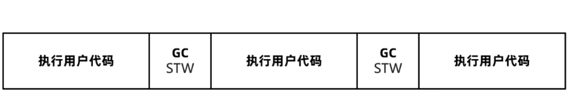

判断GC算法是å¦ä¼˜ç§€ï¼Œå¯ä»¥ä»ä¸‰ä¸ªæ–¹é¢æ¥è€ƒè™‘：

- **ååé‡TPS**

  > ååé‡æŒ‡çš„是 CPU 用äºæ‰§è¡Œç”¨æˆ·ä»£ç çš„æ—¶é—´ä¸ CPU 总执行时间的比值，å³**ååé‡ = 执行用户代ç æ—¶é—´(执行用户代ç æ—¶é—´ + GC时间)**。ååé‡æ•°å€¼è¶Šé«˜ï¼Œåƒåœ¾å›æ”¶çš„效ç‡å°±è¶Šé«˜ã€‚
  >
  > 比如: 虚拟机总共è¿è¡Œäº† 100 分钟，其中GCèŠ±æ‰ 1 分钟，那么ååé‡å°±æ˜¯ 99%

- **最大暂åœæ—¶é—´**

  > 最大暂åœæ—¶é—´æŒ‡çš„是所有在åƒåœ¾å›æ”¶è¿‡ç¨‹ä¸­çš„STW时间最大值。比如如下的图中，黄色部分的STW就是最大暂åœæ—¶é—´ï¼Œæ˜¾è€Œæ˜“è§ä¸Šé¢çš„图比下é¢çš„图拥有更少的最大暂åœæ—¶é—´ã€‚最大暂åœæ—¶é—´è¶ŠçŸ­ï¼Œç”¨æˆ·ä½¿ç”¨ç³»ç»Ÿæ—¶å—到的影å“就越短。
  >
  > 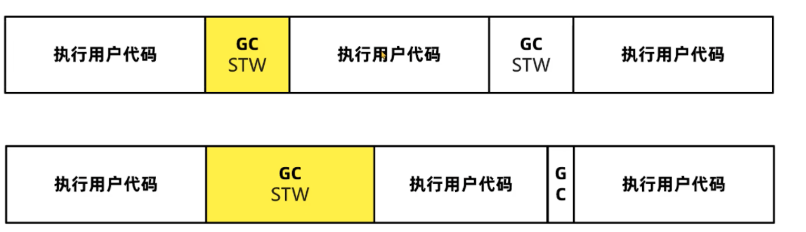

- **堆使用效ç‡**

  > ä¸åŒåƒåœ¾å›æ”¶ç®—法，对堆内存的使用方å¼æ˜¯ä¸åŒçš„。比如标记清除算法，å¯ä»¥ä½¿ç”¨å®Œæ•´çš„堆内存。而å¤åˆ¶ç®—法会将堆内存一分为二，æ¯æ¬¡åªèƒ½ä½¿ç”¨ä¸€åŠå†…存。ä»å †ä½¿ç”¨æ•ˆç‡ä¸Šæ¥è¯´ï¼Œæ ‡è®°æ¸…除算法è¦ä¼˜äºå¤åˆ¶ç®—法.
  >
  > 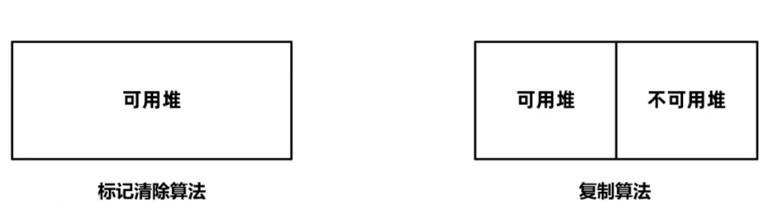

**总结：**

> 上述三ç§è¯„价标准:堆使用效ç‡ã€ååé‡ï¼Œä»¥åŠæœ€å¤§æš‚åœæ—¶é—´ä¸å¯å…¼å¾—般æ¥è¯´ï¼Œå †å†…存越大，最大暂åœæ—¶é—´å°±è¶Šé•¿ã€‚想è¦å‡å°‘最大暂åœæ—¶é—´ï¼Œå°±ä¼šé™ä½ååé‡.
>
> **ä¸åŒçš„åƒåœ¾å›æ”¶ç®—法，适用äºä¸åŒçš„场景**


##### 标记清除算法

标记清除算法的核心æ€æƒ³åˆ†ä¸ºä¸¤ä¸ªé˜¶æ®µï¼š

1. 标记阶段，将所有存活的对象进行标记。Java中使用å¯è¾¾æ€§åˆ†æ算法，ä»GC Root开始通过引用链éå†å‡ºæ‰€æœ‰å­˜æ´»å¯¹è±¡ã€‚
2. 清除阶段，ä»å†…存中删除没有被标记也就是é存活对象。

**优点：**

> å®ç°ç®€å•ï¼Œåªéœ€è¦åœ¨ç¬¬ä¸€é˜¶æ®µç»™æ¯ä¸ªå¯¹è±¡ç»´æŠ¤æ ‡å¿—ä½ï¼Œç¬¬äºŒé˜¶æ®µåˆ é™¤å¯¹è±¡å³å¯.

**缺点：**

> 1. **ç¢ç‰‡åŒ–问题**
>
>    > ç”±äº**内存是è¿ç»­çš„**，所以在对象被删除之å，内存中会出ç°å¾ˆå¤šç»†å°çš„å¯ç”¨å†…å­˜å•å…ƒã€‚如æœæˆ‘们需è¦çš„是个比较大的空间，很有å¯èƒ½è¿™äº›å†…å­˜å•å…ƒçš„大å°è¿‡å°æ— æ³•è¿›è¡Œåˆ†é…
>    >
>    > 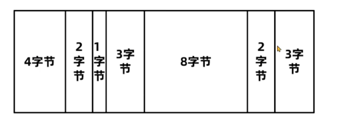
>    >
>    > 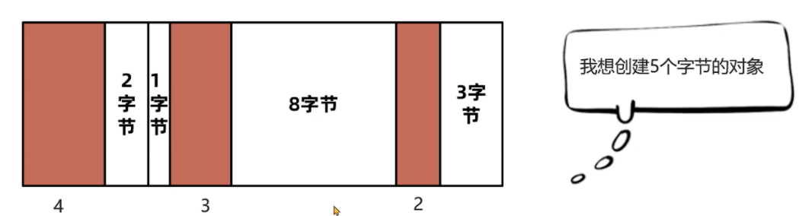
>
> 2. 分é…速度慢。
>
>    > ç”±äºå†…å­˜ç¢ç‰‡çš„存在，需è¦ç»´æŠ¤ä¸€ä¸ª**空闲链表**，**æ有å¯èƒ½å‘生æ¯æ¬¡éœ€è¦éå†åˆ°é“¾è¡¨çš„最åæ‰èƒ½è·å¾—åˆé€‚的内存空间**。
>    >
>    > 


##### å¤åˆ¶ç®—法

核心æ€æƒ³ä¸ºï¼š

1. 准备两å—空间From空间和To空间，æ¯æ¬¡åœ¨åˆ†é…对象阶段，åªèƒ½ä½¿ç”¨å…¶ä¸­ä¸€å—空间（From空间）。
2. 在åƒåœ¾å›æ”¶GC阶段，将From中存活对象å¤åˆ¶åˆ°To空间。
3. 将两å—空间的Fromå’ŒToå字互æ¢ã€‚

**完整的å¤åˆ¶ç®—法的例å­ï¼š**

1. 将堆内存分割æˆä¸¤å—**From空间ã€To空间**，对象分é…阶段，创建对象。

2. GC阶段开始，**å°†GC Rootæ¬è¿åˆ°To空间**

3. å°†**GC Rootå…³è”的对象，æ¬è¿åˆ°To空间**

4. **清ç†From空间**，并把å称互æ¢

   > 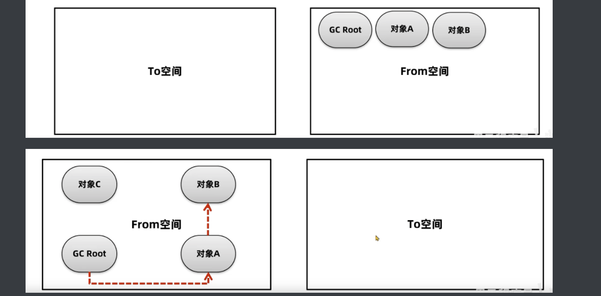

**优点：**

> 1. **ååé‡é«˜**
>
>    > å¤åˆ¶ç®—法åªéœ€è¦éå†ä¸€æ¬¡å­˜æ´»å¯¹è±¡å¤åˆ¶åˆ°To空间å³å¯ï¼Œæ¯”标记-æ•´ç†ç®—法少了一次éå†çš„过程，因而性能较好，**但是ä¸å¦‚标记-清除算法，因为标记清除算法ä¸éœ€è¦è¿›è¡Œå¯¹è±¡çš„移动**
>
> 2. **ä¸ä¼šå‘生ç¢ç‰‡åŒ–**
>
>    > å¤åˆ¶ç®—法在å¤åˆ¶ä¹‹å就会将对象按顺åºæ”¾å…¥To空间中，所以对象以外的区域都是å¯ç”¨ç©ºé—´ï¼Œä¸å­˜åœ¨ç¢ç‰‡åŒ–内存空间。

**缺点：**

> **内存使用效ç‡ä½**
>
> > æ¯æ¬¡åªèƒ½è®©ä¸€åŠçš„内存空间æ¥ä¸ºåˆ›å»ºå¯¹è±¡ä½¿ç”¨


##### 标记整ç†ï¼ˆå‹ç¼©ï¼‰ç®—法

> 标记整ç†ç®—法也å«æ ‡è®°å‹ç¼©ç®—法，**是对标记清ç†ç®—法中容易产生内存ç¢ç‰‡é—®é¢˜çš„一ç§è§£å†³æ–¹æ¡ˆ**

核心æ€æƒ³åˆ†ä¸ºä¸¤ä¸ªé˜¶æ®µï¼š

1. 标记阶段，将所有存活的对象进行标记。Java中使用å¯è¾¾æ€§åˆ†æ算法，ä»GC Root开始通过引用链éå†å‡ºæ‰€æœ‰å­˜æ´»å¯¹è±¡ã€‚

2. æ•´ç†é˜¶æ®µï¼Œ**将存活对象移动到堆的一端**。清ç†æ‰å­˜æ´»å¯¹è±¡çš„内存空间。

   > 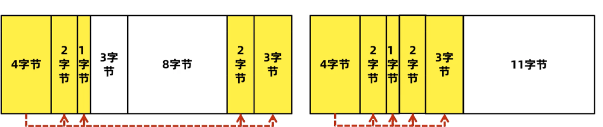
   >
   > **那么就会多出æ¥ä¸€å—完整的内存区域--红色部分**
   >
   > 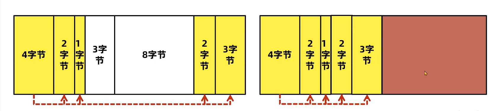


**优点：**

> 1. **内存使用效ç‡é«˜**
>
>    > 整个堆内存都å¯ä»¥ä½¿ç”¨ï¼Œä¸ä¼šåƒå¤åˆ¶ç®—法åªèƒ½ä½¿ç”¨åŠä¸ªå †å†…å­˜
>
> 2. **ä¸ä¼šå‘生ç¢ç‰‡åŒ–**
>
>    > 在整ç†é˜¶æ®µå¯ä»¥å°†å¯¹è±¡å¾€å†…存的一侧进行移动，**剩下的空间都是å¯ä»¥åˆ†é…对象的有效空间**

缺点：

> **æ•´ç†é˜¶æ®µçš„效ç‡ä¸é«˜**
>
> > æ•´ç†ç®—法有很多ç§ï¼Œæ¯”如***Lisp2æ•´ç†ç®—法需è¦å¯¹æ•´ä¸ªå †ä¸­çš„对象æœç´¢3次，整体性能ä¸ä½³ã€‚***å¯ä»¥é€šè¿‡Two-Fingerã€è¡¨æ ¼ç®—法ã€ImmixGc等高效的整ç†ç®—法优化此阶段的性能
>
> 


##### 分代åƒåœ¾å›æ”¶ç®—法

> ç°ä»£ä¼˜ç§€çš„åƒåœ¾å›æ”¶ç®—法，会将上述æè¿°çš„åƒåœ¾å›æ”¶ç®—法组åˆè¿›è¡Œä½¿ç”¨ï¼Œå…¶ä¸­åº”用最广的就是分代åƒåœ¾å›æ”¶ç®—法（Generation GC）。

分代åƒåœ¾å›æ”¶ç®—法将整个内存区域划分为**年轻代**å’Œ**è€å¹´ä»£**：

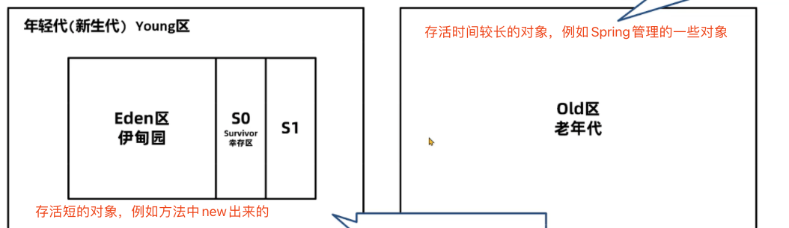


**使用Arthas查看分代之å的内存情况**

- 在JDK8中，添加**-xx:+UseSerialGC**å‚数使用分代å›æ”¶çš„åƒåœ¾å›æ”¶å™¨ï¼Œè¿è¡Œç¨‹åº

- 使用memory命令查看内存情况

  > 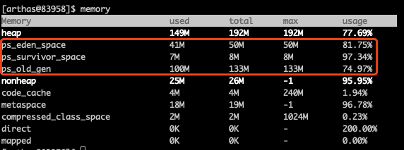

**调整内存区域的大å°**

æ ¹æ®ä»¥ä¸‹è™šæ‹Ÿæœºå‚数，调整堆的大å°å¹¶è§‚察结æœã€‚注æ„加上**-XX:UseSerialGC（串行åƒåœ¾å›æ”¶å™¨ï¼‰**

|                 å‚æ•°å                  |                           å‚æ•°å«ä¹‰                           |                             示例                             |
| :-------------------------------------: | :----------------------------------------------------------: | :----------------------------------------------------------: |
|                  -Xms                   |       设置堆的最å°å’Œåˆå§‹å¤§å°ï¼Œå¿…须是1024å€æ•°ä¸”大äº1MB        | 比如åˆå§‹å¤§å°6MB的写法Xms6291456<br/>Xms6144k<br/>-Xms6m<br/> |
|                  -Xmx                   |        设置最大堆的大å°ï¼Œå¿…须是1024å€æ•°ä¸”大äº2MB<br/>        | 比如最大堆80 MB的写法:<br/>-Xmx83886080<br/>-Xmx81920k<br/>-Xmx80m<br/> |
|                  -Xmn                   |                      新生代的大å°<br/>                       | 新生代256 MB的写法:-Xmn256m<br/>Xmn262144k<br/>-Xmn268435456<br/> |
|         -XX:SurvivorRatio<br/>          | 伊甸园区和幸存区的比例，默认为8<br/>新生代1g内存，伊甸园区800MB,S0å’ŒS1å„100MB<br/> |        比例调整为4的写法:<br/>XX:SurvivorRatio=4<br/>        |
| -XX:+PrintGcDetails<br/>verbose:gc<br/> |                       打å°GC日志<br/>                        |                              æ—                               |

> 观察GCå˜åŒ–
>
> ```java
>  // --XX:+PrintGcDetails  -Xmx60m -Xms60M -XX:+UseSerialGC -XX:SurvivorRatio=3 -Xmn20M
>     public static void main(String[] args) throws IOException {
>         ArrayList<Object> objects = new ArrayList<>();
>         int count = 0;
>         while (true) {
>             System.in.read();
>             byte[] byteArray = new byte[1024 * 1024 * 10];
>             System.out.println(count);
>             objects.add(byteArray);
>             count++;
>         }
>     }
> 
> ```
>
> ```
> Heap
>  def new generation   total 16384K, used 11364K [0x00000007bc400000, 0x00000007bd800000, 0x00000007bd800000)
>   eden space 12288K,  92% used [0x00000007bc400000, 0x00000007bcf19108, 0x00000007bd000000)
>   from space 4096K,   0% used [0x00000007bd000000, 0x00000007bd000000, 0x00000007bd400000)
>   to   space 4096K,   0% used [0x00000007bd400000, 0x00000007bd400000, 0x00000007bd800000)
>  tenured generation   total 40960K, used 30720K [0x00000007bd800000, 0x00000007c0000000, 0x00000007c0000000)
>    the space 40960K,  75% used [0x00000007bd800000, 0x00000007bf600030, 0x00000007bf600200, 0x00000007c0000000)
>  Metaspace       used 3291K, capacity 4496K, committed 4864K, reserved 1056768K
>   class space    used 362K, capacity 388K, committed 512K, reserved 1048576K
> ```
>
> 

**分代GCæµç¨‹**

- 分代å›æ”¶ç®—法å›æ”¶æ—¶ï¼Œåˆ›å»ºå‡ºæ¥çš„对象首先会被放入Eden伊甸园区。

> 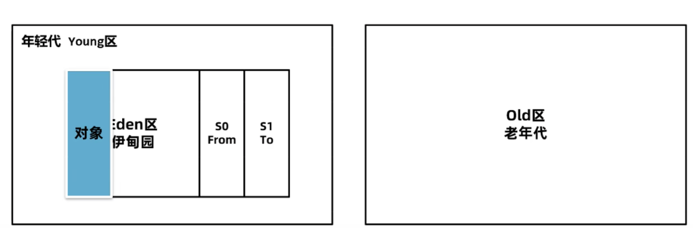

- éšç€å¯¹è±¡åœ¨Eden区越æ¥è¶Šå¤šï¼Œå¦‚æœEden区满了，新创建的对象已ç»æ— æ³•æ”¾å…¥ï¼Œå°±ä¼šè§¦å‘年轻代的GC，称之为Minor GC或者YoungGC。Minor GC会把需è¦eden中和From需è¦å›æ”¶çš„对象å›æ”¶ï¼Œ**把没有å›æ”¶çš„对象放入To区**

> 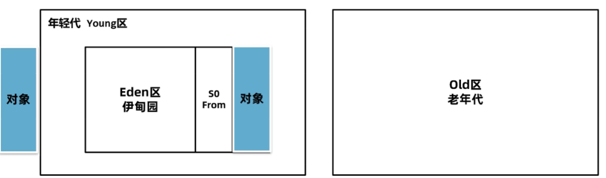

- æ¥ä¸‹æ¥ S0区会å˜æˆTo区，S1å˜æˆFrom区。当eden区满是å†å¾€é‡Œæ”¾å…¥å¯¹è±¡ï¼Œä¾ç„¶ä¼šå‘生Minor GC。

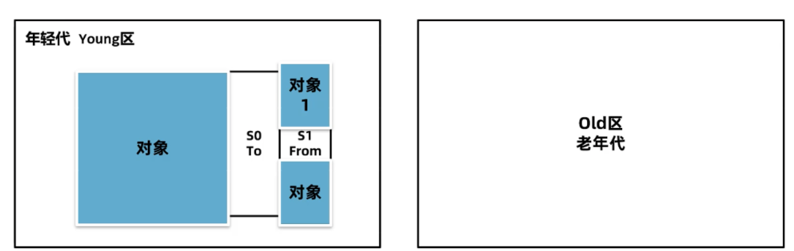

- 此时会å›æ”¶eden区和S1（from）中的对象，并把edenå’Œfrom区中剩余的对象放入S0.

- 注æ„：æ¯æ¬¡MinorGCå都会为对象寄了他的年龄，åˆå§‹å€¼ä¸º0，æ¯æ¬¡GC完加1.

- 如æœMinorGCå对象的年龄达到阀值（最大15，默认值和åƒåœ¾å›æ”¶å™¨æœ‰å…³ï¼Œæœ‰æ—¶å€™å½“young区满了之å，ä¸æ»¡15次也会放入Old区），对象就会被晋å‡è‡³è€å¹´ä»£ã€‚

> 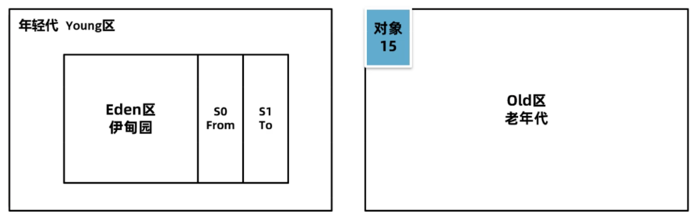

- 当è€å¹´ä»£ä¸­ç©ºé—´ä¸è¶³ï¼Œæ— æ³•æ”¾å…¥æ–°çš„对象时，先å°è¯•minor gc如æœè¿˜æ˜¯ä¸è¶³ï¼Œå°±ä¼šè§¦å‘Full GC，Full GC会对整个堆进行åƒåœ¾å›æ”¶

> 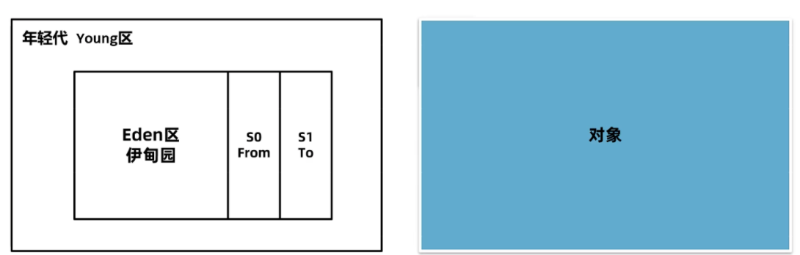
>
> 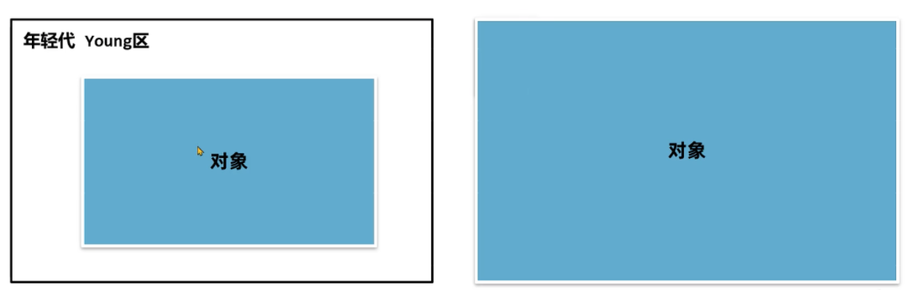


**下图为什么会出ç°OutOf Memory？**

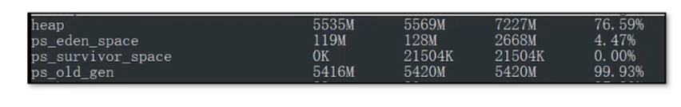

> Full GCå。无法å›æ”¶è€å¹´ä»£**99.93%**，那么继续往Old 区放数æ®ï¼Œé‚£ä¹ˆå°±ä¼šæŠ›å¼‚常。


#### åƒåœ¾å›æ”¶å™¨

**为什么GC算法è¦æŠŠHeap分æˆå¹´è½»ä»£å’Œè€å¹´ä»£ï¼Ÿ**

> - 系统中的大部分对象，都是创建出æ¥ä¹‹å很快就ä¸å†ä½¿ç”¨å¯ä»¥è¢«å›æ”¶ï¼Œå¦‚æœæŸ¥è¯¢æŸæŸæ•°æ®ï¼Œæ•°æ®è¿”å›ä¹‹åå°±å¯ä»¥é‡Šæ”¾äº†ã€‚
> - è€å¹´ä»£ä¸­ä¼šå­˜æ”¾é•¿æœŸå­˜æ´»çš„对象，比如Spring的大部分Bean对象，在程åºå¯åŠ¨ä¹‹åå°±ä¸ä¼šè¢«å›æ”¶äº†ã€‚
> - 在虚拟机的默认设置中，新生代的大å°è¦è¿œå°äºè€å¹´ä»£çš„大å°ã€‚
>
> 1. å¯ä»¥é€šè¿‡è°ƒæ•´Young区域和Old区的比例æ¥é€‚用ä¸åŒç±»å‹çš„应用程åºï¼Œæ高内存的利用效ç‡å’Œæ€§èƒ½
> 2. Young区和Old区使用ä¸åŒçš„åƒåœ¾å›æ”¶ç®—法。Young区一般使用å¤åˆ¶ç®—法，è€å¹´ä»£å¯ä»¥é€‰æ‹©-标记和清除-æ•´ç†ç®—法，由程åºå‘˜æ¥é€‰æ‹©çš„çµæ´»åº¦è¾ƒé«˜
> 3. 分代的设计中å…许åªå›æ”¶Young区（Minor GC），如æœèƒ½æ»¡è¶³å¯¹è±¡åˆ†é…çš„è¦æ±‚å°±ä¸éœ€è¦å¯¹æ•´ä¸ªå †è¿›è¡Œå›æ”¶ï¼ˆFull GC），STWå ç”¨çš„时间就会å‡å°‘。
>
> 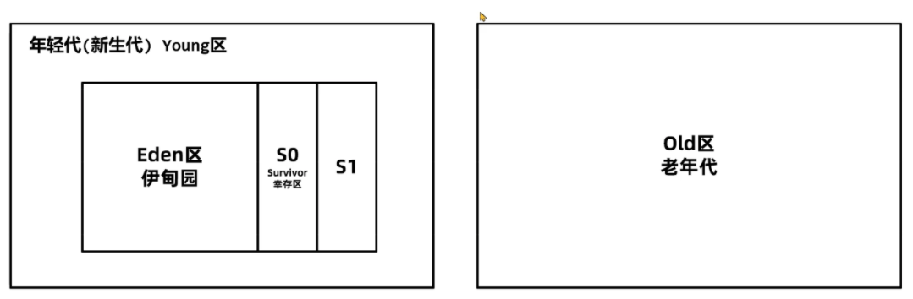


---


##### åƒåœ¾å›æ”¶å™¨çš„组åˆ

åƒåœ¾å›æ”¶å™¨æ˜¯åƒåœ¾å›æ”¶ç®—法的具体å®ç°ã€‚

ç”±äºåƒåœ¾å›æ”¶å™¨åˆ†ä¸ºYoung区和Old区，出了G1之外其他åƒåœ¾å›æ”¶å™¨å¿…é¡»æˆå¯¹ç»„åˆè¿›è¡Œä½¿ç”¨ã€‚

具体的关系图：

> åªæ¨è使用å®çº¿è¿æ¥çš„
>
> 


###### 年轻代-Serialåƒåœ¾å›æ”¶å™¨

>  Serial是一ç§**å•çº¿ç¨‹ä¸²è¡Œ**çš„åƒåœ¾å›æ”¶å™¨
>
> 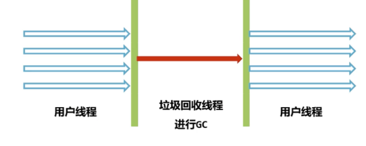
>
> å›æ”¶å¹´ä»£ï¼šå¹´è½»ä»£
>
> å›æ”¶ç®—法：å¤åˆ¶ç®—法
>
> 优点：å•CPU处ç†å™¨ä¸‹ååé‡é常出色
>
> 缺点：多CPU下ååé‡ä¸å¦‚其他åƒåœ¾å›æ”¶å™¨ï¼ŒHeap如æœå大，会让用户线程处äºé•¿æ—¶é—´çš„等待
>
> 使用场景：Java编写的客户端程åºæˆ–者硬件é…置有é™çš„场景


###### è€å¹´ä»£-SerialOldåƒåœ¾å›æ”¶å™¨

> SerialOld是Serialåƒåœ¾å›æ”¶å™¨çš„è€å¹´ä»£ç‰ˆæœ¬ï¼Œé‡‡ç”¨**å•çº¿ç¨‹ä¸²è¡Œå›æ”¶**，**-XX:+UseSerialGC 新生代ã€è€å¹´ä»£éƒ½é€‚用串行å›æ”¶å™¨**
>
> 
>
> å›æ”¶å¹´ä»£ï¼šè€å¹´ä»£
>
> å›æ”¶ç®—法：å¤åˆ¶ç®—法
>
> 优点：å•CPU处ç†å™¨ä¸‹ååé‡é常出色
>
> 缺点：多CPU下ååé‡ä¸å¦‚其他åƒåœ¾å›æ”¶å™¨ï¼ŒHeap如æœå大，会让用户线程处äºé•¿æ—¶é—´çš„等待
>
> 使用场景：ä¸Serialåƒåœ¾å›æ”¶å™¨æ­é…使用，或者在CMS特殊情况下使用


###### 年轻代-ParNewåƒåœ¾å›æ”¶å™¨

>**ParNewåƒåœ¾å›æ”¶å™¨æœ¬è´¨ä¸Šæ˜¯å¯¹Serial在多CPU下的优化，使用多线程进行åƒåœ¾å›æ”¶**
>
>**-XX:+UseParNewGC Young区使用ParNewå›æ”¶å™¨ï¼Œè€å¹´ä»£ä½¿ç”¨SerialOldå›æ”¶å™¨**
>
>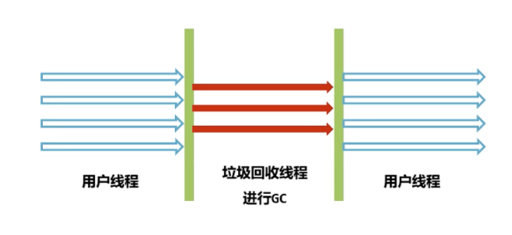
>
>å›æ”¶å¹´ä»£ï¼šå¹´è½»ä»£
>
>å›æ”¶ç®—法：å¤åˆ¶ç®—法
>
>优点：多CPU处ç†å™¨ä¸‹åœé¡¿æ—¶é—´è¾ƒçŸ­
>
>缺点：ååé‡å’Œåœé¡¿æ—¶é—´ä¸å¦‚G1，所以在JDK9之åä¸å»ºè®®ä½¿ç”¨
>
>使用场景：JDK8åŠä¹‹å‰çš„版本中，ä¸CMSè€å¹´ä»£åƒåœ¾å›æ”¶å™¨æ­é…使用


###### è€å¹´ä»£-CMS(Concurrent Mark Sweep)åƒåœ¾å›æ”¶å™¨

> CMSåƒåœ¾å›æ”¶å™¨å…³æ³¨çš„是系统的**æš‚åœæ—¶é—´**，å…许用户线程和åƒåœ¾å›æ”¶çº¿ç¨‹åœ¨æŸäº›æ­¥éª¤ä¸­åŒæ—¶æ‰§è¡Œï¼Œå‡å°‘了用户线程的等待时间
>
> 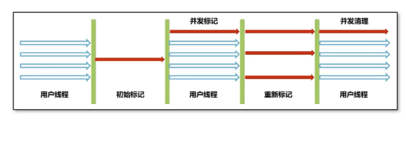
>
> å‚数：XX:+UseConcMarkSweepGC
>
> å›æ”¶å¹´ä»£ï¼šå¹´è½»ä»£
>
> å›æ”¶ç®—法：标记清除算法
>
> 优点：系统由äºåƒåœ¾å›æ”¶å‡ºç°çš„åœé¡¿æ—¶é—´è¾ƒçŸ­ï¼Œç”¨æˆ·ä½“验好
>
> 缺点：1. 内存ç¢ç‰‡é—®é¢˜ 2. 退化问题 3. 浮动åƒåœ¾é—®é¢˜
>
> 使用场景：大å‹çš„互è”网系统中请求数æ®é‡å¤§ï¼Œé¢‘ç‡é«˜çš„场景，比如订å•æ¥å£ã€å•†å“æ¥å£ç­‰
>
> **🌟CMS执行步骤：**
>
> 1. åˆå§‹æ ‡è®°ï¼Œç”¨æ短的时间标记处GC Roots能直æ¥å…³è”的对象。
> 2. 并å‘标记，标记所有的对象，用户线程ä¸éœ€è¦æš‚åœ
> 3. é‡æ–°æ ‡è®°ï¼Œç”±äºå¹¶å‘标记阶段有些对象会å‘生了å˜åŒ–，存在错标ã€æ¼æ ‡ç­‰æƒ…况，需è¦é‡æ–°æ ‡è®°ã€‚
> 4. 并å‘清ç†ï¼Œæ¸…ç†æ­»äº¡çš„对象，用户线程ä¸éœ€è¦æš‚åœã€‚
>
> 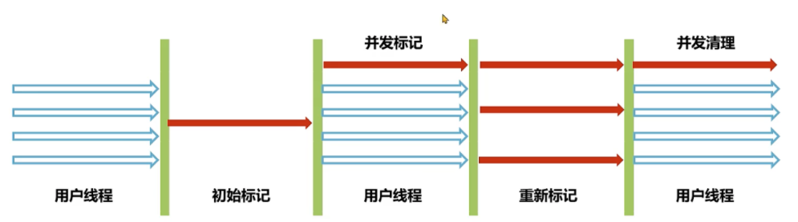
>
> 缺点：
>
> 1. CMS使用了标记-清除算法，在åƒåœ¾å›æ”¶ç»“æŸä¹‹å会出ç°å¤§é‡çš„内存ç¢ç‰‡ï¼ŒCMS会在Full GC时进行ç¢ç‰‡çš„æ•´ç†ã€‚这样会导致用户线程暂åœï¼Œå¯ä»¥ä½¿ç”¨-XX:CMSFullGCsBeforeCompaction=N å‚数（默认0） 调整N次Full 之åå†æ•´ç†ã€‚
>
> 2. 无法处ç†åœ¨å¹¶å‘清ç†è¿‡ç¨‹ä¸­äº§ç”Ÿçš„“浮动åƒåœ¾â€ï¼Œä¸èƒ½åšåˆ°å®Œå…¨çš„åƒåœ¾å›æ”¶ã€‚
>
> 3. 如æœè€å¹´ä»£å†…å­˜ä¸è¶³æ— æ³•åˆ†é…对象，CMS就会退化æˆSerial Oldå•çº¿ç¨‹å›æ”¶è€å¹´ä»£ã€‚
>
>    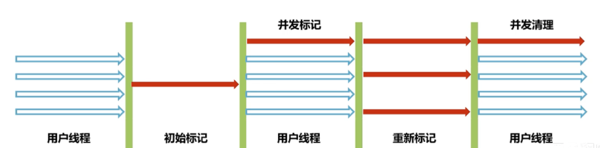


###### 年轻代- Parallel Scavengeåƒåœ¾å›æ”¶å™¨

> Parallel Scavenge 是JDK8默认的年轻代åƒåœ¾å›æ”¶å™¨ï¼Œ**多线程并行å›æ”¶ï¼Œå…³æ³¨çš„是系统的ååé‡**。具备**自动调整堆内存大å°çš„**特点。
>
> 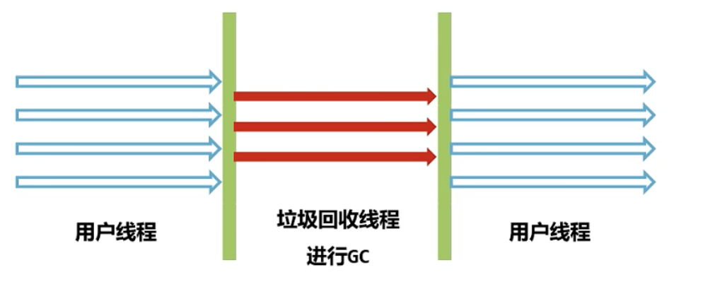
>
> 
>
> å›æ”¶å¹´ä»£ï¼šå¹´è½»ä»£
>
> å›æ”¶ç®—法：å¤åˆ¶ç®—法
>
> 优点：ååé‡é«˜ï¼Œè€Œä¸”å¯ä»¥æ‰‹åŠ¨å¯æ§ã€‚为了æ高ååé‡ï¼Œè™šæ‹Ÿæœºä¼šåŠ¨æ€è°ƒæ•´å †çš„å‚æ•°
>
> 缺点：ä¸èƒ½ä¿è¯å•æ¬¡çš„åœé¡¿æ—¶é—´
>
> 使用场景：åå°ä»»åŠ¡ï¼Œä¸éœ€è¦ä¸ç”¨æˆ·äº¤äº’，并且容易产生大é‡çš„对象，比如大数æ®çš„处ç†ã€å¤§æ–‡ä»¶å¯¼å‡ºã€‚


###### è€å¹´ä»£- Parallel Oldåƒåœ¾å›æ”¶å™¨

> Parallel Old是为Parallel Scavenge收集器设计的è€å¹´ä»£ç‰ˆæœ¬ï¼Œåˆ©ç”¨å¤šçº¿ç¨‹å¹¶å‘收集。
>
> 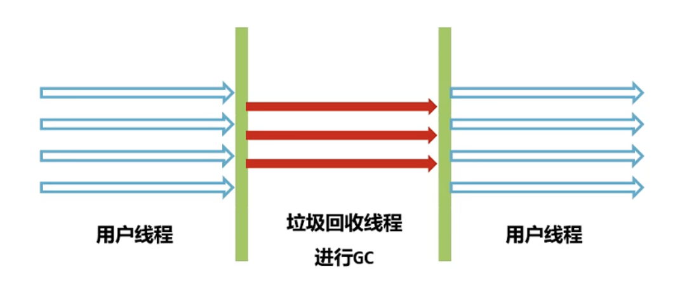
>
> å‚数：XX:+UseConcMarkSweepGC
>
> å›æ”¶å¹´ä»£ï¼šè€å¹´ä»£
>
> å›æ”¶ç®—法：标记-æ•´ç†ç®—法
>
> 优点：并å‘收集，在多核CPU下效ç‡è¾ƒé«˜
>
> 缺点：暂åœæ—¶é—´ä¼šæ¯”较长
>
> 使用场景：ä¸Parallel Scavenge é…套使用

Parallel Scavengeåƒåœ¾å›æ”¶å™¨

> å…许手动设置最大暂åœæ—¶é—´å’Œååé‡ã€‚
>
> Oracle官方建议在使用这个组åˆæ—¶ï¼Œ**ä¸è¦è®¾ç½®å †å†…存的最大值**，åƒåœ¾å›æ”¶å™¨ä¼šæ ¹æ®æœ€å¤§æš‚åœæ—¶é—´å’Œååé‡è‡ªåŠ¨è°ƒæ•´å†…存大å°
>
> **最大暂åœæ—¶é—´ï¼š`-XX:MaxGCPauseMillis` 设置æ¯æ¬¡åƒåœ¾å›æ”¶æ—¶çš„最大åœé¡¿æ¯«ç§’æ•°**
>
> **ååé‡ï¼š-XX:GCTimeRatio=n 设置ååé‡ä¸ºn（用户执行时间=n/n+1）**
>
> **自动调整内存大å°ï¼š`-XX:+UseAdaptiveSizePolicy` 设置å¯ä»¥è®©åƒåœ¾å›æ”¶å™¨æ ¹æ®ååé‡å’Œæœ€å¤§åœé¡¿çš„毫秒数自动调整内存大å°**


##### G1åƒåœ¾å›æ”¶å™¨

JDK9之å默认的åƒåœ¾å›æ”¶å™¨æ—¶G1 （Garbage First）åƒåœ¾å›æ”¶å™¨ã€‚

Parallel Scavenge 关注ååé‡ï¼Œå…许用户设置最大暂åœæ—¶é—´ï¼Œä½†æ˜¯ä¼šå‡å°‘年轻代å¯ç”¨ç©ºé—´çš„大å°ã€‚

CMS关注暂åœæ—¶é—´ï¼Œä½†æ˜¯ååé‡æ–¹é¢ä¼šä¸‹é™ã€‚

而G1设计目标就是将上述两ç§åƒåœ¾å›æ”¶å™¨çš„优点èåˆï¼š

1. 支æŒå·¨å¤§çš„Heapå›æ”¶ï¼Œå¹¶æœ‰è¾ƒé«˜çš„ååé‡ã€‚
2. 支æŒå¤šCPU并行åƒåœ¾å›æ”¶
3. å…许用户设置最大暂åœæ—¶é—´

**🌟JDK9之å强烈建议使用G1åƒåœ¾å›æ”¶å™¨**


###### G1-内存结æ„

G1的整个堆会被划分æˆå¤šä¸ªå¤§å°ç›¸ç­‰çš„区域，称之为区**Region**，区域ä¸è¦æ±‚是è¿ç»­çš„。分为**Eden**ã€**Survivor**ã€**Old区**。Region的大å°é€šè¿‡å †ç©ºé—´å¤§å°/2048计算得到，也å¯ä»¥é€šè¿‡å‚æ•°**-XX:G1HeapRegionSize=32m**指定(其中32m指定region大å°ä¸º32M)，**Region size必须是2的指数幕，å–值范围ä»1M到32M。**

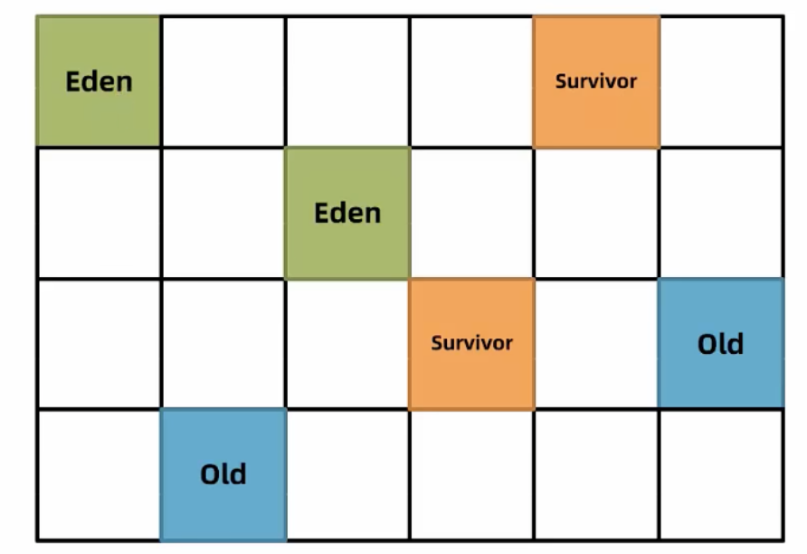

G1åƒåœ¾å›æ”¶æ–¹å¼ï¼š

- **年轻代å›æ”¶ï¼ˆYoung GC）**
- **æ··åˆå›æ”¶ï¼ˆMixed GC）**


###### G1-年轻代å›æ”¶

- 年轻代å›æ”¶ï¼ˆYoung GC），å›æ”¶Eden区和Survivor区中ä¸ç”¨çš„对象。会导致STW，G1中å¯ä»¥é€šè¿‡å‚æ•°-XX:MaxGCPauseMillis=n（默认为200）设置æ¯æ¬¡åƒåœ¾å›æ”¶æ—¶çš„最大暂åœæ—¶é—´æ¯«ç§’数，G1åƒåœ¾å›æ”¶å™¨ä¼šå°½å¯èƒ½åœ°ä¿è¯æš‚åœæ—¶é—´ã€‚

- **执行æµç¨‹ï¼š**

  > 1. 新创建的对象会存放在Eden区。当G1判断年轻代区ä¸è¶³ï¼ˆMax默认为60%），无法分é…对象时需è¦å›æ”¶æ—¶ä¼šæ‰§è¡ŒYoung GC
  > 2. 标记出Eden和Survivor区域中的存活对象
  > 3. æ ¹æ®é…置的最大暂åœæ—¶é—´**选择æŸäº›åŒºåŸŸå­˜æ´»å¯¹è±¡å¤åˆ¶åˆ°ä¸€ä¸ªæ–°çš„Survivor区中（年龄+1）**，清空这些区域。
  >
  > 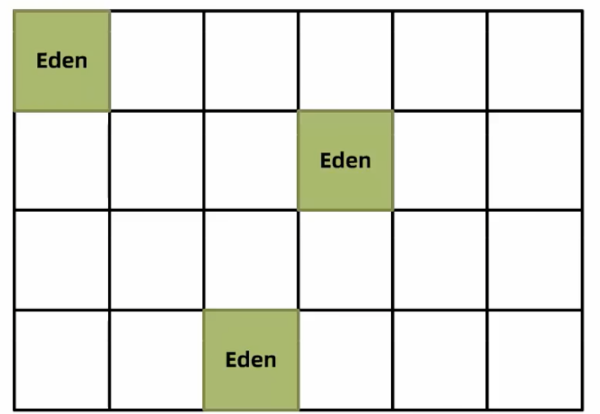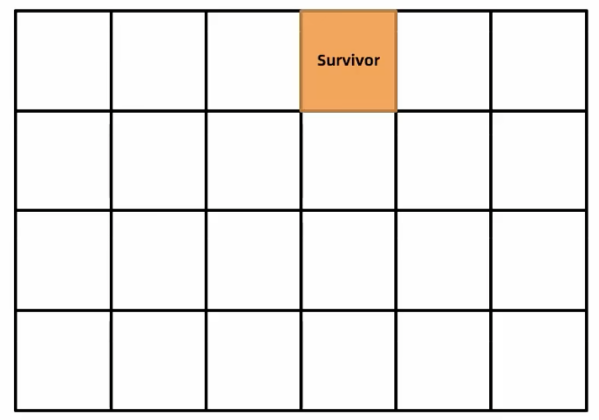

> G1在进行Young GC到过程中会å»è®°å½•æ¯æ¬¡åƒåœ¾å›æ”¶æ—¶æ¯ä¸ªEden区和Survivor区的平å‡è€—时，以作为下次å›æ”¶æ—¶çš„å‚考ä¾æ®ã€‚这样就å¯ä»¥æ ¹æ®é…置的最大暂åœæ—¶é—´è®¡ç®—出本次å›æ”¶æ—¶æœ€å¤šèƒ½å›æ”¶å¤šå°‘个Region区域了。
>
> 比如：-XX:MaxGCPauseMillis=n（默认200） æ¯ä¸ªRegionå›æ”¶è€—æ—¶40ms，那么æ¯æ¬¡å›æ”¶æœ€å¤šåªèƒ½å›æ”¶4个Region。
>
> 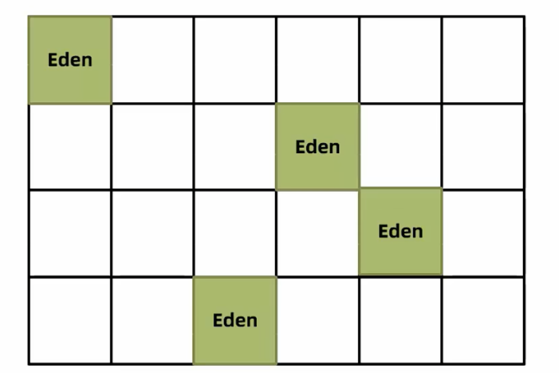
>
> 4. åç»­Young GCæ—¶ä¸ä¹‹å‰ç›¸åŒï¼Œåªä¸è¿‡Survivor区中存活对象会被æ¬è¿åˆ°å¦ä¸€ä¸ªSurvivor区。
>
> 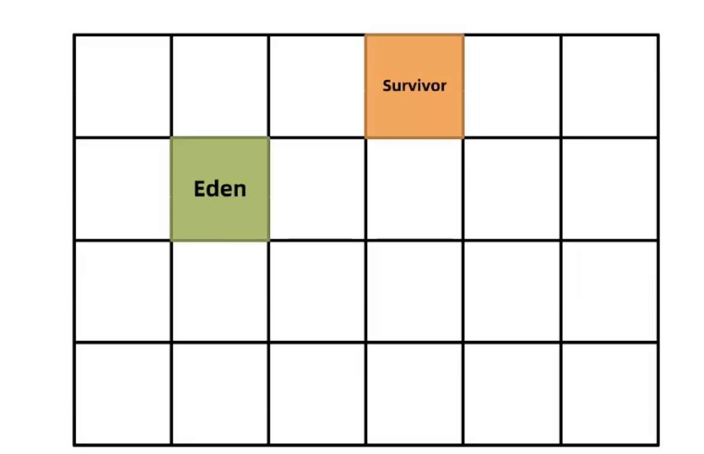
>
> 5. 当æŸä¸ªå­˜æ´»å¯¹è±¡çš„年龄到达阀值（默认15），将被放入è€å¹´ä»£ã€‚
>
>    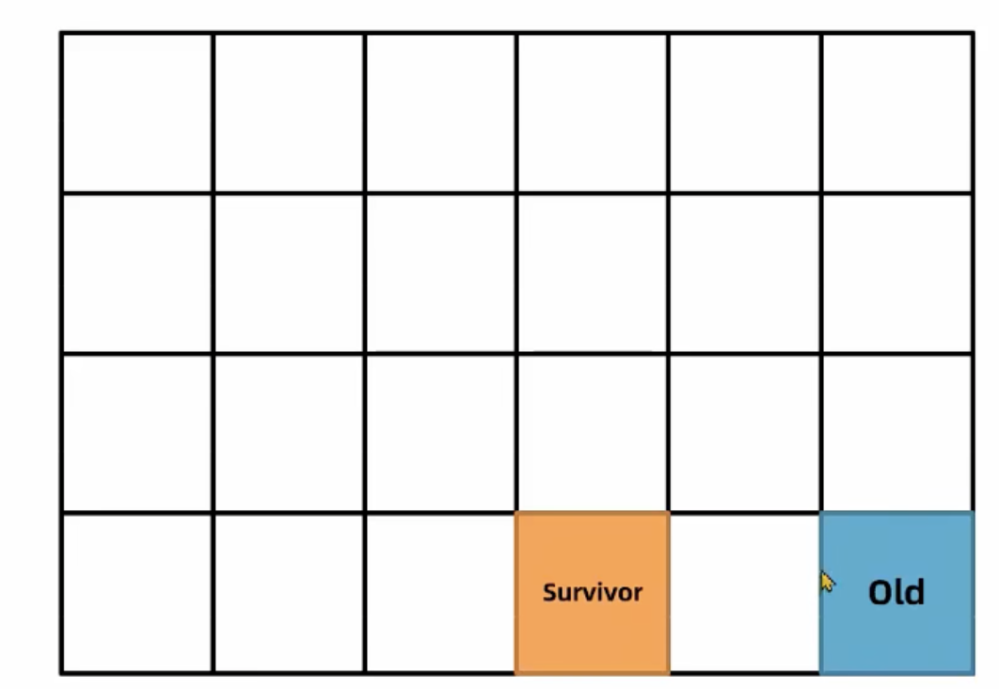
>
> 6. 部分对象如æœå¤§å°è¶…过Region的一åŠï¼Œä¼šç›´æ¥æ”¾å…¥è€å¹´ä»£ï¼Œè¿™ç±»è€å¹´ä»£è¢«ç§°ä¸º**Humongous区**。比如堆内存时4G，æ¯ä¸ªRegion是2M，åªè¦ä¸€ä¸ªå¤§å¯¹è±¡è¶…过1M就会被放入Humongous区，如æœå¯¹è±¡è¿‡å¤§ä¼šæ¨ªè·¨å¤šä¸ªRegion。
>
>    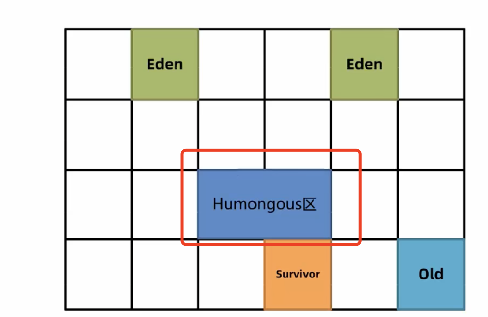


###### G1-æ··åˆå›æ”¶

> 7. 多次åƒåœ¾å›æ”¶ä¹‹å，会出ç°å¾ˆå¤šOldè€å¹´ä»£åŒºï¼Œæ­¤æ—¶æ€»Heapå ç”¨ç‡è¾¾åˆ°é˜€å€¼æ—¶ï¼ˆ-XX:InitiatingHeap OccupancyPercent 默认45%）会触å‘æ··åˆå›æ”¶MixedGC。å›æ”¶æ‰€æœ‰å¹´è½»ä»£å’Œéƒ¨åˆ†è€å¹´ä»£çš„对象以åŠå¤§å¯¹è±¡åŒºã€‚采用å¤åˆ¶ç®—法æ¥å®Œæˆã€‚
>
>    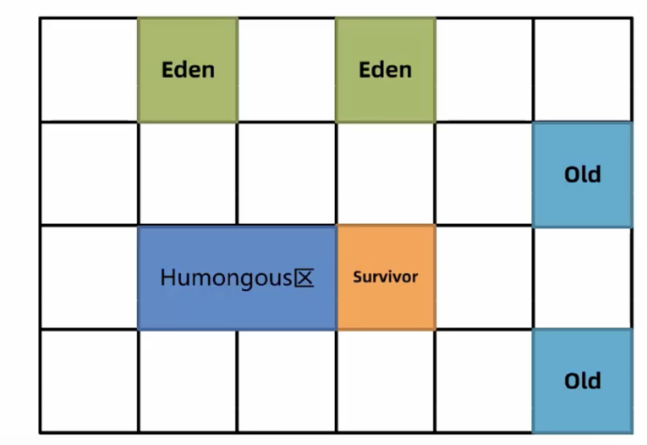

- **æ··åˆå›æ”¶åˆ†ä¸ºï¼šåˆå§‹æ ‡è®°ï¼ˆinitial mark）ã€å¹¶å‘标记（concurrent mark）ã€æœ€ç»ˆæ ‡è®°ï¼ˆremark或者Finalize Marking）ã€å¹¶å‘清ç†ï¼ˆcleanup）**

- G1对è€å¹´ä»£çš„清ç†ä¼šé€‰æ‹©å­˜æ´»åº¦æœ€ä½çš„区域æ¥è¿›è¡Œå›æ”¶ï¼Œè¿™æ ·å¯ä»¥ä¿è¯å›æ”¶æ•ˆç‡æœ€é«˜ï¼Œè¿™ä¹Ÿæ˜¯G1（Garbage First）å称的由æ¥

  > 
  >
  > 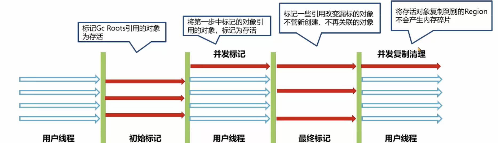

- 最å清ç†é˜¶æ®µä½¿ç”¨å¤åˆ¶ç®—法，ä¸ä¼šäº§ç”Ÿå†…å­˜ç¢ç‰‡

  > 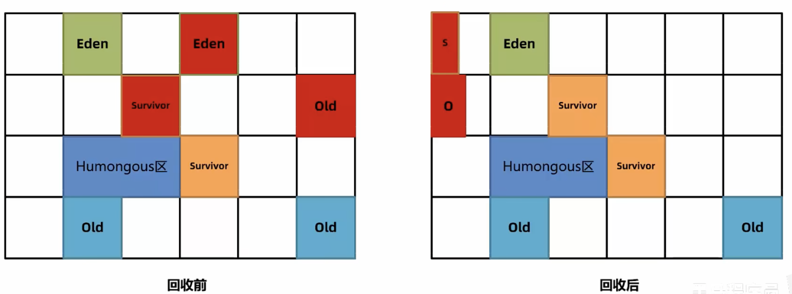


###### G1-Full GC

注æ„：如æœæ¸…ç†è¿‡ç¨‹ä¸­å‘ç°æ²¡æœ‰è¶³å¤Ÿçš„空Region存放转移的对象，会出ç°Full GC。å•çº¿ç¨‹æ‰§è¡Œæ ‡è®°-æ•´ç†ç®—法，此时会导致用户线程的暂åœã€‚所以尽é‡ä¿è¯åº”用的Heap有一定多余的空间。

> 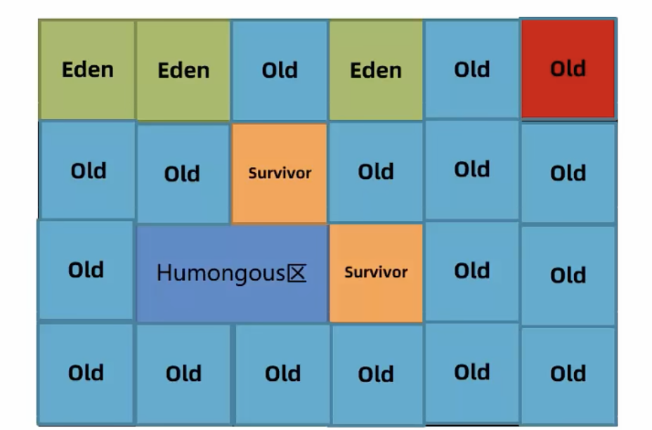
>
> **å‚æ•°1: -XX:+UseG1GC 打开G1的开关，JDK9之å默认ä¸éœ€è¦æ‰“å¼€**
>
> **å‚æ•°2: -XX:MaxGCPauseMillis=毫秒值最大暂åœçš„时间**
>
> 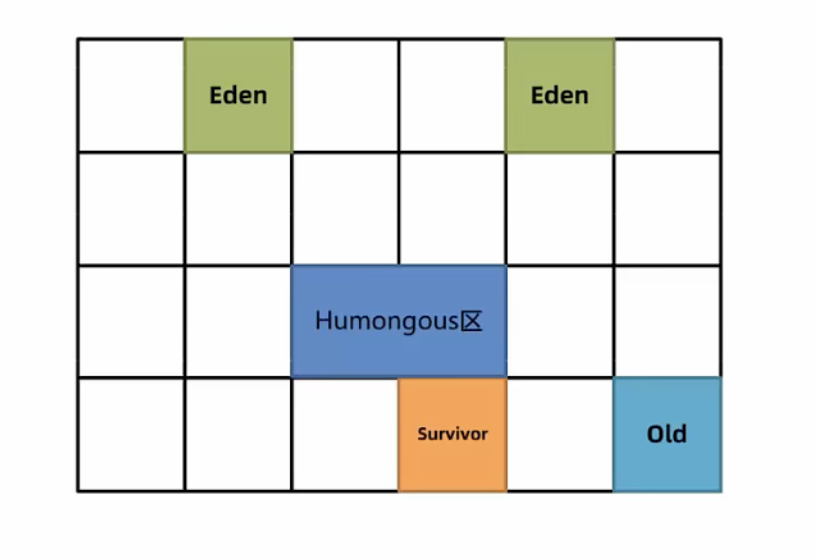
>
> å›æ”¶å¹´ä»£ï¼šå¹´è½»ä»£+è€å¹´ä»£
>
> å›æ”¶ç®—法：å¤åˆ¶ç®—法
>
> **优点：对比较大的Heap 如超过6G大Heapå›æ”¶æ—¶ï¼Œå»¶è¿Ÿå¯æ§ï¼Œä¸ä¼šäº§ç”Ÿå†…å­˜ç¢ç‰‡ï¼Œå¹¶å‘标记的SATB算法效ç‡é«˜**
>
> **缺点：JDK8之å‰è¿˜ä¸å¤Ÿæˆç†Ÿ**
>
> 使用场景：JDK8最新版本，JDK9之å建议默认使用

🌟Tips：

> åƒåœ¾å›æ”¶å™¨çš„组åˆå…³ç³»è™½ç„¶å¾ˆå¤šï¼Œä½†æ˜¯é’ˆå¯¹å‡ ä¸ªç‰¹å®šçš„版本，比较好的组åˆé€‰æ‹©å¦‚下:
> **JDK8åŠä¹‹å‰ï¼š**
> **ParNew + CMS (关注暂åœæ—¶é—´) ã€Parallel Scavenge + Parallel Old (关注ååé‡)〠G1 (DK8之å‰ä¸å»ºè®®ï¼Œè¾ƒå¤§å †å¹¶ä¸”关注暂åœæ—¶é—´)**
> **JDK9之å:**
> **G1 (默认)**
>
> ä»JDK9之å，由äºG1日趋æˆç†Ÿï¼ŒJDK默认的åƒåœ¾å›æ”¶å™¨å·²ç»ä¿®æ”¹ä¸ºG1，所以强烈建议在生产ç¯å¢ƒä¸Šä½¿ç”¨G1。
> G1çš„å®ç°åŸç†å°†åœ¨ã€ŠåŸç†ç¯‡ã€‹ä¸­ä»‹ç»ï¼Œæ›´å¤šå‰æ²¿æŠ€æœ¯ZGCã€GraalVM将在《高级篇》中介ç»


1ã€Java中有哪几å—内存需è¦è¿›è¡Œåƒåœ¾å›æ”¶?
2ã€æœ‰å“ªå‡ ç§å¸¸è§çš„引用类å‹?
3ã€æœ‰å“ªå‡ ç§å¸¸è§çš„åƒåœ¾å›æ”¶ç®—法?
4ã€å¸¸è§çš„åƒåœ¾å›æ”¶å™¨æœ‰å“ªäº›?
