 


# 1、基础篇

## 初始JVM

### 什么是JVM

JVM本质上是一个运行在计算机上的程序，他的职责是运行Java字节码文件。


### JVM的功能

**1、解释和运行**

- 对字节码文件中的指令，实时的解释称机器码，让计算机执行

**2、内存管理**

- 自动为对象、方法等分配内存
- 自动的垃圾回收机制，回收不在使用的对象

**3、即时编译**

对热点代码进行优化，提升执行效率


### 即时编译

Java语言如果不做任何优化，性能不如C++等语言。

> **因为是实时解释为机器码**


而其他的C++语言是打包编译称可执行文件（机器码）

> **直接运行机器码**


**Java需要实时解释的原因？**

> 主要是问了跨平台特性


JVM提供了**即时编译**（Just-In-Time 简称JIT）进行性能优化，最终能够达到接近C++语言的运行性能，甚至在特定的场景下实现了超越。


### 常见的JVM


常见的JVM-HotSpot的发展历程


## 字节码文件详解

### 1.Java虚拟机的组成

主要包括：

- 类加载器
- 运行时数据区域（JVM管理的内存）
- 执行引擎（即时编译器、解释器、垃圾回收器等）


### 2.字节码文件的组成

主要包括：

- 基本信息
- 常量池
- 接口
- 方法
- 属性


**查看字节码常用的工具**

- Javap命令

- Jclasslib软件或者插件

  > 
  >
  > github地址：https://github.com/ingokegel/jclasslib

- Arthus

  > 官网地址：https://arthas.aliyun.com/doc/


#### 1）基本信息

**Magic魔数**

- 文件是无法通过文件扩展名来确定文件类型的，文件扩展名可以随意修改，不影响文件的内容
- 软件使用文件的头几个字节（文件头）去检验文件的类型，如果软件不支持该种类型就会出错。
- Java字节码文件中，该文件头称为Magic魔数


常见的文件头


**主副版本号**

- 主副版本号指的是编译字节码文件的JDK版本号，主版本号是用来识别大版本号，JDK1.0-1.1使用了45.0-45.3，JDK1.2是46之后每升级一个大版本号就加1，副版本号是当主版本号相同时作为区分不同版本的标识，一般只需要关心主版本号。
- 版本号的作用主要是判断当前字节码的版本和运行时的JDK是否兼容

> Tips:
>
> 1.2之后大版本号计算的方式就是主版本号-44 
>
> 例如：主版本号52就是JDK8


| 名称               | 作用                                                         |
| ------------------ | ------------------------------------------------------------ |
| Magic魔数          | 固定为0XCAFEBABE 不会改变                                    |
| 主副版本号         | 编译字节码的JDK版本                                          |
| 访问标识           | 标识是类还是接口、枚举、注解、模块 标识public、final、abstract |
| 类、父类、接口索引 | 通过这些索引可以找到类、父类、接口的信息                     |


#### 2）常量池

字节码文件中常量池的作用：

- 避免相同的内容重复定义、节省空间。

```
    public static String A = "中国";
    public static String B = "中国";
```

> 其他的相同的字段就会去引用到 真正的string字面量


> 如果是常量 那么会指向常量池里面的index 最终找到字面量
>
> 如果是普通的 是存在常量池里面 那么会直接找到对应的字面量值

- 常量池中的数据都有一个编号，编号从1开始。在字段或者字节码指令中通过编号可以快速的找到对应的数据。

- 字节码指令中通过编号引用到常量池的过程称之为符号引用

  > 


#### 3）方法

- 字节码中的方法区域是存放**字节码指令**的核心位置，字节码指令的内容放在方法的code属性中

  > 


**通过字节码指令分析下面三种“加1”的操作性能的高低？**

> 字节码行数越少 效率越高

```java
int i=0,j=0,k=0;
i++;
j=j+1;
k += 1;
```

> i和k一样行数
>
> j的行数最多


**字节码工具**

- javap -v

  > javap是JDK自带的反编译工具，可以通过控制台查看字节码文件的内容。适合在服务器上查看字节码文件内容
  >
  > 直接输入javap 查看所有参数
  >
  > 输入javap -v 字节码文件名称 查看具体的字节码信息（如果是jar包 需要用jar -xvf命令解压）
  >
  > > linux > 符号追加到指定的位置文件内

- Arthas

  > 官网地址：https://arthas.aliyun.com/doc/
  >
  > 
  >
  > - jad类的全限定名：反编译已经加载类的源码
  >
  > - dump类的全限定名：dump已加载类的字节码文件到特定目录
  >
  >   > 全限名：**包名加类名**


### 3.类的生命周期

应用场景：

- 运行时常量池
- 多态的原理
- 类加载器的作用
- 类的加密和解密


#### 0）生命周期概述

**分为下面五个阶段：**

- 1-加载

- 2-连接

  > 重点知识：
  >
  > - 校验
  > - 准备
  > - 解析

- 3-初始化

- 4-使用

  > 距离：new一个对象
  >
  > ```
  > Class class = new Class();
  > Class<Class> clazz = Class.class;
  > Class class1 = clazz.newInstance();
  > ```
  >
  > 

- 5-卸载

  > 类的卸载主要体现在垃圾回收♻️机制


#### 1）加载阶段

- Loading阶段第一步是**类加载器**根据类的全限定名通过不同的渠道以二进制流的方式获取到字节码信息。

  - 本地文件- 磁盘上的字节码文件
  - 动态代理生成-程序运行时使用动态代理生成
  - 通过网络传输的类-早期的Applet技术使用

- 类加载器在加载完类之后，Java虚拟机会将字节码中的信息保存到方法区中

  > 方法区：虚拟的空间
  >
  > Java8以后叫元空间

- 类加载器在加载完类之后，Java虚拟机会将字节码中的信息保存到内存的方法区中。

  > 生成一个InstanceKlass对象，保存类的所有信息，里面还包含实现特定功能比如多态的信息。
  >
  > 

- 同时，Java虚拟机还在堆中生成一份与方法区中数据类似的java.lang.Class 对象

  > 作用：是在Java代码中去获取类的信息以及存储静态字段的字段（JDK8及之后）
  >
  > 
  >
  > 
  >
  > 

  

  

**为什么有两个区？**

> 对于开发者来说，**只需要访问堆中的Class对象**而不需要访问方法区中所有信息
>
> **这样虚拟机就能很好地控制开发者访问数据的范围**
>
> 


**查看内存中的对象**

- 推荐使用JDK自带的hsdb工具查看Java虚拟机内存信息。工具位于JDK安装目录下lib文件夹中的sa-jdi.jar

- 启动命令

  > ```shell
  > java -cp sa-jdi.jar sun.jvm.hotspot.HSDB
  > ```
  >
  > 然后使用对应的java进程端口号连接
  >
  > 
  >
  > 

  

  **Tips💡**

> jps 命令：查看所有的java对象进程
>
> 


#### 2）连接阶段

连接阶段主要包含***三个过程***：

- ***验证-验证内容是否满足《Java虚拟机规范》***

  > Linking阶段不需要程序员参与
  >
  > 主要验证四部分：
  >
  > - 文件格式验证，比如文件是否以0xCAFEBABE开头，主副版本号是否满足当前Java虚拟机版本要求
  > - 元信息验证，例如类必须有父类（super不能为空）
  > - 验证程序执行指令的语义，比如方法内的指令执行到一半强行跳转到其他方法中去
  > - 符号引用验证，例如是否访问了其他类中private的方法等

- ***给静态变量赋初值***

  > 只要讨论JDK8及以后的版本
  >
  > - 虽然赋值为1 但是初始值赋值为0
  >
  > 
  >
  > - **准备阶段只会给静态变量赋初始值，而每一种基本数据类型和引用数据类型都有其初始值**
  >
  > 
  >
  > - **final修饰的基本数据类型的静态变量，准备阶段直接会将代码中的值进行赋值。（因为值不能修改，已经确定了）**
  >
  > 

  

- ***将常量池中的符号引用替换成指向内存的直接引用***

  > - **直接引用不在使用编号，而是使用内存中地址进行访问具体的数据**
  >
  > 

> ***符号引用***是字节码文件中使用**编号**去常量池中找对应的内容，***直接引用***是去找内存地址的引用
>
> 
>
> 类的信息已经加载在内存中


#### 3）初始化阶段

- 初始化阶段会执行**静态代码块中的代码**，并**为静态变量赋值**。执行流程与代码执行流程一致。

- 初始化阶段会执行字节码文件中**cliinit**部分的字节码指令。

  > **clinit**方法中和java执行的顺序一致
  >
  > 


**以下几种方式会导致类的初始化：**

1. 访问一个类的静态变量或者静态方法，注意变量时**final修饰的并且等号右边时常量不会触发初始化**（已经在连接阶段的准备阶段已经初始化了）
2. 调用Class.forName(String className)
3. new 一个该类的对象时
4. 执行Main方法的当前类

**Tips💡**

> VM参数：
>
> ```
> -XX:+TraceClassLoading 参数可以打印出加载并初始化的类
> ```

**案例：**

> 

> 执行main方法的时候 会先初始化clinit 执行当前main方法所在的对象静态代码块（**有且只会执行一次静态代码块**）所以打印D 然后执行main方法自己的A 
>
> **一个类*加载初始化*只会执行一次**
>
> 然后new一个对象的时候（可以创建多个对象 会初始化多次构造方法） **执行顺序：静态代码块-> 代码块-> 构造方法** ，因为main初始化（已经加载了本身）的时候已经执行了静态代码块 ，然后会先初始化该对象的构造方法（如果有局部代码块 那么init的时候会把该代码块放到构造方法里面一起执行）。
>
> ```java
> class Test001{
>     public static void main(String[] args) {
>         System.out.println("A");
>         new Test001();
>         new Test001();
>     }
> 
>     public Test001() {
>         System.out.println("B");
>     }
>     {
>         System.out.println("C");
>     }
>     static {
>         System.out.println("D");
>     }
> }
> ```
>
> **执行结果为：DACBCB**


clinit指令在特定情况下不会出现指令操作

比如：以下几种情况是***不会**进行初始化指令操作的*。

1. 无静态代码块且无静态变量赋值语句的
2. 有静态变量的声明，但是没有赋值语句的
3. 静态变量的定义使用final关键字的，这类变量会在（**连接阶段的准备阶段**）直接进行初始化
4. **直接访问父类的静态变量，不会出发子类的初始化**
5. 子类的初始化clinit调用之前，会先调用父类的clinit初始化方法

**案例1：**

> 
>
> **答案：先执行父类 把值赋值为1 然后执行子类。把值赋值为2 然后打印数据为2**

**案例2:**

> **数组的创建不会导致数组中元素的类进行初始化**
>
> ```java
> class Test001 {
>     public static void main(String[] args) {
>         Test002[] test001s = new Test002[10];
>     }
> }
> 
> class Test002 {
>     static {
>         System.out.println("D");
>     }
> }
> ```
>
> **答案：不会打印静态代码块**

**案例3:**

> **final修饰的变量如果赋值的内容需要执行指令才能得到结果，会执行clinit方法进行初始化**
>
> 
>
> ```java
> class Test001 {
>     public static void main(String[] args) {
>         System.out.println(Test002.a);
>     }
> }
> 
> class Test002 {
>     public static final int a = Integer.valueOf(1);
> 
>     static {
>         System.out.println("静态代码块运行");
>     }
> }
> ```
>
> **答案：是1 然后是打印文字**


### 4.类加载器

什么是类加载器？

> 类加载器（classLoader）是Java虚拟机提供给应用程序区实现获取类和接口字节码数据的技术


**类加载器的应用场景：**

- 企业级应用
  1. SPI机制
  2. 类的热部署
  3. Tomcat类的隔离
- 大量的面试题
  1. 什么是类的双亲委派机制
  2. 打破类的双亲委派机制
  3. 自定义类加载器
- 解决线上问题
  1. 使用Arthas不停机解决线上故障


#### 1）类加载器的分类

类加载器分为两类，一类是Java代码中实现的，一类是Java虚拟机底层源码实现的


- 类加载器的设计JDK8和8之后的版本差别较大，JDK8及之后的版本中默认的累积载器有如下几种

**虚拟机时实现的：**

>**Bootstrap（启动类加载器）**
>
>虚拟机底层实现的C++，加载Java类中最核心的类

**Java实现的：**

> **Extension（扩展类加载器）**
>
> 允许扩展Java中比较通用的类
>
> **Application（应用程序类加载器）**
>
> 加载应用使用的类


类加载器的详细信息可以通过classloader命令查

> ```shell
> [arthas@60081]$ classloader
> ```
>
> 可以看到层级关系为最上层的父类为**BootstrapClassLoader**，其次**sun.misc.LauncherExtClassLoader**，在其次为**sun.misc.LauncherAppClassLoader**
>
> 


##### **Bootstrap ClassLoader**

- Bootstrap ClassLoader 是由HotSpot虚拟机提供、使用C++编写的类加载器

- 默认加载Java安装目录下/jre/lib下的类文件

  > 


**如果想用BootStrap ClassLoader 加载用户自己的jar包，有哪些方式？**

- （不推荐）把自己的jar包放入lib目录下，可能会出现文件名不匹配的问题也不会正常的被加载

- **（推荐）**使用VM参数进行扩展

  > 使用命令：
  >
  > ```
  > -Xbootclasspath/a:jar包目录/jar包名
  > ```
  >
  > 可以自己手动写一个类 然后使用vm参数把这个类加载进去，这个类可以写了static方法 打印日志  然后调用的这个 去指定引用这个类 forname 然后看结果 但是这个类加载器还是null 是属于bootstrap加载器


**Java中默认的类加载器**

- **Extension ClassLoader**和**Application ClassLoader**都是JDK中提供的，使用Java编写的类加载器
- 它们的源码都位于sun.misc,Launcher中，是一个静态内部类。继承自URLCLlassLoader。局部通过目录或者指定jar包将字节码文件加载到内存中。


##### Extension ClassLoader

- Extension ClassLoader 是JDK中提供的、使用Java编写的类加载器

- 默认加载Java安装目录/jre/lib/ext下的类文件

  > 

**如果想用Extension ClassLoader 加载用户自己的jar包，有哪些方式？**

- （不推荐）把自己的jar包放入/j re/lib/ext/目录下，尽量不要去改JDK安装目录中的内容

- **（推荐）**使用VM参数进行扩展

  > 使用命令：
  >
  > ```
  > -Djava.ext.dirs=jar包目录进行扩展，这种方式会覆盖原是目录，所以需要用 ; 追加原始目录
  > ```


##### Application ClassLoader

- 自己写的代码默认就是Application ClassLoader


**使用Arthas查看类加载器**


#### 2）双亲委派机制

> 由于Java虚拟机中有多个类加载器，双亲委派机制的核心是解决一个类到底由谁来加载的问题

**双亲委派机制有什么作用？**

1. 保证类加载的安全性

   > 通过双亲委派机制避免恶意代码替换JDK的核心类库，比如java.lang.String，确保核心类库的完整性和安全性

2. 避免重复加载

   > 可以避免一个类被反复多次加载


**什么是双亲委派机制？**

> 当一个类加载器接收到加载类当任务的时候，会**自底向上查找**是否加载过，再**由顶向下进行加载**
>
> 向下委派加载起到了一个加载优先级的作用
>
> 

每个类都有一个父类加载器，**Application** 的父类是**Extension** ，**Extension**的parent是**Null**

- 在类加载的过程中，每个类加载器都会先检查是否已经加载类该类，如果已经加载则直接返回，否则会将加载请求委派给父类加载器，逐级向上

> 

- 如果所有的父类加载器都没有加载该类，那么就会由最上层的类加载器开始**自顶向下**尝试加载类。

> 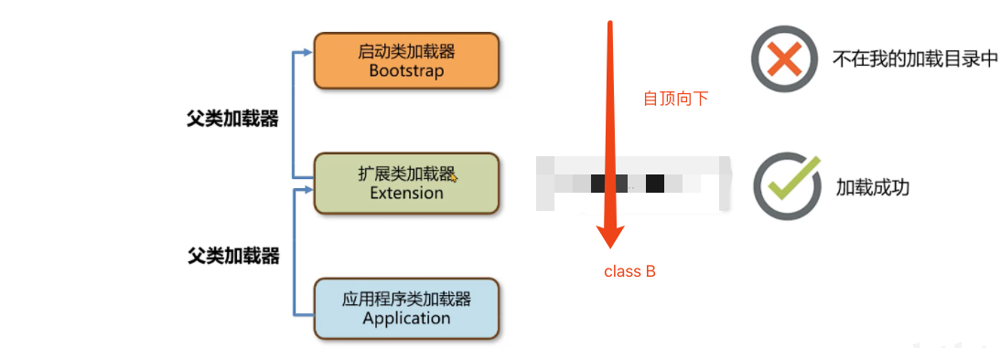


**问题：**

1. 如果一个类重复出现在三个类加载器的加载位置，应该由谁来加载？

   > 应该由Bootstrap ClassLoader来加载，该Loader优先级最高

2. String类能覆盖嘛？

   > String类不能重写，不会，且String类由Bootstrap ClassLoader来加载

3. 如何在Java中使用代码的方式去主动加载一个类？

   > - 使用Class.forName方法，使用当前的类的类加载器去加载指定的类
   >
   >   ```java
   >   
   >           Class<?> aClass = Class.forName("xxxx.xxxx");
   >           aClass.getClassLoader();
   >   ```
   >
   > - 获取类加载器，通过类加载器的loadClass() 指定某个类加载器加载
   >
   >   ```java
   >   ClassLoader classLoader = Test002.class.getClassLoader();
   >   Class<?> aClass1 = classLoader.loadClass("xxxx.xxx");
   >   ```


**每个Java实现的类加载器中保存了一个成员变量 parent类加载器，可以理解为上一级加载器，不是Java中继承关系和含义**

> 


- Application加载器的parent是Extension 加载器，而**Extension加载的parent是Null**，但是在代码逻辑上，Extension ClassLoader依然会把Bootstrap ClassLoader当成父类加载器处理
- Bootstrap ClassLoader使用C++编写，没有parent加载器


使用Arthas查看ClassLoader的父子关系：

> ```shell
> classloader -t
> ```
>
> 


##### **面试题**

**类的双亲委派机制是什么？**

1. 当一个类加载器去加载某个类的时候，会自底向上查找是否加载过，如果加载过就直接返回，如果一直到最顶层的类加载器都没有加载，再由顶向下进行加载。
2. 应用程序类加载器的父类加载器是扩展类加载器，扩展类加载器的父类加载器是启动类加载器（**为Null**）。
3. 双亲委派机制的好处有两点: 第一是避免恶意代码替换JDK中的核心类库，比如java.lang.String，确保核心类库的完整性和安全性。第二是避免一个类重复地被加载。


#### 3）打破双亲委派机制

**打破双亲委派机制有哪些方式？**

- 自定义类加载器

  > 自定义类加载器并且重写loadclass方法，就可以将双亲委派机制的代码去除Tomcat通过这种方式实现应用之间类隔离，《面试篇》中分享它的做法

- 线程上下文加载器

  > 利用上下文类加载器加载类，比如JDBC和JNDI等

- Osgi框架的类加载器

  > 历史上osgi框架实现了一套新的类加载器机制，允许同级之间委托进行类的加载


**为什么有打破双亲委派机制？**

- 一个Tomcat程序是可以运行多个Web应用的，如果两个应用中出现了想吐的限定名的类，比如Servet类，Tomcat要保证这两个类能够加载并且它们应该是不同的类

- 如果不打破双亲委派机制，当应用类加载器加载Web应用1的MyServlet之后，Web应用2中相同限定名的MyServlet类就无法被加载了

  > 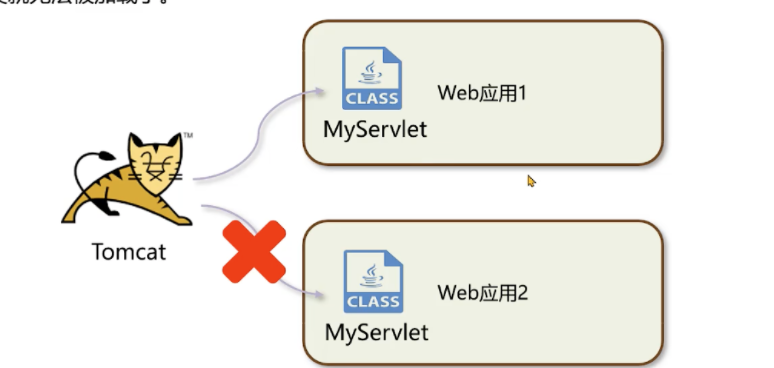


##### 自定义类加载器

- Tomcat使用了自定义类加载器来实现应用之间类的隔离。每一个应用会有一个独立的类加载器加载相应的类。

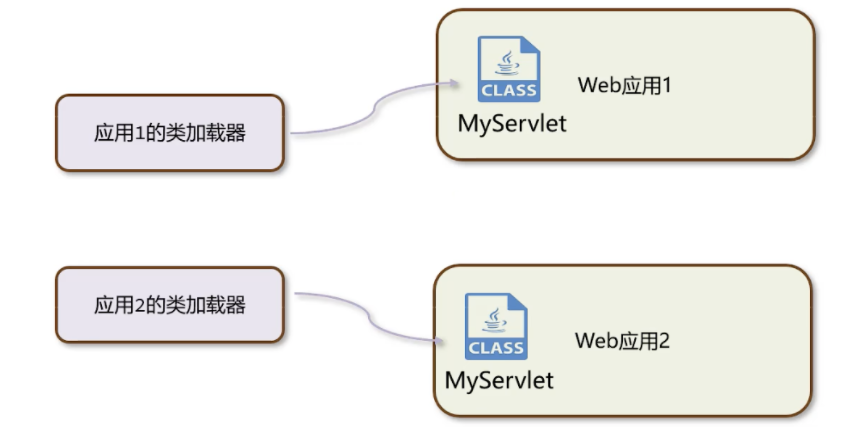

- 先来分析ClassLoader的原理，ClassLoader中包含了4个核心方法

  > ```java
  > // 类加载的入口，提供了双亲委派机制。内部会调用findClass 重要
  > public Class<?> loadClass(String name) 
  > // 由类加载器子类实现,获取二进制数据调用defineClass ，比如URLClassLoader会根据文件路径去获取类文件中的二进制数据。重要
  > protected Class<?> findClass(String name)
  > // 做一些类名的校验，然后调用虚拟机底层的方法将字节码信息加载到虚拟机内存中
  > protected final Class<?> defineClass(String name, byte[] b, int off, int len)
  > // 执行类生命周期中的连接阶段
  > protected final void resolveClass(Class<?> c)
  > ```
  >
  > 

- 双亲委派机制的核心代码就是位于loadClass方法中

- 打破双亲委派机制的核心就是将下面loadClass方法的代码重写

  > ```java
  > synchronized (getClassLoadingLock(name)) {
  >             // First, check if the class has already been loaded 首先检查该类是否已经加载
  >             Class<?> c = findLoadedClass(name);
  >             if (c == null) {
  >                 long t0 = System.nanoTime();
  >                 try {
  >                     if (parent != null) {
  >                       // 调用父类的方法去加载
  >                         c = parent.loadClass(name, false);
  >                     } else {
  >                         c = findBootstrapClassOrNull(name);
  >                     }
  >                 } catch (ClassNotFoundException e) {
  >                     // ClassNotFoundException thrown if class not found
  >                     // from the non-null parent class loader
  >                 }
  >               
  >               if (c == null) {
  >                     // If still not found, then invoke findClass in order
  >                     // to find the class. 如果父类加载不了 就自己来加载
  >                     long t1 = System.nanoTime();
  >                     c = findClass(name);
  > 
  >                     // this is the defining class loader; record the stats
  >                     sun.misc.PerfCounter.getParentDelegationTime().addTime(t1 - t0);
  >                     sun.misc.PerfCounter.getFindClassTime().addElapsedTimeFrom(t1);
  >                     sun.misc.PerfCounter.getFindClasses().increment();
  >                 }
  > ```

自定义类加载器的父类为什么是Application ClassLoader？


- JDK8为例，ClassLoader类中提供了构造方法设置parent内容：

  > 
  >
  
- 这个构造方法由另一个构造方法调用，其中父类加载器由get SystemClassLoader方法设置。该方法返回的是Application ClassLoader

> 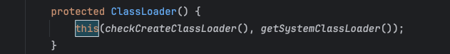


**两个自定义类加载器加载相同限定的类，不会冲突？？**

- 不会冲突，在同一个Java虚拟机中，只有**相同类加载器+相同的类限定名**才会被认为是同一个类

- 在Arthas中使用sc -d。classpath 可以查看具体情况

  > ​	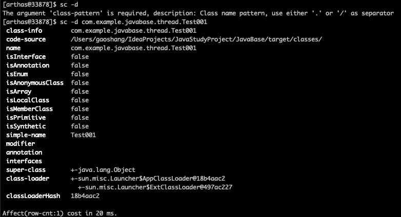

- 正确的去实现一个自定义类加载器的方式是重写**findClass**方法，这样不会破坏双亲委派机制。

  > 


##### 线程上下文加载器

- JDBC使用了DriverManager来管理项目中引入的不同数据库的驱动，比如mysql驱动、oracle驱动

  > 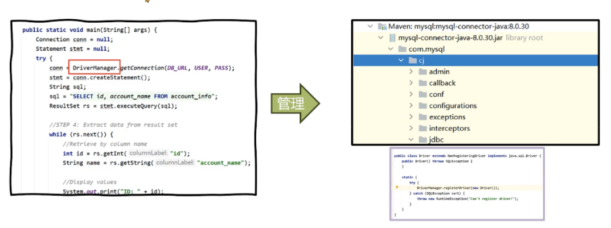

- DriverManager位于rt.jar包中，由Bootstrap ClassLoader加载的

  > 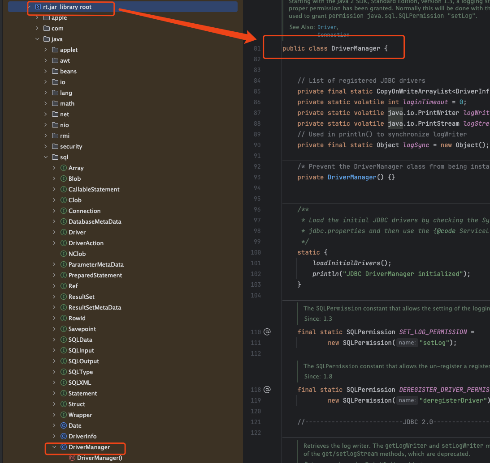

- DriverManager位于rt.jar包中，由**Bootstrap ClassLoader**加载。而用户jar包中的驱动需要用**Application ClassLoader**来加载，这个就违反了双亲委派机制。

  > 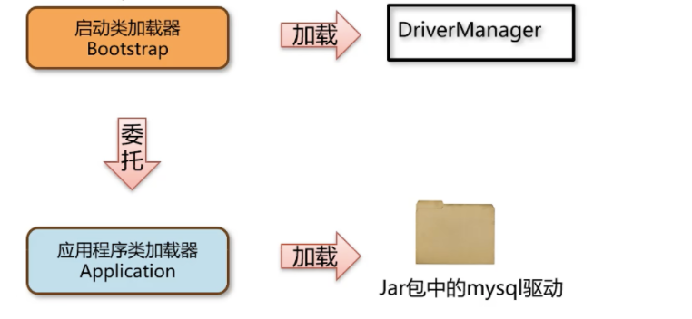


###### **SPI机制**

- SPI全称为（Service Provider Interface），是JDK内置的一种服务提供发现服务

- ⭐️‼️SPI的**工作原理**：

  > 1. **驱动jar包-------在ClassPath路径下的META-INFO/services文件夹中，以接口的全限名来命名文件夹，对应的文件里面写该接口的实现**
  >
  >    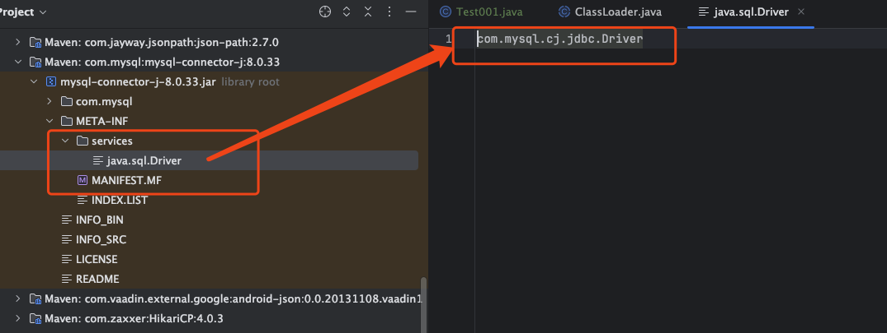
  >
  > 2. **使用ServiceLoader加载实现类---- DriverManager加载的是有个静态初始化的方法 加载驱动**
  >
  >    

- **DriverManager使用SPI机制，最终加载jar包中对应的驱动类**

  > 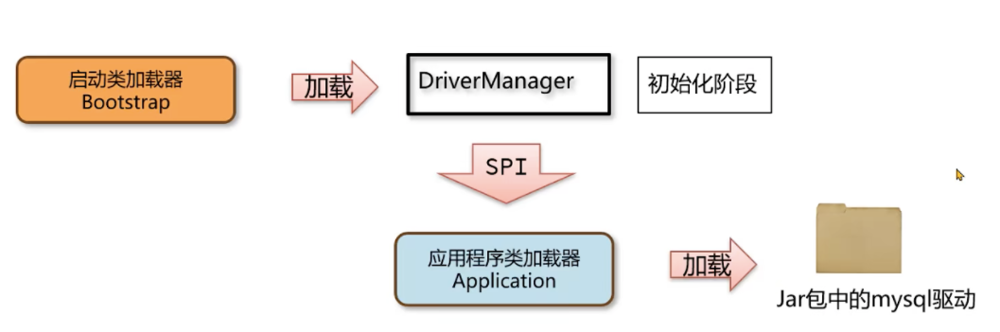


**JDBC案例总结**

- Bootstrap ClassLoader Load DriveManager
- 在初始化DriveManager的时候，通过SPI机制加载jar包中的mysql驱动
- SPI利用了线程上下文类加载器（ThreadContextClassLoader） 去加载并创建对象
- 这种由BootStrap ClassLoader加载的类，委派Application ClassLoader去加载类的方式，打破了双亲委派机制


> Java 提供了很多服务提供者接口（Service Provider Interface，SPI），允许第三方为这些接口提供实现。常见的 SPI 有 JDBC、JCE、JNDI、JAXP 和 JBI 等。
>
> 这些 SPI 的接口由 Java 核心库来提供，而这些 SPI 的实现代码则是作为 Java 应用所依赖的 jar 包被包含进类路径（CLASSPATH）里。SPI接口中的代码经常需要加载具体的实现类。那么问题来了，SPI的接口是Java核心库的一部分，是由**启动类加载器(Bootstrap Classloader)来加载的；SPI的实现类是由系统类加载器(System ClassLoader)**来加载的。引导类加载器是无法找到 SPI 的实现类的，因为依照双亲委派模型，BootstrapClassloader无法委派AppClassLoader来加载类。
>
> 而线程上下文类加载器破坏了“双亲委派模型”，可以在执行线程中抛弃双亲委派加载链模式，使程序可以逆向使用类加载器。


**JDBC案例中真的打破了双亲委派机制吗？？**

- **打破了**

  > 这种由启动类加载器加载的类，委派应用程序加载器去加载类的方式，打破了双亲委派机制

- **没有打破双亲委派机制**

  > ***JDBC只是在DriverManager加载完之后，通过初始化阶段触发了驱动类的加载，类的加载依然遵循双亲委派机制***


##### Osgi框架的类加载器

- 历史上，OSGI模块化框架。它存在同级之间的类加载器的委托加载。OSGI还使用类加载器实现了**热部署**的功能

  > 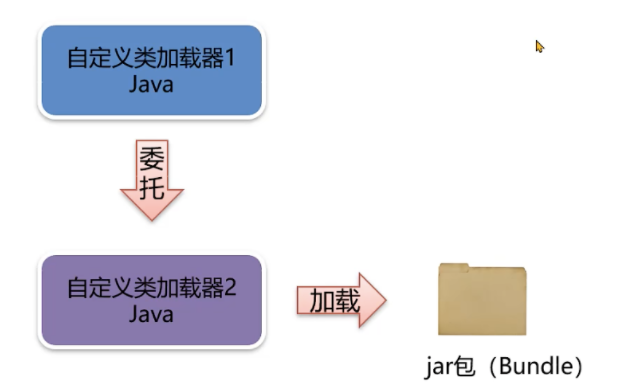

- 热部署指的是在服务不停止的情况下，动态地更新字节码文件到内存中。


**使用Arthas不停机解决线上问题**

> 只适合改极少数代码，已经不能停机的这种情况

**思路:**

- 在出问题的服务器上部署一个 arthas，并启动。
- jad --source-only 类全限定名 >目录/文件名javajad 命令反编译，然后可以用其它编译器，比如 vim 来修改源码
- mc -c 类加载器的hashcode 目录/文件名.java -d 输出目录mc 命令用来编译修改过的代码
- retransform class文件所在目录/xxx.class用 retransform 命令加载新的字节码

**注意事项：**

- 程序重启之后，字节码文件会恢复，除非将class文件放入jar包中进行更新。
- 使用retransform不能添加方法或者字段，也不能更新正在执行中的方法


#### 4）JDK9以后的类加载器

- JDK8之前的版本中，Extension ClassLoader 和Application ClassLoader的源码都是位于rt.jar包中的sun.misc.Launcher.java

  > 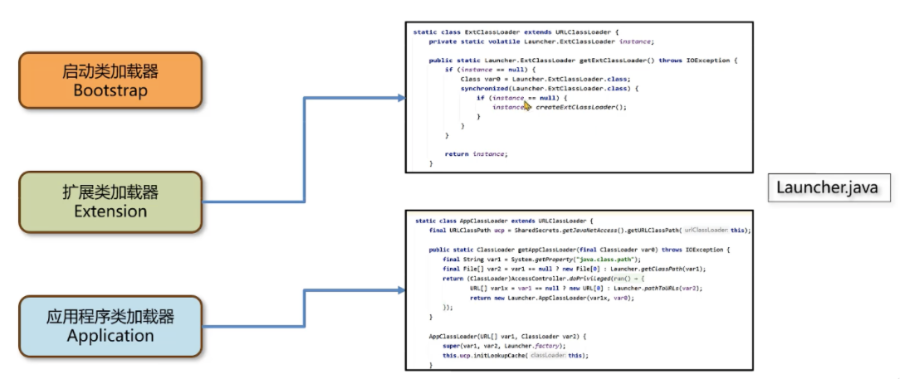

- JDK9引入类module打概念，类加载器在设计上发生了许多变化

  > 1. Bootstrap ClassLoader使用Java编写，位于jdk.internnal.loader.ClassLoaders类中
  >
  >    Java中的BootClassLoader即成BuiltinClassLoader实现从模块中找到要加载的字节码资源文件。
  >
  >    **Bootstrap ClassLoader依然无法通过java代码获取到，返回的仍然是null，为了保持统一。**
  >
  >    
  >
  > 2. Extension ClassLoader 被替换成Platform Class Loader ，Platform ClassLoader遵循模块化的方式加载字节码文件，所以继承关系从URLClassLoader变成了 BuiltinClassLoader，BuiltinClassLoader实现了从模块中加载字节码文件。**Platform Class Loader存在的更多的是与老版本的设计方案兼容，自身没有特殊的逻辑。**
  >
  >    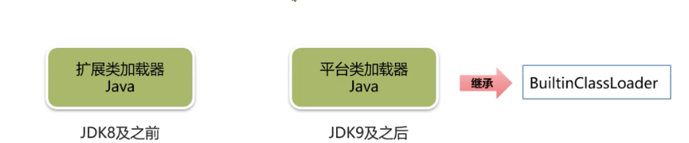

- 有几种加载器？

  > 1. 启动类加载器(Bootstrap ClassLoader) 加载核心类
  > 2. 扩展类加载器 (Extension ClassLoader) 加载扩展类
  > 3. 应用程序类加载器 (Application ClassLoader) 加载应用classpath中的类
  > 4. 自定义类加载器，重写findClass方法
  > 5. JDK9及之后扩展类加载器(Extension ClassLoader) 变成了平台类加载器(Platform ClassLoader)

  > **JDK8** 
  >
  > 
  > 

  

---


##  JVM的内存区域

> 就是运行时数据区域（JVM管理的内存）
>
> 

主要分为四部分

- 程序计数器
- 栈
- 堆
- 方法区
- **直接内存（不属于JVM管理的）**


### 运行时数据区

- Java虚拟机在运行Java程序过程中管理的内存区域，称之为运行时数据区
- 《Java虚拟机规范》中规范了每一部分的作用。


#### 1）程序计数器

- 程序计数器（Program Counter Register ）也叫PC寄存器，每个线程会通过程序计数器记录当前要执行的字节码指令的地址

  > 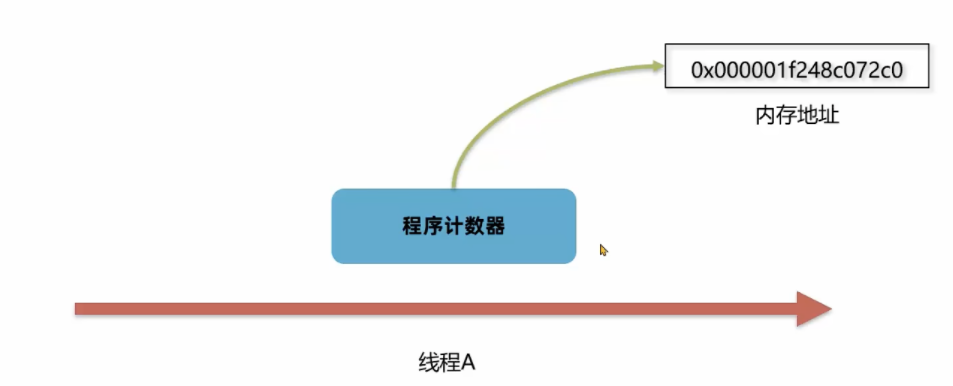

  

- 在代码执行过程中，程序计数器会记录下一行字节码指令的地址。执行完当前指令之后，虚拟机的执行引擎会根据**程序计数器**执行下一行指令。

**案例：**


> 🌟🌟**程序计数器会记住下一行偏移量的内存地址，执行完当前指令的时候，可以根据地址找到下一行指令。**

- 在多线程执行情况下，Java虚拟机需要通过程序计数器记录CPU**切换前解释执行到那一句指令**并继续运行

  > 先执行线程A，启动一个多线程执行线程B（那么A线程的程序计数器就会记录当前A所执行的内存地址或者说偏移量），那么当A等待的时候，B执行完的时候，开始执行A了，那么A线程就会称程序计数器中找到内存地址继续执行。
  >
  > 


**问题：**

程序计数器在运行中会出现内存溢出吗？

- 内存溢出指的是程序在使用某一块内存区域的时，存放的数据需要占用的内存大小超过了虚拟机能提供的内存上限
- 因为每个线程只存储一个固定长度的内存地址，**程序计数器是不会发生内存溢出的。**
- 程序员无需对程序计数器做任何处理


#### 2）栈-Stack

Java虚拟机栈（Java Virtual Machine Stack）采用栈的数据结构来管理调用中的基本数据，后进后出（first in last out），每一个方法的调用使用一个栈帧来（Stack Frame）来保存。


**使用IDEA来debug的时候，打断点可以查看对应的栈帧**

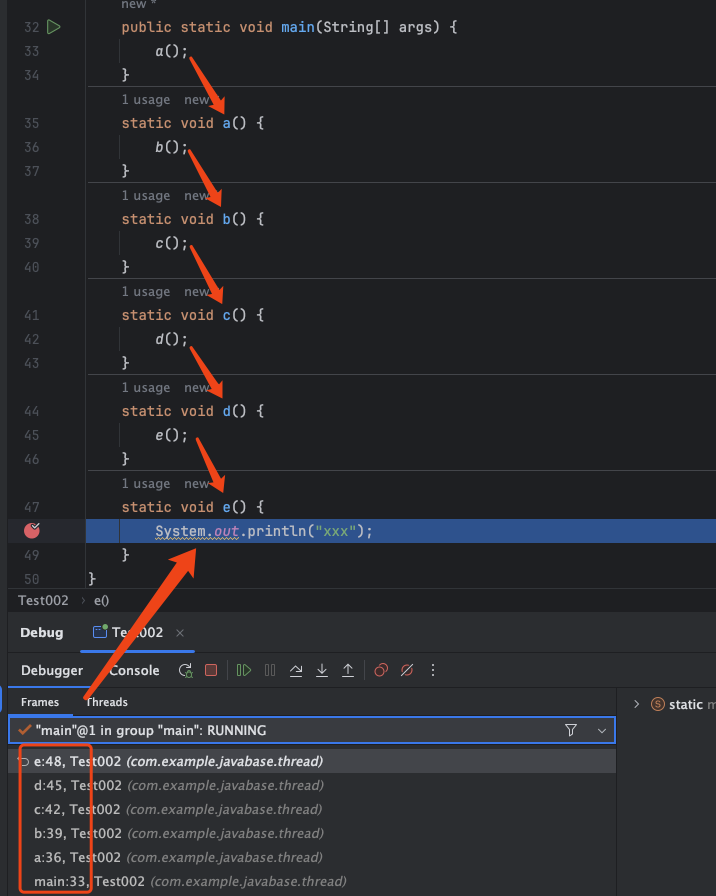

**当抛出一个异常的时候，也会一个个退出栈帧。日志中会显示。**


- Java虚拟机栈随着线程创建而创建，而回收则会在线程的销毁时进行。由于方法可能会在不同线程中执行，每个线程都会包含一个自己的虚拟机栈。

  > 


**栈帧的组成**

- **局部变量表**

  > 局部变量表的作用是在运行过程中存放所有的局部变量

- **操作数栈**

  > 操作数栈时栈帧中虚拟机在执行指令过程中用来存放临时数据的一块区域

- **帧数据**

  > 帧数据主要包含动态链接、方法出口、异常表的引用


###### 局部变量表

- 局部变量表的作用是在方法执行过程存放所有的局部变量。编译成字节码文件时就可以确定局部变量表的内容

  > ```java
  > public static void test() {
  >         int i = 0;
  >         int j = 1;
  >     }
  > ```
  >
  > 字节码指令：
  >
  > ```bytecode
  > 0 iconst_0
  > 1 istore_0
  > 2 iconst_1
  > 3 istore_1
  > 4 return
  > ```
  >
  > 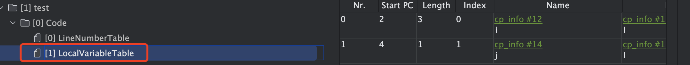
  >
  > Strat PC 从第第一行开始例如 i=0 那么就是**1 istore_0**

- 栈帧中的局部变量表是一个数组，数组中每一个位置称之为槽（slot），***Long*和*Double*类型占用两个槽**，其他类型占用一个槽。

  > Code:
  >
  > ```java
  >  public static void test() {
  >         int i = 0;
  >         long j = 1;
  >         int k = 2;
  >     }
  > ```
  >
  > 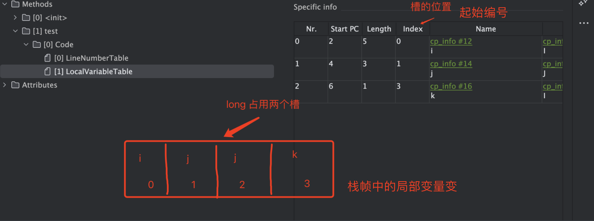
  >
  > 

**为什么不能在静态方法中使用this？**

> 🌟‼️**如果该方法是static的，那么不能在该方法中使用this，因为this代表实例对象，那么static随着类加载而加载，先于实例之前就创建了，不存在局部变量表中，所以不能使用**	


- 方法参数也会保存在局部变量表中，其顺序与方法中参数定义的顺序一致

- 局部变量表保存的内容有：实力方法的this对象，方法的参数，方法体中声明的局部变量。

  > 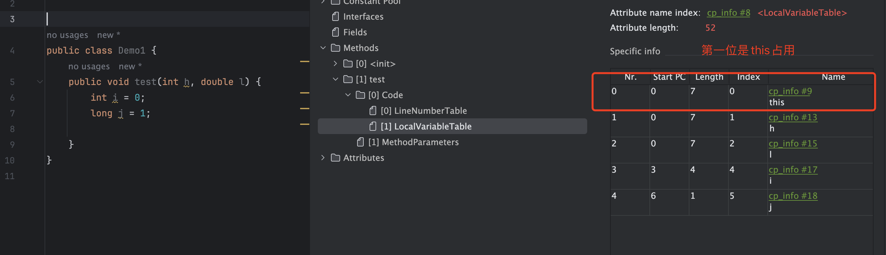

- 为了节省空间，局部变量表中的槽是可以复用的，一旦某个局部变量不再生效，当前槽就可以再次被使用

  > ```
  >  0 iconst_0
  >  1 istore_3
  >  2 iconst_1
  >  3 istore 4
  >  5 iconst_1
  >  6 istore_3
  >  7 iconst_0
  >  8 istore_3
  >  9 iconst_1
  > 10 istore 4
  > 12 return
  > ```
  >
  > 
  >
  > **局部变量表**
  >
  > | this | k    | m    | 第一次存a、第二次的时候存了c | 第一次存b 第二次存了i | j    |
  > | ---- | ---- | ---- | ---------------------------- | --------------------- | ---- |
  > | 0    | 1    | 2    | 3                            | 4                     | 5    |


###### **操作数栈**

- 操作数栈是栈帧中虚拟机在执行指令过程中用来存放中间数据的一块区域。他是一种栈式的数据结构，如果一条指令将一个值压入操作数栈，则后面的指令可以弹出并使用该值。

- 在**编译期**就可以确定操作数栈的最大深度，从而在执行时正确的分配内存大小。

  > 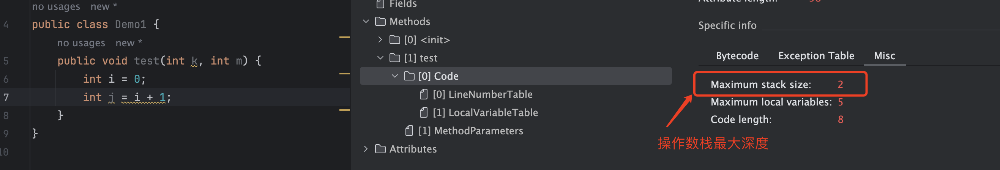
  >
  > ```
  > 0 iconst_0
  > 1 istore_3
  > 2 iload_3
  > 3 iconst_1
  > 4 iadd
  > 5 istore 4
  > 7 return
  > ```
  >
  > 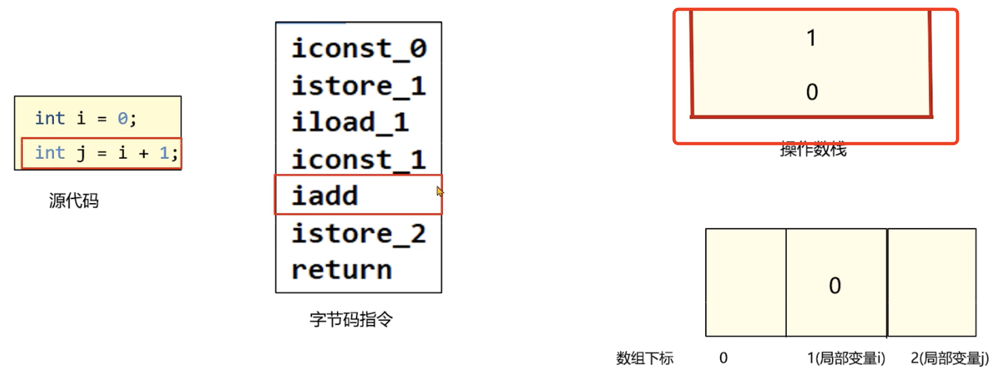
  >
  > > 先入栈为0 ，然后在入栈1 然后操作数栈直接相加变成1，然后在存储局部变量表中j为1
  >
  > 


###### 帧数据

- 当前类的字节码指令引用了其他类的属性或者方法时，需要将符号引用（编号）转换对应的运行时常量池中的内存地址。动态链接就保存了编号到常量池的内存地址的映射关系。

  > 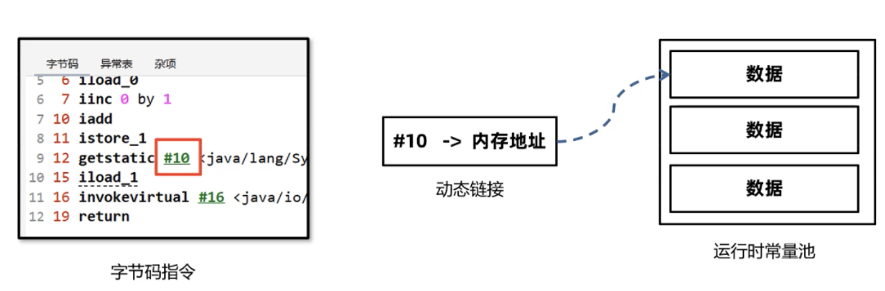
  >
  > A类调用B类的方法
  >
  > 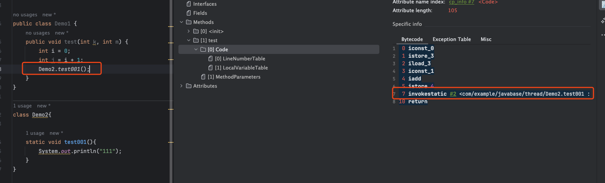

- **方法出口**指的是方法在正确或者异常结束的时候。当前栈帧会被弹出，同时程序计数器应该指向上一个栈帧中的下一条指令的地址。所以在当前栈帧中，需要存储此方法出口的地址。

  > 

- **异常表存**放的是代码中异常的处理信息，包含了try代码块和catch代码块执行后跳转到到字节码指令位置

  > **Code:**
  >
  > ```java
  >  public void test() {
  >         try {
  >             int i = 0;
  >         } catch (Exception e) {
  >             int j = 1;
  >         } finally {
  >             int i = 2;
  >         }
  >     }
  > ```
  >
  > **字节码：**
  >
  > ```java
  >  0 iconst_0
  >  1 istore_1
  >  2 iconst_2
  >  3 istore_1
  >  4 goto 21 (+17)
  >  7 astore_1
  >  8 iconst_1
  >  9 istore_2
  > 10 iconst_2
  > 11 istore_1
  > 12 goto 21 (+9)
  > 15 astore_3
  > 16 iconst_2
  > 17 istore 4
  > 19 aload_3
  > 20 athrow
  > 21 return
  > ```
  >
  > 异常的时候， **7 astore_1**
  >
  > 


###### 栈内存溢出

- Java虚拟机栈如果栈帧过多，占用内存超过栈内存可以分配到最大大小就会出现内存溢出。

- Java虚拟机栈内存溢出时会初选StackOverFlowError到错误

  > **模拟栈内存溢出**
  >
  > ```java
  > public class Demo1 {
  >     private static AtomicInteger atomicInteger = new AtomicInteger();
  >     public static void main(String[] args) {
  >         test();
  >     }
  >     public static void test() {
  >         System.out.println(atomicInteger.incrementAndGet());
  >         test();
  >     }
  > }
  > ```
  >
  > **溢出报错**
  >
  > 

- 如果我们不指定虚拟机栈的大小，JVM将创建一个具有**默认大小的栈**。大小取决于操作系统和计算机的体系结构。

  > 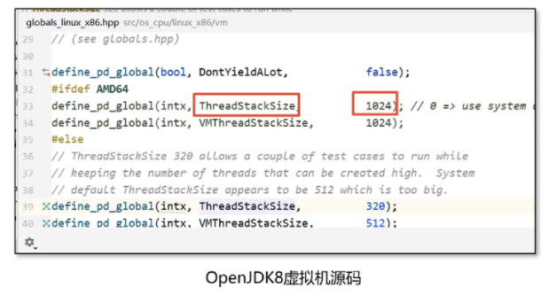
  >
  > 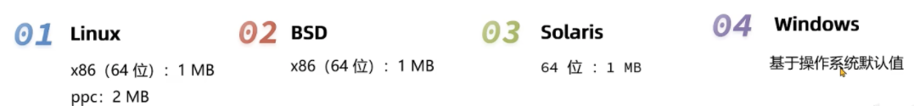
  >
  > 

  - ***修改Java虚拟机栈的大小***

    > - **要修改Java虚拟机栈的大小，可以使用虚拟机参数 -Xss**
    > - **语法：**-Xss栈大小
    > - 单位：字节（默认，必须时1024的倍数），k或者K（KB），m或者M（MB），g或者G（GB）
    >
    > 案例：
    >
    > 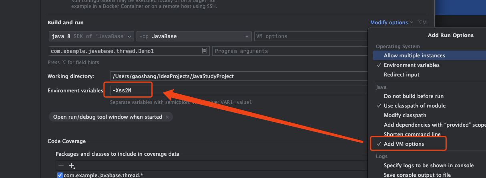
    >
    > 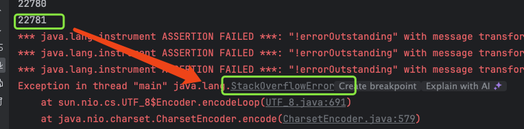

**🌟🌟Tips：**

1. 与-Xss类似，也可以使用-XX:ThreadStackSize调整标志来配置堆栈大小，格式-XX:ThreadStackSize=1024

2. HotSpot JVM对栈大小的最大值和最小值有要求：

   > 比如测试如下两个参数 -Xss1k     -Xss1025m。  Windows（64）下的JDK8测试下最小值为180k，最大值为1024m

3. 局部变量过多、操作数栈深度过大也会影响栈内存的大小

   > 一般情况下，工作中即便使用了递归进行操作，栈的深度最多也只能到几百,不会出现栈的溢出。所以此参数可以手动指定为-Xss256k节省内存


###### **本地方法栈**

- Java虚拟机栈存储了Java方法调用时的栈帧，而本地方法栈存储的是native本地方法的栈帧。

- 在Hotspot虚拟机中，**Java虚拟机栈和本地方法栈实现使用了同一个栈空间。**本地方法栈会在栈内存上生成一个栈帧，临时保存方法的参数 同时方便出现异常时也把本地方法的栈信息打印出来。

  > 


#### 3）堆-Heap

- 一般Java程序中堆内存是空间最大的一块内存区域。创建出来的对象都存于堆上。

- 栈上的局部变量表中，可以存放堆上对象的引用。静态变量也可以存放堆对象的引用，通过静态变量就可以实现对象在线程之间共享。

  > 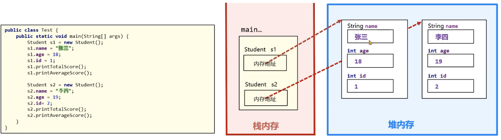


##### **模拟Heap 内存溢出**

> 当heap内存达到上限的时候，就会**OutOfMemoryError**
>
> 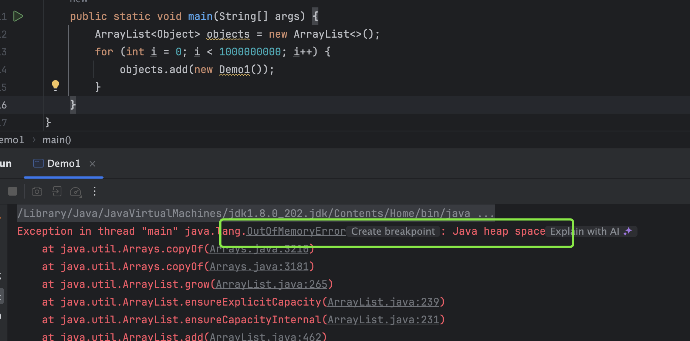

- Heap Space有个三个需要关注的值，**used、total、max**

  > **used**指的是当前已使用的堆内存，**total**是Java虚拟机已经分配的可用堆内存，**max**是Java虚拟机可以分配的最大内存。
  >
  > 

- 随着堆中对象增多，当total可以使用的内存即将不足时，java虚拟机会继续分配内存空间给堆。

  > 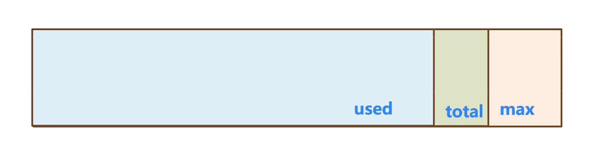

- 如果heap呢存不足，Java虚拟机就会不断的分配内存，total值会变大。total最多只能与max相等。

  > 

**Arthas观察内存变化**

> dashboard -i 2000
>
> 发现usage逐渐增加 直至崩溃
>
> 

**问题：**

是不是当used=max=total的时候，堆内存就溢出？

> 不是，堆内存溢出的判断条件比较复杂

- Heap设置大小

  > 要修改heap的大小，可以使用虚拟机参数 **-Xmx（max最大值）和-Xms（初始的total）**
  >
  > - 单位：字节（默认，必须时1024的倍数），k或者K（KB），m或者M（MB），g或者G（GB）
  > - 限制Xmx必须大于 2MB，Xms必须大于1MB
  >
  > 
  >
  > JVM参数：
  >
  > 
  >
  > Arthas的dashboard：
  >
  > 

  

  **问题？**

  为什么arthas中显示的heap堆大小与设置的值不一样呢?

  > arthas中的heap堆内存使用了JMX技术中内存获取方式，这种方式与垃圾回收器有关，计算的是可以分配对象的内存，而不是整个内存。

- Java服务端程序开发时，**建议将-Xmx和-Xms设置为相同的值**，这样在程序启动之后可使用的总内存就是最大内存，而无需向java虚拟机再次申请，减少了申请并分配内存时间上的开销，同时也不会出现内存过剩之后堆收缩的情况。

  > 


#### 4）方法区-Method Area


#### 5）直接内存（不属于JVM）


**面试题 TODO**

- Java的内存分成几部分？详细介绍一下吧

- Java内存中，哪些部分会内存溢出

- JDK7和JDK8在内存结构上的区别是什么？

  


方法区


> 7以后的版本 intern方法保存的是对象的**引用**


 


## JVM的垃圾回收


# 2、实战篇


# 3、高级篇


# 4、原理篇


# 5、面试题

