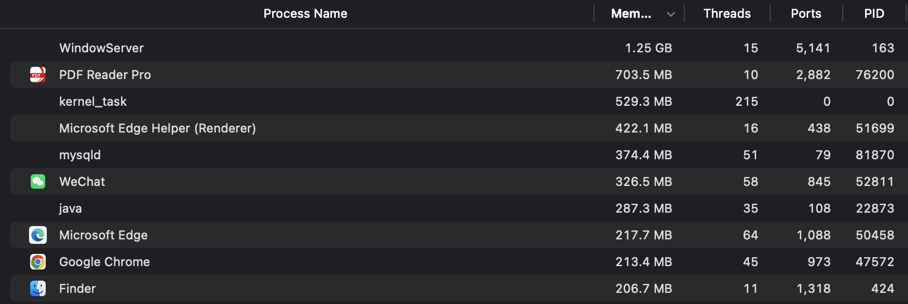
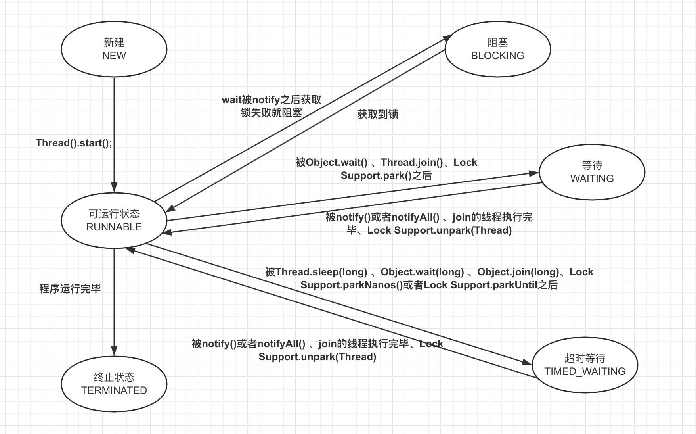

# 并发基础


## 什么是进程？

进程是计算机中的程序关于某数据集合上的一次运行活动，是系统进行资源分配和调度的基本单位，也是操作系统结构的基础。在早期面向进程设计的计算机结构中，进程是程序的基本执行实体；在当代面向线程设计的计算机结构中，进程是线程的容器。

> 每个启动的应用都是一个进程




## 什么是线程

线程是操作系统能够进行运算调度的最小单位。它被包含在进程之中，是进程中的实际运作单位。一条线程指的是进程中一个单一顺序的控制流，一个进程中可以并发多个线程，每条线程并行执行不同的任务。

Java线程是Java语言中的一种基本执行单位，它可以独立地运行在操作系统的线程上下文中，执行代码并完成特定的任务。线程是轻量级的，因为线程间切换的代价很小，允许多个线程同时执行，从而提高了程序的并发性和效率。


### 创建线程的方式

在Java中，创建线程通常有两种方式：继承 `Thread` 类和实现 `Runnable` 接口。

实现 `Runnable` 接口

```java
public class ThreadDemo implements Runnable {
   @Override
    public void run() {
        log.info("implementsRunnableName :" + Thread.currentThread().getName());
    }
}
//////调用
ThreadDemo threadDemo = new ThreadDemo();
// 启动一个新的线程
new Thread(threadDemo).start();
```

继承 `Thread` 

```java
public class ThreadDemo2 extends Thread {
    @Override
    public void run() {
        log.info("extendThreadName :" + Thread.currentThread().getName());
    }
}
//////调用
 ThreadDemo2 threadDemo2 = new ThreadDemo2();
 threadDemo2.start();
```


### 线程的状态

可以有以下六种状态

- NEW 新建
- RUNNABLE 可运行
- BLOCKED 阻塞
- WAITING 等待
- TIMED WATING 计时等待
- TERMINATE 终止




线程的管理包括控制线程状态、线程优先级、线程同步等。

Java中的每个对象都有一个监视器，来监测并发代码的重入。在非多线程编码时该监视器不发挥作用，反之如果在`synchronized`范围内，监视器发挥作用。`wait/notify`必须存在于`synchronized`块中。

Java线程模型是面向对象的。Java通过`Thread`类将线程所必须的功能都封装了起来。要想建立一个线程，必须要有一个线程执行函数，这个线程执行函数对应`Thread`类的`run`方法。`Thread`类还有一个`start`方法，这个方法负责建立线程，相当于调用Windows的建立线程函数`CreateThread`。当调用`start`方法后，如果线程建立成功，并自动调用`Thread`类的`run`方法。

