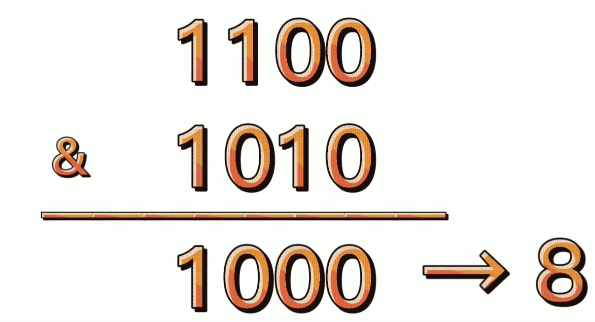
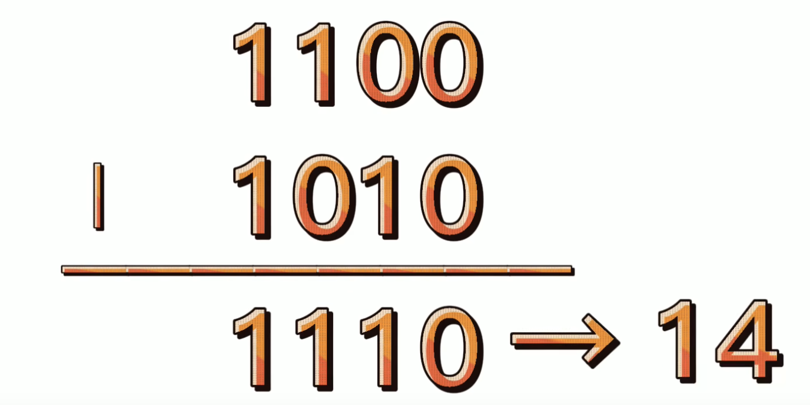
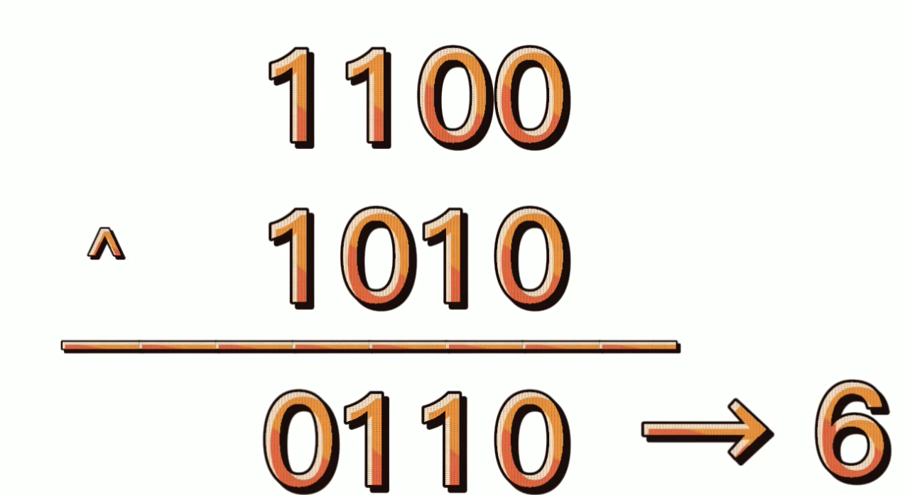
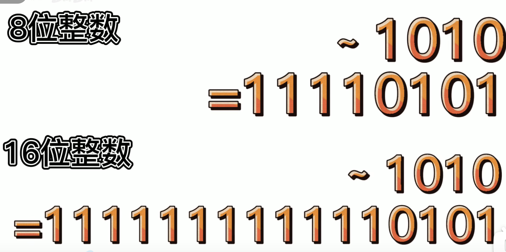

## 一、位运算的基础

> [b站学习，魔性学习](:https://www.bilibili.com/video/BV1YT4y117AH/?p=2&spm_id_from=pageDriver&vd_source=a20ecb9885592a04cda8e0c3cf4ae1f1)

#### 1.逻辑位运算符

**位与**

```
需要两个二进制做位与
1100 & 1010
结果：1000
只有两个数都为1的时候 结果为1 在转位10进制 就是8
```

> 
>
> 

**位或**

```
1100 | 1010
答案：1110
只有两个数都为0的时候 结果为0  在转位10进制 就是14
```

>  

**异或**

```
1100 ^ 1010
答案：0110 
两个数不一样的时候 结果才为1    结果6
```

> 

**按位取反**

```
当前数字转为二进制，然后逐一取反
高位不足的时候默认为0
```

> 


#### 2.位移运算符

**左移**

x << y


转化为二进制，然后偏移y位，然后补0，可以看位对x乘以2


**右移**

1100>> 3

非负数，高位补0，负数就高位补1 可以对x除以2并且向下取整


## 二、位运算的应用

两种状态，可以用一个位表示。可以用0和1 表示，

三种状态，只能用两个位表示。可以用0 1 10


初始：就是0000

点赞：0001

投一个bi：0010

投两个bi：0100

收藏：1000

一键三连：1101


位运算学习

计算一个数字的二进制，计算方式如下：

当然可以。将十进制数16转换为二进制的过程如下：

1. 将16除以2，得到商8余数0。
2. 将商8除以2，得到商4余数0。
3. 将商4除以2，得到商2余数0。
4. 将商2除以2，得到商1余数0。
5. 最后将商1除以2，得到商0余数1。

现在，我们将得到的余数从下到上**（逆序）排列**，即为二进制的结果。所以，十进制数16的二进制表示为10000。

这个过程可以用以下的表格来表示：

| 十进制数 | 除以2的商 | 余数 |
|-------|--------|----|
| 16    | 8      | 0  |
| 8     | 4      | 0  |
| 4     | 2      | 0  |
| 2     | 1      | 0  |
| 1     | 0      | 1  |

因此，**16** 的二进制表示为 **10000**。

#### 总结

当然可以。位运算是一种对整数在二进制位级别上进行操作的方法，它包括以下几种基本操作：

- **与运算（&）**：当两个位都为1时，结果才为1，否则为0。例如：`3 & 5` 得到 `1`，因为 `0011 & 0101 = 0001`。
- **或运算（|）**：当两个位中至少有一个为1时，结果就为1，否则为0。例如：`3 | 5` 得到 `7`，因为 `0011 | 0101 = 0111`。
- **异或运算（^）**：当两个位相异时，结果为1，相同则为0。例如：`3 ^ 5` 得到 `6`，因为 `0011 ^ 0101 = 0110`。
- **取反运算（~）**：位取反，即0变1，1变0。例如：`~3` 得到 `-4`，因为 `~0011 = 1100`（在8位二进制表示中）。
- **左移运算（<<）**：将二进制位左移指定的位数，右边补0。例如：`3 << 2` 得到 `12`，因为 `0011 << 2 = 1100`。
- **右移运算（>>）**：将二进制位右移指定的位数，左边补0或符号位。例如：`5 >> 1` 得到 `2`，因为 `0101 >> 1 = 0010`。

位运算在编程中非常有用，特别是在需要高效处理数据的场景下。它们通常比标准的算术运算要快，因为它们直接在数的二进制表示上操作，不涉及复杂的算术运算过程。

这里有一些位运算的实际应用例子：

- **判断奇偶**：使用 `x & 1` 来判断一个数 `x` 是奇数还是偶数。如果结果为0，则 `x` 是偶数；如果结果为1，则 `x` 是奇数。
- **交换两个数**：不使用临时变量交换两个数 `a` 和 `b` 的值，可以使用异或运算：`a ^= b; b ^= a; a ^= b;`。
- **设置或清除特定位**：使用或运算 `|` 来设置特定位，使用与运算 `&` 和取反 `~` 来清除特定位。

希望这些信息能帮助你理解位运算的基础知识。如果你想要更深入地学习位运算，可以参考一些在线教程和文档。