## RocketMQ学习

>https://www.bilibili.com/video/BV1cf4y157sz?spm_id_from=333.337.search-card.all.click
>
>MQ用途：限流削峰、异步解耦、数据收集（业务日志、监控数据、用户行为等）


## 分布式消息队列RocketMQ


## 1、基本概念

### 消息 Message

消息是指：消息系统所传输信息的物理载体，生产和消费数据的最小单位，每条消息必须数据一个**主题Topic**


### 主题 Topic

Topic表示一类消息的集合，每个主题包含了若干消息，每条消息只能属于一个主题，是RocketMq进行消息订阅的基本单位。

Topic:message	1:N		

message:Topic	 1:1

一个生产者可以同时发送多种Topic 的消息；而消费者只能对某种特定的Topic感兴趣，即只可以订阅和消费一种Topic的消息


### 标签 Tag

为消息设置的标签，用于**同一主题下区分不同类型的消息**。来自同一业务单元的消息，可以根据不同的业务目的在同一主题下设置不同标签。标签能够有效地保持代码的清晰度和连贯性，并优化RocketMq提供的查询系统。消费者可以根据Tag实现对不同子主题的不同消费逻辑，实现更好的扩展性。


### 队列 Queue

存储消息的物理实体，一个Topic可以包含多个Queue，每个Queue中存放的就是该Topic的消息，一个Topic的Queue也被称为一个Topic中的消息的分区（Partition）

一个Topic的Queue中的消息只能被一个消费组中的一个消费者消费。一个Queue中的消息不允许同一个消费者中的多个消费者同时消费


### 消息标识 MessageId/Key

RocketMQ中每个消息拥有唯一的MessageId，且可以携带具有业务标识的Key，以方便对消息的查询。不过需要注意的是，MessageId有两个：在生产者send() 消息时会自动生成一个MessageId（msgId），都消息到达Broker后，Broker也会自动生成一个MessageId（**offsetMsgId**）。MsgId、offsetMsgId与Key都称为消息标识。

* **msgId**：由producer端生成，其生成规则为：producerIp + 进程pid + MessageClientIdSetter类的calssLoader的hashcode + 当前时间 + AutonomicIntger自增计数器
* **offsetMsgId**：由broker端生成，其生成规则为：brokerIp+物理分区的offset（Queue中的偏移量）
* **key**：由用户指定的业务相关的唯一标识


## 2、系统架构

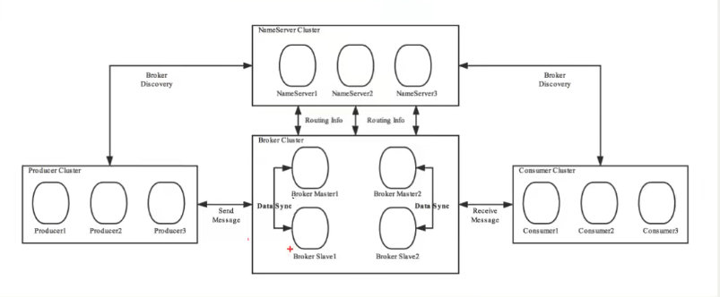


### Producer

消息生产者，负责生产消息。producer通过MQ的**负载均衡模块**选择相应的Broker集群队列中进行消息投递，投递的过程支持快速失败并且低延迟。

RocketMQ中的消息生产者都是以生产者组（Producer Group）的形式出现的。生产者组是同一类生产者的集合，这类Producer发送相同的Topic类型的消息，一个生产者组可以同时发送多个主题的消息。


### Consumer

消息消费者，负责消费消息。一个消息消费者会从Broker服务器中获取到消息，并对消息进行相关业务处理。

RocketMq中的消息消费者都是以消费者组（**Consumer Group**的形式出现的）消费者是同一类消费者的集合，这类Consumer消费的是同一个Topic类型的消息。消费者组使得在消息消费方面，实现负载均衡（**对于Queue来说，不是对消息进行负载均衡**）和容错的目标变得非常容易。


 消费者组中的Consumer的数量应该小于等于订阅Topic的Queue数量。如果超出Queue的数量，则多处的Consumer将不能消费信息。


不过，一个Topic类型的消息可以被多个消费者组同时消费

>**消费者组只能消费一个Topic的消息，不能同时消费多个Topic消息**
>
>**一个消费者组中的消费者必须订阅完全相同的Topic**


### Name Server

#### 功能介绍

> NameServer是一个Broker与Topic路由的**注册中心**，支持Broker的动态注册与发现。

主要包括两个功能：

* **Broker管理**：接受Broker集群的注册信息并且保存下来作为路由信息的基本信息；**提供心跳检测机制，检查Broker是否还存活**
* **路由信息管理**：每个NameServer中都保存着Broker集群的整个路由信息和用于客户端查询的队列信息。producer和consumer通过NameServer可以获取整个Broker集群的路由信息，从而进行消息的投递和消费。


#### 路由注册

NameServer通常也是以集群的方式部署，不过NameServer是无状态的，即NameServer集群中的各个节点是无差异的。各节点间相互不进行信息通讯。那各节点中的数据是如何进行数据同步的呢？**在Broker节点启动时，轮询NameServer列表，与每个NameServer节点建立长连接，发起注册请求**。在NameServer内部维护着一个Broker列表，用来动态存储Broker的信息。

>注意，这里与其他的ZK、Eureka、Nacos等注册中心不同的地方。
>
>这种NameServer的无状态方式，有什么优缺点：
>
>**优点**：NameServer集群搭建简单，扩容简单
>
>**缺点**：对于Broker，必须明确指出所有的NameServer地址。否则未指出的将不会去注册。也正因为如此，NameServer并不能随便扩容。因为，若Broker不重新配置，新增的NameServer对于Broker来说是不可见的，其不会向这个NameServer进行注册。

Broker节点为了证明自己是活着的，为了维护与NameServer间的长连接，会将最新的信息以心跳包的形式上报给NameServer，每30s发送一次心跳。心跳包中包含**BrokerId、Broker地址（Ip+port）、Broker名称、Broker所属集群名称**等等。NameServer在接收到心跳包后，会更新心跳时间戳，记录这个Broker的最新存活时间。


#### 路由剔除

由于Broker关机、宕机、网络抖动等原因，NameServer没有收到Broker的心跳，NameServer可能会将其从Broker列表中剔除。

NameServer中有一个定时任务，每隔10S就会扫描一次Broker表，查看每一个Broker的最新心跳时间戳距离当前时间是否超过120S，如果超过，则会判定Broker失效，然后将其从Broker列表中剔除。

>扩展：对于RocketMQ日常运维工作，例如Broker升级，需要停掉Broker的工作，OP（运维）需要怎么做？
>
>OP需要将Broker的读写权限禁用，一旦client（consumer、producer）向broker发送请求，都会收到broker的No_permission响应，然后client会进行对其他Broker的重试。
>
>当OP观察到这个Broker没有流量后，再关闭它，实现Broker从NameServer的移除。


#### 路由发现

RocketMQ的路由发现采用的是Pull模型。当Topic路由信息出现变化时，NameServer不会主动推送给客户端，而是客户端定时拉取主题最新的路由。默认客户端每30s会拉取一次最新的路由。

>扩展：
>
>**1）Push模型：**推送模型，其实效性较好，是一个“发布-订阅”模型，其需要**维护一个长连接**。而长连接的维护是需要资源成本的，该模型适合于的场景：
>
>* 实时性要求较高
>* Client的数量不多，Server数据变化频繁
>
>**2）Pull模型：**拉取模型。存在的问题是，实时性较差。
>
>**3）Long Polling（轮询）模型：**长轮询模型（Nacos）。是对Push和Pull模型的整合，充分利用了这两种模型的优势，屏蔽了它们的劣势
>
>*保持长连接，但是持续的时间不长。会持续尝试Pull*


#### 客户端NameServer选择策略

>这里的客户端指的是Producer与Consumer

客户端在配置时必须协商NameServer集群的地址，那么客户端到底连接的是哪个NameServer节点呢？客户端首先会产生一个随机数，然后再与NameServer节点数量取模，此时得到的就是所要连接的节点索引，然后就会进行连接。如果连接失败，则会采用round-robin策略，逐个尝试着去连接其他节点。

首先采用的是***随机策略***进行的选择，失败后采用的是***轮询策略***。

>扩展：zookeeper client是如何选择zookeeper server的？？？
>
>简单来说就是，经过两次Shuffle（随机），然后选择第一台zookeeper server
>
>详细说就是，将配置文件中的zookeeper server的地址进行第一次shuffle，然后再随机选择一个。这个选择出的一般都是一个hostname。然后获取到该hostname对应的所有的IP，在对这些IP进行第二次shuffle，从shuffle过的结果中去第一个server地址进行连接。


### Broker

#### 功能介绍

Broker充当着消息中转角色，负责存储消息、转发消息。Broker在RockerMQ系统中负责接收并存储从生产者发送来的消息，同时为消费者的拉取请求做准备。Broker同时也存储着消息相关的元数据，包含消费者组消费进度偏移offset、主题、队列等。

> Kafka 0.9版本之后，offset是存放在Broker中的，之前的版本是存放在Zookeeper中的

#### 模块构成

功能示意图如下：


 

| Remoting Module    | 整个Broker的实体，负责处理来自clients端的请求。而这个Broker实体则由以下模块构成 |
| ------------------ | ------------------------------------------------------------ |
| **Client Manager** | **客户端管理器，负责接收、解析、客户端（Producer/Consumer）请求，管理客户端。例如：维护Consumer的Topic订阅信息** |
| **Store Service**  | 存储服务。提供方便简单的API接口，处理***消息存储到物理硬盘***和***消息查询***功能 |
| **HA Service**     | **高可用服务，提供Master Broker和Slave Broker之间的数据同步功能** |
| **Index Service**  | **索引服务。根据特定的Message key，对投递到Broker的消息进行索引服务，同时也提供根据Message Key对消息进行快速查询的功能** |


#### 工作流程

1. 启动NameServer，NameServer启动后开始监听端口，等待Broker、Producer、Consumer连接。

2. 启动Broker时，Broker会与所有的NameServer建立并保持长连接，然后每30s向NameServer定时发送心跳包

3. 收发消息前，可以先创建Topic，创建Topic时需指定该Topic需要存储到哪些Broker上。当然，在创建Topic时会将Topic与Broker的关系写入到NameServer中。不过这步是可选的，也可以在发送消息时自动创建Topic。

4. Producer发送消息，启动时先跟NameServer集群中的某一台建立长连接，并从NameServer中获取路由信息，即当前发送的Topic消息的Queue与Broker的地址（IP+Port）的映射关系。然后根据算法策略从队列选择一个Queue，与队列所在的Broker建立长连接从而向Broker发消息。当然，在获取路由信息后，Produce会首先将路由信息缓存到本地，在每30s从NameServer更新一次路由信息。

5. Consumer和Producer类似，跟其中一台NameServer建立长连接，获取其所订阅Topic的路由信息，然后根据算法策略从路由信息中获取到其所要消费的Queue，然后直接跟Broker建立长连接，开始消费其中的消息。Consumer在获取路由信息后，同时也会每30s从NameServer更新一次路由信息。不过不同于Producer的是。Consumer还会向Broker发送心跳，以确保Broker的存活状态


#### Topic创建流程

手动创建Topic时，有两种模式：

* 集群模式：改模式下创建的Topic在该集群中，所有的Broker中的Queue数量是相同的。

* Broker模式：该模式下创建的Topic在该集群中，每个Broker中的Queue数量可以不同。

自动创建Topic时，默认采用的是Broker模式，会为每个**Broker默认创建四个Queue**

 

#### 读/写队列

从物理上来讲，读/写队列是同一个队列。所以，不存在读/写队列数据同步问题。读/写队列是逻辑上进行区分的概念。一般情况下，读/写对垒数量是相同的。

例如，创建Topic时，设置的写队列数量为8，读队列数量为4，此时系统会创建8个Queue，分别是0 1 2 3 4 5 6 7。Producer会将消息写入到这8个队列中，但Consumer只会消费0 1 2 3这4个队列中的消息，4 5 6 7中的消息是不会被消费到的。

再如，创建Topic时设置的写队列数量为4，读队列数量为8，此时系统会创建8个Queue，读队列数量为8，此时系统会创建8个Queue，分别是 0 1 2 3 4 5 6 7。Producer会将消息写入到0 1 2 3 这四个队列中，但是Consumer只会消费 0 1 2 3 4 5 6 7 这8个队列中的消息，但是4 5 6 7 中是没有消息的。此时假设Consumer Group中包含两个Consumer，Comsumer1 消费0 1 2 3，而Consumer2消费4 5 6 7。但是实际情况是，Consumer2是没有任何消息可以消费的。

**也就是说，当读/写队列数量设置为不同时，总是有问题的。那么，为什么要这样设计呢？**

这样设计的目的是为了，***方便Topic的Queue的缩容。***

```
例如，原来创建的Topic中包含16个Queue，如何能够使其Queue缩容为8个，还不会丢失消息？可以动态修改写队列数量为8，读队列数量不变。此时新的消息只会写入到前8个队列，而消费都消费的却是16个队列中的数据。当发现后8个Queue中的消息消费完毕后，就可以再将读队列数量动态设置为8.整个缩容过程，没有丢失任何消息。
```

perm用于设置当前创建Topic的操作权限：**2表示只写，4表示只读，6表示读写**


## 3、RocketMq的安装和启动

### 单机安装与启动

#### 软件下载

下载地址：

```
https://www.apache.org/dyn/closer.cgi?path=rocketmq/4.9.3/rocketmq-all-4.9.3-bin-release.zip
```

#### 修改初始内存

修改runserver.sh

```shell
JAVA_OPT="${JAVA_OPT} -server -Xms4g -Xmx4g -XX:MetaspaceSize=128m -XX:MaxMetaspaceSize=320m
-- 修改为
JAVA_OPT="${JAVA_OPT} -server -Xms256m -Xmx256m -XX:MetaspaceSize=128m -XX:MaxMetaspaceSize=320m"
```


修改runbroker.sh

```shell
JAVA_OPT="${JAVA_OPT} -server -Xms256m -Xmx256m"
```


#### 启动服务

启动NameServer

```shell
  > nohup sh bin/mqnamesrv &
  > tail -f ~/logs/rocketmqlogs/namesrv.log
  The Name Server boot success...
```

启动Broker

```shell
  > nohup sh bin/mqbroker -n localhost:9876 &
  > tail -f ~/logs/rocketmqlogs/broker.log 
  The broker[%s, 172.30.30.233:10911] boot success...
```

```
-- 注册成功
2022-05-03 22:29:56 INFO brokerOutApi_thread_2 - register broker[0]to name server localhost:9876 OK
```


#### 消息测试

```shell
 > export NAMESRV_ADDR=localhost:9876
 > sh bin/tools.sh org.apache.rocketmq.example.quickstart.Producer
 SendResult [sendStatus=SEND_OK, msgId= ...

 > sh bin/tools.sh org.apache.rocketmq.example.quickstart.Consumer
 ConsumeMessageThread_%d Receive New Messages: [MessageExt...
```

**发送消息**

```
SendResult [sendStatus=SEND_OK, msgId=7F000001A3E530F399910F2AB16903E1, offsetMsgId=C0A8BF8700002A9F000000000002E858, messageQueue=MessageQueue [topic=TopicTest, brokerName=pinyoyougou-docker, queueId=3], queueOffset=247]
SendResult [sendStatus=SEND_OK, msgId=7F000001A3E530F399910F2AB19D03E2, offsetMsgId=C0A8BF8700002A9F000000000002E918, messageQueue=MessageQueue [topic=TopicTest, brokerName=pinyoyougou-docker, queueId=0], queueOffset=249]
SendResult [sendStatus=SEND_OK, msgId=7F000001A3E530F399910F2AB1B203E3, offsetMsgId=C0A8BF8700002A9F000000000002E9D8, messageQueue=MessageQueue [topic=TopicTest, brokerName=pinyoyougou-docker, queueId=1], queueOffset=249]
SendResult [sendStatus=SEND_OK, msgId=7F000001A3E530F399910F2AB1B503E4, offsetMsgId=C0A8BF8700002A9F000000000002EA98, messageQueue=MessageQueue [topic=TopicTest, brokerName=pinyoyougou-docker, queueId=2], queueOffset=248]
```

**消费消息**

```
ConsumeMessageThread_please_rename_unique_group_name_4_3 Receive New Messages: [MessageExt [brokerName=pinyoyougou-docker, queueId=0, storeSize=192, queueOffset=157, sysFlag=0, bornTimestamp=1651588850813, bornHost=/192.168.191.135:55076, storeTimestamp=1651588850822, storeHost=/192.168.191.135:10911, msgId=C0A8BF8700002A9F000000000001D518, commitLogOffset=120088, bodyCRC=1319182829, reconsumeTimes=0, preparedTransactionOffset=0, toString()=Message{topic='TopicTest', flag=0, properties={MIN_OFFSET=0, MAX_OFFSET=250, CONSUME_START_TIME=1651589065951, UNIQ_KEY=7F000001A3E530F399910F2A9C7D0272, CLUSTER=DefaultCluster, TAGS=TagA}, body=[72, 101, 108, 108, 111, 32, 82, 111, 99, 107, 101, 116, 77, 81, 32, 54, 50, 57], transactionId='null'}]] 

```

**关闭服务**

```shell
> sh bin/mqshutdown broker
The mqbroker(36695) is running...
Send shutdown request to mqbroker(36695) OK

> sh bin/mqshutdown namesrv
The mqnamesrv(36664) is running...
Send shutdown request to mqnamesrv(36664) OK
```


### 控制台的安装

#### 下载

```
https://github.com/apache/rocketmq-externals/releases/tag/rocketmq-console-1.0.0
```

**修改配置**

```properties
server.contextPath=
server.port=7000
#spring.application.index=true
spring.application.name=rocketmq-console
spring.http.encoding.charset=UTF-8
spring.http.encoding.enabled=true
spring.http.encoding.force=true
logging.config=classpath:logback.xml
#if this value is empty,use env value rocketmq.config.namesrvAddr  NAMESRV_ADDR | now, you can set it in ops page.default localhost:9876
rocketmq.config.namesrvAddr=192.168.191.135:9876
#if you use rocketmq version < 3.5.8, rocketmq.config.isVIPChannel should be false.default true
rocketmq.config.isVIPChannel=
#rocketmq-console's data path:dashboard/monitor
rocketmq.config.dataPath=/tmp/rocketmq-console/data
#set it false if you don't want use dashboard.default true
rocketmq.config.enableDashBoardCollect=true
```

#### 添加依赖

```xml
<dependency>
    <groupId>javax.xml.bind</groupId>
    <artifactId>jaxb-api</artifactId>
    <version>2.3.0</version>
</dependency>

<dependency>
    <groupId>com.sun.xml.bind</groupId>
    <artifactId>jaxb-impl</artifactId>
    <version>2.3.0</version>
</dependency>
<dependency>
    <groupId>com.sun.xml.bind</groupId>
    <artifactId>jaxb-core</artifactId>
    <version>2.3.0</version>
</dependency>
<dependency>
    <groupId>javax.activation</groupId>
    <artifactId>activation</artifactId>
    <version>1.1.1</version>
</dependency>

```


#### 打包

```
mvn clean package -Dmaven.test.skip=true
```

#### 启动

```
java -jar rocketmq-console-ng-1.0.0.jar
```

#### 访问

```
http://localhost:7000/#/
```

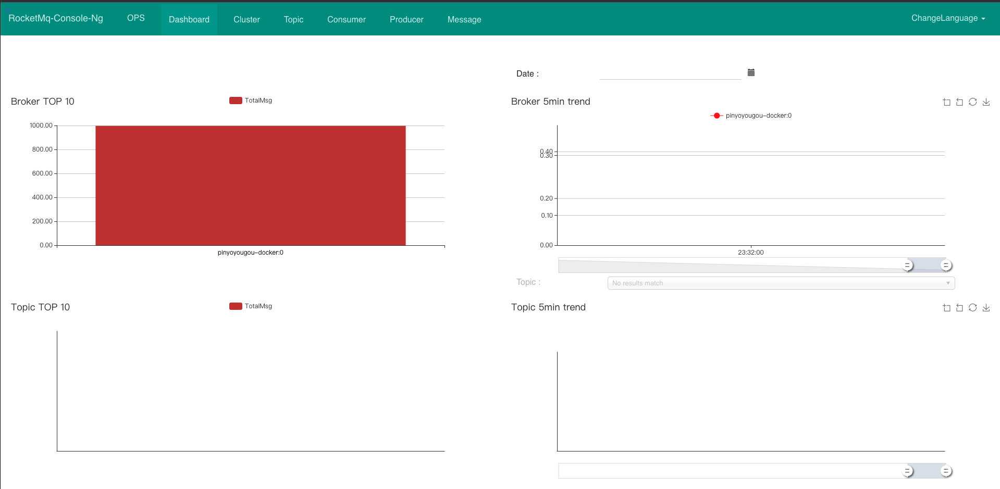


### 集群搭建理论


### 磁盘阵列RAID


### 集群搭建


### mqadmin命令

>在mq解压目录的bin目录下有一个mqadmin命令，该命令是一个运维指令，用于对MQ的主题，集群，broker等信息进行管理

修改bin/tool.sh

在运行mqadmin命令之前，先要修改mq解压目录下bin/tools.sh 配置的jdk的ext目录位置。本机的ext目录在/usr/java/jdk1.8.0——161/jre/lib/ext

运维文档：https://github.com/apache/rocketmq/blob/master/docs/cn/operation.md


## RockeMQ工作原理

### 一、消息的产生

#### 消息的生产过程

Producer可以将消息写入到某Broker中的某Queue中，其经历如下过程：

* Producer发送消息之前，会先向NameServer发出获取消息Topic的**路由信息的**请求
* NameServer返回该Topic的**路由表**及**Broker列表**
* Producer根据代码中指定的Queue选择策略，从Queue列表中选择一个队列，用于后续存储消息
* Producer对消息做一些特殊处理，例如**消息本身超过4M，会对其进行压缩**
* Producer向选择出的Queue所在的Broker发出RPC请求，将消息发送到选择出的Queue

>路由表：实际是一个Map，Key为Topic名称，value是一个QueueData实例列表。QueueData并不是一个Queue对应一个QueueData，而是一个Broker中该Topic的所有Queue对应一个QueueData。即，只要涉及到该Topic的Broker，一个Broker对应一个QueueData。QueueData包含brokerName。简单来说，路由表的key为Topic的名称，value则为所有涉及到该Topic到BrokerName列表


#### Queue的选择算法

对于无序消息，其Queue选择算法，也称为投递算法，常见的有两种：

**轮询算法**

默认选择算法。该算法保证了每个Queue中可以均匀的获取到消息。

>该算法存在一个问题：由于某些原因，在某些Broker上的Queue可能投递延迟较严重。从而导致Producer 的缓存队列中出现较大的消息堆积，影响消息的投递性能。

**最小投递延迟算法**

该算法会统计每次消息投递的时间延迟，然后根据统计出的结果将消息投递到时间延迟最小的Queue。如果延迟相同，则采用轮询算法投递。该算法可以有效提升消息的投递性能。

> 该算法也存在一个问题：消息在Queue上的分配不均匀。投递延迟小的Queue其可能会存在大量的消息。而对该Queue的消费者压力会增大，降低消息的消费能咯，可能导致MQ中的消息堆积。


### 二、消息的存储

RocketMQ中的消息存储在本地文件系统中，这些相关文件默认存储在当前用户主目录下的store目录下

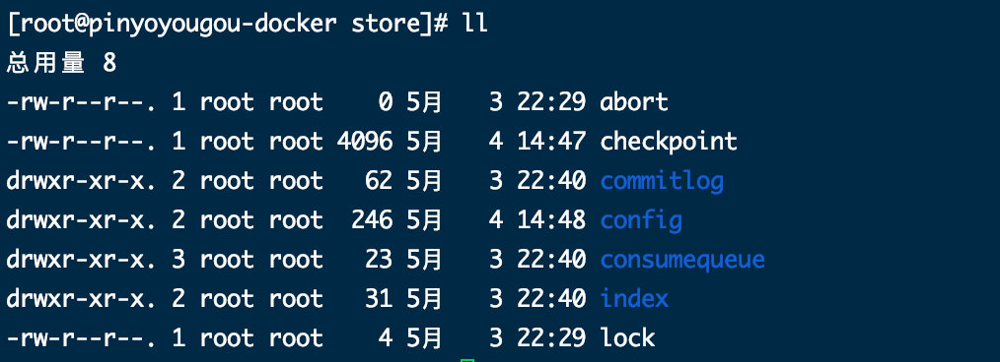

| Abort（终止）    | 该文件在Broker启动后会自动创建，正常关闭Broker，该文件会自动消失。若没有启动Broker的情况下，发现这个文件是存在的，则说明之前的Broker的关闭时非正常关闭的。 |
| ---------------- | ------------------------------------------------------------ |
| **checkpoint**   | 存放着commitlog、consumequeue、index文件的最后刷盘时间戳     |
| **commitlog**    | 存放着commitlog文件，而消息是写在commitlog文件中的           |
| **config**       | 存放着Broker运行期间的一些配置数据                           |
| **consumequeue** | 存放着consumequeue文件，队列就存放在这个目录下               |
| **index**        | 其中存放着消息索引文件indexFile                              |
| **lock**         | 运行期间使用到全局资源锁                                     |


#### commitlog文件

>说明：在很多资料总commitlog目录中的文件简单就称为commitlog文件。但是在源码中，该文件被命名为mappedFile。

**目录与文件**

commitlog目录中存放着很多mappedFile文件，当前Broker中的所有消息都落盘到这些mappedFile文件中。mappedFile文件大小为1G（小于等于1G），文件名由20位十进制数构成，表示当前文件的第一条消息的起始位移偏移量。

>第一个文件名一定是20位0构成的。因为第一个文件的第一条消息的偏移量commitlog offset为0
>
>当第一个文件放满时，则会自动生成第二个文件继续存放消息。假设第一个文件大小是1073741820（1G=1073741824字节），则第二个文件名就是00000000001073741820
>
>以此类推，第n个文件名应该是前n-1个文件大小之后
>
>一个Broker中所有mappedFile文件的commitlog offset是连续的

需要注意的是，一个Broker中仅包含一个commitlog目录，所有的mappedFile文件都说是存放在该目录下的。即无论当前Broker中存放着多少Topic的消息，这些消息都说被顺序写入到了mappedFile文件中的。也就是说，这些消息在Broker中存放时并没有按照Topic进行分类存放的。

>mappedFile 文件是顺序读写的文件，所有其访问效率很高
>
>无论是SSD磁盘还是SATA磁盘，通常情况下，顺序存取效率都会高于随机存储


**消息单元**

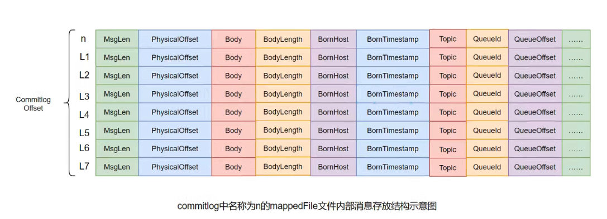

mappedFile文件内容由一个个的消息单元构成。每个消息单元中包含消息总长度MsgLen、消息的物理位置physicalOffset、消息体内容Body、消息体长度BodyLength、消息主题Topic、Topic长度TopicLength、消息生产者BornHost、消息发送时间戳BornTimestamp、消息所在的队列QueueId、消息在Queue中存储的偏移量QueueOffset等近20余项消息相关属性。

> 需要注意到，消息单元中是包含Queue相关属性的。所以我们在后续的学习中，就需要十分留意commitlog与queue间的关系是什么？？
>
> 一个mappedFile文件第m+1个消息单元的commitlog offset偏移量
>
> **L(m+1) = L(m) + MsgLen(m)  (m>=0)**


#### **consumequeue**


**索引条目**

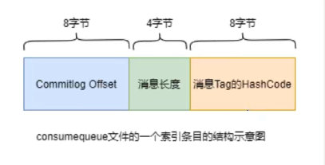

每个consumequeue文件可以包含30w个索引条目，每个索引条目包含了三个消息重要属性：消息在mappedFile文件中的偏移量CommitLog Offset、消息长度、消息Tag的hashcode值。这个三个属性占20个字节，所以每个文件的大小是固定的30W*20字节

>一个consumequeue文件中所有消息的Topic一定是相同的。但每条信息的Tag可能是不同的


#### 对文件的读写


**消息写入**

一条消息进入到Broker后经历了以下几个过程才最终被持久化。

* Broker根据queueId，获取到该消息对应索引条目要在consumequeue目录中的写入偏移量，即Queueoffset
* 将queueId、queueOffset等数据，与消息一起封装为消息单元
* 将消息单元写入到commitlog
* 同时形成消息索引条目
* 将消息索引条目分发到相应的consumequeue


**消息拉取**

* 当Consumer来拉取消息时会经历以下几个步骤：

  * Consumer获取到其要消费消息所在Queue的**消费偏移量offset**，计算出其要消费消息的**消息offset**

    >消费offset即消费进度，consumer对其某个Queue的消费offset，即消费到了该Queue的第几条消息
    >
    >消息offset = 消息offset +  1

  * Consumer向Broker发送拉取请求，其中会包含要拉取消息的Queue、消息Offset及消息Tag

  * Broker计算在该consumequeue中的queueOffset

    >queueOffset = 消息iffset * 20字节

  * 从该queueOffset处开始向后查找第一个指定Tag的索引条目

  * 解析该索引条目的前8个字节，即可以定位到该消息在commitlog中的commitlog offset

  * 从对应commitlog offset中读取消息单元，并发送给Consumer

    

**性能提升**

RocketMq中，无论是消息本身还是消息索引，都是存储在磁盘上的，其不会影响消息的消费吗？当然不会，其实RockerMq的性能在目前的MQ产品中性能是非常高的。因为系统通过一系列相关机制大大提升了性能。

首先，RocketMQ对文件的读写操作是通过**mmap零拷贝**进行的，将其对文件的操作转化为直接对内存地址进行操作，从而极大地提高了文件的读写效率。

其次，consumequeue中的数据顺序存放的，还引入了**PageCache**的预读取机制，使得对consumequeue文件的读取几乎接近内存读取，即时在有消息堆积情况下也不会影响性能。

>**PageCache机制，页缓存机制，是OS对文件的缓存机制，用于加速对文件的读写操作**。一般来说，程序对文件进行顺序读写的速度几乎接近于内存读写速度，主要原因是由于OS使用PageCache机制对读写访问操作进行性能优化，将一部分的内存用做PageCache。
>
>* 写操作：OS会将数据写入到PageCache中，随后会以异步方式由pdflush （page dirty flush） 内核线程将Cache中的数据刷盘到物理磁盘
>* 读操作：若用户要读取数据，其首先会从PageCache中读取，若没有命中，则OS在物理磁盘上加载该数据到PageCache的同时，也会顺序对其相邻数据块中的数据进行预读取。

RockerMQ中可能会影响性能的是对commitlog文件的读取。因为对commitlog文件来说，读取消息时会产生大量的随机访问，而随机访问会严重影响性能。不过，如果选择合适的系统IO调度算法，比如设置调度算法为Deadline（采用SSD固态硬盘的话），随机读取性能也会有所提升。

# TODO：P63


### 三、indexFile

除了通过通常的指Topic进行消息消费外，RocketMQ还提供了根据key进行消息查询的功能。该查询是通过store目录中的index子目录中的indexFile进行索引实现快速查询的。当然，这个indexFile中的索引数据是在包含了key的消息被发送到Broker时写入的。如果消息中没有包含key，则不会写入。

#### 索引条目结构

每个Broker中会包含一组indexFile，每个indexFile都是以一个时间戳命名的（这个indexFile被创建的时间戳）。每个indexFile文件由三部分组成：**indexHeader、slots槽位、indexes索引数据**。每个IndexFile文件中包含500万个slot槽位。而每个slot槽又可能会挂载很多的index单元。


indexHeader 固定40个字节，其中存放着如下数据：


* beginTimestamp：该indexFile中第一条消息的存储时间
* endTimestamp：该indexFile中最后一条消息存储时间
* beginPhyoffset：该indexFile中第一条消息在commitlog中的偏移量commitlog offset
* endPhyoffset：该indexFile中最后一条消息在commitlog中的偏移量commitlog offset
* hashSlotCount：已经填充有index的slot数量（并不是每个slot槽下都挂载有index索引单元，这里统计的是所有挂载了index索引单元的slot槽的数量）
* indexCount：该indexFile中包含的索引个数（统计出当前indexFile中所有slot槽下挂载的所有index索引单元的数量之和）

indexFile中最复杂的是Slots和indexes之间的关系。在实际存储时，Indexes是在slots后面的，但为了便于理解，将他们的关系展示为如下形式：

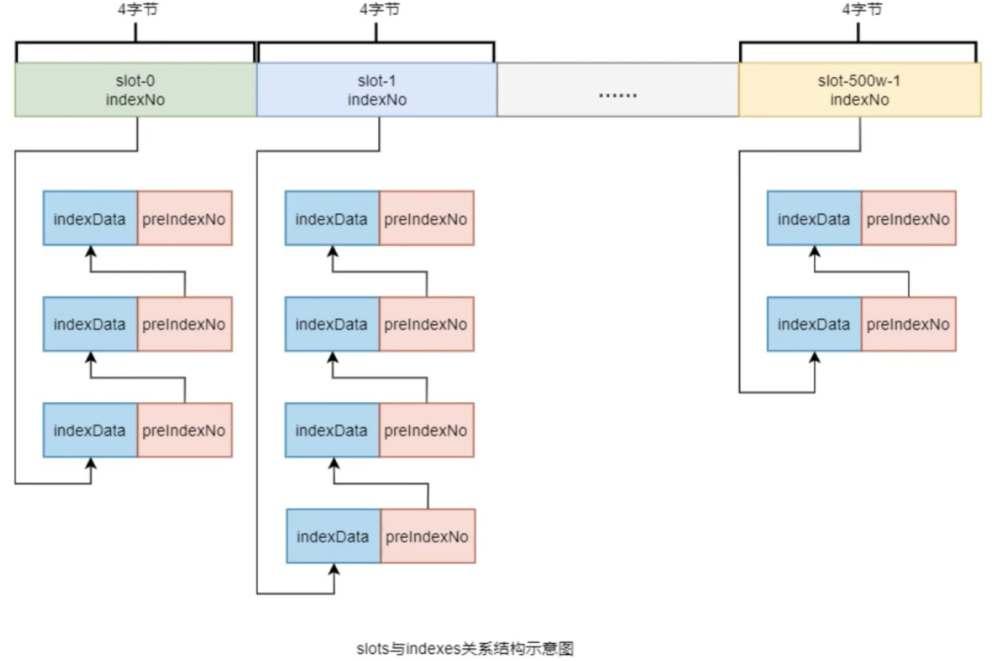


**key的hash值%500w**的结果即为slot槽位，然后将该slot值修改为该index索引单元的indexNo，根据这个indexNo可以计算出该index单元在indexFile中的位置。不过，该取模结果的重复率是很高的，为了解决该问题，在每个idnex索引单元中增加了preIndexNo，用于指定该slot中当前index索引单元的前一个index索引单元。而slot中始终存放的是其下最新的index索引单元的indexNo，这样的话，只要找到了slot就可以找到其最新的索引单元，而通过这个index索引单元就可以找到其之前的所有的index索引单元。

> indexNo是一个在indexFile中的流水号，从0开始依次递增。即在一个indexFile中所有的indexNo是以此递增的。indexNo在index索引单元中是没有体现的，其实通过indexes中依次数出来的。


* keyHash：消息中指定的业务key的hash值
* phyOffset：当前key对应的消息在commitlog中的偏移量commitlog offset
* timeDiff：当前key对应消息的存储时间与当前的indexFile创建时间的时间差
* preIndexNo：当前slot下当前index索引单元的前一个index索引单元的indexNo


#### indexFile的创建

indexFile的文件名为当前文件被创建时的时间戳。这个时间戳有什么作用呢？

根据业务key进行查询时，查询条件除了key以外，还需要指定一个要查询的时间戳，表示要查询不大于该时间戳的最新的消息。即查询指定时间戳之前存储的最新消息。这个时间戳文件名可以简化查询，提高查询效率。具体后面会讲解。

indexFile文件是何时创建的？其创建的条件（时机）有两个：

* 当第一条带key的消息发送来后，系统发现没有indexFile，此时会创建第一个indexFile文件
* 当一个indexFile挂载的index索引单元数量超出2000w个时，会创建新的indexFile。当待key的消息发送到来后，系统会找到最新的indexFile，并从其indexHeader的最后4字节读取到IndexCount。若IndexCount>=2000w时，会创建新写的IndexFile。

> 由此可以推算出，一个indexFile 的最大大小是：（40+ 500w * 4 + 2000w * 20 ）  字节


#### 查询流程

当消费者通过业务key来查询相应的消息时，其需要经过一个相对复杂查查询流程。不过，在分析查询流程之前，首先要清楚几个定位计算公式：

```
计算指定消息key的slot槽位序号：
slot槽位序号=key的hash % 500w
```

```
计算槽位序号为n的slot在indexFile的起始位置：
slot（n）位置=40 + （n-1）*4
```

```
计算指定消息key的slot槽位序号：
index（m）位置 = 40+ 500w*4 + (m-1)*20
```

> 40为indexFile中的indexHeader的字节数
>
> 500w*4 是所有slots所占的

具体查询流程如下：

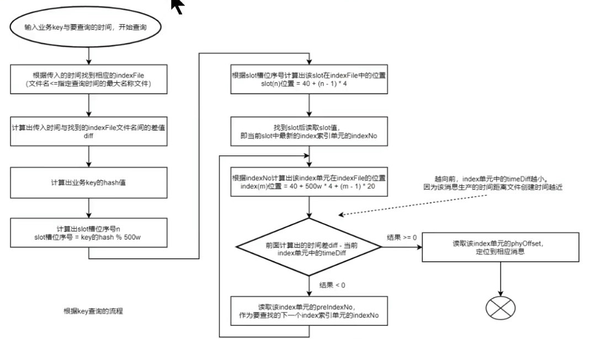


### 四、消息的消费

消费者从Broker中获取消息的方式有两种：**pull拉取方式**和**push推动方式**。

消费者组对于消息消费的模式又分为两种：**集群消费Clustering**和**广播消费Broadcasting**


#### 获取消费方式

**拉取式消费**

Consumer主动从Broker中拉取消息，主动权由Consumer控制。一单获取了批量消息，就会启动消费过程。不过，该方式的实时性较弱，即Broker中有了新的消息时消费者并不能及时发现并消费。

> 由于拉取时间间隔是由用户指定，所以在设置间隔时需要注意平稳：**间隔太短，空请求比例会增加；间隔太长，消息的实时性太差**

**推送式消费**

该模式下Broker收到数据后会主动推送给Consumer。该获取方式一般实时性较高。

该获取方式是典型的**发布-订阅**模式，即Consumer向其关联的Queue注册了监听器，一旦发现有新的消息到来就会触发回调的执行，回调方法是Consumer去Queue中拉取消息。而这些都是基于Consumer与Broker间的长连接的。长连接的维护是需要消耗系统资源的。

**对比**

* Pull：需要应用去实现对关联Queue的遍历，实时性差；但便于应用控制消息的拉取
* Push：封装了对关联Queue的遍历，实时性强，但会占用较多的系统资源


#### 消费模式

##### 广播消费

> 广播消费模式下，相同Consumer Group的每个Consumer实例都接收到同一个Topic的全量消息。即每条消息都会被发送到Consumer Group中的**每个Consumer。**


##### 集群消费

> 集群消费模式下，相同Consumer Group的每个Consumer实例平均分摊同一个Topic的消息。即每条消息只会被发送到到Consumer Group中的**某个Consumer。**

```
RocketMQ 的默认消息消费方式是集群消费 (Clustering)。
```

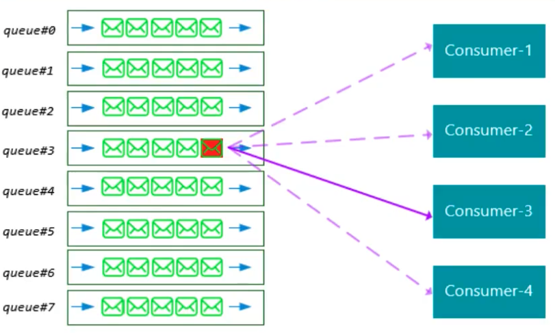


##### 消息进度保存

*  广播模式：消费进度保存在consumer端。因为广播模式下 consumer group 中每个consumer 都会消费所有消息，但它们的消费进度是不同。所以consumer各自保存各自的消费进度。
* 集群模式：消费进度保存在broker中。consumer group中的所有consumer共同消费同一个Topic中的消息，**同一条消息只会被消费一次**。消费进度会参与到了消费的负载均衡中，故消费进度是需要共享的。


#### Rebalance机制

##### 什么是Rebalance

Rebalance 即再均衡，指的是，将一个Topic下的多个Queue在同一个Consumer Group中的多个Consumer间进行重新分配的过程。


Rebalance机制的本意是为了**提升消息的并行消费能力**。例如，一个Topic下5个队列，在只有1个消费者的情况下，这个消费者将负责消费这5个队列的消息。如果此时我们增加了一个消费者，那么就可以给其中一个消费者分配2个队列，给另一个分配3个队列，从而提升消息的并行消费能力。


##### Rebalance限制

由于一个队列最多分配给一个消费者，因此当某个消费者组下的消费者实例数量大于队列的数量时，对于的消费者实例将分配不到任何队列。


##### Rebalance危害

Rebalance在提升消费能力的同时，也带来一些问题：

**消费暂停**：在只有一个Consumer时，其负责消费所有队列；在新增了一个Consumer后会触发Rebalance的发生。此时原Consumer就需要暂停部分队列的消费，等到这些队列分配给新的Consumer后，这些暂停消费的队列才能被继续消费。

**消费重复**：Consumer在消费新分配给自己的队列时，必须接着之前Consumer提交的消费进度的offset继续消费。然而默认情况下，offset是异步提交的，这个异步提交特性导致提交到Broker的offset与Consumer实际消费的消息并不一致。这个不一致的差值就是可能会重复消费的消息。

> **同步提交**：consumer提交了其消费完毕的一批消息的offset给Broker后，需要等待Broker的成功ACK。当收到ACK后，consumer才会继续获取并消费给下一批消息。在等待ACK期间，consumer是阻塞的。
>
> **异步提交**：consumer提交了其消费完毕的一批消息的offset给Broker后，不需要等待Broker的成功ACK。consumer可以直接获取并消费下一批消息。
>
> 对于一次性读取消息的数量，需要根据具体业务员场景选择一个相对均衡的是很有必要的。因为数量过大，系统性能提升了，但产生重复消费的消息数量可能会增加；数量过小，系统性能会下降，但被重复消费的消息数量可能会减少


**消费突刺**：由于Rebalance可能导致重复消费，如果需要重复消费的消息过多，或者因为Rebalance暂停时间过长从而导致挤压了部分消息。那么有可能会导致在Rebalance结束之后瞬间需要消费很多消息。


##### Rebalance产生的原因

导致Rebalance产生的原因，无非就两个：消费者所订阅Topic的Queue数量发生变化，或消费者组消费者的数量发生变化。

> **1）Queue数量发生变化的场景：**
>
> Broker扩容或缩容
>
> Broker升级运维
>
> Broker与NameServer间的网络异常
>
> Queue扩容或缩容
>
> **2）消费者数量发生变化的场景：**
>
> Consumer Group扩容或缩容
>
> Consumer升级运维
>
> Consumer与NameServer间网络异常


##### Rebalance过程

在Broker中维护着多个Map集合，这些集合中订阅存放着当前Topic中Queue的信息、Consumer Group中Consumer实例的信息。一但发现消费者所订阅的Queue数量发生变化，或消费者组中消费者的数量发生变化，立即向Consumer Group中的每个实例发出Rebalance通知。

> **TopicConfigManager**：key是Topic名词，value是TopicConfig。TopicConfig中维护着该Topic中所有Queue的数据
>
> **ConsumerManager**：key是Consumer Group Id，value是ConsumerGroupInfo。ConsumerGroupInfo中维护着该Group中所有Consumer实例数据。
>
> **ConsumerOffsetManager**：key为Topic与订阅该Topic的Group的组合，value是一个内层Map。内层Map的key为QueueId，内层的value为该Queue的消费进度offset。

Consumer实例在接收到通知后会采用**Queue分配算法**自己获取到相应的Queue，既由Consumer实例自主进行Rebalance。


##### 与Kafka对比

在Kafka中，一单发现出现了Rebalance条件，Broker会调用Group Coordinator来完成Rebalance。Coordinator是Broker中的一个进程。Coordinator会在Consumer Group中选出一个Group Leader。由这个Leader根据自己本身组情况完成Partition分区的再分配。这个再分配结果会上报给Coordinator，并由Coordinator同步给Group中的所有Consumer实例。

Kafka的Rebalance是由Consumer Leader完成的。而RocketMQ中的Rebalance是由每个Consumer自身完成的，Group中不存在Leader。


#### Queue分配算法

一个Topic中的Queue只能由Consumer Group中的一个Consumer进行消费，而一个Consumer可以同时消费多个Queue中的消息。那么Queue与Consumer间的配对关系是如何确定的，即Queue要分配给哪个Consumer进行消费，也是有算法策略的。常见的有四种策略。这些策略是通过在创建的Consumer时的构造器传进去的。


##### 平均分配策略


该算法是要根据avg = QueueCount / ConsumerCount 的计算结果进行分配的。如果能够整除，则按顺序将avg个Queue逐个分配Consumer；如果不能整除，则将多余的Queue按照Consumer顺序逐个分配。

> 该算法即，先计算好每个Consumer应该分得几个Queue，然后再依次将这些数量的Queue逐个分配各个Consumer。


##### 环形平均策略

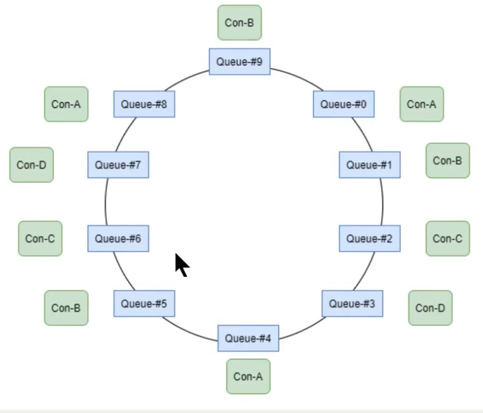

环形平均算法是指，根据消费者的顺序，依次在由Queue队列组成的环形图中逐个分配。

> 该算法不用实现计算每个Consumer需要分配几个Queue，直接一个个分即可。

 

##### 一致性hash策略

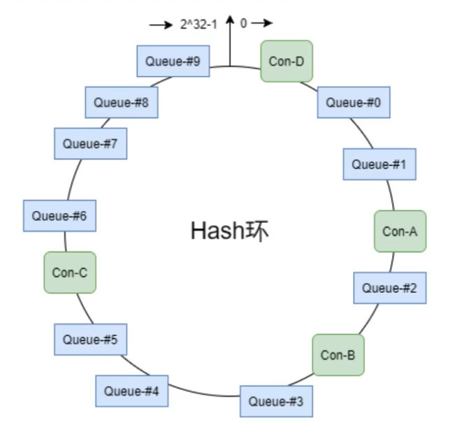

该算法会将consumer的hash值作为Node节点存放到hash环上，然后将queue的hash值也放到hahs环上，通过**顺时针**方向，距离queue最近的那个consumer就是该queue要分配的consumer。

> 该算法存在的问题：分配不均。


##### 同机房策略

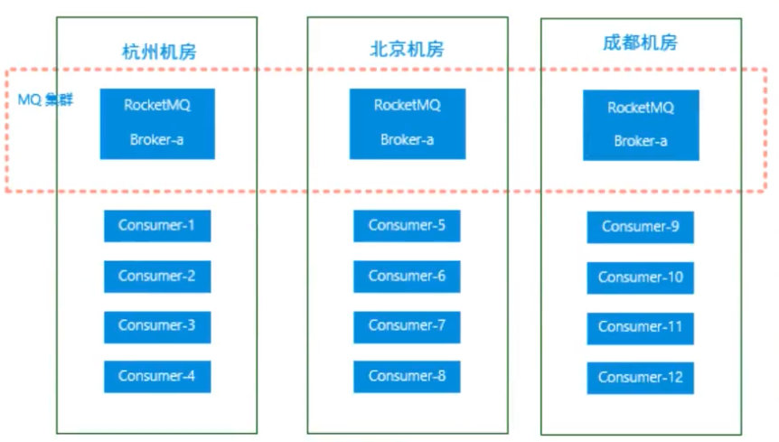

该算法会根据queue的部署机房位置和consumer的位置，过滤出当前consumer相同机房的queue。然后按照拼接分配策略或环形平均策略对机房queue进行分配。如果没有同机房queue，则按照平均分配策略或环形平均策略对所有queue进行分配。


##### 对比

**一致性hash算法存在的问题：**

两种分配策略的分配效率较高，一致性hash策略的较低。因为一致性hash算法较复杂。另外，一致性hash策略分配的结果也很可能存在不平均的情况。

**一致性hash算法存在的意义：**

可以有效减少由于消费者组扩容或缩容所带来的大量的Rebalance。

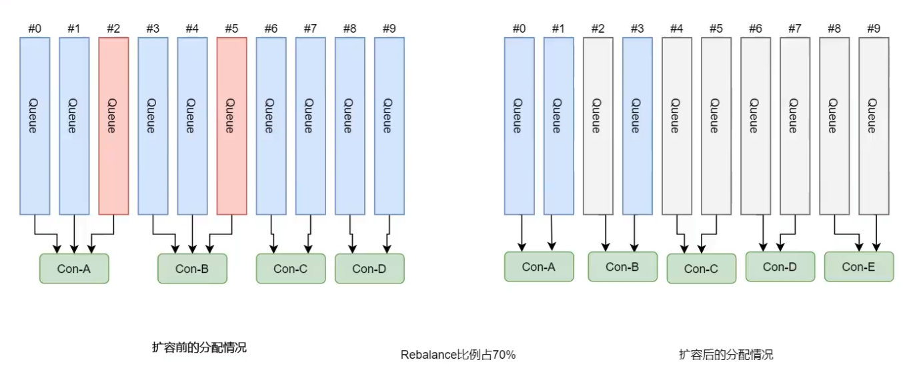

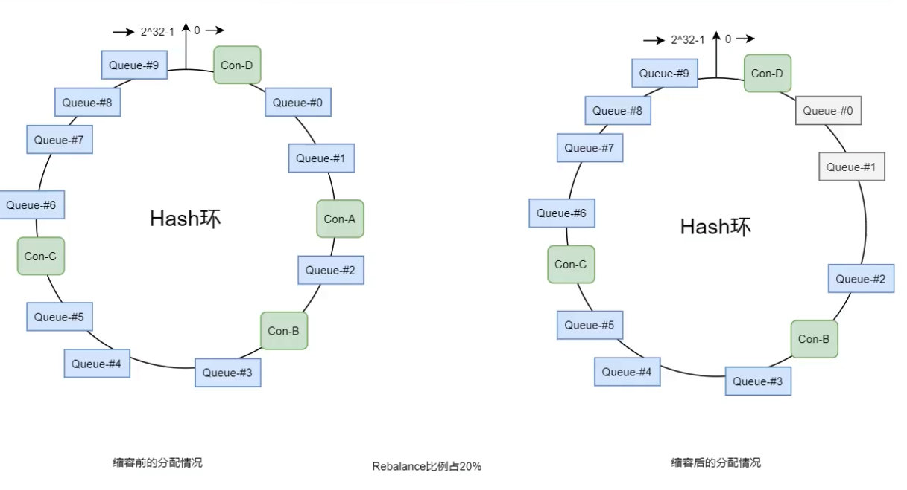


一致性hash算法的应用场景：

> Consumer数量变化频繁的场景


#### 至少一次原则

RocketMQ有一个原则：每条消息必须要被**成功消费**一次

那么什么是成功消费？Consumer在消费完消息后会向其消费进度记录器提交其消费消息的offset，offset被成功记录到记录器中，那么这条消息就被成功消费了。

> 什么是消费进度记录器？
>
> 对于广播消费模式来说，Consumer本身就是消费进度记录器
>
> 对于集群消费模式来说，Broker是消费进度记录器


### 五、订阅关系的一致性

订阅关系的一致性指的是，同一个消费者组（Group ID相同）下所有Consumer实例所订阅的Topic与Tag及对消息的处理逻辑必须完全一致。否则，消息消费的逻辑就会混乱，甚至导致消息丢失。


#### 正确的订阅关系

订阅关系保持一致


#### 错误的订阅关系

订阅关系没有保持一致

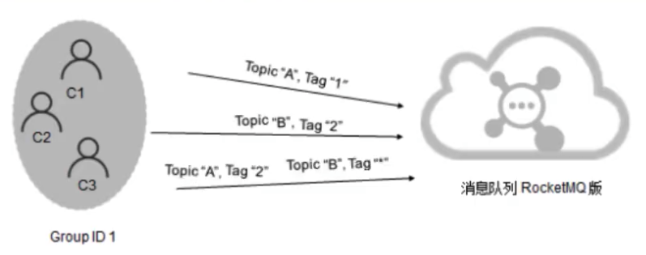


##### 订阅了不同的Topic

同一个Group上 有TopicA、TopicB

一个Consumer 订阅了TopicA

一个Consumer订阅了TopicB

*这样就不一致了*

 

##### 订阅了不同的Tag

同一个Group上 有TopicA

一个Consumer 订阅了TopicA ---TagA、TagB

一个Consumer订阅了TopicA --- TagA

*这样就不一致了*


##### 订阅了不同数量的Topic

同一个Group上 有TopicA、TopicB

一个Consumer 订阅了TopicA

一个Consumer订阅了TopicB、TopicA

*这样就不一致了*


### 六、offset管理

> 这里的offset指的是Consumer的消费进度offset

消费进度Offset是用来记录每个Queue的不同消费组的消费进度的。根据消费进度记录器的不同，可以分为两种模式：本地模式和远程模式。


#### offset本地管理模式

当消费模式为广播消费时，Offset使用本地模式存储。因为每条消息会被所有的消费者消费，每个消费者管理自己的消费进度，各个消费者之间不存在消费进度的交集。

Consumer在广播消费模式下Offset相关数据以json的形式持久化到Consumer本地磁盘文件中，默认文件路径为当前用户主目录下的.rocketmq_offsets/${clientId}/${group}/offset.json。其中${clientId}为当前消费者id，默认为ip@DEFAULT；${group}为消费者组名称。


#### offset远程管理模式

当消费模式集群消费时，Offset使用远程模式管理。因为所有Consumer实例对消息采用的是均衡消费，所有Consumer共享Queue的消费进度。

Consumer在集群消费模式下Offset相关数据以json的形式持久化到Broker磁盘文件中，文件路径为当前用户主目录下的**store/config/consumeroffset.json**

Broker启动时会加载这个文件，并写入到一个双层Map。外层Map的key为**topic@group**，value为内层map。内层map的key为queueId，value为Offset。当发生Rebalance时，新的Consumer会从该Map中获取到响应的数据来继续消费。

集群模式下offset采用远程管理模式，主要是为了保证Rebalance机制。


#### offset用途

消费者是如何从最开始持续消费消息的？消费者要消费的第一条消息的起始位置是用户自己通过**consumer.setConsumerFromWhere()**方法指定的。

在Consumer启动后，其要消费的第一条消息的起始位置常用的有三种，这三种位置可以通过枚举类型常量设置。这个枚举类型为ConsumerFromWhere。

```java
public enum ConsumeFromWhere {
    CONSUME_FROM_LAST_OFFSET,
    /** @deprecated */
    @Deprecated
    CONSUME_FROM_LAST_OFFSET_AND_FROM_MIN_WHEN_BOOT_FIRST,
    /** @deprecated */
    @Deprecated
    CONSUME_FROM_MIN_OFFSET,
    /** @deprecated */
    @Deprecated
    CONSUME_FROM_MAX_OFFSET,
    CONSUME_FROM_FIRST_OFFSET,
    CONSUME_FROM_TIMESTAMP;

    private ConsumeFromWhere() {
    }
}
```

> **CONSUME_FROM_TIMESTAMP**：从指定的具体时间戳位置开始消费。这个具体时间戳是通过另外一个语句指定的。
>
> ```java
> // yyyyMMddHHmmss
> consumer.setConsumeTimestamp("20220611081111");
> ```

当消费完一批消息后，Consumer会提交其消费进度Offset给Broker，Broker在收到消费进度后会将其更新到双层Map（ConsumerOffsetManager）及consumerOffset.json文件中，然后向该Consumer进行ACK，而ACK内容中包含三项数据：当前消费队列的最小Offset（minOffset）、最大Offset（macOffset）、及下次消费的起始Offset（nextBeginOffset）。


#### 重试队列


当RocketMQ对消息的消费出现异常时，会将发生异常的消息的Offset提交到Broker中的重试队列。系统在发生消息消费异常时会为当前的**Topic@group创建一个重试队列**，该队列以**%RETRY%**开头，到达重试时间后进行消费重试。


#### offset的同步提交和异步提交

集群消费模式下，Consumer消费完消息后会向Broker提交消费进度offset，其提交方式分为两种：

* **同步提交**：消费者在消费完一批消息后会向Broker提交这些消息的offset，然后等待Broker的成功响应。若在等待超时之前收到了成功响应，则继续读取下一批消息进行消费（从ACK中获取nextBeginOffset）。若没有手动响应，则会重新提交，直到获取到响应。而在这个等待过程中，消费者是阻塞的。其严重影响了消费者的吞吐量。
* **异步提交**：消费者在消费完一批数据后问Broker提交Offset，但无需等待Broker的成功响应，可以继续读取并消费下一批数据。这种方式增加了消费者的吞吐量。但需要注意，broker在收到提交的Offset后，还是会向消费者进行响应的。可能还没有收到ACK，此时Consumer会从Broker中直接获取nextBeginOffset


### 七、消费幂等性

#### 什么是消费幂等

当出现消费者对某条消息重复消费的情况时，重复消费的结果与消费一次的结果是相同的，并且多次消费并未对业务系统产生任何负面影响，那么这个消费过程就是消费幂等的，

> 幂等：若某操作执行多次与执行一次对系统产生的影响是相同的，则称该操作是幂等的。

在互联网应用中，尤其在网络不稳定的情况下，消息很有可能会出现重复发送或重复消费。如果重复的消费可能会影响业务处理，那么就应该对消息做幂等处理。


#### 消息重复的场景分析

什么情况下可能会出现消息被重复消费呢？最常见的有以下三种情况：

##### 发送时消息重复

当一条消息已被成功发送到Broker并完成持久化，此时出现了网络闪断，从而导致Broker对Producer应答失败。如果此时Producer意识到消息发送失败并尝试再次发送消息，此时Broker中就可能出现两条内容相同并且MessageId也相同的消息，那么后续Consumer就一定会消费两次该消息。


##### 消费时消息重复

消息已经投递到Consumer并完成业务处理，当Consumer给Broker反馈应答时网络闪断，Broker没有接收到消费成功响应。为了保证消息至少被消费一次的原则，Broker将在网络恢复后再次尝试投递之前已被处理过的消息。此时消费者就会收到与之前处理过的内容相同、MessageID也相同的消息。

##### Rebalance时消息重复

当ConsumerGroup中的Consumer数量发生变化时，或其订阅的Topic的Queue数量发生变化时，会触发Rebalance，此时Consumer可能会收到曾经被消费过的消息。


#### 通用解决方案

##### 两要素

幂等解决方案的设计中涉及到两项要素：幂等令牌，与唯一性处理。只要充分利用好这两要素，就可以设计出好的幂等解决方案。

* 幂等令牌：是生产者和消费者两者中的既定协议，通常指具备唯一业务表示的字符串。例如，订单号、流水号。一般由Producer随着消息一同发送来的。
* 唯一性处理：服务端通过采用一定的算法策略，保证同一个业务逻辑不会被重复执行成功多次。例如，对同一笔订单的多次支付操作，只会成功一次。

解决方案：

```
对于常见的系统，幂等性操作的通用性解决方案是:
1.首先通过缓存去重。在缓存中如果已经存在了某幂等令牌，则说明本次操作是重复性操作;若缓存没有命中，则进入下一步。
2.在唯一性处理之前，先在数据库中查询幂等令牌作为索引的数据是否存在。若存在，则说明本次操作为重复性操作;若不存在，则进入下一步。
3.在同一事务中完成三项操作:唯一性处理后，将幂等令牌写入到缓存，并将幂等令牌作为唯一索引的数据写入到DB中。
	第1步已经判断过是否是重复性操作了，为什么第2步还要再次判断?能够进入第2步，说明已经不是重复操作了，第2次判断是否重复?
	当然不重复。一般缓存中的数据是具有有效期的。缓存中数据的有效期一旦过期，就是发生缓存穿透，使请求直接就到达了DBMS。
```


解决方案举例子：

```
以支付场景为例:
1.当支付请求到达后，首先在Redis缓存中却获取key为支付流水号的缓存value。若value不空，则说明本次支付是重复操作，业务系统直接返回调用侧重复支付标识;若value为空，则进入下一步操作
2.到DBMS中根据支付流水号查询是否存在相应实例。若存在，则说明本次支付是重复操作，业务系统直接返回调用侧重复支付标识;若不存在，则说明本次操作是首次操作，进入下一步完成唯一性处理
3.在分布式事务中完成三项操作:
	·完成支付任务
	·将当前支付流水号作为key，任意字符串作为value，通过set(key,value,expireTime)将数据写入到Redis缓存
	·将当前支付流水号作为主键，与其它相关数据共同写入到DBMS
```


#### 消息幂等的实现

```java
消费幂等的解决方案很简单:为消息指定不会重复的唯一标识。因为Message "D有可能出现重复的情况所以真正安全的幂等处理，不建议以Message D作为处理依据。最好的方式是以业务唯一标识作为幂等处理的关键依据，而业务的唯一标识可以通过消息Key设置。
以支付场景为例，可以将消息的Key设置为订单号，作为幂等处理的依据。具体代码示例如下:

Message message =new Message();
message.setKey("ORDERID_100");
SendResult sendResult = producer.send(message);
```


消费者收到消息时可以根据消息的Key即订单号来实现消费幂等

```java
consumer.registerMessageListener(new MessageListenerconcurrently(){
@override
public consumeconcurrentlystatus consumeMessage(List<essageExt> msgs,Consumeconcurrentlycontext context){
for(MessageExt msg:msgs){
string key = msg.getkeys();
// 根据业务唯一标识Key做幂等处理
}
return consumeconcurrentlystatus.CONSUME_SUCCESS;}
});
```

> RocketMQ能够保证消息不丢失，但不能保证消息不重复。


### 八、消息堆积与消费延迟

#### 概念

消息处理流程中，如果Consumer的消费速度跟不上Producer的发送速度，MQ中未处理的消息会越来越多（进的多出的少），这部分消息就被称为**堆积消息**。消息出现而会造成消息的**消费延迟**。以下场景需要重点关注消息堆积和消费延迟问题：

* 业务系统上下游能力不匹配造成的持续堆积，且无法自行恢复
* 业务系统对消息的实时性要求较高，即使是短暂的堆积造成的延迟也无法接收。


#### 产生原因分析

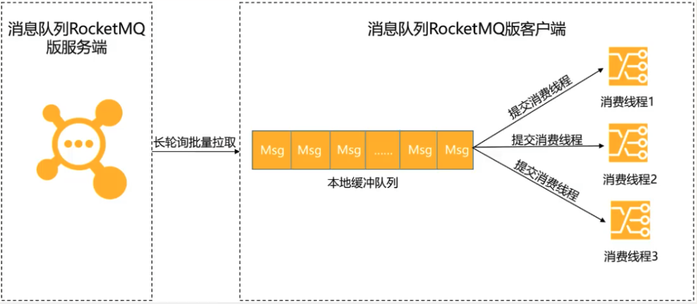


Consumer使用长轮询Pull模式消费消息时，分为以下两个阶段：

##### 消息拉取

Consumer通过长轮询Pull模式在批量拉取的方式从服务端获取消息，将拉取到的消息缓存在本地缓冲队列中。对于拉取式消费，在内网环境下会有很高的吞吐量，所以这一阶段一般不会称为消息堆积的瓶颈。

> 一个单线程单分区的低规格主机（Consumer，4C8G），其可达到几万的TPS。如果是个多个分区多个线程，则可以轻松达到几十万的TPS。

##### 消息消费

Consumer将本地缓存的消息提交到消费线程中，使用业务消费逻辑对消息进行处理，处理完毕后获取到一个结果。这是真正的消息消费过程。此时Consumer的消费能力就完全依赖于消息的消费耗时和消息并发度了。如果由于业务处理逻辑的复杂等原因，导致处理单条消息的耗时较长，则整体的消息吞吐量肯定不会高，此时就会导致Consumer本地缓冲队列达到上限，停止从服务端拉取消息。


##### 结论

消费对接的主要拼接在于客户端的消费能力，而消费能力由消耗耗时和消费并发度决定。注意，**消费耗时的优先级要高于消费并发度**。即在保证了消费耗时的合理性前提下，再考虑消费并发度问题。


#### 消费耗时

影响消息处理时长的主要因素是代码逻辑。而代码逻辑中可能会影响处理时长代码主要有两种类型：**CPU内部计算型代码和外部I/O操作型代码。**

通常情况下代码中如果没有复杂的递归和循环的话，内部计算耗时相对于外部I/O操作来说几乎可以忽略不计。所以外部IO型代码是影响消息处理时长的主要症结所在。

> 外部IO操作类型代码举例：
>
> * 读写外部数据库，例如远程MYSQL的访问
> * 读写外部缓存系统，例如对远程Redis的访问
> * 下游系统调用，例如Dubbo的RPC远程调用，Spring Cloud的对下游系统的Http接口请求

> 关于下游系统调用逻辑需要进行提前梳理，掌握每个调用操作预期的耗时，这样做是为了能够判断消费逻辑中IO操作的耗时是否合理。通常消息堆积是由下游系统出现了**服务异常**或者达到了DBMS容量的限制，导致消费耗时增加。
>
> 服务异常，并不仅仅是系统出现的类似500这样的代码错误，而可能是更加隐蔽的问题。例如，网络带宽问题。达到了DBMS容量限制，其也会引发消息的消费耗时增加。
>


#### 消费并发度

一般情况下，消费者端的消费并发度由单节点线程数和节点数量共同决定，其值为 **单节点线程数 * 节点数量**。不过，通常需要优先调整单节点的线程数，若单机硬件资源达到了上限，则需要通过横向扩展来提高消费并发度。

> 单节点线程数，即单个Consumer所包含的线程数量
>
> 节点数量，即Consumer Group所包含的Consumer数量

> 对于普通消息、演出消息及事务消息，并发度计算都是 **单节点线程数* 节点数量**。但对于顺序消费则是不同的。顺序消息的消费并发度等于Topic的Queue分区数量。
>
> 1）全局顺序消息：该类型消息的Topic只有一个Queue分区。其可以保证该Topic的所有消息被顺序消费。为了保证这个全局顺序性，Consumer Group中同一时刻只能有一个Consumer的一个线程进行消费。**所以其并发度为1.**
>
> 2）分区顺序消息：该类型消息的Topic有多个Queue分区。其仅可以保证该Topic的每个Queue分区中的消息被顺序消费，不能保证整个Topic中的消息顺序消费。为了保证这个分区的顺序性，每个Queue分区中的消息在Consumer Group中的同一时刻只能有一个Consumer的一个线程进行消费。即，在同一时刻最多出现多个Queue分区有多个Consumer的多个线程并行消费。所有其并发度为Topic的分区数量。


#### 单机线程数计算

对于一台主机中线程池中线程数的设置需要谨慎，不能盲目直接调大线程数，设置过大的线程数反而会带啦大量的线程切换的开销。理想环境下节点的最优线程数计算模型为：C * （T1+ T2）/ T1

* C：CPU内核数
* T1：CPU内部逻辑计算耗时
* T2：外部IO操作耗时

> **最优线程数= C * （T1+ T2）/ T1 = C * T1/T1+ C * T2/T1= C+  C * T2/T1**
>
> **注意**：该计算出的数值是理想状态下的理论数据，在生成环境下，不建议直接使用。而是根据当前环境，先设置一个比该值小的数值然后观测其压测效果，然后再根据效果逐步调大线程数，直至找到该环境中性能最佳时的值。


#### 如何避免

为了避免在业务使用时出现非预期的消息堆积和消费延迟问题，需要在前期设计阶段对整个业务逻辑进行完善的排查和梳理。其中最重要的就是**梳理消息的消费耗时**和**设置消息并发度**

##### 梳理消息的消费耗时

通过压测获取消息的消费耗时，并对耗时较高的操作的代码逻辑进行分析。梳理消息的消费耗时需要关注以下信息：

* 消息消费逻辑的计算复杂度是否过高，代码是否存在无限循环和递归等缺陷。
* 消息消费逻辑中的I/O操作是否是必须的，能否用本地缓存等方案进行规避
* 消息逻辑中的复杂耗时的操作是否可以做异步操作处理。如果可以，是否会造成逻辑混乱。


##### 设置消费并发度

对于消息消费并发度的计算，可以通过以下两步实施：

* 逐步调大单个Consumer节点的线程数，并观测节点的系统指标，得到单个节点最优的消费线程数和消息吞吐量
* 根据上下游链路的**流量峰值**计算出需要设置的**节点数**

> 节点数=流量峰值/单个节点消息吞吐量


### 九、消息的清理

消息被消费过后会被清理掉吗？不会的。

消息是被顺序存储在commitlog文件的，且消息大小不定长，所以消息的清理是不可能以消息为单位进行清理的，而是以commitlog文件为单位进行清理的。否则会急剧下降清理效率，并实现逻辑复杂。

commitlog文件存在一个过期时间，**默认为72小时，即三天**。除了用户手动清理外，在以下情况下会被自动清理，无论文件中的消息是否被消费过：

* 文件过期，且达到**清理时间点**（默认为**凌晨四点**）后，自动清理过期文件
* 文件过期，且磁盘空间占用率已达**过期清理警戒线**（默认75%）后，无论是否达到清理时间点，都会自动清理过期文件
* 磁盘占用率达到**清理警戒线**（默认为85%）后，开始按照设定好的规则清理文件，无论是否过期。默认会从最老的文件开始清理
* 磁盘占用率达到**危险警戒线**（默认90%）后，Broker将拒绝消息写入

> 需要注意以下几点：
>
> 1）对于RocketMQ系统来说，删除一个1G大小的文件，是一个压力巨大的IO操作。在删除过程中，系统性能会骤然下降。所以，其默认清理时间点为凌晨四点，访问量最小的时间。也正因如果，我们要保障磁盘空间的空闲率，不要使系统出现在其他时间点删除commitlog文件的情况。
>
> 2）官方建议RocketMQ服务的Linux文件系统采用ext4。因为对于文件删除操作，ext4要比ext3性能更好。


## 第四章 RocketMQ应用

### 一、普通消息

#### 消息发送分类

Producer对于消息的发送方式也有多种选择，不同的方式会产生不同的系统效果。


##### 同步发送消息

同步发送消息是指，Producer发出一条消息后，会在收到MQ返回的ACK之后才发下一条消息。该方式的消息可靠性最高，但消息的发送效率太低。

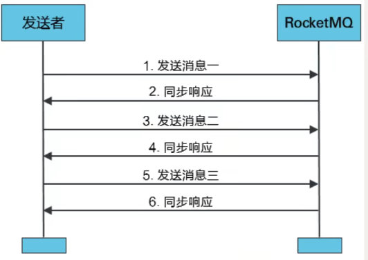

##### 异步发送消息

异步发送消息是指，Producer发出消息后无需等待MQ返回ACK，直接发送下一条消息。该方式的消息可靠性得到保障，消息发送效率也可以。

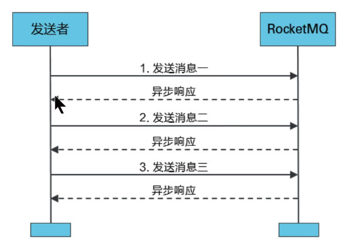


##### 单向发送消息

单向发送消息是指，Prodcuer仅负责发送消息，不等待、不处理MQ的ACK，该发送方式时MQ也不返回ACK。该方式的消息发送效率最高，但是消息可靠性差。


### 二、顺序消息

#### 什么是顺序消费

消息有序指的是可以**按照消息的发送顺序来消费(FIFO)**。RocketMQ可以严格的保证消息有序，可以分为分区有序或者全局有序。

顺序消费的原理解析，在默认的情况下消息发送会采取**Round Robin轮询方式**把消息发送到不同的queue(分区队列)；而消费消息的时候从多个queue上拉取消息，这种情况发送和消费是不能保证顺序。但是如果控制发送的顺序消息只依次发送到同一个queue中，消费的时候只从这个queue上依次拉取，则就保证了顺序。当发送和消费参与的queue只有一个，则是全局有序；如果多个queue参与，则为分区有序，即相对每个queue，消息都是有序的。


#### 为什么需要顺序消费

下面用订单进行分区有序的示例。一个订单的顺序流程是：创建、付款、推送、完成。订单号相同的消息会被先后发送到同一个队列中，消费时，同一个**OrderId**获取到的肯定是同一个队列。

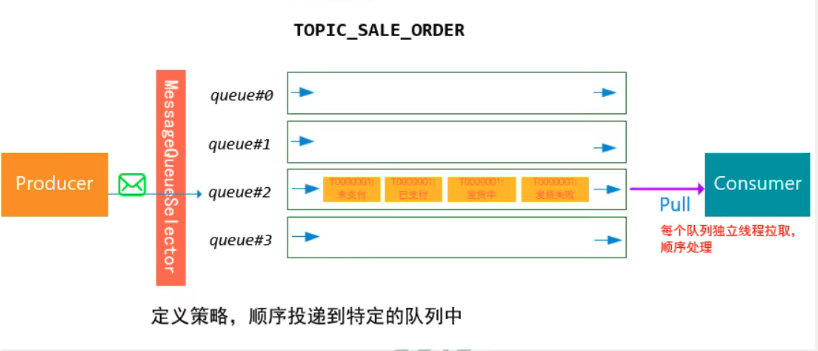

  


#### 有序性分类

根据有序范围的不同，RocketMQ可以严格地保证两种消息的有序性：分区有序与全局有序

##### 全局有序

当发送和消费参与的Queue只有一个时所保证的有序是整个Topic中消息的顺序，称为**全局有序。**

>在创建Topic时指定Queue的数量，有三种指定方式：
>
>1) 在代码中创建Producer时，可以指定自动创建的Topic的Queue数量
>2) 在RocketMQ可视化控制台中手动创建Topic时，指定Queue数量
>3) 使用mqAdmin命令手动创建Topic时指定Queue数量

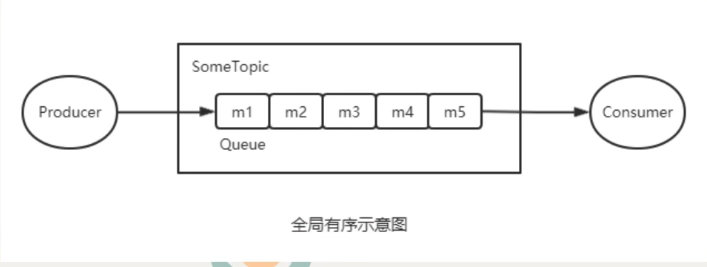

##### 分区有序

如果有多个Queue参与，其仅可以保证在该Queue分区队列上的消息顺序，则称为分区有序。

>如何实现Queue的选择，在定义Producer时我们可以指定消息队列选择器，而这个选择器是我们自己实现了MessageQueueSelector接口定义的。
>
>在定义选择器的选择算法时，一般需要使用选择key。这个选择key可以是消息key也可以是其他数据。但无论谁做选择key，都不能重复，都是唯一的。
>
>一般性的选择算法是，让选择key（获其hash值）与该Topic所包含的Queue的数量取模，其结果即为选择出的Queue的QueueId。
>
>**取模算法存在一个问题：不同选择key与Queue数量取模结果可能会是相同的，即不同的选择key的消息可能出现相同的Queue，即同一个Consumer可能会消费到不同选key的消息。这个问题如何解决？？** 
>
>**一般做法：**从消息中获取到选择key，对其进行判断。若是当前consumer需要消费的消息，则直接消费，否则，什么也不做。这种做法要求选择key要能够随着Consumer获取到。此时使用消息key做为选择key是比较好的做法 。
>
>**以上做法会不会出现新的问题呢？？**
>
>以上做法会不会出现如下新的问题呢？不属于那个Consumer的消息被拉取走了，那么应该消费该消息的Consumer是否还能在消费该消息呢？同一个Queue中的消息不可能被同一个Group中不同的Consumer同时消费。所以，消费一个Queue的不同选择key的消息的Consumer一定属于不同的Group。而不同的Group中的Consumer间的消费是相互隔离的，互不影响的。


### 三、延时消息

#### 什么是延时消息

> 当消息写入大Broker后，在指定的时长后才可被消费处理的消息，称为延时消息。

采用RocketMq的延时消息可以实现定时任务的功能，而无需使用定时器。典型的应用场景是：电商交易中潮湿未支付关闭订单的场景，12306平台订票系统超时未支付取消订票的场景

>在电商平台中，订单创建时会发送一条延迟消息。这条消息将会在30分钟后投递给后台业务系统（Consumer），后台业务系统收到该消息后会判断对应的订单是否已经完成支付。如果未完成，则取消订单，将商品再次放回到库存；如果完成支付，则忽略。
>
>在12306平台中，车票预订成功后就会发送一条延迟消息。这条消息将会在45分钟后投递给后台业务系统Consumer中，后台业务系统收到该消息后会判断对应的订单是否已经完成支付。如果未完成，则取消预订，将车票再次放回票池；如果未完成支付，则忽略


#### 延迟等级

延时消息的延迟时长**不支持随意时长**的延迟，是通过特定的延迟等级来指定的。延迟等级定义在RocketMq服务端的**MessageStoreConfig**类中的如下变量中：

```java
// org/apache/rocketmq/store/config/MessageStoreConfig.java

private String messageDelayLevel = "1s 5s 10s 30s 1m 2m 3m 4m 5m 6m 7m 8m 9m 10m 20m 30m 1h 2h";
```

即，若指定的延时等级未3，则表示延时时长未10s，即延迟等级是从1开始计数的。

当然如果需要自定义的延时等级，可以通过在broker加载的配置中新增如下配置（例如下面增加了一天这个等级）。配置文件在RocketMQ安装目录下的conf目录中。


#### 延时消息实现原理

 


##### 修改消息

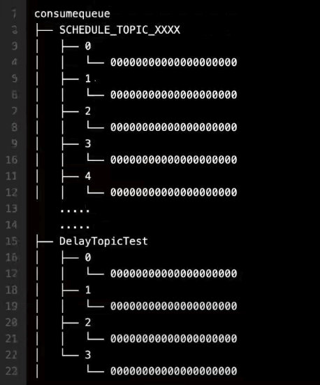

Producer将消息发送到Broker后，Broker会首先将消息写入到commitlog文件中，然后需要将其分发到相应的consumerQueue中。不过，在分发之前，系统会判断消息是否带有延时等级，若没有，则直接正常分发；若有，则需要经历一个复杂的过程：

* 修改消息的Topic未Schedule_Topic_XXXX

* 根据延时等级，在consumerqueue目录中Schedule_Topic_XXX主题下创建出相应的queueId目录与consumerQueue文件（如果没有这些目录与文件的话）

  >延迟等级delayLevel与QueueId的对应关系为queueId = delayLevel -1
  >
  >
  >
  >需要注意，在创建queueId目录时，并不是一次性将所有延迟等级对应的目录全部创建完毕，而是用到哪个延迟等级就创建哪个目录


* 修改消息索引单元内容。索引单元中的**Message Tag HashCode**部分原本存放的是消息的Tag的Hash值。现修改为消息的**投递时间**。投递时间是指该消息被重新修改为原Topic后再次被写入到commitLog中的时间。***投递时间=消息存储时间+延迟等级时间***。消息存储时间指的是消息被发送到Broker时的时间戳。

* 将消息索引写入到Schedule_Topic_XXXX主题下相应的consumequeue中

  >***Schedule_Topic_XXXX目录中各个延时等级Queue中的消息是如何排序的？***
  >
  >
  >
  >**是按照消息投递时间排序的。**一个Broker中的桶以等级的所有延时消息会被写入到consumequeue目录中 Schedule_Topic_XXXX目录下相同的Queue中。即一个Queue中消息投递时间的延迟等级时间是相同的。那么投递时间就取决于消息存储时间了。**即按照消息被发送到Broker的时间进行排序的。**


##### 投递延时消息

Broker内部有一个延迟消息服务类ScheduleMessageService，其会消费Schedule_Topic_XXXX中的消息，即按照每条消息的投递时间，将延迟消息投递到目标Topic中，不过，在投递之前会从commitLog中将原来写入的消息再次读出，并将其原本的延迟等级设置为0，即原消息变为了一条不延迟的普通消息。然后再次将消息投递到目标Topic中。

>**ScheduleMessageService** 在Broker启动时，会创建并启动一个定时器**Timer**，用于执行相应的定时任务。系统会根据延时等级的个数，定义相应数量的TimerTask，**每个TimerTask负责一个延迟等级消息**的消费与投递。**每个TimerTask都会检测相应Queue队列的第一条消息是否到期**。若第一条消息未到期，则后面的所有消息更不会到期（消息是按照投递时间排序的）；若第一条消息到期了，则将该消息投递到目标Topic，即消费该消息。


##### 将消息重新写入commitlog

延时消息服务类ScheduleMessageService 将延迟消息再次发送给commitLog，并再次形成新的消息索引条目，分发到相应的Queue

>这其实就是一次普通消息发送。只不过这次的消息Producer是延迟消息服务类**ScheduleMessageService**


### 四、事务消息

#### 问题引入

> 需求场景：工行用户A向建行用户B转账1万元

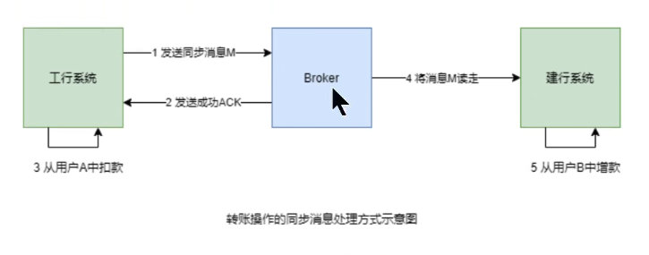

 

1) 工行系统发送一个给B增款1万元的同步消息M给Broker

2) 消息被Broker成功接收后，向工行系统发送成功ACK

3) 工行系统收到成功ACK后用户A中扣款1万元

4) 建行系统从Broker中获取到消息M

5) 建行系统消费消息M，即向用户B中增加一万元

   >其中是有问题的：
   >
   >若第三步的扣款操作失败，但消息已经成功发送到了Broker。对于MQ来说，只要消息写入成功，那么这个消息就可以被消费。此时建行系统中用户B增加了一万元。出现了数据不一致问题。


#### 解决思路

解决思路：让第1、2、3步具有原子性，要么全部成功，要么全部失败。即消息发送成功后，必须要保证扣款成功。如果扣款失败，则回滚发送成功的消息。而该思路即使用事务消息。这里要使用**分布式事务**解决方案。


**使用事务消息来处理该需求场景：**

1. 事务管理器TM向事务协调器TC发起指令，开启**全局事务**

2. 工行系统发一个给B增款一万元的事务M 给TC

3. TC会向Broker发送**半事务消息prepareHalf**，将消息M预提交到Broker。此时的建行系统是看不到Broker中的消息M的

4. Broker会将预提交执行结果给**TC**

5. 如果预提交失败，则TC向TM上报预提交失败的相应，全局事务结束；如果预提交成功，TC会调用工行系统的**回调操作**，去完成工行用户A的**预扣款**1万元的操作

6. 工行系统会向TC发送预扣款执行结果，即**本地事务**的执行状态

7. TC收到预扣款执行结果后，会将结果上报给TM

   > 预扣款执行结果存在三种可能性
   >
   > ```java
   > package org.apache.rocketmq.client.producer;
   > public enum LocalTransactionState {
   >     COMMIT_MESSAGE,
   >     ROLLBACK_MESSAGE,
   >     UNKNOW;
   >     private LocalTransactionState() {
   >     }
   > }
   > ```

8. TM会根据上报结果向TC发出不同的指令

   * 若预扣款成功（本地事务状态为**COMMIT_MESSAGE**），则TM向TC发送**Global Commit**指令
   * 若预扣款失败（本地事务状态为**ROLLBACK_MESSAGE**），则TM向TC发送**Global Rollback**指令
   * 若出现未知状态（本地事务为UNKONW），则会触发工行系统的本地事务状态**回查操作**。回查操作会将回查结果 即COMMIT_MESSAGE或ROLLBACK_MESSAGE给TC。TC将结果上报给TM，TM会再向TC发送最终确认指令Global Commit或者Global Rollback 

9. TC在接收到指令后会向Broker与工行系统发出确认指令

   * TC接收的若是Global Commit指令，则向Broker与工行系统发送Branch Commit 指令，此时Broker中的消息M才可被建行系统所看到的；此时的工行用户A的扣款操作才真正被确认
   * TC接收到若是Global Rollback指令，则向Broker与工行系统发送Branch Rollback指令。此时Broker中的消息M将被撤销；工行用户A中的扣款操作将被回滚

   >**以上方案就是为了确保消息投递与扣款操作能够在一个事务中，要成功都成功，有一个失败则全部回滚。**
   >
   >
   >
   >以上方案并不是一个典型XA模式。因为XA模式中的分支事务是异步的，而上述例子事务消息方案中的消息预提交预与预扣款操作间是同步的


#### 事务基础

##### 分布式事务

```
对于分布式事务，通俗地说就是，一次操作由若干分支操作组成，这些分支操作分属不同应用，分布在不同的服务器上。分布式事务需要保证这些分支操作要么全部成功，要么全部失败。分布式事务与普通事务一样，就是为了保证操作结果的一致性。
```


##### 事务消息

```
RocketMQ提供了类似X、Open XA的分布式事务功能，通过事务消息达到分布式事务的最终一致。XA是一种分布式事务解决方案，一种分布式事务处理模式。
```


##### 半事务消息

```
暂不能投递的消息，发送方已经成功地将消息发送到了Broker，但是Broker未收到最终的确认指令，此时该消息被标记为“暂不能投递”状态，即不能被消费者看到。处于该种状态下的消息即半事务消息。
```


##### 本地事务状态

```
Producer回调操作执行的结果为本地事务状态，其会发送给TC，而TC会再发送给TM。TM会根据TC发送来的本地事务状态来决定全局事务确认指令。
```

```java
package org.apache.rocketmq.client.producer;
public enum LocalTransactionState {
    COMMIT_MESSAGE,
    ROLLBACK_MESSAGE,
    UNKNOW;
    private LocalTransactionState() {
    }
}
```


##### 消息回查

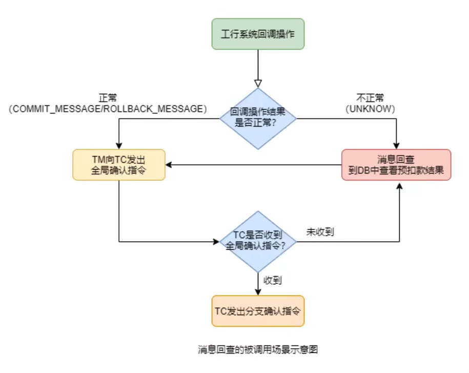


消息回查，即重新查询本地事务的执行状态。本例就是重新到DB中查看预扣款操作是否执行成功。

 >注意，消息回查不是重新执行回调操作。回调操作是进行预扣款处理的，而消息回查则是查看预扣款操作执行的结果
 >
 >
 >
 >引起消息回查的原因最常见的有两个：
 >
 >1. 回调操作返回UNKONW
 >2. TC没有接收到TM返回的最终全局事务确认指令

##### RocketMQ中的消息回查设置

关于消息回查，有三个常见的属性设置。它们都在Broker加载的配置文件中设置，例如：

* transactionTimeout=20 指定TM在20秒内应将最终确认状态返回给TC，否则引发消息回查。默认为60s
* transactionCheckMax =5，指定最多回查5次，超过后将丢弃消息并记录错误日志。默认15词。
* transactionCheckInterval =10，指定设置的多次消息回查的时间间隔为10s，默认为60s。


#### XA模式三剑客

##### XA协议

```
XA（Unix Transaction） 是一种分布式事务解决方案，一种分布式事务处理模式，是基于XA协议。XA协议由Tuxedo（Transaction for Unix has been Extended for Distribute  Operation  分布式操作扩展之后的Unix事务系统）首先提出的，并由X/Open组织，作为资源管理器与事务管理器的接口标准。
```

```
XA模式中有三个重要组件：**TC、TM、RM**
```


##### TC

```
Transaction Coordinator，事务协调者。维护全局和分支事务的状态，驱动全局事务提交或者回滚。

Broker充当这个角色
```


##### TM

```
Transaction Manager  事务管理器，定义全局事务的范围：开始全局事务、提交或回滚全局事务。它实际是全局事务的发起者

Producer充当着TM
```


##### RM

```
Resource Manager ,资源管理器。管理分支事务处理的资源，与TC交谈以注册分支事务和报告分支事务的状态，并驱动分支事务提交或回滚

Producer及Broker 均是RM
```


#### XA模式架构

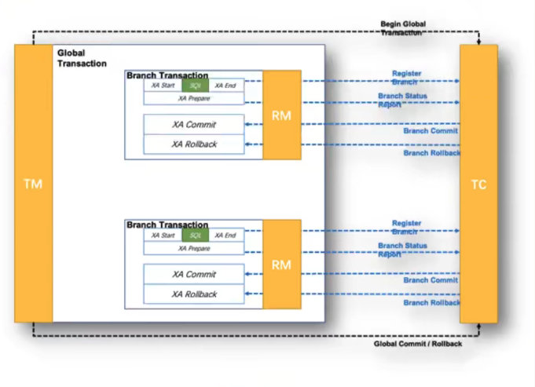

 XA是一个典型2PC，其执行原理如下：

1. TM向TC发起指令，开启一个全局事务

2. 根据业务要求，各个RM会逐个向TC注册分支事务，然后TC会逐个向RM发出预执行指令

3. 各个RM在接收到指令后会在进行本地事务预执行

4. RM将执行结果Report给TC。当然，这个结果可能是成功，也可能是失败。

5. TC在接收到各个RM的Report后会将汇总结果上报给TM，根据汇总结果TM向TC发出确认指令

   * 若所有结果都是成功响应，则向TC发送GlobalCommit 指令
   * 只要结果是失败响应，则向TC发送Global Rollback指令

6. TC在接收指令后再次向RM发送确认指令

   > 事务消息方案并不是一个典型的XA模式。因为XA模式中的分支事务是异步的，而事务方案中的消息预提交与扣款操作间是同步的。


#### 注意

* 事务消息不支持延时消息
* 对于事务消息要做好幂等性减产，因为事务消息可能不止一次被消费（因为存在回滚后在提交的情况）
* **事务消息不支持延时消息和批量消息。**
* 为了避免单个消息被检查太多次而导致半队列消息累积，我们默认将单个消息的检查次数限制为 15 次，但是用户可以通过 Broker 配置文件的 `transactionCheckMax`参数来修改此限制。如果已经检查某条消息超过 N 次的话（ N = `transactionCheckMax` ） 则 Broker 将丢弃此消息，并在默认情况下同时打印错误日志。用户可以通过重写 `AbstractTransactionalMessageCheckListener` 类来修改这个行为。
* 事务消息将在 Broker 配置文件中的参数 transactionTimeout 这样的特定时间长度之后被检查。当发送事务消息时，用户还可以通过设置用户属性 CHECK_IMMUNITY_TIME_IN_SECONDS 来改变这个限制，该参数优先于 `transactionTimeout` 参数。
* **事务性消息可能不止一次被检查或消费。**
* 提交给用户的目标主题消息可能会失败，目前这依日志的记录而定。它的高可用性通过 RocketMQ 本身的高可用性机制来保证，如果希望确保事务消息不丢失、并且事务完整性得到保证，建议使用同步的双重写入机制。
* 事务消息的生产者 ID 不能与其他类型消息的生产者 ID 共享。与其他类型的消息不同，事务消息允许反向查询、MQ服务器能通过它们的生产者 ID 查询到消费者


### 五、批量发送消息

#### 批量发送消息

##### 发送限制

生产者进行消息发送时可以一次发送多条消息，这可以大大提升Producer的发送效率。不过需要注意以下几点：

* 批量发送的消息必须具有相同的Topic
* 批量发送的消息必须具有相同的刷盘策略
* 批量发送的消息不能是延迟消息与事务消息


##### 批量发送大小

默认情况下，一批发送的消息总大小不能超过4MB字节。如果想超过该值，有两种解决方案：

* 方案一：将批量消息进行拆分，拆分为若干不大于4M的消息集合分多次批量发送

* 方案二：在Producer端与Broker端修改属性
  * Producer端需要在发送之前设置的Producer的MaxMessageSize属性
  * Broker端需要修改其加载的配置文件中的maxMessageSize属性


##### 生产者发送的消息大小


生产者听过send()方法发送的Message，并不是直接将Message序列化后发送到网络上的，而是通过这个Message生成了一个字符串发送出去的。这个字符串由四部分构成：topic、消息Body、消息日志（占20字节），及用于描述消息的一堆属性key-value。这些属性中包含例如生产者地址、生产时间、要发送的QueueId等。最终写入到Broker中消息单元中的消息数据都是来自于这些属性的。

#### 批量消费消息


使用MessageListenerConcurrently监听接口的consumeMessage() 方法的第一个参数为消息列表，但默认情况下，每次只能消费一条消息。若要使其一次可以消费多条消息，则可以通过COnsumer的consumeMessageBatchMaxSize属性来指定。不过，该值不能超过32。因为默认情况下消费者每次可以拉取的消息最多是32条。若要修改一次拉取的最大值，则可以通过修改Consumer的pullBatchSize属性来指定。


##### 存在的问题

consumer的pullBatchSize属性与consumeMessageBatch属性是否设置越大越好？当然不是

* pullBatchSize值设置的越大，Consumer每拉取一次需要的时间就会越长，且在网络上传输出现问题的可能性就越高。**若在拉取过程中若出现了问题，那么本批次所有的消息都需要全部重新拉取**
* consumerMessageBatchMaxSize值设置的越大，Consumer的消息并发消费能力越低，且这批被消费的消息具有相同的效果。因为consumeMessageBatchMaxSize指定的一批消息只会使用一个线程进行处理，**且在处理过程中只要有一个消息处理异常，则这批消息需要全部重新再次消费处理。**


#### 代码举例

该批量发送的需求时，不修改最大发送4M的默认值，但要防止发送的批量消息超过4M的限制。


### 六、消息过滤

消费者在进行消息订阅时，除了可以指定要订阅消息的Topic外，还可以对指定Topic中的消息根据指定条件进行过滤，即可以订阅比Topic更加细粒度的消息类型。

对于指定Topic消息的过滤有两种过滤方式：Tag过滤与SQL过滤

#### Tag过滤

在大多数情况下，TAG是一个简单而有用的设计，其可以来选择您想要的消息。例如：

```java
DefaultMQPushConsumer consumer = new DefaultMQPushConsumer("CID_EXAMPLE");
consumer.subscribe("TOPIC", "TAGA || TAGB || TAGC");
```


#### SQL过滤

SQL过滤是一种复杂特定表达式对事先埋入到消息中的用户属性进行筛选过滤的方式。通过SQL过滤，可以实现对消息的复杂过滤。不过，只有使用PUSH模式的消费者才能使用SQL过滤。

SQL过滤表达式支持多种常量类型与运算符。

RocketMQ只定义了一些基本语法来支持这个特性。你也可以很容易地扩展它。

- 数值比较，比如：**>，>=，<，<=，BETWEEN，=；**
- 字符比较，比如：**=，<>，IN；**
- **IS NULL** 或者 **IS NOT NULL；**
- 逻辑符号 **AND，OR，NOT；**

常量支持类型为：

- 数值，比如：**123，3.1415；**
- 字符，比如：**'abc'，必须用单引号包裹起来；**
- **NULL**，特殊的常量
- 布尔值，**TRUE** 或 **FALSE**

默认情况下，Broker没有开启消息的SQL过滤功能，需要在Broker加载的配置文件中添加如下属性：

```properties
# 默认是关闭的
enablePropertyFilter = true
```

在启动Broker时需要指定这个修改过的配置文件。例如对于单机Broker的启动，其修改的配置文件是conf/broker.conf  启动时使用如下命令：

```shell
sh bin/mqbroker -n localhost:9876 -c conf/broker.conf &
```


### 七、消息发送重试机制

#### 说明

对于消息重投，需要注意以下几点：

* 生产者在发送消息时吗，若采用同步或异步发送方式，发送失败会重试，但oneway消息发送方式发送失败是没有重试机制的
* 只有普通消息具有发送重试机制，顺序消息是没有的**（必须在一个Q上）**
* 消息重投机制可以保证消息尽可能发送成功、不丢失，但可能造成消息消费重复。消息重复在RocketMQ中是无法避免的
* 消息重复一般情况下不会发生，当出现消息量大、网络抖动、消息重复就会成为大概率事件
* producer主动重发、consumer负载变化（发生Rebalance，不会导致消息重复，但可能出现重复消费）也会导致重复消息
* 消息重复无法避免，但要避免消息的重复消费
* 避免消息重复消费的解决方案是，为消息天价唯一标识（例如消息key），使消费者对消息进行消费判断来避免重复消费
* 消息发送重试有三种策略可以选择：同步发送失败策略、异步发送失败策略、消息刷盘失败策略


#### 同步发送失败策略

对于普通消息，消息发送默认采用round-robin策略来选择所发送到的队列。如果发送失败，默认重试2次。但在重试时是不会选择上次发送失败的Broker，而是选择其他Broker。当然，若只有一个Broker其也只能发送到该Broker，但其会尽量发送到该Broker上的其他Queue。

```java
 // 设置消息发送失败重试次数
 producer.setRetryTimesWhenSendFailed(5);
 producer.setSendMsgTimeout(5);
```

同时，Broker还具有**失败隔离**功能，使Producer尽量选择未发生过发送失败的Broker作为目标Broker。其可以保证其他消息尽量不发送到问题Broker，为了提升消息发送效率，降低消息发送耗时。

> ***思考：让我们自己实现失败隔离功能，如何来做？***
>
> **方案一**：Producer中维护某JUC的Map集合，其key是发生失败的时间戳，value为broker实例。
>
> Producer中还维护着一个Set集合，其中存放着所有未发生发送异常的Broker实例。选择目标Broker是从该Set集合中选择的。在定义一个定时任务，定期从Map集合中将长期未发生发送异常的Broker清理出去，并添加到Set集合中。
>
> **方案二**：为Producer中的Broker实例添加一个标识，例如是一个AtomicBoolean属性。只要该Broker上发生过发送异常，就将其置为true。选择目标Broker就是选择该属性值为false的Broker。在定义一个定时任务，定期将Broker的该属性置为false。
>
> **方案三**：为Producer中的Broker实例添加一个标识，例如是一个AtomicLong属性。只要该Broker上发生过发送异常，就使其增加1。选择目标Broker就是选择该属性值最小的Broker。若该值相同，采用轮询方式选择。


如果超过重试次数，则抛出异常，由producer去保证消息不丢。当然当生产者出现RemotingException、MQclientException、MQBrokerException时，Producer会自动重投消息。


#### 异步发送失败策略

异步发送失败重试时，异步重试不会选择其他broker，仅在一个broker上做重试，所以该策略无法保证消息不丢。

```java
  // 设置消息发送失败重试次数
  producer.setRetryTimesWhenSendAsyncFailed(0);
```


#### 消息刷盘失败策略

消息刷盘超时（Master或Slave）或slave不可用（slave在做数据同步时向master返回状态不是SEND_OK）时，默认是不会将消息尝试发送到其他Broker的。不过，对于重要消息可以通过在Broker的配置文件设置**retryAnotherBrokerWhenNotStoreOK**属性为true来开启。


### 八、消息发送消费重试机制

#### 顺序消息的消费重试

对于顺序消息，当Consumer消费消息失败后，为了保证消息的顺序性，其会自动不断地进行消息重试，直到消费成功。

```java
// 顺序消费消息失败的消息重试时间间隔，单位毫秒，默认为1000，其取值范围为[10,30000]
 consumer.setSuspendCurrentQueueTimeMillis(100);
```

> **由于对顺序消息的重试是无休止的，不间断的，直至消费成功，所以对于顺序消费，务必要保证应用能够及时监控并处理消费失败的情况，避免消费被永久性阻塞。**

> 注意，顺序消费没有发送失败重试机制，但具有消费失败重试机制


#### 无序消息的消费重试

对于无序消息（普通、延时、事务消息），当Consumer消费消息失败时，可以通过设置返回状态达到消息重试的效果，不过需要注意，无序消息的重试 **只对集群消费方式生效**，广播消费方式不提供失败重试特性。即对于广播消费，消费失败后，失败消息不在重试，继续消费后续消息。


#### 消费重试次数与间隔

对于无序消息集群消费下的重试消费，每条消息默认最多重试16次，但每次重试的间隔时间是不同的，会逐渐变长，每次重试的间隔时间如下：

| 重试次数 | 与上次重试的间隔时间 |
| :------: | :------------------: |
|    1     |         10s          |
|    2     |         30s          |
|    3     |        1分钟         |
|    4     |        2分钟         |
|    5     |        3分钟         |
|    6     |        4分钟         |
|    7     |        5分钟         |
|    8     |        6分钟         |
|    9     |        7分钟         |
|    10    |        8分钟         |
|    11    |        9分钟         |
|    12    |        10分钟        |
|    13    |        20分钟        |
|    14    |        30分钟        |
|    15    |        1小时         |
|    16    |        2小时         |

> 若一条消息在一直消费失败的前提下，将会在正常消费后的**第4小时46分后进行第16次尝试**，若还失败，**则将消息投递到死信队列中。**

> ```java
> consumer.setMaxReconsumeTimes(10);
> ```
>
> 对于修改过的重试次数，将按照以下策略执行：
>
> * 若修改值小于16，则按照指定时间间隔进行重试
> * 若修改值大于16，则超过16次的重试时间间隔均为2小时
>
> 对于Consumer Group，若仅修改了一个Consumer的消费重试次数，则会应用到该Group中所有其他Consumer实例。若出现多个Consumer均做了修改的情况，则采用覆盖方式生效，即最后被修改的值会覆盖前面设置的值。


#### 重试队列

对于需要重试消费的消息，并不是Consumer在等待了指定时长后再次去拉取原来的消息进行消费的，而是将这些需要重试的消息放到一个Topic的队列中，而后进行再次消费的。这个特殊的队列就就是**重试队列**。

当出现需要重试消费的消息时，Broker会为每个消费组都设置一个Topic名词为 **%RETRY%consumerGroup@consumerGroup**的重试队列

> 1）这个重试队列是针对消息才组的，而不是针对每个Topic设置的（一个Topic的消息可以让多个消费组进行消费，所以会为这些消费者组各创建一个重试队列）
>
> 2）只有当出现需要进行重试消费的消息后，才会为该消费者组创建重试队列


> 注意，消费重试的时间间隔与**延时消费**的**延时等级**十分相似，除了没有延迟等级的前两个时间外，其他的时间都是相同的

Broker对于重试消息的处理是通过延时消息实现的。先将消息保存到SCHEDULE_TOPIC_XXXX延迟队列中，延迟时间到后，会将消息投递到%RETRY%consumerGroup@consumerGroup重试队列中。


#### 消费重试配置方式

 集群消费方式下，消息消费失败后若希望消费重试，则需要在消息监听器接口中明确进行如下下三种方式之一的配置：

* 返回ConsumeConcurrentStatus.RECONSUME_LATER
* 返回Null
* 抛出异常


#### 消费不重试配置方式

 集群消费方式下，消息消费失败后若不希望消费重试，则在捕获异常后同样也返回与消费成功后相同的结果，即ConsumeConcurrentStatus.CONSUMER_SUCCESS ,则不进行消费重试。

 

### 九、死信队列

#### 什么是死信队列

当一条消息初次消费失败，消息队列会自动进行消费重试；达到最大重试次数后，若消费依然失败，则表明消费者在正常情况下无法正确的消费该消息，此时，消息队列不会立刻将消息丢弃，而是将其发送到该消费者对应的特殊队列中。这个队列就是死信队列（Dead-Letter Queue，DLQ）,而其中的消息则称为死信消息（Dead-Letter Message，DLQ）

> 死信队列是用于处理无法被正常消费的消息的。


#### 死信队列的特征

死信队列具有如下特征：

* 死讯队列中的消息不会再被消费者正常消费，即DLQ对于消费者是不可见的
* 死信存储有效期与正常消息相同，均为3天（commiylog文件的过期时间），3天后会被自动删除
* 死信队列就是一个特殊的Topic，名称为%DLQ%consumerGroup@consumerGroup，即每个消费组都有一个死信队列
* 如果一个消费者组未产生死信消息，则不会为其创建相应的死信队列


#### 死信消息的处理

实际上，当一条消息进入死信队列，就意味着系统中某些地方出现了问题，从而导致了消费者无法正常消费该消息，比如代码中原本就存在bug。因此，对于死信消息，通常需要开发人员进行特殊处理。最关键的步骤是要排查可疑因素，解决代码中可能存在的bug，然后再将原来的死信消息再次进行投递消费。


