# MongoDB学习

MongoDB用起来 - 快速上手&集群和安全系列

​	

## 课程目标

- 理解MongoDB的业务场景、熟悉MongoDB的简介、特点和体系结构、数据类型等。 

- 能够在Windows和Linux下安装和启动MongoDB、图形化管理界面Compass的安装使用 

- 掌握MongoDB基本常用命令实现数据的CRUD 

- 掌握MongoDB的索引类型、索引管理、执行计划。

- 使用Spring Data MongoDB完成文章评论业务的开发


## 1、MongoDB相关概念

### 1.1 业务应用场景

传统的关系型数据库(如MySQL)，在数据操作的“三高”需求以及应对Web2.0的网站需求面前，显得力不从心。 解释:“三高”需求:

- High performance - 对数据库高并发读写的需求。

- Huge Storage - 对海量数据的高效率存储和访问的需求。

- High Scalability && High Availability- 对数据库的高可扩展性和高可用性的需求

**而MongoDB可应对“三高”需求。**


**具体的应用场景如:**

1. 社交场景，使用 MongoDB 存储存储用户信息，以及用户发表的朋友圈信息，通过地理位置索引实现附近的人、地点等功能。

2. 游戏场景，使用 MongoDB 存储游戏用户信息，用户的装备、积分等直接以内嵌文档的形式存储，方便查询、高效率存储和访问。

3. 物流场景，使用 MongoDB 存储订单信息，订单状态在运送过程中会不断更新，以 MongoDB 内嵌数组的形式来存储，一次查询就能将 订单所有的变更读取出来。

4. 物联网场景，使用 MongoDB 存储所有接入的智能设备信息，以及设备汇报的日志信息，并对这些信息进行多维度的分析。

5. 视频直播，使用 MongoDB 存储用户信息、点赞互动信息等。


这些应用场景中，数据操作方面的共同特点是:

1. 数据量大

2. 写入操作频繁(读写都很频繁)

3. 价值较低的数据，对事务性要求不高 对于这样的数据，我们更适合使用MongoDB来实现数据的存储。


**什么时候选择MongoDB ？**

在架构选型上，除了上述的三个特点外，如果你还犹豫是否要选择它?可以考虑以下的一些问题: 

应用不需要事务及复杂 join 支持

新应用，需求会变，数据模型无法确定，想快速迭代开发 

应用需要2000-3000以上的读写QPS(更高也可以) 

应用需要TB甚至 PB 级别数据存储 

应用发展迅速，需要能快速水平扩展 

应用要求存储的数据不丢失

应用需要99.999%高可用

应用需要大量的地理位置查询、文本查询

如果上述有1个符合，可以考虑 MongoDB，2个及以上的符合，选择 MongoDB 绝不会后悔。

思考:如果用MySQL呢? 

答:相对MySQL，可以以更低的成本解决问题(包括学习、开发、运维等成本)


### 1.2 MongoDB简介

MongoDB是一个开源、高性能、无模式的文档型数据库，当初的设计就是用于简化开发和方便扩展，是NoSQL数据库产品中的一种。是最 像关系型数据库(MySQL)的非关系型数据库。

它支持的数据结构非常松散，是一种类似于 JSON 的 格式叫BSON，所以它既可以存储比较复杂的数据类型，又相当的灵活。

MongoDB中的记录是一个文档，它是一个由字段和值对(field:value)组成的数据结构。MongoDB文档类似于JSON对象，即一个文档认为就是一个对象。字段的数据类型是字符型，它的值除了使用基本的一些类型外，还可以包括其他文档、普通数组和文档数组。


### 1.3 体系结构

MySQL和MongoDB对比

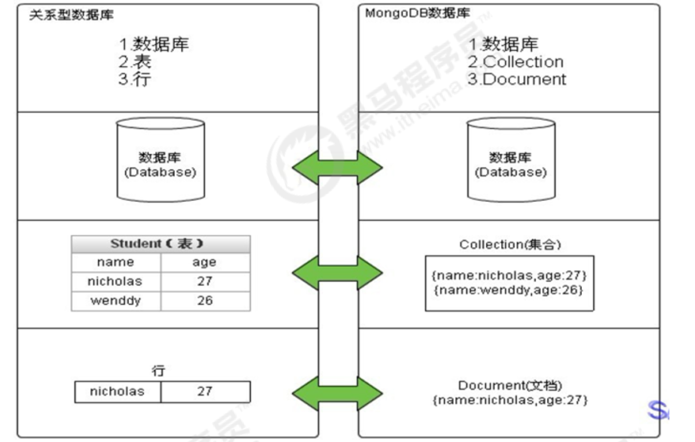

| SQL术语/概念 | MongoDB术语/概念 |              解释/说明              |
| :----------: | :--------------: | :---------------------------------: |
|   database   |     database     |               数据库                |
|    table     |    collection    |            数据库表/集合            |
|     row      |     document     |           数据记录行/文档           |
|    column    |      field       |             数据字段/域             |
|    index     |      index       |                索引                 |
| table joins  |                  |        表连接,MongoDB不支持         |
|              |     嵌入文档     | MongoDB通过嵌入式文档来替代多表连接 |
| primary key  |   primary key    | 主键,MongoDB自动将_id字段设置为主键 |


### 1.4 数据模型

MongoDB的最小存储单位就是文档(document)对象。文档(document)对象对应于关系型数据库的行。数据在MongoDB中以BSON(Binary-JSON)文档的格式存储在磁盘上。

BSON(Binary Serialized Document Format)是一种类json的一种二进制形式的存储格式，简称Binary JSON。BSON和JSON一样，支持内嵌的文档对象和数组对象，但是BSON有JSON没有的一些数据类型，如Date和BinData类型。

BSON采用了类似于 C 语言结构体的名称、对表示方法，支持内嵌的文档对象和数组对象，具有轻量性、可遍历性、高效性的三个特点，可以有效描述非结构化数据和结构化数据。这种格式的优点是灵活性高，但它的缺点是空间利用率不是很理想。

Bson中，除了基本的JSON类型:string,integer,boolean,double,null,array和object，mongo还使用了特殊的数据类型。这些类型包括 date,object id,binary data,regular expression 和code。每一个驱动都以特定语言的方式实现了这些类型，查看你的驱动的文档来获取详 细信息。


**BSON数据类型参考列表:**

| 数据类型      | 描述                                                         | 举例                                                 |
| ------------- | ------------------------------------------------------------ | ---------------------------------------------------- |
| 字符串        | UTF-8字符串都可表示为字符串类型的数据                        | {"x" : "foobar"}                                     |
| 对象id        | 对象id是文档的12字节的唯一 ID                                | {"X" :ObjectId() }                                   |
| 布尔值        | 真或者假:true或者false                                       | {"x":true}+                                          |
| 数组          | 值的集合或者列表可以表示成数组                               | {"x" : ["a", "b", "c"]}                              |
| 32位整数      | **类型不可用**。JavaScript仅支持64位浮点数，所以32位整数会被自动转换。 | shell是不支持该类型的，shell中默认会转换成64位浮点数 |
| 64位整数      | **不支持这个类型**。shell会使用一个特殊的内嵌文档来显示64位  | shell是不支持该类型的，shell中默认会转换成64 整数    |
| 64位浮点数    | shell中的数字就是这一种类型                                  | {"x":3.14159，"y":3}                                 |
| null          | 表示空值或者未定义的对象                                     | {"x":null}                                           |
| undefined     | 文档中也可以使用未定义类型                                   | {"x":undefined}                                      |
| 符号          | shell不支持，shell会将数据库中的符号类型的数据自动转换成 字符串 |                                                      |
| 正则表达式    | 文档中可以包含正则表达式，采用JavaScript的正则表达式语法     | {"x" : /foobar/i}                                    |
| 代码          | 文档中还可以包含JavaScript代码                               | {"x" : function() { /* ...... */ }}                  |
| 二进制数据    | 二进制数据可以由任意字节的串组成，不过shell中无法使用        |                                                      |
| 最大值/最小值 | BSON包括一个特殊类型，表示可能的最大值。shell中没有这个类型。 |                                                      |


**提示：**

shell默认使用64位浮点型数值。{“x”:3.14}或{“x”:3}。对于整型值，可以使用NumberInt(4字节符号整数)或NumberLong(8字节符号整数)，{“x”:NumberInt(“3”)}{“x”:NumberLong(“3”)}


### 1.5 MongoDB的特点

MongoDB主要有如下特点:

**(1)高性能:**

- MongoDB提供高性能的数据持久性。特别是 对嵌入式数据模型的支持减少了数据库系统上的I/O活动。
- 索引支持更快的查询，并且可以包含来自嵌入式文档和数组的键。(文本索引解决搜索的需求、TTL索引解决历史数据自动过期的需求、地 理位置索引可用于构建各种 O2O 应用) 

- mmapv1、wiredtiger、mongorocks(rocksdb)、in-memory 等多引擎支持满足各种场景需求。 

- Gridfs解决文件存储的需求。

**(2)高可用性:**

- MongoDB的复制工具称为副本集(replica set)，它可提供自动故障转移和数据冗余。

**(3)高扩展性:**

- MongoDB提供了水平可扩展性作为其核心功能的一部分。 分片将数据分布在一组集群的机器上。(海量数据存储，服务能力水平扩展)从3.4开始，MongoDB支持基于片键创建数据区域。在一个平衡的集群中，MongoDB将一个区域所覆盖的读写只定向到该区域内的那些 片。

**(4)丰富的查询支持:** 

- MongoDB支持丰富的查询语言，支持读和写操作(CRUD)，比如数据聚合、文本搜索和地理空间查询等。

**(5)其他特点:**

- 如无模式(动态模式)、灵活的文档模型、


## 2、单机部署

> 官网社区版本下载地址：https://www.mongodb.com/try/download/community

提示:版本的选择:

MongoDB的版本命名规范如:

- x.y.z; y为奇数时表示当前版本为开发版，如:1.5.2、4.1.13; 
- y为偶数时表示当前版本为稳定版，如:1.6.3、4.0.10; 
- z是修正版本号，数字越大越好。

### 2.1 下载适合自己版本 Mac


### 2.2 解压安装启动

将压缩包解压到一个目录中。 在解压目录中，手动建立一个目录用于存放数据文件，如 data/db

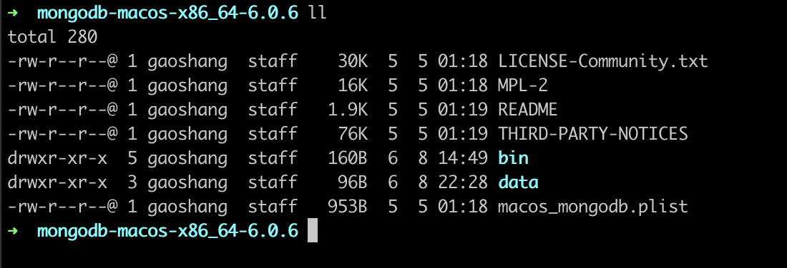

#### 2.2.1 启动方式一

> 命令行参数方式启动服务

在 bin 目录中打开命令行提示符，输入如下命令:

```shell
mongod --dbpath=../data/db
```

我们在启动信息中可以看到，mongoDB的默认端口是27017，如果我们想改变默认的启动端口，可以通过--port来指定端口。 为了方便我们每次启动，可以将安装目录的bin目录设置到环境变量的path中， bin 目录下是一些常用命令，比如 mongod 启动服务用的，mongo 客户端连接服务用的。

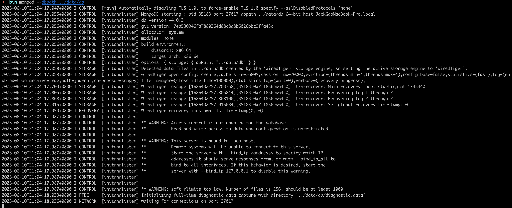

#### 2.2.2 启动方式二

> 配置文件方式启动服务

在解压目录中新建 config 文件夹，该文件夹中新建配置文件 mongod.conf ，内如参考如下:

```json
systemLog:
   destination: file
   path: "/Users/gaoshang/IdeaProjects/mongodb-macos-x86_64-6.0.6/log/mongod.log"
   logAppend: true
storage:
   dbPath: "/Users/gaoshang/IdeaProjects/mongodb-macos-x86_64-6.0.6/data"
   journal:
      enabled: true
processManagement:
   fork: true
net:
   bindIp: 127.0.0.1
   port: 27017
setParameter:
   enableLocalhostAuthBypass: false
```

详细配置项内容可以参考官方文档: https://www.mongodb.com/docs/manual/reference/configuration-options/

启动成功

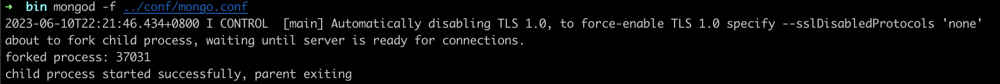

【注意】 

- 配置文件中如果使用双引号，比如路径地址，自动会将双引号的内容转义。如果不转义，则会报错:

```shell
error-parsing-yaml-config-file-yaml-cpp-error-at-line-3-column-15-unknown-escape-character-d
```

解决:

```
a. 对 \ 换成 / 或 \\
b. 如果路径中没有空格，则无需加引号。
```


- 配置文件中不能以Tab分割字段

解决:

```
将其转换成空格。
```

**启动方式:**

```shell
mongod -f ../config/mongod.conf
或
mongod --config ../config/mongod.conf
```

更多参数配置:

```
systemLog:
   destination: file
   path: "/Users/gaoshang/IdeaProjects/mongodb-macos-x86_64-6.0.6/log/mongod.log"
   logAppend: true
storage:
   dbPath: "/Users/gaoshang/IdeaProjects/mongodb-macos-x86_64-6.0.6/data"
   journal:
      enabled: true
processManagement:
   fork: true
net:
   bindIp: 127.0.0.1
   port: 27017
setParameter:
   enableLocalhostAuthBypass: false
...
```


### 2.3 Shell连接(mongo命令)

在命令提示符输入以下shell命令即可完成登陆

```shell
mongo
或
mongo --host=127.0.0.1 --port=27017
```

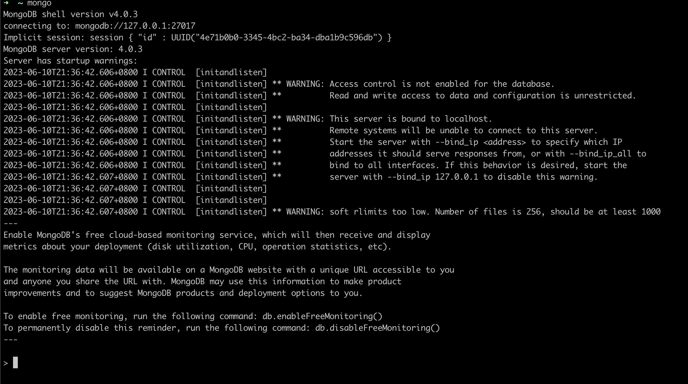

查看已经有的数据库

```shell
show databases
```

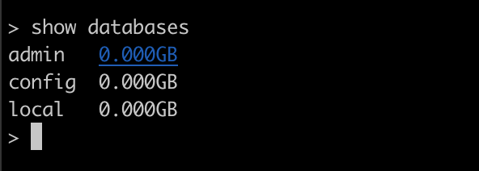


更多参数可以通过帮助查看:

```shell
mongo --help
```

提示:

MongoDB javascript shell是一个基于javascript的解释器，故是支持js程序的。


### 2.4 Compass-图形化界面客户端

> 下载地址：https://www.mongodb.com/try/download/tools


### 2.5 Linux系统中的安装启动和连接

目标:在Linux中部署一个单机的MongoDB，作为生产环境下使用。 

提示:和Windows下操作差不多。

步骤如下:

(1)先到官网下载压缩包 mongod-linux-x86_64-4.0.10.tgz 。

(2)上传压缩包到Linux中，解压到当前目录:

```shell
tar -xvf mongodb-linux-x86_64-4.0.10.tgz
```

(3)移动解压后的文件夹到指定的目录中:

```shell
mv mongodb-linux-x86_64-4.0.10 /usr/local/mongodb
```

(4)新建几个目录，分别用来存储数据和日志:

```shell
#数据存储目录
mkdir -p /mongodb/single/data/db 
#日志存储目录
mkdir -p /mongodb/single/log
```

(5)新建并修改配置文件

```shell
vi /mongodb/single/mongod.conf
```

配置文件的内容如下:

```
systemLog:
   destination: file
   path: "/Users/gaoshang/IdeaProjects/mongodb-macos-x86_64-6.0.6/log/mongod.log"
   logAppend: true
storage:
   dbPath: "/Users/gaoshang/IdeaProjects/mongodb-macos-x86_64-6.0.6/data"
   journal:
      enabled: true
processManagement:
   fork: true
net:
   bindIp: 127.0.0.1
   port: 27017
setParameter:
   enableLocalhostAuthBypass: false
```

(6)启动MongoDB服务

```shell
➜  bin mongod -f ../conf/mongo.conf
2023-06-10T22:21:46.434+0800 I CONTROL  [main] Automatically disabling TLS 1.0, to force-enable TLS 1.0 specify --sslDisabledProtocols 'none'
about to fork child process, waiting until server is ready for connections.
forked process: 37031
child process started successfully, parent exiting
```

通过进程来查看服务是否启动了:

```shell
➜  bin ps -ef |grep mongod
  501 37031     1   0 10:21下午 ??         0:01.70 mongod -f ../conf/mongo.conf
  501 37166 34671   0 10:27下午 ttys001    0:00.01 grep --color=auto --exclude-dir=.bzr --exclude-dir=CVS --exclude-dir=.git --exclude-dir=.hg --exclude-dir=.svn --exclude-dir=.idea --exclude-dir=.tox mongod
```

(7)停止关闭服务

停止服务的方式有两种:快速关闭和标准关闭，下面依次说明: 

(一) 快速关闭方法(快速，简单，数据可能会出错) 

目标:通过系统的kill命令直接杀死进程:  杀完要检查一下，避免有的没有杀掉。

```shell
#通过进程编号关闭节点 
kill -2 54410
```

(二) 标准的关闭方法(数据不容易出错，但麻烦):

目标:通过mongo客户端中的shutdownServer命令来关闭服务

主要的操作步骤参考如下:

```shell
//客户端登录服务，注意，这里通过localhost登录，如果需要远程登录，必须先登录认证才行。 
mongo --port 27017
//#切换到admin库
use admin
//关闭服务 
db.shutdownServer()
```


## 3、基本常用命令

### 3.1 案例需求

存放文章评论的数据存放到MongoDB中，数据结构参考如下:

数据库:articledb

| 专栏文章评论   | comment        |                  |                           |
| -------------- | -------------- | ---------------- | ------------------------- |
| 字段名称       | 字段含义       | 字段类型         | 备注                      |
| _id            | ID             | ObjectId或String | Mongo的主键的字段         |
| articleid      | 文章ID         | String           |                           |
| content        | 评论内容       | String           |                           |
| userid         | 评论人ID       | String           |                           |
| nickname       | 评论人昵称     | String           |                           |
| createdatetime | 评论的日期时间 | Date             |                           |
| likenum        | 点赞数         | Int32            |                           |
| replynum       | 回复数         | Int32            |                           |
| state          | 状态           | String           | 0:不可见;1:可见;          |
| parentid       | 上级ID         | String           | 如果为0表示文章的顶级评论 |


### 3.2 数据库操作

#### 3.2.1 选择和创建数据库

选择和创建数据库的语法格式:

```
use 数据库名称
```

如果数据库不存在则自动创建，例如，以下语句创建 spitdb 数据库:

```
use articledb
```

查看有权限查看的所有的数据库命令

```
show dbs
或
show databases
```

> 注意: 在 MongoDB 中，集合只有在内容插入后才会创建! 就是说，创建集合(数据表)后要再插入一个文档(记录)，集合才会真正创建。

查看当前正在使用的数据库命令

```
db
```

MongoDB 中默认的数据库为 test，如果你没有选择数据库，集合将存放在 test 数据库中。

**另外: 数据库名可以是满足以下条件的任意UTF-8字符串。**

- 不能是空字符串("")。

- 不得含有' '(空格)、.、$、/、\和\0 (空字符)。 
- 应全部小写。

- 最多64字节。


**有一些数据库名是保留的，可以直接访问这些有特殊作用的数据库。**

- admin: 从权限的角度来看，这是"root"数据库。要是将一个用户添加到这个数据库，这个用户自动继承所有数据库的权限。一些特定的服务器端命令也只能从这个数据库运行，比如列出所有的数据库或者关闭服务器。

- local: 这个数据永远不会被复制，可以用来存储限于本地单台服务器的任意集合

- config: 当Mongo用于分片设置时，config数据库在内部使用，用于保存分片的相关信息。


MongoDB 删除数据库的语法格式如下:

```javascript
db.dropDatabase();
```

提示:主要用来删除已经持久化的数据库


### 3.3 集合操作

集合，类似关系型数据库中的表。可以显示的创建，也可以隐式的创建

#### 3.3.1 集合的显式创建(了解)

基本语法格式:

```
db.createCollection(name)
```

参数说明:   name: 要创建的集合名称

例如:创建一个名为 mycollection 的普通集合。

```
db.createCollection("mycollection")
```

查看当前库中的表:show tables命令

```
show collections
或
show tables
```

**集合的命名规范:**

- 集合名不能是空字符串""。
- 集合名不能含有\0字符(空字符)，这个字符表示集合名的结尾。
- 集合名不能以"system."开头，这是为系统集合保留的前缀。 
- 用户创建的集合名字不能含有保留字符。有些驱动程序的确支持在集合名里面包含，这是因为某些系统生成的集合中包含该字符。除 非你要访问这种系统创建的集合，否则千万不要在名字里出现$。

#### 3.3.2 集合的隐式创建

当向一个集合中插入一个文档的时候，如果集合不存在，则会自动创建集合。 详见 文档的插入 章节。提示:通常我们使用隐式创建文档即可。

#### 3.3.3 集合的删除

```
db.collection.drop()
或 
db.集合.drop()
```

返回值 如果成功删除选定集合，则 drop() 方法返回 true，否则返回 false。 例如:要删除mycollection集合

```
db.mycollection.drop()
```


### 3.4 文档基本CRUD

> 官网地址：https://www.mongodb.com/docs/manual/tutorial/insert-documents/

文档(document)的数据结构和 JSON 基本一样。所有存储在集合中的数据都是 BSON 格式。

#### 3.4.1 文档的插入

(1)单个文档插入

使用insertOne() 或 save() 方法向集合中插入文档，语法如下:

```shell
db.collection.insert(
<document or array of documents>, {
writeConcern: <document>,
ordered: <boolean> }
)
```

| Parameter    | Type              | Description                                                  |
| ------------ | ----------------- | ------------------------------------------------------------ |
| document     | document or array | 要插入到集合中的文档或文档数组。((json格式)                  |
| writeConcern | document          | Optional. A document expressing the write concern. Omit to use the default write concern.See Write Concern.Do not explicitly set the write concern for the operation if run in a transaction. To use write concern with transactions, see Transactions and Write Concern. |
| ordered      | boolean           | 可选。如果为真，则按顺序插入数组中的文档，如果其中一个文档出现错误，MongoDB将返回而 不处理数组中的其余文档。如果为假，则执行无序插入，如果其中一个文档出现错误，则继续处理 数组中的主文档。在版本2.6+中默认为true |


【示例】 要向comment的集合(表)中插入一条测试数据:

```shell
db.comment.insertOne({"articleid":"100000","content":"今天天气真好，阳光明 媚","userid":"1001","nickname":"Rose","createdatetime":new Date(),"likenum":NumberInt(10),"state":null})
```

**提示:**

- comment集合如果不存在，则会隐式创建 
- mongo中的数字，默认情况下是double类型，如果要存整型，必须使用函数NumberInt(整型数字)，否则取出来就有问题了。 
- 插入当前日期使用 new Date()
- 插入的数据没有指定 _id ，会自动生成主键值
- 如果某字段没值，可以赋值为null，或不写该字段。

**注意:**

- 文档中的键/值对是有序的。
- 文档中的值不仅可以是在双引号里面的字符串，还可以是其他几种数据类型(甚至可以是整个嵌入的文档)。 
- MongoDB区分类型和大小写。
- MongoDB的文档不能有重复的键。
- 文档的键是字符串。除了少数例外情况，键可以使用任意UTF-8字符。

**文档键命名规范:**

- 键不能含有\0 (空字符)。这个字符用来表示键的结尾。 
- .和$有特别的意义，只有在特定环境下才能使用。
- 以下划线"_"开头的键是保留的(不是严格要求的)。

**(2)批量插入**

语法:

```
db.collection.insertMany(
[ <document 1> , <document 2>, ... ], {
writeConcern: <document>,
ordered: <boolean> }
)
```

参数:

| Parameter    | Type              | Description                                                  |
| ------------ | ----------------- | ------------------------------------------------------------ |
| document     | document or array | 要插入到集合中的文档或文档数组。((json格式)                  |
| writeConcern | document          | Optional. A document expressing the write concern. Omit to use the default write concern.See Write Concern.Do not explicitly set the write concern for the operation if run in a transaction. To use write concern with transactions, see Transactions and Write Concern. |
| ordered      | boolean           | 可选。如果为真，则按顺序插入数组中的文档，如果其中一个文档出现错误，MongoDB将返回而 不处理数组中的其余文档。如果为假，则执行无序插入，如果其中一个文档出现错误，则继续处理 数组中的主文档。在版本2.6+中默认为true |

【示例】

批量插入多条文章评论:

```shell
db.comment.insertMany([ {"_id":"1","articleid":"100001","content":"我们不应该把清晨浪费在手机上，健康很重要，一杯温水幸福你我他。","userid":"1002","nickname":"相忘于江湖","createdatetime":new Date("2019-08-05T22:08:15.522Z"),"likenum":NumberInt(1000),"state":"1"},
{"_id":"2","articleid":"100001","content":"我夏天空腹喝凉开水，冬天喝温开水","userid":"1005","nickname":"伊人憔 悴","createdatetime":new Date(),"likenum":NumberInt(888),"state":"1"},
{"_id":"3","articleid":"100001","content":"我一直喝凉开水，冬天夏天都喝。","userid":"1004","nickname":"杰克船 长","createdatetime":new Date(),"likenum":NumberInt(666),"state":"1"},
{"_id":"4","articleid":"100001","content":"专家说不能空腹吃饭，影响健康。","userid":"1003","nickname":"凯 撒","createdatetime":new Date(),"likenum":NumberInt(2000),"state":"1"},
{"_id":"5","articleid":"100001","content":"研究表明，刚烧开的水千万不能喝，因为烫 嘴。","userid":"1003","nickname":"凯撒","createdatetime":new Date("2019-08-06T11:01:02.521Z"),"likenum":NumberInt(3000),"state":"1"}
]);
```

提示:

- 插入时指定了 _id ，则主键就是该值。
- 如果某条数据插入失败，将会终止插入，但已经插入成功的数据不会回滚掉。 
- 因为批量插入由于数据较多容易出现失败，因此，可以使用try catch进行异常捕捉处理，测试的时候可以不处理。如(了解):

```
try { 
db.comment.insertMany([ {"_id":"11","articleid":"100001","content":"我们不应该把清晨浪费在手机上，健康很重要，一杯温水幸福你我他。","userid":"1002","nickname":"相忘于江湖","createdatetime":new Date("2019-08-05T22:08:15.522Z"),"likenum":NumberInt(1000),"state":"1"},
{"_id":"12","articleid":"100001","content":"我夏天空腹喝凉开水，冬天喝温开水","userid":"1005","nickname":"伊人憔 悴","createdatetime":new Date(),"likenum":NumberInt(888),"state":"1"},
{"_id":"23","articleid":"100001","content":"我一直喝凉开水，冬天夏天都喝。","userid":"1004","nickname":"杰克船 长","createdatetime":new Date(),"likenum":NumberInt(666),"state":"1"},
{"_id":"14","articleid":"100001","content":"专家说不能空腹吃饭，影响健康。","userid":"1003","nickname":"凯 撒","createdatetime":new Date(),"likenum":NumberInt(2000),"state":"1"},
{"_id":"15","articleid":"100001","content":"研究表明，刚烧开的水千万不能喝，因为烫 嘴。","userid":"1003","nickname":"凯撒","createdatetime":new Date("2019-08-06T11:01:02.521Z"),"likenum":NumberInt(3000),"state":"1"}
]);

} catch (e) { print (e);
}
```


#### 3.4.2 文档的基本查询

查询数据的语法格式如下:

```shell
db.collection.find(<query>, [projection])

db.comment.find({_id:"1"},{articleid:1,likenum:1})
```

参数:

| Parameter  | Type     | Description                                                  |
| ---------- | -------- | ------------------------------------------------------------ |
| query      | document | 可选。使用查询运算符指定选择筛选器。若要返回集合中的所有文档，请省略此参数或传递空文档 ({})。 |
| projection | document | 可选。指定要在与查询筛选器匹配的文档中返回的字段(投影)。若要返回匹配文档中的所有字段， |


示例】

**(1)查询所有** 如果我们要查询spit集合的所有文档，我们输入以下命令

```
b.comment.find() 或 db.comment.find({})
```

这里你会发现每条文档会有一个叫_id的字段，这个相当于我们原来关系数据库中表的主键，当你在插入文档记录时没有指定该字段， MongoDB会自动创建，其类型是ObjectID类型。

如果我们在插入文档记录时指定该字段也可以，其类型可以是ObjectID类型，也可以是MongoDB支持的任意类型。

如果我想按一定条件来查询，比如我想查询userid为1003的记录，怎么办?很简单!只 要在find()中添加参数即可，参数也是json格式，如下:

```
db.comment.find({userid:'1003'})
```

如果你只需要返回符合条件的第一条数据，我们可以使用findOne命令来实现，语法和find一样。 如:查询用户编号是1003的记录，但只最多返回符合条件的第一条记录:

```
db.comment.findOne({userid:'1003'})
```

**(2)投影查询(Projection Query):**

如果要查询结果返回部分字段，则需要使用投影查询(不显示所有字段，只显示指定的字段)。

如:查询结果只显示 _id、userid、nickname :

```
db.comment.find({_id:"1"},{articleid:1,likenum:1})
```

默认 _id 会显示。


#### 3.4.3 文档的更新

更新文档的语法:

```shell
db.collection.update(query, update, options) //或
db.collection.update(
<query>, <update>, {
upsert: <boolean>,
multi: <boolean>,
writeConcern: <document>,
collation: <document>,
arrayFilters: [ <filterdocument1>, ... ],
hint: <document|string> // Available starting in MongoDB 4.2
} )
```

参数:

| Parameter    | Type                 | Description                                                  |
| ------------ | -------------------- | ------------------------------------------------------------ |
| query        | document             | 更新的选择条件。可以使用与find()方法中相同的查询选择器，类似sql update查询内where后面的。。在3.0版中进行了更改:当使用upsert:true执行update()时，如果查询使用点表示法在_id字段上指定条件，则MongoDB将拒绝插入新文档。 |
| update       | document or pipeline | 要应用的修改。该值可以是:包含更新运算符表达式的文档，或仅包含:对的替换文档，或在MongoDB 4.2中启动聚合管道。管道可以由以下阶段组成: set unset replaceWith。换句话说:它是update的对象和一些更新的操作符(如 inc...)等，也可以理解 |
| upsert       | boolean              | 可选。如果设置为true，则在没有与查询条件匹配的文档时创建新文档。默认值为false，如果找不到匹配项，则不会插入新文档。 |
| multi        | boolean              | 可选。如果设置为true，则更新符合查询条件的多个文档。如果设置为false，则更新一个文档。默认值为false。 |
| writeConcern | document             | 可选。表示写问题的文档。抛出异常的级别。                     |
| collation    | document             | 可选。指定要用于操作的校对规则。校对规则允许用户为字符串比较指定特定于语言的规则，例如字母大小写和重音标记的规则。 |

提示: 主要关注前四个参数即可。

【示例】

(1)局部修改

如果我们想修改_id为1的记录，点赞量为1001，输入以下语句:

```
db.comment.updateOne({_id:"1"},{$set:{likenum:NumberInt(100000)}});
```

(2)批量的修改

```shell
db.comment.updateMany({articleid:"100001"},{$set:{content:"双击777"}});
```

(3)列值增长的修改

如果我们想实现对某列值在原有值的基础上进行增加或减少，可以使用 $inc 运算符来实现。

需求:对3号数据的点赞数，每次递增1

```shell
db.comment.updateOne({_id:"3"},{$inc:{likenum:NumberInt(1)}})
```


#### 3.4.4 删除文档

删除文档的语法结构:

```shell
db.集合名称.remove(条件);
```

以下语句可以将数据全部删除，请慎用

```shell
db.comment.deleteMany({});
```

如果删除_id=1的记录，输入以下语句

```shell
db.comment.deleteOne({_id:1})
```


### 3.5 文档的分页查询

#### 3.5.1 统计查询

统计查询使用count()方法，语法如下:

```
db.collection.countDocuments(query, options)
db.comment.countDocuments({_id:"1"})
```

参数:

| Parameter | Type     | Description                    |
| --------- | -------- | ------------------------------ |
| query     | document | 查询选择条件。                 |
| options   | document | 可选。用于修改计数的额外选项。 |

提示: 可选项暂时不使用。

#### 3.5.2 分页列表查询

可以使用limit()方法来读取指定数量的数据，使用skip()方法来跳过指定数量的数据。

基本语法如下所示:

```
db.COLLECTION_NAME.find().limit(NUMBER).skip(NUMBER)
```

如果你想返回指定条数的记录，可以在find方法后调用limit来返回结果(TopN)，默认值20，例如:

```
db.comment.find().limit(2)
```

skip方法同样接受一个数字参数作为跳过的记录条数。(前N个不要),默认值是0

```
db.comment.find().limit(2).skip(3);
```

分页查询:需求:每页2个，第二页开始:跳过前两条数据，接着值显示3和4条数据

```
//第一页 
db.comment.find().skip(0).limit(2) 
//第二页 
db.comment.find().skip(2).limit(2) 
//第三页 
db.comment.find().skip(4).limit(2)
```


#### 3.5.3 排序查询

sort() 方法对数据进行排序，sort() 方法可以通过参数指定排序的字段，并使用 1 和 -1 来指定排序的方式，其中 1 为升序排列，而 -1 是用于降序排列。

语法如下所示:

```
db.COLLECTION_NAME.find().sort({KEY:1})
或 
db.集合名称.find().sort(排序方式)
```

对userid降序排列，并对访问量进行升序排列

```
db.comment.find().sort({userid:-1,likenum:1}).skip(0).limit(100)

```

提示：skip(), limilt(), sort()三个放在一起执行的时候，执行的顺序是先 sort(), 然后是 skip()，最后是显示的 limit()，和命令编写顺序无关。


### 3.6 文档的更多查询

#### 3.6.1 正则的复杂条件查询

MongoDB的模糊查询是通过正则表达式的方式实现的。格式为:

```
db.collection.find({field:/正则表达式/}) 
或
db.集合.find({字段:/正则表达式/})
```

提示:正则表达式是js的语法，直接量的写法。

例如，我要查询评论内容包含“天气”的所有文档，代码如下:

```
db.comment.find({content:/天气/})
```


#### 3.6.2 比较查询

<, <=, >, >= 这个操作符也是很常用的，格式如下:

```shell
db.集合名称.find({ "field" : { $gt: value }}) // 大于: field > value 
db.集合名称.find({ "field" : { $lt: value }}) // 小于: field < value 
db.集合名称.find({ "field" : { $gte: value }}) // 大于等于: field >= value 
db.集合名称.find({ "field" : { $lte: value }}) // 小于等于: field <= value 
db.集合名称.find({ "field" : { $ne: value }}) // 不等于: field != value


# exam
db.comment.find({likenum:{$gt:800}})
```


#### 3.6.3 包含查询

包含使用$in操作符。 示例:查询评论的集合中likenum字段包含10或888的文档

```shell
db.comment.find({likenum:{$in:[10,888]}})
```

不包含使用$nin操作符。 示例:查询评论集合中likenum字段不包含10和888的文档

```shell
db.comment.find({likenum:{$nin:[10,888]}})
```


#### 3.6.4 条件连接查询

我们如果需要查询同时满足两个以上条件，需要使用$and操作符将条件进行关联。(相 当于SQL的and) 格式为:

```shell
$and:[{ },{ },{}]
```

示例:查询评论集合中likenum大于等于700 并且articleid 在100001，200001的文档:

```
db.comment.find({$and:[{likenum:{$gte:NumberInt(700)}},{articleid:{$in: ['100001','200001']}}]})
```

如果两个以上条件之间是或者的关系，我们使用 操作符进行关联，与前面 and的使用方式相同 格式为:

```
$or:[{ },{ },{ }]
```

示例:查询评论集合中userid为1003，或者点赞数小于1000的文档记录

```shell
db.comment.find({$or:[{userid:'1003'},{likenum:{$in:[888,10]}}]}).skip(2).limit(5).sort({likenum:1})
```


### 3.7 常用命令小结

```
选择切换数据库:use articledb
插入数据:db.comment.insertOne({bson数据})
查询所有数据:db.comment.find();
条件查询数据:db.comment.find({条件})
查询符合条件的第一条记录:db.comment.findOne({条件}) 
查询符合条件的前几条记录:db.comment.find({条件}).limit(条数) 
查询符合条件的跳过的记录:db.comment.find({条件}).skip(条数) 
修改数据:db.comment.updateOne({条件},{修改后的数据}) 
或 db.comment.updateOne({条件},{$set:{要修改部分的字段:数据}) 
修改数据并自增某字段值:db.comment.updateOne({条件},{$inc:{自增的字段:步进值}}) 
删除数据:db.comment.deleteOne({条件})
统计查询:db.comment.countDocuments({条件})
模糊查询:db.comment.find({字段名:/正则表达式/})
条件比较运算:db.comment.find({字段名:{$gt:值}}) 
包含查询:db.comment.find({字段名:{$in:[值1，值2]}})
或 db.comment.find({字段名:{$nin:[值1，值2]}}) 
条件连接查询:db.comment.find({$and:[{条件1},{条件2}]}) 
或 db.comment.find({$or:[{条件1},{条件2}]})
```


## 4、索引-Index

### 4.1 概述

索引支持在MongoDB中高效地执行查询。如果没有索引，MongoDB必须执行全集合扫描，即扫描集合中的每个文档，以选择与查询语句 匹配的文档。这种扫描全集合的查询效率是非常低的，特别在处理大量的数据时，查询可以要花费几十秒甚至几分钟，这对网站的性能是非常致命的。

如果查询存在适当的索引，MongoDB可以使用该索引限制必须检查的文档数。

索引是特殊的数据结构，它以易于遍历的形式存储集合数据集的一小部分。索引存储特定字段或一组字段的值，按字段值排序。索引项的排序支持有效的相等匹配和基于范围的查询操作。此外，MongoDB还可以使用索引中的排序返回排序结果。

官方网址：https://www.mongodb.com/docs/manual/indexes/

了解: MongoDB索引使用B树数据结构(确切的说是B-Tree，MySQL是B+Tree)


### 4.2 索引的类型

#### 4.2.1 单字段索引

MongoDB支持在文档的单个字段上创建用户定义的升序/降序索引，称为单字段索引(Single Field Index)。

对于单个字段索引和排序操作，索引键的排序顺序(即升序或降序)并不重要，因为MongoDB可以在任何方向上遍历索引。

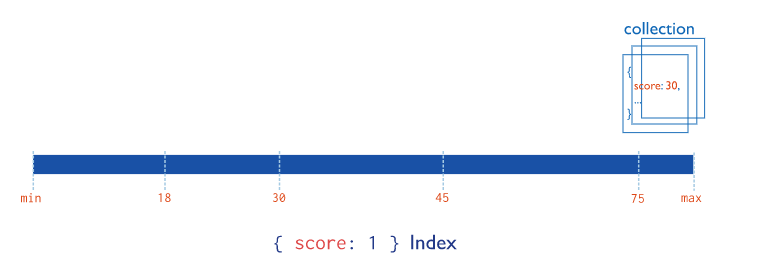


#### 4.2.2 复合索引

MongoDB还支持多个字段的用户定义索引，即复合索引(Compound Index)。

复合索引中列出的字段顺序具有重要意义。例如，如果复合索引由 { userid: 1, score: -1 } 组成，则索引首先按userid正序排序，然后 在每个userid的值内，再在按score倒序排序。

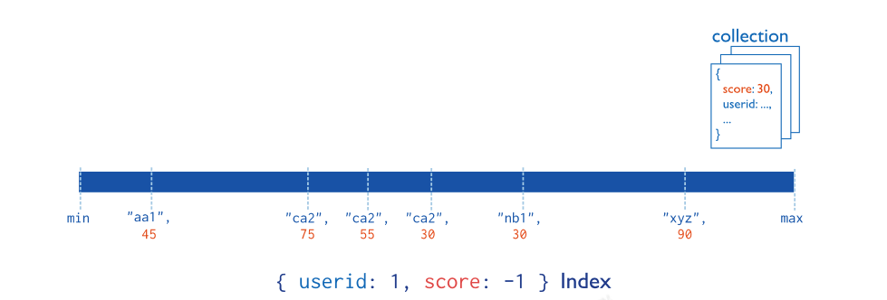


#### 4.2.3 其他索引

地理空间索引(Geospatial Index)、文本索引(Text Indexes)、哈希索引(Hashed Indexes)。

**地理空间索引(Geospatial Index)** 

为了支持对地理空间坐标数据的有效查询，MongoDB提供了两种特殊的索引:返回结果时使用平面几何的二维索引和返回结果时使用球面几何的二维球面索引。

**文本索引(Text Indexes)**

MongoDB提供了一种文本索引类型，支持在集合中搜索字符串内容。这些文本索引不存储特定于语言的停止词(例如“the”、“a”、“or”)， 而将集合中的词作为词干，只存储根词。

**哈希索引(Hashed Indexes)**

为了支持基于散列的分片，MongoDB提供了散列索引类型，它对字段值的散列进行索引。这些索引在其范围内的值分布更加随机，但只支持相等匹配，不支持基于范围的查询。


### 4.3 索引的管理操作

#### 4.3.1 索引的查看

返回一个集合中的所有索引的数组。

语法：

```
db.collection.getIndexes()
```

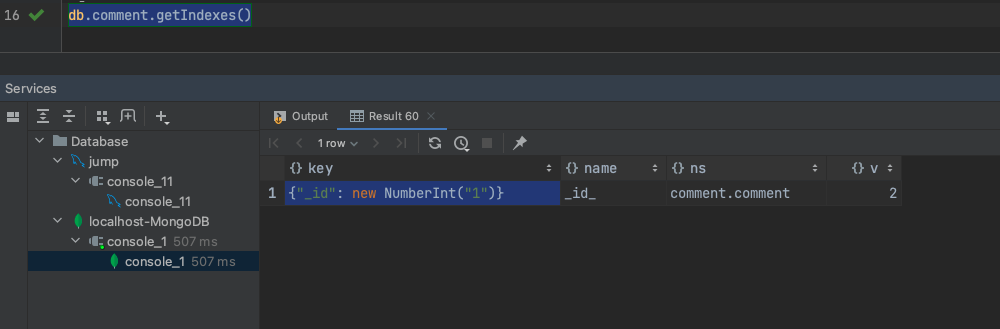

结果中显示的是默认 _id 索引。

默认_id索引: MongoDB在创建集合的过程中，在 _id 字段上创建一个唯一的索引，默认名字为 _id_ ，该索引可防止客户端插入两个具有相同值的文 档，您不能在_id字段上删除此索引。

注意:该索引是唯一索引，因此值不能重复，即 _id 值不能重复的。在分片集群中，通常使用 _id 作为片键。


#### 4.3.2 索引的创建

在集合上创建索引。

语法:

```
db.collection.createIndex(keys, options)

# exam
db.comment.createIndex({userid:1})
# 创建聚合索引
db.comment.createIndex({userid:1,likenum:-1})
```

| Parameter | Type     | Description                                                  |
| --------- | -------- | ------------------------------------------------------------ |
| keys      | document | 包含字段和值对的文档，其中字段是索引键，值描述该字段的索引类型。对于字段上的升序索引，请 指定值1;对于降序索引，请指定值-1。比如: {字段:1或-1} ，其中1 为指定按升序创建索引，如果你 想按降序来创建索引指定为 -1 即可。另外，MongoDB支持几种不同的索引类型，包括文本、地理空 间和哈希索引。 |
| options   | document | 可选。包含一组控制索引创建的选项的文档。有关详细信息，请参见选项详情列表。 |

options(更多选项)列表:

| Parameter          | Type          | Description                                                  |
| ------------------ | ------------- | ------------------------------------------------------------ |
| background         | Boolean       | 建索引过程会阻塞其它数据库操作，background可指定以后台方式创建索引，即增加 "background" 可选参数。 "background" 默认值为false。 |
| unique             | Boolean       | 建立的索引是否唯一。指定为true创建唯一索引。默认值为false.   |
| name               | string        | 索引的名称。如果未指定，MongoDB的通过连接索引的字段名和排序顺序生成一个索引名称。 |
| dropDups           | Boolean       | 3.0+版本已废弃。在建立唯一索引时是否删除重复记录,指定 true 创建唯一索引。默认值为 false. |
| sparse             | Boolean       | 对文档中不存在的字段数据不启用索引;这个参数需要特别注意，如果设置为true的话，在索 引字段中不会查询出不包含对应字段的文档.。默认值为 false. |
| expireAfterSeconds | integer       | 指定一个以秒为单位的数值，完成 TTL设定，设定集合的生存时间。 |
| v                  | index version | 索引的版本号。默认的索引版本取决于mongod创建索引时运行的版本。 |
| weights            | document      | 索引权重值，数值在 1 到 99,999 之间，表示该索引相对于其他索引字段的得分权重。 |
| default_language   | string        | 对于文本索引，该参数决定了停用词及词干和词器的规则的列表。 默认为英语 |
| language_override  | string        | 对于文本索引，该参数指定了包含在文档中的字段名，语言覆盖默认的language，默认值为 language. |


#### 4.3.3 索引的移除

说明:可以移除指定的索引，或移除所有索引

语法：

```
db.collection.dropIndex(index)
```

参数:

| Parameter | Type               | Description                                                  |
| --------- | ------------------ | ------------------------------------------------------------ |
| index     | string or document | 指定要删除的索引。可以通过索引名称或索引规范文档指定索引。若要删除文本索引，请指定 |

【示例】

删除 comment 集合中 userid 字段上的升序索引:

```
db.comment.dropIndex({userid:1})
```

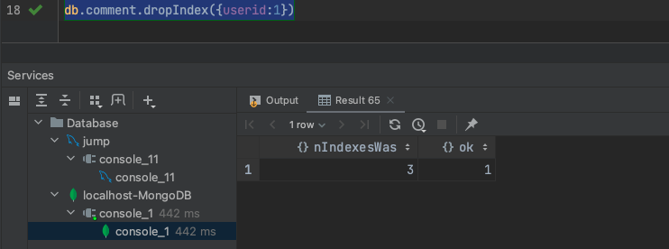

二、所有索引的移除

语法：

```shell
db.collection.dropIndexes()
```

提示: _id 的字段的索引是无法删除的，只能删除非 _id 字段的索引。


### 4.4 索引的使用

#### 4.4.1 执行计划

分析查询性能(Analyze Query Performance)通常使用执行计划(解释计划、Explain Plan)来查看查询的情况，如查询耗费的时间、是 否基于索引查询等。

那么，通常，我们想知道，建立的索引是否有效，效果如何，都需要通过执行计划查看。

语法:

```shell
db.collection.find(query,options).explain(options)
```

【示例】

查看根据userid查询数据的情况:

```
{"plannerVersion": new NumberInt("1"), "namespace": "comment.comment", "indexFilterSet": false, "parsedQuery": {"userid": {"$eq": new NumberInt("1111")}}, "winningPlan": {"stage": "FETCH", "inputStage": {"stage": "IXSCAN", "keyPattern": {"userid": new NumberInt("1"), "likenum": new NumberInt("-1")}, "indexName": "userid_1_likenum_-1", "isMultiKey": false, "multiKeyPaths": {"userid": [], "likenum": []}, "isUnique": false, "isSparse": false, "isPartial": false, "indexVersion": new NumberInt("2"), "direction": "forward", "indexBounds": {"userid": ["[1111, 1111]"], "likenum": ["[MaxKey, MinKey]"]}}}, "rejectedPlans": []}
```

关键点看: "stage" : "COLLSCAN", 表示全集合扫描

compass截图 全表扫描

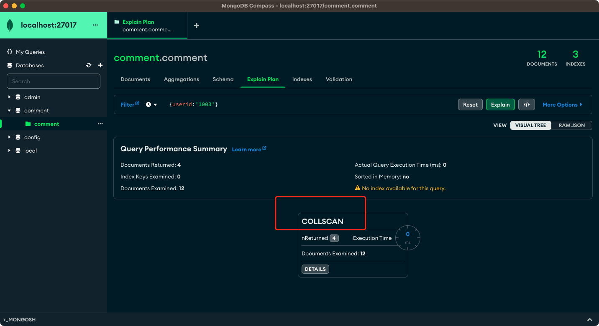

增加索引后

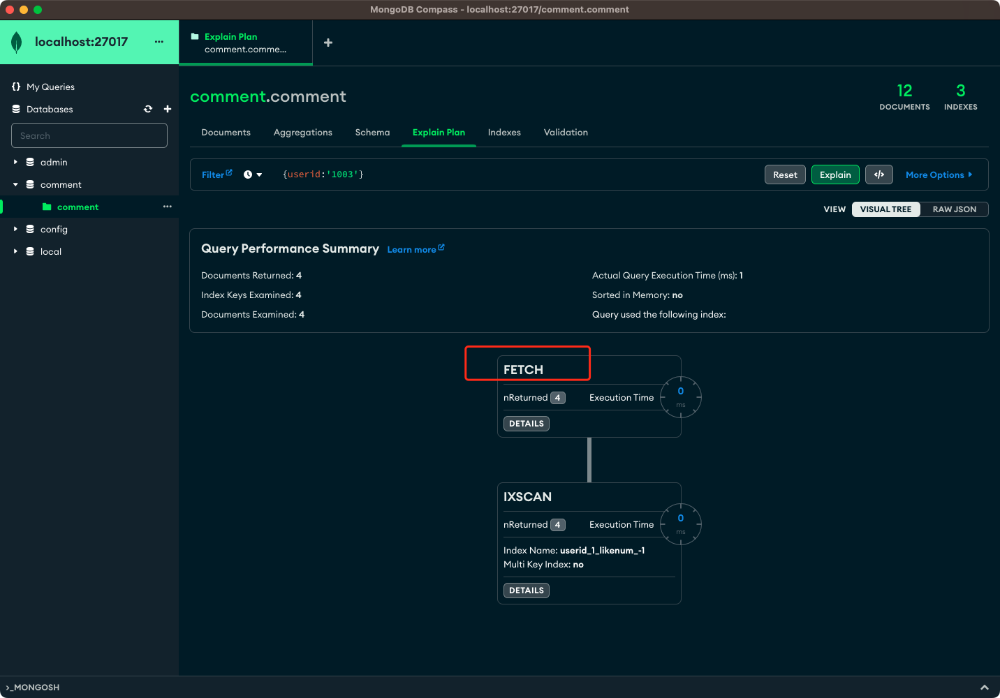


#### 4.4.2 涵盖的查询

> Covered Queries 
>
> 当查询条件和查询的投影仅包含索引字段时，MongoDB直接从索引返回结果，而不扫描任何文档或将文档带入内存。 这些覆盖的查询可以 非常有效。
>
> 官网地址：https://www.mongodb.com/docs/manual/indexes/

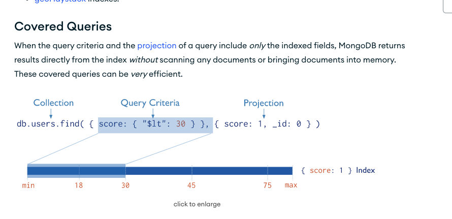


