## 初识elasticsearch

> https://www.bilibili.com/video/BV1Gh411j7d6/?p=56&spm_id_from=pageDriver&vd_source=a20ecb9885592a04cda8e0c3cf4ae1f1


**正向索引和倒排索引**

elasticsearch采用倒排索引:

- · 文档(document):每条数据就是一个文档
- 词条(term):文档按照语义分成的词语

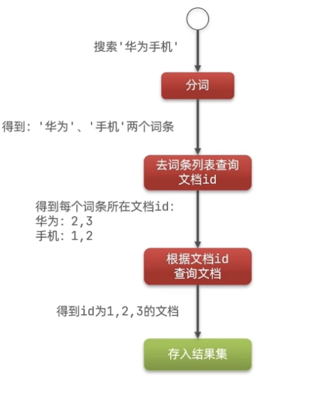


### **文档（Document）** 

elasticsearch是面向文档存储的，可以是数据库中的一条商品数据，一个订单信息文档数据会被序列化为json格式后存储在elasticsearch中。

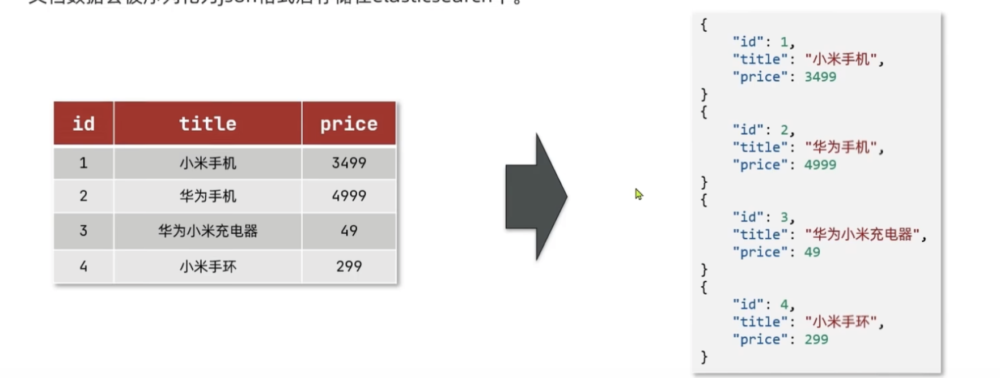

### 索引（Index）

- 索引(index):相同类型的文档的集合

  > 类似mysql对表结构


### 概念对比

| MySQL  | Elasticsearch | 说明                                                         |
| ------ | ------------- | ------------------------------------------------------------ |
| Table  | Index         | 索引(index)，就是文档的集合，类似数据库的表(table)           |
| Row    | Document      | 文档(Document)，就是一条条的数据，类似数据库中的行(Row)，文档都是JSON格式 |
| Column | Field         | 字段(Field)，就是JSON文档中的字段，类似数据库中的列(Column） |
| Schema | Mapping       | Mapping(映射)是索引中文档的约束，例如字段类型约束。类似数据库的表结构(Schema) |
| SQL    | DSL           | DSL是elasticsearch提供的JSON风格的请求语句，用来操作elasticsearch，实现CRUD |

### 架构

- Mysql:擅长事务类型操作，可以确保数据的安全和一致性
- Elasticsearch:擅长海量数据的搜索、分析、计算

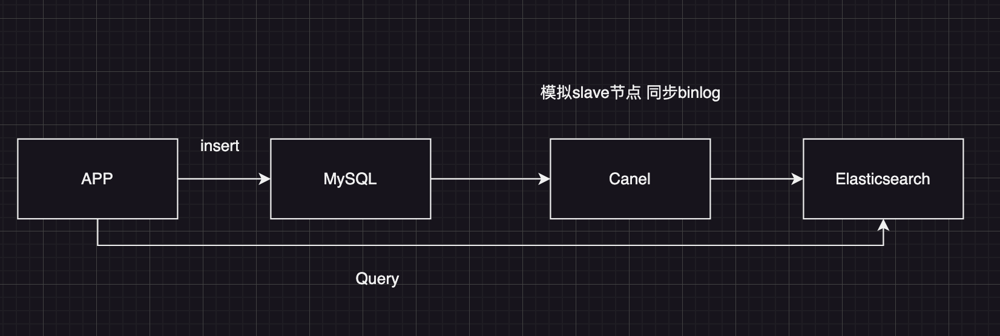


### 分词器

es在创建倒排索引时需要对文档分词;在搜索时，需要对用户输入内容分词。但默认的分词规则对中文处理并不友好。

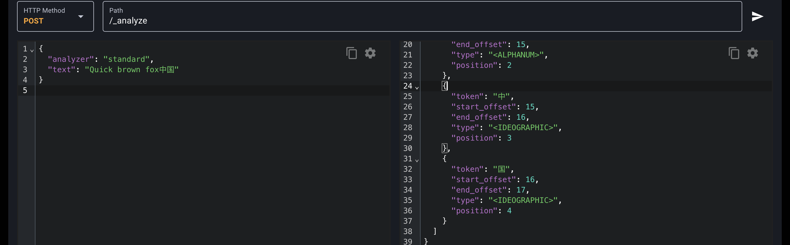

> analyzer 是分词器类型
>
> text是要分词的文档

处理中文分词器一般使用IK分词器。https://github.com/infinilabs/analysis-ik

**使用IK分词器**

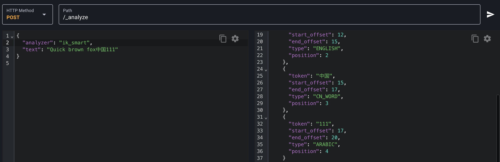

#### 安装IK分词器

> 见GitHub的README文件，注意统一版本

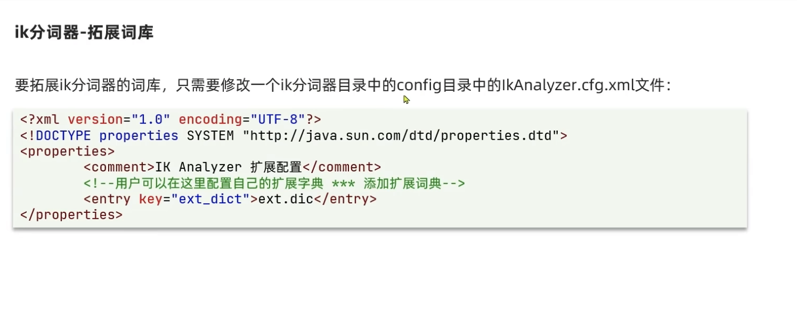

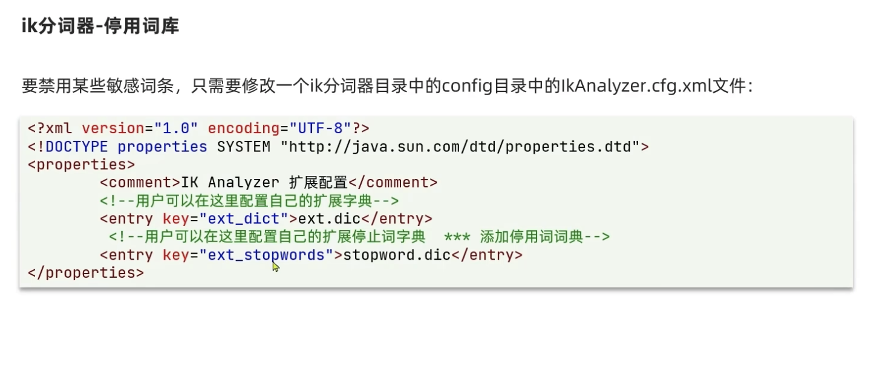

分词器的作用是什么?

- 创建倒排索引时对文档分词
- 用户搜索时，对输入的内容分词

IK分词器有几种模式?

- ik_smart：智能切分，粗粒度
- ·ik_max_word：最细切分，细粒度

IK分词器如何拓展词条?如何停用词条?

- 利用config目录的IkAnalyzer.cfg.xml文件添加拓展词典和停用词典
- 在词典中添加拓展词条或者停用词条

## 索引库操作

### mapping属性

mapping是对索引库中文档的约束，常见的mapping属性包括：

- type：字段数据类型，常见的简单类型有:

  - 对象：object

  - **文本（Text）**：用于全文搜索的非分析字段，**Elasticsearch会使用分词器对其进行分词**。

  - **关键词（Keyword）**：用于精确匹配的字段，不会进行分词处理。

  - **整数（Integer）**：用于存储整数值，可以是32位的。

  - **长整型（Long）**：用于存储较大范围的整数值，是64位的。

  - **浮点型（Float）**：用于存储单精度浮点数。

  - **双精度型（Double）**：用于存储双精度浮点数。

  - **日期（Date）**：用于存储日期和时间。

  - **布尔型（Boolean）**：用于存储真或假的值。

  - **二进制（Binary）**：用于存储二进制数据。

  - **范围类型（Range Types）**：
    - 日期范围（Date Range）
    - 长整型范围（Long Range）
    - 双精度型范围（Double Range）
    
  - **Nested** 嵌套对象

  - **多字段（Multi-field）**：一个字段可以有多个类型，例如一个字段可以同时是Text和Keyword。

  - **IP地址（IP）**：用于存储IP地址。

  - **完成型（Completion）**：用于自动完成功能的字段。

  - **令牌计数（Token Count）**：用于控制字段中可以包含的术语数量。

  - **地理点（Geo-point）**：用于存储地理坐标。

  - **地理形状（Geo-shape）**：用于存储地理区域。

    > **ES中支持两种地理坐标数据类型:**
    > geo_point：由纬度(latitude)和经度(longitude)确定的一个点。例如:"32.8752345,120.2981576"
    > geo_shape：有多个geo_point组成的复杂几何图形。例如一条直线，"LINESTRING(-77.03653 38.897676,-77.009051 38.889939)"

  - **数组（Array）**：Elasticsearch可以索引数组类型的字段，数组中的每个元素都将被单独索引。

  - **常量关键字（Constant Keyword）**：用于存储不会改变的关键词。

  - **搜索时分析的文本（Text with Search As You Type Analyzer）**：一种特殊的文本字段，使用`search_as_you_type`分析器，适用于实现自动完成和建议功能。

- index:是否创建索引，默认为true

- analyzer：使用哪种分词器

- properties：该字段的子字段


```json
{
  "_index": "index",
  "_type": "_doc",
  "_id": "UQK1_I8BUVoIbccrWOVY",
  "_version": 1,
  "_seq_no": 15,
  "_primary_term": 1,
  "found": true,
  "_source": {
    "className": "分类名称",
    "email": "qqq@qq.com",
    "indexName": "indexaaza Name 中国",
    "info": "这个是一个信息滴滴滴滴",
    "ip": "192.101.191.1"
  }
}
```


### 创建索引库

ES中通过Restful请求操作索引库、文档。请求内容用DSL语句来表示。创建索引库和mapping的DSL语法如下：

```
PUT /indexName
{
  "mappings": {
    "properties": {
      "info": {
        "type": "text",
        "analyzer": "ik_smart"
      },
      "email":{
        "type":"keyword"
      },
      "date":{
        "type":"date"
      },
      "location":{
      "type":"geo_point"
      },
      "ip":{
        "type":"ip"
      }
    }
  }
}
```

### 查看索引库

```
GET /indexName
```

### 删除索引库

```
DELETE /indexName
```

### 修改索引库

> 索引库和mapping一旦创建无法修改，但是可以添加新的字段，语法如下

添加新字段：

```json
PUT /index/_mapping
{
  "properties": {
    "indexName": {
      "type": "text"
    }
  }
}
```

**修改现有字段的映射**（注意：Elasticsearch通常不允许直接修改字段的类型，但可以更新字段的分析器等属性）：

```

```


## 文档操作

### 新增文档

```
# id自己不写 就会自动生成
POST /index/_doc/id

{
  "className":"分类名称",
  "email":"qqq@qq.com",
  "indexName":"indexaaza Name 中国",
  "info":"这个是一个信息滴滴滴滴",
  "ip":"192.101.191.1"
}
```

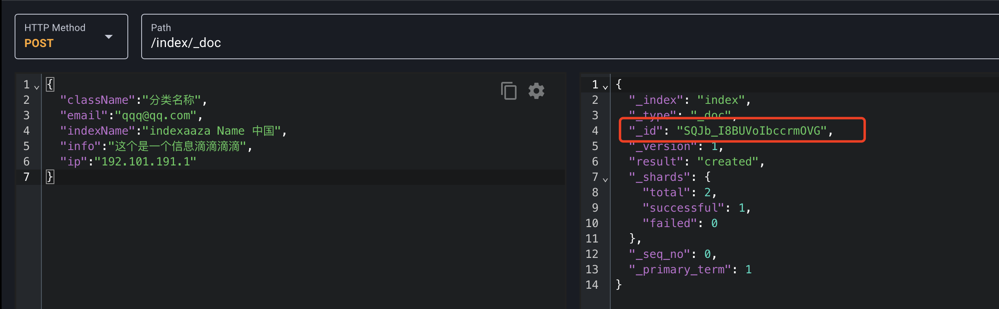

### **查询文档**

```
GET /index/_doc/文档ID
```

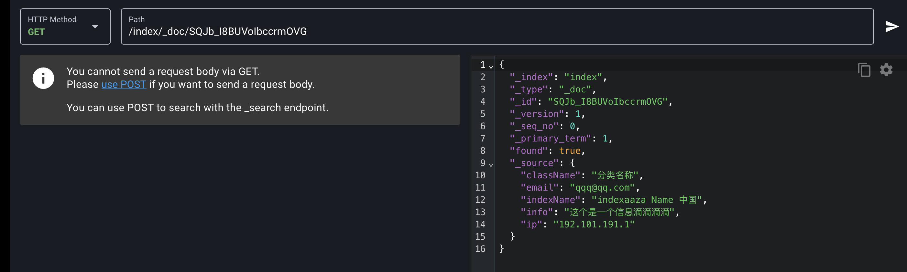

### 删除文档

```
DELETE /index/_doc/文档ID
```

### 修改文档

方式一：全量修改，会删除旧文档，添加新文档

```
PUT /index/_doc/_id
```

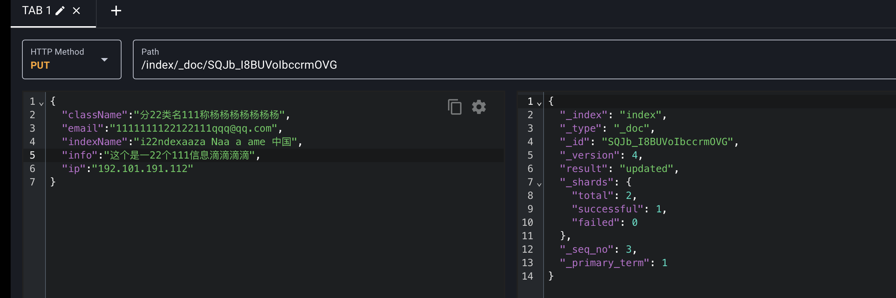

方式二:增量修改，修改指定字段值

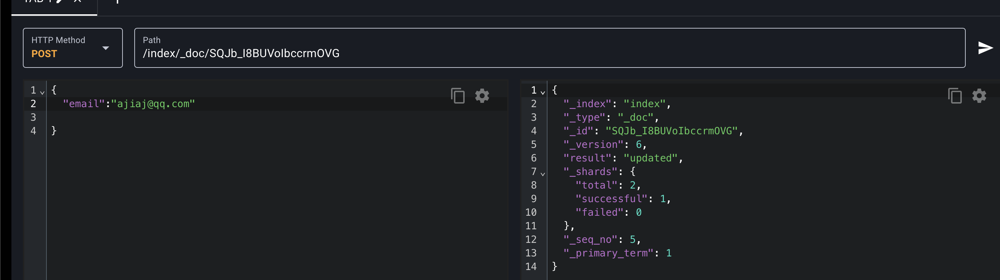


## RestClient操作索引库

ES官方提供了各种不同语言的客户端，用来操作ES。这些客户端的本质就是组装DSL语句，通过http请求发送给ES。文档地址：https://www.elastic.co/guide/en/elasticsearch/client/java-api-client/current/getting-started-java.html

### 创建索引库

引入dependence

```xml
<dependency>
            <groupId>org.elasticsearch.client</groupId>
            <artifactId>elasticsearch-rest-high-level-client</artifactId>
            <version>7.17.21</version>
        </dependency>
```

```java
private static void createIndex() throws IOException {
        RestHighLevelClient restHighLevelClient = new RestHighLevelClient(RestClient.builder(HttpHost.create("http://127.0.0.1:9200")));
        // 索引库名字
        CreateIndexRequest request = new CreateIndexRequest("hotel1");
        // DSL和对应的报文形式
        request.source(INDEX_DSL, XContentType.JSON);
        IndicesClient indices = restHighLevelClient.indices();
        indices.create(request, RequestOptions.DEFAULT);
    }
```

### 删除索引库

```java
private static void deleteIndex() throws IOException {
        RestHighLevelClient restHighLevelClient = new RestHighLevelClient(RestClient.builder(HttpHost.create("http://127.0.0.1:9200")));
        // 索引库名字
        DeleteIndexRequest request = new DeleteIndexRequest("hotel1");
        IndicesClient indices = restHighLevelClient.indices();
        AcknowledgedResponse delete = indices.delete(request, RequestOptions.DEFAULT);
        System.out.println(delete.toString());
    }
```

### 判断索引库是否存在

```java
private static void existIndex() throws IOException {
        RestHighLevelClient restHighLevelClient = new RestHighLevelClient(RestClient.builder(HttpHost.create("http://127.0.0.1:9200")));
        // 索引库名字
        GetIndexRequest request = new GetIndexRequest("hotel1");
        IndicesClient indices = restHighLevelClient.indices();
        boolean exists = indices.exists(request, RequestOptions.DEFAULT);
        System.out.println(exists);
    }
```


## RestClient操作文档

### 新增文档

```java
private void createDocument() throws IOException {
        RestHighLevelClient restHighLevelClient = new RestHighLevelClient(RestClient.builder(HttpHost.create("http://127.0.0.1:9200")));
        // 索引库名字
        IndexRequest request = new IndexRequest("hotel1");
        User user = new User();
        user.setUserInfo("库吗今天的天气");
        user.setIp("120.0.0.0");
        user.setUserName("jack");
        user.setEmail("11@qq.com");
        request.source(new Gson().toJson(user), XContentType.JSON);
        IndexResponse index = restHighLevelClient.index(request, RequestOptions.DEFAULT);
        System.out.println(index);
    }
```

### 查询文档

```java
private void queryDocument() throws IOException {
        RestHighLevelClient restHighLevelClient = new RestHighLevelClient(RestClient.builder(HttpHost.create("http://127.0.0.1:9200")));
        // 索引库名字 _id
        GetRequest request = new GetRequest("hotel1", "UgLd_I8BUVoIbccrgOXM");
        GetResponse documentFields = restHighLevelClient.get(request, RequestOptions.DEFAULT);
        String sourceAsString = documentFields.getSourceAsString();
        Gson gson = new Gson();
        User user = gson.fromJson(sourceAsString, User.class);
        System.out.println(user);
        System.out.println(documentFields);
    }
```

### 删除文档

```java
 private void deleteDocument() throws IOException {
        RestHighLevelClient restHighLevelClient = new RestHighLevelClient(RestClient.builder(HttpHost.create("http://127.0.0.1:9200")));
        DeleteRequest request = new DeleteRequest("hotel1", "UgLd_I8BUVoIbccrgOXM");
        DeleteResponse delete = restHighLevelClient.delete(request, RequestOptions.DEFAULT);
        System.out.println(delete);
    }
```

### 修改文档

```java
// 方式一:全量更新。再次写入id一样的文档，就会删除旧文档，添加新文档
// 方式二:局部更新。只更新部分字段，我们演示方式二

private void updateDocument() throws IOException {
        RestHighLevelClient restHighLevelClient = new RestHighLevelClient(RestClient.builder(HttpHost.create("http://127.0.0.1:9200")));
        UpdateRequest request = new UpdateRequest("hotel1", "UwLk_I8BUVoIbccrO-Vg");
        request.doc("email", "88@gmail.com",
                "userName", "李四"
        );
        UpdateResponse update = restHighLevelClient.update(request, RequestOptions.DEFAULT);
        System.out.println(update);
    }
```

### 批量导入文档

```java
private void saveBatchDocument() throws IOException {
        RestHighLevelClient restHighLevelClient = new RestHighLevelClient(RestClient.builder(HttpHost.create("http://127.0.0.1:9200")));
        BulkRequest bulkRequest = new BulkRequest();
        for (int i = 0; i < 100000; i++) {
            User user = new User();
            user.setEmail(UUID.randomUUID().toString());
            user.setIp(UUID.randomUUID().toString());
            user.setUserInfo(UUID.randomUUID().toString());
            user.setUserName(UUID.randomUUID().toString());
            bulkRequest.add(new IndexRequest("hotel1").source(new Gson().toJson(user),XContentType.JSON));
        }
        BulkResponse bulk = restHighLevelClient.bulk(bulkRequest, RequestOptions.DEFAULT);
        System.out.println(bulk);
    }
```


## DSL查询语法

### DSL Query的分类

Elasticsearch提供了基于JSON的DSL(Domain specific Language)来定义查询。常见的查询类型包括:

- 查询所有:查询出所有数据，一般测试用。例如:match_all
- 全文检索(full text)查询:利用分词器对用户输入内容分词，然后去倒排索引库中匹配。例如:
  - match_query 
  - multy_match_query
- 精确查询:根据精确词条值查找数据，一般是查找keyword、数值、日期、boolean等类型字段。例如:
  - ids
  - range
  - term
- 地理(geo)查询:根据经纬度查询。例如:
  - geo_distance
  - geo_bounding_box
- 复合(compound)查询:复合查询可以将上述各种查询条件组合起来，合并查询条件。例如:
  - bool
  - function_score

​	基本语法：

```
	POST /indexName/_search
	// 查询所有
	{
  "query":{
    "match_all":{
      
    }
  }
}
```

#### 全文检索查询

全文检索查询，会对用户输入内容分词，常用于搜索框搜索:

**match查询：**全文检索插查询的一种，会对用户输入的内容分词，然后去倒排索引库检索，语法：

```json
POST /hotel1/_search
{
  "query": {
    "match": {
      "userInfo": "今天的天气"
    }
  }
}
```

multi_macth：与match查询类似，只不过允许同时查询多个字段，语法:

```json
{
  "query": {
    "multi_match": {
      "query": "今天的天气",
      "fields":["userInfo","email"]
    }
  }
}
```

> **match和multi_match的区别是什么?**
>
> match：根据一个字段查询
> multi_match：根据多个字段查询，参与查询字段越多，查询性能越差

#### **精确查询**

> 建议使用copy to 类似mysql聚合索引的感觉

精确查询一般是查找keyword、数值、日期、boolean等类型字段，所以不会分词

- term：根据词条精确值查询
- range：根据值的范围查询

```json
POST /index0601/_search
## TERM查询
{
  "query": {
    "term": {
      "email": {
        "value": "2829190@qq.com"
      }
    }
  }
}
```

> term查询:根据词条精确匹配，一般搜索keyword类型、数值类型、布尔类型、日期类型字段

```json
POST /index0601/_search
## RANG查询
{
  "query": {
    "range": {
      "date": {
        "gte": "1718001958249",
        "lte":"1718001958249"
      }
    }
  }
}
```

> 范围查询:根据数值范围查询，可以是数值、日期的范围


#### 地理查询

根据经纬度查询。常见的使用场景包括：

- 携程:搜索我附近的酒店
- 滴滴:搜索我附近的出租车
- 微信:搜索我附近的人

**geo_bounding_box**:查询geo point值落在某个**矩形范围**的所有文档：

```json
POST /user_index/_search

{
  "query": {
    "geo_bounding_box": {
      "location": {
        "top_left": {
          "lat": 40,
          "lon": -70
        },
        "bottom_right": {
          "lat": 30,
          "lon": -80
        }
      }
    }
  }
}
```

**geo_distance**：查询到指定中心点**小于**某个距离值的所有文档（一个圆）

```json
POST /indexName/_search

{
  "query": {
    "geo_distance": {
      "distance": "20000km",  // 指定距离，可以是 km、miles、yd、ft 等
      "location": {
        "lat": 20.0,  // 指定纬度
        "lon": -70.0  // 指定经度
      }
    }
  }
}
```


#### 复合查询

复合(compound)查询:复合查询可以将其它简单查询组合起来，实现更复杂的搜索逻辑，例如:

- fuction_score:算分函数查询，可以控制文档相关性算分，控制文档排名。例如百度竞价

```json
"max_score": 0.18232156,
    "hits": [
      {
        "_index": "user_index",
        "_type": "_doc",
        "_id": "NgwjAZABUVoIbccrLhId",
        
        "_score": 0.18232156,
        
        "_source": {
          "userName": "名字呀1ahsahs",
          "info": "今天的天气数字是1hahhahah",
          "email": "1829190@qq.com",
          "ip": "112.2.1.1",
          "date": 1718006000782,
          "location": "21.41,31.21"
        }
      },
```

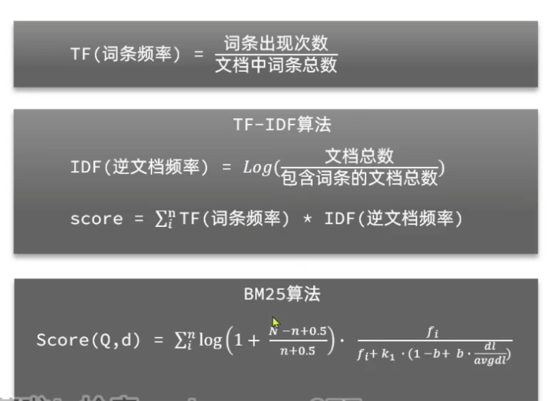

**相关性算法**

当我们利用**match**查询时，文档结果会根据与搜索词条的关联度打分(score)，返回结果时按照分值降序排列。

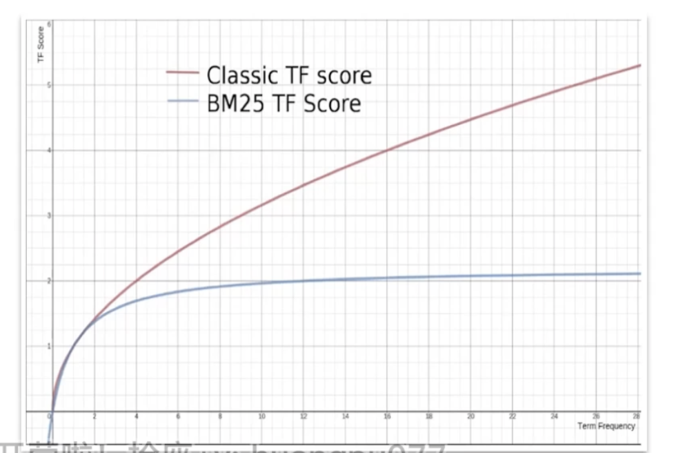

> elasticsearch中的相关性打分算法是什么?
>
> - TF-IDF：在elasticsearch5.0之前，会随着词频增加而越来越大
> - BM25：在elasticsearch5.0之后，会随着词频增加而增大，但增长曲线会趋于水平


Function Score Query

使用 function score query，可以修改文档的相关性算分(query score)，根据新得到的算分排序。

```json
POST /indexName/_search

{
  "query": {
    "function_score": {
      "query": { // 原始查询条件，搜索文档并根据相关性打分(query score)
        "match": {
          "info": "今天"
        }
      },
      "functions": [
        {
          "filter": {// 过滤条件，符合条件的文档才会被重新算分
            "term": {
              "id": "NgwjAZABUVoIbccrLhId"
            }
          },
          "weight": "20" // 算分函数 见下面👇
        }
      ],
      "boost_mode": "multiply" // 加权模式 见下面👇
    }
  }
}
```

> **weight**
>
> 算分函数，算分函数的结果称为functionscore ，将来会与query score运算，得到新算分，
>
> 常见的算分函数有:
>
> - weight:给一个常量值，作为函数结果(function score)
> - field_value_factor:用文档中的某个字段值作为函数结果
> - random score:随机生成一个值，作为函数结果
> - script score:自定义计算公式，公式结果作为函数结果

> boost_mode
>
> 加权模式，定义function score与query score的运算方式，包括:· 
>
> - multiply：两者相乘。默认就是这个
> - replace：用function score 替换 query score
> - 其它：sum、avg、max、min

> function score query定义的三要素是什么?
> 过滤条件:哪些文档要加分
> 算分函数:如何计算function score。
> 加权方式:function score 与 query score如何运算

**符合查询 Boolean Query**

布尔查询是一个或多个查询子句的组合。子查询的组合方式有

- must：必须匹配每个子查询，类似“与”
- should：选择性匹配子查询，类似“或”
- must not：必须不匹配，不参与算分，类似“非”
- filter：必须匹配，不参与算分

```
{
  "query": {
    "bool": {
      "must": [
        {
          "term": {
            "ip": "112.2.1.1"
          }
        }
      ],
      "should": [
        {
          "term": {
            "ip": "112.2.1.1"
          }
        }
      ],
      "must_not": [
        {
          "range": {
            "date": {
              "gte": "1718006000782"
            }
          }
        }
      ],
      "filter": []
    }
  }
}
```


> **bool查询有几种逻辑关系?**
>
> - must:必须匹配的条件，可以理解为“与”
> - should:选择性匹配的条件，可以理解为“或”
> - must not:必须不匹配的条件，不参与打分
> - filter:必须匹配的条件，不参与打允

IP是指定IP，或者IP为这个IP，时间不大于1718006000782，过滤在这个经纬度1000000km范围内的数据

```json
{
  "query": {
    "bool": {
      "must": [
        {
          "term": {
            "ip": "112.2.1.1"
          }
        }
      ],
      "should": [
        {
          "term": {
            "ip": "112.2.1.1"
          }
        }
      ],
      "must_not": [
        {
          "range": {
            "date": {
              "gte": "1718006000782"
            }
          }
        }
      ],
      "filter": [
        {
          "geo_distance": {
            "distance": "1000000km",
            "location": {
              "lat": 20,
              "lon": -70
            }
          }
        }
      ]
    }
  }
}
```


## 搜索结果处理

### 排序

elasticsearch支持对搜索结果排序，默认是根据相关度算分(_score)来排序。可以排序字段类型有：**kevword类型数值类型、地理坐标类型、日期类型等。**

```json
## POST /user_index/_search

{
  "query": {
    "match_all": {}
  },
  "sort":[
    {
      "date": "desc"
    }
  ]
}


## 模板

{
  "query": {
    "match_all": {}
  },
  "sort":[
    {
      "FIELD": "desc"
    }
  ]
}
```

> 指定排序后，score就会失效

查看经纬度地址：https://lbs.amap.com/demo/javascript-api-v2/example/axis/transformate-between-coordinates-of-lnglat-and-map-container


### 分页

elasticsearch 默认情况下只返回top10的数据。而如果要查询更多数据就需要修改分页参数了。elasticsearch中通过修改**from**、**size**参数来控制要返回的分页结果:

```
#POST /user_index/_search
{
  "query": {
    "match_all": {}
  },
  "from":0,
  "size":1,
  "sort":[
    {
      "date": "desc"
    }
  ]
}
```

> 

> - 优点：支持随机翻页
> - 缺点：深度分页问题，默认查询上限(from+size)是10000
> - 场景：百度、京东、谷歌、淘宝这样的随机翻页搜索

#### 深度分页问题

ES是分布式的，所以会面临深度分页问题。例如按price排序后，获取from=990，size =10的数据：

1. 首先在每个数据分片上都排序并查询前1000条文档。
2. 然后将所有节点的结果聚合，在内存中重新排序选出前1000条文档
3. 最后从这1000条中，选取从990开始的10条文档

> 

如果搜索页数过深，或者结果集(from +size)越大，对内存和CPU的消耗也越高。因此ES设定结果集查询的上限是10000。

#### 深度分页解决方案

针对深度分页，ES提供了两种解决方案，官方文档TODO：

> https://www.elastic.co/guide/en/elasticsearch/reference/current/paginate-search-results.html#search-after

**search after**：分页时需要排序，原理是从上一次的排序值开始，查询下一页数据。官方推荐使用的方式。

> - 优点：没有查询上限(单次查询的size不超过10000)
> - 缺点：只能向后逐页查询，不支持随机翻页
> - 场景：没有随机翻页需求的搜索，例如手机向下滚动翻页

scroll：原理将排序数据形成快照，保存在内存。官方已经不推荐使用。

> - 优点：没有查询上限(单次查询的size不超过10000)
> - 缺点：会有额外内存消耗，并且搜索结果是非实时的
> - 场景：海量数据的获取和迁移。从ES7.1开始不推荐，建议用 aftersearch方案。

### 高亮

高亮：就是在搜索结果中把搜索关键字突出显示。原理是这样的：

- 将搜索结果中的关键字用标签标记出来
- 在页面中给标签添加css样式

```json
{
  "query": {
    "match": {
      "info": "今天"
    }
  },
  "from": 0,
  "size": 1,
  "highlight": {
    "fields": {
      "info": {  // 高亮字段
        "pre_tags": "<em>", // 高亮标签
        "post_tags": "</em?"
      }
    }
  },
  "sort": [
    {
      "date": "desc"
    }
  ]
}

```

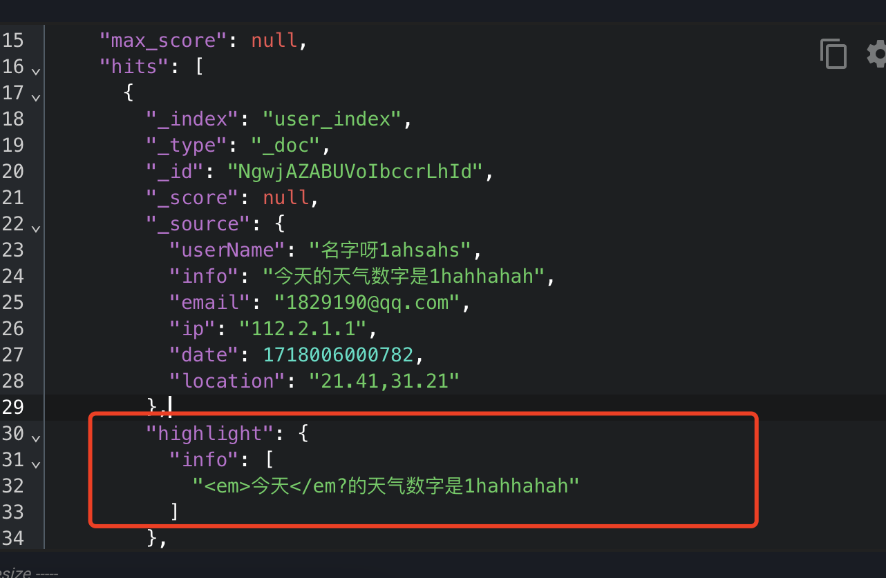


## RestClient查询文档


### match查询

```java
 private void queryMatchAllDocument() throws IOException {
        RestHighLevelClient restHighLevelClient = new RestHighLevelClient(RestClient.builder(HttpHost.create("http://127.0.0.1:9200")));
        SearchRequest request = new SearchRequest("user_index");
        // matchAll
        request.source().query(QueryBuilders.matchAllQuery());
        SearchResponse search = restHighLevelClient.search(request, RequestOptions.DEFAULT);
        System.out.println(search);
        restHighLevelClient.close();
    }
```


### 全文检索查询

全文检索的match和multi match查询与match_all的API基本一致。差别是查询条件，也就是query的部分。

同样是利用QueryBuilders提供的方法:

```java
private void queryMatchDocument() throws IOException {
        RestHighLevelClient restHighLevelClient = new RestHighLevelClient(RestClient.builder(HttpHost.create("http://127.0.0.1:9200")));
        SearchRequest request = new SearchRequest("user_index");
        // match
        request.source().query(QueryBuilders.matchQuery("info","天气"))
                .query(QueryBuilders.matchQuery("_id","NgwjAZABUVoIbccrLhId"));
        SearchResponse search = restHighLevelClient.search(request, RequestOptions.DEFAULT);
        System.out.println(search);
        restHighLevelClient.close();
    }
```

**多字段查询**

```java
request.source()..query(QueryBuilders.multiMatchQuery("1","email","userName"));
```


### 精确查询

精确查询常见的有term查询和range查询，同样利用QueryBuilders实现：

```java
 private void queryTermDocument() throws IOException {
        RestHighLevelClient restHighLevelClient = new RestHighLevelClient(RestClient.builder(HttpHost.create("http://127.0.0.1:9200")));
        SearchRequest request = new SearchRequest("user_index");
        // termQuery
        request.source().query(QueryBuilders.termQuery("_id","NgwjAZABUVoIbccrLhId"));
        SearchResponse search = restHighLevelClient.search(request, RequestOptions.DEFAULT);
        System.out.println(search);
        restHighLevelClient.close();
    }
```

```java
private void queryRangeDocument() throws IOException {
        RestHighLevelClient restHighLevelClient = new RestHighLevelClient(RestClient.builder(HttpHost.create("http://127.0.0.1:9200")));
        SearchRequest request = new SearchRequest("user_index");
        request.source().query(QueryBuilders.rangeQuery("date").gte("1718003618242").lte("1718003618242"));
        SearchResponse search = restHighLevelClient.search(request, RequestOptions.DEFAULT);
        System.out.println(search);
        restHighLevelClient.close();
    }
```


### 复合查询-boolean query

精确查询常见的有term查询和range查询，同样利用QueryBuilders实现：

```java
private void queryBooleanDocument() throws IOException {
        RestHighLevelClient restHighLevelClient = new RestHighLevelClient(RestClient.builder(HttpHost.create("http://127.0.0.1:9200")));
        SearchRequest request = new SearchRequest("user_index");
        // 构建布尔查询
        BoolQueryBuilder boolQueryBuilder = QueryBuilders.boolQuery()
                // 必须匹配的查询条件
                .must(QueryBuilders.termQuery("ip", "112.2.1.1"))
                // 可能匹配的查询条件
                .should(QueryBuilders.rangeQuery("date").gte("1718003618242").lte("1718003618242"))
                // 必须不匹配的查询条件
                .mustNot(QueryBuilders.termQuery("ip", "112.1.1.0"));
        request.source().query(boolQueryBuilder);
        SearchResponse search = restHighLevelClient.search(request, RequestOptions.DEFAULT);
        // 执行搜索请求
        System.out.println(search);
        restHighLevelClient.close();
    }
```


### 排序和分页

搜索结果的排序和分页是与query同级的参数，对应的API如下:

```java
 private void queryPageSortDocument() throws IOException {
        RestHighLevelClient restHighLevelClient = new RestHighLevelClient(RestClient.builder(HttpHost.create("http://127.0.0.1:9200")));
        SearchRequest request = new SearchRequest("user_index");
        request.source().query(QueryBuilders.matchAllQuery());
        request.source().from(0).size(1)
                .sort("date", SortOrder.DESC);
        SearchResponse search = restHighLevelClient.search(request, RequestOptions.DEFAULT);
        // 执行搜索请求
        System.out.println(search);
        restHighLevelClient.close();
    }
```

### 高亮

高亮API包括请求DSL构建和结果解析两部分。我们先看请求的DSL构建:

```java
 private void queryHighLightDocument() throws IOException {
        RestHighLevelClient restHighLevelClient = new RestHighLevelClient(RestClient.builder(HttpHost.create("http://127.0.0.1:9200")));
        SearchRequest request = new SearchRequest("user_index");
        request.source().query(QueryBuilders.matchQuery("userName", "名字"));
        request.source().highlighter(new HighlightBuilder()
                .field("userName")
                // 判断是否与插叙字段匹配
                .requireFieldMatch(Boolean.FALSE));
        request.source().from(0).size(1)
                .sort("date", SortOrder.DESC);
        SearchResponse search = restHighLevelClient.search(request, RequestOptions.DEFAULT);
        // 执行搜索请求
        System.out.println(search);
        restHighLevelClient.close();
    }
```


**高亮结果解析**

```java
  SearchHits hits = search.getHits();
        for (SearchHit hit : hits) {
            Map<String, HighlightField> highlightFields = hit.getHighlightFields();
            HighlightField userName = highlightFields.get("userName");
            String sourceAsString = hit.getSourceAsString();
            User user = new Gson().fromJson(sourceAsString, User.class);
            // 设置高亮的内容
            user.setUserName(userName.getFragments()[0].toString());
        }
```


### 距离排序

```java
private void queryDistinctDocument() throws IOException {
        RestHighLevelClient restHighLevelClient = new RestHighLevelClient(RestClient.builder(HttpHost.create("http://127.0.0.1:9200")));
        SearchRequest request = new SearchRequest("user_index");

        request.source().sort(SortBuilders.geoDistanceSort("location", new GeoPoint("31.11,121.00"))
                .order(SortOrder.DESC)
                .unit(DistanceUnit.KILOMETERS)
        );
        request.source().from(0).size(10)
                .sort("date", SortOrder.DESC);

        SearchResponse search = restHighLevelClient.search(request, RequestOptions.DEFAULT);
        System.out.println(search);
        restHighLevelClient.close();
    }
```

> 返回sort就是最终的distinct
>
> ```json
> {
>                 "_index": "user_index",
>                 "_type": "_doc",
>                 "_id": "NgwjAZABUVoIbccrLhId",
>                 "_score": null,
>                 "_source": {
>                     "userName": "名字呀1ahsahs",
>                     "info": "今天的天气数字是1hahhahah",
>                     "email": "1829190@qq.com",
>                     "ip": "112.2.1.1",
>                     "date": 1718006000782,
>                     "location": "21.41,31.21"
>                 },
>                 "sort": [
>                     8779.72497595696,
>                     1718006000782
>                 ]
>             },
> 
> ```

### 组合查询

> 类似的需求，例如：
>
> - 搜索排名中 交钱的排名第一 需要加是否广告的标识位。isAD字段，然后查询的时候 给isAD的增加权重

**Java Code**

```java

private void queryRelateDocument() throws IOException {
        RestHighLevelClient restHighLevelClient = new RestHighLevelClient(RestClient.builder(HttpHost.create("http://127.0.0.1:9200")));
        SearchRequest request = new SearchRequest("user_index");
        FunctionScoreQueryBuilder functionScoreQueryBuilder = QueryBuilders.functionScoreQuery(
                QueryBuilders.matchQuery("userName", "名字"), new FunctionScoreQueryBuilder.FilterFunctionBuilder[]{
                        new FunctionScoreQueryBuilder.FilterFunctionBuilder(QueryBuilders.termQuery("userInfo", "1"),
                                ScoreFunctionBuilders.weightFactorFunction(5)
                        )
                }
        );
        request.source().query(functionScoreQueryBuilder);
        request.source().from(0).size(10)
                .sort("date", SortOrder.DESC);
        SearchResponse search = restHighLevelClient.search(request, RequestOptions.DEFAULT);
        System.out.println(search);
        restHighLevelClient.close();
    }
```

**ES-Query**

```json
{
  "query": {
    "function_score": {
      "query": {
        "match": {
          "userName": "名字"
        }
      },
      "functions": [
        {
          "filter": {
            "term": {
              "userInfo": "1"
            }
          },
          "weight": 10
        }
      ]
    }
  }
}
```


# 分布式搜索引擎

## 数据聚合

### 聚合的种类

聚合(aggregations)可以实现对文档数据的统计、分析、运算。聚合常见的有三类:

- 桶(**Bucket**)聚合:用来对文档做分组
  - **TermAggregation**：按照文档字段值分组
  - **Date Histogram**：按照日期阶梯分组，例如一周为一组，或者一月为一组

- 度量(**Metric**)聚合:用以计算一些值，比如:最大值、最小值、平均值等
  - Avg：求平均值
  - Max：求最大值
  - Min：求最小值
  - Stats：同时求max、min、avg、sum等

- 管道(**pipeline**)聚合：其它聚合的结果为基础做聚合

> 参与聚合的字段类型必须是:
>
> - keyword
> - 数值
> - 日期
> - 布尔

### DSL实现聚合


#### Bucket聚合

SQL

```
group by email;
```

```
{
  "size": 0, // 设置size为0，结果中不包含文档，只包含聚合结果
  "aggs": { // // 定义聚合
    "brandAggs": { // //给聚合起个名字
      "terms": { // 聚合的类型，按照邮箱值聚合，所以选择term
        "field": "email", // 参与聚合的字段
        "size": 20 // 希望获取的聚合结果数量
      }
    }
  }
}
```


#### Bucket聚合-聚合结果排序

默认情况下，BucKet聚合会统计Bucket内的文档数量，记为 count，并且按照 count降序排序。我们可以修改结果排序方式:

```
{
  "size": 0,
  "aggs": {
    "brandAggs": {
      "terms": {
        "order": {
          "_count": "asc" // 按_count 升序排列
        },
        "field": "email",
        "size": 20
      }
    }
  }
}
```


#### Bucket聚合-限定聚合范围

默认情况下，Bucket聚合是对索引库的所有文档做聚合，我们可以限定要聚合的文档范围，只要添加query条件即可:

```
{
  "query": {
    "term": {
      "ip": "112.2.1.1"
    }
  },
  "size": 0,
  "aggs": {
    "brandAggs": {
      "terms": {
        "order": {
          "_count": "asc"
        },
        "field": "email",
        "size": 20
      }
    }
  }
}
```

**总结**

```
aggs代表聚合，与query同级，此时query的作用是?
	·限定聚合的的文档范围
聚合必须的三要素:
	聚合名称
	聚合类型
	聚合字段
聚合可配置属性有:
	·size:指定聚合结果数量
	·order:指定聚合结果排序方式
	·field:指定聚合字段
```

#### DSL实现Metrics 聚合

例如，我们要求获取每个品牌的用户评分的min、max、avg等值:我们可以利用stats聚合：

> 在聚合内部再一次聚合group查询

```json
{
  "size": 0,
  "aggs": {
    "brandAgg": {
      "terms": {
        "field": "ip",
        "size": 20
      },
      "aggs": { // 子聚合 对聚合后的每组进行处理计算
        "score_test": { // 聚合名称
          "stats": { // 聚合类型 这里stats可以计算min max avg等
            "field": "score" // 聚合字段
          }
        }
      }
    }
  }
}
```


### RestAPI实现聚合

实现IP聚合

```java
private void aggregationDocument() throws IOException {
        RestHighLevelClient restHighLevelClient = new RestHighLevelClient(RestClient.builder(HttpHost.create("http://127.0.0.1:9200")));
        SearchRequest request = new SearchRequest("user_index");
        request.source().aggregation(AggregationBuilders.terms("brand_agg")
                .field("ip")
                .size(20)
        );
        request.source().from(0).size(10)
                .sort("date", SortOrder.DESC);
        SearchResponse search = restHighLevelClient.search(request, RequestOptions.DEFAULT);
        Aggregations aggregations = search.getAggregations();
        Aggregation brandAgg = aggregations.get("brand_agg");
        Terms brandTermsAgg = (Terms) brandAgg;
        List<? extends Terms.Bucket> buckets = brandTermsAgg.getBuckets();
        for (Terms.Bucket bucket : buckets) {
            String key = bucket.getKeyAsString();
            long docCount = bucket.getDocCount();
            System.out.println("Brand: " + key + ", Count: " + docCount);
        }
        restHighLevelClient.close();
    }
```

继续获取的到结果

```java
Aggregations aggregations = search.getAggregations();
        Aggregation brandAgg = aggregations.get("brand_agg");
        Terms brandTermsAgg = (Terms) brandAgg;
        List<? extends Terms.Bucket> buckets = brandTermsAgg.getBuckets();
        for (Terms.Bucket bucket : buckets) {
            String key = bucket.getKeyAsString();
            long docCount = bucket.getDocCount(); 
            System.out.println("Brand: " + key + ", Count: " + docCount);
        }
```

```
# 打印结果
Brand: 112.2.1.1, Count: 2
Brand: 212.2.1.1, Count: 2
Brand: 12.2.1.1, Count: 1
```

案例：

实现多个字短的聚合处理

```java
private void aggregationDocument() throws IOException {
        RestHighLevelClient restHighLevelClient = new RestHighLevelClient(RestClient.builder(HttpHost.create("http://127.0.0.1:9200")));
        SearchRequest request = new SearchRequest("user_index");
        // ip聚合
        request.source().aggregation(AggregationBuilders.terms("brand_agg")
                .field("ip")
                .size(20)
        );
        // 邮件聚合
        request.source().aggregation(AggregationBuilders.terms("email_agg")
                .field("email")
                .size(20)
        );
        request.source().from(0).size(10)
                .sort("date", SortOrder.DESC);
        SearchResponse search = restHighLevelClient.search(request, RequestOptions.DEFAULT);
        Aggregations aggregations = search.getAggregations();
        Aggregation brandAgg = aggregations.get("brand_agg");
        Aggregation emailAgg = aggregations.get("email_agg");
        Terms brandTermsAgg = (Terms) brandAgg;
        List<? extends Terms.Bucket> buckets = brandTermsAgg.getBuckets();
        for (Terms.Bucket bucket : buckets) {
            String key = bucket.getKeyAsString();
            long docCount = bucket.getDocCount();
            System.out.println("Brand: " + key + ", Count: " + docCount);
        }
        restHighLevelClient.close();
    }
```

> 聚合的时候 必须和查询使用相同的query 不能查询整个数据库信息


## 自动补全


> Pingyin定义规则可以添加很多参数。去官网看readme


## 数据同步


## 集群


查询在哪个分片


