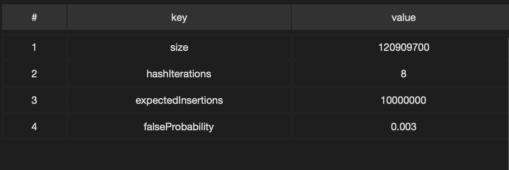
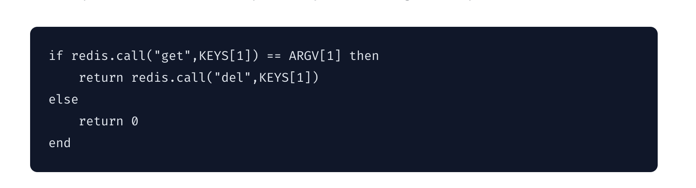
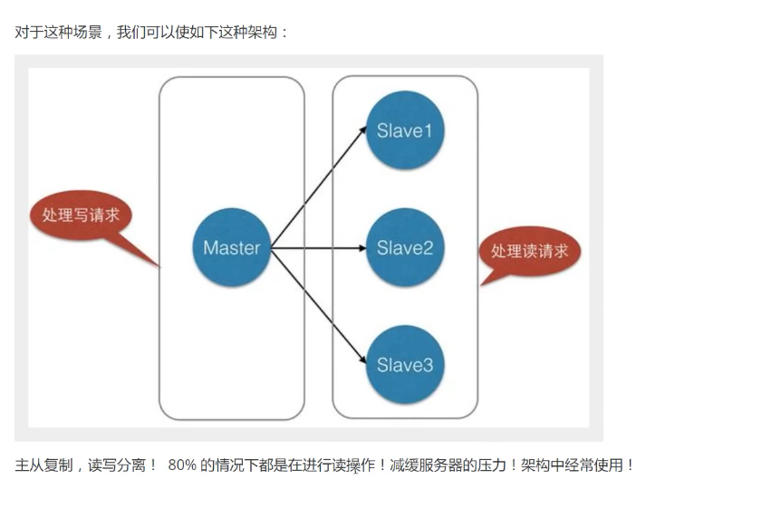
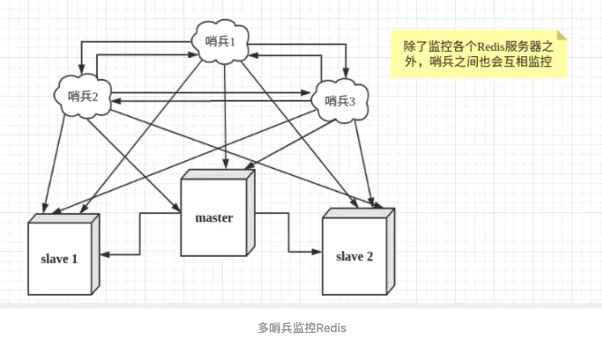
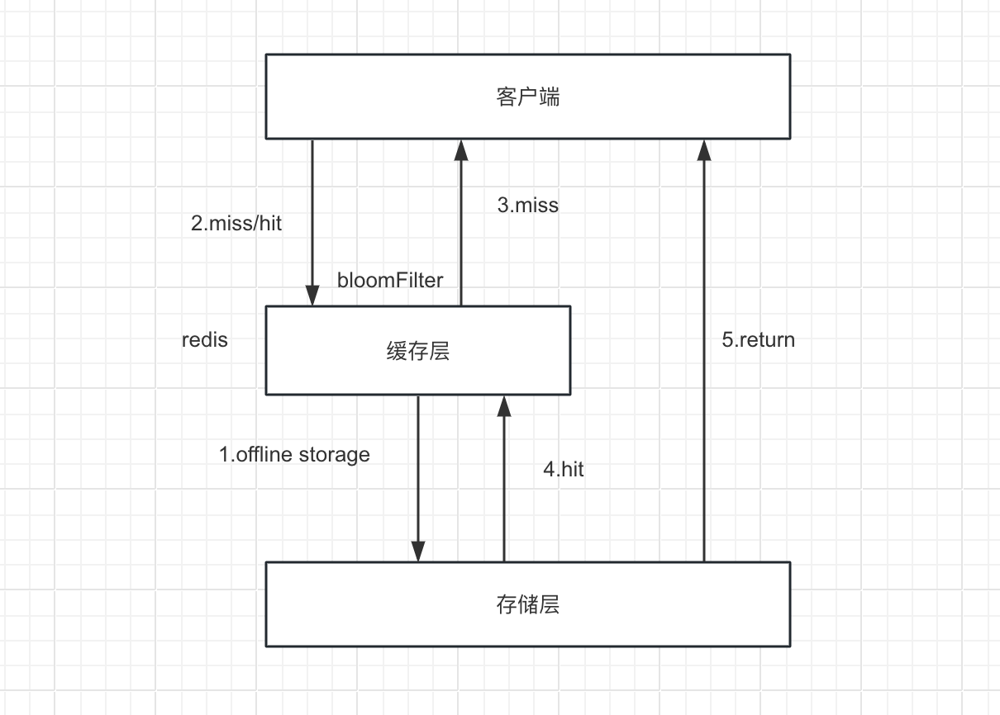

[MyCat](https://snailclimb.gitee.io/javaguide/#/docs/java/basis/Java%E5%9F%BA%E7%A1%80%E7%9F%A5%E8%AF%86) 分库

# Redis学习

> Remote dictionary Server 远程字典服务
>
> [Redis官网](https://redis.io/)、[Redis中文网](redis.cn)

```
Redis 是一个开源（BSD许可）的，内存中的数据结构存储系统，它可以用作数据库、缓存和消息中间件。 它支持多种类型的数据结构，如 字符串（strings）， 散列（hashes）， 列表（lists）， 集合（sets）， 有序集合（sorted sets） 与范围查询， bitmaps， hyperloglogs 和 地理空间（geospatial） 索引半径查询。 Redis 内置了 复制（replication），LUA脚本（Lua scripting）， LRU驱动事件（LRU eviction），事务（transactions） 和不同级别的 磁盘持久化（persistence）， 并通过 Redis哨兵（Sentinel）和自动 分区（Cluster）提供高可用性（high availability）。
```


## 一、安装过程

```shell
#安装redis 默认是稳定版 静默安装完成 使用mac安装
brew install redis

#redis使用
#启动Redis
方式一: brew services start redis@3.2 
方式二: redis-server /usr/local/etc/redis.conf
#查看ps(或者其他应用进程)
ps axu | grep redis(其他进程名)
isole            84721   0.0  0.0  4267768    900 s000  S+   10:08上午   0:00.00 grep redis
isole            84501   0.0  0.0  4309180   1568   ??  Ss   10:06上午   0:00.07 redis-server 127.0.0.1:6379
#关闭redis服务(直接kill +进程号)
方法一：kill 84721   
方法二：brew services stop redis
#连接redis客户端
redis-cli -h 127.0.0.1 -p 6379
如下: 
127.0.0.1:6379> get("123")
#关闭redis客户端
redis-cli shutdown
#关闭服务(杀死进程)
sudo pkill redis-server
```

```sh
#安装redis linux安装 copy对应的离线包 解压包
tar xvf  redis-6.2.1.tar 
#安装所需环境
yum install gcc-c++
#安装
make install
#在对应的安装目录（默认/usr/local/bin） 启动redis服务 修改了配置文件的地址
redis-server redis-config/redis.conf 
#连接redis
redis-cli -h 127.0.0.1 -p 6379
```

### 1、Redis能干嘛？？？

1. 作为缓存，效率高， 高速缓存
2. 发布订阅系统
3. 地图信息更新


1、内存存储、持久化。内存中是断电就没有 需要持久化：**1) rdb、2) aof**

redis-benchmark redis 性能测试 


**redis 是 单线程**

redis的瓶颈时根据机器的内存和网络带宽，cpu不是redis的瓶颈。

redis为什么是单线程还这么快？

1、误区1 ：高性能的服务器一定是多线程的？

2、误区2：多线程（CPU会上下文切换） 一定比单线程效率高？

核心：redis是把所有的数据都放到内存中，所以说单线程去操作内存效率最高，多线程（CPU上下文切换：耗时的操作） 对于内存系统来说 如果没有上下文切换效率就是最高的 多次读写都是在一个CPU上，**在内存情况下 单线程是最佳方案**。


## 二、五大数据类型

## 1、String

常用的命令

[命令官网地址](https://redis.io/commands#string)

```bash
# 设置一个value到redis中
127.0.0.1:6379> set key value
# 获取对应的key的value
127.0.0.1:6379> get key
"value"
# 设置多个value到redis中 
127.0.0.1:6379> mset key1 value1 key2 value2
# 获取多个对应的key的value 原子操作 要么一起成功 一起失败
127.0.0.1:6379> mget key1 key2
1) "value1"
2) "value2"
# 追加某个key的value
127.0.0.1:6379> APPEND key appendvlaue
(integer) 16
127.0.0.1:6379> get key
"valueappendvlaue"
127.0.0.1:6379> set number 100
#数字递减
127.0.0.1:6379> DECR number
(integer) 99
#数字递减指定值
127.0.0.1:6379> DECRBY number  10
(integer) 89
127.0.0.1:6379> 
#获取某个范围的值
127.0.0.1:6379> GETRANGE key 1 10
"alueappend"
#返回原本的值并且修改对应的value
127.0.0.1:6379> GETSET key newvaluebygetset
"valueappendvlaue"
#数字递增加
127.0.0.1:6379> INCR number
(integer) 90
#数字递增指定值
127.0.0.1:6379> INCRBY number 10
(integer) 100
#数字递增浮点数
127.0.0.1:6379> INCRBYFLOAT number 1.1
"101.1"
#如果这个key不存在就set值 可以一次性set多个 且是原子操作
127.0.0.1:6379> MSETNX key valuemsetnx
(integer) 0
127.0.0.1:6379> MSETNX key100 valuemsetnx
(integer) 1
#设置一个值的过期时间 单位ms
127.0.0.1:6379> PSETEX key100 10000000 value
#查看过期时间
127.0.0.1:6379> ttl key100
(integer) 9998
#设置一个值的过期时间 单位s
127.0.0.1:6379> SETEX key1200 100 svalue
127.0.0.1:6379> ttl key1200
(integer) 95
#如果key不存在，这种情况下等同SET命令。 当key存在时，什么也不做。SETNX是”SET if Not eXists”的简写
127.0.0.1:6379> SETNX key100 valeu
(integer) 0
127.0.0.1:6379> SETNX key1000 valeu
(integer) 1
#从第几位开始新增
127.0.0.1:6379> SETRANGE key 10 sahsaks11111111111111111111 
(integer) 37
#获取一个key对应的长度 不是string报错
127.0.0.1:6379> STRLEN key2
(integer) 21
```

### String使用场景

- 缓存，value对应的数字、字符串--对象缓存存储
- 计数器 逐渐累加 递减操作--粉丝数
- 统计多单位的数量，如 uid:99898:follow 0

### 底层原理 TODO


## 2、List  

> 双向链表 、先进后出
>
> **value有序可重复**

常用的命令

[官网地址](http://www.redis.cn/commands.html#list)

```bash
#往list中存值 从左插入
127.0.0.1:6379> LPUSH list 1 2 2 3 3 4 4 5 6 
(integer) 9
#往list中存值 从右插入
127.0.0.1:6379> RPUSH list 11 22  33  44  55  66
(integer) 13
#查看所有值
127.0.0.1:6379> LRANGE list 0 -1
1) "6"
2) "5"
3) "4"
4) "4"
5) "3"
6) "3"
7) "2"
8) "2"
9) "1"
#找到第一个值 找到指定下标的值
127.0.0.1:6379> LINDEX list 0
"5"
#把 value 插入存于 key 的列表中在基准值 pivot 的前面或后面。当 key 不存在时，这个list会被看作是空list，任何操作都不会发生。存list报错
127.0.0.1:6379> LINSERT list before 55 555
127.0.0.1:6379> LINSERT list after 55 55555
# key对应的list的长度。
127.0.0.1:6379> LLEN list
(integer) 15
# 如果这个list存在就在头部插入value
127.0.0.1:6379> LPUSHX list aaaaa
(integer) 16
# 如果这个list存在就在尾部插入value
127.0.0.1:6379> RPUSHX list bbbbb
# 移除并且返回 key 对应的 list 的第一个元素。 从左
127.0.0.1:6379> LPOP list
"aaaaa"
# 移除并且返回 key 对应的 list 的第一个元素。 从右
127.0.0.1:6379> RPOP list
"bbbbb"
#从存于 key 的列表里移除前 count 次出现的值为 value 的元素 不存在就是返回0
#count > 0: 从头往尾移除值为 value 的元素。
#count < 0: 从尾往头移除值为 value 的元素。
#count = 0: 移除所有值为 value 的元素。
127.0.0.1:6379> LREM list 2 2
(integer) 2
127.0.0.1:6379> LRANGE list 0 -1
 1) "5"
 2) "4"
 3) "4"
 4) "3"
 5) "3"
 6) "11"
 7) "22"
 8) "33"
 9) "44"
10) "555"
11) "55"
12) "55555"
13) "66"
#设置 index 位置的list元素的值为 value 从0开始
127.0.0.1:6379> LSET list 0 88888
OK
127.0.0.1:6379> LRANGE list 0 -1
 1) "88888"
 2) "4"
 3) "4"
 4) "3"
 5) "3"
 6) "11"
 7) "22"
 8) "33"
 9) "44"
10) "555"
11) "55"
12) "55555"
13) "66"


127.0.0.1:6379> LRANGE list 0 -1
 1) "88888"
 2) "4"
 3) "4"
 4) "3"
 5) "3"
 6) "11"
 7) "22"
 8) "33"
 9) "44"
10) "555"
11) "55"
12) "55555"
#修剪(trim)一个已存在的 list，这样 list 就会只包含指定范围的指定元素
127.0.0.1:6379> ltrim list 3 -3
OK
127.0.0.1:6379> LRANGE list 0 -1
1) "3"
2) "3"
3) "11"
4) "22"
5) "33"
6) "44"
7) "555"
# 从右边拼一个 移动到另一个list中
#  如果 source 和 destination 是同样的，那么这个操作等同于移除列表最后一个元素并且把该元素放在列表头部， 所以这个命令也可以当作是一个旋转列表的命令
127.0.0.1:6379> RPOPLPUSH list otherlist
"555"
127.0.0.1:6379> LRANGE otherlist 0 -1
1) "555"
#BRPOPLPUSH 是 RPOPLPUSH 的阻塞版本。 当 source 包含元素的时候，这个命令表现得跟 RPOPLPUSH 一模一样。 当 source 是空的时候，Redis将会阻塞这个连接，直到另一个客户端 push 元素进入或者达到 timeout 时限。 timeout 为 0 能用于无限期阻塞客户端。
127.0.0.1:6379> BRPOPLPUSH list1 otherlist 1
(nil)
(1.05s)
127.0.0.1:6379> BRPOPLPUSH list1 otherlist 0
"list1"
(46.43s)
# 另开客户端 插入值
127.0.0.1:6379> LPUSH list1 list1

# BLPOP 是阻塞式列表的弹出原语
127.0.0.1:6379> BLPOP list2 0
1) "list2"
2) "1"
(8.25s)
#另开客户端 插入值
127.0.0.1:6379> lpush list2 1
(integer) 1
#尝试多个值 RRPOP同理
127.0.0.1:6379> BLPOP list1 list2 list3 0
1) "list2"
2) "111"
(72.77s)

```


### 常见用途

- lindex  通过下标获取值 生产、消费者   生产者逐渐插入 消费值逐渐消费 
- 可以把list变成 栈、队列、阻塞队列 队列  **栈（先进后出 push pop 弹夹 只允许在一端操作）**、**队列（先进先出 排队  只允许在一端插入 另一端删除）**
- 消息排队！ 消息队列！

### 底层原理TODO


## 3、Set

> **无序不能重复**

[官网命令地址](http://www.redis.cn/commands.html#set)

```bash
#添加一个或多个指定的member元素到集合的 key中
127.0.0.1:6379> SADD set 1 2 3 4 5 6 7 1 1 1 2 3 3 4 5 
(integer) 7
#查看成员
127.0.0.1:6379> SMEMBERS set
1) "1"
2) "2"
3) "3"
4) "4"
5) "5"
6) "6"
7) "7"
#查看set的值
127.0.0.1:6379> SCARD set
(integer) 7


127.0.0.1:6379> SADD set1 11 123099 192836 218 2
(integer) 5
#查看set set1 的差值
127.0.0.1:6379> SDIFF set set1 
1) "1"
2) "3"
3) "4"
4) "5"
5) "6"
6) "7"
7) "28"
8) "23099"
9) "92836"

#查看set set1 的差值 并且把这个放到ste3 中 如果ste3存在 那么将重写
127.0.0.1:6379> SDIFFSTORE ste3 set set1
(integer) 9
127.0.0.1:6379> SMEMBERS ste3
1) "1"
2) "3"
3) "4"
4) "5"
5) "6"
6) "7"
7) "28"
8) "23099"
9) "92836"
#返回指定所有的集合的成员的交集.
127.0.0.1:6379> SINTER set set1
1) "2"
#查看set set1 的交集 并且把这个放到set3中 如果set3存在 那么将重写
127.0.0.1:6379> SINTERSTORE set3 set1 set
(integer) 1
127.0.0.1:6379> SMEMBERS set3
1) "2"

#集合中是否包含成员 存在1 不存在0
127.0.0.1:6379> SISMEMBER set 1
(integer) 1
127.0.0.1:6379> SISMEMBER set 11111
(integer) 0

127.0.0.1:6379> SMEMBERS set
 1) "1"
 2) "2"
 3) "3"
 4) "4"
 5) "5"
 6) "6"
 7) "7"
 8) "28"
 9) "23099"
10) "92836"
127.0.0.1:6379> SMEMBERS set1
1) "2"
2) "11"
3) "218"
4) "123099"
5) "192836"
#从原地址移动一个值到目标集合
127.0.0.1:6379> SMOVE set set1 28
(integer) 1
#随机pop一个值出去
127.0.0.1:6379> SPOP set
"3"
#随机pop指定个值出去
127.0.0.1:6379> SPOP set 2
1) "1"
2) "5"


#随机返回key集合中的一个元素.
127.0.0.1:6379> SRANDMEMBER set 1
1) "2"
#随机返回key集合中的n个元素. 如果大于size 取全部
127.0.0.1:6379> SRANDMEMBER set 122
1) "2"
2) "4"
3) "6"
4) "7"
5) "92836"
#随机返回key集合中的N个元素. 取绝对值
127.0.0.1:6379> SRANDMEMBER set -1
1) "2"
#随机返回key集合中的N个元素. 取绝对值
127.0.0.1:6379> SRANDMEMBER set -2
1) "6"
2) "4"

#在key集合中移除指定的元素
127.0.0.1:6379> srem set 2
(integer) 1
127.0.0.1:6379> srem set 4 6 7
(integer) 3

#取并集
127.0.0.1:6379> SMEMBERS set1
1) "2"
2) "11"
3) "28"
4) "218"
5) "123099"
6) "192836"
127.0.0.1:6379> SMEMBERS set
1) "92836"
127.0.0.1:6379> SUNION set set1
1) "2"
2) "11"
3) "28"
4) "218"
5) "92836"
6) "123099"
7) "192836"

#取并集 结果存储在destination集合中.
127.0.0.1:6379> SUNIONSTORE set001 set  set1
(integer) 7
127.0.0.1:6379> SRANDMEMBER set001 1000
1) "2"
2) "11"
3) "28"
4) "218"
5) "92836"
6) "123099"
7) "192836"

```

### 常见用途

- 微博 b站 共同关注 共同爱好 共同等字眼
- 抽随机 抽奖
- 差集、交集、并集

### 底层原理TODO


## 4、Hash

Hset hashmap key value set 值

```bash
#设置 key 指定的哈希集中指定字段的值
127.0.0.1:6379> hset hashmap key1 value1 key2 value2 key3 value23
(integer) 2
#返回 key 指定的哈希集中所有的字段和值
127.0.0.1:6379> HGETALL hashmap
1) "key1"
2) "value1"
3) "key2"
4) "value2"
5) "key3"
6) "value23"
#返回 key 指定的哈希集中该字段所关联的值
127.0.0.1:6379> hget hashmap key1
"value1"
#移除指定的key 成功1 失败0
127.0.0.1:6379> HDEL hashmap key1
(integer) 1
127.0.0.1:6379> HDEL hashmap key11
(integer) 0
#是否存在key 成功1 失败0
127.0.0.1:6379> HEXISTS hashmap key1
(integer) 0
127.0.0.1:6379> HEXISTS hashmap key2
(integer) 1
# 指定值增加int
127.0.0.1:6379> HSET hashmap key5 5
(integer) 1
127.0.0.1:6379> HINCRBY hashmap key5 1
(integer) 6
127.0.0.1:6379> HINCRBY hashmap key5 -1
(integer) 5

# 指定值增加float
127.0.0.1:6379> HINCRBYFLOAT hashmap key5 1.0
"6"
127.0.0.1:6379> HINCRBYFLOAT hashmap key5 1.01
"7.01"
#查看所有的key值
127.0.0.1:6379> HKEYS hashmap
1) "key2"
2) "key3"
3) "key5"
#返回 key 指定的哈希集包含的字段的数量
127.0.0.1:6379> HLEN hashmap
(integer) 3
#获取指定key值
127.0.0.1:6379> HMGET hashmap key1 key3
1) (nil)
2) "value23"
#设置 key 指定的哈希集中指定字段的值
127.0.0.1:6379> HMSET hashmap key11 value11 key22 value22
OK
#如果这个key不存在的时候设置值 1 赋值成功 0 已经有字段 赋值失败
127.0.0.1:6379> HSETNX hashmap key 11
(integer) 1
127.0.0.1:6379> HSETNX hashmap key 11
(integer) 0
#返回指定字段的长度
127.0.0.1:6379> HSTRLEN hashmap  key
(integer) 2
#获取所有value
127.0.0.1:6379> HVALS hashmap
1) "value2"
2) "value23"
3) "7.01"
4) "value11"
5) "value22"
6) "11"
```


### 常见用途

- 用户信息保存  userid  name age  经常变动的信息 适合对象的存储

  

### 底层原理TODO


## 5、Zset 

> [官网命令地址](http://www.redis.cn/commands/zadd.html)
>
> 有序集合  有权重 排序 score

```bash
#添加值
127.0.0.1:6379> ZADD zset 1 "value1" 2 "value2" 33 "value33"
(integer) 3
#查看所有的值
127.0.0.1:6379> ZRANGE zset 0 -1
1) "value1"
2) "value2"
3) "value33"
#查看部分的值
127.0.0.1:6379> ZRANGE zset 0 1
1) "value1"
2) "value2"
#返回返回key的有序集元素个数。
127.0.0.1:6379> ZCARD zset
(integer) 3
#指定分数范围的元素个数。
#正负无穷
127.0.0.1:6379> ZCOUNT zset -inf +inf
(integer) 3
#指定区间
127.0.0.1:6379> ZCOUNT zset 0 2
(integer) 2

#给指定的value分数增加
127.0.0.1:6379> ZINCRBY zset 10 value1
"11"
127.0.0.1:6379> ZRANGE zset 0 -1
1) "value2"
2) "value1"
3) "value33"

# 交集放到新的目标地址中 需要设置几个key的交集   weights 后面是乘法因子 每个key都要乘以对应的 
127.0.0.1:6379> ZINTERSTORE zset12 2 zset1 zset WEIGHTS 3 4
(integer) 2
127.0.0.1:6379> ZRANGE zset12 0 -1 WITHSCORES
1) "value2"
2) "14"
3) "value33"
4) "141"

#指定成员中的成员个数 最小最大分值
127.0.0.1:6379> ZLEXCOUNT zset12  - +
(integer) 2
#指定成员之间的个数
127.0.0.1:6379> ZLEXCOUNT zset12  [value2 [value33
(integer) 2
#区间中的
127.0.0.1:6379> ZLEXCOUNT zset12  [value2 +
(integer) 2
127.0.0.1:6379> ZLEXCOUNT zset12 -  [value2 
(integer) 1

#弹出最高分数的几个值
127.0.0.1:6379> ZPOPMAX zset1 2
1) "value12"
2) "12"
3) "value33"
4) "3"
#弹出最低分数的几个值
127.0.0.1:6379> ZPOPMIN zset 2
1) "value2"
2) "2"
3) "value1"
4) "11"

#返回指定成员区间内的成员，按成员字典正序排序 顺序
127.0.0.1:6379> ZRANGEBYLEX  zset  - +
1) "value33"

#获取指定区间或者指定对象的的前后最后的值 可分页 “(“ 符号作为开头表示小于 顺序
127.0.0.1:6379> zadd zset11 10 a 11 b 12 c 33 v 13 n
(integer) 5
127.0.0.1:6379> ZRANGEBYLEX zset11 - + limit 1 2
1) "b"
2) "c"
127.0.0.1:6379> ZRANGEBYLEX zset11 [c + limit 0 10
1) "c"
2) "n"
3) "v"


#获取指定分数的前后最后的值 可分页 “(“ 符号作为开头表示小于
127.0.0.1:6379> ZRANGEBYSCORE zset11 0 10  limit 0 1
1) "a"
127.0.0.1:6379> ZRANGEBYSCORE zset11 (0 (30  limit 0 3
1) "a"
2) "b"
3) "c"

#返回有序集key中成员member的排名
127.0.0.1:6379> zrank zset11 c
(integer) 2

#移除指定member
127.0.0.1:6379> ZREM zset11 v
(integer) 1
127.0.0.1:6379> ZRANGE zset11 0 -1 WITHSCORES
1) "a"
2) "10"
3) "b"
4) "11"
5) "c"
6) "12"
7) "n"
8) "13"
#所以指定区间 [到指定元素
127.0.0.1:6379> ZREMRANGEBYLEX zset11 - [c
(integer) 3
#移除所有
127.0.0.1:6379> ZREMRANGEBYLEX zset11 - +
(integer) 1
#所以指定区间 (小于
127.0.0.1:6379> ZREMRANGEBYLEX zset11 - (value33
(integer) 0
# 移除有序集key中，指定排名(rank)区间内的所有成员
127.0.0.1:6379> zadd zset11 1 a 2 b 3 c 4 d 5 f 6 h 7 j
(integer) 7
127.0.0.1:6379> ZREMRANGEBYRANK zset11 0 5
(integer) 6
127.0.0.1:6379> ZRANGE zset11 0 -1
1) "j"
# 移除有序集key中，指定分数区间内的所有成员
127.0.0.1:6379> ZREMRANGEBYSCORE zset11 3 5
(integer) 3
127.0.0.1:6379> ZRANGE zset11 0 -1
1) "a"
2) "b"
3) "h"
4) "j"
#返回有序集key中，指定区间内的成员 倒序
127.0.0.1:6379> ZREVRANGE zset11 1 4
1) "h"
2) "f"
3) "d"
4) "c"
#指定成员区间内的成员  - + 要反过来
127.0.0.1:6379> ZREVRANGEBYLEX zset11 + - limit 0 10
1) "j"
2) "h"
3) "f"
4) "d"
5) "c"
6) "b"
7) "a"
#指定范围
127.0.0.1:6379> ZREVRANGEBYLEX zset11 + [f limit 0 10
1) "j"
2) "h"
3) "f"
#指定成员
127.0.0.1:6379> ZREVRANGEBYLEX zset11 + (f limit 0 10
1) "j"
2) "h"

#指定分数之间的值
127.0.0.1:6379> ZREVRANGEBYSCORE zset11 10 5
1) "j"
2) "h"
3) "f"
#小于某个段位
127.0.0.1:6379> ZREVRANGEBYSCORE zset11 10 (5
1) "j"
2) "h"
#全部
127.0.0.1:6379> ZREVRANGEBYSCORE zset11 +inf -inf
1) "j"
2) "h"
3) "f"
4) "d"
5) "c"
6) "b"
7) "a"

#倒序排序
127.0.0.1:6379> ZREVRANGE zset11 0 -1
1) "j"
2) "h"
3) "f"
4) "d"
5) "c"
6) "b"
7) "a"

#返回有序集key中，成员member的score值
127.0.0.1:6379> ZSCORE zset11 a
"1"

#计算给定的numkeys个有序集合的并集，并且把结果放到destination中。 要设置几个key
127.0.0.1:6379> ZUNIONSTORE des 2 zset11 zset WEIGHTS 1 10
(integer) 8
127.0.0.1:6379> ZRANGE des 0 -1
1) "a"
2) "b"
3) "c"
4) "d"
5) "f"
6) "h"
7) "j"
8) "value33"
#3个key
127.0.0.1:6379> ZUNIONSTORE des 3 zset11 zset1 zset WEIGHTS 1 10 10
(integer) 10


```

### 常见用途

- 存储班级成绩表

- 工资表排序 set排序

- **排行榜**

  > ⭐️如果排行榜出现了重复排名如何处理？
  >
  > - 方法1：不依赖其他的数据库等，仅使用ZSET数据结构，每个记录肯定是带时间戳的，那么就把时间戳append到分数后面，作为小数点后到树，那么肯定就可以区分
  > - 方法2：使用其他的数据库或者其他工具，如果出现重复，那么就使用其他的去比较重复的时间

- 重要消息  带权重进行判断


### 底层原理TODO

底层结构是：

> **ziplist（压缩列表）**：当Zset存储的元素数量较少，且所有元素的最大长度小于64字节时，Redis会选择使用ziplist作为底层实现。ziplist是一种为节省内存而设计的特殊编码结构，它将所有的元素和分数紧凑地存储在一起。这种方式的优点是占用内存少，但是在需要修改数据时，可能需要对整个压缩列表进行重写，性能较低。
>
> **skiplist（跳跃表）：**当Zset存储的元素数量较多，或者任何元素的长度超过64字节时，Redis会选择使用skiplist作为底层实现。跳跃表是一种可以进行快速查找的有序数据结构，它通过维护多级索引来实现快速查找。这种方式的优点是查找和修改数据的性能较高，但是占用的内存也较多。


## 三、四大特殊类型：

## 1、Geospatial ⭐️

> 地理位置 geo 
>
> [官网命令地址](http://www.redis.cn/commands/geoadd.html)

- 有效的经度从-180度到180度。

- 有效的纬度从-85.05112878度到85.05112878度

- 南北极不能输入

  ```bash
  #添加位置记录 合肥 成都
  127.0.0.1:6379> geoadd chinaMap 117.27 31.86 hf 104.06 30.67 cd
  (integer) 2
  #查看两地位置 [m|km|ft|mi] 可以设置单位
  127.0.0.1:6379> GEODIST chinaMap hf bj km
  "897.6757"
  # 返回的 geohash 的位置与用户给定的位置元素的位置一一对应 
  127.0.0.1:6379> GEOHASH chinaMap bj
  1) "wx4fbxxfke0"
  #返回对应的经纬度
  127.0.0.1:6379> GEOPOS chinaMap bj hf
  1) 1) "116.39999896287918091"
     2) "39.90000009167092543"
  2) 1) "117.27000027894973755"
     2) "31.85999891446920884"
  #以指定的纬度作为中心 方圆多大半径的member
  127.0.0.1:6379> GEORADIUS chinaMap 110 37 10000 km
  1) "cd"
  2) "hf"
  3) "tj"
  4) "bj"
  #指定位置中心的元素
  127.0.0.1:6379> GEORADIUSBYMEMBER chinaMap bj 1000 km
  1) "tj"
  2) "bj"
  3) "hf"
  ```

### 常见用途

- 朋友的定位
- 附近的人  
- 打车距离计算 直线距离

### 底层原理TODO

- 底层原理是Zset


## 2、Hyperloglog ⭐️

> 在数学上，基数或势，即集合中包含的元素的“个数”（参见势的比较），是日常交流中基数的概念在数学上的精确化（并使之不再受限于有限情形）
>
> [官网命令地址](http://www.redis.cn/commands/pfmerge.html)

**什么是布隆过滤器**：

- 布隆过滤器是由 Burton Howard Bloom 于 1970 年提出的，它是一种 space efficient 的概率型数据结构，用于判断一个元素是否在集合中。
- 布隆过滤器的特点是：
  - 当布隆过滤器判断某个 key 存在时，这个数据可能不存在；**当判断不存在时，那么这个数据一定不存在。**
  - 布隆过滤器可以插入元素，**但不可以删除已有元素**。
  - 其中的元素越多，false positive rate（误报率）越大，但是 false negative（漏报）是不可能的。

```bash
# 添加参数 唯一对象的基数
127.0.0.1:6379> PFADD hlllog a b c d e f g a b c d e f g
(integer) 1
#如果存在 就返回0 无效添加
127.0.0.1:6379> PFADD hlllog a c  d
(integer) 0
#如果不存在 就返回1
127.0.0.1:6379> PFADD hlllog a c  d k
(integer) 1

#查看当参数为一个key时,返回存储在HyperLogLog结构体的该变量的近似基数，如果该变量不存在,则返回0.
127.0.0.1:6379> PFCOUNT hlllog
(integer) 7

127.0.0.1:6379> PFCOUNT hlllog
(integer) 8

127.0.0.1:6379> PFMERGE hll1 hlllog hll
OK
127.0.0.1:6379> PFCOUNT hll1
(integer) 12
#将多个 HyperLogLog 合并（merge）为一个 HyperLogLog ， 合并后的 HyperLogLog 的基数接近于所有输入 HyperLogLog 的可见集合（observed set）的并集.
127.0.0.1:6379> PFMERGE hll1 hlllog hll
OK
127.0.0.1:6379> PFCOUNT hll1
(integer) 12
```

Hyperloglog  占用的内存是跟预期的元素数量有关，不同的元素的占用的数量不一样

传统的方式 set保存用户的id 然后可以统计set中的元素的数量做为标准  这个方式如果保存了大量的用户id 会占用很多内存

### 常见用途

- 网页的UV 一个人访问一个网站多次 还是算作一个人
- 布隆过滤器（Bloom Filter）是一种用于判断元素是否存在于集合中的数据结构，它在缓存穿透等场景中非常有用
- 解决 Redis 缓存穿透问题。
- 邮件过滤，使用布隆过滤器实现邮件黑名单过滤。
- 爬虫爬过的网站过滤，爬过的网站不再爬取。
- 推荐过的新闻不再推荐。

### 底层原理

- **布隆过滤器的工作原理**：
  - 布隆过滤器使用一个 bit 数组，初始值全部设为 0。
  - 加入元素时，采用 k 个相互独立的 Hash 函数计算，然后将元素 Hash 映射的 K 个位置全部设置为 1。
  - 检测 key 是否存在时，仍然用这 k 个 Hash 函数计算出 k 个位置，如果位置全部为 1，则表明 key 存在，否则不存在。

- **误判率和空间复杂度**：
  - 哈希函数会出现碰撞，所以布隆过滤器会存在误判。
  - 误判率是指，布隆过滤器判断某个 key 存在，但实际不存在的概率。
  - 布隆过滤器的空间复杂度远低于哈希表。

布隆过滤器是一种高效的数据结构，能够在节省内存的同时解决去重问题。在实际开发中，根据需求合理使用布隆过滤器，可以有效提高系统性能和资源利用率

```
根据预期值1亿和容错率0.003，Redisson会去计算对应需要多个和hash算法（8个），还有最终的size数据 1亿两千万
```



### 实战代码

```java
public class RedisController {
    @Autowired
    private RedisTemplate redisTemplate;

    @Resource
    private RedissonClient redissonClient;

    @GetMapping("/getAll")
    public String getAll() {
        System.out.println("start");
        redisTemplate.opsForHyperLogLog().add("key", "111");
        RBloomFilter<Object> bloomFilter = redissonClient.getBloomFilter("key");
        // hash函数的个数，容错率越低hash函数的个数越多；
        // 数据一旦超过预定容量，错误率就会急剧上升； 总的capacity为1亿，容错率为千分之三
        bloomFilter.tryInit(10000000, 0.003);
        for (int i = 0; i < 10000000; i++) {
            bloomFilter.add(UUID.randomUUID().toString());
        }
        for (int i = 0; i < 10; i++) {
            String uuid = UUID.randomUUID().toString();
            boolean contains = bloomFilter.contains(uuid);
            System.out.println(uuid + ":是否存在：" + contains);
            if (!contains) {
                bloomFilter.add(uuid);
            }
        }
        System.out.println("'测试 1'是否存在：" + bloomFilter.contains("71a11ecc-7e71-41da-a202-df9dead16b2e"));
        System.out.println("'测试 2'是否存在：" + bloomFilter.contains("0f59c2fc-aebc-4185-8014-1d34c95f6ff4"));
        System.out.println("预计插入数量：" + bloomFilter.getExpectedInsertions());
        System.out.println("容错率：" + bloomFilter.getFalseProbability());
        System.out.println("hash函数的个数：" + bloomFilter.getHashIterations());
        System.out.println("size：" + bloomFilter.sizeInMemory());
        return "end";
    }
}
```


## 3、Bitmap 位运算🌟

> 位图计算 bitmaps 位图 数据结构 都是操作二进制 来进行记录 就只有0 1 两个状态

```bash
#设置或者清空key的value(字符串)在offset处的bit值。
127.0.0.1:6379> SETBIT biykey 1 1
(integer) 0
#获取offset的bit值
127.0.0.1:6379> GETBIT bitkey 1
(integer) 1
#获取值
127.0.0.1:6379> get bitkey
"p\x00\x00\x00\x00\x00\x00\x00\x00\x00\x00\x00\b"
#统计字符串被设置为1的bit数.
127.0.0.1:6379> SETBIT bitkey 1001 0
(integer) 0
127.0.0.1:6379> BITCOUNT bitkey
(integer) 3
#返回一个位置，把字符串当做一个从左到右的字节数组，第一个符合条件的在位置0，其次在位置8，
BITPOS
#TODO
BITFIELD
#对一个或多个保存二进制位的字符串 key 进行位元操作，并将结果保存到 destkey  AND 、 OR 、 NOT 、 XOR
127.0.0.1:6379> set bitkeyy1 abcdjs
OK
127.0.0.1:6379> set bitkeyy2 abcdaasskllkjs
OK
127.0.0.1:6379> BITOP and  dest bitkeyy1 bitkeyy2
(integer) 14
127.0.0.1:6379> get dest
"abcd`a\x00\x00\x00\x00\x00\x00\x00\x00
```

### 常见用途

- 统计用户信息 活跃 不活跃 登陆 未登陆 打卡  365天打卡 两个状态都是可以使用bitmaps
- 打卡 使用bitmap来记录周一到周四的打卡


## 四、事务

> 事务 ACID 同时成功 同时失败 原子性
>
> [事务官网命令](http://www.redis.cn/commands.html#transactions)

Redis事务 单条保存是保存原子性的。但是事务不保存原子性 

redis事务 ：一组命令的集合 一个事务中的所有命令都会被序列化 在事务执行中 会按照顺序执行

```bash
#标记一个事务块的开始。 随后的指令将在执行EXEC时作为一个原子执行
127.0.0.1:6379> MULTI
OK
#执行操作 命令入队 
127.0.0.1:6379(TX)> SADD v1 aaa
QUEUED
127.0.0.1:6379(TX)> Sadd n 1111
QUEUED
127.0.0.1:6379(TX)> SADD kkkkk 11111
QUEUED
#执行事务
127.0.0.1:6379(TX)> EXEC
1) (integer) 1
2) (integer) 1
3) (integer) 1


127.0.0.1:6379> MULTI
OK
127.0.0.1:6379(TX)> SADD keu1111 11111
QUEUED
#取消事物 队列里面的都取消
127.0.0.1:6379(TX)> DISCARD
OK

```

#### 错误类型

- ​	编译型错误   代码有问题 命令报错  事务中所有的命令都不会被执行

- ```bash
  127.0.0.1:6379> MULTI
  OK
  127.0.0.1:6379(TX)> sahh ajsj 
  (error) ERR unknown command `sahh`, with args beginning with: `ajsj`, 
  127.0.0.1:6379(TX)> SADD lqooi1 111
  QUEUED
  127.0.0.1:6379(TX)> EXEC
  (error) EXECABORT Transaction discarded because of previous errors.
  
  ```

- ​	运行时异常  如果事务中存在语法性 那么执行命令的时候 其他命令是可以正常执行


## 4、stream

#### 常见用途：

- 消息订阅系统


乐观锁

**监视 watch**

悲观锁：很悲观 什么时候都回出现问题

乐观锁：很乐观 什么时候都不会出现问题  所以不会上锁  更新数据的时候去判断一下  在此期间是否有人呢修改过这个数据 

​	1、获取version版本

​	2、更新的时候比较version

redis监视测试

redis 乐观锁 通过使用watch 监控 

​		事务执行完毕后回自动解锁 无需手动unwatch解锁


## 五、Java实战

### 1、Java操作redis

#### 1）Jedis操作

> jedis 是官方推荐的Java连接开发工具  **老的**
>
> jedis：采用直连  多个线程操作不安全 为了避免不安全 采用jedispool连接池  BIO模式

```java
public class RawJedisTest {
    public static void main(String[] args) {
        Jedis jedis = new Jedis("localhost", 6379);
//        localhost.auth("12345678");
        jedis.set("keg", "zhangsan");
        String key = jedis.get("keg");
        System.out.println(jedis.ping());
        System.out.println(key);
    }
}


public class TestHash {
    public static void main(String[] args) {
        Jedis jedis = new Jedis("127.0.0.1", 6379);
        jedis.flushDB();
        Map<String, String> map = new HashMap<String, String>();
        map.put("key1", "value1");
        map.put("key2", "value2");
        map.put("key3", "value3");
        map.put("key4", "value4");
        //添加名称为hash（key）的hash元素
        jedis.hmset("hash", map);
        //向名称为hash的hash中添加key为key5，value为value5元素
        jedis.hset("hash", "key5", "value5");
        //return Map<String,String>
        System.out.println("散列hash的所有键值对为：" + jedis.hgetAll("hash"));
        //return Set<String>
        System.out.println("散列hash的所有键为：" + jedis.hkeys("hash"));
        //return List<String>
        System.out.println("散列hash的所有值为：" + jedis.hvals("hash"));
        System.out.println("将key6保存的值加上一个整数，如果key6不存在则添加key6：" + jedis.hincrBy("hash", "key6", 6));
        System.out.println("散列hash的所有键值对为：" + jedis.hgetAll("hash"));
        System.out.println("将key6保存的值加上一个整数，如果key6不存在则添加key6：" + jedis.hincrBy("hash", "key6", 3));
        System.out.println("散列hash的所有键值对为：" + jedis.hgetAll("hash"));
        System.out.println("删除一个或者多个键值对：" + jedis.hdel("hash", "key2"));
        System.out.println("散列hash的所有键值对为：" + jedis.hgetAll("hash"));
        System.out.println("散列hash中键值对的个数：" + jedis.hlen("hash"));
        System.out.println("判断hash中是否存在key2：" + jedis.hexists("hash", "key2"));
        System.out.println("判断hash中是否存在key3：" + jedis.hexists("hash", "key3"));
        System.out.println("获取hash中的值：" + jedis.hmget("hash", "key3"));
        System.out.println("获取hash中的值：" + jedis.hmget("hash", "key3", "key4"));
    }
}


public class TestKey {
    public static void main(String[] args) {
        Jedis jedis = new Jedis("127.0.0.1", 6379);

        System.out.println("清空数据：" + jedis.flushDB());
        System.out.println("判断某个键是否存在：" + jedis.exists("username"));
        System.out.println("新增<'username','kuangshen'>的键值对：" + jedis.set("username", "kuangshen"));
        System.out.println("新增<'password','password'>的键值对：" + jedis.set("password", "password"));
        System.out.print("系统中所有的键如下：");
        Set<String> keys = jedis.keys("*");
        System.out.println(keys);
        System.out.println("删除键password:" + jedis.del("password"));
        System.out.println("判断键password是否存在：" + jedis.exists("password"));
        System.out.println("查看键username所存储的值的类型：" + jedis.type("username"));
        System.out.println("随机返回key空间的一个：" + jedis.randomKey());
        System.out.println("重命名key：" + jedis.rename("username", "name"));
        System.out.println("取出改后的name：" + jedis.get("name"));
        System.out.println("按索引查询：" + jedis.select(0));
        System.out.println("删除当前选择数据库中的所有key：" + jedis.flushDB());
        System.out.println("返回当前数据库中key的数目：" + jedis.dbSize());
        System.out.println("删除所有数据库中的所有key：" + jedis.flushAll());
    }
}

public class TestList {
    public static void main(String[] args) {
        Jedis jedis = new Jedis("127.0.0.1", 6379);
        jedis.flushDB();
        System.out.println("===========添加一个list===========");
        jedis.lpush("collections", "ArrayList", "Vector", "Stack", "HashMap", "WeakHashMap", "LinkedHashMap");
        jedis.lpush("collections", "HashSet");
        jedis.lpush("collections", "TreeSet");
        jedis.lpush("collections", "TreeMap");
        //-1代表倒数第一个元素，-2代表倒数第二个元素,end为-1表示查询全部
        System.out.println("collections的内容：" + jedis.lrange("collections", 0, -1));
        System.out.println("collections区间0-3的元素：" + jedis.lrange("collections", 0, 3));
        System.out.println("===============================");
        // 删除列表指定的值 ，第二个参数为删除的个数（有重复时），后add进去的值先被删，类似于出栈
        System.out.println("删除指定元素个数：" + jedis.lrem("collections", 2, "HashMap"));
        System.out.println("collections的内容：" + jedis.lrange("collections", 0, -1));
        System.out.println("删除下表0-3区间之外的元素：" + jedis.ltrim("collections", 0, 3));
        System.out.println("collections的内容：" + jedis.lrange("collections", 0, -1));
        System.out.println("collections列表出栈（左端）：" + jedis.lpop("collections"));
        System.out.println("collections的内容：" + jedis.lrange("collections", 0, -1));
        System.out.println("collections添加元素，从列表右端，与lpush相对应：" + jedis.rpush("collections", "EnumMap"));
        System.out.println("collections的内容：" + jedis.lrange("collections", 0, -1));
        System.out.println("collections列表出栈（右端）：" + jedis.rpop("collections"));
        System.out.println("collections的内容：" + jedis.lrange("collections", 0, -1));
        System.out.println("修改collections指定下标1的内容：" + jedis.lset("collections", 1, "LinkedArrayList"));
        System.out.println("collections的内容：" + jedis.lrange("collections", 0, -1));
        System.out.println("===============================");
        System.out.println("collections的长度：" + jedis.llen("collections"));
        System.out.println("获取collections下标为2的元素：" + jedis.lindex("collections", 2));
        System.out.println("===============================");
        jedis.lpush("sortedList", "3", "6", "2", "0", "7", "4");
        System.out.println("sortedList排序前：" + jedis.lrange("sortedList", 0, -1));
        System.out.println(jedis.sort("sortedList"));
        System.out.println("sortedList排序后：" + jedis.lrange("sortedList", 0, -1));
    }
}


public class TestMulti {
    public static void main(String[] args) {
        //创建客户端连接服务端，redis服务端需要被开启
        Jedis jedis = new Jedis("127.0.0.1", 6379);
        jedis.flushDB();
        JSONObject jsonObject = new JSONObject();
        jsonObject.put("hello", "world");
        jsonObject.put("name", "java");
        //开启事务
        Transaction multi = jedis.multi();
        String result = jsonObject.toJSONString();
        try {
            //向redis存入一条数据
            multi.set("json", result);
            //再存入一条数据
            multi.set("json2", result);
            //这里引发了异常，用0作为被除数
            int i = 100 / 0;
            //如果没有引发异常，执行进入队列的命令
            multi.exec();
        } catch (Exception e) {
            e.printStackTrace();
            //如果出现异常，回滚
            multi.discard();
        } finally {
            System.out.println(jedis.get("json"));
            System.out.println(jedis.get("json2"));
            //最终关闭客户端
            jedis.close();
        }
    }
}


package study.redis.test;

import redis.clients.jedis.Jedis;

public class TestSet {
    public static void main(String[] args) {
        Jedis jedis = new Jedis("127.0.0.1", 6379);
        jedis.flushDB();
        System.out.println("============向集合中添加元素（不重复）============");
        System.out.println(jedis.sadd("eleSet", "e1", "e2", "e4", "e3", "e0", "e8", "e7", "e5"));
        System.out.println(jedis.sadd("eleSet", "e6"));
        System.out.println(jedis.sadd("eleSet", "e6"));
        System.out.println("eleSet的所有元素为：" + jedis.smembers("eleSet"));
        System.out.println("删除一个元素e0：" + jedis.srem("eleSet", "e0"));
        System.out.println("eleSet的所有元素为：" + jedis.smembers("eleSet"));
        System.out.println("删除两个元素e7和e6：" + jedis.srem("eleSet", "e7", "e6"));
        System.out.println("eleSet的所有元素为：" + jedis.smembers("eleSet"));
        System.out.println("随机的移除集合中的一个元素：" + jedis.spop("eleSet"));
        System.out.println("随机的移除集合中的一个元素：" + jedis.spop("eleSet"));
        System.out.println("eleSet的所有元素为：" + jedis.smembers("eleSet"));
        System.out.println("eleSet中包含元素的个数：" + jedis.scard("eleSet"));
        System.out.println("e3是否在eleSet中：" + jedis.sismember("eleSet", "e3"));
        System.out.println("e1是否在eleSet中：" + jedis.sismember("eleSet", "e1"));
        System.out.println("e1是否在eleSet中：" + jedis.sismember("eleSet", "e5"));
        System.out.println("=================================");
        System.out.println(jedis.sadd("eleSet1", "e1", "e2", "e4", "e3", "e0", "e8", "e7", "e5"));
        System.out.println(jedis.sadd("eleSet2", "e1", "e2", "e4", "e3", "e0", "e8"));
        //移到集合元素
        System.out.println("将eleSet1中删除e1并存入eleSet3中：" + jedis.smove("eleSet1", "eleSet3", "e1"));
        System.out.println("将eleSet1中删除e2并存入eleSet3中：" + jedis.smove("eleSet1", "eleSet3", "e2"));
        System.out.println("eleSet1中的元素：" + jedis.smembers("eleSet1"));
        System.out.println("eleSet3中的元素：" + jedis.smembers("eleSet3"));
        System.out.println("============集合运算=================");
        System.out.println("eleSet1中的元素：" + jedis.smembers("eleSet1"));
        System.out.println("eleSet2中的元素：" + jedis.smembers("eleSet2"));
        System.out.println("eleSet1和eleSet2的交集:" + jedis.sinter("eleSet1", "eleSet2"));
        System.out.println("eleSet1和eleSet2的并集:" + jedis.sunion("eleSet1", "eleSet2"));
        //eleSet1中有，eleSet2中没有
        System.out.println("eleSet1和eleSet2的差集:" + jedis.sdiff("eleSet1", "eleSet2"));
        //求交集并将交集保存到dstkey的集合
        jedis.sinterstore("eleSet4", "eleSet1", "eleSet2");
        System.out.println("eleSet4中的元素：" + jedis.smembers("eleSet4"));
    }
}


public class TestString {
    public static void main(String[] args) {
        Jedis jedis = new Jedis("127.0.0.1", 6379);
        jedis.flushDB();
        System.out.println("===========增加数据===========");
        System.out.println(jedis.set("key1", "value1"));
        System.out.println(jedis.set("key2", "value2"));
        System.out.println(jedis.set("key3", "value3"));
        System.out.println("删除键key2:" + jedis.del("key2"));
        System.out.println("获取键key2:" + jedis.get("key2"));
        System.out.println("修改key1:" + jedis.set("key1", "value1Changed"));
        System.out.println("获取key1的值：" + jedis.get("key1"));
        System.out.println("在key3后面加入值：" + jedis.append("key3", "End"));
        System.out.println("key3的值：" + jedis.get("key3"));
        System.out.println("增加多个键值对：" + jedis.mset("key01", "value01", "key02", "value02", "key03", "value03"));
        System.out.println("获取多个键值对：" + jedis.mget("key01", "key02", "key03"));
        System.out.println("获取多个键值对：" + jedis.mget("key01", "key02", "key03", "key04"));
        System.out.println("删除多个键值对：" + jedis.del("key01", "key02"));
        System.out.println("获取多个键值对：" + jedis.mget("key01", "key02", "key03"));

        jedis.flushDB();
        System.out.println("===========新增键值对防止覆盖原先值==============");
        System.out.println(jedis.setnx("key1", "value1"));
        System.out.println(jedis.setnx("key2", "value2"));
        System.out.println(jedis.setnx("key2", "value2-new"));
        System.out.println(jedis.get("key1"));
        System.out.println(jedis.get("key2"));

        System.out.println("===========新增键值对并设置有效时间=============");
        System.out.println(jedis.setex("key3", 2, "value3"));
        System.out.println(jedis.get("key3"));
        try {
            TimeUnit.SECONDS.sleep(3);
        } catch (InterruptedException e) {
            e.printStackTrace();
        }
        System.out.println(jedis.get("key3"));

        System.out.println("===========获取原值，更新为新值==========");
        System.out.println(jedis.getSet("key2", "key2GetSet"));
        System.out.println(jedis.get("key2"));

        System.out.println("获得key2的值的字串：" + jedis.getrange("key2", 2, 4));
    }
}

```


Spring推荐使用lettuce连接

**lettuce：采用netty  实例可以在多个线程中进行共享 不存在线程不安全的情况 减少线程数 更像NIO模式**

使用redisTemplate操作

```properties
# redis 配置
spring.redis.lettuce.pool.max-active= 8
spring.redis.port=6379
spring.redis.password=
spring.redis.ssl=false
spring.redis.host=
spring.redis.database=0
spring.redis.client-type=lettuce
spring.redis.lettuce.pool.max-idle=8
spring.redis.lettuce.pool.max-wait=-1ms
spring.redis.lettuce.shutdown-timeout=3000ms
spring.redis.lettuce.pool.min-idle=0
```

#### 2）使用redisTemplate


### 2、Redis config配置


### 3、Redis持久化

> 快照-持久化 在规定的时间内 执行了多少次的操作 则会持久化到文件.rdb .aof 中
>
> 在指定的时间间隔内将内存中的数据集快照写入磁盘中 也就是进行snapshot快照  它恢复时是将快照文件直接读到内存中

#### 1）RDB（Redis Database）

> **默认是RDB**这种方式进行持久化

```
Redis会单独创建fork一个子进程来进行持久化，会先将数据写入到一个临时文件中，待持久化过程都结束了，在用这个临时文件替换上次持久化好的文件。整个过程 ，主进程不进行任何的IO操作，这就确保了极高的性能。
如果需要大规模数据的恢复且对于数据恢复的完整性不是非常敏感，那RDB模式要比AOF方式更加的高效，**RDB的缺点时最后一次持久化后的数据可能会丢失**。
```

**文件名是dump.rdb**

```bash
# Unless specified otherwise, by default Redis will save the DB:
#   * After 3600 seconds (an hour) if at least 1 key changed
#   * After 300 seconds (5 minutes) if at least 100 keys changed
#   * After 60 seconds if at least 10000 keys changed
#
# You can set these explicitly by uncommenting the three following lines.
# 快照次数配置 一个小时 一个key进行改变就进行配置
save 3600 1
# save 300 100
# save 60 10000
```

**触发机制**

- save命令
- 执行flushDBALL 也会触发
- 退出redis 也会产生rdb文件

**恢复机制**

- 只需要把rdb文件放到redis启动目录就可以 redis启动的时候会自动检查dump.rdb恢复其中的数据。

**优缺点**

```
优点：
适合大规模的数据恢复
对数据的完整性不高 
缺点：
需要一定的时间间隔操作 如果redis宕机 **最后一次的保存的数据会消失**
fork子线程需要内存
```


#### 2）AOF（append only file）

> 将我们的所有的命令都记录下来。

以日志的形式记录每个写的操作 将redis执行过的所有指令记录下来（**读操作不记录**）**只许追加文件但不可以改写文件** redis启动之初会读取该文件重新构建数据  换言之 redis重启的话就根据日志文件的内容将写指令从前到后执行一次以完成数据的恢复工作。默认是不开启的。

aof保存的是 appendonly.aof文件

```bash
#AOF 模式配置
appendonly no
# The name of the append only file (default: "appendonly.aof")
appendfilename "appendonly.aof"

# If unsure, use "everysec".
# appendfsync always
# 每秒同步一次数据
appendfsync everysec

#从不同步 效率最高
# appendfsync no 
```

**触发机制**：

- 每次写操作就会触发

**恢复机制**

- 重启时会自动读取aof文

**Tips**:如果 appendonly.aof 被破坏 重启redis是失败的 redis提供工具 redis-check-aof --fix 修复

**优缺点**

```
缺点：
恢复时间：在大数据的时候恢复很慢 aof文件大小远大于rdb文件
运行效率：aof运行效率也要比rdb满 频繁io读写
每秒同步一次 可能会丢失一秒的数据
优点：
数据完整性：每一次修改都保存 文件完整性更好	
```

#### 3）RDB 和 AOF 的混合持久化

> Redis 4.0 新增
>
> 由于 RDB 和 AOF 各有优势，于是，Redis 4.0 开始支持 RDB 和 AOF 的混合持久化（默认关闭，可以通过配置项 `aof-use-rdb-preamble` 开启）。
>
> https://redis.io/docs/management/persistence/

```
**如果把混合持久化打开，AOF 重写的时候就直接把 RDB 的内容写到 AOF 文件开头。**这样做的好处是可以结合 RDB 和 AOF 的优点, 快速加载同时避免丢失过多的数据。当然缺点也是有的， AOF 里面的 RDB 部分是压缩格式不再是 AOF 格式，可读性较差。	
```


#### 	⭐️持久化总结

```java
1、RDB持久化方式能够在指定的时间间隔内对数据进行快照存储
2、AOF持久化方式记录每次对服务器写的操作，当服务器重启对时候会重新执行这些命令来恢复原始的数据。AOF命令以Redis协议追加保存每次写的操作到文件末尾，Redis还能对AOF文件进行后台重写，使得AOF文件的体积不至于过大。
3、只做缓存，如果你只希望你的数据在服务器运行的时候存在，你也可以不使用任何持久化。
4、同时开启两种持久化方式
	在这种情况下，当Redis重启的时候会优先载入AOF文件来恢复原始的数据，因为在通常情况下AOF文件保存的数据集要比RDB文件保存的数据集要完整。RDB的数据不实时，同时使用两者时服务器重启也只会找AOF文件，那要不要只使用AOF呢 
  作者建议不要，因为RDB更适合用于备份数据库（AOF不断变化不好备份），快速重启，而且不会有AOF可能潜在的Bug，可以做备份手段。
5、性能建议
	因为RDB文件只用作后备用途，建议只在Slave上持久化RDB文件，而且只要15分钟备份一次就够了，只保留 save 900 1 这条规则。
	如果Enable AOF ，好处是在最恶劣情况下也只会丢失不超过两秒数据，启动脚本较简单只load自己的AOF文件就可以，代价是带了持续的IO，二是AOF rewrite的最后将rewrite过程中产生的新数据写到新文件造成的阻塞几乎是不可避免的。只要磁盘允许 ，应该尽量减少AOF rewrite的频率，AOF重写的基础大小默认值64M太小了，可	 以设置到5G以上，默认超过原大小100%，重写可以改到适当的大小。
如果不Enable AOF，仅靠Master-Slave Replication 实现高可用也行，能省掉一大笔IO，也减少了rewrite时带来的系统波动。代价是如果Master/Slave同时宕机，会丢失十几分钟的数据，启动脚本也要比较两个Master/Slave中的RDB文件，载入较新的那个文件，微博就是这种架构。
```


## 六、Redis发布与订阅

> [commands](http://www.redis.cn/commands.html#pubsub)
>
> redis发布订阅 pub/sub 是一种消息通信模式 发送者pub发送消息 订阅者接受消息 

使用三个因素：

- 第一个：消息发送者 
- 第二个 发送频道  
- 第三个 消息接收者

```bash
#发送消息 往一个渠道
127.0.0.1:6379> PUBLISH channel newMessage
1) "punsubscribe"
2) "aaaa"
3) (integer) 0
127.0.0.1:6379> PUBLISH channel newMessage1
(integer) 1
127.0.0.1:6379> PUBLISH channel newMessage12
(integer) 1
127.0.0.1:6379> PUBLISH channel newMessage12
(integer) 1
127.0.0.1:6379> PUBLISH channel newMessage123
(integer) 1
127.0.0.1:6379> 

#接受消息 订阅频道
127.0.0.1:6379> SUBSCRIBE channel
Reading messages... (press Ctrl-C to quit)
1) "subscribe"
2) "channel"
3) (integer) 1

1) "message"
2) "channel"
3) "newMessage"

1) "message"
2) "channel"
3) "newMessage1"

1) "message"
2) "channel"
3) "newMessage12"

1) "message"
2) "channel"
3) "newMessage12"

```


#### 底层原理

Redis是通过C实现的，通过分析Redis源码里的pubsub.c文件，了解发布和订阅机制的底层实现，借此加深对Redis的理解。

Redis通过Publish subscribe psubscribe 等实现发布和订阅功能。

通过Subscribe命令订阅某频道后，redis-server里维护了一个字典，字典的key就是一个个channel，而字典的value则是一个链表，链表保存了所有订阅这个channel的客户端。subscribe命令的关键就是将客户端添加到给定的channel的订阅链表中。

通过publish命令向订阅者发送消息，redis-server会使用给定的频道作为key，在它所维护的channel字典中查找记录了这个频道的所有客户端的链表，遍历这个链表，将消息发布给所有的订阅者。

Pub/Sub从字面上理解就是发布帝和订阅，在Redis中，你可以设定对某个key值进行消息发布和消息订阅，当一个key值进行了消息发布后，所有订阅它的客户端都会收到相应的消息。这一功能最明显的用法就是用作实时消息系统，比如普通的即时聊天，群聊等功能。

#### 常见用途

- 实时消息系统

- 实时聊天 聊天室 消息回显。websocket

- 订阅 关注系统 ---微信微博关注系统

  

## 七、内存过期淘汰策略

| 策略名称                 | 描述                                                         |
| ------------------------ | ------------------------------------------------------------ |
| **noeviction（默认）**   | 当内存不足以容纳新写入数据时，新写入操作会报错。             |
| **allkeys-lru （推荐）** | 当内存不足以容纳新写入数据时，在键空间中，移除最近最少使用的key。 |
| allkeys-random           | 当内存不足以容纳新写入数据时，在键空间中，随机移除某个key。  |
| volatile-lru             | 当内存不足以容纳新写入数据时，在设置了过期时间的键空间中，移除最近最少使用的key。 |
| volatile-random          | 当内存不足以容纳新写入数据时，在设置了过期时间的键空间中，随机移除某个key。 |
| volatile-ttl             | 当内存不足以容纳新写入数据时，在设置了过期时间的键空间中，有更早过期时间的key优先移除。 |


## 八、KEY删除策略

在 **Redis** 中，有几种不同的 **键（Key）删除策略**，让我们一一介绍：

1. **主动删除策略**：
   - **DEL 命令**：使用 `DEL` 命令可以直接删除指定的键。
   - 例如：`DEL mykey` 将删除名为 `mykey` 的键。
2. **过期删除策略**：
   - Redis 允许为键设置 **过期时间（TTL）**。
   - 使用 `EXPIRE` 或 `PEXPIRE` 命令设置键的过期时间。
   - 过期时间到达后，Redis 会自动删除该键。
3. **惰性删除策略**：
   - Redis 使用 **惰性删除**，即在访问键时检查其是否过期。
   - 如果键已过期，Redis 会在访问时删除它。
4. **定期删除策略**：
   - Redis 使用 **定期删除**，即周期性地检查键是否过期。
   - 每隔一段时间，Redis 会扫描一部分键，删除已过期的键。
   - 这个策略确保即使某些键没有被访问，它们也会被删除。
5. **内存淘汰策略**：
   - 当 Redis 内存达到限制时，它会根据不同的内存淘汰策略删除一些键。
   - 常见的内存淘汰策略包括：
     - **LRU（Least Recently Used）**：删除最近最少使用的键。
     - **LFU（Least Frequently Used）**：删除最不频繁使用的键。
     - **Random**：随机删除键。


## 八、分布式锁实战

如何实现分布锁控制？

```
方式一：使用setNx setIfAbsent 来实现的，这个命令判断是否存在，利用setNx这个原子性操作
方式二：使用Lua脚本(包含SETNX + EXPIRE两条指令)
方式三：使用redisson
```

```shell
# lua脚本
if redis.call("get",KEYS[1]) == ARGV[1] then
    return redis.call("del",KEYS[1])
else
    return 0
end
```



如果在锁的过期时间到了以后，任务还没有执行完步，如何保持一致性？

```
Redisson有个看门狗的机制，会启动一个守护线程，定期（默认三十秒）检查key是否过期，如果任务未执行完毕且key已经过期，那么延长这个时间。
这个时间检查时间的控制肯定需要控制在过期时间里面去检查，防止避免已经过期了，但是还没有检查，但是有相同的任务进来了。

```


## 七、Redis主从复制

> 主从复制 读写分离,主机只做写操作，从机负责读操作。

概念：

主从复制，是指将一台Redis服务器的数据，复制到其他的Redis服务器，前者称为主节点（master/leader），后者称为从节点（slave/follower；数据的复制是单向的，只能由主节点到从节点。master节点已写为主，Slave以读为主。

默认情况下，**每台Redis服务器都是主节点；**且一个主节点可以有多个从节点，但是一个从节点只能有一个主节点。

主从复制到作用：

- 数据冗余：主从复制实现了数据的热备份，是持久化之外的一种数据冗余方式
- 故障恢复：当主节点出现问题的时候，可以由从节点提供服务，实现快速的故障恢复；是一种服务的冗余
- 负载均衡：在主从复制的基础上，配合读写分离，可以由主节点提供写服务，由从节点提供读服务（即写Redis数据时应用连接主节点，读Redis数据时应用连接从节点），分担服务器负载；尤其在写少读多的场景下，通过多个从节点来分担读负载，可以大大提高Redis服务器的并非量
- 高可用基石：主从复制还是哨兵和集群能够实施的基础，因此说主从复制时Redis高可用的基础

Tips

一般来说，要将Redis运用于工程项目中，只使用一台Redis是万万不能的，原因如下：

- 才能结构上来说，单个Redis服务器会发生单点故障，并且一台服务器需要处理所有的请求负载，压力较大
- 从容量上来说，单个Redis服务器内存容量有限，不能将所有的内存作为Redis存储内存，单台服务器的Redis内存不应该超过20G

电商网站上的商品，一般都是一次上传，无数次浏览的，少写多读。



最少三台服务器。一主两从。主作为写。从负责读。

##### 1、查看服务主从信息

```bash
	#查看客户端信息 主从信息
	127.0.0.1:6380> INFO replication
# Replication
role:master
connected_slaves:0
master_failover_state:no-failover
master_replid:8a2f97a36339b902281a29f3fce8a6f9e92d1b04
master_replid2:0000000000000000000000000000000000000000
master_repl_offset:0
second_repl_offset:-1
repl_backlog_active:0
repl_backlog_size:1048576
repl_backlog_first_byte_offset:0
repl_backlog_histlen:0

```

##### 2、修改从机配置-搭集群

```bash
#修改文件-搭集群 一台服务
#修改端口
# Accept connections on the specified port, default is 6379 (IANA #815344).
# If port 0 is specified Redis will not listen on a TCP socket.
port 6382

#修改pidfile
# Note that on modern Linux systems "/run/redis.pid" is more conforming
# and should be used instead.
pidfile /var/run/redis_6382.pid

#修改log文件
# Specify the log file name. Also the empty string can be used to force
# Redis to log on the standard output. Note that if you use standard
# output for logging but daemonize, logs will be sent to /dev/null
logfile "6382.log"

#修改rdb文件名
# The filename where to dump the DB
dbfilename dump-6382.rdb
```

##### 3、配置从机-master 

需要slave找master

```bash

#从机上使用命令 暂时性
slaveof 127.0.0.1 6380

#使用配置文件 永久性的
#设置主机ip和端口
replicaof 127.0.0.1 6379
#设置主机密码
masterauth JackGao1996


#在主机上查看 发现有两个从机
127.0.0.1:6379> INFO replication
# Replication
role:master
connected_slaves:2
slave0:ip=127.0.0.1,port=6381,state=online,offset=126,lag=0
slave1:ip=127.0.0.1,port=6382,state=online,offset=126,lag=1
master_replid:5702bdf0328ccc5ff3bd0be812a815095405ec97
master_replid2:0000000000000000000000000000000000000000
master_repl_offset:126
second_repl_offset:-1
repl_backlog_active:1
repl_backlog_size:1048576
repl_backlog_first_byte_offset:1
repl_backlog_histlen:126
127.0.0.1:6379> 

```

##### 4、 读写测试

主机负责写 从机负责读

```bash
#主机设置一个值
127.0.0.1:6379> set key 001
OK

#从机读取出
127.0.0.1:6381> get key
"001"
#从机无法写操作
127.0.0.1:6381> set key 11
(error) READONLY You can't write against a read only replica.
```

如果主机宕机，没有设置哨兵模式 从机还是可以拿到对应的值 主机恢复后 从机还是拿到值

如果从机宕机，没有设置哨兵模式 从机可以宕机后到开机的值 会重新从主机读取数据 数据是单向的

##### 5、复制原理

- Slave启动成功连接master后会发送一个sync命令
- Master接到命令，启动后台的存盘进程，同时收集所有接受到的用于修改数据集命令，在后台进行执行完毕之后，master将传送整个数据呀文件到slave，并完成一次完全同步
- 全量复制：slave服务在接收到数据库文件数据后，将其存盘并加载到内存中
- 增量复制：Master继续将新的所有收集到的修改命令依次传给slave 完成同步
- tips：只要是重新连接master 全量同步将被自动执行


##### 6、层层链路方式(No Use)


##### 7、主机宕机，从机手动变为master(No Use)

```bash
#从机手动变为master
slaveof  no one 
```

##### 8、哨兵模式

> 自动选举主节点

###### 0、概念

```
主从切换技术的方式是：当master宕机后，需要手动把一台slave切换为master。如果不用哨兵，需要人工干预。
Redis从2.8版本正式推出Sentinel哨兵架构来解决这个问题。
从机手动为master的自动版本，能够从后台监控主机是否故障，如果故障了根据投票来自动将从库切换为主库。
哨兵模式是一种特殊的模式，首先Redis提供了哨兵的命令，哨兵是一个独立的进程，他会独立运行。其原理是哨兵通过发送命令，等待redis服务器响应，从而监控运行多个Redis实例
```

###### 0-1、单哨兵架构图


###### 0-2、多哨兵架构图



假设主服务器宕机，哨兵1先检测这个结果，系统此时不会立即进行failover过程，仅仅是哨兵1主观认为这个服务器不可用，这个现象成为主观下线。当后面的哨兵也检测主服务器不可用，并且数量达到一定值时，那么哨兵之间就会进行一次投票，投票的结果由一个哨兵发起，进行failover【故障转移】操作。切换成功后，就会通过发布订阅模式，让各个哨兵把自己监控的从服务器切换为主服务器，这个过程称为客观下线。


###### 1、配置sentinel.conf**（redis的哨兵）**

```bash
 # 禁止保护模式
protected-mode no
# 配置监听的主服务器，这里sentinel monitor代表监控，mymaster代表服务器的名称，可以自定义，
#192.168.11.128代表监控的主服务器，6379代表端口，
#2代表只有两个或两个以上的哨兵认为主服务器不可用的时候，才会进行failover操作。
sentinel monitor redis-master 127.0.0.1 6379 1
# sentinel author-pass定义服务的密码，mymaster是服务名称，123456是Redis服务器密码
# sentinel auth-pass <master-name> <password>
sentinel auth-pass redis-master JackGao1996


#启动哨兵
[root@iz2zead4m1v827c36ss5ibz src]# ./redis-sentinel  redis-config/redis-sentinel.conf 
24156:X 03 Apr 2021 21:13:02.033 # oO0OoO0OoO0Oo Redis is starting oO0OoO0OoO0Oo
24156:X 03 Apr 2021 21:13:02.033 # Redis version=5.0.8, bits=64, commit=00000000, modified=0, pid=24156, just started
24156:X 03 Apr 2021 21:13:02.033 # Configuration loaded
                _._                                                  
           _.-``__ ''-._                                             
      _.-``    `.  `_.  ''-._           Redis 5.0.8 (00000000/0) 64 bit
  .-`` .-```.  ```\/    _.,_ ''-._                                   
 (    '      ,       .-`  | `,    )     Running in sentinel mode
 |`-._`-...-` __...-.``-._|'` _.-'|     Port: 26379
 |    `-._   `._    /     _.-'    |     PID: 24156
  `-._    `-._  `-./  _.-'    _.-'                                   
 |`-._`-._    `-.__.-'    _.-'_.-'|                                  
 |    `-._`-._        _.-'_.-'    |           http://redis.io        
  `-._    `-._`-.__.-'_.-'    _.-'                                   
 |`-._`-._    `-.__.-'    _.-'_.-'|                                  
 |    `-._`-._        _.-'_.-'    |                                  
  `-._    `-._`-.__.-'_.-'    _.-'                                   
      `-._    `-.__.-'    _.-'                                       
          `-._        _.-'                                           
              `-.__.-'                                               

24156:X 03 Apr 2021 21:13:02.034 # WARNING: The TCP backlog setting of 511 cannot be enforced because /proc/sys/net/core/somaxconn is set to the lower value of 128.
24156:X 03 Apr 2021 21:13:02.038 # Sentinel ID is 1214b29cbf66a6b6011e86ad2accc1596c0985fc
24156:X 03 Apr 2021 21:13:02.038 # +monitor master redis-master 127.0.0.1 6379 quorum 1
24156:X 03 Apr 2021 21:13:02.039 * +slave slave 127.0.0.1:6381 127.0.0.1 6381 @ redis-master 127.0.0.1 6379
24156:X 03 Apr 2021 21:13:02.042 * +slave slave 127.0.0.1:6382 127.0.0.1 6382 @ redis-master 127.0.0.1 6379


#选举成功 6382端口服务作为主节点
24156:X 03 Apr 2021 21:13:42.638 # +selected-slave slave 127.0.0.1:6382 127.0.0.1 6382 @ redis-master 127.0.0.1 6379
24156:X 03 Apr 2021 21:13:42.638 * +failover-state-send-slaveof-noone slave 127.0.0.1:6382 127.0.0.1 6382 @ redis-master 127.0.0.1 6379
24156:X 03 Apr 2021 21:13:42.704 * +failover-state-wait-promotion slave 127.0.0.1:6382 127.0.0.1 6382 @ redis-master 127.0.0.1 6379


#6381 认6382 为主节点
127.0.0.1:6381> info replication
# Replication
role:slave
master_host:127.0.0.1
master_port:6382
master_link_status:down
master_last_io_seconds_ago:-1
master_sync_in_progress:0
slave_repl_offset:6997
master_link_down_since_seconds:257
slave_priority:100
slave_read_only:1
connected_slaves:0
master_failover_state:no-failover
master_replid:5702bdf0328ccc5ff3bd0be812a815095405ec97
master_replid2:0000000000000000000000000000000000000000
master_repl_offset:6997
second_repl_offset:-1
repl_backlog_active:1
repl_backlog_size:1048576
repl_backlog_first_byte_offset:1
repl_backlog_histlen:6997

```

```bash
#sentinel端口26379
[root@iz2zead4m1v827c36ss5ibz src]# ps -ef|grep redis
root      1037 13690  0 22:23 pts/0    00:00:00 grep --color=auto redis
root      4808     1  0 21:19 ?        00:00:13 redis-server *:6379
root      8408     1  0 21:21 ?        00:00:09 redis-server 127.0.0.1:6382
root     12691     1  0 19:58 ?        00:00:23 redis-server 127.0.0.1:6381
root     16612     1  0 19:29 ?        00:00:28 redis-server 127.0.0.1:6380
root     24156 17209  0 21:13 pts/2    00:00:07 ./redis-sentinel *:26379 [sentinel]

```


###### 2、sentinel.conf

```bash
# Example sentinel.conf

# *** IMPORTANT ***
#
# By default Sentinel will not be reachable from interfaces different than
# localhost, either use the 'bind' directive to bind to a list of network
# interfaces, or disable protected mode with "protected-mode no" by
# adding it to this configuration file.
#
# Before doing that MAKE SURE the instance is protected from the outside
# world via firewalling or other means.
#
# For example you may use one of the following:
#
# bind 127.0.0.1 192.168.1.1
#
# protected-mode no

# port <sentinel-port>
# The port that this sentinel instance will run on
port 26379

# By default Redis Sentinel does not run as a daemon. Use 'yes' if you need it.
# Note that Redis will write a pid file in /var/run/redis-sentinel.pid when
# daemonized.
daemonize no

# When running daemonized, Redis Sentinel writes a pid file in
# /var/run/redis-sentinel.pid by default. You can specify a custom pid file
# location here.
pidfile /var/run/redis-sentinel.pid

# Specify the log file name. Also the empty string can be used to force
# Sentinel to log on the standard output. Note that if you use standard
# output for logging but daemonize, logs will be sent to /dev/null
logfile ""

# sentinel announce-ip <ip>
# sentinel announce-port <port>
#
# The above two configuration directives are useful in environments where,
# because of NAT, Sentinel is reachable from outside via a non-local address.
#
# When announce-ip is provided, the Sentinel will claim the specified IP address
# in HELLO messages used to gossip its presence, instead of auto-detecting the
# local address as it usually does.
#
# Similarly when announce-port is provided and is valid and non-zero, Sentinel
# will announce the specified TCP port.
#
# The two options don't need to be used together, if only announce-ip is
# provided, the Sentinel will announce the specified IP and the server port
# as specified by the "port" option. If only announce-port is provided, the
# Sentinel will announce the auto-detected local IP and the specified port.
#
# Example:
#
# sentinel announce-ip 1.2.3.4

# dir <working-directory>
# Every long running process should have a well-defined working directory.
# For Redis Sentinel to chdir to /tmp at startup is the simplest thing
# for the process to don't interfere with administrative tasks such as
# unmounting filesystems.
dir /tmp

# sentinel monitor <master-name> <ip> <redis-port> <quorum>
#
# Tells Sentinel to monitor this master, and to consider it in O_DOWN
# (Objectively Down) state only if at least <quorum> sentinels agree.
#
# Note that whatever is the ODOWN quorum, a Sentinel will require to
# be elected by the majority of the known Sentinels in order to
# start a failover, so no failover can be performed in minority.
#
# Replicas are auto-discovered, so you don't need to specify replicas in
# any way. Sentinel itself will rewrite this configuration file adding
# the replicas using additional configuration options.
# Also note that the configuration file is rewritten when a
# replica is promoted to master.
#
# Note: master name should not include special characters or spaces.
# The valid charset is A-z 0-9 and the three characters ".-_".
sentinel monitor mymaster 127.0.0.1 6379 2

# sentinel auth-pass <master-name> <password>
#
# Set the password to use to authenticate with the master and replicas.
# Useful if there is a password set in the Redis instances to monitor.
#
# Note that the master password is also used for replicas, so it is not
# possible to set a different password in masters and replicas instances
# if you want to be able to monitor these instances with Sentinel.
#
# However you can have Redis instances without the authentication enabled
# mixed with Redis instances requiring the authentication (as long as the
# password set is the same for all the instances requiring the password) as
# the AUTH command will have no effect in Redis instances with authentication
# switched off.
#
# Example:
#
# sentinel auth-pass mymaster MySUPER--secret-0123passw0rd

# sentinel down-after-milliseconds <master-name> <milliseconds>
#
# Number of milliseconds the master (or any attached replica or sentinel) should
# be unreachable (as in, not acceptable reply to PING, continuously, for the
# specified period) in order to consider it in S_DOWN state (Subjectively
# Down).
#
# Default is 30 seconds.
sentinel down-after-milliseconds mymaster 30000

# sentinel parallel-syncs <master-name> <numreplicas>
#
# How many replicas we can reconfigure to point to the new replica simultaneously
# during the failover. Use a low number if you use the replicas to serve query
# to avoid that all the replicas will be unreachable at about the same
# time while performing the synchronization with the master.
sentinel parallel-syncs mymaster 1

# sentinel failover-timeout <master-name> <milliseconds>
#
# Specifies the failover timeout in milliseconds. It is used in many ways:
#
# - The time needed to re-start a failover after a previous failover was
#   already tried against the same master by a given Sentinel, is two
#   times the failover timeout.
#
# - The time needed for a replica replicating to a wrong master according
#   to a Sentinel current configuration, to be forced to replicate
#   with the right master, is exactly the failover timeout (counting since
#   the moment a Sentinel detected the misconfiguration).
#
# - The time needed to cancel a failover that is already in progress but
#   did not produced any configuration change (SLAVEOF NO ONE yet not
#   acknowledged by the promoted replica).
#
# - The maximum time a failover in progress waits for all the replicas to be
#   reconfigured as replicas of the new master. However even after this time
#   the replicas will be reconfigured by the Sentinels anyway, but not with
#   the exact parallel-syncs progression as specified.
#
# Default is 3 minutes.
sentinel failover-timeout mymaster 180000

# SCRIPTS EXECUTION
#
# sentinel notification-script and sentinel reconfig-script are used in order
# to configure scripts that are called to notify the system administrator
# or to reconfigure clients after a failover. The scripts are executed
# with the following rules for error handling:
#
# If script exits with "1" the execution is retried later (up to a maximum
# number of times currently set to 10).
#
# If script exits with "2" (or an higher value) the script execution is
# not retried.
#
# If script terminates because it receives a signal the behavior is the same
# as exit code 1.
#
# A script has a maximum running time of 60 seconds. After this limit is
# reached the script is terminated with a SIGKILL and the execution retried.

# NOTIFICATION SCRIPT
#
# sentinel notification-script <master-name> <script-path>
# 
# Call the specified notification script for any sentinel event that is
# generated in the WARNING level (for instance -sdown, -odown, and so forth).
# This script should notify the system administrator via email, SMS, or any
# other messaging system, that there is something wrong with the monitored
# Redis systems.
#
# The script is called with just two arguments: the first is the event type
# and the second the event description.
#
# The script must exist and be executable in order for sentinel to start if
# this option is provided.
#
# Example:
#
# sentinel notification-script mymaster /var/redis/notify.sh

# CLIENTS RECONFIGURATION SCRIPT
#
# sentinel client-reconfig-script <master-name> <script-path>
#
# When the master changed because of a failover a script can be called in
# order to perform application-specific tasks to notify the clients that the
# configuration has changed and the master is at a different address.
# 
# The following arguments are passed to the script:
#
# <master-name> <role> <state> <from-ip> <from-port> <to-ip> <to-port>
#
# <state> is currently always "failover"
# <role> is either "leader" or "observer"
# 
# The arguments from-ip, from-port, to-ip, to-port are used to communicate
# the old address of the master and the new address of the elected replica
# (now a master).
#
# This script should be resistant to multiple invocations.
#
# Example:
#
# sentinel client-reconfig-script mymaster /var/redis/reconfig.sh

# SECURITY
#
# By default SENTINEL SET will not be able to change the notification-script
# and client-reconfig-script at runtime. This avoids a trivial security issue
# where clients can set the script to anything and trigger a failover in order
# to get the program executed.

sentinel deny-scripts-reconfig yes

# REDIS COMMANDS RENAMING
#
# Sometimes the Redis server has certain commands, that are needed for Sentinel
# to work correctly, renamed to unguessable strings. This is often the case
# of CONFIG and SLAVEOF in the context of providers that provide Redis as
# a service, and don't want the customers to reconfigure the instances outside
# of the administration console.
#
# In such case it is possible to tell Sentinel to use different command names
# instead of the normal ones. For example if the master "mymaster", and the
# associated replicas, have "CONFIG" all renamed to "GUESSME", I could use:
#
# SENTINEL rename-command mymaster CONFIG GUESSME
#
# After such configuration is set, every time Sentinel would use CONFIG it will
# use GUESSME instead. Note that there is no actual need to respect the command
# case, so writing "config guessme" is the same in the example above.
#
# SENTINEL SET can also be used in order to perform this configuration at runtime.
#
# In order to set a command back to its original name (undo the renaming), it
# is possible to just rename a command to itsef:
#
# SENTINEL rename-command mymaster CONFIG CONFIG

```

使用redis-sentinel 启动哨兵服务


###### 3、优点

- 哨兵集群，基于主从复制模式，所有的主从配置他都有
- 主从切换，故障可以转移，系统的可用性会更好
- 哨兵模式就是主从模式的升级，手动到自动，更加健壮


## 八、Redis缓存穿透和雪崩

#### 缓存穿透

```
当大量请求查询缓存和数据库中都不存在的数据时，这些请求会直接打到数据库，可能会压垮数据库。
```

解决办法：

- 对请求参数进行校验，对于明显错误的参数，直接拦截返回。

- 对查询为空的数据，将这个空结果进行Redis缓存，但是设置很短的过期时间。

- 使用布隆过滤器，它是一种数据结构，利用极小的内存，可以判断大量的数据“一定不存在或者可能存在”。

  ```
  布隆过滤器是种数据结构对所有可能查询的参数以hash形式存储，在控制层先进行校验，不符合则丢弃，从而避免了对底层存
  储系统的查询压力;
  ```
  
  


出现的问题

```
1. 如果空值能够被缓存起来，这就意味着缓存需要更多的空间存储更多的键，因为这当中可能会有很多的空值的键;
2. 即使对空值设置了过期时间,还是会存在缓存层和存储层的数据会有一段时间窗口的不一致，这对于需要保持一致性的业务会
   有影响。
```


#### 缓存击穿

```
当Redis中一个热点key在失效的同时，大量的请求过来，从而会全部到达数据库，可能会压垮数据库。
```

解决方案：

```
对于某个需要频繁获取的信息，缓存在Redis中，并设置其永不过期。
定时更新热点key，并重新设置其过期时间。
加互斥锁：使用互斥锁，只有拿到锁才可以查询数据库。
分布式锁： 使用分布式锁，保证对于每个key同时只有一个线程去查询后端服务，其他线程没有获得分布式锁的权限，因此只需要等待即可。这种方式将高并发的压力转移到了分布式锁，因此对分布式锁的考验很大。
```


#### 缓存雪崩

概述：

```
当Redis中大量的key几乎同时过期，或者Redis宕机，会导致大量请求直接到数据库，可能会压垮数据库。
```

解决方案：

```
设置有效期均匀分布，避免缓存设置相近的有效期。
数据预热，对于即将来临的大量请求，提前将数据缓存在Redis中，并设置不同的过期时间。
保证Redis服务高可用，例如使用Redis的哨兵模式和集群模式。
```


## 九、Redis高级进阶

> 缓存使用的时候一旦缓存使用不当，或稍有不注意，反而会翻车，导致系统投入更多的维护成本，陡增更高的复杂度

#### 常见概念

```
1）**缓存命中：**表示数据能够从缓存中获取，不需要回源；
2）**Cache miss：**表示没有命中缓存，如果缓存内存中还有内存空间的话，会将数据加入到缓存中；
3）**存储成本：**当没有命中缓存时，回源获取后会将数据放置到存储中，整个将数据放置到存储空间所需要的时间以及空间称之为存储成本；
4）**缓存失效：**当源数据发生变更后，意味着缓存中的数据失效；
5）**缓存污染：**将不经常访问的数据放置到缓存存储空间中，以至于高频访问的数据无法放置到缓存中；

面试：当Redis内存满了之后，讲下内存淘汰策略？
6）**替代策略：**当数据放置到缓存空间时，由于空间不足时，就需要从缓存空间中去除已有的数据，选择去除哪些数据就是由替代策略决定的。常见的替代策略有如下这些：
- Least-Recently-Used（LRU）
- Least-Frequently-Used（LFU）
- SIZE
- First in First Out（FIFO）
由于存储空间有限，替代策略要解决的核心问题是尽量保留高频访问的缓存数据，降低缓存污染以提升缓存命中率和整体的缓存效率，难点在于，需要基于数据历史访问情况，以一种合适的对未来访问情况的预估才能找到更佳的策略。
```


#### 布隆过滤器 TODO

