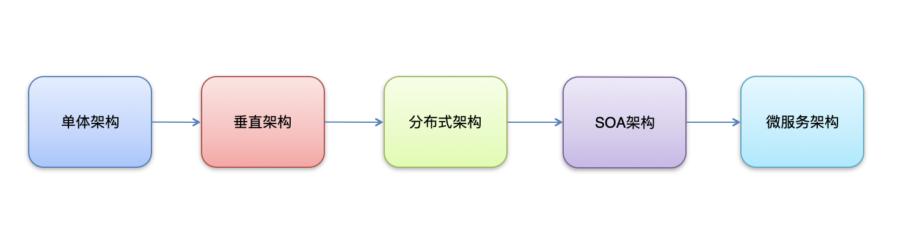

# 基础学习


## 一、基础知识

```
互联网项目特点：
用户多
流量大，并发高
海量数据
易受攻击
功能繁琐
变更快

大型互联网项目架构目标
高性能：提供快速的访问体验。
高可用：网站服务一直可以正常访问。
可伸缩：通过硬件增加/减少，提高/降低处理能力。
高可扩展：系统间耦合低，方便的通过新增/移除方式，增加/减少新的功能/模块。 
安全性：提供网站安全访问和数据加密，安全存储等策略。
敏捷性：随需应变，快速响应。

衡量网站的性能指标：
响应时间：指执行一个请求从开始到最后收到响应数据所花费的总体时间。
并发数：指系统同时能处理的请求数量。
并发连接数：指的是客户端向服务器发起请求，并建立了TCP连接。每秒钟服务器连接的总TCP数量
请求数：也称为QPS(Query Per Second) 指每秒多少请求.
并发用户数：单位时间内有多少用户
吞吐量：指单位时间内系统能处理的请求数量。
QPS：Query Per Second 每秒查询数。 
TPS：Transactions Per Second 每秒事务数。 
一个事务是指一个客户机向服务器发送请求然后服务器做出反应的过程。客户机在发送请求时开始计时，收到服务器响应后结束计时，以此来计算使用的时间和完成的事务个数。
一个页面的一次访问，只会形成一个TPS；但一次页面请求，可能产生多次对服务器的请求，就会有多个QPS
QPS >= 并发连接数 >= TPS


集群和分布式
集群：很多“人”一起 ，干一样的事。
	一个业务模块，部署在多台服务器上。 
分布式：很多“人”一起，干不一样的事。这些不一样的事，合起来是一件大事。
	一个大的业务系统，拆分为小的业务模块，分别部署在不同的机器上。 

```

> ```
> 架构演变
> ```
>
> 
>
> ```
> 架构演进--单体架构
> 优点：
> 简单：开发部署都很方便，小型项目首选
> 缺点：
> 项目启动慢
> 可靠性差
> 可伸缩性差
> 扩展性和可维护性差
> 性能低
> 
> 架构演进--垂直架构
> 垂直架构是指将单体架构中的多个模块拆分为多个独立的项目。形成多个独立的单体架构。
> 单体架构存在的问题：
> 项目启动慢
> 可靠性差
> 可伸缩性差
> 扩展性和可维护性差
> 性能低
> 
> 垂直架构存在的问题：
> 重复功能太多
> 
> 架构演进--分布式架构
> 分布式架构是指在垂直架构的基础上，将公共业务模块抽取出来，作为独立的服务，供其他调用者消费，以实现服务的共享和重用。
> RPC： Remote Procedure Call 远程过程调用。有非常多的协议和技术来都实现了RPC的过程。比如：HTTP REST风格，Java RMI规范、WebService SOAP协议、Hession等等。
> 
> 垂直架构存在的问题：
> 重复功能太多
> 
> 分布式架构存在的问题：
> 服务提供方一旦产生变更，所有消费方都需要变更。
> 
> 
> 架构演进--SOA架构
>  SOA：（Service-Oriented Architecture，面向服务的架构）是一个组件模型，它将应用程序的不同功能单元（称为服务）进行拆分，并通过这些服务之间定义良好的接口和契约联系起来。
> ESB：(Enterparise Servce Bus) 企业服务总线，服务中介。主要是提供了一个服务于服务之间的交互。ESB 包含的功能如：负载均衡，流量控制，加密处理，服务的监控，异常处理，监控告急等等。
> 分布式架构存在的问题：
> 服务提供方一旦产生变更，所有消费方都需要变更
> 
> 架构演进--微服务架构
> 微服务架构是在 SOA 上做的升华，微服务架构强调的一个重点是“业务需要彻底的组件化和服务化”，原有的单个业务系统会拆分为多个可以独立开发、设计、运行的小应用。这些小应用之间通过服务完成交互和集成。
> 微服务架构 = 80%的SOA服务架构思想 + 100%的组件化架构思想 + 80%的领域建模思想
> 特点：
> 服务实现组件化：开发者可以自由选择开发技术。也不需要协调其他团队
> 服务之间交互一般使用REST API
> 去中心化：每个微服务有自己私有的数据库持久化业务数据
> 自动化部署：把应用拆分成为一个一个独立的单个服务，方便自动化部署、测试、运维
> 
> ```
>
> 

**Dubbo** **高级特性**

1.**序列化**

**两个机器传输数据，如何传输Java对象？**

```
dubbo 内部已经将序列化和反序列化的过程内部封装了
我们只需要在定义pojo类时实现Serializable接口即可
一般会定义一个公共的pojo模块，让生产者和消费者都依赖该模块。
```

2.**地址缓存**

**注册中心挂了，服务是否可以正常访问？**

```
可以，因为dubbo服务消费者在第一次调用时，会将服务提供方地址缓存到本地，以后在调用则不会访问注册中心。
当服务提供者地址发生变化时，注册中心会通知服务消费者。
```

3.**超时与重试**

```
服务消费者在调用服务提供者的时候发生了阻塞、等待的情形，这个时候，服务消费者会一直等待下去。
在某个峰值时刻，大量的请求都在同时请求服务消费者，会造成线程的大量堆积，势必会造成雪崩。
dubbo 利用超时机制来解决这个问题，设置一个超时时间，在这个时间段内，无法完成服务访问，则自动断开连接。
使用timeout属性配置超时时间，默认值1000，单位毫秒。

设置了超时时间，在这个时间段内，无法完成服务访问，则自动断开连接。
如果出现网络抖动，则这一次请求就会失败。
Dubbo 提供重试机制来避免类似问题的发生。
通过 retries  属性来设置重试次数。默认为 2 次。
```

4.**多版本**

```
灰度发布：当出现新功能时，会让一部分用户先使用新功能，用户反馈没问题时，再将所有用户迁移到新功能。
dubbo 中使用version 属性来设置和调用同一个接口的不同版本
```

5.**负载均衡**

```
负载均衡策略（4种）：
Random ：按权重随机，默认值。按权重设置随机概率。
RoundRobin ：按权重轮询。
LeastActive：最少活跃调用数，相同活跃数的随机。
ConsistentHash：一致性 Hash，相同参数的请求总是发到同一提供者。
```

6.**集群容错**

```
集群容错模式：
Failover Cluster：失败重试。默认值。当出现失败，重试其它服务器 ，默认重试2次，使用 retries 配置。一般用于读操作
Failfast Cluster ：快速失败，只发起一次调用，失败立即报错。通常用于写操作。
Failsafe Cluster ：失败安全，出现异常时，直接忽略。返回一个空结果。
Failback Cluster ：失败自动恢复，后台记录失败请求，定时重发。通常用于消息通知操作。
Forking Cluster ：并行调用多个服务器，只要一个成功即返回。
Broadcast  Cluster ：广播调用所有提供者，逐个调用，任意一台报错则报错。

```

7.**服务降级**


## 二、dubbo-admin安装

**1、环境准备**

dubbo-admin 是一个前后端分离的项目。前端使用vue，后端使用springboot，安装 dubbo-admin 其实就是部署该项目。我们将dubbo-admin安装到开发环境上。要保证开发环境有jdk，maven，nodejs

安装node**(如果当前机器已经安装请忽略)**

因为前端工程是用vue开发的，所以需要安装node.js，node.js中自带了npm，后面我们会通过npm启动

下载地址

```
https://nodejs.org/en/
```


**2、下载 Dubbo-Admin**

进入github，搜索dubbo-admin

```
https://github.com/apache/dubbo-admin
```

下载：

**3、把下载的zip包解压到指定文件夹(解压到那个文件夹随意)**

**4、修改配置文件**

解压后我们进入`…\dubbo-admin-develop\dubbo-admin-server\src\main\resources`目录，找到 **application.properties** 配置文件 进行配置修改

```properties
# 设置zookeeper的地址、设置数据库的地址
# admin.registry.address注册中心
# admin.config-center 配置中心
# admin.metadata-report.address元数据中心

admin.registry.address=zookeeper://127.0.0.1:2181
admin.config-center=zookeeper://127.0.0.1:2181
admin.metadata-report.address=zookeeper://127.0.0.1:2181
spring.datasource.driver-class-name=com.mysql.jdbc.Driver
spring.datasource.url=jdbc:mysql://localhost:3307/dubbo-admin?characterEncoding=utf8&connectTimeout=1000&socketTimeout=10000&autoReconnect=true
spring.datasource.username=root
spring.datasource.password=123456
```

修改pom文件

```xml
<!--增加mysql依赖 -->
  <dependency>
            <groupId>com.mysql</groupId>
            <artifactId>mysql-connector-j</artifactId>
            <version>8.0.33</version>
        </dependency>

<!--设置dubbo的版本 -->
<dependency>
            <groupId>org.apache.zookeeper</groupId>
            <artifactId>zookeeper</artifactId>
            <version>3.8.0</version>
            <exclusions>
                <exclusion>
                    <groupId>org.slf4j</groupId>
                    <artifactId>slf4j-log4j12</artifactId>
                </exclusion>
                <exclusion>
                    <groupId>log4j</groupId>
                    <artifactId>log4j</artifactId>
                </exclusion>
            </exclusions>
        </dependency>
```


**5、打包项目**

在 dubbo-admin-develop 目录执行打包命令

```shell
mvn  clean package
```

**6、启动后端**

```shell
# 切换到目录
dubbo-Admin-develop\dubbo-admin-distribution\target>
# 执行下面的命令启动 dubbo-admin，dubbo-admin后台由SpringBoot构建。
java -jar .\dubbo-admin-0.1.jar
```

**7、前台后端**

dubbo-admin-ui 目录下执行命令

```shell
npm i
npm run dev
```

**8、访问**

浏览器输入。用户名密码都是root


