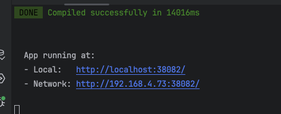
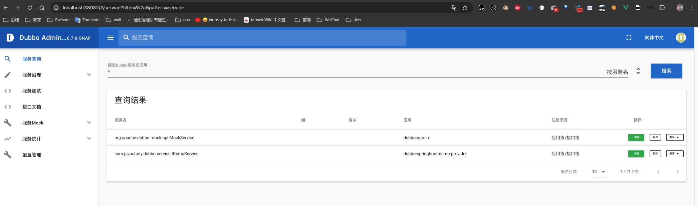

# 基础学习


## 一、dubbo-admin安装

**1、环境准备**

dubbo-admin 是一个前后端分离的项目。前端使用vue，后端使用springboot，安装 dubbo-admin 其实就是部署该项目。我们将dubbo-admin安装到开发环境上。要保证开发环境有jdk，maven，nodejs

安装node**(如果当前机器已经安装请忽略)**

因为前端工程是用vue开发的，所以需要安装node.js，node.js中自带了npm，后面我们会通过npm启动

下载地址

```
https://nodejs.org/en/
```


**2、下载 Dubbo-Admin**

进入github，搜索dubbo-admin

```
https://github.com/apache/dubbo-admin
```

下载：

**3、把下载的zip包解压到指定文件夹(解压到那个文件夹随意)**

**4、修改配置文件**

解压后我们进入…\dubbo-admin-develop\dubbo-admin-server\src\main\resources目录，找到 **application.properties** 配置文件 进行配置修改

```properties
# 设置zookeeper的地址、设置数据库的地址
# admin.registry.address注册中心
# admin.config-center 配置中心
# admin.metadata-report.address元数据中心

admin.registry.address=zookeeper://127.0.0.1:2181
admin.config-center=zookeeper://127.0.0.1:2181
admin.metadata-report.address=zookeeper://127.0.0.1:2181
spring.datasource.driver-class-name=com.mysql.jdbc.Driver
spring.datasource.url=jdbc:mysql://localhost:3307/dubbo-admin?characterEncoding=utf8&connectTimeout=1000&socketTimeout=10000&autoReconnect=true
spring.datasource.username=root
spring.datasource.password=123456
```

修改pom文件

```xml
<!--增加mysql依赖 -->
  <dependency>
            <groupId>com.mysql</groupId>
            <artifactId>mysql-connector-j</artifactId>
            <version>8.0.33</version>
        </dependency>

<!--设置dubbo的版本 -->
<dependency>
            <groupId>org.apache.zookeeper</groupId>
            <artifactId>zookeeper</artifactId>
            <version>3.8.0</version>
            <exclusions>
                <exclusion>
                    <groupId>org.slf4j</groupId>
                    <artifactId>slf4j-log4j12</artifactId>
                </exclusion>
                <exclusion>
                    <groupId>log4j</groupId>
                    <artifactId>log4j</artifactId>
                </exclusion>
            </exclusions>
        </dependency>
```


**5、打包项目**

在 dubbo-admin-develop 目录执行打包命令

```shell
mvn  clean package
```

**6、启动后端**

```shell
# 切换到目录
dubbo-Admin-develop\dubbo-admin-distribution\target>
# 执行下面的命令启动 dubbo-admin，dubbo-admin后台由SpringBoot构建。
java -jar .\dubbo-admin-0.1.jar
```

**7、前台后端**

dubbo-admin-ui 目录下执行命令

```shell
npm i
npm run dev
```

**8、访问**

浏览器输入。用户名密码都是root






