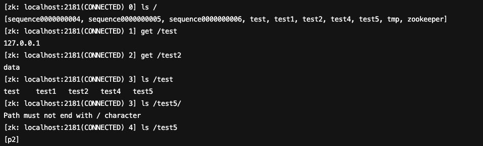
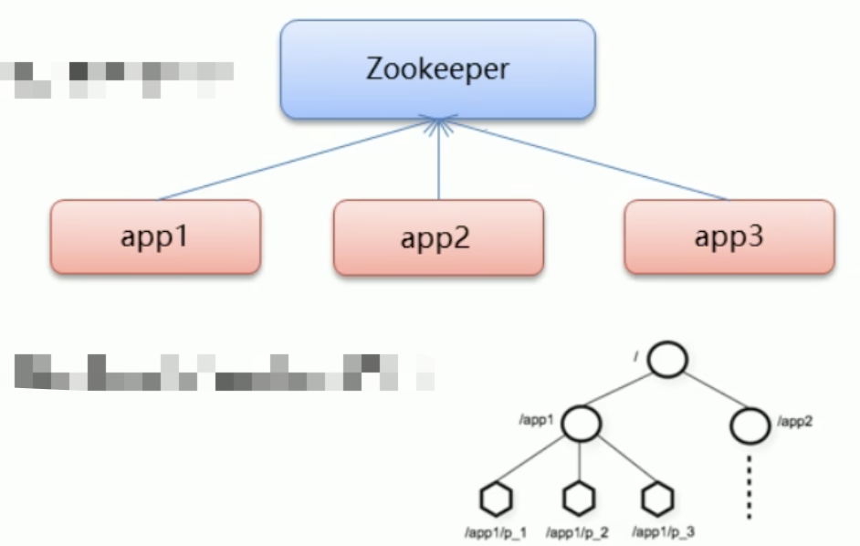

# 初识 Zookeeper

**Zookeeper 概念**

- Zookeeper是 Apache Hadoop项目下的一个子项目，是一个树形目录服务。
- Zookeeper翻译过来就是动物园管理员，他是用来管 Hadoop(大象)、Hive(蜜蜂)、Pig(小猪)的管理员。简称zk
- Zookeeper是一个分布式的、开源的分布式应用程序的**协调服务**。
- Zookeeper 提供的主要功能包括
  - 配置管理
  - 分布式锁
  - 集群管理

# ZooKeeper安装与配置

## 1.1 下载安装

**1、环境准备**

ZooKeeper服务器是用Java创建的，它运行在JVM之上。需要安装JDK 7或更高版本。

**2、上传**

将下载的ZooKeeper放到/opt/ZooKeeper目录下


**3、解压**

将tar包解压到/opt/zookeeper目录下

```shell
tar -zxvf apache-ZooKeeper-3.5.6-bin.tar.gz 
```

## 1.2 配置启动

**1、配置zoo.cfg**

进入到conf目录拷贝一个zoo_sample.cfg并完成配置

```shell
#进入到conf目录
cd /opt/zooKeeper/apache-zooKeeper-3.5.6-bin/conf/
#拷贝
cp  zoo_sample.cfg  zoo.cfg
```

修改zoo.cfg

```shell
#打开目录
cd /opt/zooKeeper/
#创建zooKeeper存储目录
mkdir  zkdata
#修改zoo.cfg
vim /opt/zooKeeper/apache-zooKeeper-3.5.6-bin/conf/zoo.cfg
```

修改data的位置：**dataDir=/opt/ZooKeeper/zkdata**


**2、启动ZooKeeper**

```shell
cd /opt/zooKeeper/apache-zooKeeper-3.5.6-bin/bin/
#启动
 ./zkServer.sh  start
```


看到上图表示ZooKeeper成功启动。

**3、查看ZooKeeper状态**

```shell
./zkServer.sh status
```

zookeeper启动成功。standalone代表zk没有搭建集群，现在是单节点


# ZooKeeper 命令操作

## 1.1 Zookeeper 数据模型

- ZooKeeper 是一个树形目录服务,其数据模型和Unix的文件系统目录树很类似，拥有一个层次化结构

- 这里面的每一个节点都被称为:ZNode，每个节点上都会保存自己的数据和节点信息

- 节点可以拥有子节点，同时也允许少量(1MB)数据存储在该节点之下。

- 节点可以分为四大类:

  - PERSISTENT 持久化节点
  - EPHEMERAL临时节点:-e
  - PERSISTENT SEQUENTIAL持久化顺序节点:-s
  - EPHEMERAL SEQUENTIAL临时顺序节点 :-es

  下方左侧🫲为文件系统树形结构图，右边👉为ZK节点图


## 1.2 Zookeeper 服务端常用命令

```shell
# 查看状态
sh zkServer.sh status
# 重启服务
./zkServer.sh restart
# 停止服务
sh zkServer.sh  stop
# 启动服务
sh zkServer.sh  start
```


## 1.3 Zookeeper 客户端常用命令

> 客户端分为Zookeeper自带点client，还有使用Java API的客户端

**常见命令**

连接

```shell
# 连接ZooKeeper服务端 ./zkCli.sh -server ip:port
./zkCli.sh -server localhost:2181
# 如果是连接本机的zk服务端 
./zkCli.sh -server
```


退出

```shell
# 退出
quit
```

```shell
# 查看命令帮助
help
```


```shell
# 显示指定目录下节点
ls /
```


```shell
# 创建节点 不设置值 默认是持久Node
create /dubbo
# 创建节点 设置值
create /dubbo1 datadata
```


```shell
# 获取节点值
get /dubbo1
```


```shell
# 设置节点值
set /dubbo dubbodata
```


```shell
# 删除单个节点
delete /dubbo1
# 删除带有子节点的节点
deleteall /dubbo
```


创建节点

```shell
# 创建临时节点 控制台一关闭就会消失
create -e /tmp
# 创建顺序节点 顺序会递增
create -s /sequence
```


```shell
# 查询节点详细信息
ls -s /zookeeper
```


```
czxid:节点被创建的事务ID
ctime: 创建时间
mzxid:最后一次被更新的事务ID
mtime: 修改时间
dataversion:数据版本号
aclversion:权限版本号
ephemeralOwner:用于临时节点，代表临时节点的事务ID，如果为持久节点则为0
pzxid:子节点列表最后一次被更新的事务IDdataLength:节点存储的数据的长度
cversion:子节点的版本号
numChildren:当前节点的子节点个数
```

# ZooKeeperJavaAPI操作


## 1.1 Curator介绍

- Curator是 Apache ZooKeeper 的Java客户端库。
- 常见的ZooKeeper Java APl :
  - 原生Java API
  - ZkClient
  - Curator
- Curator 项目的目标是简化ZodXeeper 客户端的使用。
- Curator 最初是 Netfix 研发的,后来捐献了 Apache基金会,目前是Apache 的顶级项目。
- 官网:https://curator.apache.org


## 1.2 ZooKeeper JavaAPI 操作


增加maven依赖

```xml
<dependency>
            <groupId>org.apache.curator</groupId>
            <artifactId>curator-framework</artifactId>
            <version>4.0.0</version>
        </dependency>
        <dependency>
            <groupId>org.apache.curator</groupId>
            <artifactId>curator-recipes</artifactId>
            <version>4.0.0</version>
        </dependency>
```


**Curator API 常用操作**

- **建立连接**

  > ```java
  > @Test
  >     public void connectTest() {
  >         // 方式1
  >         CuratorFramework curatorFramework = CuratorFrameworkFactory.builder()
  >                 // 连接字符串
  >                 .connectString("43.142.181.163:2181")
  >                 // 连接超时时间
  >                 .connectionTimeoutMs(10 * 1000)
  >                 // 会话超时时间
  >                 .sessionTimeoutMs(15 * 1000)
  >                 // 重试策略
  >                 .retryPolicy(new RetryForever(10 * 1000))
  >                 // 自动帮你在此节点下对节点进行crud
  >                 .namespace("JackNamespace")
  >                 .build();
  >         // 方式2
  >         CuratorFramework client = CuratorFrameworkFactory.newClient("43.142.181.163:2181", 60000, 15000, new RetryForever(10 * 1000));
  >         // 开启连接
  >         client.start();
  >     }
  > ```

- **添加节点**

  > ```java
  > @Test
  >     public void createTest() throws Exception {
  >         CuratorFramework curatorFramework = CuratorFrameworkFactory.newClient("43.142.181.163:2181", 60000, 15000, new RetryForever(10 * 1000));
  >         // 开启连接
  >         curatorFramework.start();
  >         // 1.基本创建 默认数据是client的IP地址
  >         String s = curatorFramework.create().forPath("/test");
  >         System.out.println(s);
  >         // 2.创建节点 带有数据
  >         curatorFramework.create().forPath("/test1", "data".getBytes());
  >         // 3.设置节点的类型 withMode 是个枚举类型
  >         /* PERSISTENT(0, false, false, false, false),
  >         PERSISTENT_SEQUENTIAL(2, false, true, false, false),
  >         EPHEMERAL(1, true, false, false, false),
  >         EPHEMERAL_SEQUENTIAL(3, true, true, false, false),
  >         CONTAINER(4, false, false, true, false),
  >         PERSISTENT_WITH_TTL(5, false, false, false, true),
  >         PERSISTENT_SEQUENTIAL_WITH_TTL(6, false, true, false, true);*/
  >         curatorFramework.create().withMode(CreateMode.CONTAINER).forPath("/test2", "data".getBytes());
  >         curatorFramework.create().withMode(CreateMode.EPHEMERAL).forPath("/test3", "data".getBytes());
  >         // 4. 创建多级节点 / app1 / p1
  >         curatorFramework.create().creatingParentsIfNeeded().forPath("/test4/p1/p3", "data".getBytes());
  >         curatorFramework.create().creatingParentContainersIfNeeded().forPath("/test5/p2/p3", "data".getBytes());
  >         // 关闭连接
  >         curatorFramework.close();
  >     }
  > ```
  >
  > 

- **删除节点**

  > ```java
  > @Test
  >     public void deleteTest() throws Exception {
  >         CuratorFramework curatorFramework = CuratorFrameworkFactory.newClient("43.142.181.163:2181", 60000, 15000, new RetryForever(10 * 1000));
  >         // 开启连接
  >         curatorFramework.start();
  >         // 递归删除
  >         Void unused = curatorFramework.delete().deletingChildrenIfNeeded().forPath("/test4");
  >         System.out.println(unused);
  >         // 删除单个节点
  >         curatorFramework.delete().forPath("/test2");
  >       	// 必须删除成功 防止网络抖动等
  >         curatorFramework.delete().guaranteed().forPath("/test1");
  >      	 // 删除回掉
  >         curatorFramework.delete().inBackground(new BackgroundCallback() {
  >             @Override
  >             public void processResult(CuratorFramework curatorFramework, CuratorEvent curatorEvent) throws Exception {
  >                 System.out.println("数据删除");
  >                 int resultCode = curatorEvent.getResultCode();
  >                 if (resultCode == 200) {
  >                     // 删除成功 做干嘛
  >                 }
  >             }
  >         }).forPath("/test1");
  >         // 关闭连接
  >         curatorFramework.close();
  >     }
  > ```
  >
  > 

- **修改节点**

  > ```java
  >  @Test
  >     public void updateNodeTest() throws Exception {
  >         CuratorFramework curatorFramework = CuratorFrameworkFactory.newClient("43.142.181.163:2181", 60000, 15000, new RetryForever(10 * 1000));
  >         // 开启连接
  >         curatorFramework.start();
  >         // 修改数据
  >         curatorFramework.setData().forPath("/test1", "update".getBytes());
  >         // 根据版本修改 防止多线程修改 根据版本号（通过查询出来的）去修改，每次修改后，版本就是会增加1 （为了原子性操作）
  >         Stat stat = new Stat();
  >         curatorFramework.getData().storingStatIn(stat).forPath("/test1");
  >         curatorFramework.setData().withVersion(stat.getVersion()).forPath("/test1", "update1".getBytes());
  >         // 关闭连接
  >         curatorFramework.close();
  >     }
  > ```

- **查询节点**

  > ```java
  > /**
  >      * <p> 查询节点:
  >      * 1.查询数据:get
  >      * 2.查询子节点: ls
  >      * 3.查询节点状态信息:ls-s
  >      * <p>
  >      *
  >      * @author JackGao
  >      * @since 4/1/24 15:44
  >      */
  >     @Test
  >     public void getNodeTest() throws Exception {
  >         CuratorFramework curatorFramework = CuratorFrameworkFactory.newClient("43.142.181.163:2181", 60000, 15000, new RetryForever(10 * 1000));
  >         // 开启连接
  >         curatorFramework.start();
  >         // 获取节点数据 get 
  >         byte[] bytes = curatorFramework.getData().forPath("/test1");
  >         System.err.println(new String(bytes));
  >         // 根据路径获取子节点 ls
  >         List<String> strings = curatorFramework.getChildren().forPath("/");
  >         System.err.println(strings);
  >         // 节点状态信息 ls -s
  >         Stat stat = new Stat();
  >         byte[] bytes1 = curatorFramework.getData().storingStatIn(stat).forPath("/test1");
  >         System.err.println(stat);
  >         System.err.println("bytes1" + new String(bytes1));
  >         // 关闭连接
  >         curatorFramework.close();
  >     }
  > ```

- **Watch事件监听**

  > TODO

- **分布式锁实现**

  > ```java
  > InterProcessMutex lock = new InterProcessMutex(client, lockPath);
  > if (lock.acquire(maxWait, waitUnit)) {
  >     try {
  >         // do some work inside of the critical section here
  >     } finally {
  >         lock.release();
  >     }
  > }
  > ```

### 1.2.1 Curator API 常用操作-Watch事件监听

- ZooKeeper 允许用户在指定节点上注册一些Watcher，并且在一些特定事件触发的时候，ZooKeeper 服务端会将事件通知到感兴趣的客户端上去，该机制是ZooKeeper实现分布式协调服务的重要特性。

- ZooKeeper 中引入了Watcher机制来实现了发布/订阅功能能，能够让多个订阅者同时监听某一个对象，当一个对象自身状态变化时，会通知所有订阅者。

- ZooKeeper 原生支持通过注册Watcher来进行事件监听，但是其使用并不是特别方便需要开发人员自己反复注册Watcher，比较繁琐。

- Curator引|入了 Cache 来实现对 ZooKeeper 服务端事件的监听。

- ZooKeeper提供了三种Watcher:
  - **NodeCache**:只是监听某一个特定的节点
  
    > ```java
    > @Test
    >     public void watchNodeTest() throws Exception {
    >         CuratorFramework curatorFramework = CuratorFrameworkFactory.newClient("43.142.181.163:2181", 60000, 15000, new RetryForever(10 * 1000));
    >         // 开启连接
    >         curatorFramework.start();
    >         NodeCache nodeCache = new NodeCache(curatorFramework, "/test002");
    >         nodeCache.getListenable().addListener(new NodeCacheListener() {
    >             @Override
    >             public void nodeChanged() throws Exception {
    >                 System.out.println("节点变化");
    >                 byte[] data = nodeCache.getCurrentData().getData();
    >                 System.out.println("变化后的数据为：" + new String(data));
    >             }
    >         });
    >         // //3.开启监听.如果设置为true，则开启监听是，加载缓冲数据
    >         nodeCache.start(true);
    >         while (true) {
    > 
    >         }
    >         // 关闭连接
    > //        curatorFramework.close();
    >     }
    > ```
  
  - **PathChildrenCache**:监控一个ZNode的子节点
  
    > ```java
    > @Test
    >     public void watchChildNodeTest() throws Exception {
    >         CuratorFramework curatorFramework = CuratorFrameworkFactory.newClient("43.142.181.163:2181", 60000, 15000, new RetryForever(10 * 1000));
    >         // 开启连接
    >         curatorFramework.start();
    >         // 创建
    >         PathChildrenCache pathChildrenCache = new PathChildrenCache(curatorFramework, "/test1", true);
    >         // 增加监听
    >         pathChildrenCache.getListenable().addListener(new PathChildrenCacheListener() {
    >             @Override
    >             public void childEvent(CuratorFramework curatorFramework, PathChildrenCacheEvent pathChildrenCacheEvent) throws Exception {
    >                 System.out.println("节点变化");
    >                 List<ChildData> currentData = pathChildrenCache.getCurrentData();
    >                 System.out.println("变化后的数据为：" + currentData.toString());
    >                 System.out.println("event：" + pathChildrenCacheEvent.toString());
    >                 PathChildrenCacheEvent.Type type = pathChildrenCacheEvent.getType();
    >                 if (type.equals(PathChildrenCacheEvent.Type.CHILD_UPDATED)) {
    >                     System.out.println("子节点数据更新了");
    >                 }
    >             }
    >         });
    > 
    >         // //3.开启监听.如果设置为true，则开启监听是，加载缓冲数据
    >         pathChildrenCache.start();
    >         while (true) {
    > 
    >         }
    >         // 关闭连接
    > //        curatorFramework.close();
    >     }
    > ```
    >
    > 
  
  - TreeCache:可以监控整个树上的所有节点，类似于PathChildrenCache和NodeCache的组合
  
    > ```java
    >    @Test
    >     public void watchTreeAndChildNodeTest() throws Exception {
    >         CuratorFramework curatorFramework = CuratorFrameworkFactory.newClient("43.142.181.163:2181", 60000, 15000, new RetryForever(10 * 1000));
    >         // 开启连接
    >         curatorFramework.start();
    >         // 创建
    >         TreeCache treeCache = new TreeCache(curatorFramework, "/");
    >         // 增加监听
    >         treeCache.getListenable().addListener(new TreeCacheListener() {
    >             @Override
    >             public void childEvent(CuratorFramework curatorFramework, TreeCacheEvent treeCacheEvent) throws Exception {
    >                 System.out.println("节点变化");
    >                 ChildData currentData = treeCache.getCurrentData("/");
    >                 System.out.println("变化后的数据为：" + currentData.toString());
    >                 System.out.println("event：" + treeCacheEvent.toString());
    >             }
    >         });
    >         // 3.开启监听.如果设置为true，则开启监听是，加载缓冲数据
    >         treeCache.start();
    >         while (true) {
    > 
    >         }
    >         // 关闭连接
    > //        curatorFramework.close();
    >     }
    > 
    > ```
    >
    > 


# ZooKeeper集群搭建

# Zookeeper核心理论
