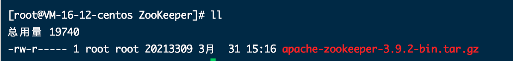
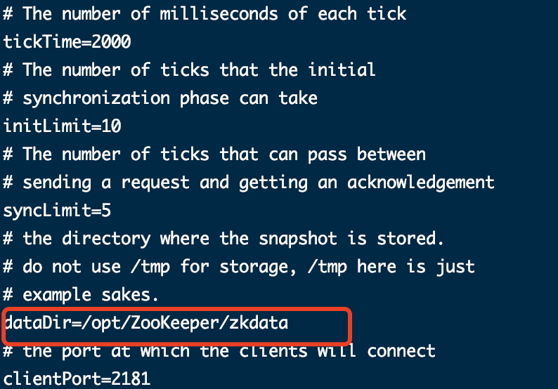
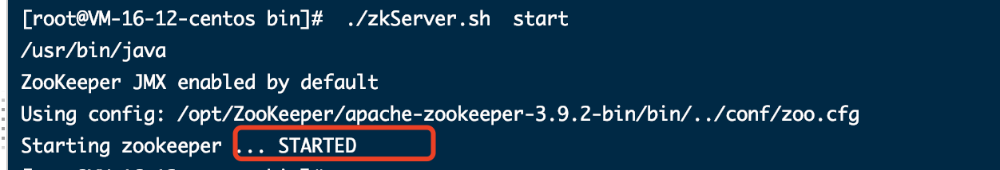
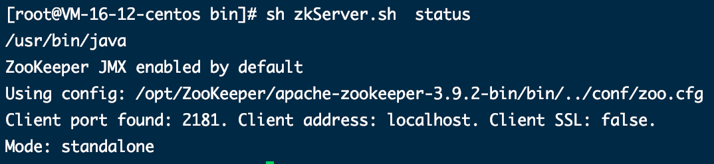

# 初识 Zookeeper

**Zookeeper 概念**

- Zookeeper是 Apache Hadoop项目下的一个子项目，是一个树形目录服务。
- Zookeeper翻译过来就是动物园管理员，他是用来管 Hadoop(大象)、Hive(蜜蜂)、Pig(小猪)的管理员。简称zk
- Zookeeper是一个分布式的、开源的分布式应用程序的**协调服务**。
- Zookeeper 提供的主要功能包括
  - 配置管理
  - 分布式锁
  - 集群管理

# ZooKeeper安装与配置

## 1.1 下载安装

**1、环境准备**

ZooKeeper服务器是用Java创建的，它运行在JVM之上。需要安装JDK 7或更高版本。

**2、上传**

将下载的ZooKeeper放到/opt/ZooKeeper目录下



**3、解压**

将tar包解压到/opt/zookeeper目录下

```shell
tar -zxvf apache-ZooKeeper-3.5.6-bin.tar.gz 
```

## 1.2 配置启动

**1、配置zoo.cfg**

进入到conf目录拷贝一个zoo_sample.cfg并完成配置

```shell
#进入到conf目录
cd /opt/zooKeeper/apache-zooKeeper-3.5.6-bin/conf/
#拷贝
cp  zoo_sample.cfg  zoo.cfg
```

修改zoo.cfg

```shell
#打开目录
cd /opt/zooKeeper/
#创建zooKeeper存储目录
mkdir  zkdata
#修改zoo.cfg
vim /opt/zooKeeper/apache-zooKeeper-3.5.6-bin/conf/zoo.cfg
```

修改data的位置：**dataDir=/opt/ZooKeeper/zkdata**



**2、启动ZooKeeper**

```shell
cd /opt/zooKeeper/apache-zooKeeper-3.5.6-bin/bin/
#启动
 ./zkServer.sh  start
```



看到上图表示ZooKeeper成功启动。

**3、查看ZooKeeper状态**

```shell
./zkServer.sh status
```

zookeeper启动成功。standalone代表zk没有搭建集群，现在是单节点




# ZooKeeper 命令操作

# ZooKeeperJavaAPI操作

# ZooKeeper集群搭建

# Zookeeper核心理论
