# 初识 Zookeeper

**Zookeeper 概念**

- Zookeeper是 Apache Hadoop项目下的一个子项目，是一个树形目录服务。
- Zookeeper翻译过来就是动物园管理员，他是用来管 Hadoop(大象)、Hive(蜜蜂)、Pig(小猪)的管理员。简称zk
- Zookeeper是一个分布式的、开源的分布式应用程序的**协调服务**。
- Zookeeper 提供的主要功能包括
  - 配置管理
  - 分布式锁
  - 集群管理

# ZooKeeper安装与配置

## 1.1 下载安装

**1、环境准备**

ZooKeeper服务器是用Java创建的，它运行在JVM之上。需要安装JDK 7或更高版本。

**2、上传**

将下载的ZooKeeper放到/opt/ZooKeeper目录下


**3、解压**

将tar包解压到/opt/zookeeper目录下

```shell
tar -zxvf apache-ZooKeeper-3.5.6-bin.tar.gz 
```

## 1.2 配置启动

**1、配置zoo.cfg**

进入到conf目录拷贝一个zoo_sample.cfg并完成配置

```shell
#进入到conf目录
cd /opt/zooKeeper/apache-zooKeeper-3.5.6-bin/conf/
#拷贝
cp  zoo_sample.cfg  zoo.cfg
```

修改zoo.cfg

```shell
#打开目录
cd /opt/zooKeeper/
#创建zooKeeper存储目录
mkdir  zkdata
#修改zoo.cfg
vim /opt/zooKeeper/apache-zooKeeper-3.5.6-bin/conf/zoo.cfg
```

修改data的位置：**dataDir=/opt/ZooKeeper/zkdata**


**2、启动ZooKeeper**

```shell
cd /opt/zooKeeper/apache-zooKeeper-3.5.6-bin/bin/
#启动
 ./zkServer.sh  start
```


看到上图表示ZooKeeper成功启动。

**3、查看ZooKeeper状态**

```shell
./zkServer.sh status
```

zookeeper启动成功。standalone代表zk没有搭建集群，现在是单节点


# ZooKeeper 命令操作

## 1.1 Zookeeper 数据模型

- ZooKeeper 是一个树形目录服务,其数据模型和Unix的文件系统目录树很类似，拥有一个层次化结构

- 这里面的每一个节点都被称为:ZNode，每个节点上都会保存自己的数据和节点信息

- 节点可以拥有子节点，同时也允许少量(1MB)数据存储在该节点之下。

- 节点可以分为四大类:

  - PERSISTENT 持久化节点
  - EPHEMERAL临时节点:-e
  - PERSISTENT SEQUENTIAL持久化顺序节点:-s
  - EPHEMERAL SEQUENTIAL临时顺序节点 :-es

  下方左侧🫲为文件系统树形结构图，右边👉为ZK节点图

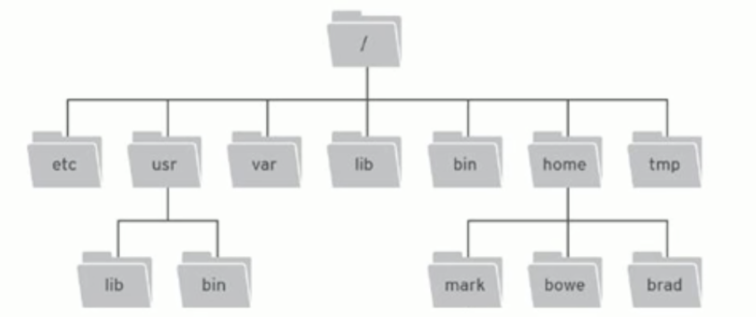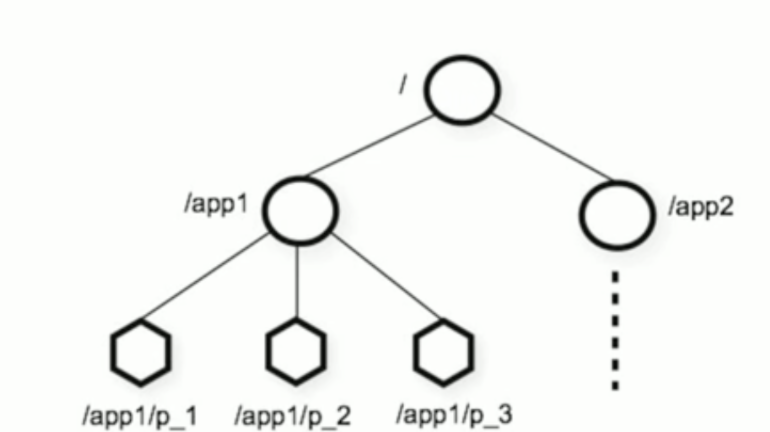


## 1.2 Zookeeper 服务端常用命令

```shell
# 查看状态
sh zkServer.sh status
# 重启服务
./zkServer.sh restart
# 停止服务
sh zkServer.sh  stop
# 启动服务
sh zkServer.sh  start
```

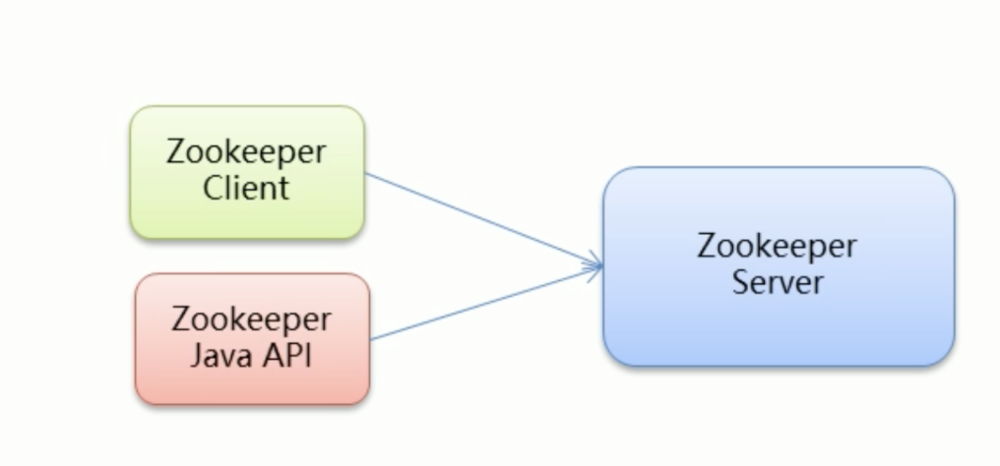

## 1.3 Zookeeper 客户端常用命令

> 客户端分为Zookeeper自带点client，还有使用Java API的客户端

**常见命令**

连接

```shell
# 连接ZooKeeper服务端 ./zkCli.sh -server ip:port
./zkCli.sh -server localhost:2181
# 如果是连接本机的zk服务端 
./zkCli.sh -server
```

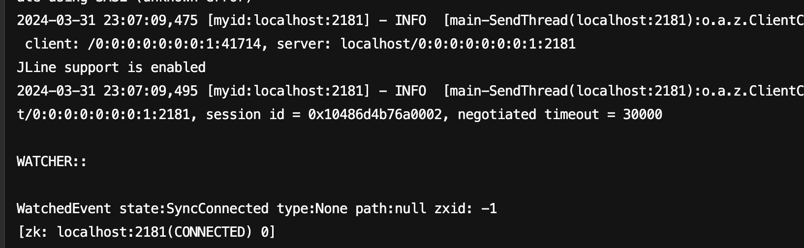

退出

```shell
# 退出
quit
```

```shell
# 查看命令帮助
help
```

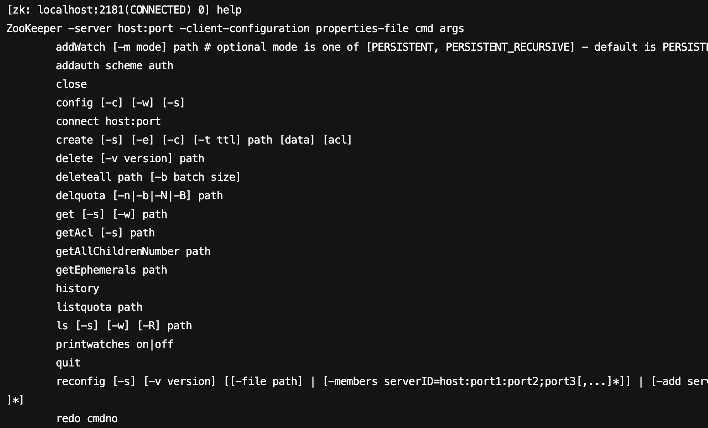

```shell
# 显示指定目录下节点
ls /
```

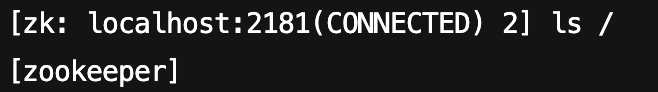

```shell
# 创建节点 不设置值 默认是持久Node
create /dubbo
# 创建节点 设置值
create /dubbo1 datadata
```

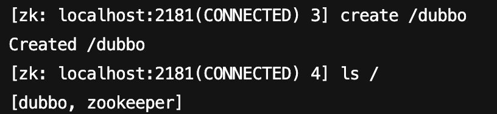

```shell
# 获取节点值
get /dubbo1
```

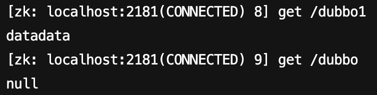

```shell
# 设置节点值
set /dubbo dubbodata
```

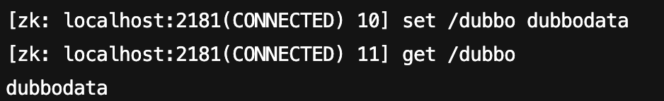

```shell
# 删除单个节点
delete /dubbo1
# 删除带有子节点的节点
deleteall /dubbo
```

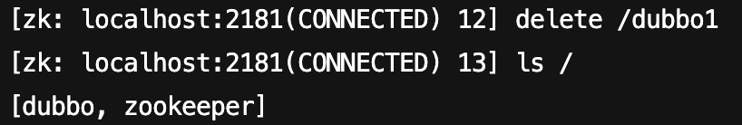

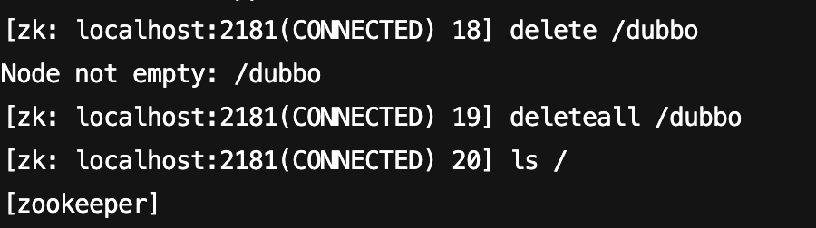

创建节点

```shell
# 创建临时节点 控制台一关闭就会消失
create -e /tmp
# 创建顺序节点 顺序会递增
create -s /sequence
```

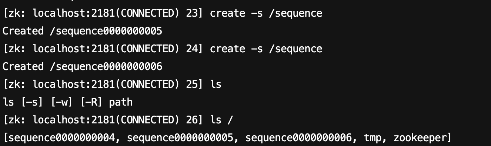


```shell
# 查询节点详细信息
ls -s /zookeeper
```

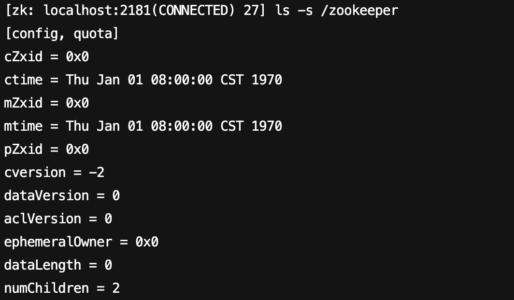

```
czxid:节点被创建的事务ID
ctime: 创建时间
mzxid:最后一次被更新的事务ID
mtime: 修改时间
dataversion:数据版本号
aclversion:权限版本号
ephemeralOwner:用于临时节点，代表临时节点的事务ID，如果为持久节点则为0
pzxid:子节点列表最后一次被更新的事务IDdataLength:节点存储的数据的长度
cversion:子节点的版本号
numChildren:当前节点的子节点个数
```


# ZooKeeperJavaAPI操作

# ZooKeeper集群搭建

# Zookeeper核心理论
