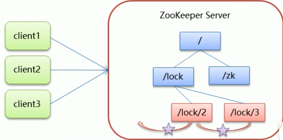
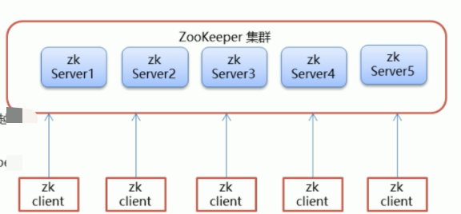
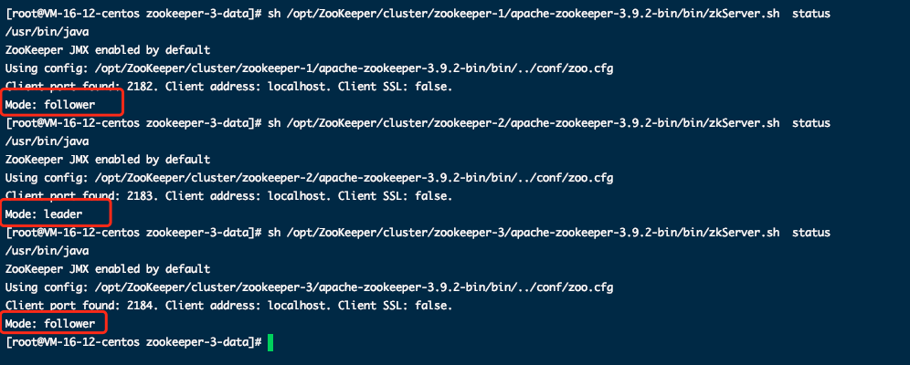
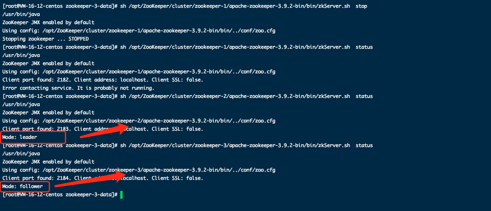
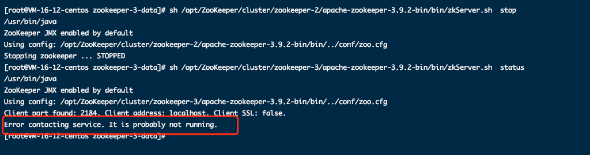
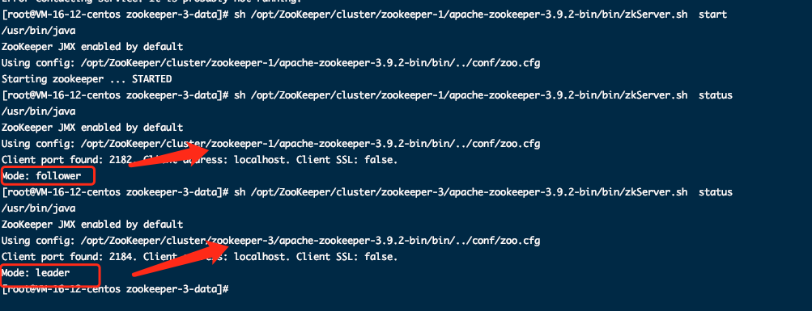
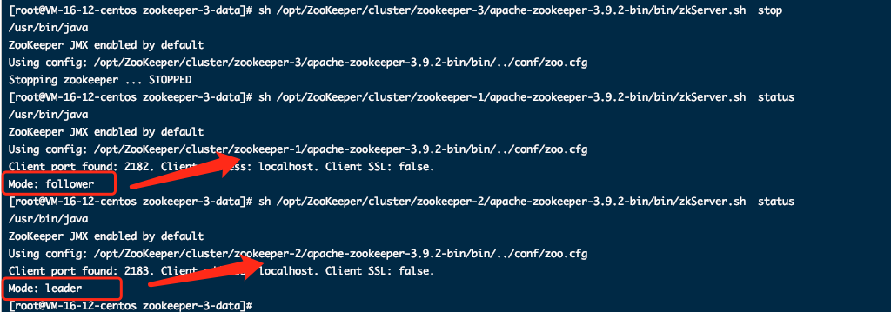
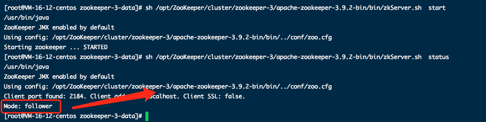
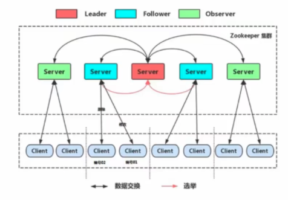

# 初识 Zookeeper

**Zookeeper 概念**

- Zookeeper是 Apache Hadoop项目下的一个子项目，是一个树形目录服务。
- Zookeeper翻译过来就是动物园管理员，他是用来管 Hadoop(大象)、Hive(蜜蜂)、Pig(小猪)的管理员。简称zk
- Zookeeper是一个分布式的、开源的分布式应用程序的**协调服务**。
- Zookeeper 提供的主要功能包括
  - 配置管理
  - 分布式锁
  - 集群管理

# ZooKeeper安装与配置

## 1.1 下载安装

**1、环境准备**

ZooKeeper服务器是用Java创建的，它运行在JVM之上。需要安装JDK 7或更高版本。

**2、上传**

将下载的ZooKeeper放到/opt/ZooKeeper目录下


**3、解压**

将tar包解压到/opt/zookeeper目录下

```shell
tar -zxvf apache-ZooKeeper-3.5.6-bin.tar.gz 
```

## 1.2 配置启动

**1、配置zoo.cfg**

进入到conf目录拷贝一个zoo_sample.cfg并完成配置

```shell
#进入到conf目录
cd /opt/zooKeeper/apache-zooKeeper-3.5.6-bin/conf/
#拷贝
cp  zoo_sample.cfg  zoo.cfg
```

修改zoo.cfg

```shell
#打开目录
cd /opt/zooKeeper/
#创建zooKeeper存储目录
mkdir  zkdata
#修改zoo.cfg
vim /opt/zooKeeper/apache-zooKeeper-3.5.6-bin/conf/zoo.cfg
```

修改data的位置：**dataDir=/opt/ZooKeeper/zkdata**


**2、启动ZooKeeper**

```shell
cd /opt/zooKeeper/apache-zooKeeper-3.5.6-bin/bin/
#启动
 ./zkServer.sh  start
```


看到上图表示ZooKeeper成功启动。

**3、查看ZooKeeper状态**

```shell
./zkServer.sh status
```

zookeeper启动成功。standalone代表zk没有搭建集群，现在是单节点


# ZooKeeper 命令操作

## 1.1 Zookeeper 数据模型

- ZooKeeper 是一个树形目录服务,其数据模型和Unix的文件系统目录树很类似，拥有一个层次化结构

- 这里面的每一个节点都被称为:ZNode，每个节点上都会保存自己的数据和节点信息

- 节点可以拥有子节点，同时也允许少量(1MB)数据存储在该节点之下。

- 节点可以分为四大类:

  - PERSISTENT 持久化节点
  - EPHEMERAL临时节点:-e
  - PERSISTENT SEQUENTIAL持久化顺序节点:-s
  - EPHEMERAL SEQUENTIAL临时顺序节点 :-es

  下方左侧🫲为文件系统树形结构图，右边👉为ZK节点图


## 1.2 Zookeeper 服务端常用命令

```shell
# 查看状态
sh zkServer.sh status
# 重启服务
./zkServer.sh restart
# 停止服务
sh zkServer.sh  stop
# 启动服务
sh zkServer.sh  start
```


## 1.3 Zookeeper 客户端常用命令

> 客户端分为Zookeeper自带点client，还有使用Java API的客户端

**常见命令**

连接

```shell
# 连接ZooKeeper服务端 ./zkCli.sh -server ip:port
./zkCli.sh -server localhost:2181
# 如果是连接本机的zk服务端 
./zkCli.sh -server
```


退出

```shell
# 退出
quit
```

```shell
# 查看命令帮助
help
```


```shell
# 显示指定目录下节点
ls /
```


```shell
# 创建节点 不设置值 默认是持久Node
create /dubbo
# 创建节点 设置值
create /dubbo1 datadata
```


```shell
# 获取节点值
get /dubbo1
```


```shell
# 设置节点值
set /dubbo dubbodata
```


```shell
# 删除单个节点
delete /dubbo1
# 删除带有子节点的节点
deleteall /dubbo
```


创建节点

```shell
# 创建临时节点 控制台一关闭就会消失
create -e /tmp
# 创建顺序节点 顺序会递增
create -s /sequence
```


```shell
# 查询节点详细信息
ls -s /zookeeper
```


```
czxid:节点被创建的事务ID
ctime: 创建时间
mzxid:最后一次被更新的事务ID
mtime: 修改时间
dataversion:数据版本号
aclversion:权限版本号
ephemeralOwner:用于临时节点，代表临时节点的事务ID，如果为持久节点则为0
pzxid:子节点列表最后一次被更新的事务IDdataLength:节点存储的数据的长度
cversion:子节点的版本号
numChildren:当前节点的子节点个数
```

# ZooKeeperJavaAPI操作

## 1.1 Curator介绍

- Curator是 Apache ZooKeeper 的Java客户端库。
- 常见的ZooKeeper Java APl :
  - 原生Java API
  - ZkClient
  - Curator
- Curator 项目的目标是简化ZodXeeper 客户端的使用。
- Curator 最初是 Netfix 研发的,后来捐献了 Apache基金会,目前是Apache 的顶级项目。
- 官网:https://curator.apache.org


## 1.2 ZooKeeper JavaAPI 操作


增加maven依赖

```xml
<dependency>
            <groupId>org.apache.curator</groupId>
            <artifactId>curator-framework</artifactId>
            <version>4.0.0</version>
        </dependency>
        <dependency>
            <groupId>org.apache.curator</groupId>
            <artifactId>curator-recipes</artifactId>
            <version>4.0.0</version>
        </dependency>
```


**Curator API 常用操作**

- **建立连接**

  > ```java
  > @Test
  >     public void connectTest() {
  >         // 方式1
  >         CuratorFramework curatorFramework = CuratorFrameworkFactory.builder()
  >                 // 连接字符串
  >                 .connectString("43.142.181.163:2181")
  >                 // 连接超时时间
  >                 .connectionTimeoutMs(10 * 1000)
  >                 // 会话超时时间
  >                 .sessionTimeoutMs(15 * 1000)
  >                 // 重试策略
  >                 .retryPolicy(new RetryForever(10 * 1000))
  >                 // 自动帮你在此节点下对节点进行crud
  >                 .namespace("JackNamespace")
  >                 .build();
  >         // 方式2
  >         CuratorFramework client = CuratorFrameworkFactory.newClient("43.142.181.163:2181", 60000, 15000, new RetryForever(10 * 1000));
  >         // 开启连接
  >         client.start();
  >     }
  > ```

- **添加节点**

  > ```java
  > @Test
  >     public void createTest() throws Exception {
  >         CuratorFramework curatorFramework = CuratorFrameworkFactory.newClient("43.142.181.163:2181", 60000, 15000, new RetryForever(10 * 1000));
  >         // 开启连接
  >         curatorFramework.start();
  >         // 1.基本创建 默认数据是client的IP地址
  >         String s = curatorFramework.create().forPath("/test");
  >         System.out.println(s);
  >         // 2.创建节点 带有数据
  >         curatorFramework.create().forPath("/test1", "data".getBytes());
  >         // 3.设置节点的类型 withMode 是个枚举类型
  >         /* PERSISTENT(0, false, false, false, false),
  >         PERSISTENT_SEQUENTIAL(2, false, true, false, false),
  >         EPHEMERAL(1, true, false, false, false),
  >         EPHEMERAL_SEQUENTIAL(3, true, true, false, false),
  >         CONTAINER(4, false, false, true, false),
  >         PERSISTENT_WITH_TTL(5, false, false, false, true),
  >         PERSISTENT_SEQUENTIAL_WITH_TTL(6, false, true, false, true);*/
  >         curatorFramework.create().withMode(CreateMode.CONTAINER).forPath("/test2", "data".getBytes());
  >         curatorFramework.create().withMode(CreateMode.EPHEMERAL).forPath("/test3", "data".getBytes());
  >         // 4. 创建多级节点 / app1 / p1
  >         curatorFramework.create().creatingParentsIfNeeded().forPath("/test4/p1/p3", "data".getBytes());
  >         curatorFramework.create().creatingParentContainersIfNeeded().forPath("/test5/p2/p3", "data".getBytes());
  >         // 关闭连接
  >         curatorFramework.close();
  >     }
  > ```
  >
  > 

- **删除节点**

  > ```java
  > @Test
  >     public void deleteTest() throws Exception {
  >         CuratorFramework curatorFramework = CuratorFrameworkFactory.newClient("43.142.181.163:2181", 60000, 15000, new RetryForever(10 * 1000));
  >         // 开启连接
  >         curatorFramework.start();
  >         // 递归删除
  >         Void unused = curatorFramework.delete().deletingChildrenIfNeeded().forPath("/test4");
  >         System.out.println(unused);
  >         // 删除单个节点
  >         curatorFramework.delete().forPath("/test2");
  >       	// 必须删除成功 防止网络抖动等
  >         curatorFramework.delete().guaranteed().forPath("/test1");
  >      	 // 删除回掉
  >         curatorFramework.delete().inBackground(new BackgroundCallback() {
  >             @Override
  >             public void processResult(CuratorFramework curatorFramework, CuratorEvent curatorEvent) throws Exception {
  >                 System.out.println("数据删除");
  >                 int resultCode = curatorEvent.getResultCode();
  >                 if (resultCode == 200) {
  >                     // 删除成功 做干嘛
  >                 }
  >             }
  >         }).forPath("/test1");
  >         // 关闭连接
  >         curatorFramework.close();
  >     }
  > ```
  >
  > 

- **修改节点**

  > ```java
  >  @Test
  >     public void updateNodeTest() throws Exception {
  >         CuratorFramework curatorFramework = CuratorFrameworkFactory.newClient("43.142.181.163:2181", 60000, 15000, new RetryForever(10 * 1000));
  >         // 开启连接
  >         curatorFramework.start();
  >         // 修改数据
  >         curatorFramework.setData().forPath("/test1", "update".getBytes());
  >         // 根据版本修改 防止多线程修改 根据版本号（通过查询出来的）去修改，每次修改后，版本就是会增加1 （为了原子性操作）
  >         Stat stat = new Stat();
  >         curatorFramework.getData().storingStatIn(stat).forPath("/test1");
  >         curatorFramework.setData().withVersion(stat.getVersion()).forPath("/test1", "update1".getBytes());
  >         // 关闭连接
  >         curatorFramework.close();
  >     }
  > ```

- **查询节点**

  > ```java
  > /**
  >      * <p> 查询节点:
  >      * 1.查询数据:get
  >      * 2.查询子节点: ls
  >      * 3.查询节点状态信息:ls-s
  >      * <p>
  >      *
  >      * @author JackGao
  >      * @since 4/1/24 15:44
  >      */
  >     @Test
  >     public void getNodeTest() throws Exception {
  >         CuratorFramework curatorFramework = CuratorFrameworkFactory.newClient("43.142.181.163:2181", 60000, 15000, new RetryForever(10 * 1000));
  >         // 开启连接
  >         curatorFramework.start();
  >         // 获取节点数据 get 
  >         byte[] bytes = curatorFramework.getData().forPath("/test1");
  >         System.err.println(new String(bytes));
  >         // 根据路径获取子节点 ls
  >         List<String> strings = curatorFramework.getChildren().forPath("/");
  >         System.err.println(strings);
  >         // 节点状态信息 ls -s
  >         Stat stat = new Stat();
  >         byte[] bytes1 = curatorFramework.getData().storingStatIn(stat).forPath("/test1");
  >         System.err.println(stat);
  >         System.err.println("bytes1" + new String(bytes1));
  >         // 关闭连接
  >         curatorFramework.close();
  >     }
  > ```

- **Watch事件监听**

  > **见下方1.2.1**

- **分布式锁实现**

  > ```java
  > InterProcessMutex lock = new InterProcessMutex(client, lockPath);
  > if (lock.acquire(maxWait, waitUnit)) {
  >     try {
  >         // do some work inside of the critical section here
  >     } finally {
  >         lock.release();
  >     }
  > }
  > ```

### 1.2.1 Curator API 常用操作-Watch事件监听

- ZooKeeper 允许用户在指定节点上注册一些Watcher，并且在一些特定事件触发的时候，ZooKeeper 服务端会将事件通知到感兴趣的客户端上去，该机制是ZooKeeper实现分布式协调服务的重要特性。

- ZooKeeper 中引入了Watcher机制来实现了发布/订阅功能能，能够让多个订阅者同时监听某一个对象，当一个对象自身状态变化时，会通知所有订阅者。

- ZooKeeper 原生支持通过注册Watcher来进行事件监听，但是其使用并不是特别方便需要开发人员自己反复注册Watcher，比较繁琐。

- Curator引|入了 Cache 来实现对 ZooKeeper 服务端事件的监听。

- ZooKeeper提供了三种Watcher:
  - **NodeCache**:只是监听某一个特定的节点
  
    > ```java
    > @Test
    >     public void watchNodeTest() throws Exception {
    >         CuratorFramework curatorFramework = CuratorFrameworkFactory.newClient("43.142.181.163:2181", 60000, 15000, new RetryForever(10 * 1000));
    >         // 开启连接
    >         curatorFramework.start();
    >         NodeCache nodeCache = new NodeCache(curatorFramework, "/test002");
    >         nodeCache.getListenable().addListener(new NodeCacheListener() {
    >             @Override
    >             public void nodeChanged() throws Exception {
    >                 System.out.println("节点变化");
    >                 byte[] data = nodeCache.getCurrentData().getData();
    >                 System.out.println("变化后的数据为：" + new String(data));
    >             }
    >         });
    >         // //3.开启监听.如果设置为true，则开启监听是，加载缓冲数据
    >         nodeCache.start(true);
    >         while (true) {
    > 
    >         }
    >         // 关闭连接
    > //        curatorFramework.close();
    >     }
    > ```
  
  - **PathChildrenCache**:监控一个ZNode的子节点
  
    > ```java
    > @Test
    >     public void watchChildNodeTest() throws Exception {
    >         CuratorFramework curatorFramework = CuratorFrameworkFactory.newClient("43.142.181.163:2181", 60000, 15000, new RetryForever(10 * 1000));
    >         // 开启连接
    >         curatorFramework.start();
    >         // 创建
    >         PathChildrenCache pathChildrenCache = new PathChildrenCache(curatorFramework, "/test1", true);
    >         // 增加监听
    >         pathChildrenCache.getListenable().addListener(new PathChildrenCacheListener() {
    >             @Override
    >             public void childEvent(CuratorFramework curatorFramework, PathChildrenCacheEvent pathChildrenCacheEvent) throws Exception {
    >                 System.out.println("节点变化");
    >                 List<ChildData> currentData = pathChildrenCache.getCurrentData();
    >                 System.out.println("变化后的数据为：" + currentData.toString());
    >                 System.out.println("event：" + pathChildrenCacheEvent.toString());
    >                 PathChildrenCacheEvent.Type type = pathChildrenCacheEvent.getType();
    >                 if (type.equals(PathChildrenCacheEvent.Type.CHILD_UPDATED)) {
    >                     System.out.println("子节点数据更新了");
    >                 }
    >             }
    >         });
    > 
    >         // //3.开启监听.如果设置为true，则开启监听是，加载缓冲数据
    >         pathChildrenCache.start();
    >         while (true) {
    > 
    >         }
    >         // 关闭连接
    > //        curatorFramework.close();
    >     }
    > ```
    >
    > 
  
  - **TreeCache**:可以监控整个树上的所有节点，类似于PathChildrenCache和NodeCache的组合
  
    > ```java
    >    @Test
    >     public void watchTreeAndChildNodeTest() throws Exception {
    >         CuratorFramework curatorFramework = CuratorFrameworkFactory.newClient("43.142.181.163:2181", 60000, 15000, new RetryForever(10 * 1000));
    >         // 开启连接
    >         curatorFramework.start();
    >         // 创建
    >         TreeCache treeCache = new TreeCache(curatorFramework, "/");
    >         // 增加监听
    >         treeCache.getListenable().addListener(new TreeCacheListener() {
    >             @Override
    >             public void childEvent(CuratorFramework curatorFramework, TreeCacheEvent treeCacheEvent) throws Exception {
    >                 System.out.println("节点变化");
    >                 ChildData currentData = treeCache.getCurrentData("/");
    >                 System.out.println("变化后的数据为：" + currentData.toString());
    >                 System.out.println("event：" + treeCacheEvent.toString());
    >             }
    >         });
    >         // 3.开启监听.如果设置为true，则开启监听是，加载缓冲数据
    >         treeCache.start();
    >         while (true) {
    > 
    >         }
    >         // 关闭连接
    > //        curatorFramework.close();
    >     }
    > 
    > ```
    >
    > 


### 1.2.2 ZooKeeper分布式锁

- 核心思想:当客户端要获取锁，则创建节点，使用完锁，则删除该节点。

1. 客户端获取锁时，在lock节点下创建**临时顺序**节点。（🌟🌟🌟**重点是临时顺序节点**）

2. 然后获取lock下面的所有子节点，客户端获取到所有的子节点之后，**如果发现自己创建的子节点序号最小，那么就认为该客户端获取到了锁**。使用完锁后，将该节点删除。

3. 如果发现自己创建的节点**并非**lock所有子节点中最小的，说明自己还没有获取到锁，此时**客户端需找到比自己小的那个节点**，同时对其注册事件监听器**(只会监听一个节点)**，监听删除事件

4. 如果发现比自己小的那个节点被删除，则客户端的Watcher会收到相应通知，此时再次判断自己创建的节点是否是lock子节点中序号最小的，如果是则获取到了锁，如果不是则重复以上步骤继续获取到比自己小的一个节点并注册监听。

  > 

- 在Curator中有五种锁方案：
  - InterProcessSemaphoreMutex:分布式排它锁(非可重入锁)
  - InterProcessMutex:分布式可重入排它锁
  - InterProcessReadWriteLock:分布式读写锁
  - InterProcessMultiLock:将多个锁作为单个实体管理的容器
  - InterProcessSemaphoreV2:共享信号量

> **可重入的概念**：
>
> - 可重入锁是指，某个线程已经获得了某个锁，可以再次获取相同的锁，而不会被锁阻塞。
> - 这种特性允许同一个线程在持有锁的情况下，多次获取该锁，而不会出现死锁。

**代码测试：**

```java
/**
 * <p>
 * 模拟12306客户端线程
 * </p>
 **/
public class Ticket12306 implements Runnable {

    private int count = 10;
    private InterProcessMutex lock;
    private CuratorFramework curatorFramework;

    public Ticket12306() {
        curatorFramework = CuratorFrameworkFactory.newClient("43.142.181.163:2181", 60000, 15000, new RetryForever(10 * 1000));
        // 开启连接
        curatorFramework.start();
        this.lock = new InterProcessMutex(curatorFramework, "/lock");
    }

    @Override
    public void run() {

        while (true) {
            try {
              // 三秒钟内是是否可以获取到锁
                if (lock.acquire(3, TimeUnit.SECONDS)) {
                    // 获取到锁
                    if (count > 0) {
                        // 卖票
                        System.err.println(Thread.currentThread() + "剩余：" + count);
                        count--;
                    }
                }
            } catch (Exception e) {
                throw new RuntimeException(e);
            } finally {
                // 释放锁
                try {
                    lock.release();
                } catch (Exception e) {
                    throw new RuntimeException(e);
                }
            }

        }
    }
}


/**
 * <p>
 * 模拟客户端
 * </p>
 **/
public class Client {
    public static void main(String[] args) {
        Ticket12306 ticket12306 = new Ticket12306();

        new Thread(ticket12306,"携程").start();
        new Thread(ticket12306,"飞猪").start();
    }
}
```


# ZooKeeper集群搭建

### 1.0 集群介绍

Leader选举：

- Serverid:服务器ID比如有三台服务器，编导分别是1,2,3.编号越大在选择算法中的权重越大。
- Zxid:数据ID 服务器中存放的最大数据ID.值越大说明数据越新，在选举算法中数据越新权重越大。
- 在Leader选举的过程中，如果某台ZooKeepe获得了超过半数的选票，则此ZooKeeper就可以成为Leader了。

> 


### 1.1 搭建要求

真实的集群是需要部署在不同的服务器上的，但是在我们测试时同时启动很多个虚拟机内存会吃不消，所以我们通常会搭建**伪集群**，也就是把所有的服务都搭建在一台虚拟机上，用端口进行区分。

我们这里要求搭建一个三个节点的Zookeeper集群（伪集群）。

### **1.2 准备工作**

重新部署一台虚拟机作为我们搭建集群的测试服务器。

**（1）安装JDK  【此步骤省略】。**

**（2）Zookeeper压缩包上传到服务器**
**（3）将Zookeeper解压 ，建立/usr/local/zookeeper-cluster目录，将解压后的Zookeeper复制到以下三个目录**

```shell
mkdir /usr/local/zookeeper-cluster/zookeeper-1
mkdir /usr/local/zookeeper-cluster/zookeeper-2
mkdir /usr/local/zookeeper-cluster/zookeeper-3
```

```shell
 mkdir /usr/local/zookeeper-cluster
 cp -r  apache-zookeeper-3.5.6-bin /usr/local/zookeeper-cluster/zookeeper-1
 cp -r  apache-zookeeper-3.5.6-bin /usr/local/zookeeper-cluster/zookeeper-2
 cp -r  apache-zookeeper-3.5.6-bin /usr/local/zookeeper-cluster/zookeeper-3
```

**（4）创建data目录 ，并且将 conf下zoo_sample.cfg 文件改名为 zoo.cfg**

```shell
mkdir /usr/local/zookeeper-cluster/zookeeper-1/data
mkdir /usr/local/zookeeper-cluster/zookeeper-2/data
mkdir /usr/local/zookeeper-cluster/zookeeper-3/data

mv  /usr/local/zookeeper-cluster/zookeeper-1/conf/zoo_sample.cfg  /usr/local/zookeeper-cluster/zookeeper-1/conf/zoo.cfg
mv  /usr/local/zookeeper-cluster/zookeeper-2/conf/zoo_sample.cfg  /usr/local/zookeeper-cluster/zookeeper-2/conf/zoo.cfg
mv  /usr/local/zookeeper-cluster/zookeeper-3/conf/zoo_sample.cfg  /usr/local/zookeeper-cluster/zookeeper-3/conf/zoo.cfg
```

**（5） 配置每一个Zookeeper 的dataDir 和 clientPort 分别为2181  2182  2183**

修改/usr/local/zookeeper-cluster/zookeeper-1/conf/zoo.cfg

```shell
vim /usr/local/zookeeper-cluster/zookeeper-1/conf/zoo.cfg

clientPort=2181
dataDir=/usr/local/zookeeper-cluster/zookeeper-1/data
```

修改/usr/local/zookeeper-cluster/zookeeper-2/conf/zoo.cfg

```shell
vim /usr/local/zookeeper-cluster/zookeeper-2/conf/zoo.cfg

clientPort=2182
dataDir=/usr/local/zookeeper-cluster/zookeeper-2/data
```

修改/usr/local/zookeeper-cluster/zookeeper-3/conf/zoo.cfg

```shell
vim /usr/local/zookeeper-cluster/zookeeper-3/conf/zoo.cfg

clientPort=2183
dataDir=/usr/local/zookeeper-cluster/zookeeper-3/data
```


### **1.3 配置集群**

**（1）在每个zookeeper的 data 目录下创建一个 myid 文件，内容分别是1、2、3 。这个文件就是记录每个服务器的ID**

```shell
echo 1 >/usr/local/zookeeper-cluster/zookeeper-1/data/myid
echo 2 >/usr/local/zookeeper-cluster/zookeeper-2/data/myid
echo 3 >/usr/local/zookeeper-cluster/zookeeper-3/data/myid

echo 3 /opt/ZooKeeper/cluster/zookeeper-3-data/myid
```

**（2）在每一个zookeeper 的 zoo.cfg配置客户端访问端口（clientPort）和集群服务器IP列表。**

集群服务器IP列表如下

```shell
vim /usr/local/zookeeper-cluster/zookeeper-1/conf/zoo.cfg
vim /usr/local/zookeeper-cluster/zookeeper-2/conf/zoo.cfg
vim /usr/local/zookeeper-cluster/zookeeper-3/conf/zoo.cfg

server.1=127.0.0.1:2882:3881
server.2=127.0.0.1:2883:3882
server.3=127.0.0.1:2884:3883

sh /opt/ZooKeeper/cluster/zookeeper-1/apache-zookeeper-3.9.2-bin/bin/zkServer.sh  status
sh /opt/ZooKeeper/cluster/zookeeper-2/apache-zookeeper-3.9.2-bin/bin/zkServer.sh  status
sh /opt/ZooKeeper/cluster/zookeeper-3/apache-zookeeper-3.9.2-bin/bin/zkServer.sh  status
```

解释：server.服务器ID=服务器IP地址：服务器之间通信端口：服务器之间投票选举端口

 

### **1.4 启动集群**

启动集群就是分别启动每个实例。

```shell
sh /usr/local/zookeeper-cluster/zookeeper-1/bin/zkServer.sh start
sh /usr/local/zookeeper-cluster/zookeeper-2/bin/zkServer.sh start
sh /usr/local/zookeeper-cluster/zookeeper-3/bin/zkServer.sh start
```

启动后我们查询一下每个实例的运行状态

```shell
sh /usr/local/zookeeper-cluster/zookeeper-1/bin/zkServer.sh status
sh /usr/local/zookeeper-cluster/zookeeper-2/bin/zkServer.sh status
sh /usr/local/zookeeper-cluster/zookeeper-3/bin/zkServer.sh status
```



先查询第一个服务----Mode为follower表示是**跟随者**（从）

再查询第二个服务Mod 为leader表示是**领导者**（主） 

查询第三个为跟随者（从） 

### **1.5 模拟集群异常**

**（1）首先我们先测试如果是从服务器挂掉，会怎么样**

把1号服务器停掉，观察3号和2号，发现状态并没有变化

```shell
sh /usr/local/zookeeper-cluster/zookeeper-1/bin/zkServer.sh stop

sh /usr/local/zookeeper-cluster/zookeeper-3/bin/zkServer.sh status
sh /usr/local/zookeeper-cluster/zookeeper-2/bin/zkServer.sh status
```



由此得出结论，3个节点的集群，从服务器挂掉，集群正常

**（2）我们再把1号服务器（从服务器）也停掉，查看2号（主服务器）的状态，发现已经停止运行了。**

```shell
/usr/local/zookeeper-cluster/zookeeper-2/bin/zkServer.sh stop

/usr/local/zookeeper-cluster/zookeeper-3/bin/zkServer.sh status
```

由此得出结论，3个节点的集群，2个从服务器都挂掉，主服务器也无法运行。因为可运行的机器没有超过集群总数量的半数。

**（3）我们再次把1号服务器启动起来，发现3号服务器又开始正常工作了。而且依然是领导者。**

```shell
/usr/local/zookeeper-cluster/zookeeper-1/bin/zkServer.sh start

/usr/local/zookeeper-cluster/zookeeper-3/bin/zkServer.sh status
```

**（4)我们把3号服务器也启动起来，把2号服务器停掉,停掉后观察1号和3号的状态。**

```shell
/usr/local/zookeeper-cluster/zookeeper-2/bin/zkServer.sh start
/usr/local/zookeeper-cluster/zookeeper-3/bin/zkServer.sh stop

/usr/local/zookeeper-cluster/zookeeper-1/bin/zkServer.sh status
/usr/local/zookeeper-cluster/zookeeper-2/bin/zkServer.sh status
```

发现新的leader产生了~  

由此我们得出结论，当集群中的主服务器挂了，集群中的其他服务器会自动进行选举状态，然后产生新得leader 

**（5）我们再次测试，当我们把3号服务器重新启动起来启动后，会发生什么？2号服务器会再次成为新的领导吗？我们看结果**

```shell
sh /usr/local/zookeeper-cluster/zookeeper-3/bin/zkServer.sh start

sh /usr/local/zookeeper-cluster/zookeeper-2/bin/zkServer.sh status
sh /usr/local/zookeeper-cluster/zookeeper-3/bin/zkServer.sh status
```

 

我们会发现，3号服务器启动后依然是跟随者（从服务器），2号服务器依然是领导者（主服务器），没有撼动2号服务器的领导地位。

由此我们得出结论，当领导者产生后，再次有新服务器加入集群，不会影响到现任领导者。

# Zookeeper核心理论

在ZooKeeper集群服务中有三个角色:

- **Leader领导者:**
1. 处理事务请求
2. 集群内部各服务器的调度者·
- **Follower跟随者:**
1. 处理客户端非事务请求，转发事务请求给Leader服务器
2. 参与Leader选举投票· 
- **Observer观望者:**
1. 处理客户端非事务请求，转发事务请求给Leader服务器

> 

