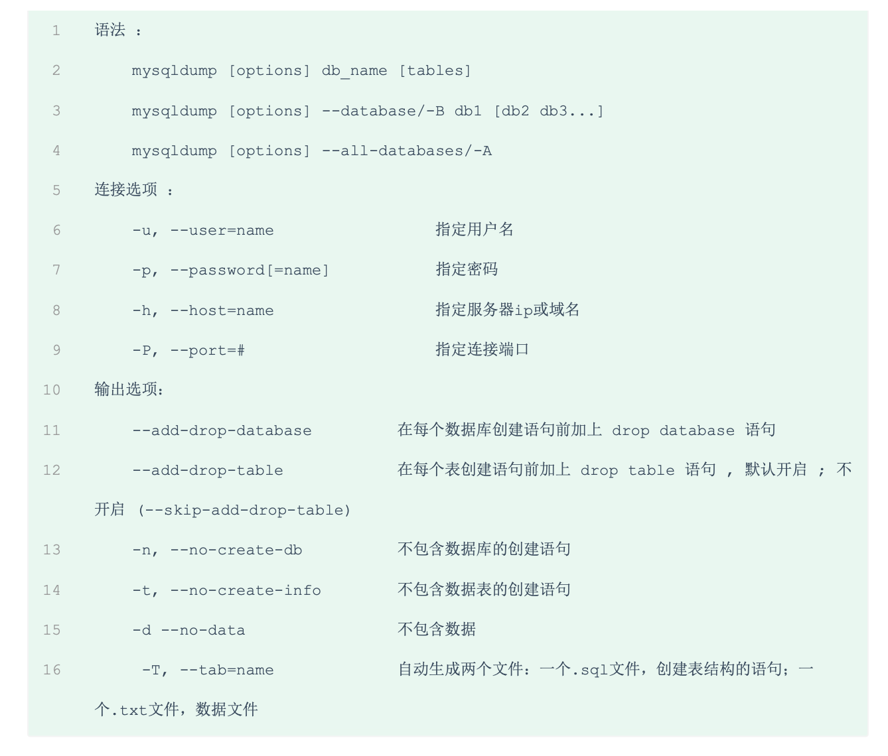

#    MYSQL学习

> 从入门到放弃。奥力给⛽️⛽️


# 一、基础学习

## 1、通用语法及分类

### SQL分类

SQL语句，根据其功能，主要分为四类:DDL、DML、DQL、DCL。

| 分类 |            全称            |                          说明                          |
| :--: | :------------------------: | :----------------------------------------------------: |
| DDL  |  Data Definition Language  |    数据定义语言，用来定义数据库对象(数据库，表字段)    |
| DML  | Data Manipulation Language |     数据操作语言，用来对数据库表中的数据进行增删改     |
| DQL  |     Query LanguageData     |         数据查询语言，用来查询数据库中表的记录         |
| DCL  |   Data Control Language    | 数据控制语言，用来创建数据库用户、控制数据库的访问权限 |


#### DDL语句


##### 数据库操作-CRUD

```mysql
// 查询所有数据库
show Database;
// 查询当前数据库
select database();
// 创建数据库
Create database [if not exists] 数据库名 [default charset utf8mb4][collate 排序规则];
// 删除数据库
drop database  if exists test_database;
// 使用数据库
use test_database;

```


##### 表操作-查询

```mysql
// 查询数据库所有的表
show tables;
// 查询所有表的状态
show table status;
// 查询表结构
desc table_name;
// 查询指定表的建表语句
show create table table_name;
```


##### 表操作-创建

```mysql
// 创建表--结构
CREATE TABLE table_name (
'id' varchar(50) [comment 注释],
'id' varchar(50) [comment 注释],
'id' varchar(50) [comment 注释],
)[comment 表注释];

// 创建表
CREATE TABLE `employ` (
  `id` varchar(50) NOT NULL COMMENT '主健id',
  `name` varchar(5) DEFAULT NULL COMMENT 'name',
  `time` datetime DEFAULT NULL COMMENT '创建时间',
  `age` int DEFAULT NULL COMMENT '年纪',
  PRIMARY KEY (`id`)
) ENGINE=InnoDB DEFAULT CHARSET=utf8mb4 COLLATE=utf8mb4_0900_ai_ci COMMENT='员工表';
```


##### 表数据类型及案例

###### **数值类型**

| 类型         | 大小     | 有符号(SIGNED)范围                                    | 无符号(UNSIGNED)范围                                       | 描述               |
| ------------ | -------- | ----------------------------------------------------- | ---------------------------------------------------------- | ------------------ |
| TINYINT      | 1  byte  | (-128，127)                                           | (0，255)                                                   | 小整数值           |
| SMALLINT     | 2  bytes | (-32768，32767)                                       | (0，65535)                                                 | 大整数值           |
| MEDIUMINT    | 3  bytes | (-8388608，8388607)                                   | (0，16777215)                                              | 大整数值           |
| INT或INTEGER | 4  bytes | (-2147483648，2147483647)                             | (0，4294967295)                                            | 大整数值           |
| BIGINT       | 8  bytes | (-2^63，2^63-1)                                       | (0，2^64-1)                                                | 极大整数值         |
| FLOAT        | 4  bytes | (-3.402823466 E+38，3.402823466351  E+38)             | 0 和 (1.175494351  E-38，3.402823466 E+38)                 | 单精度浮点数值     |
| DOUBLE       | 8  bytes | (-1.7976931348623157 E+308，1.7976931348623157 E+308) | 0 和  (2.2250738585072014 E-308，1.7976931348623157 E+308) | 双精度浮点数值     |
| DECIMAL      |          | 依赖于M(精度)和D(标度)的值                            | 依赖于M(精度)和D(标度)的值                                 | 小数值(精确定点数) |


###### 字符串类型

| 类型       | 大小                  | 描述                         |
| ---------- | --------------------- | ---------------------------- |
| CHAR       | 0-255 bytes           | 定长字符串                   |
| VARCHAR    | 0-65535 bytes         | 变长字符串                   |
| TINYBLOB   | 0-255 bytes           | 不超过255个字符的二进制数据  |
| TINYTEXT   | 0-255 bytes           | 短文本字符串                 |
| BLOB       | 0-65 535 bytes        | 二进制形式的长文本数据       |
| TEXT       | 0-65 535 bytes        | 长文本数据                   |
| MEDIUMBLOB | 0-16 777 215 bytes    | 二进制形式的中等长度文本数据 |
| MEDIUMTEXT | 0-16 777 215 bytes    | 中等长度文本数据             |
| LONGBLOB   | 0-4 294 967 295 bytes | 二进制形式的极大文本数据     |
| LONGTEXT   | 0-4 294 967 295 bytes | 极大文本数据                 |


| explain                          | example                       |
| :------------------------------- | ----------------------------- |
| char(10)  -----------> 性能好    | 用户名 username   varchar(50) |
| varchar(10)  ---------> 性能较差 | 性别 gender   char(1)         |


###### **时间类型**

| 类型      | 大小 | 范围                                       | 格式                | 描述                     |
| --------- | ---- | ------------------------------------------ | ------------------- | ------------------------ |
| DATE      | 3    | 1000-01-01 至  9999-12-31                  | YYYY-MM-DD          | 日期值                   |
| TIME      | 3    | -838:59:59 至  838:59:59                   | HH:MM:SS            | 时间值或持续时间         |
| YEAR      | 1    | 1901 至 2155                               | YYYY                | 年份值                   |
| DATETIME  | 8    | 1000-01-01 00:00:00 至 9999-12-31 23:59:59 | YYYY-MM-DD HH:MM:SS | 混合日期和时间值         |
| TIMESTAMP | 4    | 1970-01-01 00:00:01 至 2038-01-19 03:14:07 | YYYY-MM-DD HH:MM:SS | 混合日期和时间值，时间戳 |


##### 表结构-修改

```mysql
// 新增字段
alter table table_name add 字段 类型(长度) [comment 注释] [约束];
// 只修改数据类型
alter table table_name modify 字段 类型(长度) [comment 注释] [约束];
// 修改字段名和字段类型
Alter table table_name change 旧字段名 新字段名 类型(长度) [comment 注释] [约束];
// 删除字段
alter table table_name drop 字段名;
// 修改表名
alter table table_name rename to new_table_name;
// 删除表
drop table if exists table_name;
// 删除(截断)指定表 并重新创建该表
truncate table table_name;
```


#### DML语句

##### 添加数据

```mysql
// 给指定字段添加数据
insert into table_name (字段1,字段2) values (值1,值2......);
// 给全部字段添加数据
insert into table_name values (值1,值2......);
// 批量添加数据
insert into table_name (字段1,字段2) values (值1,值2......),(值1,值2......),(值1,值2......);
insert into table_name values (值1,值2......),(值1,值2......),(值1,值2......);
// 从别的表取数 插入到这个表
insert into table_name select * from table_name2;
```

Notes：

- 插入数据时，指定的字段顺序需要与值的顺序一一对应的
- **字符串和日期类型应该包含在引号中**
- 插入的数据大小 应该在字段的规定范围内


##### 修改数据

```mysql
// 更新数据
update table_name set 字段1=值1,字段2=值2	.... [where 条件];
// 删除数据
delete from table_name  [where 条件];
```


#### DQL语句

**基本语法：**

```mysql
// 结构
select 
	字段列表 
from 
	table_name 
where 条件列表 
group by 分组字段列表 
having 分组后条件查询 
order by 排序字段列表 
limit 分页参数 ;
```


**查询学习：**

- 基本查询
- 条件查询 where
- 聚合函数 （count、max、min、avg、sum）
- 分组查询 group by
- 排序查询 order by
- 分页查询 limit


##### 基本查询

```mysql
// 查询全部
select * from table_name;
// 设置字段别名  as 可以省略
select name as userName from table_name;
// 去除重复 distinct
select distinct name from table_name;

```


##### 条件查询

```mysql
select * from table_name where 条件列表;
// 查询名字为两个字的员工信息---使用like 或者使用length
select * from emp where name like '__';
```

**条件列表：**

常用的比较运算符如下:

|    比较运算符    |                  功能                  |
| :--------------: | :------------------------------------: |
|        >         |                  大于                  |
|        >=        |                大于等于                |
|        <         |                  小于                  |
|        <=        |                小于等于                |
|        =         |                  等于                  |
|     <> 或 !=     |                 不等于                 |
| BETWEEN...AND. . |     在某个范围之内(含最小、最大值      |
|     IN(...)      |      在in之后的列表中的值，多选一      |
|   LIKE 占位符    | 模糊匹配(匹配单个字符，匹配任意个字符) |
|      ISNULL      |                 是NULL                 |


常用的逻辑运算符如下:

| 逻辑运算符 |            功能             |
| :--------: | :-------------------------: |
| AND 或 &&  |   并且 (多个条件同时成立)   |
| OR 或 \|\| | 或者 (多个条件任意一个成立) |
| NOT 或 ！  |          非 , 不是          |


---


##### 聚合函数

> 将**一列**数据作为一个整体，进行纵向计算
>
> **所有的null值是不参与聚合函数的**

| 函数  |   功能   |
| :---: | :------: |
| count | 统计数量 |
|  max  |  最大值  |
|  min  |  最小值  |
|  avg  |  平均值  |
|  sum  |   求和   |

```mysql
// 语法
select max(age) from table_name;
```

---


##### 分组查询

```mysql
// 语法
select 字段列表 from table_name where 条件  group by 分组字段名 having  分组过滤条件;
```


**WHERE与HAVING的区别：**

- 执行时机不同：**where 是分组之前**进行过滤的 不满足where条件 不参与分组；**having是分组之后**对结果进行过滤
- 判断条件不同：where不能对聚合函数进行判断，而having可以


**Notes：**

- 执行顺序：where>聚合函数>having
- 分组之后，查询的字段一般为聚合函数和分组字段，查询其他字段无任何意义

***


##### 排序查询

```mysql
// 语法  默认asc  
Select 字段列表 from table_name  order by 字段1 asc,字段2 desc;
```

---


##### 分页查询

```mysql
// 语法
select * from table_name limit 起始索引,查询记录数;

```

**Notes:**

- 起始索引 从0开始 起始索引= 查询页码-1  * 每页显示的条数
- 分页查询是数据库的方言，不同的数据库有不同的实现 Mysql是Limit
- 如果查询的是第一页数据，起始索引可以省略，直接简写为 limit 10

---


##### 执行顺序


---


#### DCL语句

> Data Control Language ，用来管理数据库用户、控制数据库的访问权限等等

##### 基础CRUD

```mysql
// 使用mysql 库
use mysql;
// 查询用户
select * from user;

// 创建用户 test_user
create user 'test_user'@'主机名：localhost' identified  by '123456';

// 修改用户密码
alter user 'test_user 用户名'@'主机名: localhost' identified  with mysql_native_password By '新密码';

// 删除用户
drop user 'test_user 用户名'@'主机名: localhost';
```

---


##### 权限控制

**权限列表**

> MySQL中定义了很多种权限，但是常用的就以下几种:
>
> |        权限         |        说明        |
> | :-----------------: | :----------------: |
> | ALL，ALL PRIVILEGES |      所有权限      |
> |       SELECT        |      查询数据      |
> |       INSERT        |      插入数据      |
> |       UPDATE        |      修改数据      |
> |       DELETE        |      删除数据      |
> |        ALTER        |       修改表       |
> |        DROP         | 删除数据库/表/视图 |
> |       CREATE        |   创建数据库/表    |


```mysql
// 查询权限
SHOW GRANTS FOR 'root'@'%';

// 授予权限 如果授予所有的 就使用*.*
GRANTS 权限列表 ON 数据库.表名 TO '用户名：test_user'@'主机名：localhost';
grant all on *.* to 'test_user'@'localhost';

//撤销权限
REVOKE 权限列表 ON 数据库.表名 FROM '用户名：test_user'@'主机名：localhost';
REVOKE all ON *.* FROM 'test_user'@'localhost';

```


### 2、函数

> 可以直接被调用的程序或代码


#### 字符串函数


```mysql
// 字符串拼接
select concat('aaaa', name) from employ where id = 1;
select concat('hello', 'world');
// 转大小写
select lower('hello');
select upper('hello');
// 左右填充
select  lpad('aaa',10,'___');
select  rpad('aaa',10,'___');
// 去掉空格
select  trim(' hello world  ');
// 截取字符串
select  substr('11aaaaaa',1,5);
```


**案例：使得员工编号小于5位的前面自动补0，例如 1变成00001；**

```mysql
update employ set  id = lpad(id,5,'0');
```

---


#### 数值函数


```mysql
// 向上取整 --13
select ceil(12.1);
// 向下取整  --1
select floor(1.1);
//返回x/y的模 --20
select mod(20,100);
// 返回0-1的随机数
select rand();
// 参数x的四舍五入，保留指定小数 ----1.2222
select round(1.222222,4);
```

**生成6位随机数**

```mysql
select lpad(round((select rand()*1000000),0),6,'0');
```

---


#### 日期函数


```mysql
-- 当前日期  2022-03-15
select curdate();
-- 当前时间  21:04:07
select curtime();
-- 当前日期和时间2022-03-15 21:04:32
select now();
// 获取data的年份
select year(now());
// 获取data的月份
select month(now());
// 获取data的日份
select day(now());
// 是时间相加
select date_add(now(),INTERVAL 100 YEAR );
select date_add(now(),INTERVAL 100 day );
select date_add(now(),INTERVAL 100 month );
// 时间差
select datediff(now(),now());
```

---


#### 流程函数


```mysql
-- IFNULL
select ifnull('',111);
select ifnull('2222',111);
select ifnull(null,'22');
-- IF
select if(true,'1','0');
-- CASE WHEN
select name, (case age when 10 then '10岁' when 11 then '11岁' else '不是这个年纪' end) as age
from employ;

```

---


### 3、约束

> **作用于表中字段上的规则，用于限制存储在表中的数据** 

#### 概述


Notes：

**约束是作用于表字段上的，可以在创建表/修改表的时候添加约束**

 

#### 约束演示

id 主键、自动增长

name 不为空 唯一

age >0 小于等于120

status 如果没有指定值，默认为1

```mysql
CREATE TABLE `table_user` (
  `id` int NOT NULL AUTO_INCREMENT COMMENT 'id',
  `name` varchar(10) NOT NULL COMMENT 'name',
  `age` int DEFAULT NULL COMMENT '年纪',
  `status` char(1) DEFAULT '1' COMMENT 'status',
  `gender` char(1) NOT NULL COMMENT 'gender',
  PRIMARY KEY (`id`),
  UNIQUE KEY `name` (`name`),
  CONSTRAINT `table_user_chk_1` CHECK (((`age` > (0 & `age`)) <= 120))
) ENGINE=InnoDB DEFAULT CHARSET=utf8mb4 COLLATE=utf8mb4_0900_ai_ci COMMENT='用户表';
```


#### 外键约束

> 目前不在使用强关联物理外键约束

```mssql
-- 添加外键
alter table  employ add constraint  foreign_key_id foreign key (id) references table_user(id);
-- 删除外键
alter table  employ drop foreign key  foreign_key_id;
```


##### 删除/更新行为

> 添加了外键之后，再删除父表数据时产生的约束行为，我们就称为删除/更新行为。具体的删除/更新行

为有以下几种:


### 4、多表查询


#### 多表关系

*关系分为：*

- 一对一**（单表拆分，在任意一方加入外键盘，关联另一方的外键，并设置外键为unique）**
- 一对多
- 多对多**（需要中间表维护关系）**


#### 多表查询概述

```mysql
-- 两个表关联 隐式内连接 形成笛卡尔积
select * from employ,table_user;
```

---


#### 内连接

> **查询AB交集的部分数据**

##### 隐式内连接

```mysql
select * from employ e,gift_history g where e.id =g.id;
```

  

##### 显式内连接

```mysql
select * from employ e inner join  gift_history g on  e.id =g.id;
```

---


#### 外连接

##### 左外连接

> **查询左表所有数据，以及两张表交集部分数据**

```mysql
select * from employ  e left join table_user P on e.id = P.id where e.name is not null ;
```


##### 右外连接

> **查询右表所有数据，以及两张表交集部分数据**

```mysql
select * from employ  e right outer join  table_user P on e.id = P.id where e.name is not null ;
```


#### 自连接

> **自己与自己关联查询**

```mysql
-- 显示自连接
select * from employ  e1 join employ e2 on e1.id = e2.id;
-- 隐式自连接
select * from employ  e1 , employ e2 on e1.id = e2.id;
```

业务场景：比如员工表，需要查询员工的上级领导是谁，那么就自连接，根据自己的manager_id 等于自己表的id ，那么就可以查询对应的信息出来

Notes：自连接查询，可以是内连接查询，也可以是外连接查询

---


#### 联合查询

> **对于union查询，就是把多次查询的结果合并起来，形成一个新的查询结果集**

union，union all

对于union查询，就是把多次查询的结果合并起来，形成一个新的查询结果集

```mysql
select * from employ where age>10
union
select * from employ where age<10
union
select a.id,a.age,a.name,a.status
from table_user a where a.id>1;
```

Notes：

- 对于联合查询的多张表的数据必须保持一致，字段类型也需要保持一致
- union all 会将全部的数据直接合并在一起**（不做任何操作）**，**union会对合并之后的数据去重、排序**

---


#### 子查询

> sql中嵌套select语句

```mysql
select * from table_name where column =(select id form table_name2 where ....);
```


##### 标量子查询

查询结果为单个值 ---一种条件 确定

```mysql
select * from employ where id > (select id from employ where age ='11');
```


##### 列子查询

查询结果为一列--- in、not in 

```mysql
select * from employ where id in (select id from employ where age >1);
-- all 用法 满足查询出来的所有条件🐮🍺
select * from employ where id > all (select id from employ where age ='1');
-- some 用法 满足查询出来的其中一个条件  🐮🍺
select * from employ where id > some (select id from employ where age ='1');
```


##### 行子查询

查询结果为一行

```mysql
-- 新语法🐮🍺
select * from employ where  (name,age)!=(select name,age from employ where id =00011);

```


##### 表子查询

查询结果为多行多列

```mysql
-- 多条件in 🐮🍺
select * from employ where  (name,age) in(select name,age from employ where id is not null);
-- 子查询当一个表
select * from (select * from employ where time<now()) as a;
```


---


### 5、事务

#### 事务简介

> 要么全部成功，要么全部失败，是一个不可分割的工作单位，事务会把所有的操作作为一个整体一起向系统提交或者撤销操作请求

 默认mysql的事务是自动提交的，也就是说，**当执行一条dml语句，mysql会立即隐式的提交事务**


#### 事务操作

```mysql
-- 银行转账例子
-- 查看当前事务是否自动提交  1就是自动提交  基于session级别
select @@autocommit;
-- 设置为手动提交
set @@autocommit = 0;
-- 开启事务
start transaction 或者 begin;

-- 开始处理业务逻辑
update account set money = money-1000 where name = 'Jack';
update account set money = money+1000 where name = 'Tony';
-- 提交操作
commit;
-- 异常回滚操作
rollback;

```

  

#### 事务四大特性（ACID）

**原子性（atomicity）**：事务是不可分割的最小单元，要么全部成功，要么全部失败。

**一致性（consistency）**：事务完成时，必须使所有的数据都保持一致状态

**隔离性（isolation）**：数据库系统提供的隔离机制，保证事务在不受外部并发操作影响的独立环境下运行

**持久性（durability）**：事务一旦提交或回滚，它对数据库中的操作的改变时永久的


---


#### 并发事务问题🌟

- **脏读**：一个事务读到另外一个事务还没提交的数据
- **不可重复读**：一个事务先后读取同一条记录，但是两次读取到数据不同，称之为不可重复读
- **幻读**：一个事务按照条件查询数据时，没有对应的数据行，但是在插入数据时，又发现这行数据已经存在，好像出现了幻觉
- **可重复读：**MySQL的默认事务隔离级别是可重复读（REPEATABLE READ）。这意味着在同一事务中，对同一数据的多次读取结果都是一致的，除非数据是被本身事务自己所修改。**这可以阻止脏读和不可重复读，但幻读仍有可能发生。**

问题：不可重复读和幻读有什么差别？

```
不可能重复读：主要是前后两次查询时两次的数据不一样。
幻读：主要是数量发生了变化，第一次查询和第二次查询数量不一样了；或者是首先判断没数据，插入的时候，数据存在报错了。
```


#### 事务隔离级别🌟

各个级别会出现的情况：

|              隔离级别               | 脏读 | 不可重复读 | 幻读 |
| :---------------------------------: | :--: | :--------: | :--: |
|      Read uncommitted 读未提交      |  √   |     √      |  √   |
|       Read committed 读已提交       |  √   |     √      |  √   |
| **Repeatable Read（默认）**可重复读 |  ×   |     ×      |  √   |
|            Serializable             |  ×   |     ×      |  ×   |


**MySQL 的隔离级别是基于锁实现的吗？**

```
MySQL的隔离级别基于锁和 MVCC 机制共同实现的。
SERIALIZABLE 隔离级别是通过锁来实现的，READ-COMMITTED 和 REPEATABLE-READ 隔离级别是基于 MVCC 实现的。不过SERIALIZABLE 之外的其他隔离级别可能也需要用到锁机制，就比如 REPEATABLE-READ 在当前读情况下需要使用加锁读来保证不会出现幻读。
```

```mysql
-- 查看事务隔离级别
select @@transaction_isolation;

-- 设置事务隔离级别
set session  transaction isolation level read uncommitted ;
set session  transaction isolation level read committed ;
set session  transaction isolation level repeatable read ;
set session  transaction isolation level serializable ;
```


# 二、进阶学习


## 1、存储引擎

### MYSQL体系结构


- **连接层**：最上层是一些客户端和连接服务，主要完成一些类似连接处理、授权认证、及相关的安全方案。服务器也会为安全接入的每一个客户端验证它所具有的操作权限
- **服务层**：第二层架构主要完成大多数的核心服务功能，比如sql接口，并完成缓存的查询，SQL的分析和优化，部分内置函数的执行，所有跨存储引擎的功能也在这一层实现，比如过程、函数等
- **引擎层**：存储引擎真正的负责mysql中数据的存储和提取，服务器通过API和存储引擎进行通行。不同的存储引擎具有不同的功能，这样我们可以根据自己的需要，来选去合适的存储引擎
- **存储层**：主要是将数据存储在文件系统上，并完成与存储引擎的交互


#### 存储引擎简介

 存储引擎就是存储数据、建立索引、更新/查询数据等技术等实现方式，**存储引擎是基于表的**，而不是基于库的，所以存储引擎也可以被称为表类型。

```mysql
-- 默认存储引擎是InnoDB
-- 查询所有的支持的存储引擎
 show engines;
-- 指定引擎是在创建表中创建
```

| Engine              | Support | Comment                                                      | Transactions | XA   | Savepoints |
| :------------------ | :------ | :----------------------------------------------------------- | :----------- | :--- | :--------- |
| **InnoDB**          | DEFAULT | Supports transactions, row-level locking, and foreign keys   | YES          | YES  | YES        |
| MRG\_MYISAM         | YES     | Collection of identical MyISAM tables                        | NO           | NO   | NO         |
| MEMORY              | YES     | Hash based, stored in memory, useful for temporary tables    | NO           | NO   | NO         |
| BLACKHOLE           | YES     | /dev/null storage engine \(anything you write to it disappears\) | NO           | NO   | NO         |
| MyISAM              | YES     | MyISAM storage engine                                        | NO           | NO   | NO         |
| CSV                 | YES     | CSV storage engine                                           | NO           | NO   | NO         |
| ARCHIVE             | YES     | Archive storage engine                                       | NO           | NO   | NO         |
| PERFORMANCE\_SCHEMA | YES     | Performance Schema                                           | NO           | NO   | NO         |
| FEDERATED           | NO      | Federated MySQL storage engine                               | NULL         | NULL | NULL       |


#### 存储引擎特点

##### InnoDB

###### **InnoDB特点**

- DML操作遵循ACID模型，支持事务
- **行级锁**，提高并发访问性能
- **支持外键** FOREIGN KEY约束，保证数据的完整性和正确性

###### **文件**

```
xxx.ibd：代表是的是表名，innoDB引擎的每张表都会对应这样一个表空间文件，存储该表的表结构（frm、sdi）、数据和索引。
参数：innodb_file_per_table  该参数是置顶是每个表放一个表空间文件和多个表公用一个表空间文件
```

```mysql
-- 查看设置
show variables like '%innodb_file_per_table%';
```

| Variable\_name           | Value |
| :----------------------- | :---- |
| innodb\_file\_per\_table | ON    |


###### 逻辑存储结构


**表空间- Tablespace**

表空间可以看做时InnoDB存储引擎逻辑结构的最高层，所有的数据都存放在表空间中。默认情况下InnoDB只有一个共享表空间ibdata1，即所有的数据都存放在这个表空间中。如果用户启用了innodb_file_per_table，则每张表内的数据可以单独放到一个表空间内。

**Notes：**需要注意的是，启用了**innodb_file_per_table**参数，每张表的表空间内存放的只是数据、索引和插入缓冲Bitmap页，其他类的数据，如回滚信息，插入缓冲索引页、系统事务信息，二次写缓冲等还是存放在原来的共享表空间内。

**段- Segment**

表空间是由各个段组成的，常见的段有数据段、索引段、回滚段等。因为InnoDB引擎表是索引组织的，因此**数据即索引，索引即数据**。那么数据段即为B+树的叶子结点，**索引段即为B+树的非叶子结点**。

**区-Extend**

区是由**连续页组成的空间**，在任何情况下每个区的大小**都为1MB**。为了保证区中页的连续性，InnoDB一次从磁盘申请4-5个区。在默认情况下，InnoDB存储**引擎页的大小为16KB**，即一个区中一共有64个连续的页。

InnoDB 1.0版本开始引入压缩页，每个页的大小可以设置为2K、4K、8K。

InnoDB 1.2版本新增参数innodb_page_size，可将默认页的大小设置为4K、8K。

**页-Page**

页是InnoDB磁盘管理的最小单位，在InnoDB存储引擎中，**默认每个页的大小为16KB**。

在InnoDB存储引擎中，常见的页类型有：

> **数据页**
>
> **undo页**
>
> **系统页**
>
> **事务数据页**
>
> **插入缓冲位图页**
>
> **插入缓冲空闲列表页**
>
> **未压缩的二进制大对象页**
>
> **压缩的二进制大对象页**

**行-Row**

InnoDB数据是按照行进行存放的。每个页存放的行记录也是有硬性定义的，最多允许存放**16KB/ 2 - 200**行的记录，即7992行记录。


##### MyISAM

介绍：是早期的默认存储引擎

###### 特点：

- 不支持事务，不支持外键
- 支持表锁，不支持行锁
- 访问速度快

###### 文件：

xxx.sdi：存储表结构信息

xxx.MYD：存储数据

xxx.MYI：存储索引


##### Memory

介绍：Memory引擎的表数据存储在内存中的，由于收到硬件问题、断电的影响，只能将这些表作为临时表或者缓存使用。

###### 特点：

- 内存存放
- hash索引（默认）

###### 文件：

xxx.sdi：存储表结构信息


##### 区别：

|     特点     |      InnoDB       | MyISAM | Memory |
| :----------: | :---------------: | :----: | :----: |
|   存储限制   |       64TB        |   有   |   有   |
|   事务安全   |       支持        |   -    |   -    |
|    锁机制    |       行锁        |  表锁  |  表锁  |
|  B+tree索引  |       支持        |  支持  |  支持  |
|   Hash索引   |         -         |   -    |  支持  |
|   全文索引   | 支持(5.6版本之后) |  支持  |   -    |
|   空间使用   |        高         |   低   |  N/A   |
|   内存使用   |        高         |   低   |  中等  |
| 批量插入速度 |        低         |   高   |   高   |
|   支持外键   |       支持        |   -    |   -    |

---


##### 存储引擎选择

**MyISAM被mongoDB替换**

**Memory被Redis替换**

在选择存储引擎时，应该根据应用系统的特点选择合适的存储引擎。对于复杂的应用系统，还可以根据实际情况选择多种存储引擎进行组合。

- **InnoDB**：是Mysql的默认存储引擎，支持事务、外键。如果应用对事务的完整性有比较高的要求，在并发条件下要求数据的一致性，数据操作除了插入和查询之外，还包含很多的更新、删除操作，那么InnoDB存储引擎是比较合适的选择。
- **MyISAM** ： 如果应用是以读操作和插入操作为主，只有很少的更新和删除操作，并且对事务的完。整性、并发性要求不是很高，那么选择这个存储引擎是非常合适的,
- **MEMORY**：将所有数据保存在内存中，访问速度快，通常用于临时表及缓存。MEMORY的缺陷就是对表的大小有限制，太大的表无法缓存在内存中，而且无法保障数据的安全性。


### 2、索引

##### 索引概述

> **索引（index）是帮助MYSQL高效获取数据的数据结构（有序）。在数据之外，数据库系统还维护着满足特定查找算法的数据结构，这些数据结构以某种方式引用（指向）数据，这样就可以在这些数据结构上实现高级查找算法，这种数据结构就是索引。**

***用二叉树做个示意图，非真实的索引结构***


###### 优缺点：

| 优势                                                         | 劣势                                                         |
| ------------------------------------------------------------ | ------------------------------------------------------------ |
| 提高数据检索的效率，降低数据库的IO成本                       | 索引也是要占用空间                                           |
| 通过索引列对数据进行排序，降低数据排序的成本，降低CPU的消耗。 | 索引大大提高了查询效率，同时却也降低更新表的速度，如对表进行了INSERT、UPDATE、DELETE时，效率降低。 |


##### 索引结构

###### 主要结构：

| 索引结构                | 描述                                                         |
| ----------------------- | ------------------------------------------------------------ |
| **B+Tree索引**          | 最常见的索引类型，大部分引擎都支持                           |
| **Hash索引**            | 底层数据结构是用哈希表实现的，只有精确匹配索引列的查询才有效，不支持范围查询 |
| **R-tree(空间索引)**    | 空间索引是MyISAM索引的一个特殊索引类型，主要用于地理空间数据类型，通常使用较少 |
| **Full-text(全文索引)** | 是一种建立索引倒排索引，快速匹配文档的方式。类似Lucene、Solr、ES |


**索引支持：**

|          索引           |     InnoDB      | MyISAM | Memory |
| :---------------------: | :-------------: | :----: | :----: |
|     **B+Tree索引**      |    **支持**     |  支持  |  支持  |
|      **Hash索引**       |     不支持      | 不支持 |  支持  |
|  **R-tree(空间索引)**   |     不支持      |  支持  | 不支持 |
| **Full-text(全文索引)** | **5.6以后支持** |  支持  | 不支持 |


######  二叉树

> 二叉树缺点：顺序插入时，会形成一个**链表**，查询性能大大降低。大数据量情况下，层级较深，检索速度慢。


---


###### 红黑树

> **解决单向链表问题**
>
> **缺点：大数据量情况下，层级较深，检索速度慢。**


---


###### B-Tree（多路平衡查找树）

以一颗最大度数（max-degree） 为5（5阶）的b-tree为例（**每个节点最多存放四个key，5个指针**）

树的度数指的是一个节点的子节点个数


查看b树演变过程网站**🐮🍺**

```
https://www.cs.usfca.edu/~galles/visualization/Algorithms.html
```


---


###### B+Tree

**特点：**

- 所有元素都会存在叶子节点中

- 叶子节点形成单向链表


- 绿色框框起来的部分，是索引部分，仅仅起到索引数据的作用，不存储数据。
-  红色框框起来的部分，是数据存储部分，在其叶子节点中要存储具体的数据。


###### B+Tree（Mysql版本）

MYSQL索引数据结构对经典的B+Tree进行了优化，在原来的B+Tree的基础上，**增加了一个指向相邻叶子节点的链表指针**，就形成了带有顺序的B+Tree，提高了区间访问的性能。 


###### Hash索引

> **hash索引就是通过一定的hash算法，将键位换算成新的hash值，然后映射到对应的槽位上，然后存在hash表中。如果两个或者多个键值映射到同一个槽位上，那么就产生了hash冲突（hash碰撞💥），可以通过链表来解决。**


特点：

- hash索引只能用于**对等比较**（=，in），不支持范围查询（between，>,<）
- **无法利用索引完成排序操作**
- 查询效率高，通常只需要一次检索就可以，效率通常高于b+Tree

存储引擎支持：

在MYSQL中，支持hash索引的是Memory引擎，而InnoDB中具有自适应hash功能，hash索引是存储引擎根据B+Tree索引在指定条件下自动构建的。

---


###### **面试题：**

为什么InnoDB存储引擎选择使用B+tree索引结构？

- **相对于二叉树，层级更少，搜素效率更高**
- **B+树支持范围匹配及排序操作**
- **B+树的查询效率更加稳定**：因为B+树的每次查询过程中，**都需要遍历从根节点到叶子节点的某条路径**。所有关键字的查询路径长度相同，导致**每一次查询的效率相当**。

- **增删文件（节点）时，效率更高**：因为B+树的叶子节点包含所有关键字，并以有序的链表结构存储，这样可很好提高增删效率，基于范围查询更好。
- **B+树空间利用率更高，可减少I/O次数**：索引本身也很大，不可能全部存储在内存中，因此索引往往以索引文件的形式存储的磁盘上。这样的话，索引查找过程中就要产生磁盘I/O消耗。而因为B+树的内部节点只是作为索引使用，而不像B树那样每个节点都需要存储硬盘指针。也就是说：B+树中每个非叶节点没有指向某个关键字具体信息的指针，所以每一个节点可以存放更多的关键字数量，即一次性读入内存所需要查找的关键字也就越多，减少了I/O操作1。


##### 索引分类

| 分类         | **含义**                                             | 特点                     | 关键字       |
| ------------ | ---------------------------------------------------- | ------------------------ | ------------ |
| **主键索引** | 针对于表中主键创建的索引                             | 默认自动创建，只能有一个 | **PRIMARY**  |
| **唯一索引** | 避免同一个表中某数据列中的值重复                     | 可以有多个               | **UNIQUE**   |
| **常规索引** | 快速定位特定数据                                     | 可以有多个               |              |
| **全文索引** | 全文索引查找的是文本中的关键字，而不是比较索引中的值 | 可以有多个               | **FULLTEXT** |

***当新建唯一约束的时候，会自动创建唯一索引***


**根据索引的存储形式，可以分为以下两种：**

|              分类               |                             含义                             |           特点           |
| :-----------------------------: | :----------------------------------------------------------: | :----------------------: |
| **聚集索引（Clustered index）** | **将数据存储与索引放到了一块，索引结构的叶子结点保存了行数据** | **必须有，而且只有一个** |
| **二级索引（Secondary index）** | **将数据与索引分开存储，索引结构的叶子结点关联的是对应的主键** |     **可以存在多个**     |

###### **聚集索引选取规则：**

- 如果存在主键，主键索引就是聚集索引
- 如果不存在主键，将使用第一个唯一unique索引作为聚集索引
- 如果表没有主键，或者没有合适的唯一索引，**则InnoDB会自动生成一个rowid作为隐藏的聚集索引**


###### **聚集索引和二级索引的区别：**

**聚集索引**叶子中挂的是**一行的数据**

**二级索引**叶子节点中挂的值**这一行的id**


###### 回表查询

> **如果拿二级索引的字段查询，如果存在，先查询到id，然后在根据聚集索引去表中查这一行的数据。**


###### 🌟面试题🌟：

InnoDB主键索引的B+Tree高度为多高？


假设：一行数据大小为1K，一页（Page固定大小16K）中可以存储16行这样的数据。InnoDB的指针占用6个字节的空间，主键假设是为bigint，占用字节数为8。

**高度为2:**

一页16k*1024字节==主键数量 * 主键大小8字节 + 指针数量（主键数量+1）* 指针大小 6 字节 

n*8 :主键的大小   (n+1) ：指针的数量 

n*8 + (n+1) *6 =16 * 1024，计算n约等于1170，

存储的数量量为1171*16=18736

**高度为3:** 

**每个页最多1171个** 

1171 * 1171*16=21939856

---


##### 索引语法

###### 创建索引

```mysql
create unique index index_name ON table_name (index_col_name...);
create fulltext index index_name ON table_name (index_col_name...);
```

一个索引可以关联多个字段的。


###### 单列索引

> 一个索引关联一个字段


###### 联合索引

> 一个索引关联多个字段***（顺序是有讲究的）***

###### 查看索引

```mysql
show index from table_name;
```


###### 删除索引

```mysql
drop index index_name ON table_name;
```


##### SQL性能分析

###### SQL执行频率

查询CRUD的访问频次

```mysql
show global status like 'Com_______';
```

**CRUD 查询的次数**

| Variable\_name | Value     |
| :------------- | :-------- |
| Com\_binlog    | 0         |
| Com\_commit    | 5726128   |
| Com\_delete    | 423666    |
| Com\_insert    | 40890232  |
| Com\_repair    | 0         |
| Com\_revoke    | 0         |
| Com\_select    | 110377358 |
| Com\_signal    | 0         |
| Com\_update    | 3358246   |
| Com\_xa\_end   | 0         |


###### 慢查询日志

慢查询日志记录了所有的执行时间超过指定参数（long_query_time，单位：s，默认10s）的所有SQL语句的日志。

MYSQL的慢查询日志默认没有开启，需要在MYSQL的配置文件（/etc/my.conf）中配置如下信息

```properties
# 开启MYSQL慢日志查询开关
show_query_log=1
# 设置慢日志查询的时间为2s，SQL语句执行时间超过2s，就会视为慢查询，记录慢查询日志
long_query_time=2
```

查询慢查询开发是否开启，查询变量

```mysql
show variables like '%slow_query_log%';
show variables like '%long_query_time%';
```


慢查询log位置

```shell
cat  /var/lib/mysql/localhost-slow.log
```


###### profile详情

show profiles 能够在做SQL优化时帮助我们了解时间都耗费到哪里去了。通过hava_profiling参数查看当前系统是否支持profile操作：

```mysql
SELECT @@have_profiling;
```

开启profiling开关，可以在session级别，也可以在global级别

```mysql
-- 查看环境变量
show variables  like '%profiling%';
-- 打开开关
set profiling =1;
```


查询一系列的业务SQL的操作，然后通过如下指令查询指令的执行耗时：

```mysql
-- 查询每一条sql的耗时基本情况
show profiles;
-- 查看指定的query_id 的sql语句各个阶段的耗时情况
show profile  for query 121;

-- 查看指定query_id的sql语句CPU使用情况
show profile cpu for query 121;

```

###### explain性能分析

explain或者desc命令获取Mysql如何执行SELECT语句的信息，包括SELECT语句执行过程中表如何连接和连接的顺序。

```mysql
-- 语法
explain select * from table_user;
desc select * from table_user;
```


**Explain截图**

| id   | select\_type | table               | partitions | type | possible\_keys           | key                      | key\_len | ref               | rows  | filtered | Extra                           |
| :--- | :----------- | :------------------ | :--------- | :--- | :----------------------- | :----------------------- | :------- | :---------------- | :---- | :------- | :------------------------------ |
| 1    | PRIMARY      | &lt;derived2&gt;    | NULL       | ALL  | NULL                     | NULL                     | NULL     | NULL              | 7281  | 100      | NULL                            |
| 1    | PRIMARY      | web\_ply\_base      | NULL       | ref  | idx\_plybase\_plyno      | idx\_plybase\_plyno      | 203      | base01.c\_ply\_no | 1     | 100      | Using index                     |
| 2    | DERIVED      | &lt;derived3&gt;    | NULL       | ALL  | NULL                     | NULL                     | NULL     | NULL              | 7281  | 100      | Using temporary; Using filesort |
| 3    | DERIVED      | web\_ply\_applicant | NULL       | ref  | idx\_ply\_certf\_cde     | idx\_ply\_certf\_cde     | 83       | const             | 39    | 100      | NULL                            |
| 4    | UNION        | web\_ply\_insured   | NULL       | ref  | idx\_ply\_insured\_certf | idx\_ply\_insured\_certf | 83       | const             | 39    | 100      | NULL                            |
| 5    | UNION        | web\_ply\_bnfc      | NULL       | ALL  | NULL                     | NULL                     | NULL     | NULL              | 72038 | 10       | Using where                     |
| NULL | UNION RESULT | &lt;union3,4,5&gt;  | NULL       | ALL  | NULL                     | NULL                     | NULL     | NULL              | NULL  | NULL     | Using temporary                 |


**各字段定义：**

|       字段       | 含义                                                         |
| :--------------: | :----------------------------------------------------------- |
|      **id**      | select查询的序列号，表示查询中执行的select子句或者是操作表的顺序（**id相同，执行顺序从上到下，id不同，值越大，越先执行**） |
| **select_type**  | 表示select的类型，常见的取值有SIMPLE（简单表，不用表连接或者子查询）、PRIMARY（主查询，即外层的查询）、UNION（UNION中的第二个或者后面的查询语句）、SUBQUERY（SELECT/WHERE之后包含了子查询）等 |
|     **type**     | 表示连接类型，性能由好到差的连接类型为NULL、SYSTEM、const(主键 唯一索引)、eq_ref、ref（非唯一索引）、range、index、all |
| **possible_key** | 显示可能应用在这张表上的索引，一个或多个                     |
|     **key**      | 显示使用的索引                                               |
|   **Key_len**    | 表示索引中使用到字节数，该值为索引字段最大可能长度，并非实际使用长度，在不损失精度到前提下，长度越短越好 |
|     **rows**     | MYSQL 认为要执行查询到行树，在innoDB引擎中，是一个估计值，可能并不总是准确 |
|   **filtered**   | 表示返回结果的行数占需要读取行数到百分比，值越大越好         |
|    **Extra**     | 额外展示的信息                                               |


##### 索引使用

###### 最左前缀法则

如果索引了（联合索引），要遵守**最左前缀法则**。最左前缀法则指的是查询从索引的最左列开始，并且不跳过索引中的列。
如果跳跃某一列索引将部分失效（后面的字段索引失效）。
**聚合索引中最左边的索引必须存在即可，只要最左边的索引出现了，就会走索引。与位置无关**

###### 范围查询

 聚合索引中，出现范围查询（<,>），范围查询右侧的列索引失效

```mysql
-- 三个字段是聚合索引，但是 status索引失效
select * from table_name where name='a' and age>10 and status =0;
-- 规避方法 使用>= 或者<=
select * from table_name where name='a' and age>=10 and status =0;

```

###### 索引列运算

不要在索引列上进行运算操作，索引将失效
```mysql
-- 函数运算 索引失效
select * from table_name where substring(phone,10,2) ='15';
```

###### 字符串不加引号

字符串类型字段使用时，不加引号，索引将失效。
```mysql
-- 字符串类型不加引号 索引失效
select * from table_name where phone =15;
```

###### 模糊查询

如果仅仅是尾部模糊查询匹配，索引不会失效。如果是头部模糊匹配，索引将失效。

```mysql
-- 头部模糊查询 索引失效
select * from table_name where phone like '%15';
```

###### or的连接条件

用or分隔开的条件，如果or前的条件中的列有索引，而后面的列中没有索引，那么设计到的索引都不会被用到

```mysql
-- or前后必须都有索引 才可以生效
 explain select * from table_name where phone = '1509999999' or type=1;
```

###### 数据分布影响

如果MYSQL评估使用索引比全表更慢，则不使用索引。

```mysql
-- 假如 手机号从0开始递增 那么不会走索引 直接全表扫描
 explain select * from table_name where phone >= '15000000000' ;

-- 假如 手机号从0开始递增 一共100条 那么不会走索引 直接全表扫描
 explain select * from table_name where phone >= '15000000050' ;

-- 假如手机号大多数不为空 is not null 和 null 取决于字段数据分布情况---不走索引
 explain select * from table_name where phone is not null ;

-- 假如手机号大多数都为空 null 取决于字段数据分布情况---不走索引
 explain select * from table_name where phone is null ;
```

###### SQL提示

SQL提示，是优化数据库的一个重要手段，简单来说，就是在SQL语句中加入一些认为的提示来达到优化操作的目的。

```mysql
-- 如果phone是单列索引，也是聚合索引，那么会使用聚合索引，没走单列索引
 explain select * from table_name where phone >= '15000000000' ;
```

优化提示：
使用use index：

```mysql
-- 建议使用这个索引，但是mysql还是要去比较到底是否接受 
 explain select * from table_name use index(index_phone) where phone >= '15000000000' ;
```

使用ignore index

```mysql
-- 忽略索引，但是mysql还是要去比较到底是否接受 
 explain select * from table_name ignore index(index_phone) where phone >= '15000000000' ;
```

强制使用索引：
force index()
```mysql
-- 强制使用这个索引 
 explain select * from table_name force index(index_phone) where phone >= '15000000000' ;
```


###### 覆盖索引 

尽量使用覆盖索引（索引使用了索引，并且需要返回的列，在该索引中已经全部能够找到），减少select

```mysql
-- 如果name,id,age 都是索引 --这些都是索引，不需要回表 效率高
 explain select id, name,age from table_name where phone >= '15000000000' ;

-- status 没有索引，需要回表，效率没有上面的高
 explain select id, name,status from table_name where phone >= '15000000000' ;
```


| id   | select\_type | table         | partitions | type  | possible\_keys | key         | key\_len | ref  | rows | filtered | Extra                    |
| :--- | :----------- | :------------ | :--------- | :---- | :------------- | :---------- | :------- | :--- | :--- | :------- | :----------------------- |
| 1    | SIMPLE       | test\_varchar | NULL       | index | name\_index    | name\_index | 403      | NULL | 2    | 100      | Using where; Using index |

**Tips，当extra内容是：**

- **Using where; Using index**的时候，使用了索引，但是需要的数据都在索引列中能找到，所以不需要回表查询数据
- **Using index condition**：使用了索引，但是需要回表查询数据


###### 前缀索引

当字段类型为字符串(varchar,text等)时，有时候需要索引很长的字符串，这会让索引变得很大，查询时，浪费了大量的磁盘IO，影响查询效率。

此时可以只将字符串的一部分前缀，建立索引，这样可以大大节约索引空间，从而提高索引效率。

```mysql
-- 语法
 create  index index_name ON employ (name(3));
```

前缀长度

可以根据索引的选择性来决定，而选择性是指不重复的索引值（基数）和数据表的记录总数的比值，

索引选择性越高则查询的效率越高，唯一索引的选择性是1，这是最好的索引选择性，性能也是最好的。

```mysql
-- 找对应的临界点，适当选择
select count(distinct email) from employ;

select count(distinct substring(email,1,6) )/count(distinct email) from employ;
```

**前缀查询流程**


###### 单列索引和联合索引

单列索引：一个索引值包含单个列

联合索引：一个索引包含了多个列

在业务场景中，如果存在多个查询条件，考虑针对于查询字段建立索引时，建议建立联合索引，而非单列索引。


**联合索引情况：**


##### 索引设计原则

1、针对于数据量较大，且查询比较频繁的表建立索引

2、针对于常作为查询条件（where）、排序（order by）、分组（group by）操作的字段建立索引

3、尽量选择区分读度高的字段作为索引，尽量建立唯一索引，区分度越高，使用的效率越高

4、如果是字符串类型的字段，字段的长度较长，可以针对于字段的特点，建立前缀索引

5、尽量使用联合索引，减少单列索引，查询时，联合索引很多时候可以覆盖索引，节约存储空间，避免回表查询，提高查询效率

6、要控制索引的数量，索引并不是多多益善，索引越多，维护索引的结构的代价也就越大，会影响CDU的效率

7、如果索引列不能存储NULL值，请在创建表时使用NOT NULL约束它。当优化器知道每列是否包含NULL值时，他可以更好地确定哪个索引最有效地用于查询


### 3、SQL优化


##### 插入数据

###### insert插入

**批量插入**

```mysql
-- 多次插入，尽量控制在1000条以内
insert into employ values ('1','Jack1',current_timestamp(),1,'1111@88.com'),('2','Jack2',current_timestamp(),1,'1111@88.com')
```

**手动提交事务**

```mysql
start transaction ;
insert into employ values ('3','Jack1',current_timestamp(),1,'1111@88.com');
insert into employ values ('4','Jack2',current_timestamp(),1,'1111@88.com');
commit ;
```

**主键顺序插入**

```mysql
-- 主键顺序插入速度快于乱序
-- 顺序插入
1 2 3 4 6 78 99 100 190 200
```

###### 插入大量数据

如果一次性需要大批量数据，使用insert语句插入性能低，此时可以使用mysql数据库提供的load指令

```mysql
-- 客户端连接服务器时，加上参数 ---local-infile
mysql --local-infile -u root -p
-- 设置全局参数local——infile 为1 开启从本地加载文件导入数据的开关
set global local_infile = 1;
-- 执行load指令将准备好的数据 加载到表结构当中  
-- files terminated by ',' 字段根据‘,’分隔开 
-- lines terminated by '\n' 一行根据换行符隔开
load data local infile '/root/sql.log' into 'table_name' files terminated by ',' lines terminated by '\n';
```


##### 主键优化

###### 数据组织方式

在innoDB存储引擎中，表数据都是根据主键顺序组织存放的，这种存储方式的表称为索引组织表（index organized table IOT）


行数据，都是存储在聚集索引的叶子节点上的。而我们之前也讲解过InnoDB的逻辑结构图:


在InnoDB引擎中，数据行是记录在逻辑结构 page 页中的，而每一个页的大小是固定的，默认16K。 那也就意味着， 一个页中所存储的行也是有限的，如果插入的数据行row在该页存储不小，将会存储 到下一个页中，页与页之间会通过指针连接。


###### 页分裂

页可以为空，也可以填充一半，也可以填充100%。每个页包含了2-N行数据（如果一行数据过大，会行溢出），根据主键排序。

**主键顺序插入：**


**主键乱序插入**

**初始**


**移动新开启的页**


**插入数据到数据页**


**重新设置链表**


###### 页合并

当删除一行记录时，实际上记录并没有被物理删除，只是记录被标记（flaged）为删除并且它的空间变得允许被其他记录声明使用。

当页中删除的记录达到**merge_threshold**(默认页的50%)，InnoDB会开始寻找最靠近的页（前或者后）看看是否可以将两个页合并以优化空间使用。

**删除部分行记录**


> 当页中删除的记录达到 MERGE_THRESHOLD(默认为页的50%)，InnoDB会开始寻找最靠近的页(前 或后)看看是否可以将两个页合并以优化空间使用。

**合并页**


**插入新数据**


**Tips：**

merge_threshold：合并页的阀值，可以自己设置，在创建表或者创建索引时指定。


###### 主键设计原则

满足业务需求的情况下，尽量降低主键的长度

插入数据时，**尽量选择顺序插入**，选择使用AUTO_INCREMENT 自增主键

尽量不要使用UUID做主键或者是其他的自然主键，如身份证号

业务操作时，避免对主键的修改


##### order by优化

Using filesort：通过表的索引或全表扫描，读取满足条件的数据行，然后**在排序缓冲区sort buffer中完成排序操作**，所有不是通过索引直接返回排序结果的排序都叫**FileSort排序**。

**Using index**：通过有序索引顺序扫描直接返回有序数据，这种情况即为using index，不需要额外排序，操作效率高。

```mysql
-- 创建索引，一个倒序，一个顺序排
-- 默认是asc 
create index index_age_phone on table_name(age desc,phone asc);
-- 根据group by 排序  如果根据索引字段排序  也需要遵循最左原则 ，并且查询的字段也需要覆盖索引
select id ,name,age,phone from table_user order by age desc,phone asc;
select id ,name,age,phone from table_user order by age ,phone;


```


**顺序/倒序查询示意图（索引覆盖情况下）：**

如果是顺序，从链表的左边查询走，如果是倒序，从链表的右边开始查询


**顺序、倒序查询示意图（索引覆盖情况下）：**


###### Notes：

如果查询的字段不都是索引覆盖的，那么会回表查询

根据排序字段建立合适的索引，多字段排序时，也遵循最左前缀法则

**尽量使用索引覆盖**

多字段排序时候，一个升序一个降序，需要注意联合索引在创建时多定义（ASC/DESC）

如果不可避免的出现filesort，大数据量排序时，可以适当增加排序缓冲区大小 **sort_buffer_size（默认256K）**

```mysql
-- 查询排序缓冲区大小
show variables like '%sort_buffer_size%';
```


##### group by优化

适当增加group的索引，尽量索引覆盖

也需要遵循最左前缀法则


##### limit优化

一个常见又头疼的问题就是 limit 2000000,10，此时需要MYSQL排序前2000010记录，仅返回2000000到2000010的记录，其他记录放弃，查询的代价非常大。

###### 优化思路

一般分页查询时，通过创建 覆盖索引能够较好的提高性能，可以通过覆盖索引加子查询的形式进行优化

```mysql
-- 子查询1 ---报错 不支持这种语法
select * from employ where  id in (select id from employ limit 0,10);
```

只能通过关联查询

```mysql
select a.* from employ a ,(select id from employ limit 0,10) t1 where  a.id =t1.id;
```


##### count优化

**MyISAM引擎是把一个表的总行数存在了磁盘上**，因此执行count(*) 的时候会直接返回这个数，效率高；

InnoDB引擎就麻烦了，他执行count(*) 的时候，**需要把数据一行一行的从引擎中读取出来，然后累计计数。**

###### 优化思路

自己拿redis计数

###### count用法

count()是一个聚合函数，对于返回的结果集，一行行的判断，如果count函数的参数**不是NULL**，累计值就加1，否则不加，最后返回累计值。

**Count(*)**

InnoDB引擎**并不会把全部字段取出来**，而是专门做了优化，不取值，服务层直接按行累加。

**Count(主键)**

InnoDB引擎会遍历整张表，把每一行的 主键id 值都取出来，返回给服务层。服务层拿到之后，直接按行进行累加**（主键不可能为null）**

**Count(字段)**

如果没有not null 约束：InnoDB引擎会遍历整张表把每一个行的字段值都取出来，返回给服务层，服务层判断是否为null，不为null，计数累加。只会累积行数中这个字段**不为NULL**的行数

有not null约束：InnoDB引擎会遍历整张表把每一个行的字段值都取出来，返回给服务层。直接按行累加。

**Count(1)**

InnoDB引擎会遍历整张表，但是不取值。服务层对于返回的每一行，放一个数字‘1’进去，直接按行累加。

###### 执行效率

**Count(字段) < Count(主键) < Count(1) 约等于 Count(*)**


##### update优化

行锁，表锁问题

```mysql
-- 更新sql的时候，条件必须是索引 --- status没有索引---表锁
update employ set id ='1111' where status =1000;

```

注意⚠️⚠️：

**InnoDB的行锁是针对B+Tree索引index加的锁， 不是针对记录加的锁，并且该索引不能失效，否则会从行锁升级为表锁。**

**必须根据索引字段更新**


### 4、视图/存储过程/触发器

##### 视图

###### 介绍

视图（view）是一种虚拟存在的表。视图中的数据并不在数据库中实际存在，行和列数据来自定义视图的查询中使用的表，并且是在视图时动态生成 的。

通俗的讲，视图值保存了查询的sql逻辑，不保存查询的结果。所以我们在创建视图的时候，主要的工作就落在了创建这条SQL的查询语句上。

**语法**

```mysql
-- 创建视图
CREATE [OR REPLACE ] VIEW  VIEW_NAME AS SELECT name,id from employ where id <100 [WITH[CASCADED|LOCAL] CHECK OPTION];
CREATE VIEW  employ_view AS SELECT name,id from employ where id <100;
-- 查询视图-- 建视图语句
show create view table_name;
-- 查询视图-- 视图内容
select * from employ_view;
-- 修改视图
-- 方式一
ALTER VIEW  employ_view as select age,name,id from  employ;
-- 方式二
CREATE OR REPLACE VIEW  employ_view AS SELECT name,id ,age from employ where id <100;
-- 删除视图
DROP VIEW  IF EXISTS  employ_view;

```

###### 视图检查选项

当使用WITH CHECK OPTION子句创建视图时，MYSQL会通过视图检查正在更改的每个行，例如插入、更新、删除，以使其符合视图的定义。MYSQL允许基于另一个视图创建视图，他还会检查依赖视图中的规则以保持一致性。为了确定检查的范围，mysql提供了两个选项：CASCADED 和LOCAL，默认为CASCADED。

```mysql
-- 不加检查项，插入数据不会做检查--不做任何校验。大于100也能插入 不会异常
CREATE OR REPLACE VIEW  employ_view AS SELECT name,id ,age from employ where id <100;
insert into employ_view values ('1000',10000);

-- 增加检查项--- 新增id大于100的时候，会出现检查报错
CREATE OR REPLACE VIEW  employ_view AS SELECT name,id ,age from employ where id <100 with cascaded  check option;
-- 插入数据  检查报错--[HY000][1369] CHECK OPTION failed 'redis_lock.employ_view'
insert into employ_view values ('1000',10000,10000);

```

LOCAL

会循环递归的去找相关依赖的判断条件

```mysql
CREATE OR REPLACE VIEW  employ_view_1 AS SELECT name,id ,age from employ where id ='999' with local  check option;

```


###### 视图的更新

要想视图可更新，**视图中的行与基础表中的行之间必须存在一对一的关系**。如果视图包含以下任意一项，则视图不可更新：

1、聚合函数或窗口函数（sum(),min(),max(),count()等）

2、DISTINCT、Group By、Having、Union或者Union All


###### 作用

**简单**

视图不仅可以简化用户对数据对理解，也可以简化他们的操作。那些被经常使用的查询可以被定义为视图，从而使得用户不必为以后的操作每次指定全部的条件

**安全**

数据库可以授权，但不能授权到数据库特定行和特定的列上。通过视图用户可以只能查询和修改他们所能见到的数据

**数据独立**

视图可以帮助用户屏蔽真实表结构变化带来的影响


##### 存储过程

存储过程是事先经过编译并存储在数据库中的一段sql语句的集合，调用存储过程可以简化应用开发人员的很多工作，减少数据在数据库和应用服务器之间的传输，对于提高数据处理的效率是有好处的。

存储过程思想上很简单，就是数据库SQL语言层面的代码封装和重用。

###### 特点

封装、复用，可以接受参数，也可以返回数据，减少网络交互，效率提升

```mysql
-- 创建存储过程
create procedure  test_procedure()
begin
    select * from table_user;
end;
-- 调用存储过程
call test_procedure();
-- 查看存储过程
-- 查看系统所有的存储过程
select * from information_schema.ROUTINES where ROUTINE_SCHEMA ='redis_lock'
-- 查看单个存储过程的sql信息
show create procedure  test_procedure;
-- 删除存储过程
drop procedure  if exists  test_procedure1;
```

注意⚠️：

**在命令行中，执行创建存储过程的SQL时，需要通过关键字delimiter指定SQL语句的结束符。**


###### 变量

**系统变量**是MYSQL服务器提供的，不是用户定义的，属于服务器层面。分为**全局变量**、会话变量（**SESSION**）

```mysql
-- 查看系统变量
-- session 级别的
show session variables like '%auto%';
-- 全局的
show global variables;
-- 准确查看某个系统变量的值
select @@autocommit;
select @@session.autocommit;

-- 设置系统变量
-- session 级别
set session autocommit = 0;
-- gloabl 级别的变量 在服务器重启的时候，会失效
set global  autocommit  = 1;

```

注意⚠️：

**如果没有指定SESSION/GLOBAL，默认是SESSION，会话变量。**

**mysql服务重新启动之后，所设置的全局参数会失效，要想不失效，可以在/etc/my.cnf中配置。**


**用户自定义变量**是用户根据需要自己定义的变量，用户变量不用提前声明，在用的时候直接用“@变量名”使用就可以。其作用域为当前连接。

语法：

```mysql
-- 赋值
set @JackTestVar = 'Jack';
set @JackNameVar := 'Tony';
set @JackCount  :='1000',@JackCount1 = '1111',@JackCount2 :='222';

-- 把某个表的某个字段赋值
select COUNT(1) into @JackCount from table_user;
-- 使用
select @JackNameVar,@JackNameVar,@JackCount,@JackCount1,@JackCount2;


```

注意⚠️：

用户定义的变量无需对其进行声明或初始化，只不过获取到的值为NULL


**局部变量**

局部变量是根据需要定义的在局部生效的变量，访问之前，需要DECLARE声明。可用作存储过程内的局部变量和输入参数，局部变量的范围是在其内声明的BEGIN。。。END块。

语法：

```mysql
create procedure testVar()
begin
-- 声明变量 变量名 类型 默认值
    DECLARE  userCount  int default 0;
    -- 变量赋值
    select COUNT(1) into  userCount from table_user;
    select userCount;
end;
-- 调用存储过
call testVar();
```


###### 基本语法

###### IF语法

```mysql
-- 创建前 需要先删除
drop procedure  if exists  testIf;
create procedure  testIf()
begin
    declare score int default 59;
    declare result varchar(100) default null;
    if score >= 90 then
        set result = 'A';
    elseif score < 60 then
        set result = 'C';
    else
        set result = 'B';
    end if;
    select result;
end;
-- 调用存过
call testif();
```

###### 参数用法


```mysql
create procedure p1(in/out/inout 参数名 参数类型)
begin 
    select * from  table_user;
end;
-- 实际使用
-- 先删除
drop procedure  if exists p1;
-- 创建存过 入参和出参
create procedure p1(in score int,out result varchar(100))
begin
    if score >= 90 then
        set result = 'A';
    elseif score < 60 then
        set result = 'C';
    else
        set result = 'B';
    end if;
end;
-- 调用存过 输入参数 和出参赋值
call p1(90,@result);
-- 查询赋值
select @result;
```


###### CASE语法


```mysql

drop procedure if exists p1;
create procedure p1(in score int)
begin
    declare  realResult varchar(111);
    case
        when score = 1000 then set realResult := '1';
        when score = 999 then set realResult := '10';
        else set realResult := '100';
        end case;
    select realResult;
end;
call p1(1);
```


###### WHILE语法

```mysql
-- 先判定条件，如果条件为true 则执行逻辑，否则，不执行逻辑
WHILE condition DO
	SQL 
END WHILE;	

-- example 
drop procedure if exists p1;
create procedure p1(in score int)
begin
    declare  realResult int default 1;
    while  realResult < 100 do
      set  realResult := realResult+score;
        end while;
    select realResult;
end;
-- 调用
call p1(1000);
```


###### REPEAT语法

repeat是有条件的循环控制语句，当满足条件的时候退出循环。具体语法：

```mysql
-- 先执行一次逻辑，然后判定逻辑是否满足，如果满足，则退出。如果不满足，则继续下一次循环。

REPEAT
	SQL
	UNTIL condition
	
END REPEAT;

-- example 计算从1累加到N的值，N为传入参数
drop procedure if exists p1;
create procedure p1(in n int)
begin
    declare result int default 0;
    Repeat
        set result := result + n;
        set n := n - 1;
    until n = 0 end repeat;
    select result;
end;
-- 调用存储过程
call p1(10);
```


###### LOOP语法

LOOP实现简单的循环，如果不在SQL逻辑中增加退出循环的条件，可以用其来实现简单的死循环。LOOP可以配合一下两个语句使用：

LEAVE：配合循环使用

ITEATE：必须用在循环中，作用是跳过当前循环剩下的语句，直接进入下一次循环

```mysql
[BEGIN_LABLE:] LOOP
	SQL
END LOOP [END_LABLE];	

-- example  计算从1累加到N的值，N为传入参数
drop procedure if exists p1;
create procedure p1(in n int)
begin
    declare result int default 0;
    -- 起个循环的名字
    sum:
    loop
        if n <= 0 then
        -- 结束循环
            leave sum;
        end if;
        set result := result + n;
        set n := n - 1;
    end loop sum;
    select result;
end;
call p1(10);

-- example 计算从1累加到N的值(只要偶数)，N为传入参数
drop procedure if exists p1;
create procedure p1(in n int)
begin
    declare result int default 0;
    sum:
    loop
        if n <= 0 then
            leave sum;
        end if;
        -- 取模运算
        if n % 2 = 1 then
            -- 当前值减1 否则死循环
            set n := n - 1;
            iterate sum;
        end if;
        set result := result + n;
        set n := n - 1;
    end loop sum;
    select result;
end;
call p1(10);
```

```mysql
LEAVE LABLE;  -- 退出指定标记的循环体
ITRATE LABLE; -- 直接进入下一次循环
```


###### 游标

游标（CURSOR）是用来存储查询结果集的数据类型，在存储过程中，和函数中可以使用游标对结果集进行循环的处理。游标的使用包括游标对声明、OPEN、FETCH和CLOSE，其语法分别如下：

**声明游标**

```mysql
declare cursorName cursor for 查询语句;
```

**打开游标**

```mysql
open cursor;
```

**获取游标记录**

```mysql
FETCH 游标名称 into 变量,[变量];
```

**关闭游标**

```mysql
CLOSE cursorName;
```

Example 从一个表抽数据到另一个表

```mysql
drop procedure if exists p1;
create procedure p1(in realAge int)
begin
    declare name1 varchar(100);
    declare age1 int;
    -- 声明游标
    declare u_cursor cursor for select name,age from table_user where age>realAge;
    -- 声明条件处理
    declare exit handler for sqlstate '02000' close u_cursor;
    -- 创建表
    drop table  if exists  new_test_user;
    create table new_test_user(
        id int primary key auto_increment comment '主键id',
        name varchar(100) comment 'Name',
        age int comment 'age'
    )comment '测试游标';
     -- 打开游标
    open u_cursor;
    -- 循环插入数据
    while true do
        -- 获取游标记录
        fetch u_cursor into name1,age1;
        -- 插入新表
        insert into new_test_user values (null,name1,age1);
        end while;
    -- 关闭游标
    close u_cursor;
end;
call p1(1);
select * from new_test_user;
```


###### 条件处理程序

条件处理程序（**handler**）可以用来定义在流程控制结构执行过程中遇到问题时相应的处理步骤。具体语法：

```mysql
DECLARE handler_action. HANDLER FOR condition_value [,condition_value] ... statement;

handler_action
	CONTINUE:继续执行当前程序
	EXIT:终止执行当前程序
condition_value
	SQLSTATE sqlstate_value:状态码，如02000
	SQLWARNING: 所有以01开头的SQLSTATE代码的简写
	NOT FOUND: 所有以02开头的SQLSTATE代码的简写
	SQLEXCEPTION: 所有没有被SQLWARNING或NOT FOUND捕获的SQLSTATE代码的简写
```


##### 存储函数

存储函数是有返回值的存储过程，存储函数的参数只能是IN类型的。具体语法：

```mysql
CREATE FUNCTION 存储函数名称([参数列表])
RETURNS type [characteristic]
BEGIN
	SQL
	RETURN ...;
END;
characteristic说明:
DETERMINSTIC:相同的输入参数总是产生相同的结果
NO SQL:不包含SQL语句
READS SQL DATA:包含读取数据的语句，但不包含写入数据的语句
```


**Example**

从1累加到N

```mysql
drop function if exists testFun1;
create function testFun1(param int)
    returns int
    deterministic
begin
    declare total int default 0;
    while param > 0
        do
            set total := total + param;
            set param := param - 1;
        end while;
    return total;
end;
-- 查询数据--调用function函数
select testFun1(100);
```


##### 触发器

触发器是与表有关的数据库对象，指在insert/update/delete之前或之后，触发并执行触发器中定义的sql语句集合。触发器的这种特性可以协助应用在数据库端确保数据的完整性，日志记录，数据校验等操作。

使用别名**OLD和NEW**来**引用触发器中**发生变化的记录内容，这与其他的数据库是相似的。现在触发器还**只支持行级触发**，不支持语句级触发。


###### 语法

```mysql
-- 创建触发器
create trigger trigger_name
    BEFORE/AFTER insert/update/delete
    on table_user
    -- 行级触发器
    for each row
begin
    trigger_statement;
end;

-- 查看触发器
show triggers;
-- 删除
drop trigger if exists trigger_name;
```

**Example**

通过触发器出发记录user表中的数据变更记录（user_log） 包含增加修改删除，需要创建三个表

```mysql
-- 用户日志表
create table user_log(
    id int(11) primary key auto_increment comment 'primary key id',
    operation varchar(20)  not null  comment '操作记录 insert/delete/update',
    operation_time datetime not null  comment 'operation_time',
    operation_id int(11) not null  comment 'operation_id',
    operation_param varchar(500) comment '操作记录'
) comment '日志记录表';

-- 新增insert触发器
drop  trigger if exists user_log_insert;
create trigger user_log_insert
    after insert
    on table_user
    -- 行级触发器
    for each row
begin
    insert into user_log
    values (null, 'insert', now(), NEW.id,
            concat(',', NEW.id, ',', NEW.age, ',', NEW.name, ',', NEW.status, ',', NEW.gender));
end;
-- 其他 update/delete 操作同理
```


### 5、锁

##### 概述

锁是计算机协调多个进程或线程并发访问某一个资源的机制。在数据库中，除传统的计算器资源CPU/RAM/IO的竞争意外，数据也是供许多用户共享的资源。如何保证数据并发访问的一致性、有效性是所有数据库必须解决的一个问题，锁冲突也是影响数据库并发访问性能的一个重要因素。从这个角度来看，锁对数据库而言显得尤其重要，也更加复杂。

MYSQL中的锁，按照锁的粒度分，分为以下三类：

1. 全局锁🔒：锁住数据库中的所有表

2. 表级锁🔒：每次操作锁住整张表

3. 行级锁🔒：每次操作都锁住对应的行数据**（对应的Row数据的index）**


##### 全局锁

全局锁就是对整个数据库实例加锁，加锁后整个实例处于只读状态，后续的DML语句，DDL语句，已经更新操作的事务提交语句都将被阻塞。其典型的使用场景是做全库的逻辑备份，对所有的表进行锁定，从而获取一致性视图，保证数据的完整性。

**语法**

```mysql
-- 备份操作
-- 打开全局锁
flush tables with read lock;
-- 开始备份操作 -- 在服务器中操作，不要在mysql console中操作
mysqldump -uroot -p1234 test>test.sql
-- 解锁
unlock tables;
```

###### 特点

数据库中加全局锁，是一个比较重的操作，存在以下问题：

1. 如果在主库上备份，那么在备份期间都不能执行DML、DDL语句，业务基本上就得停摆

2. 如果在从库上备份，那么在备份期间，从苦不能执行主库同步过来的二进制文件（binlog），会导致主从延迟

在InnoDB引擎中，我们可以在备份时加上参数**--single-transaction**参数来完成不加锁的一致性数据备份。

```mysql
mysqldump --single-transaction  -uroot -p1234 test>test.sql
```


##### 表级锁

表级锁，每次操作都锁住整张表。锁定粒度大，发生锁冲突的概率最高，并发度最低。应用在MyISAM、InnoDB、BDB等存储引擎中。

对于表级锁，主要分为以下三类：

```
1. 表锁
2. 元数据锁（meta data lock，MDL）
3. 意向锁
```


###### 表锁

1. **表共享读锁（read lock）---只能读，不能写**

2. **表读占写锁（write lock）---其他的不能读，不能写**

语法

1. **加锁：lock tables table_name.... read/write**

2. **释放锁：unlock tables /客户端断开连接**


###### 元数据锁（meta data lock，MDL）

MDL加锁过程是系统自动控制，无需显式使用，在访问一张表的时候会自动加上。MDL锁主要作用是维护表元数据的一致性，在表上有活动事务的时候，不可以对元数据进行写入操作。**为了避免DML和DDL冲突，保证读写的正确性。**

在MYSQL5.5中引入了MDL，当对一张进行CRUD的时候，**加MDL读锁（共享）**；当对表结构进行变更操作的时候，**加MDL写锁（排他）**。


查看元数据锁：

```mysql
select object_type, object_schema, object_name, column_name, object_instance_begin, lock_type, lock_duration from performance_schema.metadata_locks;
```


###### 意向锁

为了避免DML在执行时，加的行锁与表锁的冲突，在InnoDB中引入了意向锁，使得表锁不用检查每行数据是否加锁，**使用意向锁来减少表锁的检查**。

**意向共享锁（IS）：与表锁共享锁（read）兼容，与表锁排他锁（write）互斥**

**意向排他锁（IX）：与表锁共享锁（read）及排它锁（write）都互斥。意向锁之间不会互斥**


可以通过以下SQL，查看意向锁及行锁的加锁情况：

**意向共享锁（IS）演示：**

```mysql
-- console1 加事务，进行查询，并使用行锁
begin;
select * from table_user where id= 1 lock in share mode;

-- console2 查询目前的意向锁

select OBJECT_NAME,OBJECT_SCHEMA,INDEX_NAME, LOCK_MODE,LOCK_DATA,LOCK_TYPE from performance_schema.data_locks;

-- console2 进行 对表进行读写锁操作
-- 读锁是共享的
lock tables table_user read ;
unlock tables ;
-- 写锁是互斥的，已经block住了
lock tables table_user write ;
unlock tables ;
```


**意向排他锁（IX）演示：**

```mysql
-- console1 加事务，进行更新，并使用行锁
begin;
update table_user set name = 'JackOX' where id= 1;

-- console2 查询目前的意向锁
select OBJECT_NAME,OBJECT_SCHEMA,INDEX_NAME, LOCK_MODE,LOCK_DATA,LOCK_TYPE from performance_schema.data_locks;

-- console2 进行 对表进行读写锁操作
-- 读锁是互斥的
lock tables table_user read ;
unlock tables ;
-- 写锁是互斥的，已经block住了
lock tables table_user write ;
unlock tables ;
```


##### 行级锁

> ```
> 行级锁，每次操作锁住对应的行数据。锁定粒度最小，发生锁冲突的概率最低，并发度最高。应用在InnoDB存储引擎中。
> InnoDB的数据是基于索引组织的，**行锁是通过对索引上的索引项加锁来实现的**，而不是对记录加的锁。
> 如果在update、delete操作的时候，索引失效或者没有命中，那么就会升级为表锁。
> ```

对于行级锁，主要分为以下三类：

**1、行锁（record Lock）：锁定单个行记录的锁，防止其他事物对此进行update和delete操作。在RC、RR隔离级别下都支持。**


**2、间隙锁（gap Lock）：锁定索引记录间隔(不含该记录)，确保索引记录间隔不变，防止其他事物在这个间隙进行insert，产生幻读。在RR隔离级别下都支持。**


**3、临键锁（Next-Key Lock）：行锁和间隙锁组合，同时锁住数据，并锁住数据前面的间隙Gap。在RR隔离级别下支持。**


###### 行锁（record Lock）

1、共享锁（S）：允许一个事务去读一行，阻止其他事务获得相同数据集的排他锁。

2、排他锁（X）：允许获取排他锁的事务更新数据，阻止其他事务获得相同数据集的共享锁和排他锁。


默认情况下，InnoDB在**REPEATABLE READ**事务隔离级别运行，InnoDB使用next-key 锁进行搜索和索引扫描，以防止幻读。

1、针对唯一索引进行检索时，对已存在的记录进行等值匹配时，将自动优化为行锁

2、InnoDB的行锁是针对索引加的，不通过索引条件检索数据，那么InnoDB将对表中的所有记录加锁，此时 **就会升级为表锁**。

**升级为表锁演示**

```mysql
-- console 1 name无索引，开启事务，更新age 根据name来更新
begin;
update table_user set  age  =109 where  name = 'JackOX';

-- console 2 开启事务，更新id来更新,但是阻塞住了，行锁已经升级为表锁---console1的name没有索引
begin ;
update table_user set  age  =109 where  id  = 1;
```


###### **间隙锁/临键锁**

默认情况下，InnoDB在REPEATABLE READ事务隔离级别运行，InnoDB使用next-key（临界锁）锁进行搜索和索引扫描，以防止幻读。

1、索引上的等值查询（唯一索引），给不存在的记录加锁时，优化为间隙锁。

2、索引上的等值查询（普通索引），向右遍历时最后一个值不满足查询需求时，next-key lock退化为间隙锁。

3、索引上的范围查询（唯一索引）--会访问到不满足条件的第一个值为止。


**注意⚠️：**

***间隙锁唯一目的是防止其他事务插入间隙。间隙锁可以共存，一个事务采用的间隙锁不会阻止另一个事务在同一间隙上采用间隙锁。***

**情况1演示：**

```mysql

-- console 1 ，开启事务，更新name 根据id来更新 这个id的前一个id为3 后一个id为10--- 所以把10锁住了
begin;
update table_user set name ='不是' where id = 5;

-- console 2 开启事务，在间隔中新增数据,但是阻塞住了
begin ;
INSERT INTO table_user (id, name, age, status, gender, test_lock) VALUES (9, 'JackOX', 109, '1', '1', null);

```

**只锁住间隔，不锁住自己**


**情况2 演示：**

普通索引可能重复，所以**向右遍历到不满足查询需求的时候，也向左遍历查询**。

***临键锁包含自己和之前的间隙***

 ```mysql
 -- console1  根据age这个普通索引查询，
 begin;
 select * from table_user where age ='122' lock in share mode ;
 -- 查看锁的状态
 select OBJECT_SCHEMA,OBJECT_NAME,INDEX_NAME,LOCK_TYPE,LOCK_MODE,LOCK_DATA from performance_schema.data_locks;
 ```

**发现锁住了 122 右边最后一个 主键id为9的 age为169的这行数据**


 

**情况3 演示：**

普通索引可能重复

***临键锁包含自己和之前的间隙***

 ```mysql
-- console1  查询唯一索引id 大于一个范围
begin;
select * from table_user where id>=9 lock in share mode ;
-- 查看锁的状态
select OBJECT_SCHEMA,OBJECT_NAME,INDEX_NAME,LOCK_TYPE,LOCK_MODE,LOCK_DATA from performance_schema.data_locks;
 ```

**锁住右边的三个和自己（临键锁）**


### 6、InnoDB引擎 TODO


### 7、Mysql管理

##### 系统数据库

MYSQL数据库安装完成后，自带了四个数据库，具体作用如下：

| 数据库             | 含义                                                         |
| ------------------ | ------------------------------------------------------------ |
| mysql              | 存储MYSQL服务器正常运行所需要的各种信息（识趣、主从、用户、权限等等） |
| information_schema | 提供了访问数据库元数据的各种表和视图，包含数据库、表、字段类型及访问权限 |
| performance_schema | 为MYSQL服务器运行时状态提供了一个底层监控功能，主要用于收集数据库服务器性能参数 |
| sys                | 包含了一系列方便DBA和开发人员利用performance_schema性能数据库进行性能调优和诊断的视图 |


##### 常用工具

###### mysql

mysql的客户端工具命令

```mysql
语法：
	mysql [option] [database]
选项：
	-u,--user=name          #指定用户名
	-p,--password[=name]		#指定密码
	-h,--host=name					#指定服务器IP或域名
	-P,--port=port					#指定连接端口
	-e,--execute=name 			#执行SQL语句并退出
```

-e选项可以在Mysql客户端执行SQL语句，而不用连接到MYSQL数据库在执行，对于一些批处理脚本，这种方式尤其方便。

example:

```mysql
mysql -uroot -p123456 db01 -e "select * from user";
```


###### mysqladmin

是一个执行管理操作的客户端程序。可以用它来检查服务器的配置和当前状态、创建并删除数据库等。

```mysql
mysqladmin --help

mysqladmin -uroot -p12345678 version;
```


###### mysqlbinlog

由于服务器生成的二进制文件以二进制格式保存，所以如果要检查这些文本的文本格式，就会使用到mysqlbinlog日志管理工具。

```mysql
语法：
mysqlbinlog [option] log-files log-files2....
option：
-d,--database=name													#指定数据库名称，只列出指定的数据库相关操作		
-o,--offset=#																#忽略到日志中的前n行命令
-r,--result-file=name												#将输出的文本格式日志输出到指定文件
-s,--short-form															#显示简单格式，省略到一些信息
--start-datatime=date1 --stop-datetime=date2   #指定日期间隔内的所有日志
--start-position=pos1  --stop-position=pos2			#指定位置间隔内的所有日志
```


###### mysqlshow

mysqlshow 客户端对象查找工具，用来很快查找存在哪些数据库、数据库中的表、表中的列或者索引。

```mysql
语法：
mysqlshow [option] [db_name [table_name [col_name]]]

option：
	--count 显示数据库及表的统计信息（数据库、表均可以不指定）
	--i     显示指定数据库活着指定表的状态信息

example:
	#查询每个数据库的表的数量及表中的记录数量
	mysqlshow -uroot -p1234 --count
	
	#查询test库中的每个表中的字段数及行数
		mysqlshow -uroot -p1234 test --count
	
	#查询test库中book表的详细情况
	mysqlshow -uroot -p1234 test book --count
```


###### mysqldump

mysqldump 客户端工具用来备份数据库或者在不同的数据库之间进行数据迁移。备份内容包含创建表、以及插入表的sql语句。




###### mysqlimport/source

mysqlimport是客户端数据导入工具，用来导入mysqldump 加 -T 参数后到处的文本文件

```sql
语法 :
    mysqlimport [options]  db_name  textfile1  [textfile2...]
示例 :
    mysqlimport -uroot -p2143 test /tmp/city.txt
```


如果需要导入sql文件，可以使用mysql中source指令：

```sql
语法 :
    source /root/xxxxx.sql
```


## 三、运维篇章


## MySQL三大日志详解

MySQL 中的 `binlog`、`redo log` 和 `undo log`。

### **Binlog (二进制日志)**

当谈到 MySQL 中的 **二进制日志（binlog）** 时，它是数据库的关键组成部分，用于记录对数据的变更操作。让我们详细了解一下 `binlog` 的作用和原理：

#### 1. **什么是 Binlog？**

- `binlog` 是 MySQL 的逻辑日志，由服务器层记录。
- 它记录了对数据库的所有变更操作，包括数据、表结构、索引等的修改。
- 主要用于数据归档、验证、恢复和数据同步（主从复制）。

#### 2. **功能和用途**

- 数据同步和复制
  - `binlog` 提供了可靠且高效的数据同步方式，用于在 MySQL 服务器之间复制数据。
  - 主从复制中，主服务器将变更记录到 `binlog`，从服务器读取并应用这些变更。
- 数据恢复
  - `binlog` 在点时间恢复（point-in-time recovery）中起到关键作用。
  - 如果数据库发生故障，可以使用 `binlog` 来恢复到特定时间点的数据状态。
- 审计和验证
  - `binlog` 可用于审计和验证数据库操作。
  - 可以检查特定时间段内的变更，以确保数据的完整性和一致性。

#### 3. **格式和配置**

- binlog有不同的记录格式：
  - **基于语句的（STATEMENT）**：记录 SQL 语句。
  - **基于行的（ROW）**：记录每行变更。
  - **混合格式（MIXED）**：结合了两者的优点。
- 配置 binlog
  - 默认情况下，MySQL 启用了 `binlog`。
  - 可以通过配置文件（如 `my.cnf` 或 `my.ini`）启用或禁用 `binlog`。
  - 设置 `log-bin=mysql-bin` 来启用二进制日志。


### **Redo Log (重做日志)**

 **重做日志（redo log）** ，它是 InnoDB 存储引擎的一个关键组件，用于实现事务的 ACID 特性，特别是持久性。让我们详细了解一下 `redo log` 的作用和原理：

```
只记录事务对数据页做了哪些修改
```

#### 1. **什么是 Redo Log？**

- `redo log` 是 InnoDB 存储引擎的一部分，用于记录对数据页的物理修改操作。
- 它的设计目标是支持事务的 ACID 特性，特别是**持久性**。
- `redo log` 记录了已提交事务对数据的变更，以便在崩溃恢复时可以重做这些变更。

#### 2. **功能和原理**：

- 持久性的保证
  - 在事务提交之前，`redo log` 中的日志记录会被写入磁盘。
  - 即使数据库发生故障（如宕机），已提交的数据变更也可以从 `redo log` 中重做，从而保证数据的持久性。
  - `redo log` 的写入是原子性的，确保了数据的一致性。
- 崩溃恢复过程
  - 当数据库重新启动时，InnoDB 引擎会检查 `redo log`，并将其中未刷新到磁盘的日志记录应用到数据页上。
  - 这样，即使在系统崩溃后，已提交的数据变更也可以被正确地恢复。
- 循环写入的日志
  - `redo log` 是一个循环写入的日志，新的日志记录会不断覆盖旧的记录。
  - 这样可以保持较小的磁盘空间占用。


###  **Undo Log (回滚日志)**

当谈到 MySQL 中的 `undo log` 时，它是 InnoDB 存储引擎的一个关键组件，用于实现事务的隔离性和回滚功能。

```
记录了每次dml等sql的相反sql的log 比如一个insert语句就会对应一个delete语句 一个update操作 就会增加一个反update操作的log
```

#### 1. **Undo Log 是什么？**

- `undo log` 是 InnoDB 存储引擎的一部分，用于记录事务对数据的逻辑修改操作。
- 它主要用于实现事务的隔离性和回滚功能。
- 记录了事务对数据的修改前的状态，以便在回滚或撤销操作时恢复数据。

### 2. **功能和原理**：

- 回滚操作
  - 当事务需要回滚（例如由于错误或用户取消）时，`undo log` 中的记录会被用来将数据恢复到事务开始之前的状态。
  - 通过逆向应用 `undo log`，可以撤销事务对数据的修改。
- 事务隔离性
  - `undo log` 用于实现事务的隔离性，确保一个事务对其他事务不可见。
  - 在读已提交和可重复读隔离级别下，`undo log` 用于提供一致的快照视图。
- MVCC（多版本并发控制）
  - `undo log` 是 MVCC 的关键组成部分。
  - 每个事务都有自己的 `undo log`，用于跟踪其修改的数据版本。
  - 读操作会根据事务的启动时间和 `undo log` 中的版本信息来获取一致的数据视图。

### 3. **结构和存储**：

- `undo log` 存储在表空间中，通常是系统表空间的一个特定页。
- 每个事务的 `undo log` 记录都有一个唯一的事务 ID 和行 ID。
- `undo log` 记录了修改前的数据，包括旧值、事务 ID、行 ID 等。


### 日志

#### 错误日志

错误日志是MYSQK中最重要的日志之一，它记录了当mysqld启动和停止时，以及服务器在运行过程中发生任何严重错误时的相关信息。当数据库出现任何故障导致无法正常使用时，建议首先查看此日志。

改日志是默认开启的，默认存放目录/var/log/，默认的日志文件名为mysqld.log。查看日志位置：

```mysql
show variables  like '%log_error%';
```


#### 二进制日志

二进制文件（BINLOG）记录了所有的DDL（数据定义语言）语句和DML（数据操纵语言）语句，但不包含数据查询（SELECT、SHOW）语句。

作用：

* 灾难时的数据恢复
* MYSQL的主从复制

在MYSQL8版本中，默认二进制日志是开启着，涉及到的参数如下：

```mysql
show variables like '%log_bin%';
```

| log_bin                         | ON                          |
| ------------------------------- | --------------------------- |
| log_bin_basename                | /var/lib/mysql/binlog       |
| log_bin_index                   | /var/lib/mysql/binlog.index |
| log_bin_trust_function_creators | OFF                         |
| log_bin_use_v1_row_events       | OFF                         |
| sql_log_bin                     | ON                          |


**日志格式**

MYSQL服务器中提供了多种格式来记录二进制日志，具体格式及特点如下：

- **基于语句的（STATEMENT）**：记录 SQL 语句。
- **基于行的（ROW）**：记录每行变更。
- **混合格式（MIXED）**：结合了两者的优点。

```mysql
show variables like '%binlog_format%';
```


由于日志是以二进制方式存储的，不能直接读取，需要通过二进制日志查询工具mysqlbinlog来查看，具体语法：

- `mysqlbinlog [options] log_file ...`

- `log_file` 是你要查看的二进制日志文件的名称。

- 例如，要显示名为binlog.000003的二进制日志文件的内容，可以执行以下命令：

  ```
  mysqlbinlog binlog.000003
  ```


**删除binlog日志**

```
删除指定日志文件之前的所有日志：
使用 PURGE BINARY LOGS TO 'log_name'; 命令，其中 log_name 是你要保留的最新日志文件的名称。
例如，要删除所有在 mysql-bin.0003 之前的日志文件，执行以下命令：
PURGE BINARY LOGS TO 'mysql-bin.0003';

删除指定日期之前的所有日志：
使用 PURGE BINARY LOGS BEFORE 'yyyy-mm-dd hh:mm:ss'; 命令，其中 yyyy-mm-dd hh:mm:ss 是你要保留的最新日期和时间。
例如，要删除所有在 2015 年 9 月 15 日之前的日志文件，执行以下命令：
PURGE BINARY LOGS BEFORE '2015-09-15 10:00:00';

删除早于指定天数的所有日志：
使用 PURGE BINARY LOGS BEFORE NOW() - INTERVAL n DAY; 命令，其中 n 是你要保留的天数。
例如，要删除所有早于 7 天的日志文件，执行以下命令：
PURGE BINARY LOGS BEFORE NOW() - INTERVAL 7 DAY;
```

也可以在mysql的配置文件中配置二进制日志的过期时间，设置了之后，二进制日志过期会自动删除。

```mysql
show variables like '%binlog_expire_logs_seconds%';
```


#### 查询日志

查询日志中记录了客户端的所有操作语句，而二进制文件包含查询数据的sql语句。默认情况下，查询日志是未开启的。如果需要开启查询日志，可以设置以下配置：

```mysql
show variables like '%general%';
```

| Variable\_name     | Value                           |
| :----------------- | :------------------------------ |
| general\_log       | OFF                             |
| general\_log\_file | /var/lib/mysql/8a3f29e96d36.log |

或者修改MYSQL的配置文件/etc/my.cnf文件，添加如下内容：

```cnf
# 将 general_log 设置为 1 表示开启 general log 功能。
general_log = 1
# 设置 general_log_file 为你希望保存日志的文件路径。
general_log_file = /path/to/your/logfile.log
```

或者直接在terminal执行脚本

```
SET GLOBAL general_log = 'ON';
```


#### 慢查询日志

慢查询日志记录所有执行时间超过参数long_query_time设置值并且扫描记录数小于min_examined_row_limit的所有的SQL语句的日志，默认未开启。long_query_time默认为10s，最小为0，精度可以到微妙。

```mysql
#慢查询日志
slow_query_log=1
#执行时间参数
long_query_time=2
```

默认情况下，不会记录管理语句，也不会记录不适用索引进行查找的查询。可以使用log_slow_admin_statements和更改此行为log_query_not_using_indexes,如下所述：

```sh
##通过配置文件开启慢查询日志：
##编辑 MySQL 配置文件（通常是 my.cnf 或 my.ini）。在 [mysqld] 部分添加或修改以下参数：

# 将 slow_query_log 设置为 1 表示开启慢查询日志功能。
slow_query_log = 1
# 设置 slow_query_log_file 为你希望保存日志的文件路径。
slow_query_log_file = /path/to/your/logfile.log
```

或者直接在terminal执行脚本：

```sql
SET GLOBAL slow_query_log = 'ON';
```

```mysql
#记录执行较慢的管理语句
log_slow_admin_statements=1
#记录执行较慢的未使用索引的语句
log_query_not_using_indexes=1
```


### 主从复制

#### 概述

主从复制是指将主数据库的DDL和DML操作通过二进制日志传输到从库服务器中，然后在从库上对这些日志重新执行（也叫重做），从而使得从库和主库的数据保持同步。

MYSQL支持一台主库同时向多台从库进行复制，从库同时也可以作为其他从服务器的主库，实现链状复制。

**优点：**

1. 主库出现问题，可以快速切换到从库提供服务。
2. 实现读写分离，降低主库的访问压力。
3. 可以在从库中执行备份，以避免备份期间影响主库服务。


#### 原理


**原理步骤：**

1. Master主库在事务提交时，会把数据变更记录在二进制日志文件Binlog中。
2. 从库读取主库的二进制日志文件Binlog，写入到从库的中继日志Relay Log。
3. slave重做中继日志中的事件，将改变反映它自己的数据。


#### 搭建

**服务器准备**


 

##### **主库配置**

修改配置文件 /etc/my.cnf

```mysql
#mysql服务ID，保证整个集群环境中唯一，取值范围：1-2^32 -1. 默认为1
server-id = 1
#是否只读，1代表只读，0代表读写
read-only=0
#忽略的数据，指不需要同步的数据库
#binlog-ignore-db=mysql
#指定同步的数据库
#binlog-do-db=db01

```

重启MYSQL服务器

```mysql
systemctl restart mysqld
```

登陆mysql，创建远程连接的账号，并授予主从复制的权限

```mysql
#创建test用户，并设置密码，该用户可在任意主机连接该MYSQL服务
CREATE USER 'test'@'%' IDENTIFIED WITH mysql_sql_native_password BY 'Jack@12345678';
# 为test用户分配主从复制权限
GRANT REPLICATION SLAVE ON *.* TO 'test'@'%'
```

通过指令，查看二进制日志坐标

```mysql
show master status;
```


```mysql
#file:从哪个日志文件开始推送日志文件
#position:从哪个位置开始推送日志
#binlog_ignore_db:指定不需要同步的数据库
```


##### 从库配置

修改配置文件 /etc/my.cnf

```mysql
#mysql服务ID，保证整个集群环境中唯一，取值范围：1-2^32 -1. 默认为1
server-id = 2
#是否只读，1代表只读，0代表读写
read-only=1

#超级管理员也是只读 不设置 就会有读写功能
#super—read-only = 1
```

重启MYSQL服务器

```mysql
systemctl restart mysqld
```

登陆MYSQL 设置主库配置

8.0.23之后的版本

```mysql
CHANGE REPLICATION SOURCE TO SOURCE_HOST='127.0.0.1',SOURCE_USER='test',SOURCE_PASSWORD='Jack@12345678',SOURCE_LOG_FILE='binlog.000029',SOURCE_LOG_POS='156';
```

8.0.23之前的版本

```mysql
CHANGE MASTER SOURCE TO MASTER_HOST='127.0.0.1',MASTER_USER='test',MASTER_PASSWORD='Jack@12345678',MASTER_LOG_FILE='binlog.000029',MASTER_LOG_POS='156';
```


**开启同步操作**

```mysql
# 8.0.22之后
start replica;
# 8.0.22之前
start slave;
```

**查看主从同步状态**

```mysql
# 8.0.22之后
show replica status;
# 8.0.22之前
show slave status;
```

**两个关键字段是YES及表示成功**


###  


