# ShardingJdbc学习

> https://shardingsphere.apache.org/

## 1.4 Sharding-JDBC介绍

### 1.4.1 Sharding-JDBC介绍

Sharding-JDBC是当当网研发的开源分布式数据库中间件，从 3.0 开始Sharding-JDBC被包含在 Sharding-Sphere 中，之后该项目进入进入Apache孵化器，4.0版本之后的版本为Apache版本。

ShardingSphere是一套开源的分布式数据库中间件解决方案组成的生态圈，它由Sharding-JDBC、Sharding- Proxy和Sharding-Sidecar(计划中)这3款相互独立的产品组成。 他们均提供标准化的数据分片、分布式事务和 数据库治理功能，可适用于如Java同构、异构语言、容器、云原生等各种多样化的应用场景。

官方地址:https://shardingsphere.apache.org/document/current/cn/overview/

咱们目前只需关注Sharding-JDBC，它定位为轻量级Java框架，在Java的JDBC层提供的额外服务。 它使用客户端 直连数据库，以jar包形式提供服务，无需额外部署和依赖，可理解为增强版的JDBC驱动，完全兼容JDBC和各种 ORM框架。

Sharding-JDBC的核心功能为数据分片和读写分离，通过Sharding-JDBC，应用可以透明的使用jdbc访问已经分库 分表、读写分离的多个数据源，而不用关心数据源的数量以及数据如何分布。

- 适用于任何基于Java的ORM框架，如: Hibernate, Mybatis, Spring JDBC Template或直接使用JDBC。
- 基于任何第三方的数据库连接池，如:DBCP, C3P0, BoneCP, Druid, HikariCP等。
- 支持任意实现JDBC规范的数据库。目前支持MySQL，Oracle，SQLServer和PostgreSQL。

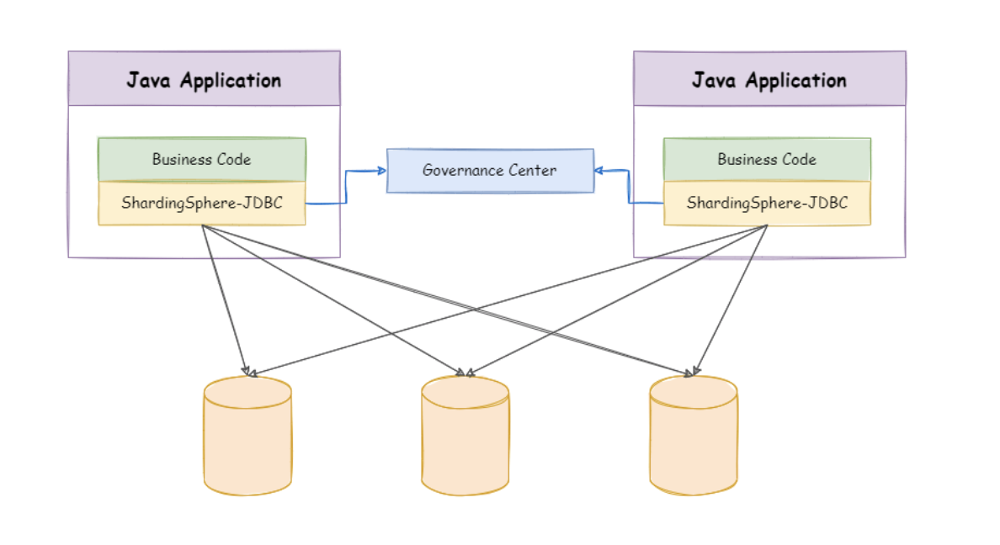

上图展示了Sharding-Jdbc的工作方式，使用Sharding-Jdbc前需要人工对数据库进行分库分表，在应用程序中加入 Sharding-Jdbc的Jar包，应用程序通过Sharding-Jdbc操作分库分表后的数据库和数据表，由于Sharding-Jdbc是对 Jdbc驱动的增强，使用Sharding-Jdbc就像使用Jdbc驱动一样，在应用程序中是无需指定具体要操作的分库和分表 的。


## 2.Sharding-JDBC快速入门

### 2.1 需求说明

本章节使用Sharding-JDBC完成对订单表的水平分表，通过快速入门程序的开发，快速体验Sharding-JDBC的使用 方法。

人工创建两张表，t_order_1和t_order_2，这两张表是订单表拆分后的表，通过Sharding-Jdbc向订单表插入数据， 按照一定的分片规则，主键为偶数的进入t_order_1，另一部分数据进入t_order_2，通过Sharding-Jdbc 查询数 据，根据 SQL语句的内容从t_order_1或t_order_2查询数据。


### 2.2.环境搭建

#### 2.2.2 创建数据库

```sql

CREATE DATABASE `db1` CHARACTER SET 'utf8' COLLATE 'utf8_general_ci';
-- auto-generated definition
create table t_order_1
(
    order_id bigint         not null comment '订单id'
        primary key,
    price    decimal(10, 2) not null comment '订单价格',
    user_id  bigint         not null comment '下单用户id',
    status   varchar(50)    not null comment '订单状态'
)
    charset = utf8mb4
    row_format = DYNAMIC;

-- auto-generated definition
create table t_order_2
(
    order_id bigint         not null comment '订单id'
        primary key,
    price    decimal(10, 2) not null comment '订单价格',
    user_id  bigint         not null comment '下单用户id',
    status   varchar(50)    not null comment '订单状态'
)
    charset = utf8mb4
    row_format = DYNAMIC;
```

#### 2.2.3.引入maven依赖

> 见GitHub的详细工程代码：https://github.com/WheatJack/JavaStudyProject/tree/master/ShardingJDBCStudy

```xml
 <dependency>
            <groupId>org.apache.shardingsphere</groupId>
            <artifactId>sharding-jdbc-spring-boot-starter</artifactId>
            <version>4.1.1</version>
        </dependency>
```

详细的CRUD见：GitHub的详细工程代码：https://github.com/WheatJack/JavaStudyProject/tree/master/ShardingJDBCStudy

### 	2.4.流程分析

通过日志分析，Sharding-JDBC在拿到用户要执行的sql之后干了哪些事儿:

1. 解析sql，获取**片键值**，在本例中是order_id
2. Sharding-JDBC通过规则配置 t_order_$->{order_id % 2 + 1}，知道了当order_id为偶数时，应该往 t_order_1表插数据，为奇数时，往t_order_2插数据。
3. 于是Sharding-JDBC根据order_id的值改写sql语句，改写后的SQL语句是真实所要执行的SQL语句。 
4. 执行改写后的真实sql语
5. 将所有真正执行sql的结果进行汇总合并，返回。

### 2.5.其他集成方式

Sharding-JDBC不仅可以与spring boot良好集成，它还支持其他配置方式，共支持以下四种集成方式。

**Java 配置**

添加配置类:

```java
package com.example.shardingjdbcstudy.config;

import com.alibaba.druid.pool.DruidDataSource;
import org.apache.shardingsphere.api.config.sharding.KeyGeneratorConfiguration;
import org.apache.shardingsphere.api.config.sharding.ShardingRuleConfiguration;
import org.apache.shardingsphere.api.config.sharding.TableRuleConfiguration;
import org.apache.shardingsphere.api.config.sharding.strategy.InlineShardingStrategyConfiguration;
import org.apache.shardingsphere.shardingjdbc.api.ShardingDataSourceFactory;
import org.springframework.context.annotation.Bean;
import org.springframework.context.annotation.Configuration;

import javax.sql.DataSource;
import java.sql.SQLException;
import java.util.HashMap;
import java.util.Map;
import java.util.Properties;

/**
 * <p>
 * JDBC的代码配置
 * </p>
 *
 * @author JackGao
 * @since 11/18/23
 **/
@Configuration
public class ShardingJdbcConfig {
    /**
     * <p> 定义数据源 <p>
     *
     * @author JackGao
     * @since 11/18/23 16:46
     */
    Map<String, DataSource> createDataSourceMap() {
        DruidDataSource dataSource1 = new DruidDataSource();
        dataSource1.setDriverClassName("com.mysql.jdbc.Driver");
        dataSource1.setUrl("jdbc:mysql://localhost:3306/order_db?useUnicode=true");
        dataSource1.setUsername("root");
        dataSource1.setPassword("root");
        Map<String, DataSource> result = new HashMap<>();
        result.put("m1", dataSource1);
        return result;
    }

    /**
     * <p> 定义主键生成策略 <p>
     *
     * @author JackGao
     * @since 11/18/23 16:47
     */
    private static KeyGeneratorConfiguration getKeyGeneratorConfiguration() {
        return new
                KeyGeneratorConfiguration("SNOWFLAKE", "order_id");
    }

    /**
     * <p> 定义t_order表的分片策略 <p>
     *
     * @author JackGao
     * @since 11/18/23 16:47
     */
    TableRuleConfiguration getOrderTableRuleConfiguration() {
        TableRuleConfiguration result = new TableRuleConfiguration("t_order", "m1.t_order_$‐> {1..2} ");
        result.setTableShardingStrategyConfig(new
                InlineShardingStrategyConfiguration("order_id", "t_order_$‐>{order_id % 2 + 1}"));
        result.setKeyGeneratorConfig(getKeyGeneratorConfiguration());
        return result;
    }

    /**
     * <p> 定义sharding‐Jdbc数据源 <p>
     *
     * @author JackGao
     * @since 11/18/23 16:48
     */
    @Bean
    DataSource getShardingDataSource() throws SQLException {
        ShardingRuleConfiguration shardingRuleConfig = new ShardingRuleConfiguration();
        shardingRuleConfig.getTableRuleConfigs().add(getOrderTableRuleConfiguration());
        //spring.shardingsphere.props.sql.show = true
        Properties properties = new Properties();
        properties.put("sql.show", "true");
        return ShardingDataSourceFactory.createDataSource(createDataSourceMap(), shardingRuleConfig, properties);
    }


}	
```

由于采用了配置类所以需要屏蔽原来application.properties文件中spring.shardingsphere开头的配置信息。 还需要在SpringBoot启动类中屏蔽使用spring.shardingsphere配置项的类:

```java

/**
 * <p> 如果使用Java配置类的方法配置类 ShardingJdbc 那么需要屏蔽shardingJdbc的自己的配置类
 * 切记是该包下：import org.apache.shardingsphere.shardingjdbc.spring.boot.SpringBootConfiguration;
 * <p>
 * @author JackGao
 * @since 11/18/23 16:54
 */
@SpringBootApplication(exclude = {SpringBootConfiguration.class})
public class ShardingJdbcStudyApplication {

    public static void main(String[] args) {
        SpringApplication.run(ShardingJdbcStudyApplication.class, args);
    }

}
```


## 3.Sharding-JDBC执行原理

### 3.1 基本概念

在了解Sharding-JDBC的执行原理前，需要了解以下概念:

**逻辑表：**水平拆分的数据表的总称。例:订单数据表根据主键尾数拆分为10张表，分别是 t_order_0 、 t_order_1 到 t_order_9 ，他们的逻辑表名为 t_order 。

**真实表：**在分片的数据库中真实存在的物理表。即上个示例中的 t_order_0 到 t_order_9 。

**数据节点：**数据分片的最小物理单元。由数据源名称和数据表组成，例: database1.t_order_0 。

**绑定表：**指分片规则一致的主表和子表。例如: t_order 表和 t_order_item 表，均按照 order_id 分片,绑定表之间的分区 键完全相同，则此两张表互为绑定表关系。绑定表之间的多表关联查询不会出现笛卡尔积关联，关联查询效率将大 大提升。举例说明，如果SQL为:

```sql
SELECT i.* FROM t_order o JOIN t_order_item i ON o.order_id=i.order_id WHERE o.order_id in (10,
   11);
```

在不配置绑定表关系时，假设分片键 order_id 将数值10路由至第0片，将数值11路由至第1片，那么路由后的SQL 应该为4条，它们呈现为笛卡尔积:

```sql
SELECT i.* FROM t_order_0 o JOIN t_order_item_0 i ON o.order_id=i.order_id WHERE o.order_id in
   (10, 11);
   SELECT i.* FROM t_order_0 o JOIN t_order_item_1 i ON o.order_id=i.order_id WHERE o.order_id in
   (10, 11);
   SELECT i.* FROM t_order_1 o JOIN t_order_item_0 i ON o.order_id=i.order_id WHERE o.order_id in
   (10, 11);
   SELECT i.* FROM t_order_1 o JOIN t_order_item_1 i ON o.order_id=i.order_id WHERE o.order_id in
   (10, 11);
```

在配置绑定表关系后，路由的SQL应该为2条:

```sql
SELECT i.* FROM t_order_0 o JOIN t_order_item_0 i ON o.order_id=i.order_id WHERE o.order_id in
   (10, 11);
   SELECT i.* FROM t_order_1 o JOIN t_order_item_1 i ON o.order_id=i.order_id WHERE o.order_id in
(10, 11);
```

**广播表：**指所有的分片数据源中都存在的表，表结构和表中的数据在每个数据库中均完全一致。适用于数据量不大且需要与海量数据的表进行关联查询的场景，例如:字典表。

**分片键：**用于分片的数据库字段，是将数据库(表)水平拆分的关键字段。例:将订单表中的订单主键的尾数取模分片，则订单主键为分片字段。 SQL中如果无分片字段，将执行全路由，性能较差。 除了对单分片字段的支持，Sharding- Jdbc也支持根据多个字段进行分片。

**分片算法：**通过分片算法将数据分片，支持通过 = 、 BETWEEN 和 IN 分片。分片算法需要应用方开发者自行实现，可实现的灵活度非常高。包括:精确分片算法 、范围分片算法 ，复合分片算法 等。例如:where order_id = ? 将采用精确分片算法，where order_id in (?,?,?)将采用精确分片算法，where order_id BETWEEN ? and ? 将采用范围分片算 法，复合分片算法用于分片键有多个复杂情况。

**分片策略：**包含分片键和分片算法，由于分片算法的独立性，将其独立抽离。真正可用于分片操作的是分片键 + 分片算法，也 就是分片策略。内置的分片策略大致可分为尾数取模、哈希、范围、标签、时间等。由用户方配置的分片策略则更 加灵活，常用的使用行表达式配置分片策略，它采用**Groovy**表达式表示，如: t_user_$->{u_id % 8} 表示t_user 表根据u_id模8，而分成8张表，表名称为 t_user_0 到 t_user_7 。

**自增主键生成策略：**通过在客户端生成自增主键替换以数据库原生自增主键的方式，做到分布式主键无重复。


### 3.2.SQL解析

当Sharding-JDBC接受到一条SQL语句时，会陆续执行 SQL解析 => 查询优化 => SQL路由 => SQL改写 => SQL执行 =>结果归并 ，最终返回执行结果。

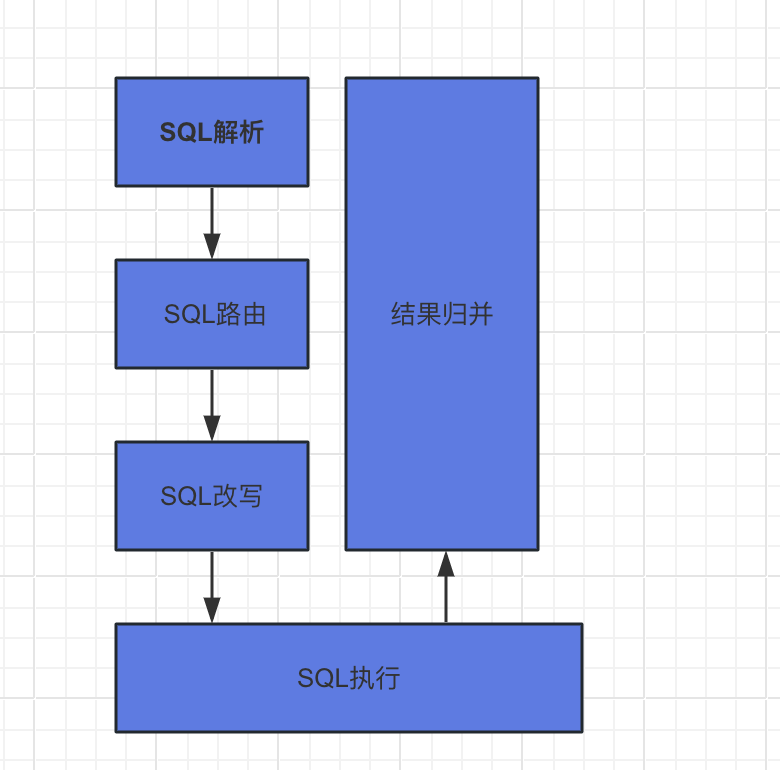

SQL解析过程分为词法解析和语法解析。 词法解析器用于将SQL拆解为不可再分的原子符号，称为Token。并根据 不同数据库方言所提供的字典，将其归类为关键字，表达式，字面量和操作符。 再使用语法解析器将SQL转换为抽 象语法树。

解析之后的为抽象语法树见下图:

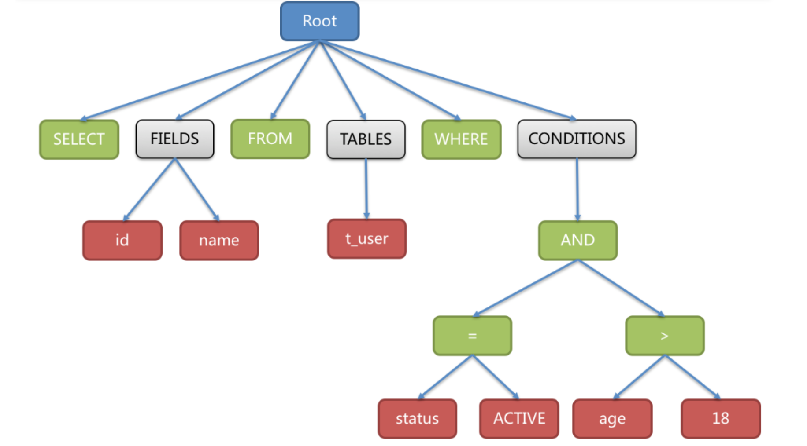

为了便于理解，抽象语法树中的**关键字的Token用绿色表示**，**变量的Token用红色表示**，灰色表示需要进一步拆分。

最后，通过对抽象语法树的遍历去提炼分片所需的上下文，并标记有可能需要SQL改写(后边介绍)的位置。 供分片 使用的解析上下文包含查询选择项(Select Items)、表信息(Table)、分片条件(Sharding Condition)、自增 主键信息(Auto increment Primary Key)、排序信息(Order By)、分组信息(Group By)以及分页信息 (Limit、Rownum、Top)。


### 3.3.SQL路由

SQL路由就是把针对**逻辑表**的数据操作映射到对数据结点操作的过程。

根据解析上下文匹配数据库和表的分片策略，并生成路由路径。 对于携带分片键的SQL，根据分片键操作符不同可 以划分为单片路由(分片键的操作符是等号)、多片路由(分片键的操作符是IN)和范围路由(分片键的操作符是 BETWEEN)，不携带分片键的SQL则采用广播路由。根据分片键进行路由的场景可分为直接路由、标准路由、笛卡 尔路由等。

#### 标准路由

标准路由是Sharding-Jdbc最为推荐使用的分片方式，它的适用范围是不包含关联查询或仅包含绑定表之间关联查 询的SQL。 当分片运算符是等于号时，路由结果将落入单库(表)，当分片运算符是BETWEEN或IN时，则路由结 果不一定落入唯一的库(表)，因此一条逻辑SQL最终可能被拆分为多条用于执行的真实SQL。 举例说明，如果按 照 order_id 的奇数和偶数进行数据分片，一个单表查询的SQL如下:

```sql
SELECT * FROM t_order WHERE order_id IN (1, 2);
```

那么路由的结果应为:

```sql
 SELECT * FROM t_order_0 WHERE order_id IN (1, 2);
 SELECT * FROM t_order_1 WHERE order_id IN (1, 2);
```

绑定表的关联查询与单表查询复杂度和性能相当。举例说明，如果一个包含绑定表的关联查询的SQL如下:

```sql
SELECT * FROM t_order o JOIN t_order_item i ON o.order_id=i.order_id WHERE order_id IN (1, 2);
```

那么路由的结果应为:

```sql
SELECT * FROM t_order_0 o JOIN t_order_item_0 i ON o.order_id=i.order_id  WHERE order_id IN (1,
   2);
   SELECT * FROM t_order_1 o JOIN t_order_item_1 i ON o.order_id=i.order_id  WHERE order_id IN (1,
   2);
```

可以看到，SQL拆分的数目与单表是一致的。

#### 笛卡尔路由

笛卡尔路由是最复杂的情况，它无法根据绑定表的关系定位分片规则，因此非绑定表之间的关联查询需要拆解为笛 卡尔积组合执行。 如果上个示例中的SQL并未配置绑定表关系，那么路由的结果应为:

```sql
 SELECT * FROM t_order_0 o JOIN t_order_item_0 i ON o.order_id=i.order_id  WHERE order_id IN (1,
   2);
   SELECT * FROM t_order_0 o JOIN t_order_item_1 i ON o.order_id=i.order_id  WHERE order_id IN (1,
   2);
   SELECT * FROM t_order_1 o JOIN t_order_item_0 i ON o.order_id=i.order_id  WHERE order_id IN (1,
   2);
   SELECT * FROM t_order_1 o JOIN t_order_item_1 i ON o.order_id=i.order_id  WHERE order_id IN (1,
   2);
```

笛卡尔路由查询性能较低，需谨慎使用。

#### 全库表路由

对于不携带分片键的SQL，则采取广播路由的方式。根据SQL类型又可以划分为全库表路由、全库路由、全实例路 由、单播路由和阻断路由这5种类型。其中全库表路由用于处理对数据库中与其逻辑表相关的所有真实表的操作， 主要包括不带分片键的DQL(数据查询)和DML(数据操纵)，以及DDL(数据定义)等。例如:

```sql
   SELECT * FROM t_order WHERE good_prority IN (1, 10);
```

则会遍历所有数据库中的所有表，逐一匹配逻辑表和真实表名，能够匹配得上则执行。路由后成为

```sql
SELECT * FROM t_order_0 WHERE good_prority IN (1, 10);
   SELECT * FROM t_order_1 WHERE good_prority IN (1, 10);
   SELECT * FROM t_order_2 WHERE good_prority IN (1, 10);
   SELECT * FROM t_order_3 WHERE good_prority IN (1, 10);
```


### 3.4.SQL改写

工程师面向逻辑表书写的SQL，并不能够直接在真实的数据库中执行，SQL改写用于将逻辑SQL改写为在真实数据库中可以正确执行的SQL。

如一个简单的例子，若逻辑SQL为:

```sql
SELECT order_id FROM t_order WHERE order_id=1;
```

假设该SQL配置分片键order_id，并且order_id=1的情况，将路由至分片表1。那么改写之后的SQL应该为:

```sql
   SELECT order_id FROM t_order_1 WHERE order_id=1;
```


再比如，Sharding-JDBC需要在结果归并时获取相应数据，但该数据并未能通过查询的SQL返回。 这种情况主要是 针对GROUP BY和ORDER BY。结果归并时，需要根据 GROUP BY 和 ORDER BY 的字段项进行分组和排序，但如果原 始SQL的选择项中若并未包含分组项或排序项，则需要对原始SQL进行改写。 先看一下原始SQL中带有结果归并所 需信息的场景:

```sql
SELECT order_id, user_id FROM t_order ORDER BY user_id;
```

由于使用user_id进行排序，在结果归并中需要能够获取到user_id的数据，而上面的SQL是能够获取到user_id数据的，因此无需补列。

如果选择项中不包含结果归并时所需的列，则需要进行补列，如以下SQL:

```sql
   SELECT order_id FROM t_order ORDER BY user_id;
```

由于原始SQL中并不包含需要在结果归并中需要获取的user_id，因此需要对SQL进行补列改写。补列之后的SQL 是:

```sql
   SELECT order_id, user_id AS ORDER_BY_DERIVED_0 FROM t_order ORDER BY user_id;
```


### 3.5.SQL执行

Sharding-JDBC采用一套自动化的执行引擎，负责将路由和改写完成之后的真实SQL安全且高效发送到底层数据源 执行。 它不是简单地将SQL通过JDBC直接发送至数据源执行;也并非直接将执行请求放入线程池去并发执行。它 更关注平衡数据源连接创建以及内存占用所产生的消耗，以及最大限度地合理利用并发等问题。 执行引擎的目标是 自动化的平衡资源控制与执行效率，他能在以下两种模式自适应切换:

#### 内存限制模式

使用此模式的前提是，Sharding-JDBC对一次操作所耗费的数据库连接数量不做限制。 如果实际执行的SQL需要对 某数据库实例中的200张表做操作，则对每张表创建一个新的数据库连接，并通过多线程的方式并发处理，以达成 执行效率最大化。

#### 连接限制模式

使用此模式的前提是，Sharding-JDBC严格控制对一次操作所耗费的数据库连接数量。 如果实际执行的SQL需要对 某数据库实例中的200张表做操作，那么只会创建唯一的数据库连接，并对其200张表串行处理。 如果一次操作中 的分片散落在不同的数据库，仍然采用多线程处理对不同库的操作，但每个库的每次操作仍然只创建一个唯一的数 据库连接。

内存限制模式适用于OLAP操作，可以通过放宽对数据库连接的限制提升系统吞吐量; 连接限制模式适用于OLTP操 作，OLTP通常带有分片键，会路由到单一的分片，因此严格控制数据库连接，以保证在线系统数据库资源能够被 更多的应用所使用，是明智的选择。

>   数据处理大致可以分成两大类：联机事务处理OLTP（on-line transaction [processing](https://so.csdn.net/so/search?q=processing&spm=1001.2101.3001.7020)）、联机分析处理OLAP（On-Line Analytical Processing）。OLTP是传统的关系型数据库的主要应用，主要是基本的、日常的事务处理，例如银行交易。OLAP是数据仓库系统的主要应用，支持复杂的分析操作，侧重决策支持，并且提供直观易懂的查询结果。 
>
> **OLTP** 系统强调数据库内存效率，强调内存各种指标的命令率，强调绑定变量，强调并发操作；
> **OLAP** 系统则强调数据分析，强调SQL执行市场，强调磁盘I/O，强调分区等。 


### 3.6.结果归并

将从各个数据节点获取的多数据结果集，组合成为一个结果集并正确的返回至请求客户端，称为结果归并。

Sharding-JDBC支持的结果归并从功能上可分为遍历、排序、分组、分页和聚合5种类型，它们是组合而非互斥的关系。

归并引擎的整体结构划分如下图:

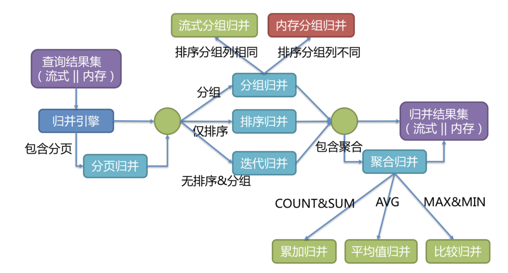

结果归并从结构划分可分为流式归并、内存归并和装饰者归并。流式归并和内存归并是互斥的，装饰者归并可以在 流式归并和内存归并之上做进一步的处理。

**内存归并**很容易理解，他是将所有分片结果集的数据都遍历并存储在内存中，再通过统一的分组、排序以及聚合等 计算之后，再将其封装成为逐条访问的数据结果集返回。

**流式归并**是指每一次从数据库结果集中获取到的数据，都能够通过游标逐条获取的方式返回正确的单条数据，它与 数据库原生的返回结果集的方式最为契合。

下边举例说明排序归并的过程，如下图是一个通过分数进行排序的示例图，它采用流式归并方式。 图中展示了3张 表返回的数据结果集，每个数据结果集已经根据分数排序完毕，但是3个数据结果集之间是无序的。 将3个数据结 果集的当前游标指向的数据值进行排序，并放入优先级队列，t_score_0的第一个数据值最大，t_score_2的第一个 数据值次之，t_score_1的第一个数据值最小，因此优先级队列根据t_score_0，t_score_2和t_score_1的方式排序 队列。

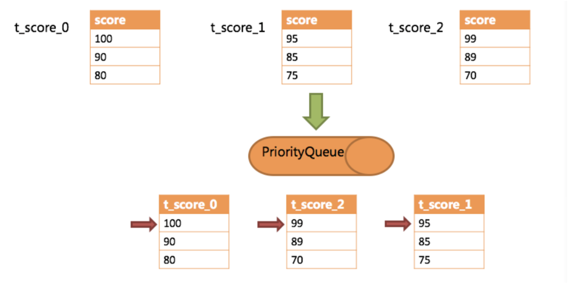

下图则展现了进行next调用的时候，排序归并是如何进行的。 通过图中我们可以看到，当进行第一次next调用 时，排在队列首位的t_score_0将会被弹出队列，并且将当前游标指向的数据值(也就是100)返回至查询客户端， 并且将游标下移一位之后，重新放入优先级队列。 而优先级队列也会根据t_score_0的当前数据结果集指向游标的 数据值(这里是90)进行排序，根据当前数值，t_score_0排列在队列的最后一位。 之前队列中排名第二的 t_score_2的数据结果集则自动排在了队列首位。

在进行第二次next时，只需要将目前排列在队列首位的t_score_2弹出队列，并且将其数据结果集游标指向的值返 回至客户端，并下移游标，继续加入队列排队，以此类推。 当一个结果集中已经没有数据了，则无需再次加入队列。

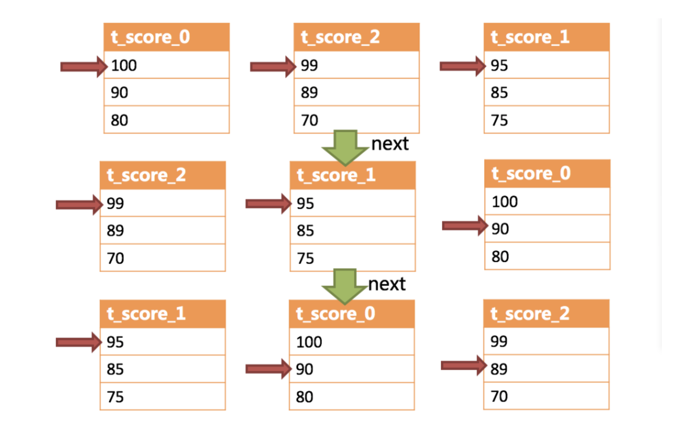

可以看到，对于每个数据结果集中的数据有序，而多数据结果集整体无序的情况下，Sharding-JDBC无需将所有的 数据都加载至内存即可排序。 它使用的是流式归并的方式，每次next仅获取唯一正确的一条数据，极大的节省了 内存的消耗。

**装饰者归并**是对所有的结果集归并进行统一的功能增强，比如归并时需要聚合SUM前，在进行聚合计算前，都会通过内存归并或流式归并查询出结果集。因此，聚合归并是在之前介绍的归并类型之上追加的归并能力，即装饰者模式。


### 3.7 总结

通过以上内容介绍，相信大家已经了解到Sharding-JDBC基础概念、核心功能以及执行原理。 基础概念:逻辑表，真实表，数据节点，绑定表，广播表，分片键，分片算法，分片策略，主键生成策略 核心功能:数据分片，读写分离

执行流程: SQL解析 => 查询优化 => SQL路由 => SQL改写 => SQL执行 => 结果归并 接下来我们将通过一个个demo，来演示Sharding-JDBC实际使用方法。


## 4.水平分表

前面已经介绍过，水平分表是在同一个数据库内，把同一个表的数据按一定规则拆到多个表中。在快速入门里，我 们已经对水平分库进行实现，这里不再重复介绍。


## 5.水平分库

前面已经介绍过，水平分库是把同一个表的数据按一定规则拆到不同的数据库中，每个库可以放在不同的服务器上。接下来看一下如何使用Sharding-JDBC实现水平分库，咱们继续对快速入门中的例子进行完善。

 **(1)将原有order_db库拆分为order_db_1、order_db_2**

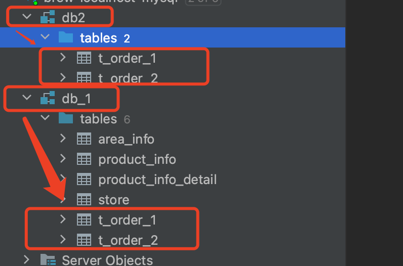


**(2)分片规则修改**

由于数据库拆分了两个，这里需要配置两个数据源。 分库需要配置分库的策略，和分表策略的意义类似，通过分库策略实现数据操作针对分库的数据库进行操作。

```properties
# 定义数据源
spring.shardingsphere.datasource.names=database1,database2
spring.shardingsphere.datasource.database1.type=com.alibaba.druid.pool.DruidDataSource
spring.shardingsphere.datasource.database1.driver‐class‐name=com.mysql.jdbc.Driver
spring.shardingsphere.datasource.database1.url=jdbc:mysql://localhost:3306/db_1?useUnicode=true
spring.shardingsphere.datasource.database1.username=root
spring.shardingsphere.datasource.database1.password=
spring.shardingsphere.datasource.database2.type=com.alibaba.druid.pool.DruidDataSource
spring.shardingsphere.datasource.database2.driver‐class‐name=com.mysql.jdbc.Driver
spring.shardingsphere.datasource.database2.url=jdbc:mysql://localhost:3306/db_2?useUnicode=true
spring.shardingsphere.datasource.database2.username=root
spring.shardingsphere.datasource.database2.password=
# 分库策略
spring.shardingsphere.sharding.tables.t_order.database-strategy.inline.sharding-column=user_id
spring.shardingsphere.sharding.tables.t_order.database-strategy.inline.algorithm-expression=database$->{user_id%2 +1}
# 指定t_order表的数据分布情况，配置数据节点
spring.shardingsphere.sharding.tables.t_order.actual-data-nodes=database$->{1..2}.t_order_$->{1..2}
```

分库策略定义方式如下:

```properties
#分库策略，如何将一个逻辑表映射到多个数据源 spring.shardingsphere.sharding.tables.<逻辑表名称>.database‐strategy.<分片策略>.<分片策略属性名>= # 分片策略属性值

#分表策略，如何将一个逻辑表映射为多个实际表 spring.shardingsphere.sharding.tables.<逻辑表名称>.table‐strategy.<分片策略>.<分片策略属性名>= #分 片策略属性值
```

Sharding-JDBC支持以下几种分片策略:

- **standard:** 标准分片策略，对应StandardShardingStrategy。提供对SQL语句中的=, IN和BETWEEN AND的 分片操作支持。StandardShardingStrategy只支持单分片键，提供PreciseShardingAlgorithm和 RangeShardingAlgorithm两个分片算法。PreciseShardingAlgorithm是必选的，用于处理=和IN的分片。 RangeShardingAlgorithm是可选的，用于处理BETWEEN AND分片，如果不配置 RangeShardingAlgorithm，SQL中的BETWEEN AND将按照全库路由处理。 
- **complex:** 符合分片策略，对应ComplexShardingStrategy。复合分片策略。提供对SQL语句中的=, IN和 BETWEEN AND的分片操作支持。ComplexShardingStrategy支持多分片键，由于多分片键之间的关系复 杂，因此并未进行过多的封装，而是直接将分片键值组合以及分片操作符透传至分片算法，完全由应用开发 者实现，提供最大的灵活度。 
- **inline:** 行表达式分片策略，对应InlineShardingStrategy。使用Groovy的表达式，提供对SQL语句中的=和 IN的分片操作支持，只支持单分片键。对于简单的分片算法，可以通过简单的配置使用，从而避免繁琐的Java 代码开发，如: t_user_$->{u_id % 8} 表示t_user表根据u_id模8，而分成8张表，表名称为 t_user_0 到t_user_7 。 
- **hint:** Hint分片策略，对应HintShardingStrategy。通过Hint而非SQL解析的方式分片的策略。对于分片字段 非SQL决定，而由其他外置条件决定的场景，可使用SQL Hint灵活的注入分片字段。例:内部系统，按照员工 登录主键分库，而数据库中并无此字段。SQL Hint支持通过Java API和SQL注释(待实现)两种方式使用。 
- none:不分片策略，对应NoneShardingStrategy。不分片的策略。

目前例子中都使用inline分片策略，若对其他分片策略细节若感兴趣，请查阅官方文档: https://shardingsphere.apache.org


**(3)插入测试**

修改testInsertOrder方法，插入数据中包含不同的user_id

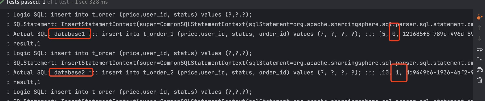

通过日志可以看出，根据user_id的奇偶不同，数据分别落在了不同数据源，达到目标。

**(4)查询测试**

调用快速入门的查询接口进行测试:

```java
    List<Map> selectListById(@Param("orderId") Long orderId);
```

通过日志发现，sharding-jdbc将sql路由到m1和m2:

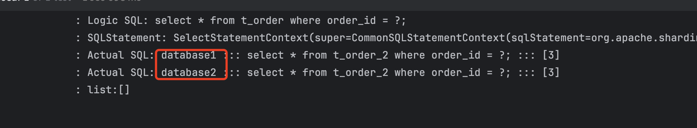

问题分析: 由于查询语句中并没有使用分片键user_id，所以sharding-jdbc将广播路由到每个数据结点。 

> **库的分片键是用的userId**

下边我们在sql中添加分片键进行查询。

```java
 @Test
    public void selectListByUserId() {
        List<Map> maps = orderMapper.selectListByUserIdAndOrderId(3L,932765075595329537L);
        log.info("list:{}", maps);
    }
```

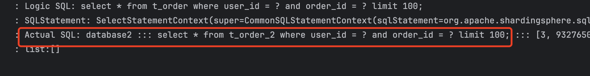

查询条件user_id为3，根据分片策略m$->{user_id % 2 + 1}计算得出database2，此sharding-jdbc将sql路由到database2，见上 图日志。


## 6.垂直分库

前面已经介绍过，垂直分库是指按照业务将表进行分类，分布到不同的数据库上面，每个库可以放在不同的服务器上，它的核心理念是专库专用。接下来看一下如何使用Sharding-JDBC实现垂直分库。

**(1)创建数据库**

创建数据库user_db

```mysql
CREATE DATABASE `user_db` CHARACTER SET 'utf8' COLLATE 'utf8_general_ci';
```

在user_db中创建t_user表

```mysql
-- auto-generated definition
create table t_user
(
    user_id   bigint       not null comment '用户id'
        primary key,
    fullname  varchar(255) not null comment '用户姓名',
    user_type char         null comment '用户类型'
)
    row_format = DYNAMIC;

```

新增单元测试方法:

```java

@Mapper
public interface UserMapper {

    @Insert("INSERT INTO user_db.t_user (user_id, fullname, user_type) VALUES (#{user_id}, #{fullname}, #{user_type});")
    Integer insertUser(@Param("user_id") Long userId,@Param("fullname") String fullName,@Param("user_type") String userType);

}

@Test
    public void testInsertUser() {
        for (int i = 0; i < 10; i++) {
            Integer i1 = userMapper.insertUser(Long.parseLong(String.valueOf(i + 99)), UUID.randomUUID().toString(), String.valueOf(i));
            log.info("result,{}", i1);
        }
    }

```

新增properties

```properties
# 固定分配至database3的t_user真实表 ---- t_user分表策略，固定分配至database3的t_user真实表
spring.shardingsphere.sharding.tables.t_user.actual-data-nodes=database3.t_user
spring.shardingsphere.sharding.tables.t_user.table-strategy..inline.sharding-column=user_id
spring.shardingsphere.sharding.tables.t_user.table-strategy..inline..algorithm-expression=t_user

spring.shardingsphere.datasource.database3.type=com.alibaba.druid.pool.DruidDataSource
spring.shardingsphere.datasource.database3.driver‐class‐name=com.mysql.jdbc.Driver
spring.shardingsphere.datasource.database3.url=jdbc:mysql://localhost:3306/user_db?useUnicode=true
spring.shardingsphere.datasource.database3.username=root
spring.shardingsphere.datasource.database3.password=
```

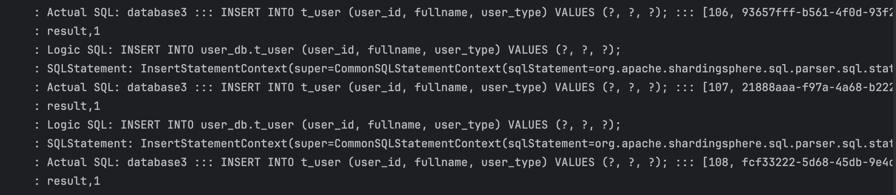


## 7.公共表

公共表属于系统中数据量较小，变动少，而且属于高频联合查询的依赖表。参数表、数据字典表等属于此类型。可 以将这类表在每个数据库都保存一份，所有更新操作都同时发送到所有分库执行。接下来看一下如何使用 Sharding-JDBC实现公共表。

分别在user_db、order_db_1、order_db_2中创建t_dict表:

```mysql
-- auto-generated definition
create table t_dict
(
    dict_id bigint      not null comment '字典id'
        primary key,
    type    varchar(50) not null comment '字典类型',
    code    varchar(50) not null comment '字典编码',
    value   varchar(50) not null comment '字典值'
);
```

新增properties配置

```properties
# 公共表 广播模式处理 可以配置多个公共表
spring.shardingsphere.sharding.broadcast‐tables=t_dict
```

新增测试：

```java

    @Test
    public void testInsertUser() {
        for (int i = 0; i < 10; i++) {
            Integer i1 = dictMapper.insertDict(Long.parseLong(String.valueOf(i + 99)), UUID.randomUUID().toString(), UUID.randomUUID().toString(), String.valueOf(i));
            log.info("result,{}", i1);
        }
    }
    
    @Insert("INSERT INTO t_dict (dict_id, type, code,value) VALUES (#{dict_id},#{type}, #{code}, #{value});")
    Integer insertDict(@Param("dict_id") Long dictId, @Param("type") String type, @Param("code") String code, @Param("value") String value);

```

测试结果：

同时像多个库中插入数据

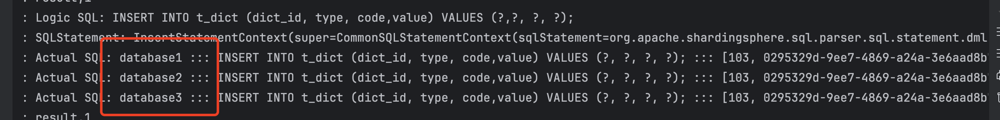

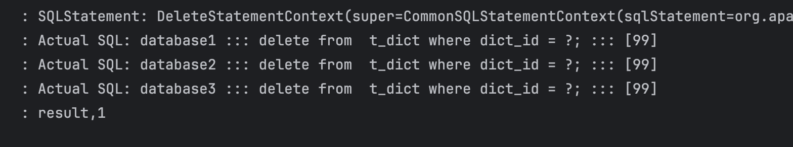

通过日志可以看出，对t_dict的表的操作被广播至所有数据源。 测试删除字典，观察是否把所有数据源中该 公共表的记录删除。


## 8.读写分离

### 8.1 理解读写分离

面对日益增加的系统访问量，数据库的吞吐量面临着巨大瓶颈。 对于同一时刻有大量并发读操作和较少写操作类型的应用系统来说，将数据库拆分为主库和从库，主库负责处理事务性的增删改操作，从库负责处理查询操作，能够有效的避免由数据更新**导致的行锁**，使得整个系统的查询性能得到极大的改善。

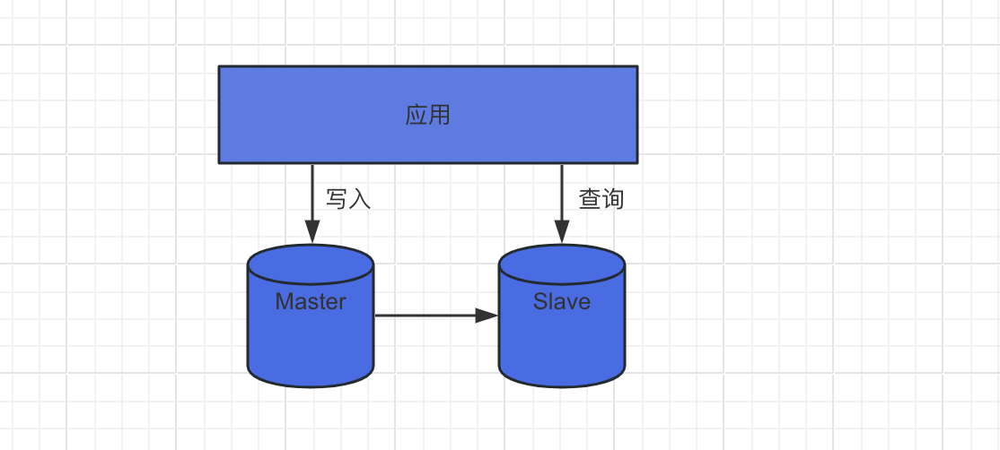

通过一主多从的配置方式，可以将查询请求均匀的分散到多个数据副本，能够进一步的提升系统的处理能力。 使用**多主多从**的方式，不但能够提升系统的吞吐量，还能够提升系统的可用性，可以达到在任何一个数据库宕机，甚至磁盘物理损坏的情况下仍然不影响系统的正常运行。

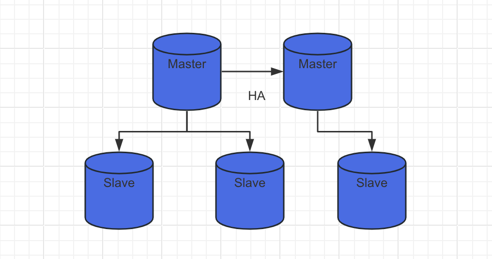


**读写分离的数据节点中的数据内容是一致的**，而**水平分片的每个数据节点的数据内容却并不相同**。将水平分片和读写分离联合使用，能够更加有效的提升系统的性能。

Sharding-JDBC读写分离则是根据SQL语义的分析，将读操作和写操作分别路由至主库与从库。它提供透明化读写分离，让使用方尽量像使用一个数据库一样使用主从数据库集群。

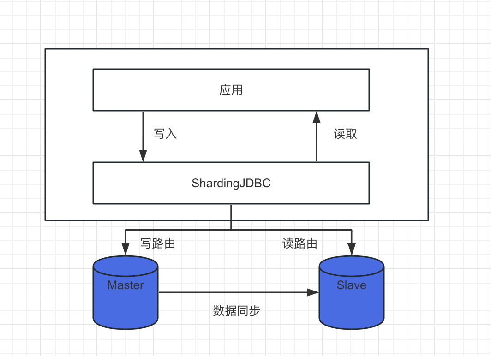


Sharding-JDBC提供一主多从的读写分离配置，可独立使用，也可配合分库分表使用，同一线程且同一数据库连接 内，如有写入操作，以后的读操作均从主库读取，用于保证数据一致性。Sharding-JDBC不提供主从数据库的数据 同步功能，需要采用其他机制支持。


接下来，咱们对上面例子中user_db进行读写分离实现。为了实现Sharding-JDBC的读写分离，首先，要进行 mysql的主从同步配置。


### 8.2.mysql主从同步(Mac And Linux)

> 我这边的master节点的宿主机是Mac，然后slave节点是VM 装的centos7
>
> 然后mysql 的版本都是8版本

**Master节点配置**

> brew 默认安装的位置在/usr/local/etc
>
> 记得下面的配置都是在[mysqld]这个节点下面👇

```ini
[mysqld]
# 开启同步
log-bin=mysql-bin
# 设置服务id 这个服务id必须和slave节点都不一致 需要唯一性
server-id = 3
# 需要同步的数据库
binlog-do-db=user_db
# 忽略同步的数据库 mysql默认自带的设置不同步
binlog-ignore-db=mysql
binlog-ignore-db=information_schema
binlog-ignore-db=performance_schema
```

新增主从同步专用的用户

```SQL
CREATE USER 'db_sync'@'%' IDENTIFIED BY 'JackGao5210....';
# MYSQL8.0
alter user 'db_sync'@'%'  IDENTIFIED with mysql_native_password by 'JackGao5210....';
GRANT REPLICATION SLAVE, REPLICATION CLIENT ON *.* TO 'db_sync'@'%';
FLUSH PRIVILEGES;
show variables like 'server_id';

```

查看binlog文件的名称和所同步的position

```sql
reset master;
show master status;
```

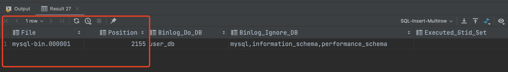


**Slave节点配置**

修改**slave**的mysql的ini文件信息

```ini
log-bin = mysql-bin
server-id = 1
replicate_wild_do_table=user_db.%
replicate_wild_ignore_table=mysql.% 
replicate_wild_ignore_table=information_schema.% 
replicate_wild_ignore_table=performance_schema.%
```

设置同步信息 执行sql

```sql
# 停止slave节点
stop slave ;
stop replica ;
# 更改master节点同步信息
CHANGE MASTER TO
    master_host = '192.168.0.101',
    master_user = 'db_sync', 
    master_password = 'JackGao5210....', 
    master_log_file = 'mysql-bin.000001', # master节点 同步的binlog文件名称
    master_log_pos = 157;   # master节点 同步的binlog文件 的位置
# 开启slave
start slave ;
start replica ;
# 查看当前slave节点的信息
show slave status;    
```

两个状态都为Yes表示成功

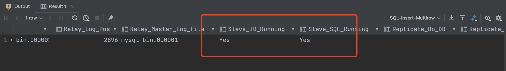


### 8.3.实现sharding-jdbc读写分离

**properties配置**

```properties
# 定义数据源 增加数据源
spring.shardingsphere.datasource.names=database1,database2,database3,database4
spring.shardingsphere.datasource.database4.type=com.alibaba.druid.pool.DruidDataSource
spring.shardingsphere.datasource.database4.driver‐class‐name=com.mysql.jdbc.Driver
spring.shardingsphere.datasource.database4.url=jdbc:mysql://xxxxxxx:3306/user_db?useUnicode=true
spring.shardingsphere.datasource.database4.username=xxxxx
spring.shardingsphere.datasource.database4.password=xxxxx


# 主从库配置 ds ds0 自己定义的 不重复  database4 主库 负责写操作 database3 从库 负责读操作
spring.shardingsphere.sharding.master-slave-rules.ds0.master-data-source-name=database4
spring.shardingsphere.sharding.master-slave-rules.ds0.slave-data-source-names=database3

# 固定分配至database3的t_user真实表 ---- t_user分表策略，固定分配至database3的t_user真实表 这里实际的node要改成读写分离那个定义的ds0
spring.shardingsphere.sharding.tables.t_user.actual-data-nodes=ds0.t_user
```

> 注意点 原来t_user 这个是指定的database3 所以这次要把这个改成 上面读写分离的ds0

**测试读写分离**

```java
// 新增数据   
@Test
    public void testInsertUser() {
        for (int i = 0; i < 10; i++) {
            Integer i1 = userMapper.insertUser(Long.parseLong(String.valueOf(i + 99)), UUID.randomUUID().toString(), String.valueOf(i));
            log.info("result,{}", i1);
        }
    }
```

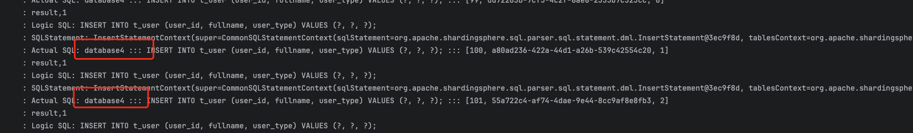

> 发现都已经插入到master节点中去了

```java
// 查询数据
@Test
public void testSelectUserByUserId() {
    Map map = userMapper.selectUserByUserId(99L);
    log.info("result,{}", map);
}
```

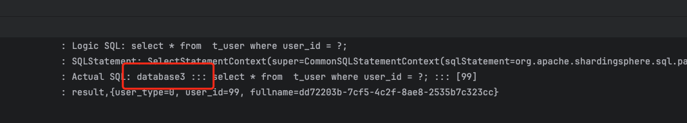

>  发现是从slave中查询数据

