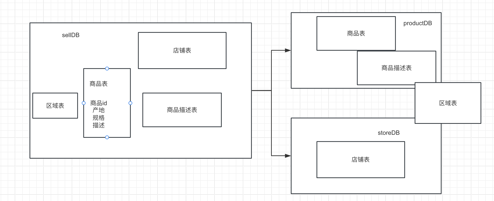
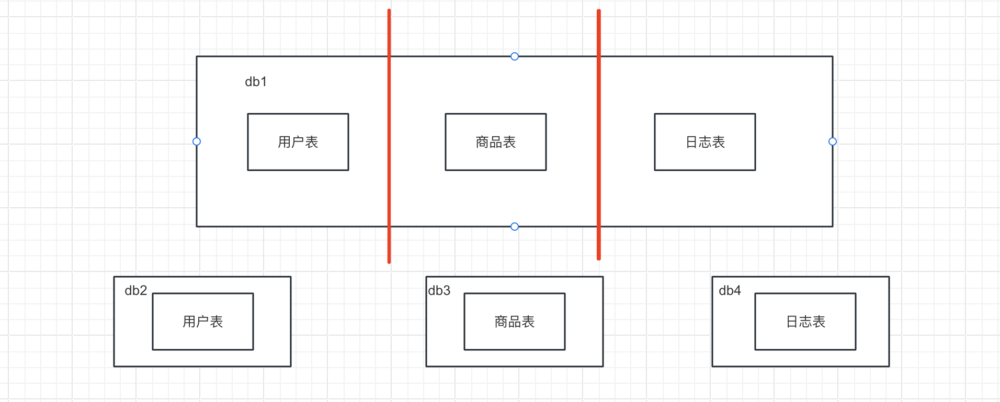

# ShardingJDBC学习

> 官网地址：https://shardingsphere.apache.org

## 1、概述

### 1.1.分库分表是什么

小明是一家初创电商平台的开发人员，他负责卖家模块的功能开发，其中涉及了店铺、商品的相关业务，设计如下数据库:


通过以下SQL能够获取到商品相关的店铺信息、地理区域信息:

```sql
SELECT p.*,r.[地理区域名称],s.[店铺名称],s.[信誉] FROM [商品信息] p
LEFT JOIN [地理区域] r ON p.[产地] = r.[地理区域编码] LEFT JOIN [店铺信息] s ON p.id = s.[所属店铺]
WHERE p.id = ?
```

随着公司业务快速发展，数据库中的数据量猛增，访问性能也变慢了，优化迫在眉睫。分析一下问题出现在哪儿 呢? 关系型数据库本身比较容易成为系统瓶颈，单机存储容量、连接数、处理能力都有限。当单表的数据量达到 1000W或100G以后，由于查询维度较多，即使添加从库、优化索引，做很多操作时性能仍下降严重。

方案1:

通过提升服务器硬件能力来提高数据处理能力，比如增加存储容量 、CPU等，这种方案成本很高，并且如果瓶颈在MySQL本身那么提高硬件也是有很的。

方案2:

把数据分散在不同的数据库中，使得单一数据库的数据量变小来缓解单一数据库的性能问题，从而达到提升数据库性能的目的，如下图:将电商数据库拆分为若干独立的数据库，并且对于大表也拆分为若干小表，通过这种数据库拆分的方法来解决数据库的性能问题。



分库分表就是为了解决由于数据量过大而导致数据库性能降低的问题，将原来独立的数据库拆分成若干数据库组成，将数据大表拆分成若干数据表组成，使得单一数据库、单一数据表的数据量变小，从而达到提升数据库性能的目的。


### 1.2.分库分表的方式

分库分表包括分库和分表两个部分，在生产中通常包括:垂直分库、水平分库、垂直分表、水平分表四种方式。

#### 1.2.1.垂直分表

下边通过一个商品查询的案例讲解垂直分表:

通常在商品列表中是不显示商品详情信息的，如下图:

用户在浏览商品列表时，只有对某商品感兴趣时才会查看该商品的详细描述。因此，商品信息中商品描述字段访问 频次较低，且该字段存储占用空间较大，访问单个数据IO时间较长;商品信息中商品名称、商品图片、商品价格等 其他字段数据访问频次较高。

由于这两种数据的特性不一样，因此他考虑将商品信息表拆分如下:

将访问频次低的商品描述信息单独存放在一张表中，访问频次较高的商品基本信息单独放在一张表中。


商品列表可采用以下sql:

```sql
SELECT p.*,r.[地理区域名称],s.[店铺名称],s.[信誉] FROM [商品信息] p

LEFT JOIN [地理区域] r ON p.[产地] = r.[地理区域编码] LEFT JOIN [店铺信息] s ON p.id = s.[所属店铺] WHERE...ORDER BY...LIMIT...
```

需要获取商品描述时，再通过以下sql获取:

```sql
SELECT *
FROM [商品描述] WHERE [商品ID] = ?
```

小明进行的这一步优化，就叫垂直分表。

> 就是把一张表横过来 然后 竖着（垂直）切分 一分为二


它带来的提升是: 

1. 为了避免IO争抢并减少锁表的几率，查看详情的用户与商品信息浏览互不影响 
2. 充分发挥热门数据的操作效率，商品信息的操作的高效率不会被商品描述的低效率所拖累。

一般来说，某业务实体中的各个数据项的访问频次是不一样的，部分数据项可能是占用存储空间比较大的BLOB或 是TEXT。例如上例中的商品描述。所以，当表数据量很大时，可以将表按字段切开，将热门字段、冷门字段分开放 置在不同库中，这些库可以放在不同的存储设备上，避免IO争抢。垂直切分带来的性能提升主要集中在热门数据的 操作效率上，而且磁盘争用情况减少。

通常我们按以下原则进行垂直拆分:

1. 把不常用的字段单独放在一张表;
2. 把text，blob等大字段拆分出来放在附表中; 3. 经常组合查询的列放在一张表中;


#### 1.2.2.垂直分库

通过垂直分表性能得到了一定程度的提升，但是还没有达到要求，并且磁盘空间也快不够了，因为数据还是始终限 制在一台服务器，库内垂直分表只解决了单一表数据量过大的问题，但没有将表分布到不同的服务器上，因此每个 表还是竞争同一个物理机的CPU、内存、网络IO、磁盘。

经过思考，他把原有的SELLER_DB(卖家库)，分为了PRODUCT_DB(商品库)和STORE_DB(店铺库)，并把这两个库分 散到不同服务器，如下图:


由于商品信息与商品描述业务耦合度较高，因此一起被存放在PRODUCT_DB(商品库);而店铺信息相对独立，因此 单独被存放在STORE_DB(店铺库)。

小明进行的这一步优化，就叫**垂直分库。**

> 把原本属于一个库里的表按照业务划分成三个数据库



垂直分库是指按照业务将表进行分类，分布到不同的数据库上面，每个库可以放在不同的服务器上，它的核心理念是专库专用。

它带来的提升是:

- 解决业务层面的耦合，业务清晰 
- 能对不同业务的数据进行分级管理、维护、监控、扩展等 
- 高并发场景下，垂直分库一定程度的提升IO、数据库连接数、降低单机硬件资源的瓶颈

垂直分库通过将表按业务分类，然后分布在不同数据库，并且可以将这些数据库部署在不同服务器上，从而达到多个服务器共同分摊压力的效果，但是依然没有解决单表数据量过大的问题。


#### 1.2.3.水平分库

> 数据表结构完全一致，只是把数据按照规则划分到不同的数据库

经过垂直分库后，数据库性能问题得到一定程度的解决，但是随着业务量的增长，PRODUCT_DB(商品库)单库存储 数据已经超出预估。粗略估计，目前有8w店铺，每个店铺平均150个不同规格的商品，再算上增长，那商品数量得 往1500w+上预估，并且PRODUCT_DB(商品库)属于访问非常频繁的资源，单台服务器已经无法支撑。此时该如何优化?

再次分库?但是从业务角度分析，目前情况已经无法再次垂直分库。 尝试水平分库，将店铺ID为单数的和店铺ID为双数的商品信息分别放在两个库中。


