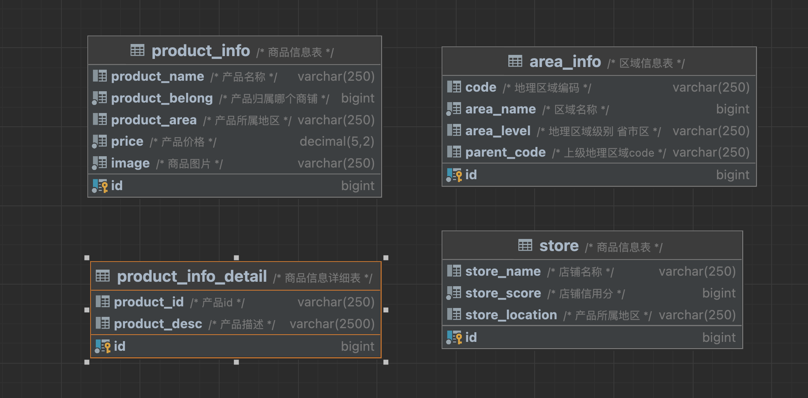

# 分库分表学习

## 1、概述

### 1.1.分库分表是什么

小明是一家初创电商平台的开发人员，他负责卖家模块的功能开发，其中涉及了店铺、商品的相关业务，设计如下数据库:


通过以下SQL能够获取到商品相关的店铺信息、地理区域信息:

```sql
SELECT p.*,r.[地理区域名称],s.[店铺名称],s.[信誉] FROM [商品信息] p
LEFT JOIN [地理区域] r ON p.[产地] = r.[地理区域编码] LEFT JOIN [店铺信息] s ON p.id = s.[所属店铺]
WHERE p.id = ?
```

```sql
    create table product_info
    (
        id             bigint primary key not null,
        product_name   varchar(250)       null comment '产品名称',
        product_belong bigint             not null comment '产品归属哪个商铺',
        product_area   varchar(250)       null comment '产品所属地区',
        price          decimal(5, 2)      not null comment '产品价格',
        image          varchar(250)       not null comment '商品图片',
        product_desc   varchar(2500)      null comment '产品描述'
    ) comment '商品信息表';
    
        create table store
    (
        id             bigint primary key not null,
        store_name     varchar(250)       null comment '店铺名称',
        store_score    bigint             not null comment '店铺信用分',
        store_location varchar(250)       null comment '产品所属地区'
    ) comment '店铺信息表';
    
        create table area_info
    (
        id             bigint primary key not null,
        code     varchar(250)       null comment '地理区域编码',
        area_name    bigint             not null comment '区域名称',
        area_level varchar(250)       null comment '地理区域级别 省市区',
        parent_code varchar(250) comment '上级地理区域code'
    ) comment '区域信息表';

```

随着公司业务快速发展，数据库中的数据量猛增，访问性能也变慢了，优化迫在眉睫。分析一下问题出现在哪儿 呢? 关系型数据库本身比较容易成为系统瓶颈，单机存储容量、连接数、处理能力都有限。当单表的数据量达到 **1000W**或100G以后，由于查询维度较多，即使添加从库、优化索引，做很多操作时性能仍下降严重。

方案1:

通过提升服务器硬件能力来提高数据处理能力，比如增加存储容量 、CPU等，这种方案成本很高，并且如果瓶颈在MySQL本身那么提高硬件也是有很的。

方案2:

把数据分散在不同的数据库中，使得单一数据库的数据量变小来缓解单一数据库的性能问题，从而达到提升数据库性能的目的，如下图:将电商数据库拆分为若干独立的数据库，并且对于大表也拆分为若干小表，通过这种数据库拆分的方法来解决数据库的性能问题。


分库分表就是为了解决由于数据量过大而导致数据库性能降低的问题，将原来独立的数据库拆分成若干数据库组成，将数据大表拆分成若干数据表组成，使得单一数据库、单一数据表的数据量变小，从而达到提升数据库性能的目的。


### 1.2.分库分表的方式

分库分表包括分库和分表两个部分，在生产中通常包括:垂直分库、水平分库、垂直分表、水平分表四种方式。

#### 1.2.1.垂直分表

下边通过一个商品查询的案例讲解垂直分表:

通常在商品列表中是不显示商品详情信息的，如下图:

用户在浏览商品列表时，只有对某商品感兴趣时才会查看该商品的详细描述。因此，商品信息中商品描述字段访问 频次较低，且该字段存储占用空间较大，访问单个数据IO时间较长;商品信息中商品名称、商品图片、商品价格等 其他字段数据访问频次较高。

由于这两种数据的特性不一样，因此他考虑将商品信息表拆分如下:

将访问频次低的商品描述信息单独存放在一张表中，访问频次较高的商品基本信息单独放在一张表中。




商品列表可采用以下sql:

```sql
SELECT p.*,r.[地理区域名称],s.[店铺名称],s.[信誉] FROM [商品信息] p

LEFT JOIN [地理区域] r ON p.[产地] = r.[地理区域编码] LEFT JOIN [店铺信息] s ON p.id = s.[所属店铺] WHERE...ORDER BY...LIMIT...
```

需要获取商品描述时，再通过以下sql获取:

```sql
SELECT *
FROM [商品描述] WHERE [商品ID] = ?
```

```sql
create table product_info_detail
(
    id             bigint primary key not null,
    product_id   varchar(250)       null comment '产品id',
    product_desc   varchar(2500)      null comment '产品描述'
) comment '商品信息详细表';
```

小明进行的这一步优化，就叫垂直分表。

> 就是把一张表横过来 然后 竖着（垂直）切分 一分为二


它带来的提升是: 

1. 为了避免IO争抢并减少锁表的几率，查看详情的用户与商品信息浏览互不影响 
2. 充分发挥热门数据的操作效率，商品信息的操作的高效率不会被商品描述的低效率所拖累。

一般来说，某业务实体中的各个数据项的访问频次是不一样的，部分数据项可能是占用存储空间**比较大的BLOB或 是TEXT**。例如上例中的商品描述。所以，当表数据量很大时，可以将表按字段切开，将热门字段、冷门字段分开放 置在不同库中，这些库可以放在不同的存储设备上，避免IO争抢。垂直切分带来的性能提升主要集中在热门数据的 操作效率上，而且磁盘争用情况减少。

通常我们按以下原则进行垂直拆分:

1. **把不常用的字段单独放在一张表;**
2. **把text，blob等大字段拆分出来放在附表中; 3. 经常组合查询的列放在一张表中;**


#### 1.2.2.垂直分库

通过垂直分表性能得到了一定程度的提升，但是还没有达到要求，并且磁盘空间也快不够了，因为数据还是始终限 制在一台服务器，库内垂直分表只解决了单一表数据量过大的问题，但没有将表分布到不同的服务器上，因此每个 表还是竞争同一个物理机的CPU、内存、网络IO、磁盘。

经过思考，他把原有的SELLER_DB(卖家库)，分为了PRODUCT_DB(商品库)和STORE_DB(店铺库)，并把这两个库分 散到不同服务器，如下图:


由于商品信息与商品描述业务耦合度较高，因此一起被存放在PRODUCT_DB(商品库);而店铺信息相对独立，因此 单独被存放在STORE_DB(店铺库)。

小明进行的这一步优化，就叫**垂直分库。**

> 把原本属于一个库里的表按照业务划分成三个数据库


垂直分库是指按照业务将表进行分类，分布到不同的数据库上面，每个库可以放在不同的服务器上，它的核心理念是专库专用。

它带来的提升是:

- 解决业务层面的耦合，业务清晰 
- 能对不同业务的数据进行分级管理、维护、监控、扩展等 
- 高并发场景下，垂直分库一定程度的提升IO、数据库连接数、降低单机硬件资源的瓶颈

垂直分库通过将表按业务分类，然后分布在不同数据库，并且可以将这些数据库部署在不同服务器上，从而达到多个服务器共同分摊压力的效果，但是依然没有解决单表数据量过大的问题。


#### 1.2.3.水平分库

> 数据表结构完全一致，只是把数据按照规则划分到不同的数据库

经过垂直分库后，数据库性能问题得到一定程度的解决，但是随着业务量的增长，PRODUCT_DB(商品库)单库存储 数据已经超出预估。粗略估计，目前有8w店铺，每个店铺平均150个不同规格的商品，再算上增长，那商品数量得 往1500w+上预估，并且PRODUCT_DB(商品库)属于访问非常频繁的资源，单台服务器已经无法支撑。此时该如何优化?

再次分库?但是从业务角度分析，目前情况已经无法再次垂直分库。 尝试水平分库，将店铺ID为单数的和店铺ID为双数的商品信息分别放在两个库中。


也就是说，要操作某条数据，先分析这条数据所属的店铺ID。如果店铺ID为双数，将此操作映射至 RRODUCT_DB1(商品库1);如果店铺ID为单数，将操作映射至RRODUCT_DB2(商品库2)。此操作要访问数据库名 称的表达式为RRODUCT_DB[店铺ID%2 + 1] 。

小明进行的这一步优化，就叫水平分库。

> 根据特定的规则把数据划分到指定的数据库里面


水平分库是把同一个表的数据按一定规则拆到不同的数据库中，每个库可以放在不同的服务器上

它带来的提升是:

- 解决了单库大数据，高并发的性能瓶颈。 
- 提高了系统的稳定性及可用性。

当一个应用难以再细粒度的垂直切分，或切分后数据量行数巨大，存在单库读写、存储性能瓶颈，这时候就需要进行水平分库了，经过水平切分的优化，往往能解决单库存储量及性能瓶颈。但由于同一个表被分配在不同的数据库，需要额外进行数据操作的路由工作，因此大大提升了系统复杂度。


#### 1.2.4.水平分表

按照水平分库的思路对他把PRODUCT_DB_X(商品库)内的表也可以进行水平拆分，其目的也是为解决单表数据量大 的问题，如下图:


与水平分库的思路类似，不过这次操作的目标是表，商品信息及商品描述被分成了两套表。如果商品ID为双数，将 此操作映射至商品信息1表;如果商品ID为单数，将操作映射至商品信息2表。此操作要访问表名称的表达式为商品 信息[商品ID%2 + 1] 。小明进行的这一步优化，就叫水平分表。

水平分表是在同一个数据库内，把同一个表的数据按一定规则拆到多个表中。

它带来的提升是:

- **优化单一表数据量过大而产生的性能问题** 
- **避免IO争抢并减少锁表的几率**

库内的水平分表，解决了单一表数据量过大的问题，分出来的小表中只包含一部分数据，从而使得单个表的数据量变小，提高检索性能。


#### 1.2.5 小结 

本章介绍了分库分表的各种方式，它们分别是垂直分表、垂直分库、水平分库和水平分表:

**垂直分表：**可以把一个宽表的字段按访问频次、是否是大字段的原则拆分为多个表，这样既能使业务清晰，还能提升部分性能。拆分后，尽量从业务角度避免联查，否则性能方面将得不偿失。

**垂直分库：**可以把多个表按业务耦合松紧归类，分别存放在不同的库，这些库可以分布在不同服务器，从而使访问压力被多服务器负载，大大提升性能，同时能提高整体架构的业务清晰度，不同的业务库可根据自身情况定制优化方案。但是它需要解决跨库带来的所有复杂问题。

**水平分库：**可以把一个表的数据(按数据行)分到多个不同的库，每个库只有这个表的部分数据，这些库可以分布在 不同服务器，从而使访问压力被多服务器负载，大大提升性能。它不仅需要解决跨库带来的所有复杂问题，还要解 决数据路由的问题(数据路由问题后边介绍)。

**水平分表：**可以把一个表的数据(按数据行)分到多个同一个数据库的多张表中，每个表只有这个表的部分数据，这 样做能小幅提升性能，它仅仅作为水平分库的一个补充优化。

一般来说，在系统设计阶段就应该根据业务耦合松紧来确定垂直分库，垂直分表方案，在数据量及访问压力不是特别大的情况，首先考虑缓存、读写分离、索引技术等方案。若数据量极大，且持续增长，再考虑水平分库水平分表方案。


### 1.3.分库分表带来的问题

分库分表能有效的缓解了单机和单库带来的性能瓶颈和压力，突破网络IO、硬件资源、连接数的瓶颈，同时也带来 了一些问题。

#### 1.3.1.事务一致性问题

> 尝试使用seata解决分布式事务的问题

由于分库分表把数据分布在不同库甚至不同服务器，不可避免会带来分布式事务问题。

#### 1.3.2.跨节点关联查询

在没有分库前，我们检索商品时可以通过以下SQL对店铺信息进行关联查询：

```sql
SELECT p.*,r.[地理区域名称],s.[店铺名称],s.[信誉] FROM [商品信息] p
LEFT JOIN [地理区域] r ON p.[产地] = r.[地理区域编码] LEFT JOIN [店铺信息] s ON p.id = s.[所属店铺] WHERE...ORDER BY...LIMIT...
```

但垂直分库后**[商品信息]**和**[店铺信息]**不在一个数据库，甚至不在一台服务器，无法进行关联查询。 可将原关联查询分为两次查询，第一次查询的结果集中找出关联数据id，然后根据id发起第二次请求得到关联数据，最后将获得到的数据进行拼装。


#### 1.3.3.跨节点分页、排序函数

跨节点多库进行查询时，limit分页、order by排序等问题，就变得比较复杂了。需要先在不同的分片节点中将数据 进行排序并返回，然后将不同分片返回的结果集进行汇总和再次排序。如，进行水平分库后的商品库，按ID倒序排序分页，取第一页:

**分页：先取DB1的10条，再取DB2的10条，然后合并结果**

以上流程是取第一页的数据，性能影响不大，但由于商品信息的分布在各数据库的数据可能是随机的，如果是取第 N页，需要将所有节点前N页数据都取出来合并，再进行整体的排序，操作效率可想而知。所以请求页数越大，系 统的性能也会越差。

在使用Max、Min、Sum、Count之类的函数进行计算的时候，与排序分页同理，也需要先在每个分片上执行相应 的函数，然后将各个分片的结果集进行汇总和再次计算，最终将结果返回。


#### 1.3.4.主键避重

> 只能在代码中使用唯一ID然后取赋值

在分库分表环境中，由于表中数据同时存在不同数据库中，主键值平时使用的自增长将无用武之地，某个分区数据 库生成的ID无法保证全局唯一。因此需要单独设计全局主键，以避免跨库主键重复问题。


#### 1.3.5.公共表

> 只能每个要用的数据库都冗余一份表 然后同步更新删除

实际的应用场景中，参数表、数据字典表等都是数据量较小，变动少，而且属于高频联合查询的依赖表。例子中地理区域表也属于此类型。可以将这类表在每个数据库都保存一份，所有对公共表的更新操作都同时发送到所有分库执行。

由于分库分表之后，数据被分散在不同的数据库、服务器。因此，对数据的操作也就无法通过常规方式完成，并且 它还带来了一系列的问题。好在，这些问题不是所有都需要我们在应用层面上解决，市面上有很多中间件可供我们选择，其中Sharding-JDBC使用流行度较高，我们来了解一下它。


