# 1、Spring学习


1、了解预研究的组件（类）基本使用

2、用单元测试研究组件的特性

3、试着自己实现类似功能

4、最后在深入研究源码


## 第一节、容器与Bean

#### 1、BeanFactory能做哪些事情

**ConfigurationApplicationContext与BeanFactory的关系**

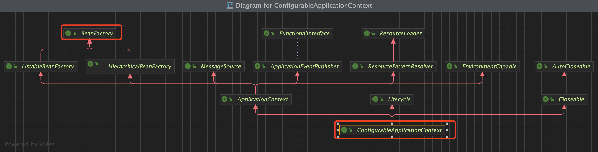

```java
/*
 * 1、到底什么是BeanFactory
 *  - 它是ApplicationContext的父接口
 *  - 它才是Spring的核心容器，主要的ApplicationContext实现都【组合】了它的功能
 */
```

BeanFactory主要的实现类：**DefaultListableBeanFactory** 

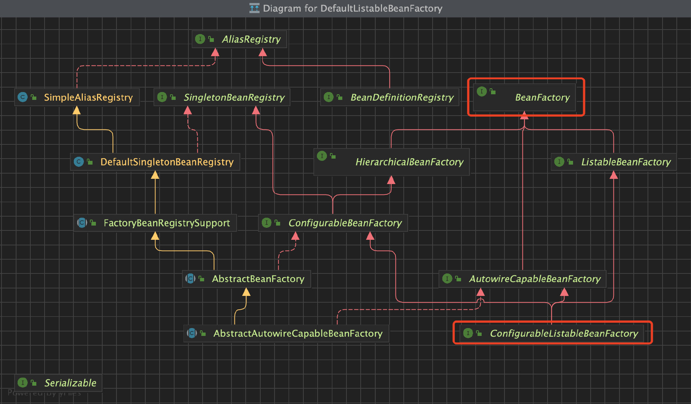

单例Bean注册类 **DefaultListableBeanFactory** 

```java
// private final Map<String, Object> singletonObjects = new ConcurrentHashMap<>(256);
// 获取DefaultSingletonBeanRegister


    //拿到所有的私有成员变量
        Field singletonObjects = DefaultSingletonBeanRegistry.class.getDeclaredField("singletonObjects");
        singletonObjects.setAccessible(true);
        ConfigurableListableBeanFactory beanFactory = configurableApplicationContext.getBeanFactory();
        // 获取beanFactory的属性
        Map<String, Object> map = (Map<String, Object>) singletonObjects.get(beanFactory);
        map.entrySet().stream().filter(e->e.getKey().startsWith("component")).forEach(e-> System.out.println(e.getKey() + "==" + e.getValue()));

```

```java
/*
 * 2、BeanFactory能干点啥
 *  - 表面上只有getBean
 *  - 实际上 控制反转、基本的依赖注入、直至Bean的生命周期的各种功能，都由它的实现类提供
 */
```


#### 2、ApplicationContext有哪些扩展功能

```java
/*
 * ConfigurableApplicationContext比 BeanFactory多点啥？？？
 *  - MessageSource 国际化处理
 *  - ResourcePatternResolver  通配符 资源问题
 *  - EnvironmentCapable 环境变量
 *  - ApplicationEventPublisher 发布事件 事件解耦
 *  - 完成用户注册与发送短信之间的解耦 用事件方式和AOP方式分布实现
 */
```

**国际化处理**

配置对应的Resources文件

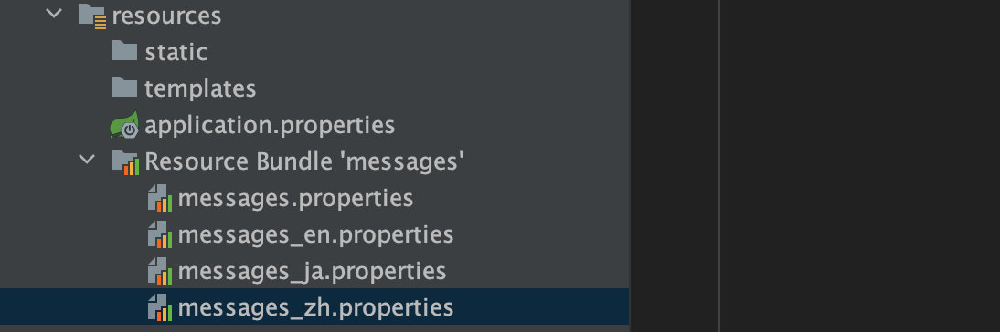

```java
// 获取对应的翻译
System.out.println(configurableApplicationContext.getMessage("Hi", null, Locale.CHINA));
System.out.println(configurableApplicationContext.getMessage("Hi", null, Locale.JAPAN));
System.out.println(configurableApplicationContext.getMessage("Hi", null, Locale.ENGLISH));
```


**根据通配符获取资源**

```java
      // 根据通配符获取资源
//        Resource[] resources = configurableApplicationContext.getResources("application.properties");
        Resource[] resources = configurableApplicationContext.getResources("classpath*:META-INF/spring.factories");
        for (Resource resource : resources) {
            System.out.println(resource);
        }
```


**获取各种环境变量**

```java
System.out.println(configurableApplicationContext.getEnvironment().getProperty("java_home"));
System.out.println(configurableApplicationContext.getEnvironment().getProperty("server.port"));
```


#### 3、事件解耦

创建对应的事件

```java
public class UserRegisterEvent extends ApplicationEvent {
    public UserRegisterEvent(Object source) {
        super(source);
    }
}
```

发布事件

```java
@Component
public class Component1 {
    @Resource
    private ApplicationEventPublisher eventPublisher;

    public void register(){
        System.err.println("来活了");
        eventPublisher.publishEvent(new UserRegisterEvent("qqqq"));
    }
}
```

监听事件

```java
@Component
public class Component2 {


    @EventListener
    public void getMessage(UserRegisterEvent userRegisterEvent){
        Object source = userRegisterEvent.getSource();
        System.out.println("传入的参数："+source);
        System.out.println("整个的参数："+userRegisterEvent);
    }
}
```


## 第二节、容器的实现

#### 1、BeanFactory实现的特点


#### 2、ApplicationContext的常见实现和用法

**一共四种常见的实现：**

##### 1、基于classpath的xml创建Bean

```java
public class A02Application {

    public static void main(String[] args) {
       testClassPathXmlApplicationContext();
    }

    // 较为经典的容器，基于classpath 下的xml 格式的配置文件来创建bean
    private static void testClassPathXmlApplicationContext() {
        ClassPathXmlApplicationContext classPathXmlApplicationContext = new ClassPathXmlApplicationContext("b01.xml");

        for (String beanDefinitionName : classPathXmlApplicationContext.getBeanDefinitionNames()) {
            System.out.println(beanDefinitionName);
        }
        System.out.println(classPathXmlApplicationContext.getBean(Bean2.class).getBean1());
    }

    static class Bean1 {
        public Bean1() {
            System.out.println("bean1 的构造方法");
        }
    }

    static class Bean2 {

        private Bean1 bean1;

        public Bean2() {
            System.out.println("bean2 的构造方法");
        }

        public Bean1 getBean1() {
            return bean1;
        }

        public void setBean1(Bean1 bean1) {
            this.bean1 = bean1;
        }
    }

}
```

对应的xml：

```xml
<?xml version="1.0" encoding="UTF-8"?>
<beans xmlns="http://www.springframework.org/schema/beans"
       xmlns:xsi="http://www.w3.org/2001/XMLSchema-instance"
       xmlns:context="http://www.springframework.org/schema/context"
       xsi:schemaLocation="http://www.springframework.org/schema/beans
       http://www.springframework.org/schema/beans/spring-beans-4.2.xsd


    http://www.springframework.org/schema/context
    http://www.springframework.org/schema/context/spring-context-4.2.xsd">

    <bean name="bean1" class="com.example.springstudy.application.context.A02Application.Bean1"/>
    <bean name="bean2" class="com.example.springstudy.application.context.A02Application.Bean2">
        <property name="bean1" ref="bean1"/>
    </bean>

    <!--加载默认的配置后处理器-->
    <context:annotation-config/>

</beans>
```

打印输出：

```java
21:44:57.609 [main] DEBUG org.springframework.context.support.ClassPathXmlApplicationContext - Refreshing org.springframework.context.support.ClassPathXmlApplicationContext@39ed3c8d
21:44:57.960 [main] DEBUG org.springframework.beans.factory.xml.XmlBeanDefinitionReader - Loaded 7 bean definitions from class path resource [b01.xml]
21:44:58.019 [main] DEBUG org.springframework.beans.factory.support.DefaultListableBeanFactory - Creating shared instance of singleton bean 'org.springframework.context.annotation.internalConfigurationAnnotationProcessor'
21:44:58.095 [main] DEBUG org.springframework.beans.factory.support.DefaultListableBeanFactory - Creating shared instance of singleton bean 'org.springframework.context.event.internalEventListenerProcessor'
21:44:58.097 [main] DEBUG org.springframework.beans.factory.support.DefaultListableBeanFactory - Creating shared instance of singleton bean 'org.springframework.context.event.internalEventListenerFactory'
21:44:58.102 [main] DEBUG org.springframework.beans.factory.support.DefaultListableBeanFactory - Creating shared instance of singleton bean 'org.springframework.context.annotation.internalAutowiredAnnotationProcessor'
21:44:58.104 [main] DEBUG org.springframework.beans.factory.support.DefaultListableBeanFactory - Creating shared instance of singleton bean 'org.springframework.context.annotation.internalCommonAnnotationProcessor'
21:44:58.118 [main] DEBUG org.springframework.beans.factory.support.DefaultListableBeanFactory - Creating shared instance of singleton bean 'bean1'
bean1 的构造方法
21:44:58.149 [main] DEBUG org.springframework.beans.factory.support.DefaultListableBeanFactory - Creating shared instance of singleton bean 'bean2'
bean2 的构造方法
bean1
bean2
org.springframework.context.annotation.internalConfigurationAnnotationProcessor
org.springframework.context.annotation.internalAutowiredAnnotationProcessor
org.springframework.context.annotation.internalCommonAnnotationProcessor
org.springframework.context.event.internalEventListenerProcessor
org.springframework.context.event.internalEventListenerFactory
com.example.springstudy.application.context.A02Application$Bean1@70b0b186
```


##### 2、基于基于磁盘路径下的xml创建bean

```java
public class A02Application {

    public static void main(String[] args) {
        testFileSystemXmlApplicationContext();
    }

    // 基于磁盘路径下的xml 配置文件来创建bean
    private static void testFileSystemXmlApplicationContext() {
        FileSystemXmlApplicationContext fileSystemXmlApplicationContext = new FileSystemXmlApplicationContext("/src/main/resources/b01.xml");

        for (String beanDefinitionName : fileSystemXmlApplicationContext.getBeanDefinitionNames()) {
            System.out.println(beanDefinitionName);
        }
        System.out.println(fileSystemXmlApplicationContext.getBean(Bean2.class).getBean1());
    }


    static class Bean1 {
        public Bean1() {
            System.out.println("bean1 的构造方法");
        }
    }

    static class Bean2 {

        private Bean1 bean1;

        public Bean2() {
            System.out.println("bean2 的构造方法");
        }

        public Bean1 getBean1() {
            return bean1;
        }

        public void setBean1(Bean1 bean1) {
            this.bean1 = bean1;
        }
    }

}
```

输出：

```java
21:46:56.877 [main] DEBUG org.springframework.context.support.FileSystemXmlApplicationContext - Refreshing org.springframework.context.support.FileSystemXmlApplicationContext@39ed3c8d
21:46:57.201 [main] DEBUG org.springframework.beans.factory.xml.XmlBeanDefinitionReader - Loaded 7 bean definitions from file [/Users/gaoshang/IdeaProjects/SpringStudy/src/main/resources/b01.xml]
21:46:57.237 [main] DEBUG org.springframework.beans.factory.support.DefaultListableBeanFactory - Creating shared instance of singleton bean 'org.springframework.context.annotation.internalConfigurationAnnotationProcessor'
21:46:57.281 [main] DEBUG org.springframework.beans.factory.support.DefaultListableBeanFactory - Creating shared instance of singleton bean 'org.springframework.context.event.internalEventListenerProcessor'
21:46:57.283 [main] DEBUG org.springframework.beans.factory.support.DefaultListableBeanFactory - Creating shared instance of singleton bean 'org.springframework.context.event.internalEventListenerFactory'
21:46:57.285 [main] DEBUG org.springframework.beans.factory.support.DefaultListableBeanFactory - Creating shared instance of singleton bean 'org.springframework.context.annotation.internalAutowiredAnnotationProcessor'
21:46:57.286 [main] DEBUG org.springframework.beans.factory.support.DefaultListableBeanFactory - Creating shared instance of singleton bean 'org.springframework.context.annotation.internalCommonAnnotationProcessor'
21:46:57.294 [main] DEBUG org.springframework.beans.factory.support.DefaultListableBeanFactory - Creating shared instance of singleton bean 'bean1'
bean1 的构造方法
21:46:57.309 [main] DEBUG org.springframework.beans.factory.support.DefaultListableBeanFactory - Creating shared instance of singleton bean 'bean2'
bean2 的构造方法
bean1
bean2
org.springframework.context.annotation.internalConfigurationAnnotationProcessor
org.springframework.context.annotation.internalAutowiredAnnotationProcessor
org.springframework.context.annotation.internalCommonAnnotationProcessor
org.springframework.context.event.internalEventListenerProcessor
org.springframework.context.event.internalEventListenerFactory
com.example.springstudy.application.context.A02Application$Bean1@6b1274d2
```


**第一、二种实现总结：**

```java
public class A02Application {

    public static void main(String[] args) {
        // 如何实现--具体实现 还是使用默认的构造Factory
        DefaultListableBeanFactory beanFactory = new DefaultListableBeanFactory();
        System.out.println("读取之前的...");
        for (String beanDefinitionName : beanFactory.getBeanDefinitionNames()) {
            System.out.println(beanDefinitionName);
        }
        System.out.println("读取之后的,,,");
      // 添加对应的后置处理器
        XmlBeanDefinitionReader xmlBeanDefinitionReader = new XmlBeanDefinitionReader(beanFactory);
//        xmlBeanDefinitionReader.loadBeanDefinitions(new ClassPathResource("b01.xml"));
   
        xmlBeanDefinitionReader.loadBeanDefinitions(new FileSystemResource("/Users/gaoshang/IdeaProjects/SpringStudy/src/main/resources/b01.xml"));
        for (String beanDefinitionName : beanFactory.getBeanDefinitionNames()) {
            System.out.println(beanDefinitionName);
        }
    }

    static class Bean1 {
        public Bean1() {
            System.out.println("bean1 的构造方法");
        }
    }

    static class Bean2 {

        private Bean1 bean1;

        public Bean2() {
            System.out.println("bean2 的构造方法");
        }

        public Bean1 getBean1() {
            return bean1;
        }

        public void setBean1(Bean1 bean1) {
            this.bean1 = bean1;
        }
    }

}
```

打印输出：

```java
读取之前的...
读取之后的,,,
21:52:22.674 [main] DEBUG org.springframework.beans.factory.xml.XmlBeanDefinitionReader - Loaded 7 bean definitions from file [/Users/gaoshang/IdeaProjects/SpringStudy/src/main/resources/b01.xml]
bean1
bean2
org.springframework.context.annotation.internalConfigurationAnnotationProcessor
org.springframework.context.annotation.internalAutowiredAnnotationProcessor
org.springframework.context.annotation.internalCommonAnnotationProcessor
org.springframework.context.event.internalEventListenerProcessor
org.springframework.context.event.internalEventListenerFactory
```


##### 3、基于Java 配置类来创建

```java
public class A02Application {

    public static void main(String[] args) {
     testAnnotationConfigApplicationContext();
    }

    // 较为经典的容器 基于Java 配置类来创建
    private static void testAnnotationConfigApplicationContext() {
        AnnotationConfigApplicationContext annotationConfigWebApplicationContext = new AnnotationConfigApplicationContext(Config.class);

        for (String beanDefinitionName : annotationConfigWebApplicationContext.getBeanDefinitionNames()) {
            System.out.println(beanDefinitionName);
        }
        System.out.println(annotationConfigWebApplicationContext.getBean(Bean2.class).getBean1());
    }

    @Configuration
    static class Config {
        @Bean
        Bean1 bean1() {
            return new Bean1();
        }

        @Bean
        Bean2 bean2(Bean1 bean1) {
            Bean2 bean2 = new Bean2();
            bean2.setBean1(bean1);
            return bean2;
        }
    }
    static class Bean1 {
        public Bean1() {
            System.out.println("bean1 的构造方法");
        }
    }

    static class Bean2 {
        private Bean1 bean1;

        public Bean2() {
            System.out.println("bean2 的构造方法");
        }

        public Bean1 getBean1() {
            return bean1;
        }

        public void setBean1(Bean1 bean1) {
            this.bean1 = bean1;
        }
    }
}
```


打印输出：

```java
21:53:47.938 [main] DEBUG org.springframework.context.annotation.AnnotationConfigApplicationContext - Refreshing org.springframework.context.annotation.AnnotationConfigApplicationContext@7637f22
21:53:47.964 [main] DEBUG org.springframework.beans.factory.support.DefaultListableBeanFactory - Creating shared instance of singleton bean 'org.springframework.context.annotation.internalConfigurationAnnotationProcessor'
21:53:48.264 [main] DEBUG org.springframework.beans.factory.support.DefaultListableBeanFactory - Creating shared instance of singleton bean 'org.springframework.context.event.internalEventListenerProcessor'
21:53:48.267 [main] DEBUG org.springframework.beans.factory.support.DefaultListableBeanFactory - Creating shared instance of singleton bean 'org.springframework.context.event.internalEventListenerFactory'
21:53:48.269 [main] DEBUG org.springframework.beans.factory.support.DefaultListableBeanFactory - Creating shared instance of singleton bean 'org.springframework.context.annotation.internalAutowiredAnnotationProcessor'
21:53:48.275 [main] DEBUG org.springframework.beans.factory.support.DefaultListableBeanFactory - Creating shared instance of singleton bean 'org.springframework.context.annotation.internalCommonAnnotationProcessor'
21:53:48.297 [main] DEBUG org.springframework.beans.factory.support.DefaultListableBeanFactory - Creating shared instance of singleton bean 'a02Application.Config'
21:53:48.311 [main] DEBUG org.springframework.beans.factory.support.DefaultListableBeanFactory - Creating shared instance of singleton bean 'bean1'
bean1 的构造方法
21:53:48.336 [main] DEBUG org.springframework.beans.factory.support.DefaultListableBeanFactory - Creating shared instance of singleton bean 'bean2'
21:53:48.346 [main] DEBUG org.springframework.beans.factory.support.DefaultListableBeanFactory - Autowiring by type from bean name 'bean2' via factory method to bean named 'bean1'
bean2 的构造方法
org.springframework.context.annotation.internalConfigurationAnnotationProcessor
org.springframework.context.annotation.internalAutowiredAnnotationProcessor
org.springframework.context.annotation.internalCommonAnnotationProcessor
org.springframework.context.event.internalEventListenerProcessor
org.springframework.context.event.internalEventListenerFactory
a02Application.Config
bean1
bean2
com.example.springstudy.application.context.A02Application$Bean1@3967e60c
```


##### 4、基于java配置类来创建（Web）

> **用于web环境，内嵌Tomcat的使用**

```java

public class A02Application {

    public static void main(String[] args) {
        testAnnotationConfigServletWebServerApplicationContext();
    }

    // 较为经典的容器 基于java配置类来创建，用于web环境
    private static void testAnnotationConfigServletWebServerApplicationContext() {
        AnnotationConfigServletWebApplicationContext annotationConfigServletWebApplicationContext = new AnnotationConfigServletWebApplicationContext(WebConfig.class);
        for (String beanDefinitionName : annotationConfigServletWebApplicationContext.getBeanDefinitionNames()) {
            System.out.println(beanDefinitionName);
        }
    }

    //    内嵌Tomcat如何工作的
    @Configuration
    static class WebConfig {

        // 对应的运行服务器 环境等
        @Bean
        public ServletWebServerFactory servletWebServerFactory() {
            return new TomcatServletWebServerFactory();
        }

        // 对应的前置servlet  入口都是dispatcherServlet
        @Bean
        public DispatcherServlet dispatcherServlet() {
            return new DispatcherServlet();
        }

        // 把对应的环境和servlet 关联起来
        @Bean
        public DispatcherServletRegistrationBean dispatcherServletRegistrationBean(DispatcherServlet dispatcherServlet) {
            return new DispatcherServletRegistrationBean(dispatcherServlet, "/");
        }

        @Bean("/hello")
        public Controller controller() {
            return (request, response) -> {
                response.getWriter().println("hello");
                return null;
            };
        }
    }

    static class Bean1 {
        public Bean1() {
            System.out.println("bean1 的构造方法");
        }
    }

    static class Bean2 {
        private Bean1 bean1;
        public Bean2() {
            System.out.println("bean2 的构造方法");
        }

        public Bean1 getBean1() {
            return bean1;
        }

        public void setBean1(Bean1 bean1) {
            this.bean1 = bean1;
        }
    }

}
```

打印输出：

```java
21:57:23.729 [main] DEBUG org.springframework.boot.web.servlet.context.AnnotationConfigServletWebApplicationContext - Refreshing org.springframework.boot.web.servlet.context.AnnotationConfigServletWebApplicationContext@69222c14
21:57:23.828 [main] DEBUG org.springframework.beans.factory.support.DefaultListableBeanFactory - Creating shared instance of singleton bean 'org.springframework.context.annotation.internalConfigurationAnnotationProcessor'
21:57:24.052 [main] DEBUG org.springframework.beans.factory.support.DefaultListableBeanFactory - Creating shared instance of singleton bean 'org.springframework.context.event.internalEventListenerProcessor'
21:57:24.054 [main] DEBUG org.springframework.beans.factory.support.DefaultListableBeanFactory - Creating shared instance of singleton bean 'org.springframework.context.event.internalEventListenerFactory'
21:57:24.055 [main] DEBUG org.springframework.beans.factory.support.DefaultListableBeanFactory - Creating shared instance of singleton bean 'org.springframework.context.annotation.internalAutowiredAnnotationProcessor'
21:57:24.058 [main] DEBUG org.springframework.beans.factory.support.DefaultListableBeanFactory - Creating shared instance of singleton bean 'org.springframework.context.annotation.internalCommonAnnotationProcessor'
21:57:24.066 [main] DEBUG org.springframework.ui.context.support.UiApplicationContextUtils - Unable to locate ThemeSource with name 'themeSource': using default [org.springframework.ui.context.support.ResourceBundleThemeSource@6dbb137d]
21:57:24.068 [main] DEBUG org.springframework.beans.factory.support.DefaultListableBeanFactory - Creating shared instance of singleton bean 'a02Application.WebConfig'
21:57:24.080 [main] DEBUG org.springframework.beans.factory.support.DefaultListableBeanFactory - Creating shared instance of singleton bean 'servletWebServerFactory'
21:57:24.252 [main] DEBUG org.springframework.beans.factory.support.DefaultListableBeanFactory - Creating shared instance of singleton bean 'dispatcherServlet'
21:57:24.280 [main] DEBUG org.springframework.beans.factory.support.DefaultListableBeanFactory - Creating shared instance of singleton bean 'dispatcherServletRegistrationBean'
21:57:24.285 [main] DEBUG org.springframework.beans.factory.support.DefaultListableBeanFactory - Autowiring by type from bean name 'dispatcherServletRegistrationBean' via factory method to bean named 'dispatcherServlet'
21:57:24.294 [main] DEBUG org.springframework.beans.factory.support.DefaultListableBeanFactory - Creating shared instance of singleton bean '/hello'
org.springframework.context.annotation.internalConfigurationAnnotationProcessor
org.springframework.context.annotation.internalAutowiredAnnotationProcessor
org.springframework.context.annotation.internalCommonAnnotationProcessor
org.springframework.context.event.internalEventListenerProcessor
org.springframework.context.event.internalEventListenerFactory
a02Application.WebConfig
servletWebServerFactory
dispatcherServlet
dispatcherServletRegistrationBean
/hello
```


## 第三节、内嵌容器、注册DispatcherServlet

### 1、Bean的生命周期

**Application启动类需要关闭**

```java
@SpringBootApplication
public class SpringStudyApplication {

    public static void main(String[] args) throws Exception {
        ConfigurableApplicationContext configurableApplicationContext = SpringApplication.run(SpringStudyApplication.class, args);
				// 方便演示
        configurableApplicationContext.close();
    }
```

**创建一个基础Compnent**

```java
@Component
public class LifeCycleBean {

    public LifeCycleBean() {
        System.out.println("我是构造方法");
    }

    @Autowired
    public void autowired(@Value("${JAVA_HOME}") String home){
        System.out.println("我是依赖注入方法："+home);
    }

    @PostConstruct
    public void init(){
        System.out.println("我是初始化");
    }
    /**
     * desc:不同的scop的销毁方法不一样
     */
    @PreDestroy
    public void destroy(){
        System.out.println("我是销毁方法");
    }
}

```


**实现Bean的几个后置处理器 ，查看生命周期**

```java
@Component
public class MyBeanPostProcessor implements InstantiationAwareBeanPostProcessor, DestructionAwareBeanPostProcessor {
    /*
     * 学到了什么？？
     * a、SpringBean生命周期各个阶段
     * b、模板设计模式、大流程固定好了，通过接口回调(bean 后处理器)扩展
     */
  
    @Override
    public void postProcessBeforeDestruction(Object bean, String beanName) throws BeansException {
        if ("lifeCycleBean".equals(beanName)){
            System.out.println("---- 销毁之前执行，如@preDestory");
        }
    }

    @Override
    public Object postProcessBeforeInstantiation(Class<?> beanClass, String beanName) throws BeansException {
        if ("lifeCycleBean".equals(beanName)){
            System.out.println("---- 实例化之前执行，这里返回的对象会替换掉原本的bean");
        }
        return  null;
//        return InstantiationAwareBeanPostProcessor.super.postProcessBeforeInstantiation(beanClass, beanName);
    }

    @Override
    public boolean postProcessAfterInstantiation(Object bean, String beanName) throws BeansException {
        if ("lifeCycleBean".equals(beanName)){
            System.out.println("---- 实例化之后执行，这里如果返回false 会跳过依赖注入阶段");
        }
        return  true;
//        return InstantiationAwareBeanPostProcessor.super.postProcessAfterInstantiation(bean, beanName);
    }

    @Override
    public PropertyValues postProcessProperties(PropertyValues pvs, Object bean, String beanName) throws BeansException {
        if ("lifeCycleBean".equals(beanName)){
            System.out.println("---- 依赖注入阶段，例如 @Autowired @Resource @value");
        }
        return InstantiationAwareBeanPostProcessor.super.postProcessProperties(pvs, bean, beanName);
    }


    @Override
    public Object postProcessBeforeInitialization(Object bean, String beanName) throws BeansException {
        if ("lifeCycleBean".equals(beanName)){
            System.out.println("---- 初始化之前执行，这里返回的对象会替换到原本的bean 如PostConstruct  @ConfigRationProperties");
        }
        return InstantiationAwareBeanPostProcessor.super.postProcessBeforeInitialization(bean, beanName);
    }

    @Override
    public Object postProcessAfterInitialization(Object bean, String beanName) throws BeansException {
        if ("lifeCycleBean".equals(beanName)){
            System.out.println("---- 初始化之后执行，这里返回的对象会替换到原本的bean 如代理增强");
        }
        return InstantiationAwareBeanPostProcessor.super.postProcessAfterInitialization(bean, beanName);
    }
}
```


**日志打印-查看执行顺序：**

```
---- 实例化之前执行，这里返回的对象会替换掉原本的bean
我是构造方法
---- 实例化之后执行，这里如果返回false 会跳过依赖注入阶段
---- 依赖注入阶段，例如 @Autowired @Resource @value
我是依赖注入方法：/usr/Hack
---- 初始化之前执行，这里返回的对象会替换到原本的bean 如PostConstruct  @ConfigRationProperties
我是初始化
---- 初始化之后执行，这里返回的对象会替换到原本的bean 如代理增强
---- 销毁之前执行，如@preDestory
我是销毁方法
```


### 2、模板方法-- 设计模式学习

```java
public class TestMethodTemplate {

    public static void main(String[] args) {
        MyBeanFactory myBeanFactory = new MyBeanFactory();
        myBeanFactory.addBeanPostProcessor(() -> System.out.println("Autowired"));
        myBeanFactory.addBeanPostProcessor(() -> System.out.println("Resource"));
        myBeanFactory.getBean();
    }

    /**
     * desc:所以该动的就动 需要静态的就是静态的
     */
    static class MyBeanFactory {

        public Object getBean() {
            Object bean = new Object();
            System.out.println("构造方法：" + bean);
            // 如果要注入 Autowired 、Resource 等方法 需要变灵活
            System.out.println("依赖注入：" + bean);
            for (BeanPostProcessor beanPostProcessor : beanPostProcessorList) {
                beanPostProcessor.inject();
            }
            System.out.println("初始化：" + bean);
            return bean;
        }

        private final List<BeanPostProcessor> beanPostProcessorList = new ArrayList<>();
        void addBeanPostProcessor(BeanPostProcessor beanPostProcessor) {
            beanPostProcessorList.add(beanPostProcessor);
        }
    }

    interface BeanPostProcessor {
        /**
         * 对依赖注入阶段的扩展
         * 或者对其他的方式的进行扩展
         */
        void inject();
    }
}
```


*学到了什么：*

```java
/*
 * 学到了什么？？
 * a、SpringBean生命周期各个阶段
 * b、模板设计模式、大流程固定好了，通过接口回调(bean 后处理器)扩展
 */
```


### 3、Bean的后置处理器

###### **1、bean的后置处理器的作用**

>  **为Bean的生命周期各个阶段提供扩展**
>
>  *手动hardcore加入到BeanFactory中*

```java
public class A04Application {

    public static void main(String[] args) {

        // GenericApplicationContext 是一个干净的容器
        GenericApplicationContext context = new GenericApplicationContext();

        context.registerBean("bean001", Bean001.class);
        context.registerBean("bean002", Bean002.class);
        context.registerBean("bean003", Bean003.class);
        context.registerBean("bean004", Bean004.class);

        // 处理ConfigurationProperties 的注解
        context.getDefaultListableBeanFactory().setAutowireCandidateResolver(new ContextAnnotationAutowireCandidateResolver());
        // 增加Autowired 注解的后置处理器 解析Autowired Value
        context.registerBean(AutowiredAnnotationBeanPostProcessor.class);
        // 增加Resource 后置处理器  并且能处理 init方法和destroy方法
        context.registerBean(CommonAnnotationBeanPostProcessor.class);

        ConfigurationPropertiesBindingPostProcessor.register(context.getDefaultListableBeanFactory());
        // 初始化容器
        context.refresh();
        System.out.println("configurationProperties：" + context.getBean(Bean004.class));
        context.close();

    }
}
```


###### **2. @Autowired后置处理器的分析**

***使用AutowiredAnnotationBeanPostProcessor 解析@Autowired***

```java
public class DigInAutowired {
    public static void main(String[] args) throws Throwable {

        DefaultListableBeanFactory beanFactory = new DefaultListableBeanFactory();
        // 创建过程 依赖注入 初始化
        beanFactory.registerSingleton("bean003", new Bean003());
        beanFactory.registerSingleton("bean002", new Bean002());

        // 解析Value
        beanFactory.setAutowireCandidateResolver(new ContextAnnotationAutowireCandidateResolver());
        // 解析$ 符号
        beanFactory.addEmbeddedValueResolver(new StandardEnvironment()::resolvePlaceholders);

        // 1、查找哪些属性，方法加了@Autowired 这称之为 InjectionMetadata
        AutowiredAnnotationBeanPostProcessor processor = new AutowiredAnnotationBeanPostProcessor();
        // 需要接续对应的bean 需要在beanFactory里面找到bean
        processor.setBeanFactory(beanFactory);

        Bean003 bean003 = new Bean003();
        System.out.println("processor解析前：" + bean003);

        // 执行依赖注入 @Autowired @Value
        processor.postProcessProperties(null, bean003, "bean003");
        System.out.println("processor执行解析后：" + bean003);

    }
}
```

> 查看源码，知道AutowiredAnnotationBeanPostProcessor 调用**findAutowiringMetadata**去解析@Autowired

```java
@Override
public PropertyValues postProcessProperties(PropertyValues pvs, Object bean, String beanName) {
   InjectionMetadata metadata = findAutowiringMetadata(beanName, bean.getClass(), pvs);
   try {
      metadata.inject(bean, beanName, pvs);
   }
   catch (BeanCreationException ex) {
      throw ex;
   }
   catch (Throwable ex) {
      throw new BeanCreationException(beanName, "Injection of autowired dependencies failed", ex);
   }
   return pvs;
}
```

**使用反射的操作去模拟继续AutowiredAnnotationBeanPostProcessor** 

```java
public class DigInAutowired {
    public static void main(String[] args) throws Throwable {

        DefaultListableBeanFactory beanFactory = new DefaultListableBeanFactory();
        // 创建过程 依赖注入 初始化
        beanFactory.registerSingleton("bean003", new Bean003());
        beanFactory.registerSingleton("bean002", new Bean002());

        // 解析Value
        beanFactory.setAutowireCandidateResolver(new ContextAnnotationAutowireCandidateResolver());
        // 解析$ 符号
        beanFactory.addEmbeddedValueResolver(new StandardEnvironment()::resolvePlaceholders);

        // 1、查找哪些属性，方法加了@Autowired 这称之为 InjectionMetadata
        AutowiredAnnotationBeanPostProcessor processor = new AutowiredAnnotationBeanPostProcessor();
        // 需要接续对应的bean 需要在beanFactory里面找到bean
        processor.setBeanFactory(beanFactory);

        Bean003 bean003 = new Bean003();
        System.out.println("processor解析前：" + bean003);

        Method findAutowiringMetadata = AutowiredAnnotationBeanPostProcessor.class.getDeclaredMethod("findAutowiringMetadata", String.class, Class.class, PropertyValues.class);
        // 私有的 设置可以访问
        findAutowiringMetadata.setAccessible(true);
        // 获取Bean003 上的 加了@value 和@Autowired 的成员变量和方法
        InjectionMetadata metadata = (InjectionMetadata) findAutowiringMetadata.invoke(processor, "bean003", Bean003.class, null);
        System.out.println("metadata: " + metadata);

        // 调用InjectionMetadata 进行依赖注入 注入时根据类型查找值
        metadata.inject(bean003, "bean003", null);
        System.out.println("metadata解析后：" + bean003);

    }
}
```

> **可以看到 `InjectionMetadata` 拿到了测试类中所有使用@Autowired注解的变量和方法**

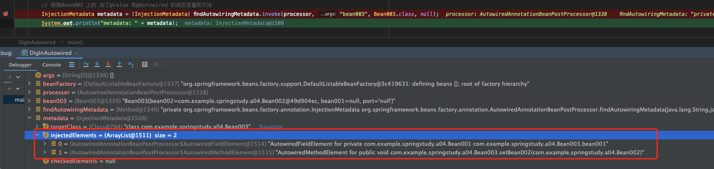


**使用DependencyDescriptor的操作去加载bean** 

> 通过**获取成员变量、方法、@value 值注入**等引用 获取对应的Bean

```java
public class DigInAutowired {
    public static void main(String[] args) throws Throwable {

        DefaultListableBeanFactory beanFactory = new DefaultListableBeanFactory();
        // 创建过程 依赖注入 初始化
        beanFactory.registerSingleton("bean003", new Bean003());
        beanFactory.registerSingleton("bean002", new Bean002());

        // 解析Value
        beanFactory.setAutowireCandidateResolver(new ContextAnnotationAutowireCandidateResolver());
        // 解析$ 符号
        beanFactory.addEmbeddedValueResolver(new StandardEnvironment()::resolvePlaceholders);

        // 1、查找哪些属性，方法加了@Autowired 这称之为 InjectionMetadata
        AutowiredAnnotationBeanPostProcessor processor = new AutowiredAnnotationBeanPostProcessor();
        // 需要接续对应的bean 需要在beanFactory里面找到bean
        processor.setBeanFactory(beanFactory);

        Bean003 bean003 = new Bean003();
        System.out.println("processor解析前：" + bean003);

        // 执行依赖注入 @Autowired @Value
        processor.postProcessProperties(null, bean003, "bean003");
        System.out.println("processor执行解析后：" + bean003);

        // 3、如何按照类型查找
        // 找到成员变量 找到类型的Bean
        Field bean001 = Bean003.class.getDeclaredField("bean001");
        DependencyDescriptor dependencyDescriptor = new DependencyDescriptor(bean001, false);
        Object o = beanFactory.doResolveDependency(dependencyDescriptor, null, null, null);
        System.out.println("找到bean001：：："+o);

        //  方法参数 根据方法参数
        Method setBean002 = Bean003.class.getDeclaredMethod("setBean002", Bean002.class);
        DependencyDescriptor dependencyDescriptor1 = new DependencyDescriptor(new MethodParameter(setBean002, 0),false);
        Object o1 = beanFactory.doResolveDependency(dependencyDescriptor1, null, null, null);
        System.out.println("找到bean002：：："+o1);

        // 值注入
        Method setPort = Bean003.class.getMethod("setPort", String.class);
        DependencyDescriptor dependencyDescriptor2 = new DependencyDescriptor(new MethodParameter(setPort, 0),true);
        Object o2 = beanFactory.doResolveDependency(dependencyDescriptor2, null, null, null);
        System.out.println("找到setPort：：："+o2);
    }
}
```


## 第四节、常见的工厂后置处理器

### 1、**ConfigurationClassPostProcessor** 后处理器

> ```java
> // 解析Component注解、ComponentScan 注解，以及Bean、Import、ImportResource
> context.registerBean(ConfigurationClassPostProcessor.class);
> ```

### 2、**MapperScanConfigurer** 后处理器

> ```java
> // 解析对应的Mapper 文件 MapperScan
> context.registerBean(MapperScannerConfigurer.class, bd -> bd.getPropertyValues().add("basePackage", "com.example.springstudy.a05.mapper"));
> ```

**Main 方法演示**

```java
public class A05Application {
    public static void main(String[] args) {
        GenericApplicationContext context = new GenericApplicationContext();
        context.registerBean("config", Config.class);
        // 解析Component注解、ComponentScan 注解，以及Bean、Import、ImportResource
        context.registerBean(ConfigurationClassPostProcessor.class);
        // 解析对应的Mapper 文件 MapperScan
        context.registerBean(MapperScannerConfigurer.class, bd -> bd.getPropertyValues().add("basePackage", "com.example.springstudy.a05.mapper"));
        //初始化容器
        context.refresh();
        for (String beanDefinitionName : context.getBeanDefinitionNames()) {
            System.out.println(beanDefinitionName);
        }
        // 容器关闭
        context.close();

    }
}
```

**Config配置类**

```java
@Configuration
@ComponentScan("com.example.springstudy.a05.component")
public class Config {

    @Bean
    public Bean0001 bean0001() {
        return new Bean0001();
    }

    @Bean
    public SqlSessionFactoryBean sqlSessionFactoryBean(DataSource dataSource) {
        SqlSessionFactoryBean sqlSessionFactoryBean = new SqlSessionFactoryBean();
        sqlSessionFactoryBean.setDataSource(dataSource);
        return sqlSessionFactoryBean;
    }

    @Bean(initMethod = "init")
    public DruidDataSource dataSource() {
        DruidDataSource druidDataSource = new DruidDataSource();
        druidDataSource.setUrl("jdbc:mysql://rm-pz5zbekd25iidlso733150.mysql.rds.aliyuncs.com:3306/test_core");
        druidDataSource.setUsername("");
        druidDataSource.setPassword("=");
        return druidDataSource;
    }

}
```

**输出结果，对应的bean都已经放到bean工厂里面**

```java
config
org.springframework.context.annotation.ConfigurationClassPostProcessor
org.mybatis.spring.mapper.MapperScannerConfigurer
bean0002
bean0001
sqlSessionFactoryBean
dataSource
mapper1
mapper2
```


## 第五节、工厂后处理器模拟实现

> *主要用代码来模拟Spring去实现对应的注解的PostProcessor*

### 1、ComponentScan注解详解

> 找到对应的扫描路径，类似如下：
>
> ```java
> @ComponentScan("com.example.springstudy.a05.component")
> ```
>
> **根据路径查找**，然后找到对应的class文件，逐一扫描处理，加入到BeanFactory中
>
> **如果是Spring，应该是扫描指定包路径下，或者默认扫整个包下的Component**

**main方法执行：**

```java
public static void main(String[] args) throws IOException {

        GenericApplicationContext context = new GenericApplicationContext();
        context.registerBean("config", Config.class);
        // 注册后处理器
        context.registerBean(OptimizeComponentScanPostProcessor.class);
        //初始化容器
        context.refresh();
        for (String beanDefinitionName : context.getBeanDefinitionNames()) {
            System.out.println(beanDefinitionName);
        }
        // 容器关闭
        context.close();
    }
```


**OptimizeComponentScanPostProcessor后处理器**

```java
public class OptimizeComponentScanPostProcessor implements BeanDefinitionRegistryPostProcessor {

    @Override
    public void postProcessBeanDefinitionRegistry(BeanDefinitionRegistry beanFactory) throws BeansException {

        try {
            // 扫描有没有这个注解 TODO 目前是扫描Config类下ComponentScan扫描路径
            ComponentScan annotation = AnnotationUtils.findAnnotation(Config.class, ComponentScan.class);
            if (annotation != null) {
                for (String pack : annotation.basePackages()) {
                    System.out.println("有ComponentScan注解的包名：" + pack);
                    // com.example.springstudy.a05.component -> classpath*:com/example/springstudy/a05/component/**/*.class
                    String path = "classpath*:" + pack.replace(".", "/") + "/**/*.class";
                    // 读取类的元信息的
                    CachingMetadataReaderFactory cachingMetadataReaderFactory = new CachingMetadataReaderFactory();
                    // 根据路径名获取对应的Class
                    //  Resource[] resources = context.getResources(path);
                    Resource[] resources = new PathMatchingResourcePatternResolver().getResources(path);
                    //  AnnotationBeanNameGenerator 生成名字的Annotation
                    AnnotationBeanNameGenerator annotationBeanNameGenerator = new AnnotationBeanNameGenerator();
                    for (Resource resource : resources) {
                        // 根据resource获取整个元数据
                        MetadataReader metadataReader = cachingMetadataReaderFactory.getMetadataReader(resource);
                        System.out.println("类名称信息：：" + metadataReader.getClassMetadata().getClassName());
                        AnnotationMetadata annotationMetadata = metadataReader.getAnnotationMetadata();
                        System.out.println("是否含有Component注解信息：：" + annotationMetadata.hasAnnotation(Component.class.getName()));
                        // Controller 就属于Component的派生注解
                        System.out.println("是否含有Component 派生注解信息：：" + annotationMetadata.hasMetaAnnotation(Component.class.getName()));

                        if (annotationMetadata.hasMetaAnnotation(Component.class.getName()) || annotationMetadata.hasAnnotation(Component.class.getName())) {
                            // 根据class名字生成一个AbstractBeanDefinition
                            AbstractBeanDefinition beanDefinition = BeanDefinitionBuilder.genericBeanDefinition(annotationMetadata.getClassName()).getBeanDefinition();
                            // 生成一个bean名字
                            String name = annotationBeanNameGenerator.generateBeanName(beanDefinition, beanFactory);
                            beanFactory.registerBeanDefinition(name, beanDefinition);
                        }
                    }
                }
            }
        } catch (Exception e) {
            e.printStackTrace();
        }
    }

    @Override
    public void postProcessBeanFactory(ConfigurableListableBeanFactory beanFactory) throws BeansException {

    }
}


```

**输出日志：**

> 可以看到ComponentScan的路径下的class文件都能扫描到并加入到Bean容器中

```java
有ComponentScan注解的包名：com.example.springstudy.a05.component
类名称信息：：com.example.springstudy.a05.component.Bean0002
是否含有Component注解信息：：true
是否含有Component 派生注解信息：：false
类名称信息：：com.example.springstudy.a05.component.Bean0003
是否含有Component注解信息：：true
是否含有Component 派生注解信息：：false
类名称信息：：com.example.springstudy.a05.component.Bean0004
是否含有Component注解信息：：false
是否含有Component 派生注解信息：：true
22:08:05.079 [main] DEBUG org.springframework.beans.factory.support.DefaultListableBeanFactory - Creating shared instance of singleton bean 'config'
22:08:05.079 [main] DEBUG org.springframework.beans.factory.support.DefaultListableBeanFactory - Creating shared instance of singleton bean 'bean0002'
Bean0002：：：我被spring管理了
22:08:05.080 [main] DEBUG org.springframework.beans.factory.support.DefaultListableBeanFactory - Creating shared instance of singleton bean 'bean0003'
Bean0002：：：我被spring管理了
22:08:05.080 [main] DEBUG org.springframework.beans.factory.support.DefaultListableBeanFactory - Creating shared instance of singleton bean 'bean0004'
Bean0002：：：我被spring管理了
config
com.example.springstudy.a05.processor.OptimizeComponentScanPostProcessor
bean0002
bean0003
bean0004
```


### 2、Bean注解详解

> 扫描带有Bean注解的

**main方法执行：**

```java
public static void main(String[] args) throws IOException {

        GenericApplicationContext context = new GenericApplicationContext();
        context.registerBean("config", Config.class);
        // 注册后处理器
        context.registerBean(AtBeanPostProcessor.class);
        //初始化容器
        context.refresh();
        for (String beanDefinitionName : context.getBeanDefinitionNames()) {
            System.out.println(beanDefinitionName);
        }
        // 容器关闭
        context.close();
    }
```


**AtBeanPostProcessor后处理器**

```java
public class AtBeanPostProcessor implements BeanDefinitionRegistryPostProcessor {


    @Override
    public void postProcessBeanDefinitionRegistry(BeanDefinitionRegistry beanFactory) throws BeansException {

        try {
          	// 获取所有的元数据
            CachingMetadataReaderFactory cachingMetadataReaderFactory = new CachingMetadataReaderFactory();
            // 根据路径名获取对应的Class
            // TODO 应该扫描所有的@Configration 配置类 然后找到所有的Bean注解的方法
            MetadataReader metadataReader = cachingMetadataReaderFactory.getMetadataReader(new ClassPathResource("com/example/springstudy/a05/Config.class"));
            // 拿到所有的带有Bean注解的方法
            Set<MethodMetadata> annotatedMethods = metadataReader.getAnnotationMetadata().getAnnotatedMethods(Bean.class.getName());
            for (MethodMetadata annotatedMethod : annotatedMethods) {
                BeanDefinitionBuilder beanDefinitionBuilder = BeanDefinitionBuilder.genericBeanDefinition();
                // TODO  然后逐一扫描对应的Bean 而不应该指定一个对应的@Configuration
                beanDefinitionBuilder.setFactoryMethodOnBean(annotatedMethod.getMethodName(), "config");
                // Attention 自动装配 构造方法的参数 使用AUTOWIRE_CONSTRUCTOR，如果不加，会找不到引用
                beanDefinitionBuilder.setAutowireMode(AbstractBeanDefinition.AUTOWIRE_CONSTRUCTOR);
                AbstractBeanDefinition beanDefinition = beanDefinitionBuilder.getBeanDefinition();
                beanFactory.registerBeanDefinition(annotatedMethod.getMethodName(), beanDefinition);
            }
        } catch (Exception e) {
            e.printStackTrace();
        }
    }

    @Override
    public void postProcessBeanFactory(ConfigurableListableBeanFactory beanFactory) throws BeansException {

    }
}
```

**输出日志：**

> 可以看到对应Bean注解都能扫描到并加入到Bean容器中

```java

22:39:59.381 [main] DEBUG org.springframework.context.support.GenericApplicationContext - Refreshing org.springframework.context.support.GenericApplicationContext@e2d56bf
22:39:59.427 [main] DEBUG org.springframework.beans.factory.support.DefaultListableBeanFactory - Creating shared instance of singleton bean 'com.example.springstudy.a05.processor.AtBeanPostProcessor'
22:39:59.587 [main] DEBUG org.springframework.beans.factory.support.DefaultListableBeanFactory - Creating shared instance of singleton bean 'config'
22:39:59.588 [main] DEBUG org.springframework.beans.factory.support.DefaultListableBeanFactory - Creating shared instance of singleton bean 'bean0001'
Bean0001：：：我被spring管理了
22:39:59.589 [main] DEBUG org.springframework.beans.factory.support.DefaultListableBeanFactory - Creating shared instance of singleton bean 'sqlSessionFactoryBean'
22:39:59.596 [main] DEBUG org.springframework.beans.factory.support.DefaultListableBeanFactory - Creating shared instance of singleton bean 'dataSource'
22:39:59.630 [main] DEBUG org.springframework.beans.factory.support.DefaultListableBeanFactory - Autowiring by type from bean name 'sqlSessionFactoryBean' via factory method to bean named 'dataSource'
22:39:59.639 [main] DEBUG org.apache.ibatis.logging.LogFactory - Logging initialized using 'class org.apache.ibatis.logging.slf4j.Slf4jImpl' adapter.
22:39:59.642 [main] DEBUG org.mybatis.spring.SqlSessionFactoryBean - Property 'configuration' or 'configLocation' not specified, using default MyBatis Configuration
22:39:59.699 [main] DEBUG org.mybatis.spring.SqlSessionFactoryBean - Property 'mapperLocations' was not specified.
config
com.example.springstudy.a05.processor.AtBeanPostProcessor
bean0001
sqlSessionFactoryBean
dataSource
```


### 3、Mapper注解详解

> 扫描带有@Mapper注解的

**main方法执行：**

```java
public static void main(String[] args) throws IOException {

        GenericApplicationContext context = new GenericApplicationContext();
        context.registerBean("config", Config.class);
        // 注册后处理器
        context.registerBean(AtBeanPostProcessor.class);
        context.registerBean(MapperPostProcessor.class);
        //初始化容器
        context.refresh();
        for (String beanDefinitionName : context.getBeanDefinitionNames()) {
            System.out.println(beanDefinitionName);
        }
        // 容器关闭
        context.close();
    }
```


**AtBeanPostProcessor后处理器**

```java
public class MapperPostProcessor implements BeanDefinitionRegistryPostProcessor {


    @Override
    public void postProcessBeanDefinitionRegistry(BeanDefinitionRegistry beanFactory) throws BeansException {

        try {
            PathMatchingResourcePatternResolver pathMatchingResourcePatternResolver = new PathMatchingResourcePatternResolver();
            Resource[] resources = pathMatchingResourcePatternResolver.getResources("classpath:com/example/springstudy/a05/mapper/**/*.class");
            // 获取所有的meta元数据
            CachingMetadataReaderFactory factory = new CachingMetadataReaderFactory();
            // 获取定义BeanName的Generate
            AnnotationBeanNameGenerator annotationBeanNameGenerator = new AnnotationBeanNameGenerator();

            for (Resource resource : resources) {
                // 获取这个资源相关的元数据
                MetadataReader metadataReader = factory.getMetadataReader(resource);
                ClassMetadata classMetadata = metadataReader.getClassMetadata();
                // 判断是否是一个接口
                if (classMetadata.isInterface()) {
                    // 只拿到是 MapperFactoryBean 的bean
                    AbstractBeanDefinition beanDefinition = BeanDefinitionBuilder.genericBeanDefinition(MapperFactoryBean.class)
                            // 添加构造参数值
                            .addConstructorArgValue(classMetadata.getClassName())
                            // 需要sqlSessionFactory 让其根据类型匹配
                            .setAutowireMode(AbstractBeanDefinition.AUTOWIRE_BY_TYPE)
                            .getBeanDefinition();
                    // 单独生成一个nameBeanDefinition 作为生成name 的nameBeanDefinition 使用
                    AbstractBeanDefinition nameBeanDefinition = BeanDefinitionBuilder.genericBeanDefinition(classMetadata.getClassName()).getBeanDefinition();
                    // 获取每个mapper 的name
                    String name = annotationBeanNameGenerator.generateBeanName(nameBeanDefinition, beanFactory);
                    beanFactory.registerBeanDefinition(name, beanDefinition);
                }

            }

        } catch (Exception e) {
            e.printStackTrace();
        }
    }

    @Override
    public void postProcessBeanFactory(ConfigurableListableBeanFactory beanFactory) throws BeansException {

    }
}
```

**输出日志：**

> 可以看到对应@Mapper注解都能扫描到并加入到Bean容器中
>
> **Mapper1、Mapper2都被扫到了**

```java
23:01:47.208 [main] DEBUG org.springframework.beans.factory.support.DefaultListableBeanFactory - Creating shared instance of singleton bean 'config'
23:01:47.209 [main] DEBUG org.springframework.beans.factory.support.DefaultListableBeanFactory - Creating shared instance of singleton bean 'bean0001'
Bean0001：：：我被spring管理了
23:01:47.210 [main] DEBUG org.springframework.beans.factory.support.DefaultListableBeanFactory - Creating shared instance of singleton bean 'sqlSessionFactoryBean'
23:01:47.262 [main] DEBUG org.springframework.beans.factory.support.DefaultListableBeanFactory - Creating shared instance of singleton bean 'dataSource'
23:01:47.284 [main] DEBUG org.springframework.beans.factory.support.DefaultListableBeanFactory - Autowiring by type from bean name 'sqlSessionFactoryBean' via factory method to bean named 'dataSource'
23:01:47.292 [main] DEBUG org.apache.ibatis.logging.LogFactory - Logging initialized using 'class org.apache.ibatis.logging.slf4j.Slf4jImpl' adapter.
23:01:47.295 [main] DEBUG org.mybatis.spring.SqlSessionFactoryBean - Property 'configuration' or 'configLocation' not specified, using default MyBatis Configuration
23:01:47.350 [main] DEBUG org.mybatis.spring.SqlSessionFactoryBean - Property 'mapperLocations' was not specified.
23:01:47.354 [main] DEBUG org.springframework.beans.factory.support.DefaultListableBeanFactory - Creating shared instance of singleton bean 'mapper1'
23:01:47.430 [main] DEBUG org.springframework.beans.factory.support.DefaultListableBeanFactory - Creating shared instance of singleton bean 'mapper2'
config
com.example.springstudy.a05.processor.AtBeanPostProcessor
com.example.springstudy.a05.processor.MapperPostProcessor
bean0001
sqlSessionFactoryBean
dataSource
mapper1
mapper2
23:01:47.457 [main] DEBUG org.springframework.context.support.GenericApplicationContext - Closing org.springframework.context.support.GenericApplicationContext@e2d56bf, started on Sun Sep 18 23:01:46 CST 2022
23:01:47.459 [main] INFO com.alibaba.druid.pool.DruidDataSource - {dataSource-0} closing ...
```


## 第六节、Aware与initialzingBean接口

Aware接口用于注入一些与容器相关的信息，例如

1. BeanNameAware 注入bean 的名字
2. BeanFactoryAware注入BeanFactory容器
3. ApplicationContextAware 注入 ApplicationContext容器
4. EmbeddedValueAware ${}


**配置类@Autowired失效分析**

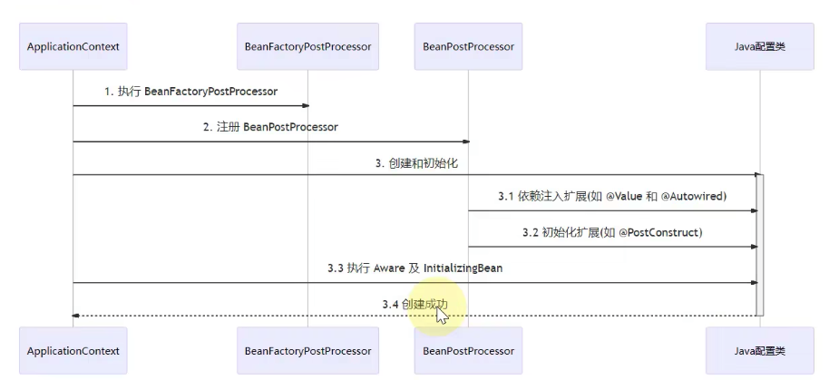


Java配置类包含BeanFactoryPostProcessor的情况，因此要创建其中的BeanFactoryPostProcessor 必须提前创建Java配置类，而此时的BeanPostProcessor还未准备好，导致@Autowired 等注解失效


失败原因解释，因为新创建了Java配置类，先创建了配置，然后执行了初始化，然后在去执行后处理器，导致配置类里面的

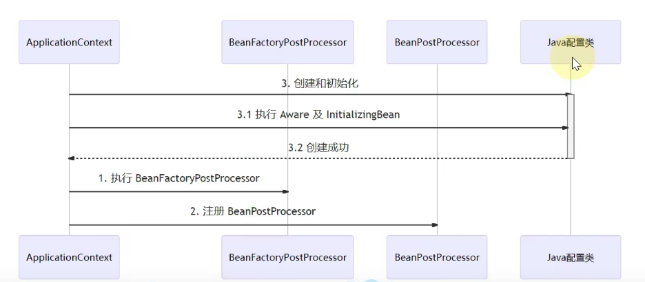


## 第七讲、初始化与销毁


### 初始化执行顺序

>  * <p> ˙
>      * 执行顺序：
>      * 1、PostConstruct
>      * 2、InitializingBean
>      * 3、@Bean(initMethod ="")
>      * <p>

```java
@SpringBootApplication
public class A07Application {

    public static void main(String[] args) throws Exception {
        ConfigurableApplicationContext configurableApplicationContext = SpringApplication.run(A07Application.class, args);
        configurableApplicationContext.close();
        /*
        学到了什么??
        a. spring 提供了多种初始化和销毁方法
        b. spring的面试有多卷
         */

    }

    /**
     * <p> ˙
     * 执行顺序：
     * 1、PostConstruct
     * 2、InitializingBean
     * 3、@Bean(initMethod ="")
     * <p>
     * @author JackGao
     * @since 2023/2/6 21:39
     */
    @Bean(initMethod = "init3")
    public Bean0007 bean0007(){
        return new Bean0007();
    }

}

```

Bean

```java
public class Bean0007 implements InitializingBean {

    /**
     * <p> 初始化方法1 <p>
     *
     * @author JackGao
     * @since 2023/2/6 21:37
     */
    @PostConstruct
    public void init1() throws Exception {
        System.out.println("Bean0007----初始化方法1--init1");
    }

    /**
     * <p> 初始化方法2 <p>
     *
     * @author JackGao
     * @since 2023/2/6 21:36
     */
    @Override
    public void afterPropertiesSet() throws Exception {
        System.out.println("Bean0007----初始化方法2--afterPropertiesSet");
    }

    public void init3() {
        System.out.println("Bean0007----初始化方法3--init3");
    }

}

```

输出日志

```java
// Bean0007----初始化方法1--init1
// Bean0007----初始化方法2--afterPropertiesSet
// Bean0007----初始化方法3--init3
```


### 销毁执行顺序

> ```
> * <p> ˙
> * 销毁执行顺序：
> * 1、PreDestroy
> * 2、DisposableBean
> * 3、@Bean(destroyMethod ="")
> * <p>
> ```

```java
@SpringBootApplication
public class A07Application {

    public static void main(String[] args) throws Exception {
        ConfigurableApplicationContext configurableApplicationContext = SpringApplication.run(A07Application.class, args);
        configurableApplicationContext.close();
    }

    /**
     * <p> ˙
     * 销毁执行顺序：
     * 1、PreDestroy
     * 2、DisposableBean
     * 3、@Bean(destroyMethod ="")
     * <p>
     * @author JackGao
     * @since 2023/2/6 21:39
     */
    @Bean(destroyMethod = "destroy3")
    public Bean0008 bean0008(){
        return new Bean0008();
    }

}

```

Bean

```java
public class Bean0008 implements DisposableBean {


    /**
     * <p> 销毁方法 <p>
     *
     * @author JackGao
     * @since 2023/2/6 21:36
     */
    @PreDestroy
    public void destroy1() throws Exception {
        System.out.println("Bean0008----销毁方法--destroy1");
    }
    /**
     * <p> 销毁方法2 <p>
     *
     * @author JackGao
     * @since 2023/2/6 21:37
     */
    @Override
    public void destroy() throws Exception {
        System.out.println("Bean0008----销毁方法--destroy2");
    }


    public void destroy3(){
        System.out.println("Bean0008----销毁方法--destroy3");
    }
}

```


输入日志

```java
// Bean0008----销毁方法--destroy1
// Bean0008----销毁方法--destroy2
// Bean0008----销毁方法--destroy3
```


## 第八讲、Scope

### 1、Scope类型有哪些？

| 类型                                    | 创建时机   | 销毁时机                                                     |
| --------------------------------------- | ---------- | ------------------------------------------------------------ |
| Singleton（同一个对象）                 | 引用的时候 | Tomcat 关机                                                  |
| prototype（从spring容器中，产生新对象） | 引用的时候 | Spring只负责创建，不负责销毁周期的回调方法。销毁可能需要GC来处理这个bean对象 |
| request（存在request域中）              | 每一次请求 | 每一次请求完成                                               |
| session（会话级别）                     | 浏览器请求 | 30分钟没有新请求 自动销毁                                    |
| application（应用启动）                 | 应用启动   | 应该是应用关闭 emmm 但是实现不了                             |

####  

#### 1.1 scope的销毁演示


演示：

```java
@RestController
public class MyController {

    /**
     * 单例使用其他域 都需要加scope
     */
    @Lazy
    @Autowired
    BeanForRequest beanForRequest;

    @Lazy
    @Autowired
    BeanForApplication beanForApplication;

    @Lazy
    @Autowired
    BeanForSession beanForSession;

    @GetMapping(value = "test", produces = "text/html")
    public String test(HttpServletRequest request, HttpSession httpSession) {
        ServletContext servletContext = request.getServletContext();
        String sb = "<li>" + "beanForRequest:" + beanForRequest + "</li>" + "<li>" + "beanForApplication:" + beanForApplication + "</li>" + "<li>" + "beanForSession:" + beanForSession + "</li>";
        return sb;
    }

}
////////////////////////////////////////////////////////////////

@Scope("request")
@Component
public class BeanForRequest {

    @PreDestroy
    public void destroy(){
        System.out.println("BeanForRequest------destroy");
    }
}
////////////////////////////////////////////////////////////////
@Scope("application")
@Component
public class BeanForApplication {

    @PreDestroy
    public void destroy(){
        System.out.println("BeanForApplication------destroy");
    }
}
////////////////////////////////////////////////////////////////
@Scope("session")
@Component
public class BeanForSession {

    @PreDestroy
    public void destroy(){
        System.out.println("BeanForSession------destroy");
    }
}

```

结果：

当使用浏览器调用接口的时候：

一次请求后，request的bean就销毁了（销毁方法已经执行）

> ```java
> // BeanForRequest------destroy
> ```

页面展示打印如下：


再次刷新:

> 发现只有request域的bean发现变化

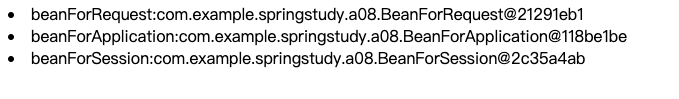


### 2、在singleton 中使用其他集中scope的注意事项

> singleton使用其他的scope的时候 需要是用**@Lazy注解** 否则会失效

演示：

使用单例对象获取多例的对象

```java
@SpringBootApplication
@EnableConfigurationProperties
@ConfigurationPropertiesScan
public class A09Application {
    public static void main(String[] args) throws Exception {
        ConfigurableApplicationContext configurableApplicationContext = SpringApplication.run(A09Application.class, args);

        E bean = configurableApplicationContext.getBean(E.class);
        bean.getF();
        System.out.println("打印日志了1，"+bean.getF());
        System.out.println("打印日志了2，"+bean.getF());
        System.out.println("打印日志了3，"+bean.getF());
        System.out.println("打印日志了4，"+bean.getF());

        configurableApplicationContext.close();
    }
}

////////////////////////////////////////////////////////////////////////////////////
@Component
public class E {
    @Autowired
    private F f;

    public F getF() {
        return f;
    }

}
////////////////////////////////////////////////////////////////////////////////////
@Component
@Scope("prototype")
public class F {
}

```

**预期效果：打印不同的对象**

**结果输入：**

```
打印日志了1，com.example.springstudy.a009.F@7c251f90
打印日志了2，com.example.springstudy.a009.F@7c251f90
打印日志了3，com.example.springstudy.a009.F@7c251f90
打印日志了4，com.example.springstudy.a009.F@7c251f90
```

**发现结果不是我们预期生成多个对象**


#### 2.1 实战：scope失效分析

***为什么失效？***

对于单例对象来讲，依赖注入仅发生了一次，后续没有用到多例的F，因此E用的始终是第一次依赖注入的F


***解决办法：***

1. **仍然使用@Lazy代理**

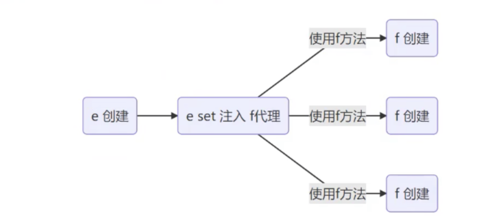

演示：

```java
@Component
public class E {
    @Autowired
    @Lazy
    private F f;

    public F getF() {
        return f;
    }

}

@SpringBootApplication
@EnableConfigurationProperties
@ConfigurationPropertiesScan
public class A09Application {
    public static void main(String[] args) throws Exception {
        ConfigurableApplicationContext configurableApplicationContext = SpringApplication.run(A09Application.class, args);

        E bean = configurableApplicationContext.getBean(E.class);
        System.out.println("看这个来源，是原始类还是代理类:" + bean.getF().getClass());
        System.out.println("打印日志了1，" + bean.getF());
        System.out.println("打印日志了2，" + bean.getF());
        System.out.println("打印日志了3，" + bean.getF());

        configurableApplicationContext.close();
    }
}
```

**结果输出：**

```java
看这个来源，是原始类还是代理类:class com.example.springstudy.a009.F$$EnhancerBySpringCGLIB$$aa6956a
打印日志了1，com.example.springstudy.a009.F@59ed3e6c
打印日志了2，com.example.springstudy.a009.F@317e9c3c
打印日志了3，com.example.springstudy.a009.F@31a3f4de
```


2. **代理对象虽然还是同一个，但当每次使用代理对象的任意方法时，由代理创建新的f对象**

   > ``` java
   > @Scope(value = "prototype",proxyMode = ScopedProxyMode.TARGET_CLASS)
   > ```

演示：

```java
@Component
@Scope(value = "prototype",proxyMode = ScopedProxyMode.TARGET_CLASS)
public class F1 {
}

@Component
public class E {
    @Lazy
    @Autowired
    private F f;
    @Autowired
    private F1 f1;

    public F getF() {
        return f;
    }

    public F1 getF1() {
        return f1;
    }
}


@SpringBootApplication
@EnableConfigurationProperties
@ConfigurationPropertiesScan
public class A09Application {
    public static void main(String[] args) throws Exception {
        ConfigurableApplicationContext configurableApplicationContext = SpringApplication.run(A09Application.class, args);

        E bean = configurableApplicationContext.getBean(E.class);
        System.out.println("看这个来源，是原始类还是代理类:" + bean.getF().getClass());
        System.out.println("打印日志了1，" + bean.getF());
        System.out.println("打印日志了2，" + bean.getF());
        System.out.println("打印日志了3，" + bean.getF());

        System.out.println("getF1-看这个来源，是原始类还是代理类:" + bean.getF1().getClass());
        System.out.println("getF1-打印日志了1，" + bean.getF1());
        System.out.println("getF1-打印日志了2，" + bean.getF1());
        System.out.println("getF1-打印日志了3，" + bean.getF1());

        configurableApplicationContext.close();
    }
}
```

**结果输出：**

```
getF1-看这个来源，是原始类还是代理类:class com.example.springstudy.a009.F1$$EnhancerBySpringCGLIB$$57e89078
getF1-打印日志了1，com.example.springstudy.a009.F1@124ac145
getF1-打印日志了2，com.example.springstudy.a009.F1@2def7a7a
getF1-打印日志了3，com.example.springstudy.a009.F1@24e83d19
```


3. **使用ObjectFactory工厂解决**

   > ```java
   > @Autowired
   > private ObjectFactory<F3> f3;
   > ```

演示：

```java
@Component
@Scope(value = "prototype")
public class F3 {
}

@Component
public class E {

    @Autowired
    private ObjectFactory<F3> f3;

    public F3 getF3() {
        return f3.getObject();
    }
}

@SpringBootApplication
@EnableConfigurationProperties
@ConfigurationPropertiesScan
public class A09Application {
    public static void main(String[] args) throws Exception {
        ConfigurableApplicationContext configurableApplicationContext = SpringApplication.run(A09Application.class, args);
   System.out.println("getF3-看这个来源，是原始类还是代理类:" + bean.getF3().getClass());
        System.out.println("getF3-打印日志了1，" + bean.getF3());
        System.out.println("getF3-打印日志了2，" + bean.getF3());
        System.out.println("getF3-打印日志了3，" + bean.getF3());
}}
```


输出：

```

getF3-看这个来源，是原始类还是代理类:class com.example.springstudy.a009.F3
getF3-打印日志了1，com.example.springstudy.a009.F3@1bc49bc5
getF3-打印日志了2，com.example.springstudy.a009.F3@4f66ffc8
getF3-打印日志了3，com.example.springstudy.a009.F3@2def7a7a
```


4. 使用applicationContext 获取

   > ```java
   > @Autowired
   >     private ApplicationContext applicationContext;
   > ```

演示：

```java
@Component
public class E {

    @Autowired
    private ApplicationContext applicationContext;
  
    public F4 getF4() {
        return applicationContext.getBean(F4.class);
    }
}

////////////////////////////////////////////////////////////////////////
@SpringBootApplication
@EnableConfigurationProperties
@ConfigurationPropertiesScan
public class A09Application {
    public static void main(String[] args) throws Exception {
        ConfigurableApplicationContext configurableApplicationContext = SpringApplication.run(A09Application.class, args);

        E bean = configurableApplicationContext.getBean(E.class);
        System.out.println("getF4-看这个来源，是原始类还是代理类:" + bean.getF4().getClass());
        System.out.println("getF4-打印日志了1，" + bean.getF4());
        System.out.println("getF4-打印日志了2，" + bean.getF4());
        System.out.println("getF4-打印日志了4，" + bean.getF4());

        configurableApplicationContext.close();
    }
}
```


**结果：**

getF4-看这个来源，是原始类还是代理类:class com.example.springstudy.a009.F4
getF4-打印日志了1，com.example.springstudy.a009.F4@188cbcde
getF4-打印日志了2，com.example.springstudy.a009.F4@4ee6291f
getF4-打印日志了4，com.example.springstudy.a009.F4@2b03d52f


##### **总结：**

> 解决方法虽然不同，但理念上殊途同归：**都是推迟其他scope bean的获取**


# 2、AOP

## 第九讲、AOP实现值ajc编译器

> 1. aop原始操作是使用代理来实现的
> 2. 新的方法：使用ajc编译器也可以实现

**演示：**

**引入依赖：**

> *切记 需要使用maven compile 编译，IDEA默认使用javac去build*

```xml
<dependency>
            <groupId>org.springframework.boot</groupId>
            <artifactId>spring-boot-starter-aop</artifactId>
        </dependency>

<build>
        <plugins>
            <plugin>
                <groupId>org.springframework.boot</groupId>
                <artifactId>spring-boot-maven-plugin</artifactId>
            </plugin>
            <plugin>
                <groupId>org.codehaus.mojo</groupId>
                <artifactId>aspectj-maven-plugin</artifactId>
                <version>1.14.0</version>
                <configuration>
                    <complianceLevel>1.8</complianceLevel>
                    <source>1.8</source>
                    <target>1.8</target>
                    <showWeaveInfo>true</showWeaveInfo>
                    <complianceLevel>1</complianceLevel>
                    <vervbose>true</vervbose>
                    <encoding>UTF-8</encoding>
                </configuration>
                <executions>
                    <execution>
                        <configuration>
                            <skip>false</skip>
                        </configuration>
                        <goals>
                            <goal>compile</goal>
                        </goals>
                    </execution>
                </executions>
            </plugin>
        </plugins>
    </build>
```


**实现类：**

```java

@Service
public class MyService {
    public static void   foo(){
        System.out.println("MyService===foo");
    }
}
```

**Aspect 类**:

> ```java
> // @Aspect 没有被spring管理
> ```

```java
@Aspect
public class MyAspect {

    @Before("execution(* com.example.springstudy.a10.service.*.*(..))")
    public void before(JoinPoint point) {
        System.out.println("@Before：test...");
    }

}
```


**启动类：**

```java
public class A10Application {
    public static void main(String[] args) throws Exception {
        ConfigurableApplicationContext configurableApplicationContext = SpringApplication.run(A10Application.class, args);

        MyService bean = configurableApplicationContext.getBean(MyService.class);
        bean.foo();

    }
}
```

**结果输出：**

> 没有使用代理 发现也可以实现拦截

@Before：test...
MyService===foo


**查看MyService编译后的文件：**

> *发现ajc已经改了class文件*

```java

@Service
public class MyService {
    public MyService() {
    }

    public void foo() {
        JoinPoint var1 = Factory.makeJP(ajc$tjp_0, this, this);
        MyAspect.aspectOf().before(var1);
        System.out.println("MyService===foo");
    }

    static {
        ajc$preClinit();
    }
}
```


**提问，如果执行的方法时static，那么子类将无法重写该方法，ajc可以操作吗？**

**代码演示：**

```java
@Service
public class MyService {

    public static void foo() {
        System.out.println("MyService===foo");
    }
}

////////////////////////////////////////////////////////////////
public class A10Application {
    public static void main(String[] args) throws Exception {
        ConfigurableApplicationContext configurableApplicationContext = SpringApplication.run(A10Application.class, args);
        // 因为修改了是class文件 不是走代理 所以可以直接执行
        new MyService().foo();

    }
}
```

**结果输出：**

> 发现一样可以使用

```java
@Before：模拟权限检查...
MyService===foo
```


## 第十讲、AOP之agent增强

> **VM启动时增加参数 实现增强处理**，使用外置 jar（aspectjweaver-1.9.7.jar） 增强处理
>
> **VM参数：-javaagent:/usr/local/Repository/org/aspectj/aspectjweaver/1.9.7/aspectjweaver-1.9.7.jar**

代码演示：

> 如果有ajc 那么得注释掉插件 否则不好查看结果

```java
@Service
public class MyService001 {

    public void foo() {
        System.out.println("MyService===foo");
        bar();
    }

    public void bar() {
        System.out.println("MyService===bar");
    }

}

////////////////////////////////////////////////////////////////
@Aspect
@Component
public class Aspect001 {

    @Before("execution(* com.example.springstudy.a11.service.*.*(..))")
    public void before(JoinPoint point) {
        System.out.println("@Before：test...");

    }

}
////////////////////////////////////////////////////////////////


@SpringBootApplication
@EnableConfigurationProperties
@ConfigurationPropertiesScan
public class A11Application {
    public static void main(String[] args) throws Exception {
        ConfigurableApplicationContext configurableApplicationContext = SpringApplication.run(A11Application.class, args);

        MyService001 bean = configurableApplicationContext.getBean(MyService001.class);
        bean.foo();
    }
}


```

启动时，增加VM参数

> -javaagent:**/usr/local/Repository**/org/aspectj/aspectjweaver/1.9.7/aspectjweaver-1.9.7.jar
>
> 指向自己的maven jar包目录

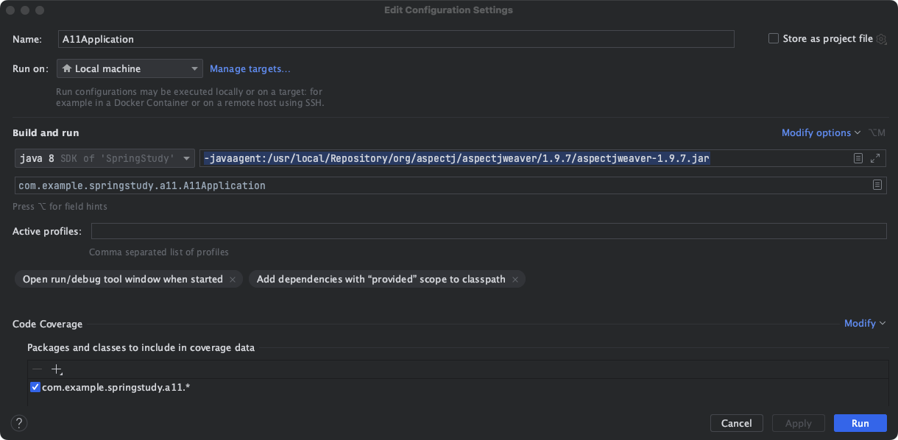

输出结果：

```
@Before：test...
MyService===foo
MyService===bar
```

**使用arthas来查看反编译的文件**

> 使用jad命令 反编译java文件 
>
> 操作手册地址：https://arthas.aliyun.com/doc/quick-start.html

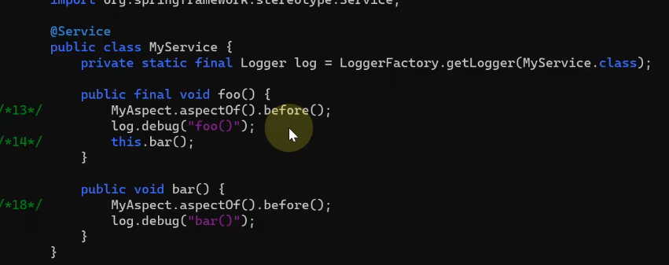


## 第十一讲、AOP实现之proxy

### 1、JDK动态代理实现及要点

> 注意点：JDK只能针对接口代理

代码演示：

```java
public class JdkProxyDemo {

    interface Foo {
        String foo(String id);

    }


    static class Target implements Foo {
        public String foo(String id) {
            System.out.println("target foo");
            return "String";
        }
    }

    /**
     * <p>
     * 代理和目标是兄弟关系 不能集成实现
     * <p>
     *
     * @author JackGao
     * @since 2023/2/12 21:30
     */

    public static void main(String[] args) {

        // 目标对象
        Target target = new Target();
        // 参数1 用来加载在运行期间动态生成的字节码
        ClassLoader classLoader = JdkProxyDemo.class.getClassLoader();
        //参数1    参数2 代理类实现什么接口，可以实现多个接口 参数3 执行的一些行为
        // 返回类型 变成接口类型
        Foo proxyInstance = (Foo) Proxy.newProxyInstance(classLoader, new Class[]{Foo.class}, (proxy, method, args1) -> {
            System.out.println("before.......");
            //  Object proxy --- 代理对象 , Method method 正在运行的方法, Object[] args  方法执行的参数

            // 目标.方法(参数)
            // 方法.invoke(目标,参数)
            System.out.println("调用前");
            Object invoke = method.invoke(target, args1);
            System.out.println("调用后");

            System.out.println("after.......");
            // 让代理也返回目标方法执行的结果
            return invoke;
        });
        // 代理调用父方法
        proxyInstance.foo("张三");
    }

}
```


### 2、cglib代理实现及要点

> ​	**invoke与invokeSuper的区别：**
>
> 1. **Spring** 使用invoke 这种方式，且内部不是反射，需要执行的目标
> 2. invokeSuper内部执行不是代理，不需要执行目标

代码演示：

```java
public class CglibProxyDemo {


    static class Target {
        public String foo(String id) {
            System.out.println("target foo");
            return "String";
        }
    }

    /**
     * <p>
     * 代理类是子类型  目标类是父类型
     * 子类型可以换成父类型
     * <p>
     * 父类不是时候final修饰 执行的时候会报错
     * 执行的方法 可以 是final修饰的，但是 执行的时候 不能增强
     * <p>
     *
     * @author JackGao
     * @since 2023/2/12 21:30
     */
    public static void main(String[] args) {

        // 目标对象
        Target target = new Target();

        Target targetProxy = (Target) Enhancer.create(Target.class, (MethodInterceptor) (proxy, method, objects, methodProxy) -> {
            // 第一个参数 是代理对象 参数2 执行的方法  参数3 参数  参数4 类型执行的方法
            System.out.println("before....");
            // 方法反射调用目标 性能会弱一点
            Object invoke1 = method.invoke(target, objects);
            // 避免反射调用
            // 内部不是使用反射 需要目标  Spring使用这种方式
            Object invoke2 = methodProxy.invoke(target, objects);
            // 内部没有用反射 需要代理
            Object o = methodProxy.invokeSuper(proxy, objects);

            System.out.println("after");
            return o;
        });

        targetProxy.foo("张三");
    }

}

```


### 3、JDK代码源码实战

手写源码：

#### **1.第一版 简单实现**

**要代理的类**

```java
public class A13 {

    interface Foo {
        void foo();
    }

    static class Target001 implements Foo {

        @Override
        public void foo() {
            System.out.println("Target001  实现foo method");
        }
    }

    public static void main(String[] args) {
        Foo proxy = new $Proxy();
        proxy.foo();
    }


}

```

**代理类**

```java
public class $Proxy implements A13.Foo {
    @Override
    public void foo() {
        // 1.功能增强
        System.out.println("before");
        // 2.调用目标
        new A13.Target001().foo();
    }
}
```

#### 2.第二版 抽象要增强的逻辑

> 把需要增强的代码用接口抽象出来
>
> 让调用方决定抽象什么
>
> 逻辑不能写死 所以用接口抽象

要代理的类

```java
public class A13 {

    interface Foo {
        void foo();
    }

    interface InvocationHandler {
        void invoke();
    }

    static class Target001 implements Foo {

        @Override
        public void foo() {
            System.out.println("Target001  实现foo method");
        }
    }

    public static void main(String[] args) {
        Foo proxy = new $Proxy(() -> {
            // 功能增强
            System.out.println("before");
            // 调用目标
            new Target001().foo();
        });
        proxy.foo();
    }

}
```


代理类

```java
public class $Proxy implements A13.Foo {

    private A13.InvocationHandler invocationHandler;

    public $Proxy(A13.InvocationHandler invocationHandler) {
        this.invocationHandler = invocationHandler;
    }

    @Override
    public void foo() {
        invocationHandler.invoke();
    }
}
```


#### 3.第三版 目标类多个方法 代理优化

> 动态设置 代理目标的哪个方法
>
> 使用方法对象 作为参数传入进来

目标类

```java
public class A13 {

    interface Foo {
        void foo();

        void bar();
    }

    interface InvocationHandler {
        void invoke(Method method, Object[] objects) throws InvocationTargetException, IllegalAccessException;
    }

    static class Target001 implements Foo {

        @Override
        public void foo() {
            System.out.println("Target001  实现foo method");
        }

        @Override
        public void bar() {
            System.out.println("Target001  实现bar method");
        }
    }

    public static void main(String[] args) {
        Foo proxy = new $Proxy((method, objects) -> {
            // 功能增强
            System.out.println("before");
            // 调用目标
            method.invoke(new Target001(), objects);
        });
        proxy.foo();
        proxy.bar();

    }

}
```


代理类

```java
public class $Proxy implements A13.Foo {

    private A13.InvocationHandler invocationHandler;

    public $Proxy(A13.InvocationHandler invocationHandler) {
        this.invocationHandler = invocationHandler;
    }

    @Override
    public void foo() {
        try {
            Method foo = A13.Foo.class.getMethod("foo");
            invocationHandler.invoke(foo, new Object[0]);
        } catch (Throwable e) {
            throw new RuntimeException(e);
        }

    }

    @Override
    public void bar() {
        try {
            Method foo = A13.Foo.class.getMethod("bar");
            invocationHandler.invoke(foo, new Object[0]);
        } catch (Throwable e) {
            throw new RuntimeException(e);
        }
    }
}
```


#### 4.第四版 增加代理方法返回值

> 方法**增加返回值** 
>
> 并且增加了proxy 代理类对象 作为参数传入
>
> 处理了异常方法

目标类：

```java
public class A13 {

    interface Foo {
        int foo();

        void bar();
    }


    static class Target001 implements Foo {
        @Override
        public int foo() {
            System.out.println("Target001  实现foo method");
            return 100;
        }

        @Override
        public void bar() {
            System.out.println("Target001  实现bar method");
        }
    }

    interface InvocationHandler {
        Object invoke(Object proxy, Method method, Object[] objects) throws InvocationTargetException, IllegalAccessException;
    }

    public static void main(String[] args) {
        Foo proxy = new $Proxy(new InvocationHandler() {
            @Override
            public Object invoke(Object proxy, Method method, Object[] objects) throws InvocationTargetException, IllegalAccessException {
                // 功能增强
                System.out.println("before");
                // 调用目标
                Object invoke = method.invoke(new Target001(), objects);
                return invoke;
            }
        });
        int foo = proxy.foo();
        System.out.println(foo);
        proxy.bar();

    }

}
```


代理类：

```java
public class $Proxy implements A13.Foo {

    private A13.InvocationHandler invocationHandler;

    public $Proxy(A13.InvocationHandler invocationHandler) {
        this.invocationHandler = invocationHandler;
    }

    @Override
    public int foo() {
        try {
            Method foo = A13.Foo.class.getMethod("foo");
            Object invoke = invocationHandler.invoke(this, foo, new Object[0]);
            return (int) invoke;
        } catch (RuntimeException | Error e) {
            // 运行异常
            throw e;
        } catch (Throwable throwable) {
            // 检查异常
            throw new UndeclaredThrowableException(throwable);
        }

    }

    @Override
    public void bar() {
        try {
            Method foo = A13.Foo.class.getMethod("bar");
            invocationHandler.invoke(this, foo, new Object[0]);
        } catch (RuntimeException | Error e) {
            // 运行异常 两大类 直接抛出
            throw e;
        } catch (Throwable throwable) {
            // 检查异常 转换后抛
            throw new UndeclaredThrowableException(throwable);
        }
    }
}
```


结果输出：

```
before
Target001  实现foo method
100
before
Target001  实现bar method
```

##### 1.异常处理

> 异常操作处理分为运行异常和检查异常
>
> 运行异常为RuntimeException、Error 直接抛出
>
> 检查异常 转换后抛出

```java
 try {
            // TODO
        } catch (RuntimeException | Error e) {
            // 运行异常 两大类 直接抛出
            throw e;
        } catch (Throwable throwable) {
            // 检查异常 转换后抛出
            throw new UndeclaredThrowableException(throwable);
        }
```


#### 5.第五版 优化代码

> 处理了每次都要调用方法的问题---**使用静态方法块处理**
>
> 处理了构造方法---使用jdk的接口
>
> 处理成员变量的问题---extends Proxy

目标类：

```java
public class A13 {

    interface Foo {
        int foo();

        void bar();
    }


    static class Target001 implements Foo {
        @Override
        public int foo() {
            System.out.println("Target001  实现foo method");
            return 100;
        }

        @Override
        public void bar() {
            System.out.println("Target001  实现bar method");
        }
    }

//    interface InvocationHandler {
//        Object invoke(Object proxy, Method method, Object[] objects) throws InvocationTargetException, IllegalAccessException;
//    }

    public static void main(String[] args) {
        Foo proxy = new $Proxy(new InvocationHandler() {
            @Override
            public Object invoke(Object proxy, Method method, Object[] objects) throws InvocationTargetException, IllegalAccessException {
                // 功能增强
                System.out.println("before");
                // 调用目标
                Object invoke = method.invoke(new Target001(), objects);
                return invoke;
            }
        });
        int foo = proxy.foo();
        System.out.println(foo);
        proxy.bar();

    }

}
```


代理类：

```java
public class $Proxy extends Proxy implements A13.Foo {

    public $Proxy(InvocationHandler invocationHandler) {
        super(invocationHandler);
    }

    @Override
    public int foo() {
        try {
            Object invoke = h.invoke(this, foo, new Object[0]);
            return (int) invoke;
        } catch (RuntimeException | Error e) {
            // 运行异常
            throw e;
        } catch (Throwable throwable) {
            // 检查异常
            throw new UndeclaredThrowableException(throwable);
        }

    }

    @Override
    public void bar() {
        try {
            h.invoke(this, bar, new Object[0]);
        } catch (RuntimeException | Error e) {
            // 运行异常 两大类 直接抛出
            throw e;
        } catch (Throwable throwable) {
            // 检查异常 转换后抛
            throw new UndeclaredThrowableException(throwable);
        }
    }

    static Method foo;
    static Method bar;

    static {
        try {
            foo = A13.Foo.class.getMethod("foo");
            bar = A13.Foo.class.getMethod("bar");
        } catch (NoSuchMethodException e) {
            throw new NoSuchMethodError(e.getMessage());
        }

    }

}
```


执行结果：

```
before
Target001  实现foo method
100
before
Target001  实现bar method
```


#### 6.查看JDK生成的Proxy类

> **通过arthas工具去查看进程**

> 默认会代理equal()、toString()、hashcode()
>
> 然后会代理自己手写的方法

```java
package com.example.springstudy.a12;

import com.example.springstudy.a12.JdkProxyDemo;
import java.lang.reflect.InvocationHandler;
import java.lang.reflect.Method;
import java.lang.reflect.Proxy;
import java.lang.reflect.UndeclaredThrowableException;

final class $Proxy0
extends Proxy
implements JdkProxyDemo.Foo {
    private static Method m1;
    private static Method m3;
    private static Method m2;
    private static Method m0;

    public final String foo(String string) {
        try {
            return (String)this.h.invoke(this, m3, new Object[]{string});
        }
        catch (Error | RuntimeException throwable) {
            throw throwable;
        }
        catch (Throwable throwable) {
            throw new UndeclaredThrowableException(throwable);
        }
    }

    public $Proxy0(InvocationHandler invocationHandler) {
        super(invocationHandler);
    }

    static {
        try {
            m1 = Class.forName("java.lang.Object").getMethod("equals", Class.forName("java.lang.Object"));
            m3 = Class.forName("com.example.springstudy.a12.JdkProxyDemo$Foo").getMethod("foo", Class.forName("java.lang.String"));
            m2 = Class.forName("java.lang.Object").getMethod("toString", new Class[0]);
            m0 = Class.forName("java.lang.Object").getMethod("hashCode", new Class[0]);
            return;
        }
        catch (NoSuchMethodException noSuchMethodException) {
            throw new NoSuchMethodError(noSuchMethodException.getMessage());
        }
        catch (ClassNotFoundException classNotFoundException) {
            throw new NoClassDefFoundError(classNotFoundException.getMessage());
        }
    }

    public final boolean equals(Object object) {
        try {
            return (Boolean)this.h.invoke(this, m1, new Object[]{object});
        }
        catch (Error | RuntimeException throwable) {
            throw throwable;
        }
        catch (Throwable throwable) {
            throw new UndeclaredThrowableException(throwable);
        }
    }

    public final String toString() {
        try {
            return (String)this.h.invoke(this, m2, null);
        }
        catch (Error | RuntimeException throwable) {
            throw throwable;
        }
        catch (Throwable throwable) {
            throw new UndeclaredThrowableException(throwable);
        }
    }

    public final int hashCode() {
        try {
            return (Integer)this.h.invoke(this, m0, null);
        }
        catch (Error | RuntimeException throwable) {
            throw throwable;
        }
        catch (Throwable throwable) {
            throw new UndeclaredThrowableException(throwable);
        }
    }
}
```


#### 7.JDK代理字节码生成

> jdk是通过**asm**来直接动态生成字节码（不需要经过编译）
>
> idea 下载 asm bytecode 插件  然后编译文件后 鼠标右击 选择bytecode outline 自动生成代理类
>
> 使用 ASM 编辑器，注意IDEA的版本还有使用最新版本的插件（最新的版本不可用）


**生成好的asm代码**

> 真正的class字节

```java

// class version 52.0 (52)
// access flags 0x21
public class com/example/demo/$Proxt0 extends java/lang/reflect/Proxy  implements com/example/demo/Target  {

  // compiled from: $Proxt0.java

  // access flags 0x8
  static Ljava/lang/reflect/Method; method

  // access flags 0x1
  public <init>(Ljava/lang/reflect/InvocationHandler;)V
    // parameter  h
   L0
    LINENUMBER 19 L0
    ALOAD 0
    ALOAD 1
    INVOKESPECIAL java/lang/reflect/Proxy.<init> (Ljava/lang/reflect/InvocationHandler;)V
   L1
    LINENUMBER 20 L1
    RETURN
   L2
    LOCALVARIABLE this Lcom/example/demo/$Proxt0; L0 L2 0
    LOCALVARIABLE h Ljava/lang/reflect/InvocationHandler; L0 L2 1
    MAXSTACK = 2
    MAXLOCALS = 2

  // access flags 0x1
  public bar()V
    TRYCATCHBLOCK L0 L1 L2 java/lang/Throwable
   L0
    LINENUMBER 25 L0
    ALOAD 0
    GETFIELD com/example/demo/$Proxt0.h : Ljava/lang/reflect/InvocationHandler;
    ALOAD 0
    GETSTATIC com/example/demo/$Proxt0.method : Ljava/lang/reflect/Method;
    ACONST_NULL
    INVOKEINTERFACE java/lang/reflect/InvocationHandler.invoke (Ljava/lang/Object;Ljava/lang/reflect/Method;[Ljava/lang/Object;)Ljava/lang/Object;
    POP
   L1
    LINENUMBER 28 L1
    GOTO L3
   L2
    LINENUMBER 26 L2
   FRAME SAME1 java/lang/Throwable
    ASTORE 1
   L4
    LINENUMBER 27 L4
    ALOAD 1
    INVOKEVIRTUAL java/lang/Throwable.printStackTrace ()V
   L3
    LINENUMBER 30 L3
   FRAME SAME
    RETURN
   L5
    LOCALVARIABLE e Ljava/lang/Throwable; L4 L3 1
    LOCALVARIABLE this Lcom/example/demo/$Proxt0; L0 L5 0
    MAXSTACK = 4
    MAXLOCALS = 2

  // access flags 0x8
  static <clinit>()V
    TRYCATCHBLOCK L0 L1 L2 java/lang/NoSuchMethodException
   L0
    LINENUMBER 35 L0
    LDC Lcom/example/demo/Target;.class
    LDC "bar"
    ICONST_0
    ANEWARRAY java/lang/Class
    INVOKEVIRTUAL java/lang/Class.getMethod (Ljava/lang/String;[Ljava/lang/Class;)Ljava/lang/reflect/Method;
    PUTSTATIC com/example/demo/$Proxt0.method : Ljava/lang/reflect/Method;
   L1
    LINENUMBER 38 L1
    GOTO L3
   L2
    LINENUMBER 36 L2
   FRAME SAME1 java/lang/NoSuchMethodException
    ASTORE 0
   L4
    LINENUMBER 37 L4
    ALOAD 0
    INVOKEVIRTUAL java/lang/NoSuchMethodException.printStackTrace ()V
   L3
    LINENUMBER 40 L3
   FRAME SAME
    RETURN
    LOCALVARIABLE e Ljava/lang/NoSuchMethodException; L4 L3 0
    MAXSTACK = 3
    MAXLOCALS = 1
}

```


**可编辑的java asm对象**

> 可以直接执行

```java

public class $Proxt0Dump implements Opcodes {

    public static byte[] dump() throws Exception {

        ClassWriter cw = new ClassWriter(0);
        FieldVisitor fv;
        MethodVisitor mv;
        AnnotationVisitor av0;

        cw.visit(52, ACC_PUBLIC + ACC_SUPER, "com/example/demo/$Proxt0", null, "java/lang/reflect/Proxy", new String[]{"com/example/demo/Target"});

        cw.visitSource("$Proxt0.java", null);

        {
            fv = cw.visitField(ACC_STATIC, "method", "Ljava/lang/reflect/Method;", null, null);
            fv.visitEnd();
        }
        {
            mv = cw.visitMethod(ACC_PUBLIC, "<init>", "(Ljava/lang/reflect/InvocationHandler;)V", null, null);
            mv.visitParameter("h", 0);
            mv.visitCode();
            Label l0 = new Label();
            mv.visitLabel(l0);
            mv.visitLineNumber(19, l0);
            mv.visitVarInsn(ALOAD, 0);
            mv.visitVarInsn(ALOAD, 1);
            mv.visitMethodInsn(INVOKESPECIAL, "java/lang/reflect/Proxy", "<init>", "(Ljava/lang/reflect/InvocationHandler;)V", false);
            Label l1 = new Label();
            mv.visitLabel(l1);
            mv.visitLineNumber(20, l1);
            mv.visitInsn(RETURN);
            Label l2 = new Label();
            mv.visitLabel(l2);
            mv.visitLocalVariable("this", "Lcom/example/demo/$Proxt0;", null, l0, l2, 0);
            mv.visitLocalVariable("h", "Ljava/lang/reflect/InvocationHandler;", null, l0, l2, 1);
            mv.visitMaxs(2, 2);
            mv.visitEnd();
        }
        {
            mv = cw.visitMethod(ACC_PUBLIC, "bar", "()V", null, null);
            mv.visitCode();
            Label l0 = new Label();
            Label l1 = new Label();
            Label l2 = new Label();
            mv.visitTryCatchBlock(l0, l1, l2, "java/lang/Throwable");
            mv.visitLabel(l0);
            mv.visitLineNumber(25, l0);
            mv.visitVarInsn(ALOAD, 0);
            mv.visitFieldInsn(GETFIELD, "com/example/demo/$Proxt0", "h", "Ljava/lang/reflect/InvocationHandler;");
            mv.visitVarInsn(ALOAD, 0);
            mv.visitFieldInsn(GETSTATIC, "com/example/demo/$Proxt0", "method", "Ljava/lang/reflect/Method;");
            mv.visitInsn(ACONST_NULL);
            mv.visitMethodInsn(INVOKEINTERFACE, "java/lang/reflect/InvocationHandler", "invoke", "(Ljava/lang/Object;Ljava/lang/reflect/Method;[Ljava/lang/Object;)Ljava/lang/Object;", true);
            mv.visitInsn(POP);
            mv.visitLabel(l1);
            mv.visitLineNumber(28, l1);
            Label l3 = new Label();
            mv.visitJumpInsn(GOTO, l3);
            mv.visitLabel(l2);
            mv.visitLineNumber(26, l2);
            mv.visitFrame(Opcodes.F_SAME1, 0, null, 1, new Object[]{"java/lang/Throwable"});
            mv.visitVarInsn(ASTORE, 1);
            Label l4 = new Label();
            mv.visitLabel(l4);
            mv.visitLineNumber(27, l4);
            mv.visitVarInsn(ALOAD, 1);
            mv.visitMethodInsn(INVOKEVIRTUAL, "java/lang/Throwable", "printStackTrace", "()V", false);
            mv.visitLabel(l3);
            mv.visitLineNumber(30, l3);
            mv.visitFrame(Opcodes.F_SAME, 0, null, 0, null);
            mv.visitInsn(RETURN);
            Label l5 = new Label();
            mv.visitLabel(l5);
            mv.visitLocalVariable("e", "Ljava/lang/Throwable;", null, l4, l3, 1);
            mv.visitLocalVariable("this", "Lcom/example/demo/$Proxt0;", null, l0, l5, 0);
            mv.visitMaxs(4, 2);
            mv.visitEnd();
        }
        {
            mv = cw.visitMethod(ACC_STATIC, "<clinit>", "()V", null, null);
            mv.visitCode();
            Label l0 = new Label();
            Label l1 = new Label();
            Label l2 = new Label();
            mv.visitTryCatchBlock(l0, l1, l2, "java/lang/NoSuchMethodException");
            mv.visitLabel(l0);
            mv.visitLineNumber(35, l0);
            mv.visitLdcInsn(    Type.getType("Lcom/example/demo/Target;"));
            mv.visitLdcInsn("bar");
            mv.visitInsn(ICONST_0);
            mv.visitTypeInsn(ANEWARRAY, "java/lang/Class");
            mv.visitMethodInsn(INVOKEVIRTUAL, "java/lang/Class", "getMethod", "(Ljava/lang/String;[Ljava/lang/Class;)Ljava/lang/reflect/Method;", false);
            mv.visitFieldInsn(PUTSTATIC, "com/example/demo/$Proxt0", "method", "Ljava/lang/reflect/Method;");
            mv.visitLabel(l1);
            mv.visitLineNumber(38, l1);
            Label l3 = new Label();
            mv.visitJumpInsn(GOTO, l3);
            mv.visitLabel(l2);
            mv.visitLineNumber(36, l2);
            mv.visitFrame(Opcodes.F_SAME1, 0, null, 1, new Object[]{"java/lang/NoSuchMethodException"});
            mv.visitVarInsn(ASTORE, 0);
            Label l4 = new Label();
            mv.visitLabel(l4);
            mv.visitLineNumber(37, l4);
            mv.visitVarInsn(ALOAD, 0);
            mv.visitMethodInsn(INVOKEVIRTUAL, "java/lang/NoSuchMethodException", "printStackTrace", "()V", false);
            mv.visitLabel(l3);
            mv.visitLineNumber(40, l3);
            mv.visitFrame(Opcodes.F_SAME, 0, null, 0, null);
            mv.visitInsn(RETURN);
            mv.visitLocalVariable("e", "Ljava/lang/NoSuchMethodException;", null, l4, l3, 0);
            mv.visitMaxs(3, 1);
            mv.visitEnd();
        }
        cw.visitEnd();

        return cw.toByteArray();
    }
}

```

上述代码解析：

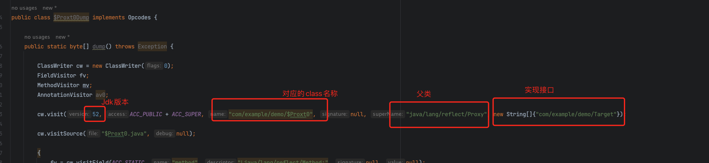


**1.测试类- 手动转成proxy对象**

```java
 				 byte[] dump = $Proxt0Dump.dump();
        FileOutputStream fileOutputStream = new FileOutputStream("$Proxy0.class");
        fileOutputStream.write(dump,0,dump.length);
        fileOutputStream.close();
```

**输出的文件对象：**

> *就是手写的代理类*

```java
public class $Proxy0 extends Proxy implements Target {
    static Method method;

    public $Proxy0(InvocationHandler h) {
        super(h);
    }

    public void bar() {
        try {
            this.h.invoke(this, method, (Object[])null);
        } catch (Throwable var2) {
            var2.printStackTrace();
        }

    }

    static {
        try {
            method = Target.class.getMethod("bar");
        } catch (NoSuchMethodException var1) {
            var1.printStackTrace();
        }

    }
}
```


##### 1.使用代码去生成代码

> 根据生成asm代码去生成我们要的代理类代码

```java
public class Test$Proxy0Dump {


    public static void main(String[] args) throws Exception {
        // 字节码
        byte[] dump = $Proxt0Dump.dump();
//        FileOutputStream fileOutputStream = new FileOutputStream("$Proxy0.class");
//        fileOutputStream.write(dump,0,dump.length);
//        fileOutputStream.close();

        // new 一个类加载器出来
        ClassLoader classLoader = new ClassLoader() {
            @Override
            protected Class<?> findClass(String name) throws ClassNotFoundException {
                return super.defineClass(name, dump, 0, dump.length);
            }
        };
        // 创建实例
        Class<?> aClass = classLoader.loadClass("com.example.demo.$Proxy0");
        // 类对象 反射 拿到类对象
        Constructor<?> constructor = aClass.getConstructor(InvocationHandler.class);
        B13 proxy = (B13) constructor.newInstance(new InvocationHandler() {
            @Override
            public Object invoke(Object proxy, Method method, Object[] args) throws Throwable {
                System.out.println("before");
                System.out.println("after");
                return null;
            }
        });
        // 调用目标方法
        proxy.foo();
    }
}
```


#### 变量知识点

| 变量类型 | 定义位置       | 默认值     | 在内存中的位置   | 生命周期                               |
| -------- | -------------- | ---------- | ---------------- | -------------------------------------- |
| 成员变量 | 类中，方法外部 | 有默认值   | 位于堆内存       | 方法进栈而存在，方法出栈而消失         |
| 局部变量 | 方法内         | 无默认值   | 位于栈内存       | 对象创建而存在，对象被回收而消失       |
| 静态变量 | 方法外部       | 具有默认值 | 位于方法的静态区 | 随着类的加载而加载，随着类的消失而消失 |


#### 8.CGlib代理进阶

##### 8.1 CGlib 代理原理

> CGlib：需要继承目标类
>
> JDK动态代理：需要实现接口

**目标类**

```java
public class Target {

    public void save() {
        System.out.println("save");
    }

    public void save(int i) {
        System.out.println("save--i");
    }

    public void save(long l) {
        System.out.println("save---l");
    }

}
```

**代理类**

```java

public class Proxy extends Target {

    MethodInterceptor interceptor;

    public void setMethodInterceptor(MethodInterceptor interceptor) {
        this.interceptor = interceptor;
    }

    static Method save0;
    static Method save1;
    static Method save2;

    static {
        try {
            save0 = Target.class.getMethod("save");
            save1 = Target.class.getMethod("save", int.class);
            save2 = Target.class.getMethod("save", long.class);
        } catch (NoSuchMethodException e) {
            throw new NoSuchMethodError(e.getMessage());
        }
    }

    @Override
    public void save() {
        try {
            interceptor.intercept(this, save0, new Object[0], null);
        } catch (Throwable e) {
            throw new UndeclaredThrowableException(e);
        }
    }

    @Override
    public void save(int i) {
        try {
            interceptor.intercept(this, save1, new Object[]{i}, null);
        } catch (Throwable e) {
            throw new UndeclaredThrowableException(e);
        }
    }

    @Override
    public void save(long l) {
        try {
            interceptor.intercept(this, save2, new Object[]{l}, null);
        } catch (Throwable e) {
            throw new UndeclaredThrowableException(e);
        }
    }
}

```


**执行方法**

> 使用了反射处理 去调用方法 执行增强

```java
public class A14CGlib {

    public static void main(String[] args) {
        Target target = new Target();
        Proxy proxy = new Proxy();
        proxy.setMethodInterceptor(new MethodInterceptor() {
            @Override
            public Object intercept(Object o, Method method, Object[] args, MethodProxy methodProxy) throws Throwable {
                System.out.println("before.....");
                // 使用反射 去处理
                Object invoke = method.invoke(target, args);
                System.out.println("after.....");
                return invoke;
            }
        });
        proxy.save();
        proxy.save(1);
        proxy.save(2L);
    }
}
```

结果输出：

```
before.....
save
after.....
before.....
save--i
after.....
before.....
save---l
after.....
```


##### 8.2 CGLib 代理原理-MethodProxy

> **MethodProxy 不使用反射，而直接使用代理处理**

**目标类**

```java
public class Target {

    public void save() {
        System.out.println("save");
    }

    public void save(int i) {
        System.out.println("save--i");
    }

    public void save(long l) {
        System.out.println("save---l");
    }

}
```

**代理类**

```java
public class Proxy extends Target {

    MethodInterceptor interceptor;

    public void setMethodInterceptor(MethodInterceptor interceptor) {
        this.interceptor = interceptor;
    }

    static Method save0;
    static Method save1;
    static Method save2;
    static MethodProxy methodProxy0;
    static MethodProxy methodProxy1;
    static MethodProxy methodProxy2;

    static {
        try {
            save0 = Target.class.getMethod("save");
            save1 = Target.class.getMethod("save", int.class);
            save2 = Target.class.getMethod("save", long.class);
            methodProxy0 = MethodProxy.create(Target.class, Proxy.class, "()V", "save", "superSave");
            methodProxy1 = MethodProxy.create(Target.class, Proxy.class, "(I)V", "save", "superSave");
            methodProxy2 = MethodProxy.create(Target.class, Proxy.class, "(J)V", "save", "superSave");
        } catch (NoSuchMethodException e) {
            throw new NoSuchMethodError(e.getMessage());
        }
    }

    //  >>>>>>>>>>>>>>>>>>>>>>>>>>>>>>带原始功能的的方法
    public void superSave() {
        super.save();
    }

    public void superSave(int i) {
        super.save(i);
    }

    public void superSave(long l) {
        super.save(l);
    }

    //  >>>>>>>>>>>>>>>>>>>>>>>>>>>>>>带目标增强的方法
    @Override
    public void save() {
        try {
            interceptor.intercept(this, save0, new Object[0], methodProxy0);
        } catch (Throwable e) {
            throw new UndeclaredThrowableException(e);
        }
    }

    @Override
    public void save(int i) {
        try {
            interceptor.intercept(this, save1, new Object[]{i}, methodProxy1);
        } catch (Throwable e) {
            throw new UndeclaredThrowableException(e);
        }
    }

    @Override
    public void save(long l) {
        try {
            interceptor.intercept(this, save2, new Object[]{l}, methodProxy2);
        } catch (Throwable e) {
            throw new UndeclaredThrowableException(e);
        }
    }
}

```


**执行方法**

> 不使用反射去增强

```java
public class A14CGlib {

    public static void main(String[] args) {
        Target target = new Target();
        Proxy proxy = new Proxy();
        proxy.setMethodInterceptor(new MethodInterceptor() {
            @Override
            public Object intercept(Object o, Method method, Object[] args, MethodProxy methodProxy) throws Throwable {
                System.out.println("before.....");
                // 使用反射 去处理
//                Object invoke = method.invoke(target, args);
                // 不使用反射 结合目标用
//                Object invoke = methodProxy.invoke(target, args);
                // 没有反射 结合代理使用
                Object invoke = methodProxy.invokeSuper(o, args);
                System.out.println("after.....");
                return invoke;
            }
        });
        proxy.save();
        proxy.save(1);
        proxy.save(2L);
    }
}
```

结果输出：

```
before.....
save
after.....
before.....
save--i
after.....
before.....
save---l
after.....
```


# 3、Web MVC


# 4、Spring Boot


# 5、其他

